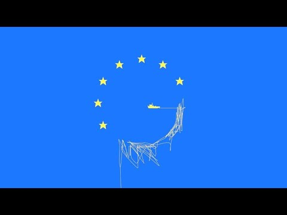

### AYS Weekend Digest 27–28/6/2020: Baby born on a dinghy was pushed back to Libya
#### Interceptions and push\-backs at sea // Statement by Carola Rackete on the anniversary of her act of civil disobedience // Concerns of Moria Corona Awareness Team // Call on EU to ensure safety of LGBTIQ person in Balkan corridor // New report on Bulgaria published // News about the tragic incident in Glasgow on Friday and the situation of the people held in hotels for over three months now

This baby was born on board a dinghy in the Mediterranean, ignored by European authorities and later pushed back to Libya\. Picture taken from Twitter of Sara Creta\.
### FEATURE: Being pushed back to Libya on the first day of your life

As we reported in our last Digest, one boat with 93 people on board was intercepted on Friday evening by the Libyan Coast Guard\. The interception was the endpoint of a long struggle over the rescue of the people in distress\. _Watch the Med Alarmphone_ contacted all maritime authorities at around 12am, informing them of the boat in distress\.

According to sources collected by different activists and journalists, various European military ships would have been close by\. However, no action has been taken until the so\-called Libyan coast guard arrived at around 11pm\. During this time, six people on the dinghy lost their lives\. If a European ship would have intervened, the rescued people would have to be brought to a European port of safety\.

> “Not intervening was a precise choice made by the Italian government and other European executives\.”

Says the Italian NGO _Mediterranea Saving Humans_ \.

The picture at the top of today’s digest shows a new\-born baby\. This baby was born on board the dinghy, next to six dying people, in the middle of the Mediterranean Sea and without any effort made by European ships to come to its help\. It is unclear what happened to the baby, her mother and the other people after the disembarkation in Khoms, Libya\. Since neither IOM nor UNHCR published any more detailed information, it is very likely that these people will again end up where they wanted to escape from: in the hands of militias, in detention, amid torture and forced labour\.

The journalist Sara Creta received these heart\-breaking messages from a person detained in a detention center in Libya:

■■■■■■■■■■■■■■ 
> **[Sally Hayden](https://twitter.com/sallyhayd) @ Twitter Says:** 

> > Refugee in Libyan detention centre asking why the EU is supporting interceptions on the sea & returns to Libya. Hundreds more were locked up in his dc this week.
"The Libyans don't care about us. Before the rooms were very small… they brought new people & now no place to sleep" https://t.co/ehWuL74Kcm 

> **Tweeted at [2020-06-28 10:26:54](https://twitter.com/sallyhayd/status/1277186706773618688?fbclid=IwAR3DJuEEaj2p7c66TGqLcrF2h-GDrbJhxbhFfP60q9Qn9SFGwZtCkidXWrA).** 

■■■■■■■■■■■■■■ 

_Mediterranea Saving Humans_ further reported that its rescue ship _Mare Jonio_ has been approached by a boat of the so\-called Libyan Coast Guard several times on Sunday\. Apparently the Libyan Coast Guard’s boat was on a mission to intercept a boat in order to bring the people on board back to Libya\. The militiamen threatened the crew of the Mare Jonio to change their course and move away from that stretch of sea in which they expected the boat in distress to be\.
### Let’s not forget that the EU is financing the Libyan Coast Guards\. These actions of externalization are happening on behalf of Europe\.

On Sunday, another 184 people have been returned to Libya\.

■■■■■■■■■■■■■■ 
> **[IOM Libya](https://twitter.com/IOM_Libya) @ Twitter Says:** 

> > 🚨 Breaking: 184 migrants, among them 14 women and 11 children, were returned to Tripoli #Libya by the coast guard. 

IOM staff are onsite to provide emergency assistance. https://t.co/qzn02HNqAS 

> **Tweeted at [2020-06-28 20:05:31](https://twitter.com/IOM_Libya/status/1277332322040324096?fbclid=IwAR1U4T_4i046h61j_37IUxJDuw-0LrCCNlD-eWqimhsr8g64Zjc6kqfE3Fw).** 

■■■■■■■■■■■■■■ 

### GENERAL
#### DEFUND FRONTEX and the Libyan Coast Guards\!

One year has passed since the captain of the rescue ship _Sea Watch_ , Carola Rackete, committed an act of humanitarian civil disobedience when entering the port of Lampedusa on June 29th 2019 without permission in order to end the unbearable situation for the rescued people on board her ship\. In a statement now published on Twitter she explained that she would not give any interviews on this anniversary, as she does not, as a white and privileged person, wants to be the one who is portrayed as a hero\. Instead, she calls out the racist border policies of the EU, enforced by Frontex\.

> “All EU citizens should know: Those people who are drowning in the Mediterranean — at least 96 deaths within this month — are not the victims of an unexpected accident or a natural disaster\. They drown because the European Union wants them to drown, to scare those who may attempt to cross\.”

While we fully support Carola’s wish not to be portrayed as the white saviour in this story, we still regard her as a strong inspiration and support her call to **Defund Frontex\!**

Find her full statement here:

In order to make the voices of these marginalized people heard Carola will host a panel today at 4pm under this link:

Various other Webinars will take place during the week\. Find more information here:

### GREECE

_Moria Corona Awareness Team_ published a statement in which they express their concern and anger about the current situation\. While most of Europe is going back to normal with cafes being full of guests and even tourists arriving to Lesvos, the people in Moria are still locked in and only few precautions have been taken in order to prevent the virus from spreading in the camp once it enters\.

> “We know we cannot make much, our voices are not heard, but we ask everyone who plans to come especially the ones coming here because of us to be very very careful, because if this virus comes to our camp we will face a very very serious situation\. 

> And it’s not only about us but all the people living on this island who are in need of the few quarantine beds in the hospitals\. And we know especially in the villages there are many old and vulnerable persons on this island\.”

From MCAT, Facebook

The Greek Asylum Service has issued an announcement, that all white cards that expire between 1st of June and 30th of September and have not been renewed, are automatically valid until 1st of October\. On 1st of October, a new electronical system will be introduced\.
Information about white cards can be found here in Farsi, Arabic, Sorani, Urdu, French and English, or on the Facebook page of _mobile info team_ \.

A group of young refugees in Moria are bringing education and a smile to kids in the camp and compensate for the shortcomings of the EU and Greece:

■■■■■■■■■■■■■■ 
> **[Mare Liberum e.V.](https://twitter.com/teammareliberum) @ Twitter Says:** 

> > But a group of #refugees refuses to accept the shortcomings of these EU & Greek policies of deprivation & organizes classes + activities for children once a week. Today we visited the open-air-school and saw how they work tirelessly to put a smile on up to 300 kids faces 🧡🧡🧡 https://t.co/e1l6IRIiHL 

> **Tweeted at [2020-06-27 15:01:03](https://twitter.com/teammareliberum/status/1276893311056457728).** 

■■■■■■■■■■■■■■ 

No news was given yet about the boat in distress off the coast of Lesvos that Alarmphone tried to raise awareness about on Thursday, 25th of June\. There is no information about the people arriving to Lesvos either autonomously or after being rescued by the Greek Coast Guards\. However, as Alarmphone reports, Turkish Coast Guards claim to have seen a rescue taking place\. The fact that the Greek Coast Guards do not verify this information makes it very likely that instead of bringing the people to Lesvos after rescuing them, the Greek authorities brought them back into Turkish waters\.

■■■■■■■■■■■■■■ 
> **[Alarm Phone](https://twitter.com/alarm_phone) @ Twitter Says:** 

> > 30 people cannot just disappear! The Turkish Coast Guard confirmed twice that they witnessed @[HCoastGuard](https://twitter.com/HCoastGuard) vessel 080 conducting rescue at 7:30 am CEST today. The Greek Coast Guard does not confirm this information. We have lost contact to the boat since yesterday night. 

> **Tweeted at [2020-06-26 16:03:31](https://twitter.com/alarm_phone/status/1276546643341520896).** 

■■■■■■■■■■■■■■ 

### BALKANS

Trans\-Balkan Solidarity and the Trans\-Balkan Network want to raise awareness for the reality of LGBTIQ people along the Balkan corridor\. LGBTIQ people suffer specific repression in many countries in the world, which often forces them to leave home\. But also in Europe they often belong to the most vulnerable group of people, without any protection addressing the special risks and needs they are facing\. With a 48\-hour rainbow flag raising protest the Network want to call on EU funded organizations and the EU itself to organize functioning protection mechanisms and adequate shelters for LGBTIQ people along the entire Balkan route\.

For more information, see:

Members of _SOS Balkanroute_ handed the _Border Violence Monitoring Network’s_ report about border violence along the Balkan corridor over to various German and Austrian Members of Parliament\. The 1673 page report collects testimonies of 500 violent push\-backs at the Croatian border alone\. By handing these documents over to politicians, the activists want to make sure that the topic is not left aside\.

Elke Kahr, KPÖ Graz, Austria and Gregor Gysi, DIE LINKE, Germany, together with a member of SOS Balkanroute\. Copyright: Peter Brandstetter
### BULGARIA

_Bordermonitoring\.eu_ published a new report on the situation of people on the move in Bulgaria\. 
For many years now, Bulgaria has been using massive violence in order to stop people from crossing the border from Turkey\. The practice of violent and illegal push\-backs, including robbery of money, mobile phones and even food, can be found all over Europe today\. Bulgaria was one of the first countries to massively rely on this practice\. Many human rights organizations and official EU representatives have warned about this situation for years\. 
Since 2016 a new tactic is being conducted, that relies on the cooperation between the Turkish and the Bulgarian border authorities\. In so called Pull\-backs, people are being prevented from getting close to the border and eventually cross it already in Turkey by Turkish border authorities\. According to Turkish authorities, some 90,000 people were stopped in the Turkish border region Edirne in 2019\. The report assumes that, after the failed coup in 2016, Turkey’s interested to stop those in opposition to the government from crossing the border lead to the cooperation in the pull\-back actions\. In turn, Bulgaria is very willing in returning Turkish citizens back to Turkey\. Asylum requests by Turks in Bulgaria had a disapproval rate of 100% in 2018 and 2019\. The scope of the cooperation between the two countries becomes obvious when looking at the events in March 2020, when Turkey announced that it would support people’s movement into Greece\. While the Greek\-Turkish land border was soon the hotspot of the growing tension between Turkey and the EU, visited by von der Leyen and, very likely, “protected” with the use of lethal weapons leading to the death of at least one person \(see report FA\) , the situation at the Bulgarian\-Turkish border remained calm\. 
The report further speaks about extreme\-right vigilante groups who patrol in the border region in Bulgaria; about the deaths of people on the move, often in direct connection with previous push\-backs; about detention, which is the norm for most people who get arrested and then file an asylum application while in detention; about the failure to provide access to remedy; and about the conditions of arrest\.

The now published report is an update to the report on Bulgaria from 2014\. 
For the full report in German, see:

### ROMANIA

Border violence also continues to occur at the Romanian\-Serbian border\. _No Name Kitchen_ collected testimonies of people who have been violently pushed back from Romania to Serbia in the recent days\. Amongst the victims was a family, consisting of a young man, his sister and the mother\. The three of them were intercepted by Romanian officials when moving towards a bigger city, after spending 24 hours in the forest\. The subsequent push\-back followed the typical pattern: the young man was gravely beaten, leaving his nose badly injured, money was taken from the family and their phones were broken\.

The interview was conducted in Šid, a town in Serbia where many people pass though when traveling the illegalized Balkan corridor\. The testimony will be part of _Border Violence Monitoring Network_ ’s monthly report\.
### SERBIA

Restrictions to the camps due to COVID\-19 make it hard for the volunteers of _No Name Kitchen_ to stay in contact with people in the camp and to know what their needs are\. The people in the camps still need special permissions whenever they want to leave the camp\. The team also cooks for the people who live in the surrounding forests in order to make their life just a little bit easier\. Due to closed borders it is much more difficult for the NGO to receive donations like clothes, sleeping bags, tents and shoes\. 
Please consider supporting _No Name Kitchen_ and the important work they are doing with providing food and collecting testimonies of victims of border violence\.

### ITALY

A group of 28 Tunisian nationals arrived at Lampedusa\. They were picked up by a Coast Guard vessel and brought to a hotspot in Imbriacola district\.
### SPAIN

The Sea rescue service \(SASEMAR\) rescued a total of 1,807 migrants adrift at sea trying to reach Spanish coasts during the State of Alarm decreed by the coronavirus pandemic\. According to data from this entity provided to Europa Press, 70% of the rescues occurred in the Canary Islands, the only irregular access route to Spain during this period has experienced an increase\.

A total of 70 people of North African origin have been transferred this Sunday to the port of Almería after being rescued from various boats where they were sailing in the Alboran Sea or after reaching the coast by their own means\.
### FRANCE

The support network Solidarité migrants Wilson is looking for volunteers to help with cooking, distributing, and cleaning on June 30th\. The group is based in the Avenue du Président Wilson in Saint\-Denis, north Paris\. If you consider helping, please inform them in advance in order to make sure that the group is not too big to keep physical distancing\. Check out their [Facebook page](https://www.facebook.com/Solidarit%C3%A9-migrants-Wilson-598228360377940/) \.
On Sunday, the group plan to meet at an unofficial camp at Pont du Landy in order to clean up the site together with the residents and at the same time denounce the inactivity of the municipality\.

France has been sentenced by the European Court for Human Rights for the expulsion of two Comorian children in 2013, who entered the French overseas region of Mayotte illegally\. In the expulsion of the three and five year olds, the Court found seven different violations of the European Convention of Human Rights\. The two kids were born in Mayotte to a mother without a regular permit and a father with a regular permit\. The mother was sent back to Comoros in 2011 together with the children, but came back shortly after while leaving the children with their grandparents\. When the makeshift boat on which the children were put in order to get to their parents was intercepted in 2013, the children were put in detention and were then sent back, without any chance to see their parents\. 
In 2019, more than 27,000 people were returned to the border in Mayotte, 99% of them to neighboring Comoros, according to prefectural authorities\. 
For more information in French, see:

### UK

On Friday a tragic incident happened in Glasgow\. A 28 year old man was shot dead by police officers after he attacked and injured various people with a knife\. The man was living in temporary asylum seeker accommodation in a hotel, together with around 100 others\. At the beginning of the corona pandemic, about 400 asylum seekers were moved from their private accommodations into six hotels in Glasgow city center\. The relocation was conducted by the private housing provider Mears who is under contract with the Home Office and organizes the accommodation in the hotels\. According to the Home Office, this step was made in order to protect the refugee population from the virus\. However, concerns about their situation have been raised by NGOs like _No Eviction Glasgow_ and others for three months now\. Since the people in the hotel are provided with three meals a day, the weekly payment of £35 was stopped\. This means that the people had no financial means whatsoever, i\.e\. for buying top\-ups for their phones, which is obviously necessary to stay in contact with family and friends, but also with lawyers or support networks\. Concerns have also been raised about the quality of the food\. Just imagine not being able to buy and cook your own food for three months, but having to rely on undercooked or mouldy food\. 
The main concern may still be the state of mind people are in, after losing all their autonomy and living in a hotel room for three months, without any money to allow for the slightest bit of distraction\. It should not be forgotten that these people come from war\-torn countries and have experienced traumatizing events\. They are engaged in processes of asylum applications or others, which causes an extra level of stress\. Apparently, individual vulnerabilities have not been assessed before the people were moved to the hotel\. In May, a man from Syria was found dead in his room\. He had been expressing suicide thoughts before, but nothing was done\. 
The man who attacked staff members, other residents and a police officer with a knife on Friday had also been struggling with his mental health\. According to the Guardian newspaper, the staff of the hotel were told of his erratic behaviour and concerns about his mental health state the night before the attack\. By leaving some autonomy and privacy to the people and providing basic mental health support, this tragedy would most probably have been prevented\. Instead of actual mental health support, leaflets with mental health information have been handed out to the people\.

Here you can find a statement by No Evictions Glasgow:

■■■■■■■■■■■■■■ 
> **[No Evictions Network](https://twitter.com/no_evictions) @ Twitter Says:** 

> > @[no_evictions](https://twitter.com/no_evictions)' statement in response to the events of Friday 26th June. Our thoughts continue to go out to the victims, their families and all those affected by these events. https://t.co/z6GppcACTl 

> **Tweeted at [2020-06-28 14:36:09](https://twitter.com/no_evictions/status/1277249433676242944).** 

■■■■■■■■■■■■■■ 

The situation in the city is strained, after members of the far\-right National Defence League disrupted a protest by No Evictions Glasgow over the living conditions of asylum seekers in hotels\.

For further reading, see:

### DENMARK

Around 900 recognized Syrian refugees in Denmark may lose their residence permit\. The Danish Integration Minister Mattias Tesfaye has decided that the Immigration Service shall speed up the processing of residence permit cases for hundreds of people from the Damascus area in Syria\. He claimed, that since many people who fled from the Damascus region into neighbouring regions or countries have returned back home, also people who fled to Europe are no longer in need of protection\. After the Refugee Board has ruled in five cases that people from this region are not entitled to international protection, Tesfaye aims at evaluating other cases of people from the same region\. 
However, this change in policy does not mean that people will be forcibly returned to Syria, as the government of Denmark is not cooperating with Assad’s Syria\.

For more information in Danish, see:

**Find daily updates and special reports on our [Medium page](https://medium.com/are-you-syrious) \.**

**If you wish to contribute, either by writing a report or a story, or by joining the info gathering team, please let us know\.**

**We strive to echo correct news from the ground through collaboration and fairness\. Every effort has been made to credit organisations and individuals with regard to the supply of information, video, and photo material \(in cases where the source wanted to be accredited\) \. Please notify us regarding corrections\.**

**If there’s anything you want to share or comment, contact us through Facebook, Twitter or write to: areyousyrious@gmail\.com**

_Converted [Medium Post](https://medium.com/are-you-syrious/ays-weekend-digest-27-28-6-2020-baby-born-on-a-dinghy-was-pushed-back-to-libya-33a3d6768d8d) by [ZMediumToMarkdown](https://github.com/ZhgChgLi/ZMediumToMarkdown)._
