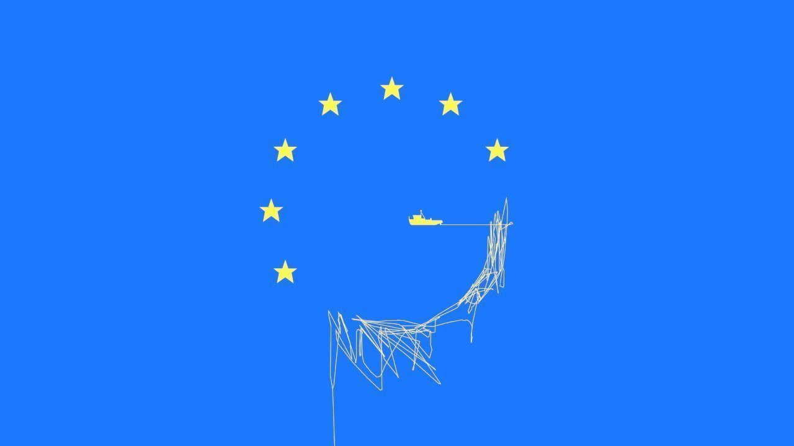
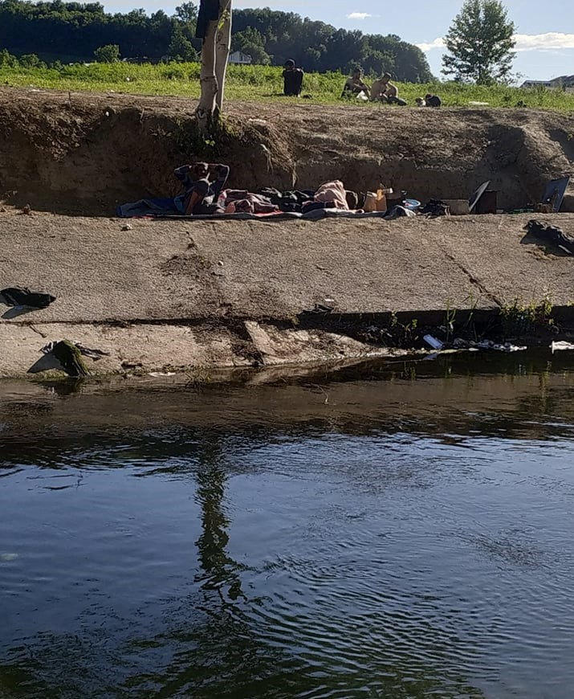
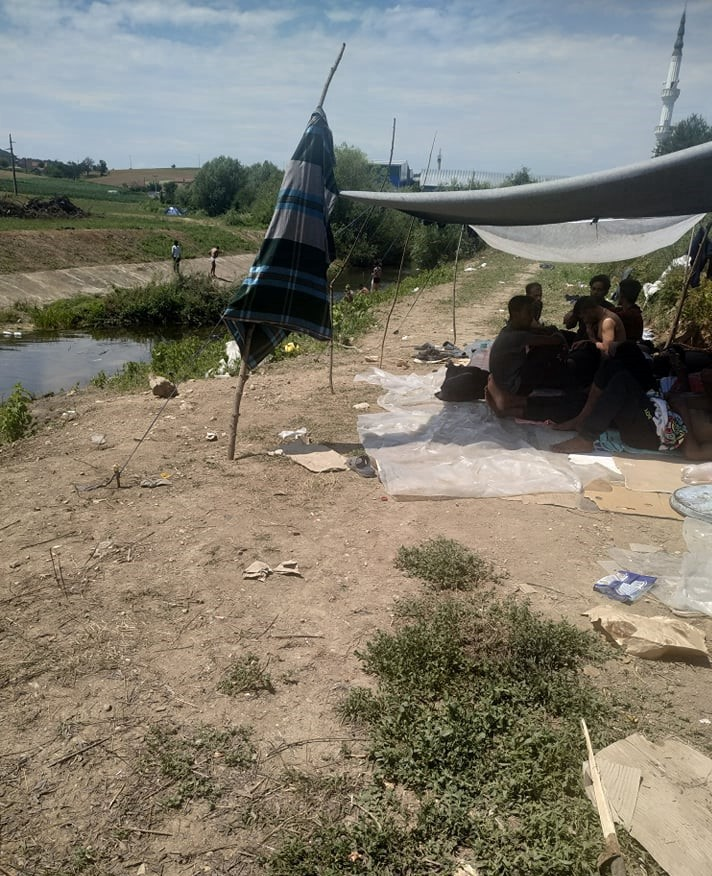

### AYS Daily Digest 29/06/2020 — Increased surveillance planned in the Mediterranean

[Are You Syrious?](@AreYouSyrious?source=post_page-----accca6c97536----------------------)

[Jun 30](ays-daily-digest-29-06-2020-increased-surveillance-planned-in-the-mediterranean-accca6c97536?source=post_page-----accca6c97536----------------------) · 13 min read

Six\-fold increase in arrivals in the Canary islands / 43 people rescued in the Central Med / Protest in El Aaiun detention centre, Western Sahara

### Feature story: Increased surveillance planned in the Mediterranean

The militarisation of European borders saw a sudden increase due to Covid\-19\-related movement restrictions\. Researcher Mark Akkerman has [analysed](https://crisismag.net/2020/06/27/how-the-arms-industry-drives-fortress-europes-expansion/amp/) the long\-term causes of such increases, and how the militarisation and the externalisation of EU borders pose a threat to the stability of many African countries\.

> _In March, April, and May of this year, multiple European countries deployed military forces to their national borders\. \[…\] [Poland](https://www.thefirstnews.com/article/over-5200-polish-soldiers-mobilised-against-coronavirus--minister-11474) deployed 1,460 soldiers to the border to support the Border Guard and police as part of a larger military operation in reaction to Covid\-19\. And the [Portuguese](https://www.macaubusiness.com/portugal-police-use-drones-to-monitor-border-with-spain/) police used military drones as a complement to their land border checks\. According to [overviews](https://shape.nato.int/news-archive/2020/allied-nations-support-covid19-battle--weekly-roundup) from [NATO](https://shape.nato.int/news-archive/2020/allied-nations-support-covid19-battle--weekly-roundup-3.aspx) , the Czech Republic, Greece, Latvia, Lithuania, the Netherlands \(military police\), Slovakia, and Slovenia all stationed armed forces at their national borders\._ 

> _\[ … Such efforts\] are part of the continuing [militarisation](https://stopwapenhandel.org/borderwars) of European border and migration policies, which is known to put refugees at risk but is increasingly being expanded to third party countries\. Successful lobbying from the military and security industry has been an important driver for these policies, from which large European arms companies have benefited\._ 

While the EU\-wide surveillance system Eurosur is one of the results of such lobbying, the EU is continuously funding Research & Technology [projects](https://statewatch.org/marketforces/) to develop new technologies and services to monitor and manage migration, some of which are far removed from the physical borders of the Union and the continent\.

> _This [externalising of borders](https://www.tni.org/en/node/24178?content_language=en) has taken many forms, from expanding the goals of [EUCAP missions](https://www.consilium.europa.eu/en/press/press-releases/2015/05/13/eucap-sahel-niger/) in Mali and Niger to include the prevention of irregular migration, to [funding and training](https://www.independent.com.mt/articles/2020-04-24/world-news/EU-shores-up-Libyan-coast-guard-amid-Covid-19-scare-6736222407) the Libyan Coast Guard to return refugees back to torture and starvation in the infamous detention centers in Libya\. It also includes the donation of border security equipment, for example from [Germany to Tunisia](https://digit.site36.net/2017/12/20/germany-funds-new-border-control-technology-in-tunisia/) , and funding for purchases, such as Turkey’s [acquisition](https://ec.europa.eu/commission/presscorner/detail/en/IP_16_1908) of coast guard vessels to strengthen its operational capacities\._ 

Activist Mathias Monroy revealed the last steps of the process of strengthening and externalisation of EU’s southern border\. [In a detailed article](https://digit.site36.net/2020/06/28/eu-pays-for-surveillance-in-gulf-of-tunis/) , he shows how a new monitoring system for Tunisian coasts — ‘Integrated System for Maritime Surveillance’ \(ISMariS\) — implemented by Italian authorities and funded by the EU Emergency Trust Fund for Africa will be used to counter irregular migration across the Mediterranean\. As we have now reported countless times, EU member states routinely refuse to provide support to boats in distress, preferring to leave interception to the coast guards of Libya and Tunisia, while providing them wih assistance to bring people on the move back to the north African countries\. This is only one among many similar projects funded by the [‘EU4BorderSecurity’](https://www.euneighbours.eu/en/south/stay-informed/projects/eu4bordersecurity-project) initiative in the Med\.

ISMariS is composed of a tracking system for vessels at sea, a Coastal Surveillance System, and a communication system, which is “perhaps the most important component of ISMariS for the EU”, because it will improve operational cooperation between the Tunisian Coast Guard and Navy with Italy and other EU Member States\. It also opens up to further collaboration with Frontex, within the EUROSUR framework, which has recently been upgraded\.

In the past several years, the Tunisian coast guard has received boats, equipment and training from German, Italian and US authorities\. In particular, the role of the Vienna\-based International Centre for Migration Policy Development \(ICMPD\) — now partly controlled by German authorities — is key to understanding Germany’s role in this context\.

> _The German Foreign Office has also supported projects in Tunisia within the framework of the ICMPD, including the establishment of border stations and the training of border guards\. Last month Germany [finally joined the Institute itself](https://www.andrej-hunko.de/start/download/dokumente/1493-deutscher-beitritt-zum-international-centre-for-migration-policy-development/file) \. For an annual contribution of 210,000 euro, the Ministry of the Interior not only obtains decision\-making privileges for organizing ICMPD projects, but also gives German police authorities the right to evaluate any of the Institute’s analyses for their own purposes\._ 

Read the two articles in full:
- [Mark Akkerman, _How the arms industry drives Fortress Europe’s expansion_](https://crisismag.net/2020/06/27/how-the-arms-industry-drives-fortress-europes-expansion/amp/)
- [Matthias Monroy, _EU pays for surveillance in Gulf of Tunis_](https://digit.site36.net/2020/06/28/eu-pays-for-surveillance-in-gulf-of-tunis/)

LIBYA
### Nine more bodies uncovered in mass grave in Tarhuna

[Libyan officials have confirmed](https://libyaneagle.com/?p=10948) that nine bodies were uncovered in Tarhuna, 90km south of Tripoli\. Search efforts started on June 5, and a total of 19 bodies have been exhumed\. The area was controlled by Khalifa Haftar’s Libyan National Army\.

Another mass grave in Libya, more lives killed in total impunity\. Is there still any doubt as to whether Libya is a safe country or not?

MOROCCO
### Protest in El Aaiun detention centre

[A protest broke out](https://www.elsaltodiario.com/equipe-media-sahara/las-protestas-de-inmigrantes-subsaharianos-en-el-aaiun-ocupado-revelan-la-critica-situacion-de-su-internamiento) last week in the El Aaiun migrant detention centre, in the disputed Western Sahara region, against institutional abuse by Moroccan authorities and the abandonment of detainees\.

Protestors revealed the humiliating conditions in which people on the move are forced to live\. People have been arrested for ‘ [bringing the coronavirus into the country](https://www.publico.es/sociedad/marruecos-coronavirus-marruecos-encierra-migrantes-centros-sahara-base-pan-leche-acusarlos-propagar-virus.html) ’\. Milk and bread is the only food distributed by authorities, and work conditions are slavery\-like\. Moroccan security forces responded by breaking up the protest in full riot gear\.

SEA
### 43 people rescued by Mar Jonio vessel

On Monday morning, the Mare Jonio [completed a rescue operation](https://web.facebook.com/Mediterranearescue/posts/611403322814229) in the Libyan SAR area, approximately 40 miles north of Zuwara\. A total of 43 people, including women and minors, were aboard a boat in distress and are now on board of the Mediterranea saving lives sailboat\.

They now join the 117 people still on board Ocean Viking, waiting for a safe port to disembark\. On Monday evening one man was [evacuated for medical reasons](https://twitter.com/SOSMedIntl/status/1277720694546223104) \. He was transferred on an Italian coastguard vessel in international waters off Lampedusa\.
### Sea\-Watch’s aircraft Seabird is now operative

CYPRUS
### Number of asylum seekers has quadrupled since 2016

[Media report](https://www.spiegel.de/politik/ausland/fluechtlinge-in-zypern-das-schlupfloch-a-74f5b21d-1a86-43e7-9619-8f6832a816c7?fbclid=IwAR26-z6v0TDDHb6g3WWVOVTb-ypBtmkCup9ZykM6P84fI_yk8uRCOo2If1M#) that 13,259 people applied for asylum in the Republic of Cyprus in 2019\. Per capita this is by far the highest rate in the European Union\. In 2020 this could account for 3\.8 percent of the Cypriot population\. Extrapolated to the population of Germany, that would correspond to a good three million people\.

The island is one of the loopholes along the closed European borders as the green line is only patrolled by UN personnel — this is the border between the Turkish Republic of Northern Cyprus, only 100 km from the Syrian coast, and The Republic of Cyprus in the South where mainly Greek Cypriots live and which is an EU member\. Vigilantes occasionally patrol in one place along the green line, also increasing the risk for people crossing\.

The government of the Republic of Cyprus now wants to shorten asylum procedures, allow fewer foreign students to enter the country and hold people in camps for much longer\. It may take a long time for Cyprus to establish an asylum system that works smoothly\. A few months ago, only nine officials worked in the responsible asylum office to decide on applications\. Soon there will be 45\.

The need for clothing and accommodation is increasing every day\. The state is overwhelmed\. There is also no plan for how to integrate people\. The government cannot close the border, because it still seeks unification, but it makes every effort to ensure that migrants are not given additional incentives to enter the country\. The state only pays asylum seekers 100 euros a month for the duration of their procedure \. The money goes directly to the apartment owners\. In addition, you receive 70 euros and this must cover heating, the Internet and everything else\. While your application is pending, work possibilities are limited by the government, you may work in the fields or as a garbage collector\. A large part of the asylum applications are rejected by the authorities\. In the event of a rejection, you only have four weeks to understand the decision and to appeal to the court\. The UNHCR is concerned that the new law, with its strict deadlines, could make it difficult for asylum seekers to access legal counsel\. The migrants often have no access to a lawyer\. Without one, it would be difficult to understand the authorities’ decision and convince a judge in a foreign language within a few days\. Corona has also made racism worse in the country\.

GREECE
### Four people missing, presumed drowned after push back

> _A boat carrying 39 people was reported in distress west of Çiplak Ada, Ayvalik, Turkey\. The Turkish coast guard picked up 35 people at 02\.45 in the sea, and four people are missing, believed to be drowned\. Rescue operations are ongoing to try to find the four that are believed to be missing\. The nationality, age and gender of the missing have not been revealed\. — [Aegean Boat Report](https://web.facebook.com/AegeanBoatReport/posts/864260654097040)_ 

A full report by DW about the escalation in push backs in the Aegean can be read [HERE](https://www.dw.com/en/greece-refugees-attacked-in-the-aegean/a-53977151?fbclid=IwAR3rJdf0dY0MfqbZQyxxBOAr8igeGolS7_Vuq-8cfU0gwxqOt3e1vRKHPMA) \.
### Situation in Greece diabolical and getting worse

[Mare Liberum report](https://mare-liberum.org/en/news/wird-moria-zu-einem-geschlossenen-lager/?fbclid=IwAR2EYgENm6tF23K_QnoiY-MprMEbMMSJDjXZ1UfeFTWp_aynTWpLqC12knk) on the continued disintegration of effective procedures in Greece and the many pressures experienced by people facing eviction from camps and ESTIA housing\.

> _A woman testified that for her this pressure was just one blow among too many already\. In spite of obtaining international protection, after all these months of suffering, violence and fear in Moria, she decided to end her life\. Her friends intervened in time and she spent four days in the hospital to recover\. Today she is crying at the thought of leaving for Athens: no time to prepare, nowhere to stay, the loss of the few but close friends and support structures here on the island, another jump into the unknown without any social anchor\._ 

**As we have previously reported, and as we will continue to do so — THIS IS NOT A SOLUTION\.**
### Report on Megala Therma quarantine structure

[Local media report](https://stonisi.gr/post/9786/treis-me-koronoio?fbclid=IwAR2gIyF9jbz67lZlEC76hu1Eltw4mn9iLzDYdJrXL_r29AMboudpj6VJ0Ic) that three people with coronary heart disease who were originally tested negative are now positive for COVID\-19 but are as yet asymptomatic\.

> _The three are part of a group of refugees and migrants rescued by a Coast Guard boat on June 14 and transported to the port of Petra\. During the inspection by EODY, a person who was positive for the virus was found, while all the others were negative, as well as the officers of the Coast Guard and those who had come in contact with them during their rescue\. During their re\-examination, in order to determine whether they were all healthy in order to be transferred for registration at the Moria Central Hospital, the positive during the previous test was negative, while three negatives on June 14 were now positive but asymptomatic\._ 

The structure has been placed in a 14\-day quarantine\.
### Refugees4Refugees need volunteers on Samos

> _We’re looking for dedicated [\#volunteers](https://web.facebook.com/hashtag/volunteers?__eep__=6&epa=HASHTAG) aged 20\+ with prior experience in the refugee context who can commit a minimum of 2 months of their time to support our work on Samos\. As a volunteer, you will have a vital role in ensuring we can continue to distribute essential items to the population of the camp…_ 

More info [HERE](https://web.facebook.com/Refugee4Refugees/photos/a.317155631961452/1255207374822935/?type=1&theater) \.
### Investigation into the shooting at the Northern Border is ongoing

[MEP Tineke Strik](https://twitter.com/Tineke_Strik/status/1277573753577357313?fbclid=IwAR1WjNBPZV986DcWW5N-CnhlOnCtMOfH4OWN0v3JN5afn4PaAZ0nrBrLRUg) has requested the Greek minister and the involved EU Commissioners to appear before the LIBE committee \( [the Committee on Civil Liberties, Justice and Home Affair](https://www.europarl.europa.eu/committees/en/libe/about) \) on 6 July to clarify the deadly shooting at the Greek border\.

> _No stone should be left unturned\. Deadly violence against refugees in unacceptable in Europe\._ 

Greece continues to [deny the shooting](https://groenlinks.nl/nieuws/openbare-hoorzitting-om-dodelijke-beschietingen-asielzoekers-aan-grieks-turkse-grens?fbclid=IwAR0GWtPsrEHib_bMyq3CRSFSoZmlpXvSm618s8drqvoJuIrwZKunhX6Mu7k) despite multiple reports to the contrary\.

MALTA
### Neville Gafa threatens Italian journalist

As [reported](https://newsbook.com.mt/en/international-journalist-brushes-off-gafas-threats/) by several media, Neville Gafa, former collaborator of the Maltese Prime Minister’s office, resorted to Twitter to threaten Nello Scavo, an Italian journalist, who in the last months uncovered the serious violations of both Italian and Maltese authorities in the name of curbing migration flows, especially through supporting the Libyan coast guard\.

ITALY
### Arrivals
### 45 people arrive in Sardinia

Four small boats arrived in southern Sardinia\. The first carrying 19 people, the second 8 \(both of them in Porto Pino\), the third arrived in Tulada with six people and the fourth in Cala Cipolla, carrying 12 people\. Media [report](https://www.today.it/cronaca/migranti-sbarchi-sardegna-2020-algeria.html) that they are all men and were all intercepted by police forces and moved to the Monastir reception centre\. They are likely to have set off from Algeria’s coast\. The route between Algeria and Sardinia saw stable numbers since 2015\.

SPAIN

**Six\-fold increase of arrivals in the Canary islands in 2020**

Spanish media [report](https://english.elpais.com/society/2020-06-29/spains-canary-islands-struggling-to-cope-with-rise-in-migrant-arrivals.html) that local non\-governmental organisations on the islands are struggling to cope with the large number of arrivals in the last few months\. The central government is refusing to support new arrivals, and local NGOs are providing food and accommodation only thanks to donations from islanders and local authorities\.

> _The migration route to Spain’s Canary Islands, an archipelago located off the coast of northwestern Africa, was reactivated toward the end of last year\. Around 2,698 would\-be migrants arrived, but that was double the figure for 2018, and meant the reopening of a path that was closed around a decade ago\._ 

> _During the first six months of this year, arrivals compared to 2019 have increased sixfold\. Attempts to reach Spain via the southern coast, meanwhile, are falling\. The islands of Gran Canaria and Fuerteventura are under the most pressure right now\._ 

BOSNIA AND BALKANS
### Worsening situation in Velika Kladusa

[No Name Kitchen report](https://web.facebook.com/NoNameKitchenBelgrade/posts/1014390678959216?hc_location=ufi) on the situation\.

Their vouchers4food project, gave vouchers for 983 servings of food last week alone\.

We estimate that there are between 400 and 500 people living outside the official refugee camp\. The camp is overcrowded and people are prohibited from entering and exiting, so no more people are being accepted\.

\[…\]

We have to remember that we are talking about people who arrive exhausted after walking for hundreds of kilometers \(since the end of 2018, the canton of Una Sana does not allow people in transit to use public transport unless they have a specific document that very few people have\) \. Additionally, in many cases these people arrive without money, since they have already spent it along the way\. It is a journey that lasts for years\.

Since police evicted the abandoned factory where hundreds of people were living, burning people’s belongings in the process, there is no longer a set meeting place\. Many others arrive deported from Croatia — exhausted, beaten, without clothes, without money, and without a mobile phone\. There are no showers or washing facilities\.

We need to tell something to people in transit: if you text us and you do not get a fast reply, we are very sorry for it\. It is overwhelming the number of messages we get\.

We need the European Union to allow people to migrate or claim asylum in a legal and safe way\. We need a fairer border policy\. But as we continue to work to be heard, we need your donations: [http://www\.nonamekitchen\.org/en/help\-us/](https://l.facebook.com/l.php?u=http%3A%2F%2Fwww.nonamekitchen.org%2Fen%2Fhelp-us%2F%3Ffbclid%3DIwAR1yr-vww1MO6fKr-Eeyhn8ShbZ8UbXgjLBjh1I18G95S7mBdDz5VeHAzA4&h=AT074BEVlimjZ3V26pP8LraOqJbMERT7s1LPoK9A4N664ZJTJtYYB3kqnMD9rdCndFF2iKhl0pUIFgYNKJGLqQS07QMgghgUKGGJi9Tbnp35T--oh2m6vbe7qsd9xDReCiN3rbLE0aQLxGEpReKisa6yiX6Hh3uZ9XgIKm4227IbRPn4spz0onaoJDgdnZKlK_gLwIWx8aR19Xqxb3cAYiuAWGeNbYaqwzccaojWi01E_CaSL_1CU3KseAZOwIfHYE_YcFkeGFndR6Ett2DJf51_j9w3gjiI_Az9o4fzQSsZh9tNSaMT2gpRgIyq8LqcyCZQLxuTNEF8RohFJg-YUGG4dxNzZCfNObwTWoXDpw04p2CEFkuo1-iLmz8MhRFdnZ9BcqH9_f1we3UmcOeWhr1TqKNuQz4phFeiNHrBtaAKo9JiayqT2zd8z3xusEovcx0eMmZIzm4OxcXDHZP-0ML9wSw6I82wTGgvbMm4U3xnt2W1qiO7yhwZXXmqIJgIKhWZg52ohCmh8kIcOmzFrld58I-Lh-sITei9p7Nd7CjnDZj6vDMMPQQjybSdBEiaO0jXFNuADrKCLyFuSXRq9KzmlGPPTFbBUDw57clHXlrQ0-WjP7B57rgZ4dBN-QZyPwg)

**Number of registered asylum seekers rose in May in the western Balkans**

[Media report that](https://www.nezavisne.com/novosti/bih/150-odsto-povecan-broj-zahtjeva-za-azil-na-zapadnom-Balkanu/607267?fbclid=IwAR2qVNCB0CN3AZ5pX5ttTfTe5gKIod97EAbaR-eSb0KReqB27SuopjyrW88) the number of migrants registered to seek asylum in the western Balkans increased by as much as 150 percent in May compared to the previous month, according to a report released by the Office of the UN High Commissioner for Refugees\.

At the same time, as they pointed out, the number of newly arrived migrants increased by 148 percent compared to the previous month\.

According to their data, in May, BH was the country in which the largest number of migrants expressed a desire to seek asylum, 477 of them\. There are 71 in Serbia and 37 in Montenegro\. In 2020, as they pointed out, there were registered in the region a total of 3,417 asylum seekers\.

\[…\]

It was stated that only seven migrants were granted refugee status in the region this year, and eight were granted protection status\. Also, asylum applications were rejected for 71 migrants, but as many as 1,357 procedures were suspended because the migrants did not show up during the processing of the application\.

\[…\]

As for the first\-instance solutions this year, Serbia resolved the most, 26, followed by Northern Macedonia 25, BH 23, and Albania, Kosovo and Montenegro a total of seven\.

SERBIA

**Destruction of Property**

Along the Croatian border the number of people in camps has halved\. Afghans and Syrians are trying to cross on foot and in groups near Batrovci\. Croatian police are forcibly returning them to Tovarnik \(100 people a day\) \. In addition to physical violence, they are destroying their personal property\.

**Discrimination at Hostels**

\(Example of open [\#discrimination](https://web.facebook.com/hashtag/discrimination?__eep__=6&hc_location=ufi) in the provision of accommodation services according to [\#searchers](https://web.facebook.com/hashtag/searchers?__eep__=6&hc_location=ufi) in Belgrade, Savska no\. 7\. @ravnopravnostRS\)

SLOVENIA

**Documentary on integration \+ inclusion of refugee families**

The story of the six\-member Kalil family, who were forced to leave their hometown in northern Syria eight years ago has been made into a documentary\. More info [HERE](https://www.rtvslo.si/kultura/film/vkljucevanje-beguncev-v-novo-okolje-zahteva-trud-obeh-strani/527642?fbclid=IwAR0DozMrAQ_yBqVpf8_ZrMjl1esA93CGHFOIbMzRVAgCGoXZKb6EGlLizZ8) \.

BELGIUM

[According to Info Migrants](https://www.infomigrants.net/en/post/25680/15-migrants-rescued-off-belgian-coast?fbclid=IwAR1O7I0MsvdRrCt2ndw_B3ISP_iKNMEuvN-fGyOSLx4wliM2-EZd_0KUmJ4) 15 people were rescued off the coast of Belgium on Sunday\. The continued use of this incredibly dangerous route is necessitated by the UK government’s refusal to allow asylum claims to be made in France even though other relevant border procedures take place there and there was until relatively recently a UKBA office in Paris\.

SWEDEN

**Disagreements over migration policy could lead to a new election**

Local [media report](https://www.thelocal.se/20200629/why-an-overhaul-of-swedens-migration-laws-could-spark-a-government-crisis?fbclid=IwAR2YCrwHya8h9R8y19gBO6raLcz-lfgVdequnZbjv2Um3iS-Nfe0KHeuyQ0) that the Social Democrats met with four other parties on Friday to discuss their proposals for the Migration Committee: the Moderates, Christian Democrats, Centre and Liberal parties, but did not include the Green Party as they are against the proposed cap on the number of refugees and asylum seekers the country will take each year\. The political tension caused by this disagreement could potentially lead to a new election\.

FRANCE

**Update from Calais**

Coronavirus has prevented many people from volunteering in Calais or delivering donations\. Travel restrictions have now been relaxed, however, so to volunteer, or for their donations needs list and the locations of national drop\-off points, you can visit [care4calais\.org](http://care4calais.org/?fbclid=IwAR1qmT4rTv2B_0fYKoSyBURX5nuCV5alg9uPNOm59gu7wi11lI16eBwszCw)

A video giving an overview of the situation can be found [HERE](https://web.facebook.com/watch/?v=598526517712443) \.
### FURTHER READING AND LISTENING
- [ECRE’s briefing on asylum statistics in Europe\.](https://www.ecre.org/wp-content/uploads/2020/06/Statistics-Briefing-ECRE.pdf)

> _A common argument is to present protection rates as “low” or to argue that a majority of those arriving in Europe are not entitled to protection and that therefore policy responses should focus on repatriation and prevention of arrivals\. Here, ECRE sounds a note of caution in regard to the presentation and use of statistics\._ 

- Podcast: [Hacking the Economic Potential of Refugee Communities With Josephine Goube & Ahmad Sufian Bayram](https://soundcloud.com/african-tech-round-up/building-futures-in-difficult-places-brilliance-of-refugees)

> _In this episode, \[we\] chat about building relevant tech solutions designed to harness the economic potential of refugee communities\. In light of the spike in refugee populations around the world, Andile and his guests interrogate the potential of harnessing technology to meaningfully improve the lives of displaced people and reflect on what it might take to unlock the indigenous brilliance of people living in fragile places\._ 

**Find daily updates and special reports on our [Medium page](https://medium.com/are-you-syrious) \.**

**If you wish to contribute, either by writing a report or a story, or by joining the info gathering team, please let us know\.**

**We strive to echo correct news from the ground through collaboration and fairness\. Every effort has been made to credit organisations and individuals with regard to the supply of information, video, and photo material \(in cases where the source wanted to be accredited\) \. Please notify us regarding corrections\.**

**If there’s anything you want to share or comment, contact us through Facebook, Twitter or write to: areyousyrious@gmail\.com**
### Sign up for AYS Daily Newsletter from Are You Syrious?

Daily news digests from the field, for volunteers, people on the move, journalists, and the general public
#### You’re an editor of AYS Daily Newsletter

_Converted [Medium Post](https://medium.com/are-you-syrious/ays-daily-digest-29-06-2020-increased-surveillance-planned-in-the-mediterranean-1d188ff67c90) by [ZMediumToMarkdown](https://github.com/ZhgChgLi/ZMediumToMarkdown)._
