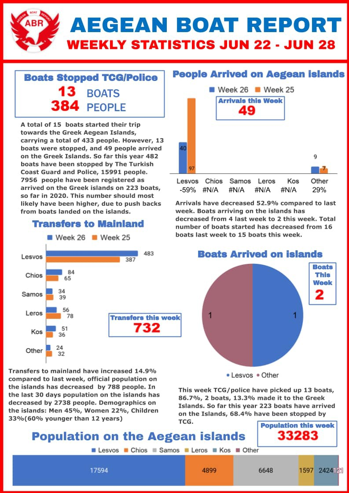
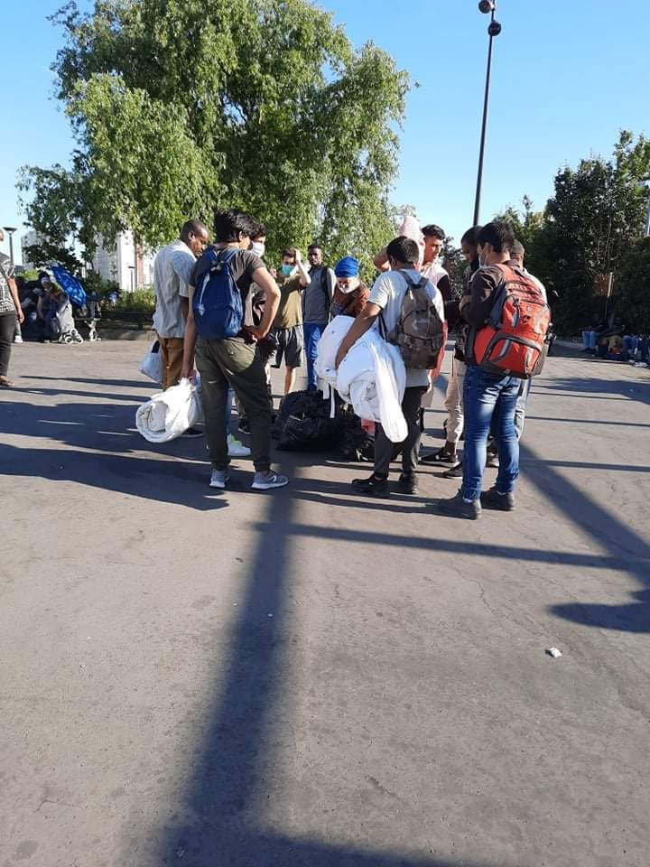
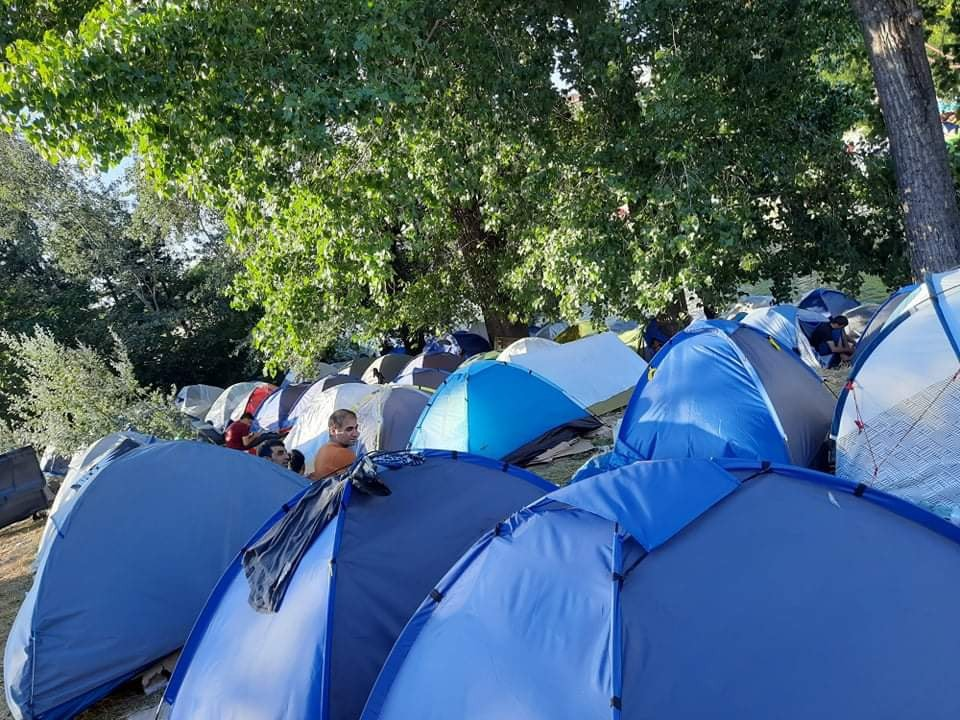

### AYS Daily Digest 30/6/20: EU, let the children reunite with family\!
#### Dozens of people of sub\-Saharan origin arrested and forcefully confined / Along the Balkan Route a surge in deaths by drowning / The UN urges Hungarian government to withdraw the act and bring its asylum system in line with international human rights laws and EU law / Sweden: Deportation of a girl whose family died in the Aegean once she turned 18 / & more news

](assets/98290e6fc96f/1*ddraVHHLSROrMKYEK5TwMw.jpeg)

Trieste, photo by: [Lorena Fornasir](https://www.facebook.com/lorena.fornasir?__tn__=%2Cd%2AF%2AF-R&eid=ARAS6KpOf7za5OLsHUTfN1orfadhaxlYyJ8s2Q4jHkntkKCVM_PbAaG8q4EjCuka4hJFzygLrv5QRbt0&tn-str=%2AF)
#### FEATURED
#### The UK — end to free movement

In the UK, the House of Commons voted to end free movement, “take back control and introduce a points\-based immigration system”, as it was stated by one of the politicians present for the vote\.

Choose Love team posted the following:

> We are devastated that the UK government have just voted in parliament to end family reunification as we know it\. MPs voted against amendment NC29 which, post\-Brexit, would have protected the current system for family reunion\. 

> As Yvette Cooper said today ‘we should not turn back the clock and rip up progress’\. This is exactly what has just happened\. As our government takes this awful backwards step, effectively ending one of the last safe and legal routes of passage for some of the most vulnerable unaccompanied child refugees across Europe, we stand with all displaced people currently separated from their loved ones\. We know first\-hand the dire conditions that many refugees live in, surviving in makeshift camps across Europe\. We will continue to campaign to ensure that refugees have legal routes to reach safety, and that the UK will be a welcoming place of sanctuary\. We can, and we must, do better\. 

A petition was started, run by Safe Passage, support it:

The petition reads:

> As it stands, when the transition period ends on December 31st, refugees will no longer be able to reunite with their family members in the UK, or vice versa\. 
 

> In Europe, there are thousands of unaccompanied child refugees living in the most appalling of conditions\. Legal family reunion is a lifeline to these children who would otherwise risk their lives in boats or in the back of lorries in order to reach the UK and be with their families\. By diminishing a child’s chances of reaching their relatives legally, the end of family reunion would be a blank cheque for people smugglers across the continent\. 
 

> The EU Commission’s negotiation mandate does not include instructions for negotiating a replacement for family reunion\. This means that, even though the UK is ready to negotiate a replacement, it will not happen unless EU member states provide the EU with a mandate\. 
 

> Add your name to this petition so that your political leaders take action\. They can ask the EU to respond positively to the UK’s request to agree to continuing family reunion\. But they need to do it as soon as possible, before the negotiations go too far and the chance could be lost\. 
 

> The UK’s plan could be a lot better for child refugees, and the EU needs to use these negotiations to make sure no refugees lose any rights they currently have, but at least it’s a plan\. Right now, refugees including children could be left with nothing\. 

#### The Balkans — no changes bring about more death and suffering

As more and more people are reported missing and likely to have lost their lives in the border rivers along the Balkan Route, others who are in the official camps testify to harsh conditions, no safety at all and a difficult daily existence\. It is even more tough for the many who are outside of any sort of accommodation, health support, basic amenities or protection\. Local groups and individuals try to support these groups of people with the basics, but all of them report fear of being punished by the authorities and desperation as the numbers only go up and no changes are in sight\.

While lives are lost, the PR experts publish fun games and activities provided for a small group that was “lucky enough” to be let into the horrible camps in Bosnia and Herzegovina\. No agreement is in sight between the international community and the \(many\) Bosnian officials, so it seems there is not much to hope\.

The results of these conditions are reported by many young people who fear their friends have drowned, and by teams in Trieste who welcome those who manage to arrive to Italy\. Here is the latest update of theirs:

> The youngest is 15 years old, the biggest 23\. They ate grass and leaves for 4 days, drank puddles water\. Their throat is irritated by weeds, their stomach upside down, their skinny bodies\. They left Kabul and Afghanistan years ago, who is trapped in Iran or Turkey or in the terrible fields of Lesvos\. One word to describe the Balkan route: ′′ Hell ′′ 

#### MOROCCO
### Dozens of people of sub\-Saharan origin arrested and forcefully confined

About fifty sub\-Saharan migrants were arrested on Sunday 21 June at home, at their place of work and sometimes in the street by the Moroccan police who took them to a school in the city of Laâyoune, in the Western Sahara region\. For seven days, they were crammed into classrooms, with no access to running water or clean clothes, no ability to get out or eat properly\. All were screened for coronavirus before being released in the evening of Sunday, June 28\. Those who tested positive for Covid\-19 were quarantined in a hotel where they receive chloroquine treatment\. Read more [here](https://www.infomigrants.net/fr/post/25682/coronavirus-au-maroc-des-dizaines-de-migrants-sub-sahariens-arretes-et-confines-de-force?fbclid=IwAR0ByOHBuKj6SxJOWODzCNmEn8qZhi0GMN_ZT01usifGpbanhTg0k1GyL2I) \.

#### SEARCH AND RESCUE

The civil liberties organisation Statewatch has today delivered an open letter with hundreds of signatories, including Are You Syrious, to Mr Kitack Lim, Secretary\-General of International Maritime Organization \(IMO\), calling on him to revoke the Libyan maritime search and rescue \(SAR\) zone in order to prevent the so\-called Libyan Coast Guard undertaking ‘pull\-backs’ of migrants to Libya, where they face violence, abuse and mistreatment\.

### 47 people were rescued by the NGO rescue ship Ocean Viking\!

We are relieved that the 47 people are not in distress anymore but were rescued this evening by the civil fleet, [Watch The Med — Alarmphone](https://www.facebook.com/watchthemed.alarmphone/?__tn__=kC-R&eid=ARCFFO4f-adSTLLPISeElw5F2VAlIKNOtFIfoAVJh9-OgLhrLVSirsxy8NzaUoalyI1pUsg83F3NPJYZ&hc_ref=ARRgDbEy--rAcnmglP8eBTLh5ZbFrrWz95L3hdrDOFjL03nIFY4y0Hvd8qmiL-BI1Lw&fref=nf&__xts__%5B0%5D=68.ARDyPxPBuhtQZZ7WVl3PkRkTw0vrBsP2OPvq5C7syhyPuZCZ7y0FlLvinvpnpnaTQVO68co1FVMDS8ZQql5eXlENxzA4Ud9jreTJ6eEi6Lm4S6L-W_9t_-qEKlHrdBdCarQcS3k10E6Vuk5gryQQwsPTg_c8JE5raBhlHyzQd1dyClB5-2rrWFFYoG32dCvuBcXfHJ7nfTMyI2TGS5oNmLCdsysH0YsIPQF-EnXdH5pIE5CmYFenV5EJjq7Tg5CgZoXliLgG6S3lEGv2VpbThCTu9NH3-DpVzku_qOp-GAZvLj8pXOOUsvFbxbNEER5v08vt9C032bfepvMRWZu6mKidOi4o) reported\.

> Authorities, who we informed 11 hours ago, failed again to rescue and so the civil fleet had to intervene once more\. 

#### GREECE

> According to the UNCHR, about 35\.500 people reside on the Aegean islands as refugees and asylum seekers\. The majority are from Afghanistan \(49%\), Syria \(19%\), and Somalia \(6%\) \. Women account for 22% of the population, children for 33% of whom more than 6 out of 10 are younger than 12 years old\. 

Also, find UNHCR’s Aegean Islands Weekly Snapshot [here](https://data2.unhcr.org/en/documents/download/77379?fbclid=IwAR3AVzViiaE9FCUkPfhN86iFzSJcSlfC_Fv5jq78YTvZ_8cwMJy8od-fL-w) \.
### Set to be evicted if you received int\. protection before May 1

Today is the last day those who received international protection before 1 May 2020 can stay in the camp of Moria as well as other reception and identification centres, camps & hotels\. Before being set to be evicted by the 1st of July\. Right now over 11,000 people are in this sitution in Greece\. Most of them were given only one month to prepare for their departure, others have been thrown out of their flats, rooms, tents, isoboxes immediately\. Many face difficulties finding the 48€ for the ferry from Mytilini to Piraeus, after being stuck for months & years in a camp, that doesn’t allow more than survival, offers no integration programmes, no jobs, no education\.
At the same time families and friends left behind in Moria report that those who commuted to the mainland in the last month want to get back to Lesvos, since they see no perspective other than homelessness or being stuck in another camp with nowhere to go\.

> Meanwhile, for the rest of the people in Moria, the lock\-down continues — with no schooling, poor medical treatment, a severe lack of information on what’s next and daily insecurity\. Yesterday a fire broke out in olive grove, heat wave exacerbates also medical problems\. 

■■■■■■■■■■■■■■ 
> **[Franziska Grillmeier](https://twitter.com/f_grillmeier) @ Twitter Says:** 

> > Thread: ❗️Today is the last day #refugeesgr who received international protection before 1 May 2020 can stay in the camp of #Moria as well as other reception + identification centres, camps &amp; hotels. Before being set to be evicted by tomorrow the 1st of July. /1 

> **Tweeted at [2020-06-30 13:58:22](https://twitter.com/f_grillmeier/status/1277964701486342145?fbclid=IwAR3anOTvWac9jVjmi03s5kjm-L5WDEHNjE2p026F9OKeUEfAhfPV67FPyz4).** 

■■■■■■■■■■■■■■ 

In other news, including the discrepancies between what it means to be unified in terms of human rights and the legislation defining it, here is more on the reactions to the recent criticism towards the Greek policies:

[https://twitter\.com/lk2015r/status/1278067901023563776?s=20](https://twitter.com/lk2015r/status/1278067901023563776?s=20)
### “The new normal”

“There’s been a lot of talk of the ‘New Normal’ to describe how life has evolved or been interrupted as a result of the spread of Coronavirus\. In some ways it’s a useful idea: a tool to help settle into the long\-term repercussions of the virus; even a way to continue to take care of one another\. But it’s also important that we don’t lose sight of what shouldn’t ever be considered ‘normal’\.”

#### HUNGARY
### Effective access to territory is an essential pre\-condition to be able to exercise the right to seek asylum

The new rules imposed by Hungary after they’ve been ordered by the court to close down detention transit centres, require asylum seekers to submit applications at consulates in neighbouring countries rather than at the Hungarian border\. However, the UN has said that this “may expose asylum\-seekers to the risk of refoulement and ill\-treatment which would amount to a violation of the 1951 Refugee Convention and other international and regional human rights instruments to which Hungary is a State Party”\.

Because of this, the UNHCR has urged Orban’s government to withdraw the act and bring its asylum system in line with international human rights laws and EU law\.
#### ITALY

While the coronavirus pandemic has exacerbated inequalities and highlighted the frontline work of the “invisible” in Italy, the highly publicized trade unionist Aboubakar Soumahoro, an Ivorian who arrived in the country 20 years ago, calls for strong measures in favor of farm workers\. We will report more on this in the coming days\.
#### FRANCE
### The north

The number of people living in the Jungle and other camps in Calais has increased significantly since the end of the Confinement \(French exit restrictions\), the local media have reported\. With reference to Utopia 56, 1,000 to 1,200 migrants are currently estimated to be in the area\. The living and hygienic conditions [are still very bad](https://calais.bordermonitoring.eu/2020/06/29/mehr-ankuenfte-anhaltende-prekaritaet?fbclid=IwAR0ViqRe4Ou42RMQjuRWR86qR8-4XTV42GoZPj0ebdSuCBP224dv4G1rhHw) \. 
In addition to the main settlement area around Rue des Huttes and Rue des Garennes in the Zone des Dunes industrial area, where mainly people from Sudan, Eritrea, Afghanistan and Iran live, there are smaller jungles near the Stade de l’Épopée, in the Marcel\-Doret industrial estate and near the hospital\.
### Restore access to the minimum healthcare

Utopia reports that currently, about 400 people are homeless and scattered in Grande\-Synthe\.

> These people are families with small children, single men, sometimes elderly, and single children without legal representation in the territory\. They need to shower, wash their clothes, do their dishes, access toilets and dumpsters, these are fundamental rights attached to the dignity of the human person recognized by European and French law\. 

Associations, including Utopia 56, ask the City Hall of Grande\-Synthe and the Prefecture to restore access to the minimum healthcare for people on the move\. During confinement, this measure was brutally removed, depriving the situation of any legit procedure and people of their dignity\.
Find more on this [here](http://www.utopia56.com/fr/actualite/grande-synthe-mairie-prefecture-doivent-retablir-garantir-acces-a-leau-lhygiene-pour?fbclid=IwAR1znhG20B8mK9XT2Ul4FllSBT7oFSglLfPzJ3sInF-16mI8phOLc4YUU7c) \.

 report on their work in the area: Because the guys are sleeping rough they rarely get to change their clothes, so jogging bottoms are great as they are much easier to hand\-wash than jeans\. “We need your support to continue distributing the clothes that refugees desperately need\. A new pair of joggers costs just £5\. If you can, please chip in at [care4calais\.org/donate](http://care4calais.org/donate?fbclid=IwAR1cF7ihwfVDdK5gc8JiOCLt55DHTRZLU81h3J-VGpfZhS8DTRj4zWk7xCg) ”](assets/98290e6fc96f/1*p3zIEmQyJDbRcR2YOblfnQ.jpeg)

[Care4Calais](https://www.facebook.com/care4calais/?__xts__%5B0%5D=68.ARBW_iKUpZd6KkU3Yrn_fVtBk6fGZ9frjMETql7GejcbpPPA8pnmW7EUqmVHtKiPMiEwIW6i_Xwi8Ha7WqvBeNaKe94JW80iR429j7uI_8msTqQNERxOLW3W9o4BOqhJi0NfMukjX_zt4SdR6HY5Cd0EPi2Omo7M25jckALLhkYgIAeolOc1a6ne_PT7ah2h1BsYiyjJ2u9wPss2qc1wpkLryw2QsOWl7tsphApccyGandTtC-a-2oPP-ETdjcQgtzIQ65Jl-gHcOGM69UGZj0vJpE4NWc6_d-qOi4f-f1hKamMI7lWSzyV0kIer-gGPhVVHNxPyiEx4APDadN4TWMhCDXLb&__tn__=k%2AF&tn-str=k%2AF) report on their work in the area: Because the guys are sleeping rough they rarely get to change their clothes, so jogging bottoms are great as they are much easier to hand\-wash than jeans\. “We need your support to continue distributing the clothes that refugees desperately need\. A new pair of joggers costs just £5\. If you can, please chip in at [care4calais\.org/donate](http://care4calais.org/donate?fbclid=IwAR1cF7ihwfVDdK5gc8JiOCLt55DHTRZLU81h3J-VGpfZhS8DTRj4zWk7xCg) ”
### Paris

Since Monday evening, a camp made up of 65 people has [set up](https://l.facebook.com/l.php?u=https%3A%2F%2Fwww.ouest-france.fr%2Fmonde%2Fmigrants%2Fmigrants-un-nouveau-campement-de-mineurs-isoles-etrangers-installe-a-paris-6887950%3Ffbclid%3DIwAR1ThXgqZASGUxVV3apDPfCsXzAC_5hwrZppiZn_Yv55ewytVL5XqhN03OE&h=AT2XVUk2n8gDrqAVRrtMpERzekZy0Zdgk_59-boigyGCu_45zr7ERGJS_wTY9tcM3vly_u5uKhyB3ACT6EYEdPvr_BUXwMUMFlvOsrQ0aIH53TC9ZolIJSToDCgCUQBFF0gUnI0oBOrtrg) in the Jules Ferry square located near the Place de la République in Paris\. All are unaccompanied minors\. Several associations ask the State to take charge of them\.

> We are always looking for Volunteers, ✊🏼✊🏼✊🏼
 

> who would help us with transportation and distribution of donations\. It is hard work , I won’t lie to you\. But it so worth it\. _— on behalf of one of the ground teams, Danica Jurisic calls for more hands on deck\!_ 

She reported:

> We have a new camp risen just around the corner from Place de la Republique\. It is for isolated refugee minors only\! After the confinement and all the issues with pandemic, when many big them were placed somewhere to respect the confinement and all the rules and regulations — many of them had to leave that kind of emergency housing and they have ended back on the street\. That has resulted in hundred and something of them being homelss and exposed to all the dangers of the street\. 

 — contact her if you can lend a hand, donate or help in any other way \(connect people to legal aid workers etc\)](assets/98290e6fc96f/1*ZG8NbDlkHRNQ7VeINQ8q-g.jpeg)

Photos: [Danika Jurisic](https://www.facebook.com/profile.php?id=100009499466124&__tn__=%2Cd%2AF%2AF-R&eid=ARB32ctZ3bOp4OrDaJ_pZirri8lMGWAJ96yoe90hdtxAfhCToWSNF8zVXywt5W4xqR9RBoadHAbfCDP-&tn-str=%2AF) — contact her if you can lend a hand, donate or help in any other way \(connect people to legal aid workers etc\)

### “Stop the confinement of undocumented migrants”: mobilization against the reopening of the Rennes detention center

To avoid the possible detention of undocumented people in the center, about thirty demonstrators gathered as early as 8 am on Monday morning and blocked the road leading to the CRA of Saint\-Jacques\-de\-la\-Lande, near Rennes, as [reported](https://france3-regions.francetvinfo.fr/bretagne/ille-et-vilaine/rennes/stop-enfermement-papiers-mobilisation-contre-reouverture-du-centre-retention-rennes-1848000.html?fbclid=IwAR3kG1uACxpsVHBiLYeS_gAmg_DBThk7Yd5_KFD4gcp24Zl5Av5WetlPJPE) \.

> “Expelling people who risk their lives is not dignified” 

During the confinement, the Saint\-Jacques detention centre, like most on French territory, had closed its doors\. The people detained inside had been released because the closure of the borders, due to the epidemic, did not allow the removal measures to be applied\.
#### SPAIN
### Arrivals continue

A boat with 19 people has been reported to have arrived at the coast of Haría \(Lanzarote — Canary Islands\) \.

One of the people, who had health problems, has been referred to the José Molina Orosa Hospital, while the rest are in good condition, but reportedly remain in police custody\. We will try to get an update on their whereabouts\.
### More than 60 national and international organizations demand the release of Moroccan political prisoners by Covid\-19

The organizations warn that the families of these imprisoned people, among which are those of the Rif, express their anguish **at** the fact that the lives of these people are at risk when exposed to situations of **extreme vulnerability to contagion, given that positive cases have been reported in both officials and prisoners** of some jails in the country\. The health situation in which they find themselves facing with Covid\-19 is very worrying if one takes into account the already deteriorated state of health within the prisons, [reported here\.](https://www.apdha.org/organizaciones-nacionales-e-internacionales-exigen-liberacion-presos-politicos-marroquies-covid19/?fbclid=IwAR0IqmaD3Bbr_8Lk1k5nC3FMSKrQLYFV3Vb3Yd9n_yFuiry1CDqPWZl0MeU)

> For this reason and following the [recommendations that the United Nations High Commissioner for Human Rights formulated](https://www.ohchr.org/SP/NewsEvents/Pages/DisplayNews.aspx?NewsID=25745&LangID=S) on Wednesday, March 25, 2020, with this letter we ask King Mohamed VI “to proceed to grant prisoners freedom politicians and opinion , including the Rif political prisoners, in the same way as was done with hundreds of common prisoners a few weeks ago **“** \. 

### Ombudsman questions repatriations of migrants to Mauritania because they may violate international treaties

The Spanish Ombudsman, as the responsible body for the National Mechanism for the Prevention of Torture, had expressed concern about the repatriation to Mauritania of citizens of sub\-Saharan African origin, particularly Malians in whose country there was a war\. As the Ombudsperson had warned, Spain’s practice **could be violating the principle of non\-refoulement provided for in international treaties\.** 
Read more on the story [here\.](https://www.europapress.es/epsocial/migracion/noticia-defensor-pueblo-cuestiona-repatriaciones-migrantes-mauritania-porque-pueden-vulnerar-tratados-internacionales-20200630182023.html?fbclid=IwAR0n7i2FtaJDTrpKVlxtBXFtTg4xZ8FzQJg-jJUjo9fvKqK-QQ0ZN2QbpGk)
#### SWEDEN
### Deported after turning 18

The media are reporting about a recent deportation of a girl who was 14 when her parents and three younger siblings drowned in the Aegean sea\. Originally from Afghanistan, her family was one of many that had sought to make the treacherous crossing from Turkey to Lesvos: theirs took place on 28 October 2015\. 
The voyage ended tragically, in shipwreck, in which almost 70 people lost their lives\.

“That autumn day would mark the beginning of Yara’s long and traumatic journey through the bureaucracy of modern Europe, in which those born outside the continent’s borders are casually dismissed and dehumanised”, one of the media stories writes\. She has now been deported back to Afghanistan after having turned 18\. 
Sadly, many more young lives are lost — one way or another — due to such systems in place, and a large silent majority that doesn’t find it important to stand up for them\.

**Find daily updates and special reports on our [Medium page](https://medium.com/are-you-syrious) \.**

**If you wish to contribute, either by writing a report or a story, or by joining the info gathering team, please let us know\.**

**We strive to echo correct news from the ground through collaboration and fairness\. Every effort has been made to credit organisations and individuals with regard to the supply of information, video, and photo material \(in cases where the source wanted to be accredited\) \. Please notify us regarding corrections\.**

**If there’s anything you want to share or comment, contact us through Facebook, Twitter or write to: areyousyrious@gmail\.com**

_Converted [Medium Post](https://medium.com/are-you-syrious/ays-daily-digest-30-6-20-eu-let-the-children-reunite-with-family-98290e6fc96f) by [ZMediumToMarkdown](https://github.com/ZhgChgLi/ZMediumToMarkdown)._
