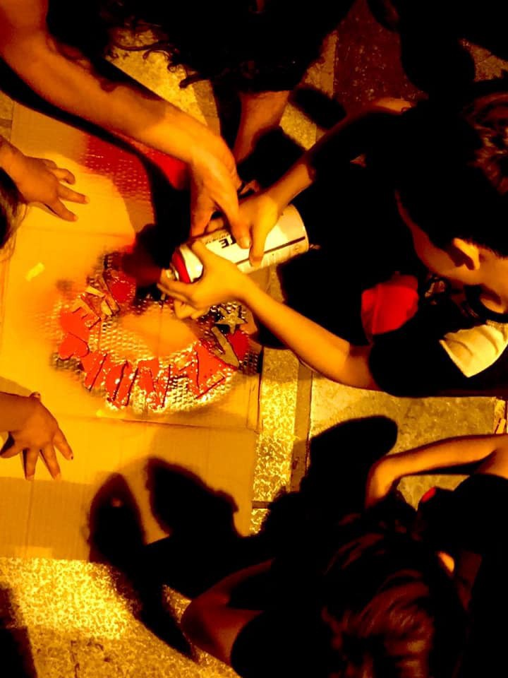
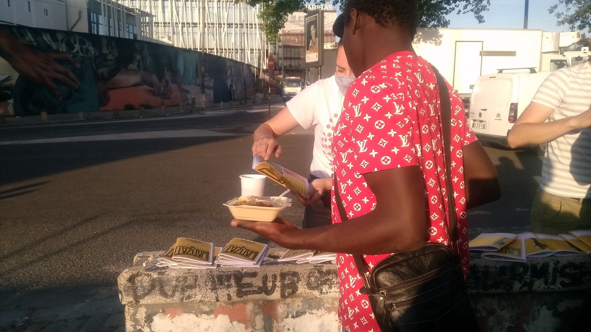

### AYS Daily Digest 1/7/20: The Greek asylum system exposes people to abuse and exploitation, while the floating fence arrives on Lesvos
### EU complicit in the abuse made possible by the Greek new law / More people arrive from Moria to Athens and are about to be taken into detention, activists warn / No follow up on the many allegations against the security officers in camps across the Balkan Route / World War II survivors call the Dutch government to take in unaccompanied children / More news \+ We’re pointing you to more good reads

[Are You Syrious?](@AreYouSyrious?source=post_page-----90f4902ee5a8----------------------)

[Jul 2](ays-daily-digest-1-7-20-the-greek-asylum-system-exposes-people-to-abuse-and-exploitation-while-90f4902ee5a8?source=post_page-----90f4902ee5a8----------------------) · 10 min read

### FEATURED
### The EU and Greece have made the political choice to jeopardise the lives and futures of people it has a responsibility to protect

> _“Greece’s new law is a blatant attack on Europe’s humanitarian commitment to protect people fleeing conflict and persecution\. The European Union is complicit in this abuse, because for years it has been using Greece as a test ground for new migration policies\. We are extremely worried that the EU will now use Greece’s asylum system as a blueprint for Europe’s upcoming asylum reform\.”_ 

“When the Greek authorities reject an asylum application, it does not necessarily mean people are not in need of international protection\. It is often **a consequence of the accelerated asylum procedure applied in the context of border procedures** \. Short deadlines increase the possibility of errors\. In addition, people have neither the time nor a suitable environment which would allow them to prepare for their asylum interview, in which they can speak about the horrors they have fled\. This **puts people’s lives at risk** : those rejected face being immediately detained to be deported to Turkey or their country of origin\. The Greek government must restore a fair asylum system, which fully respects human rights\. **The European Commission must review Greece’s asylum practices and assess their compliance with EU law** ,” said Spyros\-Vlad Oikonomou, advocacy officer at GCR\. Read more [here\.](https://www.oxfam.org/en/press-releases/greeces-new-asylum-system-designed-deport-not-protect-warn-greek-council-refugees?fbclid=IwAR101MkP400bxPjw0DNEJCMXId8Q3_PaEG07KHv6sCwU70YBlIeEYqRBeug)

In the context of the border procedures, we reported about the plans to set up a floating barrier some time ago, but now it is actually being installed\.

The Greek government has delivered the material to build a 3 kilometre long barrier off Lesbos, through which people arrive in the EU\. On Monday, the 6th of July, the installment of the 2,7km [f](https://www.facebook.com/hashtag/floatingfence?__eep__=6&hc_location=ufi) ence is reportedly to start in the northeast of the island\.
This plan raises worrisome questions about the possibility for rescuers to continue to provide assistance to people attempting the dangerous crossing of the sea, Amnesty International said\. Many other organisations have condemned this plan\.

Also on Monday:

Find the agenda and the participants of this LIBE Committee meeting here:
### SEARCH AND RESCUE

“Tonight a boat in danger with about 30 people on board including children, contacted us from the Maltese SAR area, about 30 nautical miles from Lampedusa\. They fled Libya\. They must be rescued immediately\! They have no life jackets and it is dark at sea\.” — Alarm Phone reported\. 
Later, they updated on the uncertain fate of the missing people:

The humanitarian ship Mare Jonio arrived on Wednesday at the port of Augusta in Sicily where it was authorized to disembark the 43 migrants rescued off Libya on Monday\.
### GREECE
### Athens

Call for applications for people who speak very good English and one of the following languages: Arabic, Arabic & French, Farsi, Dari, Kurmanji, French, Lingala & French, Susu, Peul, Tamil, Krio, Malinke, Oromo, Bambara

Attend METAdrasi’s 68th Interpreters Training Seminar free of charge with employment prospects in locations out of Athens\.

👉 Application deadline: Monday, 6/7
📌 Apply here: [bit\.ly/38fcE78](https://l.facebook.com/l.php?u=https%3A%2F%2Fbit.ly%2F38fcE78%3Ffbclid%3DIwAR05Blms9xZyy-m6q-bWYYVA6dOwNTUr5tFnzcpCGUTOFAx-yRTdheR4p7A&h=AT3TuRT1Z0sANdblO4CsXVn8Hfa4M2qDtpQ2Bad0NAqC9fQ8WH0T2fA8A4cEi_2wjbGwalbW-Lx640SyGhnaXFEoJgG_kejVhJSQtcpwmUr0gCq7nSz3yF95x6H_UVvoK6w-8S0)

### Ministry’s idea for speeding up the processes

The Migration Ministry is setting up a special body of lawyers to help the Asylum Service expedite applications, media report\. Ekathimerini reported: “The lawyers will be present during the interview of asylum applicants and will compile and submit their presentation after examining the applicant’s case, the minutes of the interview and after having conducted an objective investigation\.” Given lawyers are free to work around the country dealing with both civil and criminal matters, this could lay the groundwork for corruption, critics say\.

From Moria to mainland detention?

More than 300 people from Moria arrived in Athens, without support, in Victoria square, NB report\. Solidarity groups are present in the square next to the people\. It was later reported that police forces had arrived in Victoria square, allegedly to take refugees to Amygdaleza detention centre\. Solidarity demonstrations were announced for Thursday\.

A personal story

We think it is important to bring people’s stories to the fore, so we intend to do that more often also in our Daily Digest, as it seems that facts and figures don’t do much to people’s empathy, engagement, and even less for changes in policies\. This is one of the stories from Moria, a story of a man for whose case [Light Without Borders](https://www.facebook.com/Light-Without-Borders-281582645683403/?__tn__=%2CdkCH-R-R&eid=ARApz0eo_NzBmnfEdf2jmc3CEfLQNXRxSSjyBhqxTeb5uj56QvI4a_jBl0bjqhUpFgsQzSMoWLY-_TJs&hc_ref=ARRLSZPPmj4V6HtuNiURWKFSgpg-SwoFTjpy8DI-Kg7ZT3vJiPzYWik3txefc9CR7NA&fref=nf&hc_location=group) hope to find legal support:

Mohammed fled from Syria after the death of his two brothers and his father when the Syrian regime’s air force bombed the city where they lived\. He had a comfortable life there until the death and devastation hit his life, and had to escape with his mother, wife \(4 months pregnant\) and a 4\-year\-old child, from Idlib province\.
Once they reached Turkey, waiting to cross to Greece, his 4\-year\-old child died of starvation and cold in the freezing winter in the mountains\.

Since then, after managing to reach Lesbos safely last January, the family has been living in a tiny hut in the “Jungle Hell” in Moria with no access to water or electricity\. His mother at 75 years old is a COVID 19 high risk person, suffering from HBP, kidney failure, and with back surgery and eye problems, still waiting to be evacuated…

When I met them she was sleeping in the floor and her body was absorbing all the humidity and cold from the ground\. The following day we provided her with a wheelchair and a bed thanks to the support and cooperation of Kitrinos Health care and DART Org\. from Germany\.

His wife was 8 months pregnant when both of them got the second rejection of their asylum application\. After the baby was born at the hospital they went back to the tiny hut in Moria like many others with new born babies\.

We visited a couple of legal support organisations trying to find help for his case but they all refused to take his case\. Although they hope to reach his brother Ahmed Mohammed and his family in Thessaloniki where they have been living for the last two years and a half, now his mother has been rejected and due to their rejection it seems they have no right to have decent accommodation for his newborn baby and elderly mother although she is a high\-risk patient\.

THE BALKAN ROUTE

From July 1, a status agreement on border cooperation between the EU and **Montenegro** has been in force, which will allow the European border and coast guard agency to carry out joint operations and arrange teams and experts at the border between Montenegro and the EU\.

The case of [unaccompanied minors at a centre in **Serbia** being beaten](https://www.youtube.com/watch?v=ffEqzhb_i2E) by the security guards has now received more [media attention](https://www.bbc.com/serbian/lat/srbija-53197198?fbclid=IwAR1boEGyNQhSZMqnhsdxJm0e0_agADR3aeZ4DPVtSjUXEYzxG6uMSTnAbtA) , but still similar things are happening across the route, as the international organisations \(IOM, UNHCR, etc\. \) as well as the government bodies in charge of the facilities they call reception and transit centres, hire private security companies, whose employees more often than not are completely uneducated \(in every sense, including for the job they are supposed to do in the particular place and situation\) and are extremely violent, to those staying in camps, those visiting the camps to report about them \(even if they are not actually in the camp, AYS has also experienced a violent approach by the security officers in **Bosnia and Herzegovina** \), but especially towards young men, boys, and even unaccompanied children in places where they are supposed to be protected\.

So far, not enough — if any — reactions or changes have happened after some of the documented abuses\.

In the meantime, about 600 people who were found in an abandoned factory in Bihać were taken back to the Lipa provisional camp \(about 450 who had camp cards\) while the others reportedly ran away, as the media reported\. However, the fact remains that in the Una Sana canton there are about 3,000 people in the camps and perhaps even more outside the official facilities\. Ironically, the Bira camp is also an abandoned factory warehouse with no decent conditions to welcome people fleeing their home countries for multiple different reasons, but its funding and other circumstances surrounding it were never properly investigated as, unfortunately, the foreign media often stops at doing the tour around the camp followed by the IOM staff and shooting some exotic shots of people in and around the camps\. Already that seems too much for most\. Imagine what would happen if somebody actually investigated the matter, both on the Bosnian officials’ side, but also the financial matters of the reception system across the country\.

FRANCE

Grenoble: protest against expulsion

Dozens of young people, including high school students, are at risk of being expelled in August while they are in full school, French sources reported\. Until their majority, unaccompanied minors are housed in accommodation centres by the Departmental Council of Isère\. But once they are 18 years old, they can be deported and risk finding themselves in the street for lack of means, according to several associations helping migrants in Grenoble\.
“Most of the time, they continue their training or apprenticeship despite this\. We are putting obstacles in their way,” a member of the association Droit au logement said\.

Paris: bike deliveries

[Solidarité migrants Wilson](https://www.facebook.com/Solidarit%C3%A9-migrants-Wilson-598228360377940/?__xts__%5B0%5D=68.ARC7eBTCgq1GJGZ-0q2ktBFyZ8eP9vsqyWIZOQ-CBSMYmh5LtAnSTKJ0sF26_ghR-GRYfxAcSEC5ROp4lomJVgAA2LLKlry1_E3SjjfvVrIDl8nhgHepsKwBFkuNMHyUkywLUVTt7gf7rGDpsU9G7F0fW4bFchKm7cJTb46e-wxV0ocRliJQX1r3OuIpWZjFWpatdFxC8EkGMTCFo1pcww0_pfHNF75bNVH9A7W6V9zGmxdMMF2_WO81RuUOiFyAKGqpgCA_MbSY5EdVELb_VRwHsWBqxLf-NG7sisCnTKoYs81li0TmZbcwTVUCJa02qtOrTa4eOCfp30K29CKhwHHWTA&__tn__=k%2AF&tn-str=k%2AF) needs more people to join them this Thursday and Saturday for the cycling tour of deliveries\. See their page for more info and, if you are in Paris, grab your mask and your velo and off you go\!

SPAIN

Decent conditions for the reception of people arriving in boats on the Murcian coasts

The people who have been rescued during the past days “have been transferred to the Port of Cartagena, where they have been able to verify the absence of any type of facility for the first reception since they are temporarily housed in tents in the fields or areas that present significant deficiencies that make them unsuitable spaces for the reception and first reception of people who have been rescued from the sea\.“ For this reason, there have been calls for the responsibility of public bodies responsible for the reception of people saved at sea, the media [report](https://www.europapress.es/murcia/noticia-coordinadora-ongd-reclama-condiciones-dignas-acogida-personas-llegadas-pateras-costas-murcianas-20200701105046.html?fbclid=IwAR3ICtsqOnAOuUWkIQwbK8q9-JIyEmIlB7lnrRwBxoZnKDtDfzss7eE9pPM) \.

Also, it is reported that Save the Children has reactivated its face\-to\-face care programme for the children in Melilla and the Andalusian provinces of Cádiz, Granada and Almería after the suppression of the state of alarm and in view of the “anticipation of an increase in arrivals” in summer\.

“The boys and girls who make their migratory journey alone and who arrive at our coasts and borders need friendly spaces and advice in a language they understand”\.

THE NETHERLANDS

World War II survivors call the Dutch government to take in unaccompanied children

Twelve Dutch people who had to go into hiding as children in the Second World War wrote a letter to Parliament, calling for the Netherlands to take in children from Greek refugee camps, NOS reports\.

“All that is required of this country is compassion and very ordinary human mercy,” and yet “the Netherlands has refused to take responsibility so far and is not prepared to admit a single child\.”

Multiple Dutch municipalities have shown willingness to shelter these children, as we have reported several times earlier\.
### FOR FURTHER READING

> _The Immigration Control Industry is one of the businesses with the best prospects for the future in Europe\. In the past decade, a wide network of politicians and businessmen, mainly from the arms and construction sectors , have managed to consolidate a new market around the securitization of migration and the militarization of borders\._ 

Postcoronavirus reconstruction will force many states to adjust their budgets, but the immigration control industry does not see storm clouds on the horizon: uncertainty, fear, and social instability are favorable assets for their business\. — Read the very interesting and alarming report on the Spanish immigration control:
### [El control migratorio en España: una oscura industria de más de 660 millones en cinco años](https://temas.publico.es/control-migracion-oscuro-negocio/2020/07/01/el-control-migratorio-en-espana-una-oscura-industria-de-mas-de-660-millones-en-cinco-anos/?fbclid=IwAR0JIZ_XiJQKxMGGTv6dCktlUSshw1zZizQIo0BYGnSMU23uW7ELIfzkeWw)
### [porCausa / Público La política migratoria europea y española deja un saldo récord de víctimas mortales en el…](https://temas.publico.es/control-migracion-oscuro-negocio/2020/07/01/el-control-migratorio-en-espana-una-oscura-industria-de-mas-de-660-millones-en-cinco-anos/?fbclid=IwAR0JIZ_XiJQKxMGGTv6dCktlUSshw1zZizQIo0BYGnSMU23uW7ELIfzkeWw)
#### [temas\.publico\.es](https://temas.publico.es/control-migracion-oscuro-negocio/2020/07/01/el-control-migratorio-en-espana-una-oscura-industria-de-mas-de-660-millones-en-cinco-anos/?fbclid=IwAR0JIZ_XiJQKxMGGTv6dCktlUSshw1zZizQIo0BYGnSMU23uW7ELIfzkeWw)

Find personal stories of people who have passed through the Bakan route and have managed to reach Italy, published by an Italian activist — [here\.](https://www.facebook.com/lorena.fornasir)
### [COVID\-19 global update \#5 \| Mixed Migration Centre](http://www.mixedmigration.org/resource/covid-19-global-update-5/?fbclid=IwAR0CP4T7OA6AbGhGVwhgPoeHJqtj5VsPrVkvkKrzMzdx3zahbyYJXKDK3mA)
### [This is the fifth update on the situation for refugees and migrants on mixed migration routes around the world in light…](http://www.mixedmigration.org/resource/covid-19-global-update-5/?fbclid=IwAR0CP4T7OA6AbGhGVwhgPoeHJqtj5VsPrVkvkKrzMzdx3zahbyYJXKDK3mA)
#### [www\.mixedmigration\.org](http://www.mixedmigration.org/resource/covid-19-global-update-5/?fbclid=IwAR0CP4T7OA6AbGhGVwhgPoeHJqtj5VsPrVkvkKrzMzdx3zahbyYJXKDK3mA)

The Archipelago is home to new literature and art on migration\.
“We began as a writers’ collective of Eritrean, Sudanese, Somali, Afghan, Myanmar, Indonesian and Australian writers in the refugee community in West Java, collaborating to forge new narratives\.
We mentor refugee and migrant\-background writers and amplify their creative work\.” See more:
### [Home — the archipelago](https://l.facebook.com/l.php?u=https%3A%2F%2Fwww.thearchipelago.org%2F%3Ffbclid%3DIwAR1iw9w6mxsf5iB34qcubLX39MxPdksnWFnpxKdyfu-0noxfksfJMgtJ7bE&h=AT2b3r4n7tZ2h5NNDui6hcqbfdBxRPV84L67uwRmAisDVDllWNpn_0Qo4ndkCSQZ6vjY_x3Xdm2iY_7LDAeh1HggLNfoySdErXftv1lYFfck0Tlr-t2VqBz-fQcvhrVnmpjRnHjikDepew)
### [the archipelago magazine reimagines migration, developing and showcasing writing and art by refugee and migrant…](https://l.facebook.com/l.php?u=https%3A%2F%2Fwww.thearchipelago.org%2F%3Ffbclid%3DIwAR1iw9w6mxsf5iB34qcubLX39MxPdksnWFnpxKdyfu-0noxfksfJMgtJ7bE&h=AT2b3r4n7tZ2h5NNDui6hcqbfdBxRPV84L67uwRmAisDVDllWNpn_0Qo4ndkCSQZ6vjY_x3Xdm2iY_7LDAeh1HggLNfoySdErXftv1lYFfck0Tlr-t2VqBz-fQcvhrVnmpjRnHjikDepew)
#### [l\.facebook\.com](https://l.facebook.com/l.php?u=https%3A%2F%2Fwww.thearchipelago.org%2F%3Ffbclid%3DIwAR1iw9w6mxsf5iB34qcubLX39MxPdksnWFnpxKdyfu-0noxfksfJMgtJ7bE&h=AT2b3r4n7tZ2h5NNDui6hcqbfdBxRPV84L67uwRmAisDVDllWNpn_0Qo4ndkCSQZ6vjY_x3Xdm2iY_7LDAeh1HggLNfoySdErXftv1lYFfck0Tlr-t2VqBz-fQcvhrVnmpjRnHjikDepew)

**Find daily updates and special reports on our [Medium page](https://medium.com/are-you-syrious) \.**

**If you wish to contribute, either by writing a report or a story, or by joining the info gathering team, please let us know\.**

**We strive to echo correct news from the ground through collaboration and fairness\. Every effort has been made to credit organisations and individuals with regard to the supply of information, video, and photo material \(in cases where the source wanted to be accredited\) \. Please notify us regarding corrections\.**

**If there’s anything you want to share or comment, contact us through Facebook, Twitter or write to: areyousyrious@gmail\.com**
### Sign up for AYS Daily Newsletter from Are You Syrious?

Daily news digests from the field, for volunteers, people on the move, journalists, and the general public
#### You’re an editor of AYS Daily Newsletter

_Converted [Medium Post](https://medium.com/are-you-syrious/ays-daily-digest-1-7-20-the-greek-asylum-system-exposes-people-to-abuse-and-exploitation-while-79ff7c62f536) by [ZMediumToMarkdown](https://github.com/ZhgChgLi/ZMediumToMarkdown)._
