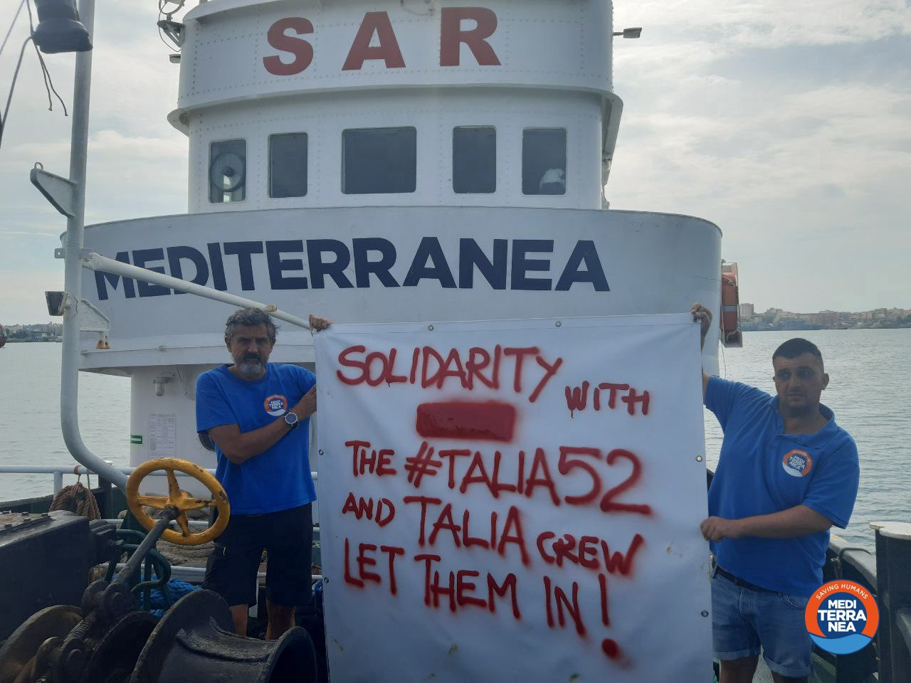
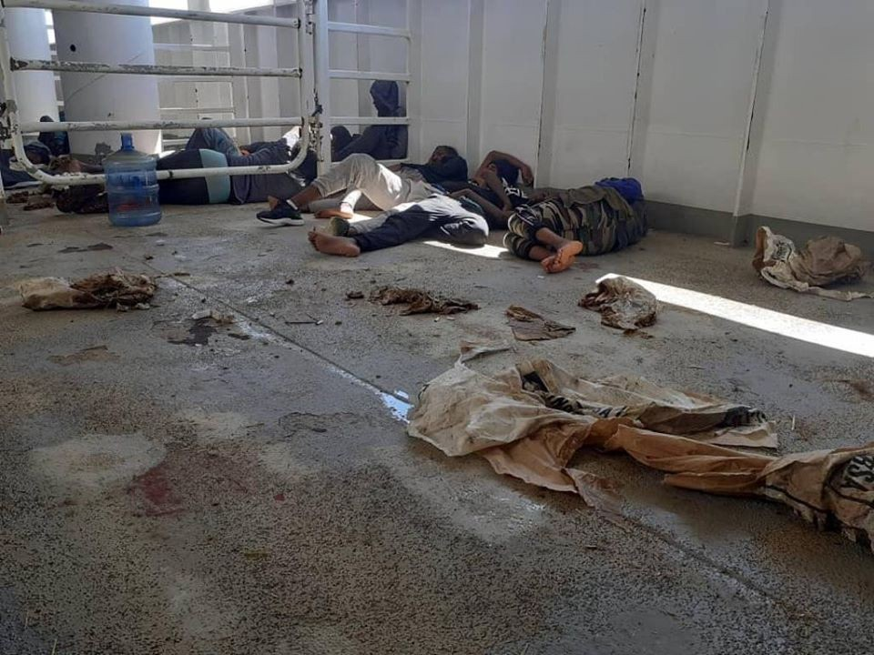
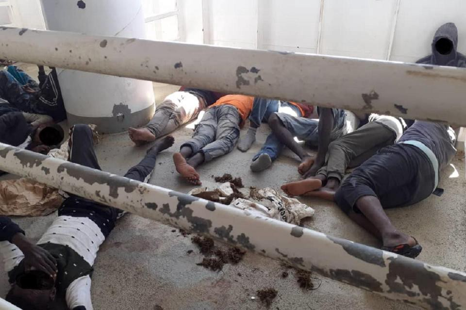

### AYS Weekend Digest 04–05/7/2020: Solidarity with the Talia 52\. Let them Land\!
#### 52 people held in a livestock carrier vessel // 150 stuck in limbo for a week on board search and rescue ship // Greece’s “inhumane asylum system” // Scotland stops receiving asylum seekers

Photo Credit: Mediterranea Saving Humans \(Twitter @RescueMed\)
### Feature

NGO Alarm Phone has reported that Malta’s armed forces repeatedly [hung up the phone](https://timesofmalta.com/articles/view/malta-repeatedly-hung-up-the-phone-as-migrants-drifted-at-sea-ngo.802854?fbclid=IwAR1ix3wo1p0XzhHwlFCwLij028JvMb_3WXgBnr_JEURYi-bG9U-zvsUam74) as the migrant rescue hotline attempted to alert them to 52 people in distress at sea\.

Alarm Phone report that these 52 people were inside the Maltese Search and Rescue zone and thus the Maltese authorities had an international obligation to coordinate their rescue and disembarkation to a safe port\. Instead of fulfilling their commitments, the Maltese authorities ignored the request, remained uncooperative and hung up the phone without noting down the crucial information \.

Fortunately, [a livestock carrier vessel, the Talia](https://timesofmalta.com/articles/view/sea-sick-migrants-kept-in-stinking-animal-spaces-on-rescue-ship-off.803046?fbclid=IwAR3QTX2dInZMN4bkNUQNsQ92qf6GWrOKQVEksJyhrYZuDvx75mX2LGBYlBc) , acted in accordance with Maritime law and rescued the people in distress and offered them shelter\. The ship’s captain, Mohammad Shaaban, told Times of Malta that his ship was not an adequate place for human beings and the severe weather just made matters a lot worse\. Shaaban explained that there were two places where the migrants could be kept: either on the upper deck under a scorching sun, or in the stables below decks, but because of the seven\-metre waves they were experiencing on Saturday night keeping people on the deck of the ship was often not an option\.

Conditions on board the ship \(Photo Credit: Alarm Phone and Times of Malta\)

> _Even if we had managed to clean the place, it would still not be good for humans\. The place is very dirty and dangerous to human health\. My ship is designed to transport animals not human beings,”\._ 

> _“We feared that they fall overboard due to the heavy rolling of the ship from side to side, which was more than 20 degrees\. It was really bad\. The migrants were all sick and all of them need urgent medical attention”\._ 

The Talia was also denied permission to enter Italian territorial waters by Lampedusa\. As of 2pm on Saturday, it was stranded at sea just south of Malta’s territorial waters, according to vessel\-tracking service _Marine Traffic_ \. [On Sunday, Malta also refused](https://timesofmalta.com/articles/view/ship-kept-offshore-as-malta-seeks-european-solution-for-rescued.803001?fbclid=IwAR24Qc0XIxqMIoCmSC6zaKEqgxd808RrCcigZpGbyTUG34RSweM1UTRYbdY) to allow the disembarkation of the 52 people until it has guarantees from other EU member states on their immediate relocation\.

A public campaign has been launched in solidarity with the Talia52\. People have been taking to social media to express their solidarity and demand that these people are allowed to disembark immediately\.
### Italy

For over a week, 180 people who were rescued in the Mediterranean by search and rescue organisation SOS Méditerranée, have been stuck in limbo on board the Ocean Viking ship as it waits for permission from Italy or Malta to offload the people at a safe port\.

It has been reported that [Italy is carrying out tests on the 180 people](https://www.theguardian.com/world/2020/jul/04/italy-testing-180-migrants-rescued-by-ship-for-covid-19?fbclid=IwAR14KTn1to05JuKSEt7kRHILfXkjHGtb5Q-XoJ_t9T0GdNS2KaBh_W_3qOA) stuck on board the ship with a view to transferring them to a quarantine vessel in Sicily\. A source for the Italian Interior Ministry said on Saturday that the medical team sent by authorities in Pozzallo, Sicily “ascertained the absence of particular health problems and also reported that some tensions that had been registered on the ship are being overcome”\.

> _SOS Méditerranée hit back in a statement which said: “The only assistance proposed has been a visit by a medical doctor and a cultural mediator who spoke to the survivors but are not in a position to present a solution for their disembarkation\.”_ 

As a direct result of the continued inhumanity of Maltese and Italian authorities refusing the ship permission to disembark and by proxy arbitrarily detaining these 180 people on board the Ocean Viking ship, tensions and emotions have predictably risen\. After enduring extreme trauma during their attempt to reach the safety of Europe, being forced to stay on the ship indefinitely, [six people have now attempted to kill themselves](https://www.aljazeera.com/news/2020/07/suicide-attempts-fights-engulf-rescue-boat-carrying-180-migrants-200704073132337.html?fbclid=IwAR2FajGhJ2pQ15sghSw7auLmkzCJp7kZyjfvlZ1YuAaQNwR8RTxNFDbfQNA) , and others in their growing desperation over their inability to find a country willing to take them in have also gotten into fights\.

> _In their recent statement, SOS Méditerranée said: “This is an unprecedented step in the history of SOS MEDITERRANEE, triggered first and foremost by the rapid deterioration of the mental health of some of the survivors on board, particularly among a group of 44 people,” “The 44 people who we requested assistance for are in a state of acute mental distress, expressed intentions to inflict harm both on themselves and on others, including members of the crew, and expressed suicidal ideas\.”_ 

**Update: As of Monday morning, the Ocean Viking has been informed that they have been requested to anchor outside Porto Empedocle, Sicily\.**
### Greece

Today we want to share a moving description of the situation in Moria by [Franciska Grillmeier](https://www.facebook.com/franzi.grillmeier/posts/3085703794882935?hc_location=ufi) :

> _Since March 22, people have been isolated in the smallest possible space and with rising temperatures without access to basic supplies and services \(such as pharmacies, vegetable dealers, orthopaedics, dentist, school, football fields, gynaecological examinations, psychological care…\) \._ 

> _In addition, the refugees no longer have contact persons on site and see no perspective on how things will move on\. The psychological stress in a situation of uncertainty and the fading prospect to find safety lead to an increasing number of suicide attempts along with re\-traumatization, with severe health consequences\._ 

> _Most of the families who were transferred by ferry to Athens in the last few weeks \(as they were kicked out of camps with approved refugee status until July 1\. \) are living in homelessness in the streets of Athens today\._ 

> _Families & friends at Moria camp report they are getting desperate calls because most want to go back to Moria but they don’t know how to pay the ferry back \(since all their money waiting for the last few years on the olive hill of Moria has burnt up and they, as recognized refugees, no longer receive monthly support\), while the prospect of a job in the current economic situation, the rising resentment under the Greek government and in the midst of the current Corona pandemic is 0\._ 

> _Meanwhile, you can observe illegal push backs almost daily \(sometimes while drinking coffee in the harbor cafe\) \. People in Greek waters are not only not rescued for over 15 hours, but are pushed back into Turkish waters with a cut\-off engine from the Greek coast guard, where they paddle with their hands around at the open sea until the Turkish coast guard picks them up again\._ 

> _A few days ago, I spoke to lawyer Elli Kriona Saranti on an evening about the German EU Presidency \(her voice below\) \. We didn’t even know what violations of law we should start in the externalisation policy of all EU migration issues\._ 

> _What has shaken me the most these past few weeks are the quiet moments in Moria\. It’s the power of people in these states that say “nevertheless” everyday\. Putting on their sports shoes in the morning and walking up the filthy mountain\. Who ask me how my family is doing and what my favorite flowers are\. Who tell me with a laugh it’s not them stuck in a cage but those who build ghettos for other people\._ 

By a common decision of the Minister of Civil Protection, the Minister of Health, and the Minister of Migration and Asylum have published their decision to further its restriction of all people currently residing in Reception and Identification Centres and accommodation structures throughout Greece\. The restriction on the free movement of these people has been defended by the government as a measure aimed at “ _preventing the occurrences and spread of COVID\-19_ ”\. The announcement of another two weeks of lockdown comes more than 2 months after lifting restrictions for the general population, highlighting the unfair and discriminatory system that currently exists within Greece\.

A new report published by [Oxfam and the Greek Council for Refugees criticises Greece](https://www.oxfam.org/en/press-releases/greeces-new-asylum-system-designed-deport-not-protect-warn-greek-council-refugees?fbclid=IwAR3TTRWZQQTvFq7RCZMzV_r5_2qs3zL6LCMnJ8wpZrwCCoxlkPtiZuESkFs) over the [‘inhumane’ asylum system](https://www.aljazeera.com/news/2020/07/report-criticises-greece-inhumane-asylum-system-200702113311367.html?fbclid=IwAR3IjHebmV9Iry9lCwz_eeIVtc47MTvUyjK3bC5gA29GaNSLECAJYBI3TM8) and says that Greece’s new asylum laws puts vulnerable refugees at greater risk on the Greek islands\.

The report titled “ [Diminished, Derogated, Denied’](https://www.oxfam.org/en/press-releases/greeces-new-asylum-system-designed-deport-not-protect-warn-greek-council-refugees?fbclid=IwAR3TTRWZQQTvFq7RCZMzV_r5_2qs3zL6LCMnJ8wpZrwCCoxlkPtiZuESkFs) shows how the reformed Greek asylum law, which entered into force on 1 January 2020 and was later amended in May, exposes people to abuse and exploitation\. The report shows how, as a result of the new asylum policy, the Greek asylum system appears to be designed to deport people rather than offer them safety and protection\. Furthermore, the report shows how the current situation is aggravated by the inhumane living conditions in Greece’s refugee camps where people are now at risk of a devastating health crisis should COVID\-19 reach the camps\.

The report found that many particularly vulnerable people — such as children, pregnant women and people with disabilities — have been detained upon arrival on the ‘hotspot’ islands, without sufficient access to necessary care or protection\. The asylum system also makes it extremely difficult for people seeking asylum to properly present their reasons for fleeing their home countries, like conflict or persecution, to the Greek asylum service\.

It’s also important to remember that the European Commission will soon release a new Migration and Asylum Pact, which will lay out the direction for the EU member states to reform the EU asylum system and the bloc’s migration policies\. Oxfam predicts that this new pact will most likely suggest using more development aid to curb migration, and it risks perpetuating the humanitarian catastrophe that has been unfolding in Greece over the past years\.

The report concludes by recommending that the European Commission and \(when relevant\) the European Parliament should:
- Ensure that all vulnerable asylum seekers are explicitly exempt from expedited border procedures\. The use of expedited procedures, which are more prone to errors in judgment, should be restricted to the absolutely necessary minimum\. Access to safe accommodation, healthcare and legal assistance should always be guaranteed\.
- End the administrative detention of children and their families by explicitly prohibiting it in legislation\.
- Establish mandatory responsibility\-sharing mechanisms for asylum seekers that enhance their protection — this is the only effective and long\-term solution to reducing the pressures on asylum services and social support in Greece

and the Greek government should:
- Implement alternatives to detention and only ever use administrative detention as a measure of last resort, after a thorough examination and justification of its necessity on a case\-by\-case basis\. Explicitly prohibit the detention of children and their families by law\.
- Take all necessary measures in order to eliminate all phenomena / instances of xenophobia and racist violence\. Promote a facts\-based engagement between Greek authorities, Greek nationals, and refugees and migrants in order to reduce tensions between communities on the islands and foster social cohesion\.

### UK

Scottish newspaper [The National has reported](https://www.thenational.scot/news/18561709.glasgow-stops-accepting-new-asylum-seekers/?fbclid=IwAR0QlYd6vtCp1whnUnj4UnQzHBntcR9yVsMyl3DPSvZMGP6PgKbKBt8eZa0) that no more asylum seekers will be sent to Scotland by the UK’s Home Office as Glasgow City Council tries to “ _ease the pressure_ ” on the city following last weeks attack\.

This decision is being reported as a “temporary arrangement”, but as Glasgow is the only city in Scotland that welcomes asylum seekers under a Home Office directed dispersal scheme, this decision will have a very real impact on the UK’s placement of asylum seekers\. In 2018, Glasgow also had the highest number of dispersed asylum seekers in the UK and took in more than 4000 in the year to June 2019 — while 150 other UK councils accepted none\.

> _A council source told The National: “Glasgow has not shut its doors\. This is a temporary pause to ease pressure on the system\.”_ 

Under the change, any families, women or children who make their own way to Glasgow will be allowed to stay\. However, single men will be sent elsewhere in the UK, with the measures being reviewed weekly\. The council stated that it still remains committed to support this diverse community\.

Refugee Action has published a new report on how government contracts fail people seeking asylum\. The report outlines how towards the end of 2019, the UK’s asylum accommodation and support system was almost fatally disputed by the transition from one set of government contracts to another\. They argue that due to this transition between government contracts, people seeking asylum began to experience “unacceptable and entirely avoidable destitution”, “chronic delays in accessing advice”, “chaotic moves in and between substandard asylum accommodation” and “inadequate help for people newly granted refugee status to move forward from the asylum process”\.

The report produced a number of key recommendations and states:

> _In order to mend the system, the Home Office needs to revisit the problems inherent in the asylum support and accommodation provisions, problems which are explored in this report\. This can only be achieved through an open and accountable performance management regime, designed to assess whether services are genuinely meeting the needs of people seeking asylum\. It will require enhanced support and change ways of working, and a rebalancing of the relationship between the Home Office, local authorities supported to live with dignity whilst seeking asylum in the UK_ 

Refugee Action says that the Home Office must as a matter of urgency to:
- Ensure COVID\-19 transition measures prioritise the wellbeing and safety of people seeking asylum and are carried out in collaboration with all relevant stakeholders
- Engage collaboratively with people with direct experience of the asylum process, and voluntary and community sector partners to improve the current system\.
- Meet its own policy obligation, particular ensuring that no one is made destitute or homeless who is entitled to support\.
- Commit to the regular publication of detailed performance management information on both the AASC and AIRE contracts\.
- Share transition plans for the prepaid cards contracts with relevant stakeholders, including people in the asylum system and the voluntary sector\.

To read the full report please follow [click the link](https://www.refugee-action.org.uk/wp-content/uploads/2020/07/Wake-Up-Call-2020.pdf) \.
### Hungary

Independent humanitarian aid organisation No Name Kitchen shares the story of a [24\-year\-old Afghan man who in December 2019](https://www.borderviolence.eu/international-day-in-support-of-victims-of-torture/) was illegally and arbitrarily expelled from Hungary to Serbia after arriving at Budapest Airport from Dubai\. The young man was also accompanied by his sister \(18\) and his mother \(50\) \.

The young man had worked in Afghanistan within the humanitarian aid field and was a social activist but was forced to flee from his home country with his family after threats were made against his sister\. They travelled to Dubai and flew from there to Budapest Ferihegy International Airport in Hungary\. The family had travelled on fake passports and while the respondent and his mother were able to clear immigration controls in the airport without problems, the Hungarian officials recognized his sister’s passport as fake and began to question her\. The family was taken into detention, “a small jail” within the airport \[Budapest Ferihegy Airport maintains a short to medium term Transit Zone Holding Facility\] and questioned\. The respondent described being asked if he wanted to stay in the country \[to claim asylum\], and he confirmed both verbally and in writing\. The next morning they were transferred to another centre\. Lawyers and translators were brought in, however, the reporter alleges that the translators did not translate correctly; he tried to speak in English but was told that only what the translator translated would be taken into consideration\.

He repeated multiple times that he wanted to stay there\. At first, the Hungarian authorities agreed and said he would be in closed camp\. He agreed to this\. Then, in the evening at five or six o’clock he was told he could not stay and would be deported to Serbia\. He questioned why he was being deported to Serbia and said that he had not come from there\. Hungarian authorities told him to stop speaking and not make problems or they would jail him for a month and then deport him\. He was also forced to sign documents that he did not understand, and then told they were deportation documents\.

Sometime after this, Hungarian officers drove the group to the Serbian border, near Subotica\. A second group of officers waited at the border, gave them their phones back and told them:

“This is Serbia, you can go there\.”
### Germany

Monday will mark the start of the first full week of the German presidency of the European Council\. German priorities for the presidency published include:
- Overcoming the COVID\-19 pandemic; economic and social recovery
- A stronger and more innovative Europe
- A fair Europe
- A sustainable Europe
- A Europe of security and common values
- A strong Europe in the world

When [asked about the upcoming six\-months](https://www.dw.com/en/germany-seeks-reform-of-eu-asylum/a-53985540) , German MEP Sven Giegold \(Greens/EFA\) said “ _The climate crisis is not taking a corona break\. The German presidency of the Council must, therefore, become a climate presidency in corona times\. During the German presidency, we need to conclude the negotiations for an EU climate law with improved greenhouse gas reduction targets\._ ” Alternatively Helmut Geuking \(ECR\) said that he hoped the German presidency would result in “ _finally fulfilling the [Child Guarantee](https://ec.europa.eu/social/main.jsp?catId=1428&langId=en) and launch a European child benefit”\._

Other observers have different opinions regarding the goals and measures of success for the upcoming six months\. The chairman of Germany’s Migration and Immigration Council, [Memet Kilic](https://www.dw.com/en/germanys-eu-presidency-should-work-to-reform-asylum-policy-seehofer/a-53720801) , has already called on the German government to ‘use its Council presidency to ensure that there is finally collective responsibility for refugees in the EU”\. German Interior Minister Horst Seehofer also has publicly sought to pressure Germany to use its position as the upcoming president of the Council of the European Union to overhaul the bloc’s asylum system and to strengthen border controls\.

Regardless of the direction and goals of the next six months, the current global health pandemic will clearly dominate proceedings, but as always Are You Syrious will be following the next six months very closely\.
### Europe

The Fundamental Rights Agency has published its annual update of the Forced Return Monitoring Systems EU Member States have set up under Article 8 \(6\) of the Return Directive\. The update describes the different indicators for an effective forced return monitoring system, including the organisation responsible for monitoring forced return, the number of operations monitored in 2019, the phases of return operations which were monitored, the number of staff trained and working as monitors, and whether the monitoring body issued public reports about their monitoring activities\.

To read more please follow the link:
### [Forced return monitoring systems — 2020 update](https://fra.europa.eu/en/publication/2020/forced-return-monitoring-systems-2020-update?fbclid=IwAR1DsfjFJc1aMA8W8mgrhFqpeKE96XPCyRtkcXYWEFJii5CjOds628FumBs)
### [Since 2014, every year, FRA has been publishing an annual update of the forced return monitoring systems EU Member…](https://fra.europa.eu/en/publication/2020/forced-return-monitoring-systems-2020-update?fbclid=IwAR1DsfjFJc1aMA8W8mgrhFqpeKE96XPCyRtkcXYWEFJii5CjOds628FumBs)
#### [fra\.europa\.eu](https://fra.europa.eu/en/publication/2020/forced-return-monitoring-systems-2020-update?fbclid=IwAR1DsfjFJc1aMA8W8mgrhFqpeKE96XPCyRtkcXYWEFJii5CjOds628FumBs)

Info Migrants have produced a helpful guide to understanding the Dublin Regulation\. The Dublin Regulation \(sometimes referred to as Dublin III\) determines which country is responsible for examining an asylum application — normally the country where the asylum seeker first entered Europe\.

This guide outlines the main principles of the Dublin Regulation, provides guidelines for understanding how your right to work may be affected and even suggests how to find a good lawyer\.

To read more please follow the link:
### [The Dublin Regulation — your questions answered](https://www.infomigrants.net/en/post/25622/the-dublin-regulation-your-questions-answered?fbclid=IwAR1w26552sPDDQt-1zwh_2cmY5dwgX0cen5QnufOFZaM1QgGPx3kQ5ihi08)
### [Will you be sent back to Italy if you had your fingerprints taken there, but then applied for asylum in another EU…](https://www.infomigrants.net/en/post/25622/the-dublin-regulation-your-questions-answered?fbclid=IwAR1w26552sPDDQt-1zwh_2cmY5dwgX0cen5QnufOFZaM1QgGPx3kQ5ihi08)
#### [www\.infomigrants\.net](https://www.infomigrants.net/en/post/25622/the-dublin-regulation-your-questions-answered?fbclid=IwAR1w26552sPDDQt-1zwh_2cmY5dwgX0cen5QnufOFZaM1QgGPx3kQ5ihi08)

Journalist Sofian Philip Naceur has penned a powerful piece for resalux\.de asking “ _could a new era for EU border control be on the horizon?_ ”\.

Naceur describes how the COVID\-19 crisis is further accelerating the growing trend of the EU sealing off its external borders and aggressively pursuing tactics to decrease irregular migration\. Since Malta and Italy declared their ports as “unsafe”, both states have been experimenting with so\-called “floating hotspots” writes Naceur\. NGO Alarm Phone further argues that “European authorities have used this health crisis to normalize the already existing practice of non\-assistance at sea”\. Examples of this can be seen within the behaviour of the Italian government with its continued attempts to block civil rescue ships in Italian ports, live ammunition being fired towards people at the Greek\-Turkish border, and Malta contracting private fishing boats to carry out pushbacks to war\-torn Libya\.

Describing the existing hostile border regime used by many EU countries, Naceur then goes on to describe the potential future of migration\. According to the International Centre for Migration Policy Development consultant Hugo Brady, a future scenario may exist where the “conditions for “regular” and “irregular” migration will be turned upside down”\. According to Brady, “a new era of biosecurity is dawning that will change how people move in the future”\. Even post\-vaccination, states will increasingly rely on precautionary measures such as “risk assessment, digital contact tracking, ex\-ante clearance for travel, and disease surveillance\.” He believes administrations might link “travel authorization to the voluntary declaration of health information” and possibly “demand to ‘trust, but verify’ foreign assurances on testing, infection rates and risk in return for relaxing border controls or visa requirements”\.

Another article from the ICMPD describes a different but albeit still hostile future for migration\. The article’s authors explicitly advocate for an accelerated modernization of border controls and equipment including the incorporation of artificial intelligence into border management, contactless equipment for identity checks \(contactless fingerprint scanners, face recognition cameras etc\. \), and e\-gates, upgraded with body\-temperature measuring devices, are also suggested\.

To read the full article please follow the link below:
### [COVID\-19 Is Grist to the Border Regime Mill — Rosa\-Luxemburg\-Stiftung](https://www.rosalux.de/en/publication/id/42597/covid-19-is-grist-to-the-border-regime-mill?fbclid=IwAR36RDDjLo9_F97FcMCF5m-iqQQ7IAbtAXyNrbucOVZhnlEdf_Q0AaALpkU)
### [Months after the coronavirus outbreak turned into a global health crisis, it is still unclear how the pandemic will…](https://www.rosalux.de/en/publication/id/42597/covid-19-is-grist-to-the-border-regime-mill?fbclid=IwAR36RDDjLo9_F97FcMCF5m-iqQQ7IAbtAXyNrbucOVZhnlEdf_Q0AaALpkU)
#### [www\.rosalux\.de](https://www.rosalux.de/en/publication/id/42597/covid-19-is-grist-to-the-border-regime-mill?fbclid=IwAR36RDDjLo9_F97FcMCF5m-iqQQ7IAbtAXyNrbucOVZhnlEdf_Q0AaALpkU)
### Bosnia and Herzegovina

An impassioned plea on Facebook this weekend is reminding people that the situation in Bosnia is continually deteriorating\. Due to the global health crisis and the disruption of the work of NGOs and grassroots humanitarian organisations, the refugees and migrants currently in the country now need more help than ever\. The plea also reminds people that the current frontline staff are working round the clock to ensure that peoples needs are met, and all vulnerable people are met with compassion and humanity\.

The Facebook post reminds people to look into themselves and their local community to see what they can do to help the organisations assisting people in Bosnia and Herzegovina\.
### Portugal

A total of [50 unaccompanied children will be relocated to Portugal](https://www.amna.gr/en/article/471374/A-total-of-50-unaccompanied-children-to-be-relocated-to-Portugal-and-Finland-this-week?fbclid=IwAR1F9r3wOpuXhtlGrW0mGLyPrWiO_cGiUKqz7xVDCUsiaTcW_5Sw_HJoxDs) and Finland from Greece in the coming days\. It’s expected that this relocation will occur on Tuesday and Wednesday\. This decision to relocate the 50 unaccompanied children is in line with Portugal’s declaration of its intent to welcome 500 unaccompanied children from Greece and also Finland’s intent to admit a total of 100 unaccompanied children and adults over 30 for family reunification purposes\.
### Croatia

A public testimony has been shared of the continued abuse that people have to endure from the Croatian police\.
### Further Reading:

The European Center for Constitutional and Human Rights \(ECCHR\) is a non\-profit organisation with a lot of available knowledge, information and resources\.

This glossary explains many of the basic terms often used in the area of migration and human rights\.
### [Glossary](https://www.ecchr.eu/en/glossar-dictionary/?fbclid=IwAR3mjfRE9SOKb70Hz5ZVXlARG8b06UZ4ZUGf5FmhfTSm5kJGMdHl7YLqC5Q)
### [Term In legal proceedings in Germany, certain categories of persons are entitled to request access to the case files \(…](https://www.ecchr.eu/en/glossar-dictionary/?fbclid=IwAR3mjfRE9SOKb70Hz5ZVXlARG8b06UZ4ZUGf5FmhfTSm5kJGMdHl7YLqC5Q)
#### [www\.ecchr\.eu](https://www.ecchr.eu/en/glossar-dictionary/?fbclid=IwAR3mjfRE9SOKb70Hz5ZVXlARG8b06UZ4ZUGf5FmhfTSm5kJGMdHl7YLqC5Q)

The Migrant Offshore Aid Station is appealing for the creation of safe and legal migration routes\. To read their appeal and sign their petition please follow the link:
### [Safe and Legal Routes \| MOAS](https://www.moas.eu/safeandlegalroutes/?fbclid=IwAR1ix3wo1p0XzhHwlFCwLij028JvMb_3WXgBnr_JEURYi-bG9U-zvsUam74)
### [Since the first MOAS \(Migrant Offshore Aid Station\) mission, the NGO founded by my family in 2014 and the first…](https://www.moas.eu/safeandlegalroutes/?fbclid=IwAR1ix3wo1p0XzhHwlFCwLij028JvMb_3WXgBnr_JEURYi-bG9U-zvsUam74)
#### [www\.moas\.eu](https://www.moas.eu/safeandlegalroutes/?fbclid=IwAR1ix3wo1p0XzhHwlFCwLij028JvMb_3WXgBnr_JEURYi-bG9U-zvsUam74)

The Coronavirus and Mobility Forum is a forum that facilitates discussion among researchers from multiple disciplines across the world to deepen our understandings of the crisis, and to explore new tools in migration research that will help us to make sense of the fast\-moving world\. The forum is a platform for ongoing reflections and discussions, and is not currently a defined research project\. The views expressed in the forum are of individual authors, rather than those of COMPAS\.

To explore their work please follow [the link](https://www.compas.ox.ac.uk/project/the-coronavirus-and-mobility-forum/?fbclid=IwAR2VzaBzgilOOnAZUV2hUchvSZXA-qyQVs0cbPytwEVjiGGfi7gZAT3iAnY) :

**Find daily updates and special reports on our [Medium page](https://medium.com/are-you-syrious) \.**

**If you wish to contribute, either by writing a report or a story, or by joining the info gathering team, please let us know\.**

**We strive to echo correct news from the ground through collaboration and fairness\. Every effort has been made to credit organisations and individuals with regard to the supply of information, video, and photo material \(in cases where the source wanted to be accredited\) \. Please notify us regarding corrections\.**

**If there’s anything you want to share or comment, contact us through Facebook, Twitter or write to: areyousyrious@gmail\.com**

Daily news digests from the field, for volunteers, people on the move, journalists, and the general public
- [Digest](https://medium.com/tag/digest)
- [Refugees](https://medium.com/tag/refugees)
- [Migration](https://medium.com/tag/migration)
- [Asylum Seekers](https://medium.com/tag/asylum-seekers)
- [Europe](https://medium.com/tag/europe)

_Converted [Medium Post](https://medium.com/are-you-syrious/ays-weekend-digest-04-05-7-2020-solidarity-with-the-talia-52-let-them-land-869534fa9395) by [ZMediumToMarkdown](https://github.com/ZhgChgLi/ZMediumToMarkdown)._
