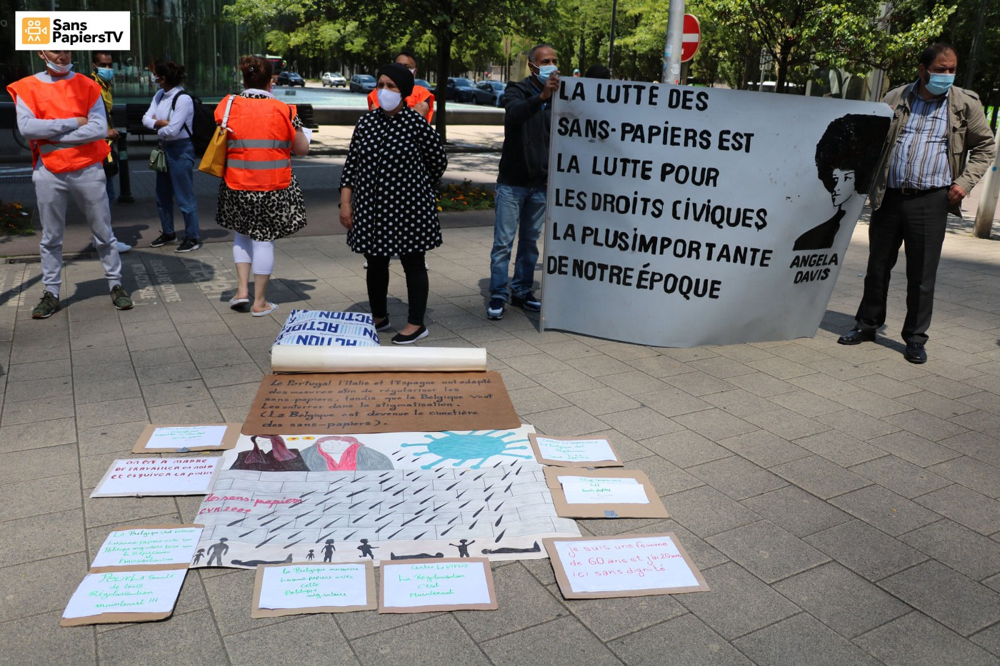
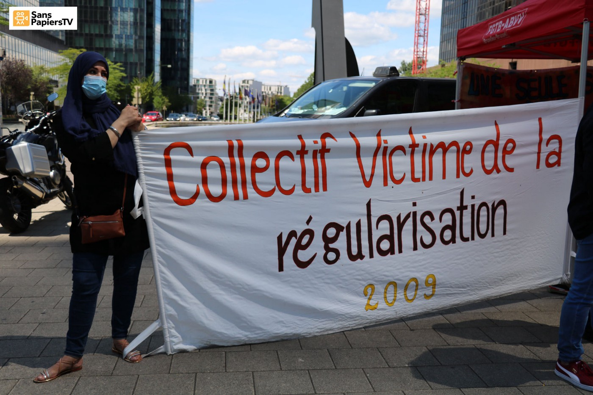

### AYS Weekend Digest 11–12/7/2020: Solidarity on trial, again
#### GREECE: Hunger Strike on Kos comes to forced end\. ITALY: Police brutality and self\-harm in the CPR in Gradisca D’Isonzo\. And more…

 / Photo by [Aesthetics of Crisis](https://www.flickr.com/people/aestheticsofcrisis/) , Athens 2017\)](assets/c3f755bc4953/1*m5c_vZj3G2ffZZoiKB01aQ.jpeg)

“On July 11th there is not much we can say\. Just listen to our sisters and brothers in Bosnia and Herzegovina working for a better world and fighting to get justice\. Learn from them\. Our hearts are in Potočary today\. And learn from our history to never turn your back again when people are getting attacked because of their religion, culture or believes\. _Da ne se zaboravi i nikad ne ponovi_ \#NeverForget \(Text by [No Name Kitchen](https://www.facebook.com/NoNameKitchenBelgrade/photos/a.312076942523930/1022848501446767) / Photo by [Aesthetics of Crisis](https://www.flickr.com/people/aestheticsofcrisis/) , Athens 2017\)
#### Feature: Solidarity on trial, again

■■■■■■■■■■■■■■ 
> **[Alarm Phone](https://twitter.com/alarm_phone) @ Twitter Says:** 

> > One of our Alarm Phone members who just won a human rights award faces trial in Germany. He is accused of ‘inciting criminal acts’ for asking the public to protect and if necessary hide those threatened by deportation. Our full solidarity with him! 
[fr.de/rhein-main/mai…](https://www.fr.de/rhein-main/main-kinzig-kreis/hanau-ort66348/hanauer-menschenrechtsaktivist-muss-wegen-buergerasyl-gericht-13829251.html) 

> **Tweeted at [2020-07-11 17:57:42](https://twitter.com/alarm_phone/status/1282011195428528128).** 

■■■■■■■■■■■■■■ 

On Friday 17th July, Hagen Kopp is [due to appear](https://www.fr.de/rhein-main/main-kinzig-kreis/hanau-ort66348/hanauer-menschenrechtsaktivist-muss-wegen-buergerasyl-gericht-13829251.html?fbclid=IwAR3nu9gXYB9as2RVm8UyEgpGxwSWsYGdkKXUZu-lckaNcDfXTnvLDgvO4Xk) before the Alzenau district court in Bavaria\. He is charged with promoting crimes, as he is among the organisers of the nationwide network [Citizens Asylum](http://aktionbuergerinnenasyl.de) \. The campaign for the citizens’ asylum was launched in 2018, but similar initiatives had already been active locally in 2017\. At the time, in Hanau, [around 50 residents signed a public appeal](https://www.saechsischer-fluechtlingsrat.de/de/2020/07/10/pm-solidaritaet-mit-buergerinnenasyl-aktivisten/) , a practical and symbolic response to deportations to war\-torn Afghanistan:

> “We will grant refugees from Afghanistan who are at risk of deportation, that is, we will make room in our apartments and, if necessary, hide the people who are to be sent back to war and persecution\.” 

In 2018 the campaign expanded to a national level and in several cities initiatives were launched that [publicly announced](https://www.fr.de/rhein-main/main-kinzig-kreis/hanau-ort66348/hanauer-menschenrechtsaktivist-muss-wegen-buergerasyl-gericht-13829251.html?fbclid=IwAR3nu9gXYB9as2RVm8UyEgpGxwSWsYGdkKXUZu-lckaNcDfXTnvLDgvO4Xk) their willingness to protect refugees from deportation to their country of origin or to other EU countries\.

> In an act of civil disobedience and the provision of private housing, active sections of civil society oppose the forced return of people to misery or imprisonment, to persecution or even war\. Citizens Asylum thus becomes both a practical and a symbolic contradiction against the prevailing policy of exclusion\. 

> These initiatives complement church asylum and protective structures in migrant communities\. There is significantly more need than actual church asylum\. The vast majority of those who are illegal or at risk of deportation find accommodation with relatives and acquaintances and are protected by them — despite the considerably greater risk of law enforcement\. This community solidarity cannot be appreciated enough and the Citizens’ Asylum can provide political backing here\. 

German authorities have targeted Kopp because his name appears in the imprint section of the campaign website\. German law acknowledges that, in case of emergency such as danger, otherwise punishable assistance can be justified\. However, prosecutors see enough evidence for a trial\.

SYRIA
#### **Only one border point for aid to remain open**

Updated resolution 2533 will now allow the delivery of food, medicine and other lifesaving assistance through the Bab al\-Hawa Border Crossing but not the [Bab al\-Salaam border crossing](https://www.aljazeera.com/news/2020/07/renews-syria-aid-turkey-access-points-shut-200712054420871.html?fbclid=IwAR0YsiDxEv_kzxrPnupNh1ETZkw8ocMxl2oXuSgRrLyMSUTlG1fj8uGomRU) as [China and Russia vetoed](https://news.un.org/en/story/2020/07/1068181?fbclid=IwAR3X6Waua-Wo5NXE3_eiV5_lugki2A7g3jPQqaPM_EXr4_zhWn_TrPUs4-w) this last week\. A total of [700 deaths](https://www.theguardian.com/world/2020/jul/10/idlib-reports-first-covid-19-case-and-braces-for-fresh-disaster-syria) were recently reported in the northwest due to the inadequate conditions in the camps\. Few details of what actually caused these deaths are known, but hunger is thought to be a contributing factor\. A further 1\.3 million people in northwest Syria who relied on the Bab al\-Salaam border crossing will be left without the humanitarian assistance that they rely on\. This will inevitably lead to further preventable tragedies\.

“Many will now not receive the help they need\. Lives will be lost\. Suffering will intensify\.”

[Agencies working in the area](https://www.middleeastmonitor.com/20200712-lives-will-be-lost-as-syria-aid-access-cut-aid-agencies-warn/) have made this clear, but will anybody listen?

SEA

■■■■■■■■■■■■■■ 
> **[Safa Msehli](https://twitter.com/msehlisafa) @ Twitter Says:** 

> > ‼️ Today, 83 migrants were returned to #Libya by the coast guard and disembarked in Tripoli. 

Close to 6,000 people have been intercepted and taken back to Libya so far this year. https://t.co/bqsi6QjUyl 

> **Tweeted at [2020-07-12 14:43:15](https://twitter.com/msehlisafa/status/1282324648957444096).** 

■■■■■■■■■■■■■■ 

GREECE
#### **Pushbacks in the Aegean continue**

 \)](assets/c3f755bc4953/1*66iQWWZb1FYOC08q4ZUDzw.jpeg)

\(Photo Credit: [Aegean Boat Report](https://web.facebook.com/AegeanBoatReport/posts/873490133174092) \)

Aegean Boat Report has [published an overview](https://web.facebook.com/AegeanBoatReport/posts/873490133174092) of pushbacks in the Aegean since March 2020\.

> From March until today there have been 191 cases \(carrying 6\.144 people\), where people have been picked up/rescued by the Turkish Coast Guard\. In the majority of these cases people from the boats have reported that they were pushed back by the Greek Coast Guard\. The normal procedure is that a RIB or smaller vessel approaches the rubber boat, engines are destroyed and petrol removed before leaving the boat adrift, and in some cases they are towed towards Turkish waters\. 

> According to the European Convention of Human Rights: “Push\-backs are a set of state measures by which refugees and migrants are forced back over a border — generally immediately after they crossed it — without consideration of their individual circumstances and without any possibility to apply for asylum or to put forward arguments against the measures taken\. Push\-backs violate — among other laws — the prohibition of collective expulsions stipulated in the European Convention on Human Rights\.” 

A video with a further report on the pushbacks can be seen [HERE](https://www.youtube.com/watch?v=Uqo2K4kuKGo&feature=youtu.be&fbclid=IwAR25sKLqvGgwIrB5CjA-GbM5v239BJh4iRwocZq64f5eTO8WAX0hb2GNqdg) \.
#### **A moment of celebration in Moria**

■■■■■■■■■■■■■■ 
> **[Franziska Grillmeier](https://twitter.com/f_grillmeier) @ Twitter Says:** 

> > By the way, #refugeesgr in #Moria find multiple ways to break through constant noise, violence, smell &amp; insecurity throughout lock-down since 22/03. In shrinking space, searching for hope + meaning, many turn to religion to restore resilience, e.g. self-organized Sunday church ⬇️ https://t.co/Kn6aT5CDdr 

> **Tweeted at [2020-07-12 15:41:22](https://twitter.com/f_grillmeier/status/1282339275963609088).** 

■■■■■■■■■■■■■■ 

#### **Accountability?**

[Franziska Grillmeier](https://twitter.com/f_grillmeier) also reports on the lack of interagency cooperation on the Aegean Islands, where instead of working together to improve the situation, different actors shift the blame onto each other, thus refusing to take responsibility\. Within this situation, illegal practice is far too easy to get away with\.
#### **Hunger Strike on Kos comes to forced end**

The 80 people on hunger strike for freedom of movement and basic rights [have been forced to stop their action](https://twitter.com/f_grillmeier/status/1282304455170547715) as they were threatened with having their access to water cut\.

In a report from Tarik, a Palestinian resident in February 2020, the situation is clear:

> Please help us, we are locked up in a prison here, you can’t imagine what it looks like\. There are concrete walls and barbed wire fences\. We are in a cage beside some forest; everyone is really scared\. I don’t understand this\. I only want to understand why we are sitting in this prison\. No one tells us anything and the police treat us like shit, we are suffering here\. They only call us by numbers, no names\. When a friend tried to take pictures of the camp with his phone, the policemen took his phone and just destroyed it\. There is one policeman who is not as bad as the others\. He told us that they destroy the phones because this camp here is not allowed\. Why can we not wait outside with the other people here? We are coming for asylum, we are not criminals, we did not do anything, we only want a better life and to be safe\. — [_FFM\-ONLINE_](https://ffm-online.org/refugee-incarceration-on-kos-island/?fbclid=IwAR1rtZ4X7DsNzRHK3LgAbWmFp3xsUZbTQSjKkEeMK0tEGSiwv625lWGUwQQ) 

Human rights in the EU? Something for history books, if they ever existed in the first place\.

Further info on the situation on the Aegean Islands [HERE\.](https://ffm-online.org/refugee-incarceration-on-kos-island/?fbclid=IwAR1rtZ4X7DsNzRHK3LgAbWmFp3xsUZbTQSjKkEeMK0tEGSiwv625lWGUwQQ)
#### **Mayor involved in racist attack on Samos**

The mayor of Eastern Samos, George Stantzos, has apparently been involved in a second episode of bullying of asylum seekers\.

[According to local press reports](https://www.efsyn.gr/ellada/koinonia/251437_mprostaris-se-neo-trampoykismo-prosfygon-o-dimarhos-anatolikis-samoy?fbclid=IwAR0EoosI6NeWXe54fEy4W9R1GXBlHAXyNkjm78ZCZPEEQbgjG_oii0H84vI) , on Tuesday afternoon, the mayor tried to remove “drunk refugees” from Vatheos Square, but “they attacked him, pushed him and threw him down\.”

However, according to eyewitness accounts gathered by solidarity citizens of the island, the mayor unjustifiably and verbally wanted to remove a group of refugees from the square\. As they were frightened, they tried to leave, but the mayor followed them, cursing, and at some point he stumbled and fell without being touched\.
#### **Mask Distribution in Vathy, Samos**

 \)](assets/c3f755bc4953/1*zqA9gycMjcO_M-qge8mETA.jpeg)

\(Photo Credit: [Samos Volunteers](https://web.facebook.com/samosvolunteers/posts/1627310504113770?hc_location=ufi) \)

[Samos Volunteers](https://web.facebook.com/samosvolunteers/posts/1627310504113770?hc_location=ufi) reports that together with [Med’EqualiTeam](https://web.facebook.com/MedEqualiTeam/?__tn__=K-R&eid=ARCCWnmxy-SXnrFwr5xNmlabiLvrlYJBvXo4--SEbKk0WmClOgO4wRUD6dC6P3GsemEvVP-_OXzDYSFN&fref=mentions&__xts__%5B0%5D=68.ARCDb2q4V00hhW3o4G3MxahNN5g0UYSiH1bX5qwE8CGGAGOy6VEOLFGkpzx9EXYtKoDPV8lBvDVhu9LojyY3zq1bSIGNlEHJhqKKwTeOM_7BsbgjpjItrK8ThZHNOgallTZQKbrxLr7W6BAwiKrvpGYsfLc6vjTW1mGshYLP3yWcWij6vQ2zX8J-eDw0-V1MEhGYmOUeN0MPwIh1_XrINl7frdwcbGMgrlv1mOKhyGAD7WJ57ApbSfEaeprlt_IxE8gascUNUCbkbWDEOfyVd4wqh5lHhgW1ygKP7B-y8GqLjwXarl1kaK8hgFL6zYC_xu2S5iBN11kgQ4rBlSJ56yAWcw) , [Refugee 4 Refugees](https://web.facebook.com/Refugee4Refugees/?__tn__=K-R&eid=ARDTvVs7_TS8aYXRDMvLFD2fC7nAHPfImvISqOfsLmDu5cYWvtTvb4Ok_J6oSR1DsNETLu3JOcMDB9CP&fref=mentions&__xts__%5B0%5D=68.ARCDb2q4V00hhW3o4G3MxahNN5g0UYSiH1bX5qwE8CGGAGOy6VEOLFGkpzx9EXYtKoDPV8lBvDVhu9LojyY3zq1bSIGNlEHJhqKKwTeOM_7BsbgjpjItrK8ThZHNOgallTZQKbrxLr7W6BAwiKrvpGYsfLc6vjTW1mGshYLP3yWcWij6vQ2zX8J-eDw0-V1MEhGYmOUeN0MPwIh1_XrINl7frdwcbGMgrlv1mOKhyGAD7WJ57ApbSfEaeprlt_IxE8gascUNUCbkbWDEOfyVd4wqh5lHhgW1ygKP7B-y8GqLjwXarl1kaK8hgFL6zYC_xu2S5iBN11kgQ4rBlSJ56yAWcw) , [Médecins Sans Frontières Greece \(MSF\) \| Γιατροί Χωρίς Σύνορα \(ΓΧΣ\)](https://web.facebook.com/msf.greece/?__tn__=K-R&eid=ARBxIUgk7z_F3gRBnEMOltfH2AOkrlodt0opqdMILo-rLShhzvSCpPnKA_musxbCe_R56ZtsnNNLkh0y&fref=mentions&__xts__%5B0%5D=68.ARCDb2q4V00hhW3o4G3MxahNN5g0UYSiH1bX5qwE8CGGAGOy6VEOLFGkpzx9EXYtKoDPV8lBvDVhu9LojyY3zq1bSIGNlEHJhqKKwTeOM_7BsbgjpjItrK8ThZHNOgallTZQKbrxLr7W6BAwiKrvpGYsfLc6vjTW1mGshYLP3yWcWij6vQ2zX8J-eDw0-V1MEhGYmOUeN0MPwIh1_XrINl7frdwcbGMgrlv1mOKhyGAD7WJ57ApbSfEaeprlt_IxE8gascUNUCbkbWDEOfyVd4wqh5lHhgW1ygKP7B-y8GqLjwXarl1kaK8hgFL6zYC_xu2S5iBN11kgQ4rBlSJ56yAWcw) and [Choose Love](https://web.facebook.com/HelpRefugeesUK/?__tn__=K-R&eid=ARC-sA0BhMIg1C5qJEX-EVWC-nNClJCTcfxSr1KUn-iXuMl-u3JMIX3Hfi3VH4ouYMxo5fibV99tPKR3&fref=mentions&__xts__%5B0%5D=68.ARCDb2q4V00hhW3o4G3MxahNN5g0UYSiH1bX5qwE8CGGAGOy6VEOLFGkpzx9EXYtKoDPV8lBvDVhu9LojyY3zq1bSIGNlEHJhqKKwTeOM_7BsbgjpjItrK8ThZHNOgallTZQKbrxLr7W6BAwiKrvpGYsfLc6vjTW1mGshYLP3yWcWij6vQ2zX8J-eDw0-V1MEhGYmOUeN0MPwIh1_XrINl7frdwcbGMgrlv1mOKhyGAD7WJ57ApbSfEaeprlt_IxE8gascUNUCbkbWDEOfyVd4wqh5lHhgW1ygKP7B-y8GqLjwXarl1kaK8hgFL6zYC_xu2S5iBN11kgQ4rBlSJ56yAWcw) , they have prepared hygiene packs for residents of the Vathy Reception and Identification Centre\.

> Each pack contains two masks, two bars of soap and a leaflet with instructions on how to wear and wash the face mask, wash your hands properly and prevent the spreading of COVID\-19\. 

#### **Removal of benches in Victoria Square, children must sleep on pavement**

■■■■■■■■■■■■■■ 
> **[Yiannis](https://twitter.com/Yiakan) @ Twitter Says:** 

> > Ελλάδα Ιούλιος 2020 
Πλατεία Βικτορίας, Αθήνα. 
Όταν τελειώνουν οι λέξεις
Παιδιά. https://t.co/rDcjoXiw6x 

> **Tweeted at [2020-07-11 20:16:37](https://twitter.com/yiakan/status/1282046157791911938).** 

■■■■■■■■■■■■■■ 

#### **Racist Attack by police reported in Athens**

[KEERFA and Racist Crimes Watch report](https://racistcrimeswatch.wordpress.com/2020/07/12/1-1033/) on police violence in Omonia Square, Athens\.

> A homeless immigrant complains that he was attacked while praying in the park at the junction of Piraeus and Iera Odos this afternoon\. Immediately after this, police officers came and brought him handcuffed to the Omonia Police Department\. 

> There, the homeless immigrant complains that when he asked the police why some people were bothering him while they were praying, instead of answering, they grabbed him by the neck and tore his clothes\. In fact, when he was brought in, they did not even let him keep his shoes on and he was barefoot\. 

> He himself became unemployed in Rhodes after a dispute with a landlord who refused to give him a receipt for the rent in order to declare it to the Tax Office\. He was then subjected to a violent attack by a group that threw him out of the house\. 

> In fact, a month and a half ago, on the way to work, he was stopped by police, who threw some of his papers at him, such as Taxis codes\. 

ITALY
#### Police brutality in the CPR in Gradisca D’Isonzo

No Frontiere FVG published a [detailed account of police brutality](https://nofrontierefvg.noblogs.org/post/2020/07/12/ordinaria-violenza-del-cpr-manganellate-e-autolesionismo-video/?fbclid=IwAR113FZfJkt8paUZcFX-6SuRnzF8RM1_TXbEsH1KMrHrNZKt1DBf7olYPFI) within the CPR \(detention centre\) in Gradisca d’Isonzo \(northeastern Italy, on the border with Slovenia\) \. WARNING: Their post contains graphic videos\.

On Saturday July 4th, police entered several cells in the CPR to seize all lighters, without giving any explanation\. When people started asking why this was happening, police pushed them away, throwing one person on to the floor\. Other detainees intervened to protest:

> One young man who was protesting the abuses was targeted, he was beaten with batons by two policemen on his back and on his head \[…\] \. 

Following the attack, despairing, he took a razor and started to cut himself\. In the following days he kept passing out and was taken to the town hospital\. Once he was dismissed, the guards of the centre seized his hospital papers and he still does not know the results of his analyses\.

> They beat me up, then I fell down and I lost my mind, I took a razor and cut myself \[…\] we are the same flesh, the same blood, it’s not fair that they treat me like a rat\. 

As happened in the case of the death of [Vakhtang Enukidze](https://www.infomigrants.net/en/post/22331/georgian-s-death-in-italian-migrant-center-sparks-outcry) , it is unlikely that there will ever be any real investigation \(officially there is one, which was “proceeding at a rapid pace” in January…\) According to other detainees, Vakhtang was beaten to death by the guards of the CPR at the beginning of the year\.

GERMANY
#### Demonstration in Berlin in support of Family Reunification for Eritrean refugees

Eritrean refugees in Germany have been protesting against the unreasonable demands of the German authorities for applying for family reunification\. Among these, authorities demands that recognised refugees obtain official documents from the Eritrean embassy, the country they have left\.

> Obtaining such documents from Eritrea is an unreasonable act for us, because we are forced by German authorities to go to the representatives of the same government from which we fled\. 

> The German state granting us protection cannot ask us to contact our persecuting state, allow it to humiliate us and allow us to be forced to support this dictatorship financially\. _\( [Refugee Council Berlin eV](https://fluechtlingsrat-berlin.de/presseerklaerung/presseinformation-vom-10-07-2020-auch-gefluechtete-haben-ein-recht-auf-familie/) \) \._ 

A demonstration is [organised for today](https://www.facebook.com/events/282942239717050/) , Monday 13th, at 11 AM local time
#### Germany to accept 928 people from Greek camps

German media [report](https://www.berliner-zeitung.de/news/berlin-nimmt-142-fluechtlinge-aus-griechischen-lagern-auf-li.92561?fbclid=IwAR2OCd4KAnkANNXs8Z6ydEkoq-0jwaFlVbbSFc0xeGdXAuRzK5bHoUt3lCI) that 928 people from Greek camps \(for the large part children and teenagers\) are expected to arrive from July 24th\. Of these, 142 people will be moved to Berlin, to accommodation on the edge of the Tempelhofer Feld\. This has been the result of months of pressure from federal states and civil society\. Berlin local authorities have long supported the admission of people from Greek camps\. They “offered hostels for up to 300 people, which is much more than the usual distribution key of the federal states\. Now there are 150, eight children from the Greek camps had already reached Berlin in May\.”

> In addition, the Senate announced a country program for the admission of additional refugees from Greece in June\. Here, too, there was talk of up to 300 people, including, in addition to unaccompanied minors, other vulnerable people, such as the sick, single parents and pregnant women\. A state admission ordinance has already been adopted, for which the federal government has yet to give the green light\. This has not yet been done\. 

BELGIUM
#### Demonstration for regularisation on Sunday

A national demonstration for effective regularisation policies for migrant workers and sans\-papiers was held on Saturday\. Read more [here](https://www.facebook.com/voixsp1/posts/3110474489035759) \(in French\)

](assets/c3f755bc4953/1*sAZ-CS9jFELjqzeRpHeNRA.jpeg)

Bruxelles, 12/7/2020 \(Photos by [Oscuro Diamante](https://www.facebook.com/natalia.galeano.58)

FRANCE
#### Updates from Calais

As British and French interior ministers met in Calais, French authorities did not want to miss the photo opportunity and ‘swept under the rug’ all the people on the move in the area, [violently evicting all camps](https://www.facebook.com/watch/?v=755788381902694) and shipping people as far as Marseille and the Spanish border\.

> \[Despite this,\] people have already returned to Calais, walking for hours without food or water and falling asleep, dead on their feet, when they finally arrive\. 

> We spoke to one boy who hadn’t stopped walking for two days and hadn’t slept at all on the way, and a young man with a sprained ankle who nonetheless walked for five hours to get to a train station\. We met people who had lost their clothes and even their shoes, but not their will to survive or their belief that one day a better future will be theirs\. 

> As we worked our way around Calais helping where we could, there were people sleeping on bare tarmac — even if they had tents, there is nowhere to pitch them\. Literally every site in Calais has been cleared by the police\. _\( [Care4Calais](https://www.facebook.com/care4calais/) \)_ 

#### Volunteers needed in Paris on Tuesday 14th

[Solidarité Migrants Wilson](https://www.facebook.com/Solidarit%C3%A9-migrants-Wilson-598228360377940) is calling for volunteers for this Tuesday at St\. Denis / Porte D’Aubervilliers, Paris\.

Read the details [HERE](https://www.facebook.com/permalink.php?story_fbid=1482860561914711&id=598228360377940) \.

FRENCH / UK BORDER

A total of 21 people were rescued \( [1](https://www.radio6.fr/article-52597-17-migrants-secourus-samedi-matin-dans-detroit-du-pas-de-calais.html) , [2](https://www.radio6.fr/article-52586-sauvetage-de-4-migrants-cette-nuit-au-large-de-calais.html) \) over the weekend by French authorities while attempting to cross the Channel and reach the UK\.

GENERAL
#### The Rebranding of UNHCR: from refugees to forcibly displaced?

In the last few weeks, UNHCR communication, on both social media and their official channels, signalled a change\. As noted on many occasions by Jeff Crisps, the agency dropped the word ‘refugee’, preferring to talk instead about ‘people displaced across borders’… The way we talk about the world around us is never neutral\. Regarding this change, Crisp points out the rise in recorded internally displaced people \(and the fact that this growth could be related to an increased interest, because “for many years, no\-one bothered to keep accurate records of the scale of internal displacement\) \.

■■■■■■■■■■■■■■ 
> **[Jeff Crisp](https://twitter.com/JFCrisp) @ Twitter Says:** 

> > No need to guess why. The global number of refugees has increased much more slowly than the recroded number of people displaced within their own countries. Hence the rebranding. 

> **Tweeted at [2020-07-12 14:22:25](https://twitter.com/jfcrisp/status/1282319406215897088).** 

■■■■■■■■■■■■■■ 

Attitudes towards refugees across the global North have shifted significantly over the last few years, [as have funding channels](https://twitter.com/DrHana9/status/1282335085056991233) , which are being focused on resettlement programmes within the country and alternatives to migration\. Also, despite much vaunted actions such as the Global Compact on Refugees, the Comprehensive Refugee Response Framework and the Global Refugee Forum, none of these initiatives seems to be able to really uphold the principle of asylum and strengthen the international refugee system\. Fewer and fewer countries abide with the 1951 charter of refugees and anti\-refugee rhetorics are on the rise\. Can this explain the rebranding?

Read further: Jeff Crisp’s [The end of Asylum?](http://www.against-inhumanity.org/2020/07/02/the-end-of-asylum/) , published by United Against Inhumanity

Further readings:
- German newspapers have published two **interviews with [Sea Watch crew member Mattea Weihe](https://www.heise.de/tp/features/Statt-Menschenrechte-einzuhalten-wird-die-Sea-Watch-3-erneut-mit-fadenscheinigen-Begruendungen-4841715.html?fbclid=IwAR3mGsDmCSQtplLhy-4-7X4neQJMMnuwlt1ry2OMdSCoNKQHS-42QMVV7k0) and with [Dominika Wanczyk, nurse on board of the Ocean Viking](https://www.zeit.de/gesellschaft/zeitgeschehen/2020-07/ocean-viking-seenotrettung-notstand-bericht-krankenschwester/komplettansicht) _\._**
- **Migrantes de otro mundo / Migrants From Another World\.** “ _Every year, thousands of people expelled from Asian and African countries cross Latin America looking for the north like swallows disoriented by an altered climate\. Along the way, the already painful journey of these extraordinary human beings is made unnecessarily difficult by almost all governments — putting people at constant risk\.”_ A collaborative, cross\-border investigation that tells the story of their passage through our countries\. Read [**HERE**](http://migrantes-otro-mundo.elclip.org/) the whole investigation \(in Spanish\) and [**HERE**](https://www.bellingcat.com/news/2020/07/10/migrants-from-another-world-introduction-to-the-project/) the introduction to the project \(in English\) \.
- [**On the arrival of prospective UK asylum seekers by boat, and the need for humane policy change**](https://refugee-rights.eu/2020/07/09/on-the-arrival-of-prospective-uk-asylum-seekers-by-boat-and-the-need-for-humane-policy-change/?fbclid=IwAR3oueZKObuiaeDFHYrp0WL8qfz-hcPdRfK-q5xTCn83eO0XuRTlBQGNn2s) **—** From the Refugee Rights Europe Blog\.
- [**For recognized refugees in Greece, the hardship isn’t over**](https://www.dw.com/en/for-recognized-refugees-in-greece-the-hardship-isnt-over/a-54083143?fbclid=IwAR0DU80vU9wTawpnNmD3g05IWd-I0E1NsxSti5Ph-Df7aDRz_OLplFCBgrk) **—** Article published by DW regarding growing problem of homelessness and psychological difficulties faced by recognised refugees\.
- [**How I went from cycle tourer to bicycle delivery boy**](https://cycleforgood.wordpress.com/2020/07/07/how-i-went-from-cycle-tourer-to-bicycle-delivery-boy/?fbclid=IwAR2MLdZgnQlT4U0oHaJuhyP9OKLT58mdUiGH_Ioeh9VY0fwJA1YHxrl1AEQ) **—** A perspective from the ground on cooking in the Khora Social Kitchen in Athens during lockdown\.
- [**Update from No Name Kitchen, Patras**](https://web.facebook.com/NoNameKitchenBelgrade/posts/1023428214722129?hc_location=ufi) **—** report from a new volunteer on the situation at the port

**If you wish to contribute, either by writing a report or a story, or by joining the info gathering team, please let us know\.**

**We strive to echo correct news from the ground through collaboration and fairness\. Every effort has been made to credit organisations and individuals with regard to the supply of information, video, and photo material \(in cases where the source wanted to be accredited\) \. Please notify us regarding corrections\.**

**If there’s anything you want to share or comment, contact us through Facebook, Twitter or write to: areyousyrious@gmail\.com**

_Converted [Medium Post](https://medium.com/are-you-syrious/ays-daily-digest-11-12-7-2020-solidarity-on-trial-again-c3f755bc4953) by [ZMediumToMarkdown](https://github.com/ZhgChgLi/ZMediumToMarkdown)._
