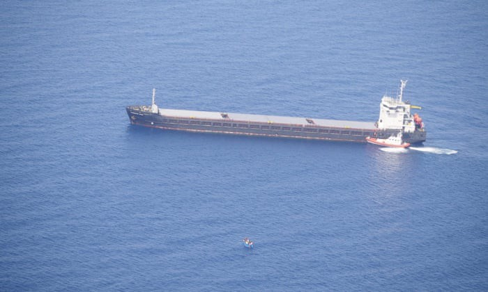

### AYS Daily Digest 15/07/2020: Spotted, ignored and left for dead: The story of 60 people stranded at sea

BVMN’s new report on pushbacks, police violence and EU cover\-ups // Changing migration routes // Legal proceedings against search and rescue ships // Italy’s cooperation with Libya // Forced transfers in Yemen

Merchant ship Karewood Star and an Italian coastguard patrol boat are pictured close to a boat in distress \(Photo Credit: Sea Watch\)
### Feature

[On 13 July, the Moonbird reconnaissance plane](https://www.theguardian.com/world/2020/jul/15/italian-coastguard-and-cargo-ship-ignored-stricken-migrant-boat?CMP=share_btn_tw&fbclid=IwAR1pdykt2EjeJh_QZI6m1cCwmNrUj0OjVUZA5QAYhRe0c5fc17dJ1kUZtI4) , operated by the NGO Sea\-Watch and the Humanitarian Pilots Initiative, took aerial pictures that revealed an Italian Coast Guard vessel and a commercial cargo ship apparently ignoring a migrants’ boat in distress only a mile away from their position\.

Alarm Phone was the first organisation to be alerted to the boat’s position and then immediately notified the Italian and Maltese authorities\. The GPS position of the boat was subsequently also sent to the Moonbird crew\.

At 4:30 pm the Moonbird crew again flew over the last known coordinates of the boat, to find that the boat was still there and that this time there were two other vessels just a few miles from it\. The largest was a merchant ship, the Karewood Star, flying the flag of the Bahamas\. The other was an Italian Coast Guard patrol boat\. International maritime law stipulates that one or both of the ships should have rescued the migrants\. At 8:15pm, having received no update, Moonbird returned to the place of sighting and discovered that the small boat with migrants on board was still there, but both the cargo ship and the Italian coastguard patrol boat had disappeared\.

> An alarm phone spokesperson said “We were thinking they would be taken on board, however, they were still out at sea\.” 

In a press release, the Italian Coast Guard confirmed that despite it arriving to the boat in distress it had not taken part in the rescue operation\. The Italian Coast Guard claim that the cargo ship captain had told them he was planning to rescue the migrants\.

> ‘On reaching the location, the boat was found with about 60 migrants and a merchantman, flying the Bahamas flag, sent there by the Maltese authorities,” wrote the Coast Guard\. According to Italian officers, the cargo ship captain reported he was “ready to carry out the rescue of migrants”\. 

The Moonbird had attempted to contact the captain of the cargo vessel to understand why this ship had also not conducted the rescue mission but due to linguistic misunderstandings he was unable to give a valid explanation\. After two days at sea, the 60 people on the boat were finally rescued by an Italian Guardia di Finanza military ship, but as the timeline of the events shows they should never have been left at sea, especially considering that two boats were available to rescue them\.

> In a final statement, Alarm Phone said ‘‘They were abandoned by European authorities for over 40 hours\. While we are glad they survived and were eventually rescued and taken to Lampedusa, we are once again appalled by the cynical non\-assistance policies that play out in the Mediterranean and that needlessly endanger so many vulnerable lives,’’ 

### Balkans

The Border Violence Monitoring Network has released their latest monthly report\. In their June report, they have published 20 cases of illegal pushbacks, documenting the experience of 351 people whose rights were violated at the European Union’s external border\. This report summarizes the data and narrative testimony shared by people on the move, highlighting the depth of violence being carried out in the service of hard borders\.

The report analyses among other things:
- Knife attacks by Croatian police
- EU cover\-up of abused monitoring funds
- Drownings in the Mrežnice and Korona rivers
- Pushbacks from Romania and Italy
- Violence in the Evros region and the Aegean Sea

Further analysis is also given to the use of weapons and specialised vehicles by Frontex in their Albania mission\. Legal developments in both Hungary and Serbia are also noted, showing how processes of alignment and deviation from EU law are impacting asylum\-seekers rights\. While in Greece, attacks on NGOs and groups accessing aid reached a peak in June\. Five years on from the “summer of migration”, physical and system\-based violence at borders remains incredibly high in the Balkan Region and Greece\.

To read the full report please follow:

The grassroots humanitarian organisation No Name Kitchen is seeking ‘handy volunteers’ available for 10–14 days to assist in their warehouses in Croatia, Bosnia and Serbia\.

■■■■■■■■■■■■■■ 
> **[NoNameKitchen](https://twitter.com/NoNameKitchen1) @ Twitter Says:** 

> > If you are a handy person, you are needed ASAP. Contact info@nonamekitchen.org and in the Subject write "HANDY VOLUNTEER"

Share it, please https://t.co/SS9HO55LCq 

> **Tweeted at [2020-07-15 17:42:04](https://twitter.com/nonamekitchen1/status/1283456814374363148).** 

■■■■■■■■■■■■■■ 

### Sweden

[Sweden will start receiving quota refugees again](https://sverigesradio.se/sida/artikel.aspx?programid=83&artikel=7515434&fbclid=IwAR3amrZ_E9mZo2aXB4NCZebrfXsfcU_2ehH6OL2ajhJrrEgBq9B6jG3xER4) \. The procedure and transfers was stopped for several months due to the outbreak of the coronavirus\. The Migration Agency said that they now will “slowly resume” the transfers\. The number of quota refugees Sweden will grant protection to this year is set to be 5000\. The majority of the refugees will be from Syria and the Middle East\.
### Spain

The [Canary Islands Emergency and Security Coordinating Center and the Red Cross](https://www.europapress.es/islas-canarias/noticia-salvamento-maritimo-rescata-patera-migrantes-cinco-millas-gran-canaria-20200715093034.html?fbclid=IwAR3bSON-97yTKSwD0etvp5_drc4gIbCZKirv0I888DgY0g1_sMW8taYY25c) have announced that a Maritime Salvage boat has rescued a boat with nine people on board\. This boat was reported to be five miles east of the island of Gran Canaria\. Once the boat was rescued they were then transferred to the Arguineguín pier, in the municipality of Mogán, where they were assessed by health personnel\.

On 13 July, Sophie Muller, a representative of the UN Agency for Refugees in Spain, [began a four\-day visit to the Canary islands](https://www.infomigrants.net/fr/post/26017/espagne-le-hcr-va-renforcer-sa-presence-sur-les-iles-canaries?fbclid=IwAR2RGwOsmVQGQiGSxoO_nApqAAhGV6JbIbyID-XVbmRtGillQ1o9r8bEmCI) to gather first\-hand information and transfer recommendations on the context of international protection, coinciding with the increase of sea arrivals in recent months\. [Between January and June 2020](https://www.acnur.org/es-es/noticias/esp/2020/7/5f0c5e404/la-representante-de-acnur-en-espana-visita-canarias-coincidiendo-con-un.html) , 2,700 people arrived in the Canary Islands, mainly from Mali, Ivory Coast, Senegal, Guinea and Morocco, compared to the 464 who arrived in the same period of the previous year\. The UN Agency for Refugees in Spain plans to strengthen its presence in the Canary Islands before the end of the year, through a team who will work together with the authorities and entities to identify possible needs for international protection and referral to the asylum, among people arriving by sea\.

[It has been announced](https://www.elespanol.com/espana/20200713/cae-llegada-migrantes-espana-mediterraneo-ue-redujo/504950275_0.html?fbclid=IwAR2euR4PIeknNWqa0JMJsuNXV52hVwT3uXKCemKj8kaVgjA_BPqXM34pELo) that a total of 4,451 migrants and refugees had arrived in Spain in the first six months of the year via the Western Mediterranean route\. This represents a 56% decrease in arrivals and is the largest reduction among all migration routes to the European Union\. Frontex has reported that this drop is mainly due to the impact of the current health crisis and pointed out that this decrease was ‘especially pronounced’ on the routes of the Western Mediterranean\.

In contrast, Frontex has reported that the Western Balkan route has become the most active migration route over the last month with 2,050 people arriving\. This represents a 70% increase over May and three times more than in the same month last year\.
### Yemen

[The United Nations has reported](https://www.aljazeera.com/news/2020/07/migrants-yemen-stranded-abused-coronavirus-fears-200715052701434.html?fbclid=IwAR0e8mxyc8TS7sDszkL3p4MVwavtTYyMK_24FX2LeWIr-8wZzZXtBnbKoKE) that at least 14,500 African migrants, mostly from Ethiopia, stranded in Yemen have been harassed and forcibly transferred internally amid fears that they may be spreading the coronavirus\. The IOM reported that tens of thousands of people remain stranded without adequate food, water or shelter in a country that is going through what the UN is calling the “worlds worst humanitarian crisis”\.

IOM spokesman Paul Dillon declined to give [Al Jazeera](https://www.aljazeera.com/news/2020/07/migrants-yemen-stranded-abused-coronavirus-fears-200715052701434.html?fbclid=IwAR0e8mxyc8TS7sDszkL3p4MVwavtTYyMK_24FX2LeWIr-8wZzZXtBnbKoKE) specifics regarding who was responsible for the transfers, but had told journalists in Geneva that an unknown number of the stranded migrants could be held in detention centres that had poor hygiene standards even before the outbreak of COVID\-19\.
### Greece

[Europe Must Act](https://www.facebook.com/europemustact/posts/157640635848639?hc_location=ufi) has published a press release regarding the recent protest by Syrian asylum seekers against arbitrary mass rejection of their asylum application\. The press release reads:

> Today we saw more peaceful and orderly protest by approximately 100 Syrian asylum seekers against arbitrary mass rejections of their applications, on the island of Chios\. This it the third protest this week\. The protesters told [Europe Must Act](https://www.facebook.com/europemustact/?__tn__=K-R&eid=ARCTH_kodaohu1MHEdQ2qf_4_WQ_FwsCFQGKUkH0hLPmHeL1ZhicYj3zqjMj698WVpsrbRba9IOMUQyM&fref=mentions&__xts__%5B0%5D=68.ARBLnXXm54lapuhJquuKN74bVij_iFkxw09Dl0GabFvvx4tIIj7HxCEcnBychWc_n3GEpn7OAdKjqXoaAcfQFcd5E3E6FkK95bKD2Zu-vazIyLD3A0nfC4_9SM66CJZHfihT_pWjTzFa7pn1q-wKJcIgulmxMKorvsfy8sDWDXnHLq_E2-MbhtEsi_bnwEw41kVnGBx6YLQjx458cg5t5tUeDD3d8BCzikXATiqVpefJXpL_Yk64LRIVkcwNX95x28fofBkxpxqvvi6pq_xjtLa1bDAfRRy_TLSIM64OQd_KY1Dhi5TDCSEb2Q83MCtiINdjswuWaalms56GcCKQnNM) that they are determined to continue their peaceful protests until their voices are heard all over Europe\. You can help them by sharing this post\. 

> Men, women and children gather on the main square of Chios town to protest the fact that their applications are rejected regardless of status\. Children, the elderly, pregnant women and people in need of medical care are being rejected despite having proven that Turkey, let alone Syria, is not a safe country for them\. 

> ● Europe sends vulnerable people back to countries where they face persecution, or worse, war\. Meanwhile people who flee violence and conflict are being pushed back at sea\. 

> ● Europe is reneging on its responsibility to provide asylum seekers a fair hearing and dignified living conditions\. 

> ● Europe is breaking its own laws and betraying its values\. This is utterly unacceptable\. When someone is in need, you help them\. 

> ● Europe must act to ensure the rights and dignity of asylum seekers\. 

Similar demonstrations have broken out in Mytilini due to the second rejection of 15 Syrian families\. It is reported that this will result in their support and food supply in Moria being cut off\. Their small peaceful protest was met with riot police\.

■■■■■■■■■■■■■■ 
> **[Vera Magali Keller](https://twitter.com/veramagalik) @ Twitter Says:** 

> > Today 15 Syrian families demonstrated in #Mytilini because they received second rejections and will now be cut off  support and food supply in #Moria. The peaceful protestors were met with riot police (TW: police brutality). #freethecamps #refugeesgr 1/x https://t.co/PZAtuIHdzt 

> **Tweeted at [2020-07-14 19:27:32](https://twitter.com/veramagalik/status/1283120965279506432).** 

■■■■■■■■■■■■■■ 

■■■■■■■■■■■■■■ 
> **[Vera Magali Keller](https://twitter.com/veramagalik) @ Twitter Says:** 

> > Today 15 Syrian families demonstrated in #Mytilini because they received second rejections and will now be cut off  support and food supply in #Moria. The peaceful protestors were met with riot police (TW: police brutality). #freethecamps #refugeesgr 2/x https://t.co/CXXTvA5opr 

> **Tweeted at [2020-07-14 19:35:14](https://twitter.com/veramagalik/status/1283122904029421570).** 

■■■■■■■■■■■■■■ 

Further NGOs and civil\-society initiatives have again reported harassment from Greek authorities while carrying out humanitarian intervention or support\. Tassos from Steps, an organisation that has recently faced police harassment, had this to say:

> During the period of the imposed quarantine in Greece and especially after the lifting of the restrictive measures, Steps had — and still have — to deal with many new facts during street\-work, such as the lack of basic needs \(i\.e\., water\) for many vulnerabilities living mostly on the streets of Athens 

> Meanwhile, shopkeepers and residents of the areas where the distribution of food and water is taking place often targeted the team’s Streeters who received — almost daily — verbal attacks\. Our continuous presence and support to street\-connected people also provoked the emergence of plainclothes police officers who tried to intervene and obstruct our action\. As a highlight, during our action on Tuesday, 14 July, undercover police officers reached the spot where we were distributing food and water and asked to proceed to a stop\-and\-search process\. Initially, they started frisking two of our members at that time present at the action’s spot, and then they continued to search our van\. Therefore, this is another incident where state authoritarianism is trying to leave people living on the streets in even more vulnerable situations and survival conditions by violating their fundamental human right to public\-goods access\. After all, who benefits from keeping the homeless and the users of psychoactive substances helpless? 

> Our team members will continue to stand by the most vulnerable side and continue to claim the human rights of those who are the target of this new intense biopolitics\. 

Since February 2020, The Greek Asylum Service has stopped publishing monthly statistical data without any justification\. The statistical reports of the Asylum Service provided detailed monthly figures on the number of applications registered by Regional Asylum Office and Autonomous Asylum Unit, the number and type of decisions taken \(refugee status, subsidiary protection, rejection on the merits, inadmissibility by specific ground, withdrawal\), recognition rates for key nationalities, as well as extensive information on the implementation of outgoing and incoming Dublin procedures\.

Responding to the Asylum Service’s refusal to publish statistical data, [Refugee Support Aegea](https://rsaegean.org/en/asylum-statistics-for-2020-should-be-published-and-unpacked/?fbclid=IwAR0gXN5jgylYaRp6tvOb8n0oGk-XNabxCR7pd2SI7ogDuNYpIJeTj1v8hoI) n said:

> Suspending the publication of detailed Asylum Service data leaves a critical knowledge gap as regards the functioning of the asylum procedure in Greece\. Such a gap cannot be covered by brief figures made available to the public by the Ministry of Migration and Asylum press releases\. In this respect, it is worth highlighting that the Ministry appears to have also stopped the provision of weekly data to the European Commission, as implied by a recent letter of the Director\-General for Migration and Home Affairs to the Minister\. 

### Libya

The UNHCR Libya have an important announcement regarding the services accessible at the Community Day Centre in Tripoli\.

> Please be informed that services at the **Community Day Center \(CDC\) in Tripoli will be limited tomorrow \-16 July 2020\- to persons with appointments only\.** In case you have an emergency, our hotlines remain operational to provide counseling and appointments\. I **n case you have an emergency or life\-threatening medical concern, please contact IRC’s 24/7 medical hotline for support on 091–035\-4839\.** 

> UNHCR contact numbers: 
 

> Protection services in urban areas 091 712 7644 — \(24 hours/day — seven days/week\)
 

> Emergency/Detention 091 989 7936 — \(24 hours/day — seven days/week\)
 

> Registration 091 989 7937\- \(from 9:00 am to 5:00 pm, Sunday\-Thursday\) 

To read the full announcement please click the [link](https://www.facebook.com/UNHCRTripoli/posts/1045268259204138)

■■■■■■■■■■■■■■ 
> **[Safa Msehli](https://twitter.com/msehlisafa) @ Twitter Says:** 

> > 🛑The situation in #Libya is worse than it has ever been.

We reiterate our call to the European Union for an urgent shift in approach to Libya to end to the intolerable suffering of those being returned and detained. 

Not a safe port. https://t.co/HXw03lznKj 

> **Tweeted at [2020-07-15 11:48:08](https://twitter.com/msehlisafa/status/1283367742654033920).** 

■■■■■■■■■■■■■■ 

It has [been reported](https://twitter.com/rgowans/status/1283414509906952199) that the Director of the Coastal Security General Administration BGen\. Mohamed Al\-Nuwaisiri has met with Security Advisory staff at the Italian Embassy in Libya\.

This meeting shows the Italian authorities continued refusal to adhere to calls by the EU commission and the broader international community to halt their cooperation with the Libyan authorities\. The Coastal Security General Administration, which the Italian Embassy has held meetings with, has routinely been accused of firing weapons at NGO search\-and\-rescue teams who were carrying out life\-saving rescue missions\. Furthermore, the Coastal Security General Administration is under the control of the Libyan Interior Ministry, which is in charge of the detention facilities across Libya where torture, abuse and enforced starvation are commonplace\.
### Italy

It has been announced by the [Italian Interior Ministry](http://www.ansamed.info/ansamed/en/news/sections/generalnews/2020/07/14/migrants-in-italy-may-be-quarantined-at-military-hospitals_900faf69-a4af-4f9f-8d49-8dd89b42f880.html?fbclid=IwAR0oSMfHlB0g3yAr26A6pq_cRgPQrtD0cne0lBQ3DxK1yp-oaTBWzYuAwJE) that migrants who arrive in the country may be put into coronavirus quarantine at military hospitals\.

The Ministry said it continues to pay “the utmost attention to the protection of citizens’ health, in particular in regions such as Sicily and Calabria that are the most exposed to the autonomous arrival of migrants”\.

The Ministry said it has “reinforced surveillance measures, including for local reception facilities, with the possibility of the transfer of migrants under quarantine to military hospitals, where necessary”\.

Yesterday, at the Gradisca CPR, a 28\-year\-old man passed away\.

It’s being reported by civil society groups that the young man had been given a powerful mixture of sedatives, antiepileptic and high\-powered benzodiazepine\. It is believed that a similar mixture is often administered to the inmates, with psychopharmaceutical abuse being common in these internment centres\. “No Cpr e no frontiere — FVG’ published a statement saying that ‘ _if the boy — whose name we don’t know yet — died of an overdose of psychopharmaceuticals, direct responsibility for his death lies with the CPR”\._

“No Cpr e no frontiere — FVG’ have also reported that this is not the first death from within the centre, and another inmate was found dead in his bed on 14 July\.

### Sea

The European Union Agency for Fundamental Rights \(FRA\) [has published their 2020 update](https://fra.europa.eu/en/publication/2020/2020-update-ngos-sar-activities?fbclid=IwAR1ftbhqgUpib25W-6fM6Tx9Ox-2_bS5OqrJw1NGbTgW9jJfaZUuX5hWh2s) on NGO ships involved in search and rescue in the Mediterranean and the legal proceedings against them\.

](assets/a7efdede827/1*r1MPaCNd5zyFBUlt_Po1aw.jpeg)

[**Map showing NGO ships involved in SAR operations in the Mediterranean Sea between 2016 and 15 June 2020**](https://fra.europa.eu/en/publication/2020/2020-update-ngos-sar-activities?fbclid=IwAR1ftbhqgUpib25W-6fM6Tx9Ox-2_bS5OqrJw1NGbTgW9jJfaZUuX5hWh2s)

The map shows that due to ongoing criminal proceedings, vessel seizures, and other restrictive measures imposed in response to the outbreak of the COVID\-19 pandemic, the majority of these assets are blocked in ports without the possibility of carrying out SAR operations\. Since the beginning of June 2020, a few vessels have started sailing again \(“Sea Watch 3, “Mare Jonio” and “Astral”\) following the relaxation of the measures to contain the COVID\-19 pandemic\. Out of a total of 15 vessels and two reconnaissance aircraft deployed in June 2020, five were held in ports pending legal proceedings \(see assets in red\) whereas others were stuck in ports due to COVID\-19 restrictions or other reasons \(see assets in yellow\) \. The map also displays the vessels and/or their crew subject to past or current legal proceedings\.

In the past twelve months, three new rescue vessels and one reconnaissance aircraft started operations in the Mediterranean\. Since the outbreak of the COVID\-19 pandemic and the seizure of the Aita Mari and the Alan Kurdi vessels in May 2020, however, no NGO rescue vessel was carrying out SAR activities at sea until Sea Watch 3 resumed operations in early June 2020\. This was due to a combination of factors: seizures and/or criminal investigations but also the restrictive measures to protect public health imposed by EU Member States, including the closure of the Italian and Maltese ports considered “unsafe” by the authorities\.

The report by the FRA hows that over 40 proceedings have been initiated since 2017 by Germany, Greece, Italy, Malta, the Netherlands and Spain\. Over ten legal cases were opened since last year, seven of which were in Italy\. Among them, a dozen were still pending\. Over twenty ended with an acquittal or were discontinued due to the lack of evidence\.

Watch the Med — Alarm Phone have shared the events of another boat in distress entering the Maltese Search and Rescue Zone and their ongoing fight to help get them reduced\. After one of the 23 people on the boat in distress phone Alarm Phone, the organisation immediately asked the Maltese and Italian authorities to launch a rescue operation\. After a treacherous time stranded at sea, the people in distress were able to reignite the engine and start trying to head towards safety\. The MRCC Rome refused responsibility for the boat and the RCC Matla didn’t answer the phone calls\. Fortunately, the 23 people on the boat managed to reach Lampedusa safely\. Alarm Phone reports that “once more they were needlessly left in distress for many hours”\.
### **France**

On Sunday 19 July at 2:00 pm a tribute will be held for the 29\-year\-old Sudanese boy who died tragically last Friday in the Saint\-Denis Canal\. The 29\-year\-old named Doni had been in France for five years after fleeing the war in his country, and his tragic death has once again highlighted the terrible conditions that people are forced to endure even once arriving in ‘safety’\.

[Solidarité migrants Wilson](https://www.facebook.com/permalink.php?story_fbid=1484251001775667&id=598228360377940&hc_location=ufi) who is supporting the [vigil on Sunday](https://www.facebook.com/permalink.php?story_fbid=1484251001775667&id=598228360377940&hc_location=ufi) said:

> With his countrymen, we refuse to let Doni be forgotten after being rendered invisible\. We want to honour a duty of memory to him, and to all victims of a policy that is not up to the level of respect for fundamental rights\. 

> See you Sunday, 19 July at 2 pm on the banks of the canal, at the level of the bridge of Stains\. 115 av\. Victor Hugo, at Aubervilliers — east bank of the canal, along the bike path\. 

](assets/a7efdede827/1*MwgNvKb5pXFPqRRzDuGMMA.jpeg)

Photos of Dori shared by [Solidarite migrants Wilson](https://www.facebook.com/permalink.php?story_fbid=1484251001775667&id=598228360377940&hc_location=ufi)

Care 4 Calais reports on the last weeks brutal evictions that occurred in Calais\. The organisation is calling for donations to help keep people warm, fed and dry\.

[Ouest France](https://www.ouest-france.fr/monde/migrants/un-migrant-admis-a-sciences-po-mais-bloque-en-grece-6905068?fbclid=IwAR22spJ12ohYzcYCBoZq6-le6mAI68yZ19Jubj9oHNKx5_lvJEbmCpovM9A) has reported that a young Guinean migrant, admitted to the prestigious French university Sciences Po Paris, is stranded in Greece because the examination of his asylum application has been delayed by the coronavirus epidemic\.

Diplomatic sources quoted by Ouest France suggest that the French embassy in Athens has taken up the case of the young Guinean migrant\.

Speaking to the newspaper Le Monde, Amadou Diallo, the 20\-year\-old in question said “I’m stuck here in Greece, at the door to my dreams”\. In a recent statement his lawyers said “Amadou could go to France with a pass issued by the French embassy in Athens or wait for asylum in Greece and then travel with his passport\. But this second solution would obviously take longer”

Humanite\.Fr shared a report of recent updates about a group of young migrants who have filed a recent legal action\. The report reads: “to denounce the lack of support for young migrants who have filed a legal action to have their minority recognized, a camp was set up at the end of June in the heart of Paris at the initiative of five associations \(Médecins Sans Frontières, Utopia 56, COMÈDE, Midis du MIE and TIMMY\) \.

The associations demand that the public authorities take charge of all these young people present on French territory, so that they can be educated, have accommodation suited to their situation, but also care and educational monitoring\.”

**If you wish to contribute, either by writing a report or a story, or by joining the info gathering team, please let us know\.**

**We strive to echo correct news from the ground through collaboration and fairness\. Every effort has been made to credit organisations and individuals with regard to the supply of information, video, and photo material \(in cases where the source wanted to be accredited\) \. Please notify us regarding corrections\.**

**If there’s anything you want to share or comment, contact us through Facebook, Twitter or write to: areyousyrious@gmail\.com**

_Converted [Medium Post](https://medium.com/are-you-syrious/ays-daily-digest-15-07-2020-spotted-ignored-and-left-for-dead-the-story-of-60-people-stranded-a7efdede827) by [ZMediumToMarkdown](https://github.com/ZhgChgLi/ZMediumToMarkdown)._
