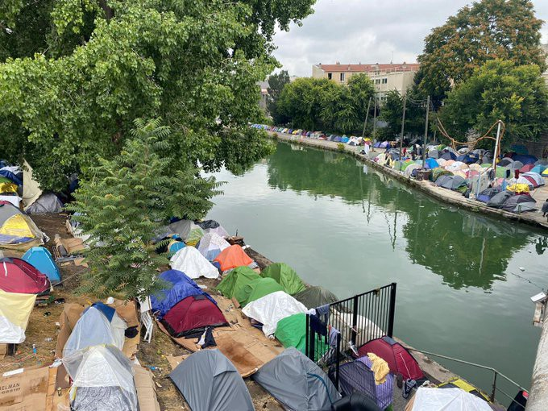
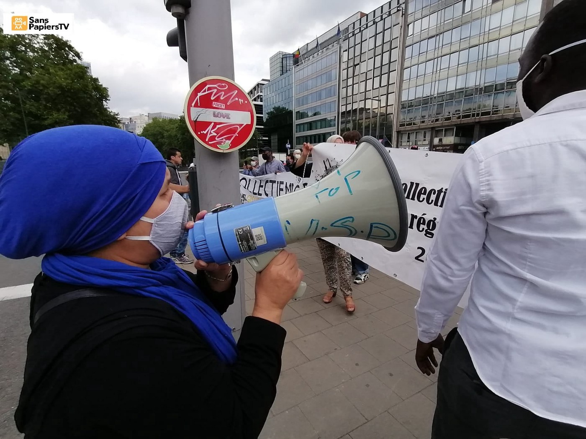
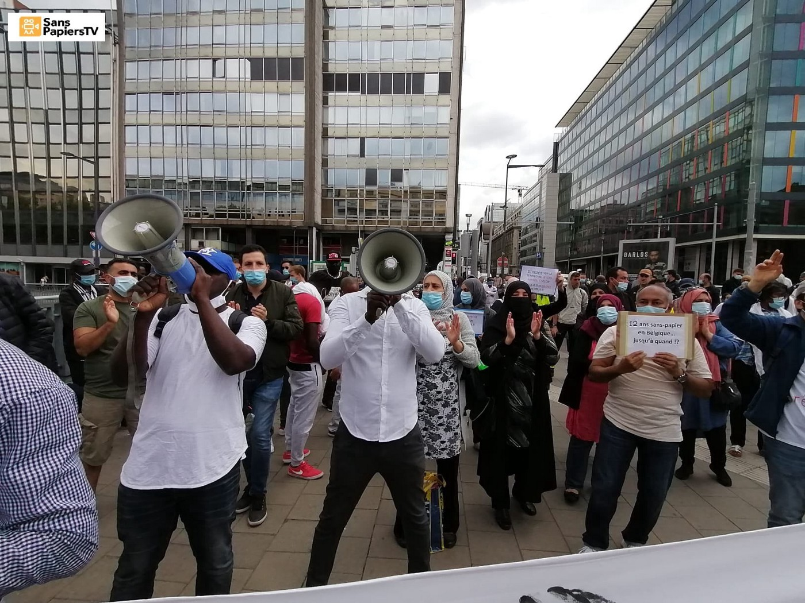

### AYS Daily Digest 16/07/2020: Eritrean asylum claims systematically rejected in Slovenia
### Short recap on events in Greece since New Democracy took power // New insights into EU’s cooperation with the Libyan Coast Guard // Deportation flights from Germany start again // Updates from France

> [Jul 17](ays-daily-digest-16-07-2020-eritreans-claims-for-asylum-in-slovenia-being-systematically-rejected-3f2d20043fd8?source=post_page-----3f2d20043fd8----------------------) · 16 min read 

Paris, where around 800 migrants are living in tents along Canal Saint\-Denis\. Copyright: InfoMigrant
### FEATURE: Eritreans’ claims for international protection are being systematically rejected in Slovenia

The hardships of Eritreans in Slovenia that we previously reported continues\. Our friends from Info Kolpa in Slovenia sent us the following report:
### A response to the increase in negative decisions of applications for international protection of Eritreans in Slovenia\.

Since the end of 2019, the Ministry of the Interior has been systematically rejecting applications for international protection of Eritreans\. This practice is surprising as it deviates from previous years when the ministry issued positive decisions to many Eritreans who arrived in Slovenia under the relocation program\. However, the majority of Eritreans asylum seekers, who recently came to Slovenia via the Balkan route, received a negative decision\. Of the approximately 15 Eritrean applicants, a positive decision was issued in 3 cases, all other applicants were rejected\. Following the appeals of rejected applicants, the negative decisions of the ministry have so far been upheld by the administrative court in 4 cases, despite the obvious life\-threatening situation the applicants face upon their return to their country of origin\.

“I saw guards beating and screaming at very tired people\. The doctor came at the same time the food was being distributed\. If you went to see the doctor, you missed the food\. It was better to take the food\. The doctor couldn’t help you\. He could only give you a pill or two\. If you couldn’t walk and work, if you were too exhausted, they took you by car to an unknown location\. I didn’t see anyone come back\. Maybe they survived, maybe they died,” recalls an Eritrean asylum seeker in Slovenia when he describes the behaviour of guards and conditions in an Eritrean labour camp from which he escaped\. His application for international protection was denied by the ministry in the winter of 2020\.

The recent negative decisions of the ministry on Eritrean applications deviate significantly from the average in other EU countries that are better aware of the political situation in Eritrea\. Eritrea is ruled by a military dictatorship that does not respect human and labour rights\. Eritrea is found at the top of indexes compiled by international organizations \(International Labour Organization, International Organization for Migration, Walk Free Foundation\) of countries where forced labour is present\. Eritrean citizens are often forced into decades of military service\. They are deployed to perform hard physical labour on construction sites, fields and in mines\. Whoever escapes from military conscription or labour camps and is then captured by security forces faces imprisonment as well as a possible death sentence outside of a court ruling\. Therefore, according to the European Asylum Support Office \(EASO\), European countries grant international protection at the first instance to more than 80% of Eritrean applicants\. A greater proportion of positive decisions are granted only to applicants from Syria and Yemen, countries that are both ravaged by devastating wars\.

The ministry’s arguments in individual negative decisions are misleading and outright bizarre\. The ministry refers to an allegedly improved situation in Eritrea\. This is contradicted by current reports by international organizations and European institutions\. The ministry cites only a few sources in its decisions and rejects reports from other international organizations \(United Nations, Amnesty International, Human Rights Watch, CIA\) and the media \(The Guardian, The Irish Times\) based on a flat assessment that they contain mostly testimonies of Eritrean refugees, which it considers being subjective and therefore biased\.

Decisions are written generically and unprofessionally\. The use of sources on the situation in Eritrea is selective\. The handling of individual cases is non\-factual and contains incorrect geographical data and information on the applicant’s religion, language and marital status\. Such misinformation is not surprising, as there are no interpreters for the languages spoken in Eritrea on the ministry’s official list of court interpreters\. The forced selection of translators that do not speak the applicant’s mother tongue is thus necessarily unprofessional, inappropriate and leads to invalid formal procedures\. It can also lead to inconsistencies and inaccuracies in the written record and false interpretation of the applicant’s statements\.

It is necessary to remember that in Slovenia the practice of coordinated rejection of applicants for international protection of citizens of a particular country is not new\. In 2016, the Ministry of the Interior rejected Afghan applicants in this way\. No Afghan adult individuals or families received a positive decision at that time, despite a clear deterioration of the situation in their country of origin\. This type of bureaucratic violence and erection of paper walls intends to informally expulse applicants\. Eritrean applicants can wait for their decisions up to 19 months, which exceeds the 15\-month deadline required by Directive 2013/32/EU of the European Parliament\. As Eritrea is a military dictatorship, deportations to it are not possible\. All that is left to the rejected applicants is to flee Slovenia in hope of getting protection elsewhere or to stay in Slovenia and be deported to Croatia and then to BiH as illegal persons\. Due to lengthy court appeals and pessimism about the future, the applicant’s already unpredictable position gets worse and forces refugees to leave Slovenia — a decision that suits the ministry\.

Unprofessional and careless handling of applications for international protection serves to strengthen the repressive migration policy of Slovenia and the EU\. We demand answers to the following questions from the Ministry of the Interior:
- How does the ministry explain the recent change in decisions regarding applications for international protection of Eritreans?
- What political changes in Eritrea justify recent negative decisions?
- How does the ministry comment on the relevance of a decision if it does not rely on current reports?
- What does the ministry accept as an objective and impartial source on the situation in Eritrea if it does not accept the reports of international
organizations that are based on numerous and consistent testimonies of Eritreans?

We demand that the Republic of Slovenia has a fair and inclusive asylum policy, that it respects the right to international protection, accepts more refugees and increases its integration capacities\!

The statement was prepared by Infokolpa with cosignatories:

Zavod Voluntariat — SCI Slovenija, Inštitut za afriške študije, Amnesty International Slovenija, Mirovni Inštitut, Društvo Humanitas, Društvo Odnos, Društvo Raznolikost, Zavod Tri, Zavod Proja
### GREECE

Events in Greece are constantly one of the main issues in this digest\. In the last year, since the conservative\-right party Nea Dimokratia \(New Democracy\) came into power in July 2019, we saw a dramatic shift in practices directed against people on the move, support networks, and leftist communities\. New Democracy’s policies quickly shifted towards more restrictions for refugees, illegal push\-backs at the borders, evictions of squats in Athens, and the violent targeting of anarchistic structures\.

In the following section, we want to recall some of these events and offer you some interesting further readings\.

**Push backs in the Evros river region**

In September 2019, Forensic Architecture published its first report on investigations into alleged push backs in the Evros border region between Greece and Turkey\. In November, Mobile Info Team also published a report presenting testimonies of people who were pushed back\. The group had begun collecting these testimonies in August 2018\. In March 2020, Respond published an article about a detention facility in the region that was operated officially at one time, but then disappeared from official records\. As it is still operating in 2020, it is very likely that it is being used to perform illegal pushbacks\.

**Escalation in the Evros border region in March 2020**

In March 2020, Erdoğan declared the EU\-Turkey deal a failure\. As for Turkey, he said, the country would no longer take any measures to stop people from trying to make it into Greece\. Subsequently, thousands of people came to the northern border crossing in the hope of being able to make it into Europe\. The situation quickly escalated when Greek Border authorities used tear gas in order to keep people away from the border\.

Fascist groups from all over Europe declared their sympathy with the Greek Border authorities and in some cases actually travelled to the border in order to support them\. At the end of the standoff, two men, Muhammad Al\-Arab and Muhammad Gulzar, died after being shot at, and four more were injured\. Forensic Architecture investigated these incidents together with European magazines and eventually determined that live rounds were being fired from the Greek side of the border\. Although it may not have happened on purpose, it is very likely that the shots that killed Muhammad Al\-Arab and Muhammad Gulzar were fired from Greek officials\.

European Commissions President Ursula von der Leyen, who observed the situation in a helicopter fly\-over, thanked Greece for being “the shield of Europe”\.

**Push backs from Greek mainland**

An unprecedented \(or at least undocumented\) further breach of law happened in March and April, when in different incidents at least 194 people were pushed back from the camp in Diavata and the Drama Paranesti pre\-removal centre\. While, as we have seen above, push backs in border regions have occurred on a regular base, this has been the first\-well documented case in which people were removed from city camps in mainland Greece\. The Border Violence Monitoring Network, which documented the cases, stated that the respondents received the false information by the police that they would be issued a document to temporarily regularize their stay\. Instead, they were captured, beaten, robbed, detained, and driven to the border area, where they were placed on boats and taken across the Evros River into Turkey\.

**Maritime push backs**

The sea border between Greece and Turkey also saw an increase in illegal push backs\. In some cases, people on a boat trying to reach Greece would be hit by Greek Coast Guards with sticks, destroying their boat’s engines, and then pushed back into Turkish waters\. In other cases, they would be placed on tent\-like inflatable life rafts that do not have motors and cannot be steered properly\. They would be left adrift in the Aegean until they reached Turkey or were collected by the Turkish Coast Guards\. Some cases were recorded in which groups of people who most likely reached Lesvos were pushed back again after disembarkation\.

**Situation in the island camps**

The situation in the island camps is a constant matter of outrage\. Until recently, people were at least free to leave the camp during the days to escape the overcrowdedness, sounds, and smells\. But since March 23rd, the camps have been in lockdown\. In order to leave the camp, residents need a special allowance\. While tourists arrive back on the islands and the risk of a new outbreak of Corona rises, people on the move are restricted from even having a short break from a place that can best be described as hell\.

**Evictions of camps**

At the beginning of June, many people from Moria were granted asylum and freedom of movement as their asylum procedure was closed\. While this was a good thing in the first place, no provision had been taken for what should happen to them from now on\. They had to leave the camp and were without housing and financial support\. With nowhere else to go, many people gathered in Victoria Square in Athens\. The police became repressive around the middle of June, trying to force people into other camp structures\.

At the same time, NGOs that support migrant communities have been asked to register with the state\. This has been seen as an act of repression against the support networks, as Greek bureaucracy can make it extremely difficult for the many small organizations that stand in solidarity with refugees in Greece to gain official status\.

**New law of Assembly and the death of Vassilis Maggos**

On 13th of July, Vassilis Maggos died\.

Vassilis took part in a demonstration on June 13th; from video footage, it seems that he has been targeted by the police deliberately\. After the protest, he young anarchist was beaten and potentially tortured by police without ever being officially detained\. After the beating, the police threw him out into the street instead of bringing him to a hospital\. He was later found and taken to the hospital, where he spent four days\. He died one month after the attack\.

A new law against freedom of assembly was passed on July 9th\. It indicated that assemblies and demonstrations have to be preregistered and one person has to be responsible for all potentially occurring damage\. Large protest were held in opposition to this new law\.

**This was only a short run through the events of the last year\. We highly recommend reading the following links for more information\.**
### [Greece: Everything Is Coming to a Boil](https://da.crimethinc.com/2020/07/15/greece-everything-is-coming-to-a-boil-looming-recession-the-ban-on-freedom-of-assembly-and-the-murder-of-vassilis-maggos-1?fbclid=IwAR3bepLaHXQlB0WV0EwHFugIgUft7ctdsioeJhxr96UPA0rVh9Dsx9LxhZQ)
### [Since coming to power last summer, Greece’s far\-right New Democracy party has waged an all\-out war against immigrants…](https://da.crimethinc.com/2020/07/15/greece-everything-is-coming-to-a-boil-looming-recession-the-ban-on-freedom-of-assembly-and-the-murder-of-vassilis-maggos-1?fbclid=IwAR3bepLaHXQlB0WV0EwHFugIgUft7ctdsioeJhxr96UPA0rVh9Dsx9LxhZQ)
#### [da\.crimethinc\.com](https://da.crimethinc.com/2020/07/15/greece-everything-is-coming-to-a-boil-looming-recession-the-ban-on-freedom-of-assembly-and-the-murder-of-vassilis-maggos-1?fbclid=IwAR3bepLaHXQlB0WV0EwHFugIgUft7ctdsioeJhxr96UPA0rVh9Dsx9LxhZQ)
### [Greece: Investigate Pushbacks, Collective Expulsions \| Human Rights Watch](https://www.hrw.org/news/2020/07/16/greece-investigate-pushbacks-collective-expulsions?fbclid=IwAR0tNOuYyd3y3_eJrLT-s0FqVQfcFDeuv-D19xvvWNpjKn5bdlhGrE5smkU)
### [Greek law enforcement officers have summarily returned asylum seekers and migrants at the land and sea borders with…](https://www.hrw.org/news/2020/07/16/greece-investigate-pushbacks-collective-expulsions?fbclid=IwAR0tNOuYyd3y3_eJrLT-s0FqVQfcFDeuv-D19xvvWNpjKn5bdlhGrE5smkU)
#### [www\.hrw\.org](https://www.hrw.org/news/2020/07/16/greece-investigate-pushbacks-collective-expulsions?fbclid=IwAR0tNOuYyd3y3_eJrLT-s0FqVQfcFDeuv-D19xvvWNpjKn5bdlhGrE5smkU)

All of the reports mentioned above can be found in this thread:
### MONTENEGRO

On July 15th a Frontex operation was launched in Montenegro\. This is the agency’s second operation outside of the EU, the other one being Albania\. According to Frontex, several police officers will be deployed in Montenegro in order to assist the Montenegrin border authorities at the Croatian border\.
The new cooperation is based on an agreement between Forntex, the EU Council, Montenegro and Serbia\. Similar agreements were initiated with Bosnia and Herzegovina and North Macedonia and will come into effect any day now\.

For more information, see:
### [Fronteks pokrenuo operaciju u Crnoj Gori, drugu van granica EU](http://rs.n1info.com/Region/a620080/Fronteks-pokrenuo-operaciju-u-Crnoj-Gori-drugu-van-granica-EU.html?fbclid=IwAR28ixUMRI-zLmhRTIXZQfe5VPyVETWsWuFGUq0rpRVVxCIjkNrL6xm9CBk)
### [Evropska agencija za graničnu i obalsku stražu \(Fronteks\), čiji je osnovni zadatak zaštita spoljnih granica Evropske…](http://rs.n1info.com/Region/a620080/Fronteks-pokrenuo-operaciju-u-Crnoj-Gori-drugu-van-granica-EU.html?fbclid=IwAR28ixUMRI-zLmhRTIXZQfe5VPyVETWsWuFGUq0rpRVVxCIjkNrL6xm9CBk)
#### [rs\.n1info\.com](http://rs.n1info.com/Region/a620080/Fronteks-pokrenuo-operaciju-u-Crnoj-Gori-drugu-van-granica-EU.html?fbclid=IwAR28ixUMRI-zLmhRTIXZQfe5VPyVETWsWuFGUq0rpRVVxCIjkNrL6xm9CBk)
### BALKAN

No Name Kitchen published a video with updates from Patras \(Greece\), Sid \(Serbia\), and Velika Kladusa \(BiH\) \. The video is in Spanish and can be found on the Facebook page \(since Medium\.com does not support Facebook links, we can not insert it here directly\. \)
### LIBYA

A great example of how Europe is involved in implementing and strengthening the Libyan Coast Guard through donations, funds and expertise can be found today\. A press release has been published on the website of the European Commission, announcing the “delivery of 30 vehicles \(SUV\) by the Italian Ministry of Interior \[…\] for use by the Libyan authorities as part of the EU border Management programmes in Libya\.”
The cooperation with theLibyan authorities is mainly financed by the EU Emergency Trust Fund for Africa \(EUTF Africa\), a fund that is meant to address “the root causes of instability, forced displacement and irregular migration and to contribute to better migration management\.”
In the press release, the European Commission claims that support for the Libyan border management “aims to protect the lives of those making dangerous journeys by land or sea\.”

At the same time, UNHCR and IOM, along with numerous other Human Rights organizations, repeatedly explain that Libya is not a safe country and people should not be returned there\. We have published countless examples of incidents in which European maritime organizations have been alarmed about boats in distress within their Search and Rescue Zones but remained inactive until the Libyan Coast Guards intervened and brought the people back to Libya\. In Libya, they will most certainly again end up in the hands of criminals who torture and detain them\. It is outrageous how the European Commission uses this press release to reframe its support for the Libyan authorities as a benevolent act\.

For everybody interested in what cooperation between the EU and Libyan authorities looks like, we recommend reading the press release while bearing in mind what reality looks like in the Libyan detention centers\.
### [EU delivers support to border management in Libya — European Neighbourhood Policy And Enlargement…](https://ec.europa.eu/neighbourhood-enlargement/news_corner/news/eu-delivers-support-border-management-libya_en?fbclid=IwAR3Me9368DS_RSltq91k4wPxVvlVhBW0D03yi5enQD_rHHtoBY0gqS55lfU)
### [Today, the EU Emergency Trust Fund for Africa \(EUTF Africa\) is announcing delivery of 30 vehicles \(SUV\) by the Italian…](https://ec.europa.eu/neighbourhood-enlargement/news_corner/news/eu-delivers-support-border-management-libya_en?fbclid=IwAR3Me9368DS_RSltq91k4wPxVvlVhBW0D03yi5enQD_rHHtoBY0gqS55lfU)
#### [ec\.europa\.eu](https://ec.europa.eu/neighbourhood-enlargement/news_corner/news/eu-delivers-support-border-management-libya_en?fbclid=IwAR3Me9368DS_RSltq91k4wPxVvlVhBW0D03yi5enQD_rHHtoBY0gqS55lfU)
### SEA

A boat with 63 people on board has finally been rescued by Maltese authorities\. Alarm Phone has been in contact with the people on the boat since Thursday morning and contacted all the relevant authorities\. The boat was in the Maltese SAR zone, but the Maltese authorities once again did not cooperate with the NGO\. The NGO eventually learned of the rescue through the media\. The people were rescued about 24 hours after Alarm Phone has first been in contact with them\.
### ITALY

In Italy, the Parliament voted in favor of further funding for the Libyan Coast Guard on Thursday July 16\. The house gave its go\-ahead with 401 votes in favor, 23 against, and 2 abstentions\.
Former President of the Chamber Laura Boldrini said in her speech in the Chamber that Libya has never been a safe haven\. “Supporting the Libyan coastguards means supporting illegality, violations of human rights and also of international law\.” \(GT\)
For more information, see:
### [La Camera approva la risoluzione sulle missioni internazionali ma la maggioranza si spacca](https://www.agenzianova.com/a/5f117d3d9ec5c6.20251094/3027020/2020-07-16/la-camera-approva-la-risoluzione-sulle-missioni-internazionali-ma-la-maggioranza-si-spacca/linked)
### [Roma, 16 lug 13:42 — \(Agenzia Nova\) — Se il centrodestra è risultato compatto sul voto per la proroga delle missioni…](https://www.agenzianova.com/a/5f117d3d9ec5c6.20251094/3027020/2020-07-16/la-camera-approva-la-risoluzione-sulle-missioni-internazionali-ma-la-maggioranza-si-spacca/linked)
#### [www\.agenzianova\.com](https://www.agenzianova.com/a/5f117d3d9ec5c6.20251094/3027020/2020-07-16/la-camera-approva-la-risoluzione-sulle-missioni-internazionali-ma-la-maggioranza-si-spacca/linked)

According to a news article by InfoMigrants, thirteen migrants who tested positive for COVID\-19 were taken to the military hospital in Rome after locals protested their stay in Amantea\.
Meanwhile, the Italian government is in search for a new ship to host people who have been rescued at sea for two weeks quarantine\. The company that provided the current quarantine ship decided not to renew the contract\.
For more information, see:
### [Italy: COVID\-19 positive migrants transferred to military hospital in Rome](https://www.infomigrants.net/en/post/26051/italy-covid-19-positive-migrants-transferred-to-military-hospital-in-rome?preview=1594883956178&fbclid=IwAR3J_NCkre1G66jKlqU5gUSN0If7_M0GknHi32KRbDgyBVI4LZE9FHnZ4QA)
### [Thirteen migrants who tested positive for COVID\-19 in Italy and were taken amidst protests by local residents to the…](https://www.infomigrants.net/en/post/26051/italy-covid-19-positive-migrants-transferred-to-military-hospital-in-rome?preview=1594883956178&fbclid=IwAR3J_NCkre1G66jKlqU5gUSN0If7_M0GknHi32KRbDgyBVI4LZE9FHnZ4QA)
#### [www\.infomigrants\.net](https://www.infomigrants.net/en/post/26051/italy-covid-19-positive-migrants-transferred-to-military-hospital-in-rome?preview=1594883956178&fbclid=IwAR3J_NCkre1G66jKlqU5gUSN0If7_M0GknHi32KRbDgyBVI4LZE9FHnZ4QA)
### SPAIN

On Wednesday, seven people were rescued from a boat off the coast of Gran Canaria by the Spanish Sea rescue organization Salvamento Marítimo\.
### GERMANY

Months after Germany halted deportations because of the Corona pandemic, a first return flight occurred on Thursday\. 19 Pakistanis who were not granted asylum were deported to Islamabad\. Deportations to countries of origin have not been officially halted, unlike so called Dublin deportations to other EU member states\. Since mid\-June, some Dublin deportations have been taking place again\. These deportations are taking place at the same time a travel warning for German citizen is in place until the end of August\.
For more information, see:
### [Germany and Greece deport failed asylum seekers to Pakistan](https://www.infomigrants.net/en/post/26068/germany-and-greece-deport-failed-asylum-seekers-to-pakistan?fbclid=IwAR3nlxyKRl1PqtVN2kT2JgWS4SozuXiFMFPYIkJq2jjyfbzE-BGQ8F6GBaA)
### [Germany carried out a deportation flight to Pakistan leaving from Frankfurt\. It is the first of its kind since the…](https://www.infomigrants.net/en/post/26068/germany-and-greece-deport-failed-asylum-seekers-to-pakistan?fbclid=IwAR3nlxyKRl1PqtVN2kT2JgWS4SozuXiFMFPYIkJq2jjyfbzE-BGQ8F6GBaA)
#### [www\.infomigrants\.net](https://www.infomigrants.net/en/post/26068/germany-and-greece-deport-failed-asylum-seekers-to-pakistan?fbclid=IwAR3nlxyKRl1PqtVN2kT2JgWS4SozuXiFMFPYIkJq2jjyfbzE-BGQ8F6GBaA)

A German man faced trial for having promoted a “civil society asylum” \(Bürgerasyl\) \. The man was alleged to have been maintaining a website that supported the idea of helping failed asylum seekers by sheltering and eventually hiding them in private households\. The jury acquitted him of the charges on Thursday\.
### BELGIUM

A protest took place on Wednesday in Belgium to demand regularization for paperless people\.

copyrights: Sans\-Papiers TV
### FRANCE

According to an article published by StreetPress, it is a common practice by gendarmeries in Mayotte, an oversea part of France, to intentionally change the age of unaccompanied minors in order to permit their deportation\. In one case, a fourteen year old who was traveling with her four siblings in order to join their father \(who is legally staying in Mayotte\) was registered as being an adult and received an order to leave French territory together with her siblings, for whom she was made responsible\. The siblings were subsequently placed in a pre\-removal detention centre\. Under French law, it is forbidden for unaccompanied minors to be placed in these facilities\. Only three days later, the Red Cross learned that the eldest of the siblings was only fourteen and took her into child welfare\. At the same time, the father of the children was repeatedly trying to reach out to the authorities to make clear that all of them were minors\.
The article collects similar stories and shows what seems to be a common practice\. For the full article in French, see:
### [À Mayotte, les autorités falsifient volontairement l’âge de mineurs isolés pour les expulser](https://www.streetpress.com/sujet/1594805209-mayotte-autorites-falsifient-volontairement-age-de-mineurs-isoles-expulsions-migrants-outre-mer)
### [Idriss \(1\) se marre en commentant les papiers remis à sa petite soeur Zaïna \(1\) par la préfecture\. “ Elle ne peut pas…](https://www.streetpress.com/sujet/1594805209-mayotte-autorites-falsifient-volontairement-age-de-mineurs-isoles-expulsions-migrants-outre-mer)
#### [www\.streetpress\.com](https://www.streetpress.com/sujet/1594805209-mayotte-autorites-falsifient-volontairement-age-de-mineurs-isoles-expulsions-migrants-outre-mer)

On July 8, the French State Council confirmed that the French Ministry of the Interior is violating the right to asylum at the French\-Italian border\. In the case brought before the State Council, a woman and her son had been pushed back even though the woman clearly expressed her intention to apply for asylum\. According to a NGO active at the border, on July 6 and 7 alone, they recorded the refoulement of 83 people from France to Italy\. At the same time, Caritas association in Ventimiglia, an Italian border city, said they registered about 100 people being pushed back from France to Italy every day\.

People have the right to an individual procedure, even if they pass from one EU member state into another\. The first step of the procedure would be a Dublin check that would determine whether or not another country is responsible for carrying out the procedure\.
### [Caritas Ventimiglia says France is pushing back 100 migrants per day](https://www.infomigrants.net/en/post/26062/caritas-ventimiglia-says-france-is-pushing-back-100-migrants-per-day?preview=1594893256468&fbclid=IwAR2fIllXiNBsGXQsVegyKpGoVYAEEp8K-1u9pw9y-oZU55VDSD3QT2YrfeU)
### [The association Caritas Intermelia in Ventimiglia denounced that French authorities are pushing back about 100 migrants…](https://www.infomigrants.net/en/post/26062/caritas-ventimiglia-says-france-is-pushing-back-100-migrants-per-day?preview=1594893256468&fbclid=IwAR2fIllXiNBsGXQsVegyKpGoVYAEEp8K-1u9pw9y-oZU55VDSD3QT2YrfeU)
#### [www\.infomigrants\.net](https://www.infomigrants.net/en/post/26062/caritas-ventimiglia-says-france-is-pushing-back-100-migrants-per-day?preview=1594893256468&fbclid=IwAR2fIllXiNBsGXQsVegyKpGoVYAEEp8K-1u9pw9y-oZU55VDSD3QT2YrfeU)

This is what a central European capital looks like today:

In Calais, a big eviction of more than 1000 people took place\. Support networks are trying to reach out to the people who are now spread across the area, most of the time without access to water\.

Meanwhile, the UK Home Secretary Priti Patel explained that the numbers of channel crossings are “unacceptably high” and that France is responsible for doing more in order to make the crossing “unviable\.”
Care4Carlais and other NGOs expressed their concern about this new tone from the UK\. Care4Calais stated:

> _“The way to solve the crisis in the Channel is to create a safe, legal process for asylum applications to be heard so that dangerous and illegal journeys don’t have to be made\. That would be fair, it would be controlled and it would break the business model of people smugglers\.”_ 

### GENERAL

The Open Society Foundation published a Case Study investigating the situation of Agri\-Food Workers in Germany, Netherlands and Sweden\.
### [Are Agri\-Food Workers Only Exploited in Southern Europe?](https://www.opensocietyfoundations.org/publications/are-agri-food-workers-only-exploited-in-southern-europe?fbclid=IwAR1v_-yAbxtCSsMVaqYhUxL7-KuqkAAilIrysBhicttiiXdHuOvOEddi1sU)
### [In recent years, several studies have reported on the exploitation endured by migrant workers in Southern European…](https://www.opensocietyfoundations.org/publications/are-agri-food-workers-only-exploited-in-southern-europe?fbclid=IwAR1v_-yAbxtCSsMVaqYhUxL7-KuqkAAilIrysBhicttiiXdHuOvOEddi1sU)
#### [www\.opensocietyfoundations\.org](https://www.opensocietyfoundations.org/publications/are-agri-food-workers-only-exploited-in-southern-europe?fbclid=IwAR1v_-yAbxtCSsMVaqYhUxL7-KuqkAAilIrysBhicttiiXdHuOvOEddi1sU)
### WORTH READING

This article speaks about everyday resistance against Fortress Europe\.

> _“Under COVID\-19 emergency rule, the EU border regime creeps further into our daily lives, calling for everyday resistance through solidarity and mutual aid\.”_ 

### [Everyday Borders, Everyday Resistance](https://roarmag.org/magazine/everyday-borders-everyday-resistance/?fbclid=IwAR06wtAWCFV9cqL3uHW25I1ZTDbzcwLoCQheGFyzaMHkDPvv0ploIyv-uAU)
### [Illustration by David Istvan In recent years there have been many instances of increased migrant mobility at Europe’s…](https://roarmag.org/magazine/everyday-borders-everyday-resistance/?fbclid=IwAR06wtAWCFV9cqL3uHW25I1ZTDbzcwLoCQheGFyzaMHkDPvv0ploIyv-uAU)
#### [roarmag\.org](https://roarmag.org/magazine/everyday-borders-everyday-resistance/?fbclid=IwAR06wtAWCFV9cqL3uHW25I1ZTDbzcwLoCQheGFyzaMHkDPvv0ploIyv-uAU)

The transnational institute published a policy briefing on how the consequences of Covid\-19 affect refugees and migrants\.
### [COVID\-19 and border politics](https://www.tni.org/en/publication/covid-19-and-border-politics?fbclid=IwAR06wtAWCFV9cqL3uHW25I1ZTDbzcwLoCQheGFyzaMHkDPvv0ploIyv-uAU)
### [This briefing takes a look at the consequences of the Covid\-19 pandemic for refugees and migrants, and its anticipated…](https://www.tni.org/en/publication/covid-19-and-border-politics?fbclid=IwAR06wtAWCFV9cqL3uHW25I1ZTDbzcwLoCQheGFyzaMHkDPvv0ploIyv-uAU)
#### [www\.tni\.org](https://www.tni.org/en/publication/covid-19-and-border-politics?fbclid=IwAR06wtAWCFV9cqL3uHW25I1ZTDbzcwLoCQheGFyzaMHkDPvv0ploIyv-uAU)

**If you wish to contribute, either by writing a report or a story, or by joining the info gathering team, please let us know\.**

**We strive to echo correct news from the ground through collaboration and fairness\. Every effort has been made to credit organisations and individuals with regard to the supply of information, video, and photo material \(in cases where the source wanted to be accredited\) \. Please notify us regarding corrections\.**

**If there’s anything you want to share or comment, contact us through Facebook, Twitter or write to: areyousyrious@gmail\.com**

_Converted [Medium Post](https://medium.com/are-you-syrious/ays-daily-digest-16-07-2020-eritrean-asylum-claims-systematically-rejected-in-slovenia-97ed34f46086) by [ZMediumToMarkdown](https://github.com/ZhgChgLi/ZMediumToMarkdown)._
