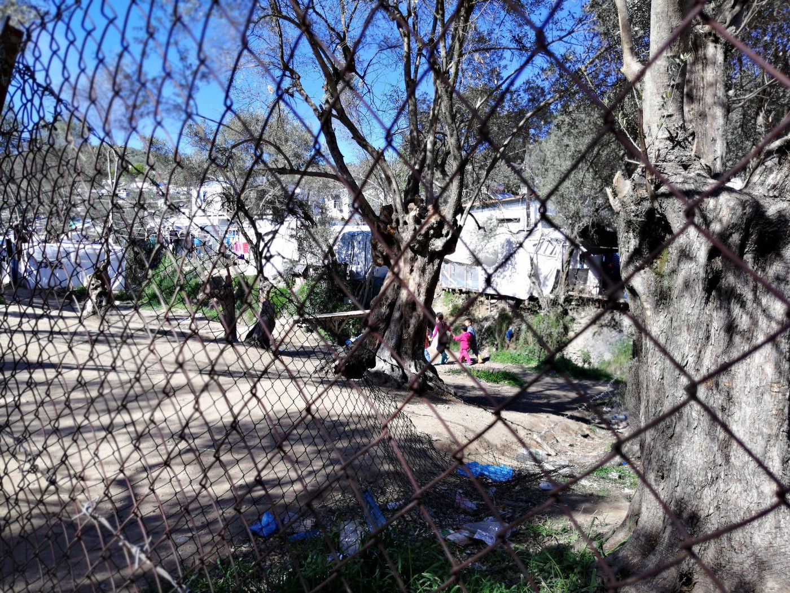
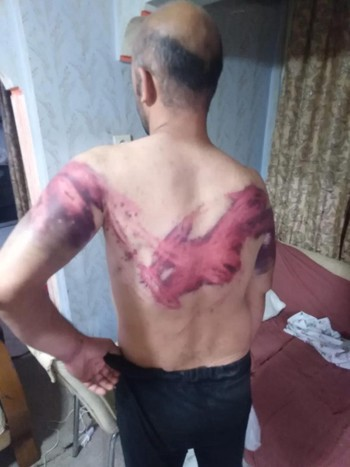

### AYS Daily Digest 20/7/2020 Slovenia carried out collective expulsions and chain push\-backs

[Are You Syrious?](@AreYouSyrious?source=post_page-----929023b816d8----------------------)

[Jul 21](ays-daily-digest-20-7-2020-slovenia-carried-out-collective-expulsions-and-chain-push-backs-929023b816d8?source=post_page-----929023b816d8----------------------) · 9 min read

Zintan detention centre attacked by armed men — More brutal pushbacks on the Evros border — Italy is trying to stop humanitarian SAR activities, again — more…

### FEATURED — Court finds Slovenian authorities guilty of Collective expulsion and Chain push\-back

Border Violence Monitoring Network report about the landmark ruling of the Slovenian Administrative Court on July 16\. The court found that the national police force carried out an [**illegal collective expulsion**](https://push-forward.org/novica/zlocin-na-periferiji) of a member of a persecuted English\-speaking minority from Cameroon who wanted to apply for asylum in Slovenia\. Even more, the court shed light on the diffusion of so\-called chain push\-backs, where people on the move are handed from one border authority to the next one and pushed\-back through several countries\.

> _The court heard the experience of the applicant, J\.D\., who was held in a Slovenian police station for two days and denied access to asylum, despite making three verbal requests\. After this procedural gatekeeping, the applicant was readmitted to Croatia — under an agreement described by the Slovenian Ombudswoman as “against the European legal order”\. From Croatia, J\.D\. was chain refouled to Bosnia\-Herzegovina, a pattern analysed in a [feature length report](https://www.borderviolence.eu/wp-content/uploads/Report-on-illegal-practice-of-collective-expulsion-on-Slovene1.pdf) by InfoKolpa published in May 2019\._ 

The court found that the Slovenian authorities violated the rights of J\.D\. in several ways:
- the police did not inform him of his asylum rights, and effectively denied his right to apply for asylum\.
- The pushback breached the prohibition of collective expulsion\. J\.D\. was not issued a removal order, nor given translation and legal aid prior to his readmission to Croatia\.
- In regards to the chain refoulement, the judgement found “ _sufficiently reliable reports on possible risks from the point of view of Article 3 of the ECHR”_ in both Croatia where the applicant was initially removed, and also in Bosnia\-Herzegovina where he was subsequently pushed back\. Just to be clear, Article 3 refers to the prohibition of torture: “No one shall be subjected to torture or to inhuman or degrading treatment or punishment\.”

On this last point, BVMN conclude that the findings are in line with evidence collected in their extensive reporting in 2019 showing that [80% of recorded pushback cases](https://www.borderviolence.eu/new-report-on-cases-of-torture-of-asylum-seekers-by-croatian-authorities-at-eu-external-borders/) from Croatia breached the law on torture or inhumane and degrading treatment\.
### [Lorena Fornasir](https://www.facebook.com/photo.php?fbid=3083197291797347&set=a.309992879117816)
### [BalkanRoute Trieste 20 luglio All’Europa dei confini Ai Ministri e personalità, giornalisti e media, che mai hanno…](https://www.facebook.com/photo.php?fbid=3083197291797347&set=a.309992879117816)
#### [www\.facebook\.com](https://www.facebook.com/photo.php?fbid=3083197291797347&set=a.309992879117816)

On Monday, Lorena Fornasir published a photo of the leg of person who arrived in Trieste in the past few days\. The person, it is [reported in the post](https://www.facebook.com/photo.php?fbid=3083197291797347&set=a.309992879117816) , was tortured by Croatian police with a scorching hot metal bar\.

The Slovenian Ministry of Internal Affairs has already confirmed that they intend to appeal this judgment\. However, If the court decision becomes final, Slovenian authorities will be forced to allow the applicant to enter the country and file an application for international protection without delay, as well as provide €5,000 in compensation\.

Commenting on the outcome, the applicant stated:

> _“I know and believe that the judgement will help those that come after me\. It may not have a direct solution for me, but I know that we are creating awareness and you give more trust to the law of the country\.”_ 

LIBYA
### Zintan detention centres attacked by armed men

A total of 400 people are still detained there, despite being among the first to have registered with UNHCR in 2017\. News like this one, that so rarely reach European media, are the tombstone on the self\-absolving narratives promoted by EU governments — Italy and Malata especially — who have been trying to defend their support to the Libyan coast guard to curb migration flows\. The detention centre in Zintan is not an ‘unofficial’ prison\. It is one of those ‘official’ detention centres which has been funded through the support to the UN\-backed government\.

> _The situation is so serious that the Libyan manager of Zintan told all detainees that his guards cannot protect them & they should contact UN agencies & \#NGOs for help to be transferred away urgently\._ 

Zintan and all other detention centres need to be evacuated immediately\. Twenty\-five people have already died in this centre\. Those imprisoned there are starving and living in fear:

> _if kidnapped they will be sold, tortured for ransom, enslaved, or killed\.These refugees have already suffered years of torture under traffickers and then by the Libyan police in Gharyan & TariqAlMatar\._ 

TURKEY
### Death toll rises as feared after Van lake shipwreck

Following our report in the weekend digest, 56 or 59 bodies have now been recovered \(according to different sources\) in the lake on the border between Iran and Turkey, infoMigrants [report](https://www.infomigrants.net/en/post/26109/death-toll-in-van-lake-boat-sinking-rises-to-56?fbclid=IwAR2ahlArpmv_ByEgmgXsgMhqZAq6-gJJYbQ8OmPQ3dK99gk8HO9IR_AR5Rw) \. The boat was missing since June 27\. The boat is now believed to have carried between 60 and 100 people on board\.

The province of Van has become an important hub for the routes to Turkey from Central Asia\. The lake offers more protection from tightening border controls operated by Turkish authorities\. However, the area has also become a “ [death pit](https://ahvalnews.com/van/how-did-turkeys-eastern-province-van-become-refugee-graveyard) ”\. Frost and snow in winter on the mountain tracks and stormy weather throughout the year over the lake have caused a high number of casualties\.

GREECE
### Arrivals

[Aegean Boat Report inform](https://www.facebook.com/AegeanBoatReport/) that one boat carrying 28 people landed in Palios, Lesvos north east, at 11\.30 on Monday morning\. The new arrivals will, after COVID\-19 test results are ready, be taken to the quarantine camp in Megala Thermis, Lesvos north for 14 days quarantine due to the coronavirus\.

At the moment there are a total of 358 people in quarantine on Lesvos, 267 people in Megala Thermis, Lesvos north and 91 people in Kara Tepe, Lesvos south\.
### Anti\-Turkish rhetoric, more pushbacks and exporting refugees, is this the Greek summer?

Again, Greek politicians are [warning](https://www.theguardian.com/world/2020/jul/20/greece-prepares-for-arrival-of-migrants-amid-deteriorating-ties-with-turkey?fbclid=IwAR1yw2x0ic9Qt6NQFmUBxlPlkoM7rKHNfqFLrmeaMuI1dXFm_OTE7MTF0tQ) of a surge in arrivals as a direct consequence of their Turkish counterparts’ policies\. Anti\-Turkish rhetoric has been systematically used by this government to promote their border policies and the brutality of police, army and coast guard deployed to “defend Europe”\. The [Spartacus network of conscripted soldiers](https://diktiospartakos.blogspot.com/2020/07/blog-post_507.html) has published a complaint about the intensification of border patrols on the Evros river\. And the army seems to have started to hand out certification for ‘effective contribution’ to the ‘deterrence of mass entry of populations’ to soldiers…

Certificates that probably refers to ‘effective contributions’ like this one:

> _In his testimony he recalls the events, which are far from being an isolated episode, but fit into a practice of gang\-methods, racist policies, brutality and impunity:_ 

> _He was picked up on the streets and taken to the police station in Didymoteicho\. After a few hours he was taken to another room, where three police officers dressed in black with masked faces were waiting for him_ 

> _They ordered him to undress, to keep only his underwear\. For an hour he was beaten wildly with clubs, punches and kicks\. He explained to them that he had papers and that they were wrong\. “Do not speak, you have no right to be in Greece,” they replied\._ 

> _The following morning, he was put in a police or army vehicle, along with more than 70 people on the move, who had been brought from elsewhere\. He could distinguish between Afghans, Iraqis, Pakistanis, families, women, children\. Not only were there no protection measures against coronavirus, but the conditions were particularly favourable for possible transmission\. “We could not breathe in there,” he says\._ 

> _They took them to Evros, put them on an inflatable boat and left them on the opposite bank\. They were captured by Turkish soldiers after an hour or two and tried to put them back on the inflatable, to be returned to Greece\. “They saw that there were children and women, they felt sorry for us\. “They called a bus and took us to Istanbul,” he says\. \( [EfSyn](https://www.efsyn.gr/ellada/dikaiomata/252748_ton-eklepsan-ton-htypisan-kai-ton-esteilan-stin-toyrkia) \)_ 

### LESVOS — What does it mean to extend lockdown in Moria?
### The reconstruction of One Happy Family is finished, but…

Thanks to the efforts of many donors, One Happy Family centre has been [rebuilt](https://www.facebook.com/michael.graversen.568/posts/10160123799883677) \.

> _Unfortunately, due to so many unknowns, from the COVID\-19 restrictions to the governmental restrictions regarding the continuous lockdown in Moria and Kara Tepe, there is still no decision possible for the reopening\. Nevertheless, if all goes well, we are hoping to at least start some activities in small groups in July and aim to open to the visitors in the end of July, but again, we need to wait and adapt according to the regulations\._ 

The activities of the centre will need to be restructured to comply with the COVID\-19 measures and with the need of the community\. Read more [HERE](https://ohf-lesvos.org/?mailpoet_router&endpoint=view_in_browser&action=view&data=WzE0OCwiM2FkZTVkMmRhMTUxIiwwLDAsMCwxXQ&fbclid=IwAR2XE0JRQDmAvEAxAGSvJ7ksfKvQZeDKjBjrrWpY6jSc-fEWwzhkCDxyZxw) \.

ITALY
### While financing the Libyan coast guard, Italy is trying to stop humanitarian Search and Rescue operations

In the video below, a Sea\-Watch crew member details the lengths Italian authorities are going to in order to stop their activities\. Sea\-Watch 3 is still unable to leave the port of Porto Empedocle, in Sicily, and Moonbird, the organisation recognition aircraft, is being inspected multiple times a day\. As was reported in the past weeks, Italy and Malta are trying to turn the Central Mediterranean into a black hole as regards information\. They have not only stopped any government\-led rescue missions and avoid answering distress calls, causing the death of tens of people every month, but they treat that stretch of sea as a ‘top\-secret’ area, refusing to communicate any information to the public\.
### More on the 2018 push\-back to Lybia by Italian tanker Asso28

We reported yesterday that the captain and owner of the Tanker Asso28 are now awaiting trial for the pushback of 101 people\.

Last year, Lorenzo D’Agostino managed to interview one of the survivors\.

[\#Asso28](https://twitter.com/hashtag/Asso28?src=hashtag_click) survivor Noa Basseck remembered every detail of the ship that pushed him back, down to the registration number\. When he was handed over to the Libyan coast guard, he was detained and tortured for a year, until he took to the sea again\. This time, Mediterranea — Saving Humans was there\.
### Firtst Humanitarian Corridor resumed after months of lockdown

A total of 10 people arrived on Monday in Rome through a [humanitarian corridor](https://www.santegidio.org/pageID/30284/langID/en/itemID/37064/Humanitarian-corridors-reactivated-10-refugees-arrive-in-Italy.html?fbclid=IwAR3_SAfLyxTYZziD1LYPDkdWaOg_g_6DNA3SQc45c1WcleUejtwV8BiywAc) promoted by the Office of Papal Charities and the Communità di Sant’Egidio, a local charity\. Since 2016, 67 people have reached Italy thanks to the efforts of these Catholic charities\. In total around 3,000 people reached Europe via similar initiatives\.

SPAIN
### Search is ongoing for 190 people trying to reach the Canaries

Spanish media [report](https://diariodeavisos.elespanol.com/2020/07/salvamento-busca-cinco-pateras-en-canarias-con-unas-190-personas-a-bordo/?fbclid=IwAR1Qfe9fVKHmCTalgXpb47cdUSPN70dFpB2rKTXh5PsO3m9UDDZmcSe5Y4Q) that since Friday, Salvamento Maritimo has been looking for five boats known to have left Morocco\. They are carrying around 190 people and are trying to reach the Canary islands\. So far off into the Atlantic, the route to these islands is one of the most dangerous\.

GENERAL

WORTH READING
- [**Denmark — Is it the liberal paradise it claims to be?**](https://edition.cnn.com/2020/07/20/europe/denmark-ghetto-relocation-intl?fbclid=IwAR0gv_6UI6O0kpZq9SpUlG1nIql7_Yv2RK-bYudK0vwzb5Kbdm7kJtT6Jtk) A look into latest migration and integration policies of the Scandinavian country reveal how the social\-democratic approach which has characterised the country ends when dealing with migration and integration issues\. The effects of a 2019 law that discriminates non\-white migrants and citizens are becoming clear, putting people at risk of eviction of forced relocation from their home in what the government is now calling ghettoes\.
- **Australia — [The last in a series of protest against offshore detention and inhumane migration policies in the country](https://www.sbs.com.au/news/protesters-demand-release-of-asylum-seekers-after-seven-years-of-offshore-detention?fbclid=IwAR2Q-26_ViNmklzTE1ofr-5sOgRFSFYO6vF7oerR-VL4skIW7H6lCI8gHTA)** marked seven years of overall detention for some of the people imprisoned within a hotel in Kangaroo Point, in Brisbane Queensland\. They were brought out of offshore detention sites under _medevac_ orders\.
- [**Greece — A new illiberal democracy?**](https://www.slate.fr/story/192846/grece-nouvelle-democratie-illiberale-orbanisation-dictature-colonels-gouvernement-ultraliberal-conservateur-tournant-autoritaire-reactionnaire?fbclid=IwAR1yw2x0ic9Qt6NQFmUBxlPlkoM7rKHNfqFLrmeaMuI1dXFm_OTE7MTF0tQ) \(in French\)
- [**Small ‘apartheids’ of the Greek Summer**](http://epohi.gr/mikra-apartxaint-tou-ellhnikou-kalokairiou/?fbclid=IwAR1JGT_hesNRYuwrZLkjTkMRItgm_Ukkl6AHoefSpsl61L9GpeAyRJtkh3w) **\.** Article \(in Greek\) by Vassilis Tsarnas of Greek Helsinki Monitor, on the racist policies of Blue Star Ferries\.
- Refugee camps and control: IEEE Spectrum analyse the role of [**new AI in estimating the size of refugee camps through satellite data** ,](https://spectrum.ieee.org/tech-talk/computing/software/new-ai-estimates-the-size-of-remote-refugee-camps-using-satellite-data?fbclid=IwAR1JGT_hesNRYuwrZLkjTkMRItgm_Ukkl6AHoefSpsl61L9GpeAyRJtkh3w) and the impact of a more accurate population count in such settlement on aid and policy, while Current Affairs asks ‘ [**What are refugee camps for**](https://www.currentaffairs.org/2020/01/what-are-refugee-camps-for?fbclid=IwAR2NEfQ7iEPKrQKvRnqrHRchJVd7n4hysxVQhgJoeSQUxPXkc6N-5aC4Amw) **?** ’ and how they are used to enforce control\.
- The story of Anwar al\-Bunni, Syrian human rights lawyer who was forced to flee his country in 2014 and reached Germany, where he started supporting EU and local courts to [**find and prosecute Syrian war criminals**](https://harpers.org/archive/2020/08/in-plain-sight-syrian-war-criminals-in-europe/?fbclid=IwAR0gv_6UI6O0kpZq9SpUlG1nIql7_Yv2RK-bYudK0vwzb5Kbdm7kJtT6Jtk) \.
- [**Let down by Europe**](https://www.suedwind-magazin.at/von-europa-im-stich-gelassen) , interview with Austrian sea rescuer Stefan Schütz \(in German\) \.

**If you wish to contribute, either by writing a report or a story, or by joining the info gathering team, please let us know\.**

**We strive to echo correct news from the ground through collaboration and fairness\. Every effort has been made to credit organisations and individuals with regard to the supply of information, video, and photo material \(in cases where the source wanted to be accredited\) \. Please notify us regarding corrections\.**

**If there’s anything you want to share or comment, contact us through Facebook, Twitter or write to: areyousyrious@gmail\.com**
### Sign up for AYS Daily Newsletter
### By Are You Syrious?

Daily news digests from the field, for volunteers, people on the move, journalists, and the general public [Take a look](/are-you-syrious/newsletters/ays-daily-newsletter?source=newsletter_v3_promo--------------------------newsletter_v3_promo-)

_Converted [Medium Post](https://medium.com/are-you-syrious/ays-daily-digest-20-7-2020-slovenia-carried-out-collective-expulsions-and-chain-push-backs-10104b92c9aa) by [ZMediumToMarkdown](https://github.com/ZhgChgLi/ZMediumToMarkdown)._
