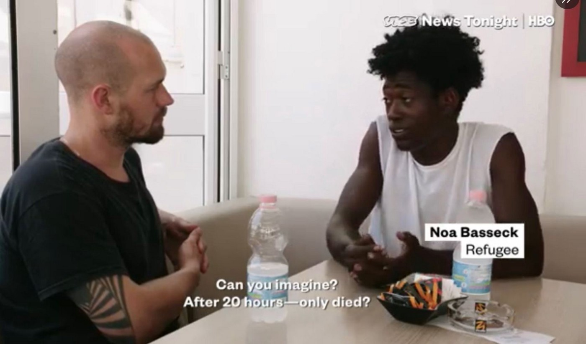

### AYS Daily Digest 22/07/2020 — Ocean Viking Detained by Italian Coast Guard
#### Italian Government’s Ongoing Campaign Against NGOs Continues///In Greece, Government Uses Threat of Virus to Continue Movement Restrictions///US No Longer a Safe Third Country///& More

](assets/aa874fbeae64/0*8abWehYpreE0B6Dj.jpg)

The Ocean Viking when it was in action\. Photo credit: [Anthony Jean/SOS Mediterranee](https://sosmediterranee.com/)

The Italian Coast Guard placed the Ocean Viking under “administrative detention” following an 11\-hour\-long inspection in the Sicilian port of Porto Empedocle on Wednesday\.

The Coast Guard justified this act by saying the ship showed several [“irregularities](https://twitter.com/scandura/status/1286044702991699969/photo/3) ” of safety rules and marine safety regulations\. The primary violation [they cited](https://sosmediterranee.com/press/ocean-viking-detained-in-italy-sos-mediterranee-condemns-a-blatant-administrative-harassment-manoeuvre-aimed-at-impeding-our-lifesaving-work/) was that “the ship has been carrying more person than the number certified according to the Cargo Ship Safety Equipment Certificate\.”

However, the people the Ocean Viking rescues are considered “survivors,” not “passengers,” and maritime law is clear that the duty to rescue people in distress trumps following the number of safe “passengers” on a ship’s charter\.

It is especially egregious that the Italian government is using too many passengers to justify shutting down the Ocean Viking, when it is often their fault such dangerous conditions occur in the first place\. This very month, Ocean Viking had to wait 11 days at sea, with close to two hundred passengers on board, because they were refused a port of safety\. Where was the concern for safety and following the law then?

In the past year, the Ocean Viking has passed four separate safety inspections\. It’s clear that this detention is part of a targeted harassment campaign against rescue ships\. Over the past three months, four NGO rescue ships have been detained by the Italian government\. Meanwhile, crossings continue, except now there are less ships to rescue people from drowning\.

As SOS Mediterranee’s Director of Operations, Frederic Penard, [puts it](https://twitter.com/SOSMedIntl/status/1286072346709811202) , “But stopping the ambulance will not prevent the wound from bleeding\.”

SEA
### Ongoing Cases of Distress at Sea

The Turkish Coast Guard [rescued](http://www.ansamed.info/ansamed/en/news/sections/generalnews/2020/07/22/migrants-turkey-rescues-110-people-in-the-aegean_bb46023a-0bdb-492f-9dab-bda7d461d696.html?fbclid=IwAR2GEDdEtPyIjy1Oap4_4RMfUJpWqxJwfSz6fL-c1RgxCIvTrK1_f3glaR4) 110 people in distress at sea on Wednesday\. Thirty\-six of those people were on a boat they said had been pushed back illegally by the Greek Coast Guard\.

Meanwhile, Sea\-Watch’s Moonbird [spotted](https://twitter.com/SeaWatchItaly/status/1285989850248884226?fbclid=IwAR2fFN137t_y5_9XX2FbTv6LoR8nuMOiAU24ANc5DI-oRL09ND6mDE0Z4HM) two crowded boats in the Maltese SAR, but no word as to their fate yet\. The Moonbird [also spotted](https://www.infomigrants.net/en/post/26186/third-body-floating-in-mediterranean-human-cemetery?fbclid=IwAR07UTgSthazK3KaRVdHBLMvSv4bQrg3PZbSlGr_mCG0_aLKP8Rsa-mfYdo) a third dead body floating in the Mediterranean during a mission on Tuesday\. Despite public outcry, so far there have been no efforts to recover the bodies of people drowned in the Mediterranean\.

On Wednesday morning [131 people](http://www.ansamed.info/ansamed/en/news/sections/generalnews/2020/07/22/migrants-libyan-coast-guard-brings-131-migrants-back-iom_e75865ba-be43-499b-b418-538a22fdfe65.html?fbclid=IwAR1bZD0pIzXzUk9u7fEUzo4WHJ-RBhnZHxg-p1uJJI0Ov--3xyG8dUEy_K4) , including 13 minors, were returned to Tripoli by the Libyan Coast Guard\. Again, Libya is not considered a safe third country for return\.

■■■■■■■■■■■■■■ 
> **[Safa Msehli](https://twitter.com/msehlisafa) @ Twitter Says:** 

> > ‼️ Another 95 migrants were returned to #Libya today by the coast guard and disembarked in Khums. 

 https://t.co/8sdF3mrZNE 

> **Tweeted at [2020-07-22 18:15:20](https://twitter.com/msehlisafa/status/1286001900941443072).** 

■■■■■■■■■■■■■■ 

GREECE
### Government Using Threat of Virus to Restrict Freedoms of People on the Move

Even as Greece opens to tourism, people on the move are still denied freedom of movement\. Mare Liberum [reports](https://www.facebook.com/MareLiberumOfficial/photos/a.198832504178994/671363603592546) that new arrivals to Lesvos are kept in “quarantine camps” on the beach when they arrive, or in the closed structure at Megala Therma\.

People are kept in quarantine for weeks, long after their quarantine period ends\. Hygienic conditions are terrible and there’s no protection from the heat\. People in Moria are still under lockdown, while Greek citizens and tourists are free to move around\.

There is no reason to continue restricting the movement of people on the move when there never was a significant outbreak of coronavirus in the camps\. A short [Vice piece](https://www.vice.com/en_us/article/ep455a/how-greeces-biggest-refugee-camp-avoided-a-catastrophic-coronavirus-outbreak?fbclid=IwAR3gV7oGan19JUTUcWBUzyZyYe1-D7Oly9xG4fgtUL8fF6J8a18U5ID0n_A) on Moria was even made to show how the camp managed to avoid an outbreak \(of course, the video does not mention how horrible conditions in the quarantine camps are and erases efforts by Moria residents to protect themselves from the coronavirus\) \. It’s clear that the restrictions on movement are not done with public health in mind, but to create de facto closed structures\.

At Moria and in other camps across Greece, people are organizing themselves to make life more bearable, from schools to small businesses, cleanup initiatives and more\. [This write\-up](https://mare-liberum.org/en/self-organization-in-moria/?fbclid=IwAR1u96d73JU82AjPsMitQk2HVF5a9IhYUvQjC2_PesOQ99yCatUkLIhVoi4) from Mare Liberum summarizes some of the innovators who have popped up in Moria\.

An important initiative, organized by residents and supported by Stand By Me Lesvos, is the Moria Acadamia which will provide courses to hundreds of students\. You can learn more about that initiative [here\.](https://www.facebook.com/www.standbymelesvos.gr/posts/677273242865701)

Deportations from Greece to Turkey are [up by 75%](https://greece.greekreporter.com/2020/07/22/number-of-deportations-from-greece-up-slightly-in-first-half-of-2020/?fbclid=IwAR2_sJ95x4nendr4i5Wl1TNh6JZhL2TI8a4RyHPVR6M3gcnsPzEX750g3ok) compared to last year\. This figure doesn’t include people pushed back illegally\.

Families in Viktoria Square [continue to sleep rough](https://twitter.com/f_grillmeier/status/1285932909648584709) , thanks to the Greek government’s decision to expel all recognized refugees from camps without providing them with other support\. There are several families with children who cannot access medical treatment or any kind of sanitary facilities\.

A xenophobic protest in Mytilene, Lesvos was broken up when a [car drove into the crowd](https://stonisi.gr/post/10213/sfa?fbclid=IwAR3cklzSqDoJ7HzHX1X09Sp2oKKJQMEWJRtqV6Ar4idUpfc-BgzeKkn_vwU) \. An elderly driver drove into the crowd, injuring six people, including himself\. An investigation is ongoing\.

Protesters were calling for citizen patrols to “confront immigrants and Turks\.”

Some opportunities:

The HELIOS Project helps beneficiaries receive accommodation\. Support is available in multiple languages, including Arabic, Kurmanji and more\. More information is available [here](https://www.facebook.com/migrationgovgr.info/photos/a.578873295600113/1680271505460281) \.

Action for Education is recruiting a coordinator from a refugee background in Chios\. The job posting can be found [here](https://www.actionforeducation.org/post/we-are-recruiting-a-coordinator-with-a-refugee-background-on-chios?fbclid=IwAR3GznpvuKIyw-78RsCjGEG4MTSEjtcPtZE790_GzUiVw90SY_0LHKVNb3o) \.

If you would like to support a worthy organization, Kara Tepe clothing store, organized by Movement on the Ground, is seeking donations\! The project not only provides new clothes for residents, it allows young residents to practice their translation skills and more\. You can learn more about the project and how to donate [here\.](https://www.facebook.com/movementontheground/posts/1771657009677270)

ITALY
### Media Sensationalizes Events in CPR Gradisca

The organization No CPR e No Frontiere [published a blog post](https://nofrontierefvg.noblogs.org/post/2020/07/22/fine-di-una-tragedia-con-un-arresto-e-con-un-estintore-aperto-sul-volto-di-una-persona/?fbclid=IwAR2lfNRHv9a_dGHh-Petv9WIULBDjnulS4QKqPjQF63HQfPD71rJ3bwowCU) pushing back against the media’s description of a fire at the CPR with the tagline “Inside there are ex\-convict offenders\.”

The fire started in the cell of a young Egyptian man who had just arrived in Italy around 11 July\. He was unable to communicate clearly with CPR, who also took his phone and refused to get him medical attention when he began complaining about severe dental pain\. This caused him to experience severe emotional distress\.

The fire happened as a result of this boy’s mental health crisis that could have been avoided if his needs had been met, or if he was never detained in the first place\. Even during the fire, staff escalated the situation by [spraying a fire extinguisher](https://www.facebook.com/nocprfvg/posts/936880890119574) directly in another inmate’s face, causing him to be hospitalized\.

The popular media jumps at incidents like these to portray people on the move as criminals who need to be locked up, instead of examining how inhumane lockdown conditions make people desperate and affect their mental wellbeing\.

Lampedusa has seen [almost 900 arrivals](https://www.grandangoloagrigento.it/apertura/lampedusa-raffica-di-mini-sbarchi-quasi-900-migranti-sullisola-in-meno-di-due-giorni?fbclid=IwAR1PvtejWDQvchxDnHz79RJnvmtM5hee9et2iAQGAGG_WS9_4tbgNcltp58) in less than two days\. Some are being transferred to mainland Sicily, but hundreds more remain in the hotspot, which is still scrambling to find proper accommodation\.

Monday, 27 July, at 6:00 pm there will be a protest in Piazza San Silvestro, Rome, against funding the Libyan Coast Guard\. You can find more information [here](https://www.facebook.com/Mediterranearescue/posts/625447514743143) \.

SPAIN
### Horrible Conditions in Melilla

Spanish Secretary of State for Migration, Hana Jalloul, visited the bullfighting ring in Melilla, which now houses several hundred people on the move\. [Footage from the visit](https://www.facebook.com/sjmespana/posts/1911692098955241) , shows cramped conditions, dirty facilities, and a lack of sanitary facilities\.

However, organizations on the ground like Solidary Wheels and No Name Kitchen, point out that the conditions shown are much better than usual\. The parts of the center that were shown to Jalloul were cleaned before her visit — for the first time in three months\.

Secretary Jalloul said she was “dismayed” by the conditions, but residents and organizations on the ground have been drawing attention to this for months\. Where was the government’s attention then?

Salvamento Maritimo’s Salvamar [rescued](https://www.europapress.es/islas-canarias/noticia-rescatan-patera-33-personas-millas-gran-canaria-20200722092835.html) a boat with over 30 people on board, including about 12 minors, southwest of the Canary Islands\. The rescue happened [after an intense day](https://www.canarias7.es/canarias/gran-canaria/rescatan-patera-doce-20200722125019-nt.html?fbclid=IwAR1p-e6gkBEdL6pPhygqXxVFvN6D9HPmMiXtRU1ULRbDQQKPgkFEK4HvaN4&ref=https%3A%2F%2Fl.facebook.com%2F) of searching for the boat in distress and family members contacted Caminando Fronteras\. The people on board had been at sea for [four whole days](https://www.facebook.com/NewsfromtheMed/posts/994222031031393) but are in good health despite some seasickness\.

FRANCE
### People Return to Calais After Evictions

Ten days after new Interior Minister Gerald Darmanin visited Calais, hundreds of people have returned\.

Two days before Darmanin’s visit, the people were evicted by local security forces\. Their homes were destroyed and food distributions were interrupted, all to present a front for the minister’s visit\.

The presidents of five organizations operating in the Calais area [wrote a letter](https://www.lacimade.org/situation-des-personnes-exilees-presentes-sur-le-littoral-franco-britannique/?fbclid=IwAR2Bmw6kmzEWvGMuqUBkCApqLNwwnX8woHqPHsbXFiuTEivpgHel3_xgiLs) to the minister condemning the ongoing violence at the border as well as the conditions his visit caused\. They criticized Darmanin because he did not bother to meet with any local organizations, only with police officers\. They called on him to “ [change the paradigm](https://www.ouest-france.fr/monde/migrants/calais-apres-la-visite-de-darmanin-des-associations-denoncent-les-conditions-de-vie-des-migrants-6913894?fbclid=IwAR1xfwJ5nUIiWCoJRMW_jhDdXfJof9Liw6JcpOktlAUZ3vSeaBfPblZ0QRg) ,” saying that the past 30 years have shown that brutality has given nothing except unnecessary human suffering\.

Meanwhile, volunteers and people on the move are organizing themselves as best as they can to rebuild\. You can support Care4Calais, which is conducting food distributions among other important work, and learn more about their work [here](https://www.facebook.com/care4calais/posts/3463413287024937) \.

La Cimade is organizing a campaign for regularization, and they want your help\! Learn how you can submit a video message in support [here\.](https://www.lacimade.org/liberteegaliteregularisez-regularisation/?fbclid=IwAR06g29EZ-KoJ9Pc1WPgcYK8XGJu0iX5nCvWXUStDJXb91i9VaMMQSInAbU)

UK
### Rise in Self\-Harm in Detention Centers

In 2019, [over 474 incidents](https://www.belfasttelegraph.co.uk/news/uk/rise-in-self-harm-incidents-at-immigration-detention-centres-criticised-39379513.html?fbclid=IwAR3gqwNFVDVnlvRnxH68BrkdXh_s71OoH-Cp2Lc0ltU-WRinAXQ28okSEyY) of self\-harm were recorded in detention centers for people on the move\. There are countless others that have not been recorded\.

The figures were published in response to a question from Liberal Democrat leader Sir Ed Davey\. Sir Davey identified the hostile environment as a cause of this mental health crisis, saying, “with some people being held for over two years in these centres, cut off from the outside world and fearing their return to hostile nations, it is no wonder that self\-harm is so prevalent\.”

CANADA
### US No Longer “Safe 3rd Country”

A federal court in Canada [struck down](https://www.ctvnews.ca/canada/federal-court-declares-canada-u-s-refugee-pact-unconstitutional-1.5034447) part of the Safe Third Country Agreement between the US and Canada, saying that people cannot be returned to the US because it is not a safe third country\. Previously, people who applied for asylum at a land point\-of\-entry were at risk of refoulement\.

In a case that was brought by asylum seekers from El Salvador, Ethiopia, and Syria, [the judge ruled](https://decisions.fct-cf.gc.ca/fc-cf/decisions/en/item/482757/index.do?fbclid=IwAR3cNphOGEirHpOgCZPtY_h0bg85CG1OxXyTcPOclY-1GyLBoFdI8KfJBK0) that the US could not be considered a safe third country because it frequently violates the human rights of asylum seekers\. The case cited inhumane conditions in US detention centers and Trump’s Muslim Ban as evidence that the US is not a safe country for asylum seekers\.

The judge gave Parliament six months to adjust to this ruling\. Hopefully deportations will stop before then as it is clear that asylum seekers cannot hope for fair treatment from the United States\.

EU
### McKinsey’s Impact on EU Refugee Policy

Last month, BIRN published an [explosive investigation](https://balkaninsight.com/2020/06/22/asylum-outsourced-mckinseys-secret-role-in-europes-refugee-crisis/) into the EU’s secret outsourcing of its asylum process to notorious consulting firm McKinsey\. In a [follow\-up investigation](https://balkaninsight.com/2020/07/22/how-mckinsey-put-productivity-at-heart-of-european-refugee-policy?fbclid=IwAR1PvtejWDQvchxDnHz79RJnvmtM5hee9et2iAQGAGG_WS9_4tbgNcltp58) , BIRN and Der Spiegel discovered how McKinsey’s emphasis on “maximizing productivity” caused ongoing damage to the European asylum system\.

McKinsey’s goal was to process as many asylum cases as possible\. Thus, they instituted cutthroat practices such as “segmentation,” or allocating asylum based on nationality quotas, less training required for staff, and actively discouraging people from applying for asylum or appealing a denial\. They also argued for increasing detention and deploying more security forces \(which seems less efficient than actually processing people’s applications fairly\) \.

Even after McKinsey stopped working on the Greek asylum system, the system of values and priorities they put into place remained, creating a dehumanizing experience for people on the move\.

GENERAL
### Notis Mitarakis Shares Photos of People Facing Deportation on His Twitter

Greek minister of migration Notis Mitarakis [shared photos](https://twitter.com/Refugees_Gr/status/1285857875806556165?fbclid=IwAR1uB7xxnbBXs2vZyNRkuamQma2DJ5TStni2P2lFT5pRiJO78P9hdjjaTwU) of people facing deportation on his personal Twitter page and on the Migration Ministry’s Facebook page\. Not only is this a callous use of people in distress for publicity, it violates their right to privacy\. Hours after several human rights advocates criticized the photos, they remained on both platforms\.

Specific information about this deportation is unclear, but it’s possible that this was a joint return operation [carried out with Frontex](https://twitter.com/lk2015r/status/1286046174470975490?fbclid=IwAR2Bmw6kmzEWvGMuqUBkCApqLNwwnX8woHqPHsbXFiuTEivpgHel3_xgiLs) \(the presence of return monitors from Frontex or the Greek government is unclear, although if present they should have stopped the minister’s callous photo op\) \. Publishing photos of people on the move, especially those undergoing deportation, directly violates [Frontex’s own privacy regulations](https://twitter.com/lk2015r/status/1285872962575437824?fbclid=IwAR1b86W1PEDruQE7C5ywthtWzZnKzw06LBj7ScGlsMz0ddpkzY0gNav3kyg) \. Will something be done? Or are Frontex and the Greek government unable to respect the rights of people on the move even on social media?

Do you know this man? Noa Basseck from Cameroon, and any of the other 101 people who were pushed back to Libya by the Asso 28 cargo ship on 30 June 2018, could be entitled to legal compensation\. If you have any information, you’re encouraged to get in touch [here\.](https://www.facebook.com/photo/?fbid=10157142036377085&set=a.10151442950087085)

On 24 July, 7:00 pm EST, the Afghan American Artists & Writers Association is cohosting a panel called “Beyond Refuge\.” One of the panelists will be Parwana Amiri, an Afghan currently living in Ritsona Refugee Camp in Greece\. More information and the registration link can be found [here](https://twitter.com/aaawa_art/status/1285736859591639040?fbclid=IwAR06g29EZ-KoJ9Pc1WPgcYK8XGJu0iX5nCvWXUStDJXb91i9VaMMQSInAbU) \.
### Worth Reading

[This article](https://www.e-ir.info/2020/07/22/state-building-sovereignty-and-migration-management-in-the-global-south/?fbclid=IwAR0MOT6GEFBd7mnkBJI__QLgEnxuN58wOGuUvLFYS8yUISLn5z1DMTwwqlY) offers an interesting look at migration management as a tool of state\-building in the Global South\.

Due to EU restrictions making it almost impossible to apply for asylum safely, many people from Africa are [turning to smugglers in Latin America](https://finance.yahoo.com/news/rising-migration-restrictions-driving-african-125730857.html) to try to get to the US\.

Worth Watching: [Burning From the Inside](https://www.facebook.com/antifascistdocumentary/?ref=page_internal) is producing a documentary called “Lockdown,” about the effects of the coronavirus lockdown on the camp in Chios\. You can learn more about the project [here\.](https://www.facebook.com/Chiosonfire/)

**Find daily updates and special reports on our [Medium page](https://medium.com/are-you-syrious) \.**

**If you wish to contribute, either by writing a report or a story, or by joining the info gathering team, please let us know\.**

**We strive to echo correct news from the ground through collaboration and fairness\. Every effort has been made to credit organisations and individuals with regard to the supply of information, video, and photo material \(in cases where the source wanted to be accredited\) \. Please notify us regarding corrections\.**

**If there’s anything you want to share or comment, contact us through Facebook, Twitter or write to: areyousyrious@gmail\.com**

_Converted [Medium Post](https://medium.com/are-you-syrious/ays-daily-digest-22-07-2020-ocean-viking-detained-by-italian-coast-guard-aa874fbeae64) by [ZMediumToMarkdown](https://github.com/ZhgChgLi/ZMediumToMarkdown)._
