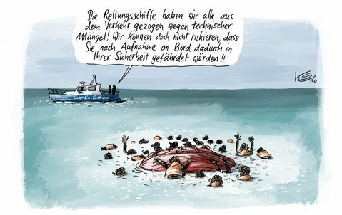

### AYS Daily Digest 24/7/20: Six years in ‘inhuman’ detention and now finally free\!

[Are You Syrious?](@AreYouSyrious?source=post_page-----38f61195350e----------------------)

[Jul 25](ays-daily-digest-24-7-20-six-years-in-inhuman-detention-and-now-finally-free-38f61195350e?source=post_page-----38f61195350e----------------------) · 12 min read

Freedom for Behrouz Boochani // Death of an Eritrean asylum\-seeker in Tripoli // Lawsuit against Poland // British Home Office leaving asylum seekers homeless // Escape from quarantine in Italy

“We have withdrawn all rescue ships because of technical defects\! Surely we cannot risk your safety by taking you on board\! \(Credit: [Klaus Stuttmann](https://www.stuttmann-karikaturen.de/?fbclid=IwAR1twPGuslrlj_PuxWgScX5_LNNEFJpCiqalffbswF_gTnU3NF00_9sa310) \)
### Feature

The [award\-winning Kurdish\-Iranian journalist](https://www.bbc.com/news/world-asia-53522251) who was detained for six years in an offshore Australian immigration centre has been formally granted refugee status in New Zealand\.

In 2013, Behrouz Boochani had arrived in Australia by boat and attempted to seek asylum, but under Australia’s hardline asylum policy, Boochani was quickly taken to the controversial detention centre in Papua New Guinea\.

While in detention, Boochani became a leading voice for the detained using his mobile phone to write the prizewinning book “No Friend But The Mountains”\.

[Speaking to CNN](https://edition.cnn.com/2020/07/24/asia/behrouz-boochani-refugee-intl-hnk/index.html) about being granted refugee status, Boochani said

> _“Now after exactly seven years, this story for me has finished\. But of course, my story is only a part of this whole story\. It was a huge thing for me, because that made me feel stronger now and feel stable, feel that now I can be part of this society,” he said\. “I have a place\. So that was a great feeling\.” Boochani went on to further say: “On the other side, I always think about those people who are living in detention in Australia, in Port Moresby, in Nauru, which is really sad and makes me angry”\._ 

More than 400 asylum seekers remain in Australia’s two controversial offshore detention sites, located on PNG’s Manus Island and the island nation of Nauru\. Australia’s hardline asylum policy and the detention centre which permit indefinite detainment while asylum claims are processed — have been condemned as “inhumane” by the United Nations’ refugee agency and human rights groups\.

During Mr Boochani’s time at the camps, there were a series of violent incidents including a riot involving guards and refugees in 2014 where scores of people were injured and an asylum seeker killed\. Since 2014, at least 13 asylum seekers have died while in detention, including seven by known or suspected suicide\.
### Austria

[Vienna has announced](https://www.euractiv.com/section/politics/short_news/vienna-austria-to-host-new-european-coordination-platform-for-migration-policy/) that it is set to host a new European “coordination platform” for migration policy\. After two days of talks, the Austrian Interior Minister Karl Nehammer \(ÖVP\) announced yesterday that the new platform will focus on coordinating cooperation in protecting the external borders, returning migrants without a right to asylum, fighting against smuggling and building faster and more efficient asylum procedures\.

Speaking about this new platform, Nehammer said “We must, on the one hand, always support each other, if we are talking about border security, for example, as did Austria in Greece\. The second important aspect is the return of irregular migrants to countries of origin, easing the process\. The third factor is the fight against organized crime and trafficking,”

Some members of the 20 countries that attended the initial meeting to discuss combating irregular migration along the Eastern Mediterranean and Western Balkan route publicly stressed that the new coordination structure should not become a new EU agency or institution\. Commission Vice\-President Margaritis Schinas said “This should not be seen as yet another administrative structure but rather as a flexible operational tool that will align priorities, needs and actions,” and is set to coordinate existing know\-how about migration to identify “where blind spots are and what can be done about them”\.
### Slovenia

Slovenian based civil initiative InfoKolpa [held a press conference last Friday](https://www.mladina.si/200197/neformalni-izgon-eritrejcev/?fbclid=IwAR20N8DvErSD8gXV8lgomivh0IZDmvG6sTeZk4J3tFOi1HeVjFWGZAHNSOE) in front of the Slovenian Philanthropy Migrant Center in Ljubljana, in which they raised the concerned that according to the new law in Solvenia, Eritrea is to be considered a safe country and therefore would predictably lead to rejects its citizens’ applications for asylum\.

In the press conference InfoKolpa said: “Eritrean citizens are forced to perform decades of military service, which in reality means ordered forced labour and life in labour camps\.” “Many people die in these camps due to severe physical exertion, beatings and poor care,”\. “They go on to further explain that “Eritrea is one of the countries with the highest levels of forced labour”\.

In recent years Slovenia has granted international protection to 77 people from Eritrea\. These 77 people arrived in Slovenia on the basis of a relocation program from Italian refugee centres\. Recently there have been 15 new requests for international protection of Eritrean individuals, but the Interior Ministry has granted only three, rejecting others\. Of increasing concern that due to Eritrea being a military dictatorship \(and in fact not a safe country\), deportations there are not possible\. Slovenia, therefore, returns the Eritreans to Croatia, and from there they are deported across the green border to Bosnia and Herzegovina\.

In this case, InfoKolpa explained that there is often only one option “escape from Slovenia to the north of Europe, where they have a realistic chance of obtaining refugee status”\.
### Libya

[The UNHCR has announced](https://www.unhcr.org/uk/news/press/2020/7/5f1ad2404/unhcr-expresses-condolences-tragic-death-asylum-seeker-libya-urges-action.html?fbclid=IwAR0m4JaxJAoHRIWmhgT2DloD_0mQ7jqnua9vT9ZXO9lb6lWJ1itYQv21-dE) the tragic death of a young Eritrean asylum\-seeker in Tripoli this week and calls for renewed action against smugglers and traffickers ‘who continue to inflict unimaginable suffering to refugees, asylum seekers and migrants in Libya’\.

The man had arrived on 20 July at UNHCR’s Community Day Centre in Tripoli seeking medical assistance, along with another Eritrean male\. Both appeared to be severely malnourished\. One was identified as being in need of urgent medical care and an ambulance was called\. The UNHCR announced that the individual passed away before it was possible to transport him to the hospital and the efforts to resuscitate him were unsuccessful\.

Both men had previously been held by traffickers at Bani Walid, a town in north\-western Libya\. Since June, more than one hundred individuals have arrived in Tripoli from trafficking centres in Bani Walid\.

In the recent press release the UNHCR notes that, in addition to persons held in trafficking camps, more than two thousand refugees and migrants are detained in official detention centres without judicial review\.

The tragic death of this young man again shines a light on the inhumane decision by European nations to consider Libya a safe port\. The IOM estimates that to date in 2020, the so\-called Libyan coastguard has intercepted and returned 5,700 people from the Mediterranean sea\. In 2019, the IOM estimated this figure to be 9,225\. It’s important to note that without the continued cooperation of countries such as Malta and Italy with the Libyan authorities, this high level of interceptions and returns would not be possible\.
### Tunisia

[The Tunisian statistics institute \(INS\)](https://www.infomigrants.net/en/post/26227/tunisia-starts-first-immigration-census?fbclid=IwAR0LgeaqmmvChnTgVkdwu2korbIBLx9zdR-Vpp_9t4Z7RKex31IjlQOKYQk) on July 22 announced it had started the first census on international migration in Tunisia\.

This is the first time any mass census on international migration has occurred in Tunisia, and aims to provide accurate and clear statistical data on immigration in the country\.

The survey that will last until March 2021 will cover the entire national territory and will include all affected social groups, such as migrants, repatriated people and foreign immigrants residing in Tunisia\. The data collected will be used to draft, implement and monitor national migration strategies\.
### Portugal

The 21 migrants, from Morocco, who were intercepted on the shores of Ilha do Farol, Portugal on the 21st July, are set to be taken to Linhó prison in Cascais\.

The Algarve is increasingly being used by migrants as a gateway to Europe, a trend that has been accentuated in recent months\. It has been announced that this is the fifth case of ‘illegal’ landings on the Algarve coast by Moroccan migrants, within eight months\.

The national director of SEF said on 22 July that the succession of landings of Moroccan migrants to the Algarve coast is “undeniable”, but considered it “premature” to speak of the existence of an illegal immigration route\.

“There are still investigations that are ongoing, there are evaluations that have to be made\. We still don’t have enough information about this last landing to be able to say if there is a route, if there is a network”, he pointed out, after a meeting in the Câmara de Olhão\.”
### Poland

The [European Court of Human Rights](https://www.zeit.de/thema/europaeischer-gerichtshof-fuer-menschenrechte) \(ECHR\) has sentenced Poland for rejecting asylum seekers on the border with Belarus\. In the published decision, the court states that the government in Warsaw has not complied with its duty to follow ECHR instructions and that Poland violated the ban on inhumane treatment and the ban on collective dismissals at borders\.

The ECHR thus righted three lawsuits from two families with minor children and a man from Chechnya and awarded them compensation of € 34,000 each\. According to the ECHR, those affected had made several unsuccessful attempts in 2016 and 2017 to come from [Belarus](https://www.zeit.de/thema/belarus) to Poland to apply for asylum there\. The plaintiffs said they were persecuted in Chechnya and feared for their lives but Polish border guards had refused entry to them in several dozen attempts\.
### Sea

Today search and rescue organisations had another busy day launching multiple rescue missions\.
### UK

[_The Independent_](https://www.independent.co.uk/news/uk/home-news/home-office-aslylum-seekers-housing-homeless-uk-a9632536.html) has reported that the British Home Office is breaking the law by leaving destitute asylum seekers homeless\.

Under the UK’s asylum law, the British Home Office is required to grant housing and support to asylum seekers who are waiting on their claims, or those whose claims have been refused but are not able to leave the UK\. Despite this, court documents seen by _The Independent_ show that the department has often only been providing this support after the intervention of solicitors\. It has been reported that in some cases — including in cases of asylum seekers who are also victims of modern slavery or torture — have had to wait months to be housed\.

Charities have stressed that where the asylum seekers have no access to legal representation that would enable them to resolve their cases in court, they often have fallen into homelessness as a result\. The Independent shared the case of one man, and report:

> _In one case, a Chinese man recognised by the Home Office as a potential victim of trafficking was granted support on 19 March, yet no action was taken to provide him with housing or financial support for four months\. The individual was staying with a friend during this period, but this informal arrangement had to come to an end on 18 July as the friend could no longer afford to house him\. He wrote to the Home Office on both 7 April and 10 July, but received no reply\. His solicitors took the case to court on 18 July and the judge ordered the Home Office to provide accommodation at 4pm the same day, saying the home secretary was in “clear breach of her own decision on 19 March”\._ 

### Greece

> _European Lawyers in Lesvos have published an update of their recent work: Over the past two months, which saw many services for asylum seekers on Lesvos suspended or shut down, ELIL continued to provide remote consultations and family reunification assistance\. On 10 July, we were very happy to be able to resume in\-person programming in Kara Tepe\._ 

> _Every Friday for the past three weeks, an ELIL team has provided legal consultations to the residents of the camp\. Our Greek lawyers have appreciated the opportunity to return to this setting: “remote consultations were instrumental in allowing us to continue assisting people during the lockdown\. But to have the other person in front of you also adds an important layer, helping to understand people’s frustration and to transmit empathy through body language”\._ 

> _Kara Tepe hosts 1,000 of the most vulnerable asylum seekers on Lesvos, the vast majority of them families with children\. In nearby Moria, almost 15,000 people remain stranded with little access to services\. We hope to resume in\-person programming in the camp in the coming weeks\._ 

### [European Lawyers in Lesvos](https://www.facebook.com/EuropeanLawyersInLesvos/photos/a.1917504088570340/2675415476112527/?type=3&theater)
### [Over the past two months, which saw many services for asylum seekers… on Lesvos suspended or shut down, ELIL…](https://www.facebook.com/EuropeanLawyersInLesvos/photos/a.1917504088570340/2675415476112527/?type=3&theater)
#### [www\.facebook\.com](https://www.facebook.com/EuropeanLawyersInLesvos/photos/a.1917504088570340/2675415476112527/?type=3&theater)
### Serbia

Humanitarian aid organisation [No Name Kitchen](https://mailchi.mp/301435680adb/no-name-kitchen-in-id?fbclid=IwAR0Jd_PaKQyi1EKXGKdU12exGhQDxRVwWg6bzgsgLth9H-UoVtdztUpsKcQ) has published a plea for help and assistance\.

No Name Kitchen reported that when the state of emergency was officially declared in Serbia, the authorities took all migrants by force to the camps and our NNK team’s house and warehouse had to be closed\. Official reports suggest that the camps grew from 6,000 people to 9,000 in a few days\. This resulted in a lack of clean clothes, a lack of access to WASH facilities, as well as a lack of basic hygiene products\. The camps are guarded by the army, making any escape almost impossible\.

At the beginning of May, a volunteer from the _No Name Kitchen_ team spoke to a young Afghan boy on the phone\. She wanted to know what life was like in the camp in which he had been locked up and forced to live\. The boy told her that he, and at least 50 other people, had escaped from the camp and were living hidden in the woods outside of Sid\. Five days after that phone call, three volunteers from the NNK team, who had spent the quarantine in Serbia, were in Sid ready to start helping out\!

The number of people hiding in the woods varies constantly but lately is around 120 people daily\. We do our best to adapt the distributions to the needs, whenever possible\.

Since resuming their activities, between May 15th — July 14th, NNK had distributed: Food to assure that everyone has, at least, one warm meal a day; almost 300 clothing packages; More than 140 sleeping bags and blankets; and provided basic health to 70 people\.

No Name Kitchen still need your support to ensure that their vital services can continue\.

Donate: [http://www\.nonamekitchen\.org/en/help\-us/](http://www.nonamekitchen.org/en/help-us/)
### Spain
### [Solidary Wheels](https://www.facebook.com/solidarywheels/photos/a.1507457125976795/3069106609811831?hc_location=ufi)
### [Scroll down for English version Hace más de 130 días, Marruec… os cerró sus fronteras terrestres con Ceuta y Melilla…](https://www.facebook.com/solidarywheels/photos/a.1507457125976795/3069106609811831?hc_location=ufi)
#### [www\.facebook\.com](https://www.facebook.com/solidarywheels/photos/a.1507457125976795/3069106609811831?hc_location=ufi)
### Italy

On the southern Italian island of Lampedusa, the number of boats with migrants that reach the island directly is growing\. [Since Wednesday it has been reported](https://www.derstandard.de/story/2000118963481/1-000-migranten-in-hotspot-von-lampedusa) that around 5 boats, each with a total of around 100 people on board have landed\. Due to the increased number of arrivals, the local refugee facility which has places for only 95 people, was over capacity\. The authorities decided that 200 Tunisian migrants would leave the island for Sicily\.

It has been reported that Friday, [30 Tunisian migrants](http://www.ansamed.info/ansamed/en/news/sections/generalnews/2020/07/24/italy-30-migrants-break-out-of-brindisi-centre_437be180-7583-41ca-8805-bb138085d1d3.html?fbclid=IwAR3ZBNaGxcKEMZzKA4xJuIK8PA4TOFZ9DnW4uBaMLanOTVzaseVJ9wrmssE) had broke out of a migrant reception centre in Brindisi\. The 30 people had been placed in a COVID quarantine after they had arrived in Italy\. Nine of the people that fled the centre have been found, but the other twenty\-one people are still missing\.

Since the beginning of the year, [three times as many migrants](https://www.infomigrants.net/fr/post/26234/lampedusa-fait-face-a-un-nouvel-afflux-de-migrants-tunisiens?fbclid=IwAR3ejoUByoWKUgV6Hl3pUVCAoEZTPx3cE_eR9vD6l-7xD9ehPa3EXBpF8Bw) have arrived on the small Italian island of Lampedusa than this time last year\. In just two days, more than 500 people landed on the small Italian island independently or after being rescued by the coast guard\. According to Italian media, there were 240 arrivals on Wednesday July 23 and 294 the next day\.

Between January 1 and July 22, 10,463 people landed on the island, compared to 3,428 last year at the same time\. According to figures from the association, interceptions of migrant boats off the coast of Tunisia are also on the rise\. In the first half of this year, 269 canoes were intercepted in the Mediterranean by the Tunisian coastguard, compared to 67 in the same period of 2019 — or 3,977 people arrested at sea and returned to Tunisia in 2020 compared to 961 for the first six months from last year\.
### Germany

83 migrants, including more than a dozen sick children, have been flown to Germany from Greece\. The migrants are the latest group to be relocated from overcrowded Greek camps under a government commitment to shelter hundreds of vulnerable people\.

[German Interior Minister Horst Seehofer](https://www.infomigrants.net/en/post/26236/sick-children-from-greek-migrant-camps-flown-to-germany?fbclid=IwAR3nkqjZ-9QK4jFAK7NReDexwEjmC5Dj_j9gr74u0qRztP0xl_2Q5KzMEWk) said “For me, order and humanity belong close together in migration policy\. At the same time, we are showing solidarity with Greece\.”

According to the interior ministry, the families are to be provided with accommodation and medical care in Germany\. They will also face an “open\-ended asylum procedure\.”
### Worth reading:
- ECRE’s ELENA Weekly Legal Update\.

### [ELENA Weekly Legal Update — 24 July 2020](https://mailchi.mp/ecre/elena-weekly-legal-update-24-july-2020?e=989a4aebdd&fbclid=IwAR03aHWbqDaIGknrQ9pztdVsX0Xq8L-GrsNuDpC0Jn-nv_eyQ98EnWcPA3w)
### [A\.B\. v Italy \(Application №13755/18\): The applicant is a Tunisian national who was transferred to the Hotspot of…](https://mailchi.mp/ecre/elena-weekly-legal-update-24-july-2020?e=989a4aebdd&fbclid=IwAR03aHWbqDaIGknrQ9pztdVsX0Xq8L-GrsNuDpC0Jn-nv_eyQ98EnWcPA3w)
#### [mailchi\.mp](https://mailchi.mp/ecre/elena-weekly-legal-update-24-july-2020?e=989a4aebdd&fbclid=IwAR03aHWbqDaIGknrQ9pztdVsX0Xq8L-GrsNuDpC0Jn-nv_eyQ98EnWcPA3w)
- “A key assumption about migration turns out to be wrong — taking a few of my articles down with it” — thecorrespondent\.com

### [A key assumption about migration turns out to be wrong — taking a few of my articles down with it](https://thecorrespondent.com/606/a-key-assumption-about-migration-turns-out-to-be-wrong-taking-a-few-of-my-articles-down-with-it/663419791386-9a5c784a?fbclid=IwAR2N3G_4lryZvudEDIyf1wPEoJvzl9HVxT2n0DXAynAIyouUcbghnXbLYS4)
### [You could call it new insight gained over time\. Or I can just say: I was wrong\. Not just me\. Most of the world’s…](https://thecorrespondent.com/606/a-key-assumption-about-migration-turns-out-to-be-wrong-taking-a-few-of-my-articles-down-with-it/663419791386-9a5c784a?fbclid=IwAR2N3G_4lryZvudEDIyf1wPEoJvzl9HVxT2n0DXAynAIyouUcbghnXbLYS4)
#### [thecorrespondent\.com](https://thecorrespondent.com/606/a-key-assumption-about-migration-turns-out-to-be-wrong-taking-a-few-of-my-articles-down-with-it/663419791386-9a5c784a?fbclid=IwAR2N3G_4lryZvudEDIyf1wPEoJvzl9HVxT2n0DXAynAIyouUcbghnXbLYS4)
- Photographer Murat Türemis has been travelling to the Greek islands for years and portrays children who live in refugee camps\.

### [Aufwachsen im Flüchtlingscamp: Eine Kindheit in Moria — DER SPIEGEL — Politik](https://www.spiegel.de/politik/ausland/aufwachsen-im-fluechtlingscamp-eine-kindheit-in-moria-auf-lesbos-a-da14ea2f-281f-4cbc-a4f2-7309c76d1c2b?fbclid=IwAR2vFeBClWuYYU-4OMHvPG56hQFammxf614VVPwk2UAtziNQurETDDt6PgY)
### [Fotograf Murat Türemis reist seit Jahren auf die griechischen Inseln und porträtiert Kinder, die in Flüchtlingscamps…](https://www.spiegel.de/politik/ausland/aufwachsen-im-fluechtlingscamp-eine-kindheit-in-moria-auf-lesbos-a-da14ea2f-281f-4cbc-a4f2-7309c76d1c2b?fbclid=IwAR2vFeBClWuYYU-4OMHvPG56hQFammxf614VVPwk2UAtziNQurETDDt6PgY)
#### [www\.spiegel\.de](https://www.spiegel.de/politik/ausland/aufwachsen-im-fluechtlingscamp-eine-kindheit-in-moria-auf-lesbos-a-da14ea2f-281f-4cbc-a4f2-7309c76d1c2b?fbclid=IwAR2vFeBClWuYYU-4OMHvPG56hQFammxf614VVPwk2UAtziNQurETDDt6PgY)

**Find daily updates and special reports on our [Medium page](https://medium.com/are-you-syrious) \.**

**If you wish to contribute, either by writing a report or a story, or by joining the info gathering team, please let us know\.**

**We strive to echo correct news from the ground through collaboration and fairness\. Every effort has been made to credit organisations and individuals with regard to the supply of information, video, and photo material \(in cases where the source wanted to be accredited\) \. Please notify us regarding corrections\.**

**If there’s anything you want to share or comment, contact us through Facebook, Twitter or write to: areyousyrious@gmail\.com**
### [Are You Syrious?](https://medium.com/are-you-syrious?source=post_sidebar--------------------------post_sidebar-)
#### Daily news digests from the field, mainly for volunteers…

Following
### Sign up for AYS Daily Newsletter
### By Are You Syrious?

Daily news digests from the field, for volunteers, people on the move, journalists, and the general public [Take a look](https://medium.com/are-you-syrious/newsletters/ays-daily-newsletter?source=newsletter_v3_promo--------------------------newsletter_v3_promo-)
#### You’re an editor of AYS Daily Newsletter
- [Digest](https://medium.com/tag/digest)
- [Refugees](https://medium.com/tag/refugees)
- [Migrants](https://medium.com/tag/migrants)
- [Europe](https://medium.com/tag/europe)
- [Mediterranean](https://medium.com/tag/mediterranean)

_Converted [Medium Post](https://medium.com/are-you-syrious/ays-daily-digest-24-7-20-six-years-in-inhuman-detention-and-now-finally-free-586e883a54c9) by [ZMediumToMarkdown](https://github.com/ZhgChgLi/ZMediumToMarkdown)._
