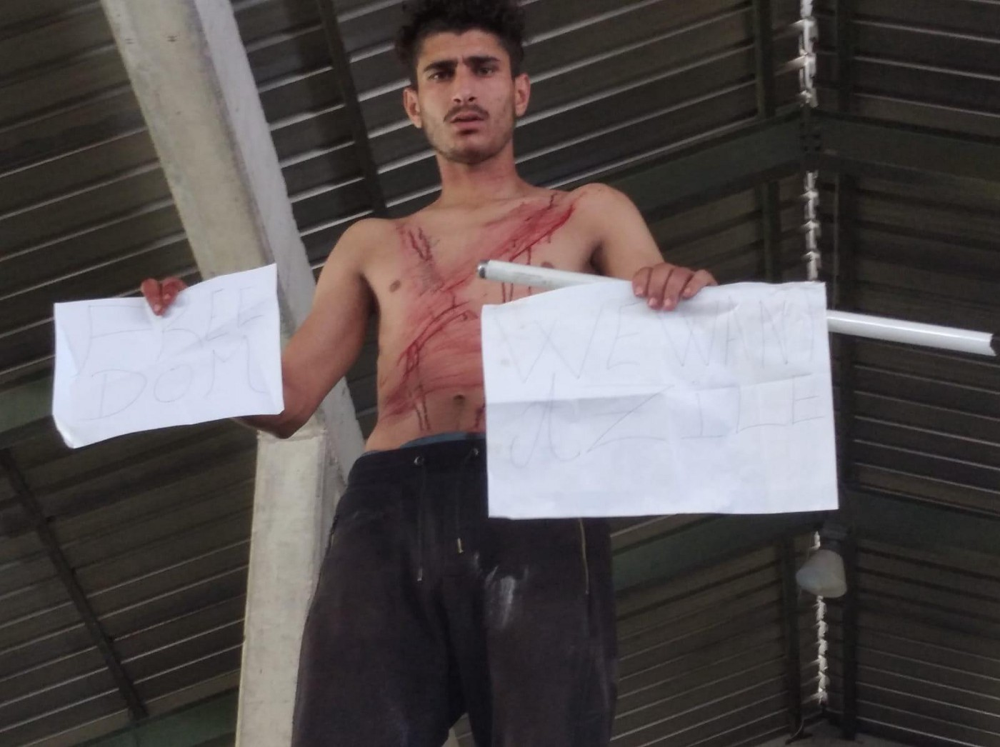

### AYS Daily Digest 29/7/2020 — Geographic restrictions in Ceuta and Melilla are illegal, says court

GERMANY: Federal interior minister halts Berlin state plan to welcome refugees from Greece / SLOVENIA: Protest in Postojna detention centre / Two new search and rescue organisations are fundraising to provide support in the Central Mediterranean / Evictions in Paris

 on Monday to raise money for _BASR hospital in Bethlehem for 2,235,000£_](assets/6419ac8b39d7/1*DJmxTehGP6t4h0ti9XJIbA.jpeg)

“Mediterranean Sea View 2017”, a trio of found seascape paintings that Banksy reworked into a pointed response to the refugee crisis was [sold](https://news.artnet.com/market/banksy-donates-refugee-paintings-bethlehem-hospital-fundraiser-1897367?fbclid=IwAR32mf4P-tpF5g0eQF3oGynnwPfSaUmxL1S8r9T51PiJzKmsvZFzFfVsMHE) on Monday to raise money for _BASR hospital in Bethlehem for 2,235,000£_
#### Featured — Spanish supreme court ruled against geographic restrictions in Ceuta and Melilla

Today the Spanish supreme court [recognised](https://www.cear.es/el-tribunal-supremo-reconoce-la-libre-circulacion-a-los-solicitantes-de-asilo-de-ceuta-y-melilla/?fbclid=IwAR2iZS8vdB9KMC2_EPkl-6FaVMZ_DZrnqxmuOIYR8YkY039FYfj4xJABu6g) **the right of asylum seekers in the autonomous city of Ceuta and Melilla to free movement** **throughout the national territory\.**

■■■■■■■■■■■■■■ 
> **[ESTRELLA GALAN](https://twitter.com/estrella_galan) @ Twitter Says:** 

> > En el año 1992 @[CEARefugio](https://twitter.com/CEARefugio) ya denunciaba situación de los subsaharianos atrapados en Melilla #HistoriadelAsilo https://t.co/W0OLX4098O 

> **Tweeted at [2020-07-29 13:19:15](https://twitter.com/estrella_galan/status/1288464105507106816).** 

■■■■■■■■■■■■■■ 

In the Spanish enclaves of Melilla and Ceuta, geographical restrictions were imposed to people applying for asylum\. This has been common practice for the last 30 years\. People applying for asylum in such territories were forced to remain there until the decision on their application\. CEAR had already obtained an estimative judgement by the Superior Court of Justice of Madrid about the illegality of retaining asylum seekers in both autonomous cities, against which state prosecutors appealed\. [Today’s judgement](https://www.cear.es/wp-content/uploads/2020/07/sentencia_libertad_circulaci%C3%B3n_solicitantes_asilo_Ceuta_Melilla.pdf) by the Supreme Court confirms that the practice, maintained by the Ministry of the Interior, is not legal\.

SEA
#### Central Mediterranean — 84 people rescued by Italian supply ship and many more still at sea

■■■■■■■■■■■■■■ 
> **[Alarm Phone](https://twitter.com/alarm_phone) @ Twitter Says:** 

> > In the last 24h we assisted in 5 distress cases: 

🔺17 people still in Libyan SAR since 2 days
🔺61 people still in Italian SAR
🔸33 people rescued to Malta last night
🔸85 people rescued to Italy last night
🔹85 people, fate unclear but hopefully rescued by #Asso29 

> **Tweeted at [2020-07-29 15:30:33](https://twitter.com/alarm_phone/status/1288497144840818689).** 

■■■■■■■■■■■■■■ 

Of these five cases, the 61 people in Italian SAR have been rescued by the Coast Guard and taken to Lampedusa\. The 17 people in the Libyan SAR zone are instead still at sea, with no rescue in sight\. Alarm Phone report that Italian authorities told them to call the Libyan Coast Guard, which is currently failing to answer the phone…

Supply vessel Asso29, operating for an ENI platform off the Libyan coast, [rescued](https://twitter.com/saracreta/status/1288447136049385472) 84 people \(including six women and two children\), in an operation coordinated by the Italian Coast Guard, who suddenly woke up after months of radio silence\. Asso29 will [take](https://twitter.com/saracreta/status/1288447136049385472) the people rescued to Pozzallo, Sicily\.

The Italian Coast Guard was quick to publish a self\-congratulatory statement blaming Maltese and Gibraltar authorities for refusing to intervene\. As Giulia Tranchina [writes](https://www.facebook.com/photo.php?fbid=10157902643843621&set=a.10150438475713621) , what Italian authorities are trying to describe as generosity is a **legal** **duty** that should be complied with for all boats leaving Libya\.

Such propaganda statements are sadly quite common\. On Monday, US authorities published a similar [statement](https://www.africom.mil/pressrelease/33046/us-assists-in-rescuing-migrants-stranded-in-m) , praising one of their vessels in the Central Mediterranean for the support given to the Libyan ‘coast guard’ in returning people to Tripoli in occasion of a distress call received on 21 July…

GREECE
#### On pushbacks and fake news

Yesterday we reported about a video published by AA, the Turkish state news agency, allegedly showing FRONTEX cooperating with the Greek coast guard to push back a boat that was trying to reach Greece\.

As Aegean Boat Report [commented](https://www.facebook.com/AegeanBoatReport/posts/885216328668139) : “The video would have been shocking, if it hadn’t been for the fact that the video is fake\.”

“This video is constructed from 15 different cases, some going back at least six months\. These 15 cases by themselves are actually real, but put together, claiming to be from 8 June, can’t be seen as anything else than Turkish propaganda\.”

States, all states, keep playing their political games, over the lives of people on the move\. A video like this risks to hinder the work of activists and organisations who spent years documenting pushbacks and border violence\. We reported in the past about instances in which the involvement of Frontex in pushbacks is something more than allegations\. Recently, we reported about t [he aerial support given by the European border agency to both the Libyan Coast Guard and the Croatian border police](ays-weekend-digest-25-26-7-2020-frontex-support-push-backs-at-sea-and-at-land-borders-6cb36fc8613e) \.
#### Enhanced ‘voluntary’ returns program launched

The Greek government [launched](https://www.facebook.com/migrationgovgr.info/photos/a.578873295600113/1687041238116641) AVRR, the enhanced assisted voluntary returns programme, for people on the islands of Leros, Samos, Lesvos, Kos and Chios who entered Greece before 31 December 2019\. Talking about voluntary returns in the context of the Greek eastern islands means trying to hide the very role of hotspots in such islands, their conditions, geographic restrictions, daily humiliations and abuses\. The European migration system is based on the constant reminder that people seeking asylum are not welcome and the inhumane conditions of the overcrowded hotspots on those islands — now in lockdown since April — are one of the clearest examples\.

These program is aimed at the nationals of countries NOT included on the list of safe countries of origin published by Greek authorities \(Republic of Ghana, Senegal, Togo, Republic of The Gambia, Morocco, Algeria, Tunisia, Albania, Georgia, Ukraine, India, Armenia\) \.
#### Racist and fascist acts of intimidation

■■■■■■■■■■■■■■ 
> **[NoBorders](https://twitter.com/Refugees_Gr) @ Twitter Says:** 

> > Lesvos, Molivos, property of solidarians and founders of Melissa Network / Starfish, for the second time, witness their property vandalized by fascists. #Greece
#antireport #refugeesgr #antinazigr 

[facebook.com/653269901/post…](https://www.facebook.com/653269901/posts/10157984758089902/?d=n) https://t.co/UW8FGpBn8U 

> **Tweeted at [2020-07-29 10:16:44](https://twitter.com/refugees_gr/status/1288418172622823430).** 

■■■■■■■■■■■■■■ 

Also, the Greek Helsinki Monitor report on acts of intimidation against two Roma families and their lawyer in Aspropyrgos, Attica\. Read more [HERE](https://greekhelsinki.wordpress.com/2020/07/29/1-432/) \.
#### Victoria Square, Athens

■■■■■■■■■■■■■■ 
> **[Franziska Grillmeier](https://twitter.com/f_grillmeier) @ Twitter Says:** 

> > Right now there are ~ 150 #refugeesgr staying another night at #Victoriasquare in #Athens, with no sanitary facilities &amp; a severe lack of basic needs &amp; any medical or legal supervision; after the the eviction of more than 11,000 recognised refugees has begun last month. 

> **Tweeted at [2020-07-29 17:46:01](https://twitter.com/f_grillmeier/status/1288531236802174976).** 

■■■■■■■■■■■■■■ 

MALTA
#### 65 people recently rescued tested positive to COVID\-19

Maltese media [report](https://timesofmalta.com/articles/view/65-newly-arrived-migrants-test-positive-for-covid-19.808032) that 65 people of a group of 94 rescued on Monday tested positive to COVID\-19 and were placed in isolation within the Hal Far reception centre\.

ITALY
#### Arrivals

According to media [outlets](https://www.repubblica.it/cronaca/2020/07/29/news/lampedusa_quattordici_sbarchi_nella_notte_nell_hotspot_oltre_mille_persone_e_c_e_anche_un_positivo-263151820/) , 14 boats arrived last night in Lampedusa, carrying a total of 334, bringing the number of people on the move on the island to 1,100\. The island’s hotspot has a capacity for 95 people\.
#### Protests in Rome

■■■■■■■■■■■■■■ 
> **[InfoMigrants](https://twitter.com/InfoMigrants) @ Twitter Says:** 

> > Protesters in #Rome took to the streets on Monday, July 27, to call on the Italian government to stop financing the Libyan coast guard and to close #detention centers. They also called for a transfer of #migrants from Libya through humanitarian corridors.

📷: ANSA/GIUSEPPE LAMI https://t.co/2IjfeSSbzK 

> **Tweeted at [2020-07-29 12:15:00](https://twitter.com/infomigrants/status/1288447934023909379).** 

■■■■■■■■■■■■■■ 

#### New sea rescue NGO founded in Milan

ResQ — People Saving People was [presented](https://www.avvenire.it/attualita/pagine/migranti-nave-di-soccorso-in-mare-con-crowdfunding-resq-colombo) on Tuesday at a press conference\. The group is fundraising to ensure the presence of a new ship in the Central Mediterranean to rescue shipwrecked people and to document incidents, in compliance with non\-negotiable humanitarian principles of impartiality, neutrality, humanity and independence\.

The project consists mainly of two activities: one at sea and one on land\.

The activity at sea is carried out by a team of professionals and volunteers who rescue and collect testimonies of what is happening a few miles off our coasts\. “This will be possible thanks to a ship about 40 meters in length with a crew of ten people on duty and nine other people, among them doctors and paramedics, rescue workers, mediators, journalists and photographers\. Two fast inflatables, on the other hand, will ensure the approach to the boats in trouble and the rescue of passengers\.”

The activity on land will be to inform public opinion and “create a more conscious society that respects human rights and is ready for reception\.”

BALKANS
#### The effects of border police violence

Lorena Fornasir also started a [petition to the ECHR](https://www.change.org/p/corte-europea-dei-diritti-dell-uomo-torture-ai-confini-d-europa?recruiter=49271537&recruited_by_id=d01110e0-6811-0130-e4a7-00221964dac8&utm_source=share_petition&utm_medium=copylink&utm_campaign=petition_dashboard) \.

SLOVENIA

No Name Kitchen [shared](https://www.facebook.com/NoNameKitchenBelgrade/posts/1035509443514006) images they receive from people involved in an ongoing protest within the Detention Centre for Foreigners in Postojna, Slovenia\.

 \)](assets/6419ac8b39d7/1*moVUOl8P2NAIdnCOLkEGcw.jpeg)

Protest at the Detention Centre for Foreigners in Postojna, Slovenia \(Photo via [No Name Kitchen](https://www.facebook.com/NoNameKitchenBelgrade/posts/1035509443514006) \)

> These men, many of whom have spent months in Velika Kladusa \(the city where No Name Kitchen works\), in terrible conditions and suffering violence from police in every attempt to get to the European Union to seek asylum \(and after a long journey that sometimes lasts a year\), have arrived in Slovenia only to face more threats of push\-backs and arbitrary selection processes\. 

> They are protesting the news that they will be returned to Croatia in the next days and they asked for our help in sharing this news\. 

The protest is happening at a moment when more light has been shone on the refusal of Slovenian authorities to let people apply for asylum and on chain push\-backs from Slovenia to Bosnia\.

GERMANY
#### Federal Interior Minister Seehofer halts the Berlin state plan of welcoming refugees from Greece

Media [outlets](https://www.tagesspiegel.de/berlin/brief-an-innensenator-geisel-seehofer-verbietet-berlin-die-aufnahme-von-fluechtlingen/26048558.html?) report that federal interior minister Horst Seehofer officially prohibited the state of Berlin from accepting other refugees\.

Following a long\-lasting campaign, Berlin state authorities had announced their intention to welcome 300 people on the move from Greece\. Berlin was not alone in this, as another 75 cities and German states had stated their willingness\. Seehofer has always been opposed to such plans, and has now officially halted them\. It is reported that members of the Berlin parliament are seeking legal advice to appeal this decision\.
#### SARAH — Search and Rescue for All Humans

Sarah, a new search and rescue NGO, was funded in March, with the aim of acquiring a 24m long vessel for SAR activities in the Mediterranean by March 2021\. They are fundraising to achieve this goal, and if they won’t be able to crowdfund enough money, the whole amount raised will be transferred to organisations already active in sea rescue\.

Further information can be found at [www\.sarah\-seenotrettung\.org\.](https://l.facebook.com/l.php?u=http%3A%2F%2Fwww.sarah-seenotrettung.org%2F%3Ffbclid%3DIwAR2yRQBddthJcspj-Iw4c-GzHk_eZMdJL5I3_XEa3UCfv_x_P4yjRdfaC7k&h=AT3HOn_fcxBkAx_iC5z-ndZKNcVyIvDDqefKraWTdrgWYQZozPA_nrUqJJNaaZSlJsq0IcAkDpC0aMwIcmoGnIm33EFlQvh-gphnUzK116tYgjRCEuSLBkeqwjYtNvoM7buewms&__tn__=R]-R&c[0]=AT2nOrLboswDwv-V6B6aBTAVc4ziIbym091RBLwEYymaM3ttGMNezhDZsXzMR2v6kxwVZQWU4GhvKEZMRezRWgd_H8KABK0Hv5EGnvqWzPfWyXM5vI_imMJGog8WtIUdZbBrLZtPSu6f1MN-Y3NFWRyl4pW60aw8t1eAELwbUOwijCxOqb7ylx4Dm24XpW5FUmjFL4BUNeICsXc3qT5c9fT0U6GGDzlIXIp7wZu_NQedoKi6EdmkNtTKXu0dCgw)

FRANCE
#### Evictions in Paris

A large encampment in the area of the Saint Denis \(Paris Aubervillers\) was evicted by police on Wednesday morning\. Media report that 1,250 people were living in the area, while activist groups report that the camp was housing up to 1,800\.

Volunteers from Migrants Solidarite Wilson and other groups [were onsite](https://www.facebook.com/Solidarit%C3%A9-migrants-Wilson-598228360377940/) during the eviction and report that people were taken in buses to temporary shelters in the Paris region\. While authorities [stated](https://www.dw.com/en/france-police-dismantle-migrant-camp-in-paris-suburb/a-54366056) they would test all the evicted people for COVID\-19, MSW volunteers observed how some people were again on the streets only a few hours after the eviction\.

One more eviction in planned for tomorrow, 30 Thursday, of a camp that has been housing around 100 minors since 29 June\.

 \)](assets/6419ac8b39d7/1*vu7Vp8xGombnmtezkFeo1w.jpeg)

For a real protection of minors\. Thursday, h15:30, Metro Palais Royal \(Image by [Solidarité migrants Wilson](https://www.facebook.com/Solidarit%C3%A9-migrants-Wilson-598228360377940/?__cft__[0]=AZUnofgLgkJcF1ZpUbKwyPVrp0dgvthKRv4DBjNDk3-j3-DN03zrSUF90qXKe9yR1_Cxp9frR0fKJLFG4PG6CmbmRbXsoc9IY01HAHqHng7nzO3JZX_Z5NUBV2VTT3P6XxisS6YwfO-KKWdhZIAVXMSqkmVdBsyCVBgC3uBCL6C29g&__tn__=-UC*F) \)

> These adolescents are asking for protection from departments for their recourse to the children’s judge to have their minority and isolation recognized\. During this long period of several months, they have been abandoned on our streets and can only count on individuals and associations\. Unfortunately thousands of them in France suffer this injustice\. 

> No worthy solution has been proposed so far, citizens, collective, associations and movements fighting for a welcome and care worthy of isolated minors are invited to gather this Thursday, 30 July at 3:30 pm in Place du Palais Royal, Paris 1st, to make the voice of these suffering young people heard\. 

FURTHER READING

[No way to find home: common stories of Eritreans in Italy and the Netherlands](https://www.opendemocracy.net/en/beyond-trafficking-and-slavery/no-way-find-home-common-stories-eritreans-italy-and-netherlands/?fbclid=IwAR3YP4JUqr3chgvIMmahp1JR8kDd4P0dP2DoMSrZAe2rFE7IshVovZssKMs) , a roundtable on refugee aspiration published by openDemocracy, looks into the contrast between “the individual and collective _capacity_ of Eritreans seeking asylum in Europe to imagine possible alternatives to present lives and the precariousness and isolation in which they are forced\.”

[Invisible People: The Integration Support Needs of Refugee Families Reunified in Ireland \(2020\)](https://nascireland.org/publications/invisible-people-integration-support-needs-refugee-families-reunified-ireland-2020) , a new report by NASC — Migrant & Refugee rights, shows “the many challenges faced by reunified \[refugee\] families, including significant barriers to accessing housing and a high risk of homelessness, as well as difficulties accessing other essential services\. It highlights significant unmet support needs which are likely to hinder integration into Irish society\.”

A [BBC article](https://www.bbc.com/news/uk-wales-53568465) reveal how little support asylum seekers in the UK usually receive, and how the lockdown exasperated the situation for thousands of people\.

[What does ‘I can’t breath’ mean in Greece?](https://www.youtube.com/watch?v=_aXNZafzKog&feature=youtu.be) Everyday life, thoughts and experiences of nine Afro\-Greeks\. Watch it \(in Greek, with English subtitles\) \.

**Find daily updates and special reports on our [Medium page](https://medium.com/are-you-syrious) \.**

**If you wish to contribute, either by writing a report or a story, or by joining the info gathering team, please let us know\.**

**We strive to echo correct news from the ground through collaboration and fairness\. Every effort has been made to credit organisations and individuals with regard to the supply of information, video, and photo material \(in cases where the source wanted to be accredited\) \. Please notify us regarding corrections\.**

**If there’s anything you want to share or comment, contact us through Facebook, Twitter or write to: areyousyrious@gmail\.com**

_Converted [Medium Post](https://medium.com/are-you-syrious/ays-daily-digest-29-7-2020-geographic-restrictions-in-ceuta-are-melilla-are-illegal-court-says-6419ac8b39d7) by [ZMediumToMarkdown](https://github.com/ZhgChgLi/ZMediumToMarkdown)._
