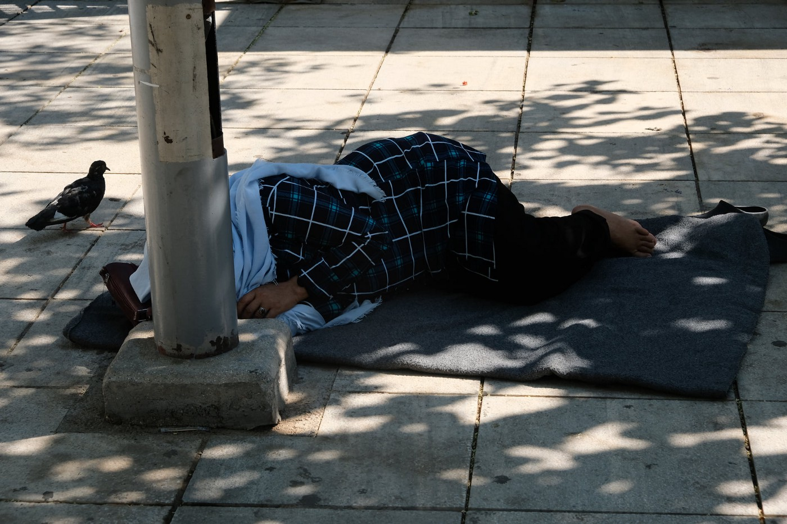

### AYS Daily Digest 30/07/2020: Trial against Salvini and the El Hiblu Three
#### Italian senate votes to allow the prosecution of Salvini // Three young men face trial for their role in mediating a dispute on a merchant ship that rescued them // MSF forced to close its Covid\-19 facility after fines from local authorities // Unbearable conditions in Vial camp // many people remain homeless in Victoria Square in Athens // NNK needs financial support // No news from a boat that has been at sea for four days now // and more…

copyright: Marios Lolos
### FEATURE: Two legal cases: One brings hope, one reinforces fears

Legal disputes can be a useful means to enforce human rights adherence — or they can provide for a legal route to their suspension\. When states’ power enforces the law, the world in which we live depends strongly on the way law is being spoken\. But we should not forget that the legal system is made by humans, laws are made by humans, and it is humans who accuse other humans of breaching the law and who eventually rule over them\. Humans have interests, positions, morals and values\. Their interpretation of the law is never neutral; it can’t be, because law always requires interpretation\. Of course, as with every act of interpretation, the interpretation of the law can be more or less absurd, more or less progressive or conservative, more or less building on former decisions, different authorities or believe systems\. As human rights activists, we therefore must watch closely over the way law is being articulated\. It might support our case of strengthening the human rights of every person on this planet\. But it might as well strengthen states’ “right” to enforce border security\. As we see on a daily basis in this digest, border security cannot be achieved without the violation of human rights, at least not as long as we live in a world of exploitation and unequal access to basic needs\.

The last days provided us with two different remarkable situations concerning the rights of people on the move\. In today’s feature we want to give you a short overview of both, as together they provide a good example of just how contested the rights of people on the move are\.

Let’s start with the example that provides us with a note of hope\. 
The Senate of Italy has voted to allow for the prosecution of Italy’s ex\-interior minister Matteo Salvini\. His immunity as a parliamentarian is therefore suspended\. Now the way is cleared to prosecute Salvini for blocking the Open Arms rescue ship with more than 150 rescued people from disembarking at an Italian port last August\. The ship was at sea for nearly three weeks\. Prosecutors in Sicily now accused Salvini of illegal detention of the people rescued at sea\. In February, the Senate already voted to strip him of his immunity in order to bring him to trial for blocking migrants from disembarking from the Italian’s coast guards vessel Gregoretti in last July\.

On Twitter, Salvini explained that he is proud to have defended Italy and that he would do it again\. He pointed to article 52 of the constitution, which refers to the defense of the homeland\. This is clear racist rhetoric\. Rescuing fellow humans has nothing to do with attacking a country\. The court in Palermo now has the unique chance to rule against a former minister of the interior\. If the court decides to uphold and strengthen the duty to rescue people at sea, this would be a strong signal to all European politicians, whether in Germany, Croatia or Malta, to adhere to human right standards and not play games with vulnerable people’s lives\.

At the same time in Malta, a trial is underway that could have devastating effects not only on the lives of three young men, but on the situation of refugees in the entire Mediterranean\.

In March 2019, a rubber boat carrying 108 people left Libya in order to reach Europe\. The boat was eventually rescued by a merchant vessel called El Hiblu 1\. While telling the passengers that the boat would head for a port of safety in Europe, the captain was actually following the orders of European authorities, who told him to push the people back to Libya, where war and torture awaited them\. When the people realized they were back in Libyan waters, they formed a collective protest and explained they would not leave the boat\. In this protest, no violence was used and no property was damaged\. The captain eventually gave in and directed the boat to Malta\. There, he was ordered by Maltese authorities to stop the engine\. Maltese military stormed the boat and arrested three young men –age 15, 16, and 19 — as the leaders of the “revolt”\. They were detained in high security units and only released on bail in November 2019\. 
While the Maltese authorities charge them with terrorism and hijacking, survivors on board claim they did not function as leaders; rather, they acted as mediators and translators between the people on board and the ship’s crew because all three spoke good English\. 
On Thursday the three young men had to appear in court in Valetta\. They face serious prison sentences if convicted\. Some of the charges put against them are punishable with life imprisonment\. 
The Maltese authorities are clearly trying to set an example by equating collective resistance and self\-defense against pushbacks with terrorism\. As in the Salvini case in Italy, everything depends on what happens in court now and on the judge’s eventual decision\.

In a video made by the solidarity campaign El Hiblu Three, which you can find on the following page, survivors of the experience tell their story\.

For more updates also follow \#Elhiblu3 on Twitter\.
### TURKEY

In the southern region of the border province of Hatay, six Syrian children have been physically and verbally attacked by a group of seven to eight Turkish young people\. The racist attack led to two children being treated in the Kırıkhan State Hospital\. Racism and hatred against Syrians is on the rise in Turkey\. The Hatay governor’s office released a strong statement condemning the attack and welcoming Syrians as brothers\.

For more information, see:

### GREECE
#### MSF forced to close Covid\-19 facility

■■■■■■■■■■■■■■ 
> **[MSF Sea](https://twitter.com/MSF_Sea) @ Twitter Says:** 

> > #BREAKING: #MSF is forced to close our #Covid19 facility in #Lesbos as a consequence of fines and legal threats imposed by #Greek local authorities. This closure will reduce the local capacity and this could have terrible implications should an outbreak occur in #Moria. 

> **Tweeted at [2020-07-30 09:35:16](https://twitter.com/msf_sea/status/1288770122765787138).** 

■■■■■■■■■■■■■■ 

We all know how dire the situation is in Moria, especially with regards to access to health care, and how severely it has deteriorated during the outbreak of COVID\-19\. MSF tried to ease the situation by putting up a COVID\-19 isolation centre\. Now Greek local authorities forced MSF to close the centre by imposing fines with potentially criminal charges related to urban planning regulations\.

> “During a global pandemic, MSF has been prevented from responding to a public health risk that the authorities have neglected” says Bertrand Perrochet, MSF director of operations\. The Head of MSFs Mission in Greece, Stephan Oberreit, said that Lesvos “would simply be unable to handle the devastation caused by an outbreak in Moria”\. 

The centre run by MSF was the only place on Lesbos where people from Moria could be isolated and provided with medical care if they were displaying symptoms of COVID\-19, according to MSF\. 
Moria is currently hosting about 15,000 people, among them at least 300 high\-risk people of advanced age or possessing a chronic medical condition\. Access to soap and water is still very limited\. The camp has been under lockdown since March\.

> “For the past five years, we have seen the terrible harm inflicted by containment policies on people trapped in reception centres across the Greek islands\. Now, during a global pandemic, MSF has been prevented from responding to a public health risk that the authorities have neglected,” says Perrochet\. 

The Moria White Helmets reported several fires in and around Moria\. So far nobody has been hurt\. They thank the firefighters for they excellent job\.
#### Conditions in VIAL camp on Chios

A 19 year old man from Iraq was found dead, hanging from a tree about 2\.5 km from Vial camp on Chios\. According to local media, it is assumed that he committed suicide, but a forensic examination will bring clarity\. 
Meanwhile, the situation in Vial is very similar to the situation in Moria\. People are locked in, support networks locked out\. Access to running water is limited, and people have to wait for hours in the hot sun in order to receive food that is already going bad\. The wait time for an asylum interview hovers around a year\. Many asylum claims, even from Syrians, are rejected\. Suicide attempts are common, while the psychological support is minimal\. There is no solution for the rubbish problem, so people have to live among the waste or burn it, which again increases the risk of fires\. The people who are allowed to move out of the camp are often left without any support\. In Chios city, they are forced to either pay very high prices for accommodation or sleep rough\. Fascism is on the raise, targeting refugees but also refugee support networks\. 
For a long and comprehensive statement on the current situation, see Jenny’s post in the Solidarity in Chios FB group\.
#### Victoria Square Athens

According to journalists, some 150 people, among them many children, slept in Victoria square in Athens again last night\. They are without access to sanitary facilities, basic needs, and medical or legal supervision\.

■■■■■■■■■■■■■■ 
> **[Franziska Grillmeier](https://twitter.com/f_grillmeier) @ Twitter Says:** 

> > Right now there are ~ 150 #refugeesgr staying another night at #Victoriasquare in #Athens, with no sanitary facilities &amp; a severe lack of basic needs &amp; any medical or legal supervision; after the the eviction of more than 11,000 recognised refugees has begun last month. 

> **Tweeted at [2020-07-29 17:46:01](https://twitter.com/f_grillmeier/status/1288531236802174976).** 

■■■■■■■■■■■■■■ 

Copyright: Marios Lolos
### ALBANIA

According to local media, the dead body of a 35\-year\-old man from Morocco has been found in Lake Skadar in Albania\.
### SERBIA

Asylum Protection in Serbia reported that people who live in the camp in Krnjača are not allowed to move freely if they are not in a asylum procedure in Serbia\. They ask:

> “Why are people who are illegally in the country placed in a state institution, without resolving their irregular position? Serbian law does not recognize “irregular residence”\.” 

The group writes that people should receive some sort of paper that at the very least puts an end to restrictions on their movement\. They also report very poor hygienic conditions in the camp in Sombor\. Apparently there is only one shower for more than 400 people\. The toilets lack running water, and blankets are not being changed or washed\. Beside adult singles, accompanied minors between the ages of 6 and 12, most of them from Syria, also live under these conditions\.

No Name Kitchen is in need for financial support, in order to be able to provide help to hundreds of people who do not live in camps but rather the jungle around Šid and other places\. 
No Name Kitchen provided some stories of people whom they are trying to help:

> “Velika Kladuša, Bosnia, MAROUANE is 34 years old from Morocco\. During his last attempt to cross the border between Bosnia and Croatia, Croatian police caught him and broke his glasses\. He needs a new pare of glasses\. Expected cost, 125 euros\.” 

> “Podgorica, Montenegro, BENJAMIN is 1 year old from Iran\. He is travelling with his family; his father went ahead while he is waiting with his mum in Podgorica to possible move on in the next future\. He is asthmatic and needs some medical devices to cope with it\. Expected cost, 135 euros\.“ 

Please, if you can support them, go to [https://www\.nonamekitchen\.org/en/](https://www.nonamekitchen.org/en/)
### SEA

The boat that reached out to Alarm Phone on July 27 with 17 people on board seems to be still at sea\. Apparently the Italian authorities instructed a merchant vessel to stay close by, while waiting for Libyan authorities to take over the coordination\. According to Alarm Phone, the Libyan Coast Guards did not pick up the phone when they tried to call them\. Alarm Phone lost contact with the boat at one point, but Sea Watch’s airplane Moonbird spotted it again later\.

■■■■■■■■■■■■■■ 
> **[Alarm Phone](https://twitter.com/alarm_phone) @ Twitter Says:** 

> > ++ 62 hours left adrift! ++

It's a shame that the people in need are still in distress at sea! We informed authorities more then 62h ago and the merchant vessel #BASSILEVOUSA is nearby but the boat is left adrift in international waters, instructed by MRCC Rome not to intervene. 

> **Tweeted at [2020-07-30 18:47:54](https://twitter.com/alarm_phone/status/1288909199917953026).** 

■■■■■■■■■■■■■■ 

These people are in the middle of the Mediterranean Sea for four full days now\. All authorities are aware of the situation\. Nothing is being done, while merchant vessels and private NGOs are prevented from intervening\.
### ITALY

According to InfoMigrants, the northeastern Italian region of Friuli Venezia Giulia asked the government to close some of the smaller border crossings with Slovenia\. As is seen so often these days, the security councillor of the region framed immigration as a threat to public health\. 
For more information, see:

After a city denied a Nigerian mother a maternity grant and family benefits, a judge has ruled that this is against EU legislation\. Before, the municipality of the city Castel Volturno denied the woman the benefits because she did not hold a stay permit for long\-term residents\. The judge has ruled that this practice could be deemed discriminatory\. EU legislation states that foreign residents must receive the same benefits as citizens\. The Nigerian woman has been working as a farmworker and domestic helper\. She holds a valid stay permit and was paying all her taxes in a low\-income job\. Although all of her kids — among them triplets — were born in Italy, none of them is Italian\. Italian nationality laws require at least one parent be Italian in order to grant citizenship at birth\. 
For more information, see:

### GERMANY

According to local media, another 85 minors and 90 family members from camps from the Greek islands are supposed to land in Germany on Wednesday\. These people are some of the 928 people from the Greek islands that Germany will receive in total, as part of the European solution to redistribute 1,600 vulnerable people from the islands\. Only yesterday it became public that the German federal minister of the interior, Horst Seehofer, forbade the city of Berlin to take in an additional 300 people\. About 75 German cities and regions are willing to take in more people than is their share, following the European solution that Seehofer wants to stick with\. Once again, Seehofer claimed that he would only support a European solution\. We have heard this statement for years now, but we still do not understand it\. If on the nation\-state level there is no willingness to end the suffering of thousands of people, why not let willing cities do what they can? Why hinder solidarity?

For more information, see here:

And here:

InfoMigrants meanwhile reports that more and more people with refugee protection status live in private accommodation in Germany, most of them in urban areas\. In 2018, 75% of recognized refugees lived in private accommodation such as rented apartments or houses\.

For more information, see here:

### FRANCE

After the eviction of a camp in which about 1,800 people were living on Wednesday, \(see yesterday’s digest [here](ays-daily-digest-29-7-2020-geographic-restrictions-in-ceuta-are-melilla-are-illegal-court-says-6419ac8b39d7) \), the group Solidarité migrants Wilson are calling for support\. The group explained that many people who were evicted were on the streets again the same evening, but left without tents and scattered all over the place\. Solidarité migrants Wilson aims to support them with food\. 
On July 30 a solidarity protest was organized to support the voices of hundreds of unaccompanied minors who live in tents at square Jules Ferry\.
Please, if you can support them, go to their Facebook page for more information\. 
For more information about the eviction, see here:

### WORTH READING

This op\-ed article from the Economist calls for an end to travel restrictions for migrants\. After months of closed borders, tourists are now welcomed again in many places in the world — so it is not understandable why migrants are still looked in camps\.

**Find daily updates and special reports on our [Medium page](https://medium.com/are-you-syrious) \.**

**If you wish to contribute, either by writing a report or a story, or by joining the info gathering team, please let us know\.**

**We strive to echo correct news from the ground through collaboration and fairness\. Every effort has been made to credit organisations and individuals with regard to the supply of information, video, and photo material \(in cases where the source wanted to be accredited\) \. Please notify us regarding corrections\.**

**If there’s anything you want to share or comment, contact us through Facebook, Twitter or write to: areyousyrious@gmail\.com**

_Converted [Medium Post](https://medium.com/are-you-syrious/ays-daily-digest-30-07-2020-trial-against-salvini-and-the-elhiblu3-bf83204c6ec8) by [ZMediumToMarkdown](https://github.com/ZhgChgLi/ZMediumToMarkdown)._
