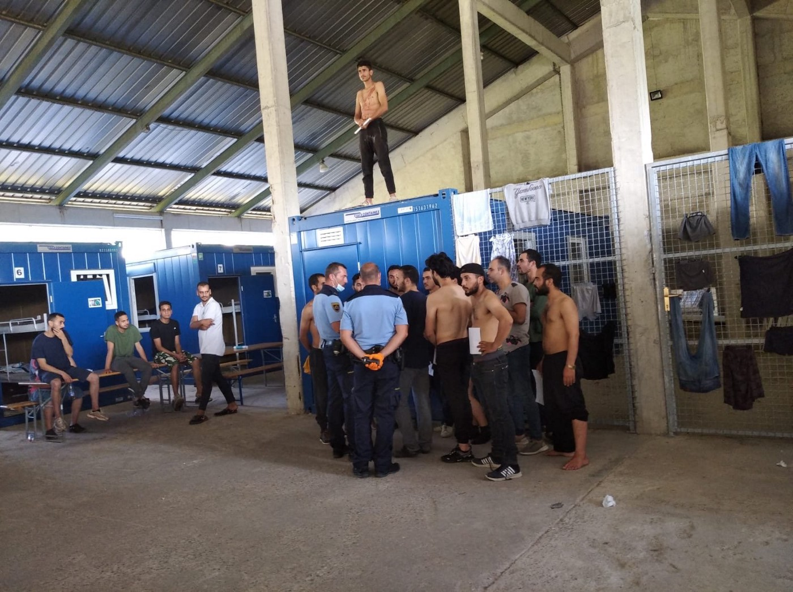
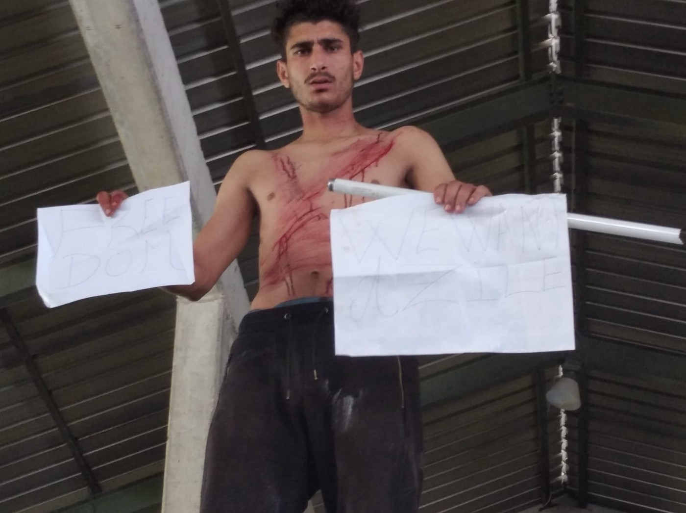

### AYS Daily Digest 31/07/2020: A last desperate attempt for asylum: inside the ‘Centre for Aliens” Slovenia\.

Family separation and deportation in The Netherlands // Campaign for the _Iuventa 10 //_ Libyan authorities kill two Sudanese migrants // Croatia beat and pushed\-back a 15\-year\-old boy // English Channel crossings\.

### Feature:

**Protests by Those Deprived of Applying for Asylum in Postojna ‘Centre for Aliens’, Slovenia**

The _Centre for Aliens_ in Postojna is a prison\-like institution where foreigners who are ‘not welcome’ in Slovenia, are detained\.

At present, there are approximately 200 people being detained in the _Centre for Aliens\._ The detainees are both asylum seekers, as well as those who have recently arrived to Slovenia via the Balkan route, and were subsequently illegally denied the opportunity to apply for asylum\. The latter group are expected to be returned to Croatia and then further on to Bosnia & Herzegovina\.

Furthermore, Slovenia does not formally extradite people to a number of different countries\. Thus, the entire premise for this institution is that these ‘unwelcome’ people who were able to apply for asylum will cave under the prison\-like conditions in and eventually leave the country voluntarily\.

The protest on Tuesday was a demonstration of the plight of people who have risked everything to come to Europe, only to find that their fundamental rights are being ignored\.

Footage of the protest shows a detainee cutting his skin in the area of the upper body and neck to protest the humiliating treatment and the involuntary & illegal deportations\. [The protest also involved a number of detainees](https://www.facebook.com/ambasadarog/posts/1203048166696484?__xts__%5B0%5D=68.ARDmg3DiQo7Ea-HeDbCk4NdLVyq_8a2f0yXRZeRiS79tBpHYrS9Y5QDDgmp4clFvSCQjk87QgO3LMS5ZCDjJskVTKSuzmTcgmk4gCJZTlwo_T73A_G72K7yunYqXKOcQ_lXfNI2D6suBT4kCUl14-8UAtGqB-8EjAjA24UXbU93XtFH1pRpPK-b0vmwR-emY3tQgS-ZkXjU2evtBIYBF5x1XSkHd8-gMlOTxpy2NGh4hX67i_X-d5P7AujAuuxoCmsLiJ0GlMjRIOIhJ6sHak520MXPCiUye_YO_PJEo-0uFachYH3ftX8mrWinqIBVVfdC24s1eBJJ7ENOSemlEbKnQUg&__tn__=-R) showing white papers demanding their right to “freedom of movement”\.

The majority of people in the centre are housed in containers\. Food is distributed through a fence\. There is no provision of hygiene products or fresh clothes\.There has been a large increase in the number of asylum seekers who are detained within the centre in Postojna, which is a result of a new policy introduced during the COVID\-19 pandemic\. To facilitate this increase in asylum seekers and ‘would\-be’ asylum seekers, some ad hoc infrastructure has been constructed on the premises of the detention centre, similar to \(if not worse than\) those constructed in IOM run centres in Bosnia\. This centre in Slovenia has numerous parallels to the “Hungarian model” of detention centres, that were recently condemned by the [European court of Human Rights](https://www.amnesty.org/en/latest/news/2020/05/hungary-european-court-declares-authorities-broke-eu-law-by-detaining-asylum-seekers-in-transit-zone/) \.

Many of the people inside are faced with deportation to Croatia, where the authorities will deport them further to Bosnia & Herzegovina\. These deportations are happening under a readmission agreement\. In many cases those being deported do not know that they will be deported until the moment police arrive to take them to the border\. This kind of action by the police demonstrates a systemic violation of basic human rights\. With an increasing number of readmissions from Italy to Slovenia, the detention centre in Postojna can be viewed as part of infrastructure involved in chain pushback, starting in Italy and ending in Bosnia & Herzegovina\.

The protest was held only one week after a [Slovenian administrative court ruled in favour of a person from Cameroon](https://www.borderviolence.eu/wp-content/uploads/PRESS-KIT-FOR-INTERNATIONAL-MEDIA.pdf) , who had been [denied](https://balkaninsight.com/2020/07/28/slovenian-court-ruling-a-boost-in-battle-against-refugee-pushbacks/) the opportunity to apply for asylum, on the grounds that: “Republic of Slovenia has violated the Applicant’s right to asylum \(Article 18 of the EU Charter of Fundamental Rights\), the prohibition of collective expulsions \(Article 19 § 1\) and the principle of non\-refoulement”\. His case is identical to that of around 20 000 people, including the cases of those seen protesting in the videos and photos\.

This demonstration is their asylum application, as there seems to be no other way for them to apply\.

The above report was produced by volunteers Info Kolpa\. Additionally, the ongoing situation is being monitored closely by AYS, and an upcoming feature article will be published in the coming days\.
### Netherlands

[Eleven UN human rights experts](https://www.scoop.co.nz/stories/WO2007/S00246/the-netherlands-reunite-refugee-family-with-their-children-dont-deport-the-parents.htm?fbclid=IwAR2fS4fSS3TSLLdD-ZBxu0b_rhFMkOGKQvV_3-AiOxbx_Pr51IcSrhbHgdQ) , have called on the Netherlands to refrain from deporting two Ugandan refugee parents and their baby as it would separate them from their other children\. The Special Rapporteur on contemporary forms of racism, the Working Group of Experts on People of African Descent and the Working Group on discrimination against women and girls expressed serious concerns over the Dutch Immigration and Naturalisation Service’s intention to revoke the refugee status of Jude Kasangaki and Anita Mavita and deport them to Uganda, along with their youngest child, a one\-year\-old boy, while leaving their other seven children scattered across five foster homes in the Netherlands\.

> The experts stated that: “Deportation of the parents and the youngest child would irrevocably separate the seven children from their parents, disregarding their best interests,”\. They further stated that “The children remaining in the Netherlands might never again see their parents or their baby brother\. Such a move would violate the right to family life and unity as guaranteed by the Convention on the Rights of the Child,” 

These remaining children, all under the age of 12, were forcibly removed from their parents in 2018\. The circumstances of the removal have been challenged in the court by the parents and have received criticism from UN human rights experts\.

> The group of experts said: “The removal of the children from their parents appears to have been influenced by racial and cultural biases that resulted in discriminatory treatment,” “We urge the Netherlands to reconsider the deportation, set forth a family reunification plan, and do an independent assessment of this case to determine what solution is in the children’s best interests\.” 

### Tunisia

Local [Tunisian](https://www.repubblica.it/cronaca/2020/07/30/news/migranti_alarm_phone_naufragio_al_largo_tunisia_24_dispersi-263254246/?fbclid=IwAR1GetnK8yJjsKOCWTNnz6DtgdZodn5ej3jiQKR6rpqcTRU50TYL0v-eZ8s) media reported on Thursday about a shipwreck which occured off the coast of Mehdia, Tunisia\. One man was rescued after spending four days at sea\. 24 people are still missing\. This was the [third shipwreck](https://twitter.com/alarm_phone/status/1288729633106595840?s=20) found off the Tunisian coast this week\.

### Italy

In light of the increasing migration movements, Italy is setting up a ‘ [quarantine ship](https://www.stol.it/artikel/chronik/italien-richtet-quarantaeneschiff-vor-lampedusa-ein?fbclid=IwAR3X3PHz009kig8v6N9OZpF78m9sRBgIo2wb4wC0kXFGQOXXPCwOd0w_o8I) ’ for migrants who independently reach the southern Mediterranean island of Lampedusa\. The ship is scheduled to anchor between Lampedusa and Porto Empedocle in the next few days, the Italian Interior Ministry announced in Rome on Friday\. The ship has a capacity for 700 people on board\. The Ministry of the Interior also wants to set up a smaller quarantine ship that is to be anchored off Calabria\.

[_Amnesty International_](https://www.amnesty.org/en/latest/news/2020/07/italy-crew-of-rescue-ship-face-20-years-in-jail-on-third-anniversary-of-smuggling-investigation/?fbclid=IwAR2_zOxpk3kYssZFek2BQRsftINuUnqcnDHfvKuTeAtR55kJsjBdBT8EUPk) has launched a global solidarity campaign for ten crew members of the search and rescue ship _Iuventa\._ The campaign calls on the Italian prosecutor to drop the judicial investigation against the “Iuventa 10” who have been charged with “facilitating the irregular entry” of migrants into Italy, which may result in a prison sentence of up to 20 years\. In reality, what the “Iuventa 10" are responsible for is saving the lives of more than 14,000 people at sea\.

_Converted [Medium Post](https://medium.com/are-you-syrious/ays-daily-digest-31-07-2020-a-last-desperate-attempt-for-asylum-inside-the-centre-for-aliens-4f775799822b) by [ZMediumToMarkdown](https://github.com/ZhgChgLi/ZMediumToMarkdown)._
