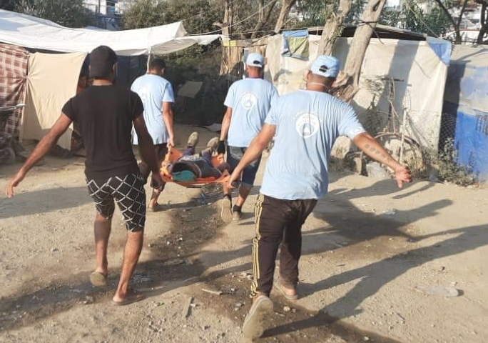

### AYS Daily Digest 5/8/20 German neo\-Nazi admits to murder of pro\-refugee politician

_Hundreds missing once returned to Libya // People put on ships in Lampedusa // Racist attacks in several countries // UK failing at refugee integration // & more…_

](assets/915f4b9ad2b3/1*frRHqhBGAlL9pYZcElLvTw.jpeg)

KSK was dispanded from the German armed forces this week for involvment with neo\-Nazi ideology\. Photo provided by [DW](https://www.dw.com/en/germany-to-overhaul-elite-army-force-tied-to-right-wing-extremism/a-54004898)
### FEATURE: On Wednesday the German neo\-Nazi Stephan Ernst admitted that he murdered pro\-refugee politician Walter Luebcke

In a statement read by his lawyer, he stated, [“I fired the shot\.”](https://timesofmalta.com/articles/view/german-neo-nazi-admits-murder-of-pro-refugee-politician.809646?fbclid=IwAR1Yx451y_aZ8-QIxyRga8Vn_I_Z-EyHy3X9yNoJmeuBJej0BJSC74s-n1w) Considering that this murder has warranted a reckoning in how far\-right extremism is on the rise, especially in regards to terrorizing refugee populations in Europe, this confession is worth contextualizing\. Ernst is not alone in his intentions\. Without a doubt, neo\-Nazis are active in Germany today, and their ideology is affecting the lives of refugees and their likelihood of successful integration into German society\.

Yet Germany did take a big step this week in acknowledging how far\-right extremism is circulating within its own governmental institutions → **Germany’s defense ministry officially disbanded a company of its Special Forces Command \(KSK\) \.** This decision came after reports detailed neo\-Nazi ideology among the KSK\. Fabian Virchow, a professor at the University of Applied Sciences Düsseldorf and director of the Research Unit on Right Wing Extremism, told [VOA](https://www.voanews.com/extremism-watch/germany-dissolves-elite-army-unit-over-far-right-activity?fbclid=IwAR3797dZPS59indF6xk7swJ-Tpftx3waOP93lCJdrmCB17QTdSjlqMfDH3U) :

> “The announcement basically acknowledges for the first time that it is not just individual cases in which soldiers show up as right\-wing extremists, but that there are right\-wing extremist networks in the German Federal Armed Forces…It shows that this danger has been systematically underestimated in the past by political and military leaders\.” 

While this might be an encouraging step, more needs to be done to address the violence done by far\-right extremists in Germany\. [Just last week](https://www.dw.com/en/germany-african-migrants-injured-in-gang-attack-near-far-right-venue/a-54404278?fbclid=IwAR2jVhGVVPWjPFBmiTd7-SrPUfN6fIVUcFyGmHlBkrGHPtekPJeHWIpM350) , a group of people believed to be affiliated with the extreme right party Der III\. Weg \(The Third Way\) attacked two refugee men overnight in the city of Erfurt\. Both were critically injured\. More violent attacks such as this are bound to happen if investigations into every area of German government don’t take place\. Dirk Friedriszik, a German lawmaker told [NYT](https://www.nytimes.com/2020/08/01/world/europe/germany-nazi-infiltration.html?fbclid=IwAR0yEk2nnrk6ith9Pry6dz5s-2u-pc3o-TPy4EFi5TDy6MdmeLwxr8FDoYg) :

> “I fear we’ve only seen the tip of the iceberg…It isn’t just the KSK\. The real worry is: These cells are everywhere\. In the army, in the police, in reservist units\.” 

Far\-right extremism, and the racism that fuels it, must be defeated for the sake of everyone’s human rights, but particularly for those in need of asylum\.
#### LIBYA

[The New Humanitarian](https://www.thenewhumanitarian.org/news-feature/2020/08/05/missing-migrants-Libya-forced-returns-Mediterranean?fbclid=IwAR0SY6LaKsJvKwGeLPbBcghvt_hOPNU-pQHtbE9eNmk_8x4sBpMxKx56lHc) just published a piece called **What happens to migrants forcibly returned to Libya? ‘These are people going missing by the hundreds\.’** While AYS encourages you to read it in its entirety, the excerpt below articulates why the EU cannot trust the Libyan government to do its bidding without recognizing the EU’s role in allowing human trafficking to flourish in the country:

> “There remains no clear explanation why some people intercepted attempting the sea journey appear to be being taken to data\-collection and investigation facilities, while others end up in official centres\. But researchers believe migrants are typically taken to facilities that have space to house new detainees, or other militias may strike a deal to purchase a new group to extort them\. 

> “In a leaked report from last year, the EU acknowledged that the GNA ‘has not taken steps to improve the situation in the centres,’ and that ‘the government’s reluctance to address the problems raises questions of its own involvement\.’” 

#### SEA

Sea Eye filed a lawsuit in Italy on Wednesday for the fixing of its ship the Alan Kurdi\. According to German media _“The Alan Kurdi commander immediately objected to his ship being detained \(earlier in 2020\) \. The Federal Ministry of Transport confirmed that the German flag\-state administration had issued the certificates required for operation, and all requirements had been met\. In vain\. Sea\-Eye is now trying to disprove point by point the alleged deficiencies with its lawyers in the application, which the port authority is leading\.”_ Learn more [here](https://www.sueddeutsche.de/politik/seenotrettung-see-eye-italien-1.4990485?fbclid=IwAR3gWchdJ_1Vo4yn50KneXrANZWCCd2rZ032nudlPG64kJgGF623xOuwNp4) about this unusual move by an NGO that is only trying to save lives at sea\.

ALSO FREE THE OCEAN VIKING\! Another ship that should not by immobilized\. Learn more [here](https://news.konbini.com/societe/le-navire-humanitaire-ocean-viking-immobilise-par-les-autorites-italiennes?fbclid=IwAR26w3iYQTDKfgdX5IaWnUAu9u2lSnwQCnFaRTPhQqdQxpOp5DOeRHcxxMM) \.

■■■■■■■■■■■■■■ 
> **[Sea-Watch International](https://twitter.com/seawatch_intl) @ Twitter Says:** 

> > Today, 27 people were fortunately rescued from the boat in distress thanks to the tireless efforts by the crew of the merchant vessel Etienne. Once again, the Rescue Coordination Center in #Malta has completely failed and refused to take any responsibility. 

> **Tweeted at [2020-08-05 12:31:21](https://twitter.com/seawatch_intl/status/1290988764773462017).** 

■■■■■■■■■■■■■■ 

#### GREECE

 By Me Lesvos because we believe refugees need to know how to find help in such situations and we will also push for some courses in fire protection\.” Photos by [Moria White Helmets](https://www.facebook.com/MoriaWhiteHelmets/posts/173429790966755)](assets/915f4b9ad2b3/1*4vVPtKMLwceR09PRLaMhRw.jpeg)

“For months we have been trying to assist with first aid and emergency intervention for injured and sick in the camp\. Especially at night there is no medical service at the camp, so we have a system to bring people down from the jungle to ambulances or the hospitals in day time\. 
We are very much supporting the first aid courses by BRF and [@Stand](http://twitter.com/Stand) By Me Lesvos because we believe refugees need to know how to find help in such situations and we will also push for some courses in fire protection\.” Photos by [Moria White Helmets](https://www.facebook.com/MoriaWhiteHelmets/posts/173429790966755)

 , most people stay intents\. Lit fires to cook or create a source of light, since most of the surrounding wild camp is still without electricity\. Right now there are ~13,500 residents\. Daily violent incidents reported by [\#refugeesgr](https://twitter.com/hashtag/refugeesgr?src=hashtag_click) , mostly at night\.” Photo by [Franziska Grillmeier](https://twitter.com/f_grillmeier/status/1291085682111393792)](assets/915f4b9ad2b3/1*ci7isKcmHPwcdyorvXl0pg.jpeg)

“When night falls in [\#Moria](https://twitter.com/hashtag/Moria?src=hashtag_click) , most people stay intents\. Lit fires to cook or create a source of light, since most of the surrounding wild camp is still without electricity\. Right now there are ~13,500 residents\. Daily violent incidents reported by [\#refugeesgr](https://twitter.com/hashtag/refugeesgr?src=hashtag_click) , mostly at night\.” Photo by [Franziska Grillmeier](https://twitter.com/f_grillmeier/status/1291085682111393792)

[Europe Must Act](https://www.facebook.com/europemustact/posts/163441185268584) has started \#RaisingVoices and you should check out the talent in their latest video:

There is an event in Athens on Thursday, 6 August, called “Benches for Viktoria” at 6pm\. _“Last month the Municipality of Athens removed every bench from Plateia Viktoria…In recent weeks this has also been a place where migrants have been forced to sleep on the pavement, left homeless by the Greek state’s asylum laws and impossible bureaucracy\. The Municipality removed the benches so that these people could not sit comfortably or rest…So this Thursday we bring our own benches, we will play games and listen to music, and sit together comfortably on Viktoria for as long as we want\. Bring your paints, games, and any wood pallets you have\!”_ Find the event [here](https://www.facebook.com/events/2439408089684743/) \.

Update from Anwar Nillufary on the 44th day of his second hunger strike outside the offices of UNHCR in Athens:

Help support the Pomegranate Project\! _“It is the first of its kind in Greece → run entirely by women, for women, offering a holistic programme to protect and empower women displaced by conflict and violence\. Women’s voices and experiences are always at the forefront of the Project\. We have been running activities and language/basic IT literacy classes following strict health measures here in Athens, providing women from multiple nationalities with a safe space to learn, develop skills while receiving psycho\-social support\.”_ Support [here](https://www.facebook.com/actionforwomenCH/posts/2078752448935900) \.

Seven people were killed and five were injured in a car crash on Wednesday morning in Ardanio \(Northeastern Greece\) \. It remains unclear if they were being trafficked and if one of them was a trafficker\. According to the police, the car was stolen the day before in Thessaloniki\. [More here\.](https://www.keeptalkinggreece.com/2020/08/05/alexandroupolis-migrants-dead-injured-traffic-accident/)

**Racism is on the rise in Greece resulting from peoples’ COVID\-19 fears\.** On Tuesday passengers literally threw a refugee man off of their train because he was black and they feared he might have COVID\-19\. This happened on the Athens\-Thessaloniki train, at Lianokladi station\. Learn more [here](https://www.lamiareport.gr/index.php/topika/item/162413-lamia-adianoito-ton-petaksan-ekso-apo-to-treno-giati-nomizan-oti-eixe-koronoio) \.
#### ITALY

Italy is trying to house hundreds of migrants on a ship in Lampedusa\. With all of the new arrivals to the island recently they are trying to clear an overcrowded hotspot\. InfoMigrants reports that _“Between 250–350 migrants boarded the Azzurra ferry at Cala Pisana on the Sicilian island of Lampedusa on 4 August in order to begin their 14\-day statutory quarantine after arrival in Italy\. Most of the migrants were Tunisians\.”_ Find out more [here](https://www.infomigrants.net/en/post/26455/hundreds-of-migrants-board-new-quarantine-ship-in-lampedusa?fbclid=IwAR3op_GhmbJXbIxji5HAIyuEWjRfiS7OT7QdcQloy7zaPO8tojgwm2Fkp6I) \.

On Saturday a man was beaten in a racist attack on the beach simply for being black in Castiglione della Pescaia \(Tuscany region\) \. He sustained multiple injuries and there were two attackers\. He has been working in the region for four years\. Racism must be condemned, once and for all\. Learn more [here](https://www.infomigrants.net/en/post/26446/man-beaten-on-italian-beach-for-being-black?fbclid=IwAR2h_otUx3my3LjErZs5Js3tDggmt7YjTvxC6gvUDxK3vDV3e2hyPgXUdYI) \.

![“The third lockdown started at the former Cavarzerani barracks\. The first one started in March, when by decree everyone had to respect the same rules, including asylum seekers, of whom there were, at the time, around 300\. The second one was begun about two weeks ago, because three positive cases were found inside the camp …\. The third lockdown started this week because another person tested positive\. Meanwhile there are now 500 people locked up in camp, overcoming the maximum capacity limit\.” Photo and info by [Ospiti in Arrivo](https://www.facebook.com/ospitinarrivo/posts/2718122068443889)](assets/915f4b9ad2b3/1*-PXo4ibPAxeoHll1qDFz8Q.png)

“The third lockdown started at the former Cavarzerani barracks\. The first one started in March, when by decree everyone had to respect the same rules, including asylum seekers, of whom there were, at the time, around 300\. The second one was begun about two weeks ago, because three positive cases were found inside the camp …\. The third lockdown started this week because another person tested positive\. Meanwhile there are now 500 people locked up in camp, overcoming the maximum capacity limit\.” Photo and info by [Ospiti in Arrivo](https://www.facebook.com/ospitinarrivo/posts/2718122068443889)

[Leoluca Orlando](https://www.ekd.de/leoluca-orlando-covid-19-positive-fluechtlinge-57713.htm?fbclid=IwAR3r6uAfd1gJposaogSarXOV6J5FTUfucia1lK2q0o9UXZA3N8nunzOJAhU) , the mayor of Palermo, believes in some encouraging political moves to help refugees during the pandemic: _“Everyone has a right to solidarity, including a refugee\. And a sick refugee must have access to medical care…Nobody is under stricter supervision than refugees\. They would be tested regularly…We have infected refugees in a quarantine hotel with Italians\.”_ He believes that anyone should be able to get tested despite their legal status\. Wise words\. Refugees need to be protected from COVID\-19 too\.
#### SPAIN

[Evictions in Spain](https://www.publico.es/internacional/refugiados-refugiados-sirios-naufragan-espana-vine-futuro-no-vivir-calle.html?utm_source=telegram&utm_medium=social&utm_campaign=web&fbclid=IwAR3XKT0n3AstDe-QU7CihXDUSdX1kxmQno-u640H6NNt_zXFKUiznXeKY6A) due to refugees losing their jobs and social services are having devastating personal effects, especially in the time of COVID\-19\. Read here some personal stories, in particular from a family from Syria\.
#### SERBIA

According to the [UNHCR Serbia Monthly Update](https://reliefweb.int/report/serbia/unhcr-serbia-monthly-update-july-2020?fbclid=IwAR0qsfUbrTcgio2_Qr3ciHmvMNJprzUOEBIVt95rypsiLGZzUyA-_ISAels) for July 2020:

> “Since the beginning of the pandemic, only two cases of Coronavirus infection have been confirmed among the refugee/migrant population, both with milder symptoms, recovering successfully in isolation\. Refugees, asylum\-seekers and migrants continue to enjoy unrestricted access to testing and health care, and all new arrivals are placed in 14\-day quarantine by the authorities\. 

> Two hundred and fifty\-three intentions to seek asylum were registered in July \(compared to 241 in June\) and six persons applied for asylum\. The Asylum Office adjudicated on eight asylum applications in the first instance, rejecting all\.” 

#### GERMANY

COVID\-19 is affecting the refugee and migrant populations more negatively in Germany than it is affecting the German citizenry\. InfoMigrants reports that: _“Joblessness among migrants increased by 27% from March to June, according to the German Federal Labor Office\. Among Germans, the increase was 20%\. A major reason for this discrepancy is that migrants, who have relatively low education levels and language skills, are largely employed in the services sector\. And this sector was hit hard by Germany’s six\-week lockdown in April and May\.”_

Also many refugees and migrants don’t have a job they can do from home, so if they cannot physically be there, they can no longer work\. Learn more [here](https://www.infomigrants.net/en/post/26440/in-germany-the-coronavirus-disproportionately-affects-migrants?fbclid=IwAR2B2NOldom5SEZd0kUzyVMkV_wiejpHH7FNHqQ1RpHWw0SZNUhAEIU8Jmo) \.

In an update from [No Border Network](https://www.facebook.com/freefighters/posts/3167740123313423) :

> “A man without a residence permit was held in the detention centre of Rotterdam\. He refused to stay there in a multi\-person cell, he longed for privacy and rest especially due to his autism and previous traumas\. The detention center disagreed and punished the man with two weeks of solitary confinement\. Every two weeks this sentence was repeated, which means the man spent almost a year in isolation\.
 

> We filed a complaint, but the complainant committee felt that the detention centre had asked often enough whether the man wanted to go into a multi\-person cell, so the complaint was declared unfounded\. We appealed, but again, the Council for Criminal Law Application and Youth Protection also found that the penalty was executed according to the rules\.” 

#### FRANCE

Twenty people were found in a trailer of a truck near Amiens on Tuesday morning\. People’s use of trucks to migrate is an increasing trend\. According to François Gémenne, a political science researcher: _“All smugglers and all networks operate with trucks\. There is no one network particularly known for use this operation\.”_ Learn more [here](https://www.infomigrants.net/fr/post/26442/amiens-20-migrants-erythreens-retrouves-dans-la-remorque-d-un-camion?fbclid=IwAR3cAY7IOc_KZz_ZGLRoo4zwBWmat0frpp6z9TEpxt_aVbpdUuGKa9d6Qb0) \.
#### EU

**Since the EU granted another** € **500 million to keep up the EU\-Turkey deal, Mar Liberum wrote an excellent analysis to remind us of “How the EU and Turkey are benefitting from the deal:”**

> “In July 2020, the European Union granted an additional €500 million to Turkey within the framework of the so\-called “EU\-Turkey Deal”\. [1](https://www.dw.com/de/eu-gibt-t%C3%BCrkei-knapp-500-millionen-euro-f%C3%BCr-fl%C3%BCchtlinge-aus-syrien/a-54133608) Over €6 billion have so far been paid to Turkey by the EU since the 2016 deal, [2](https://de.wikipedia.org/wiki/EU-T%C3%BCrkei-Abkommen_vom_18._M%C3%A4rz_2016) whereby EU leaders persuaded the country to support them in “protecting their borders” by forcibly preventing a further influx of refugees\. The borders of Europe are being increasingly fortified so that migrants from the global south cannot reach Western Europe\. To this ends, the EU has in recent years paid millions to governments of third countries at the borders of Europe — some in a state of civil war or war\-like conditions — including Libya, Turkey, Jordan, Lebanon and Morocco, to set up detention camps for refugees and to expand and strengthen repressive bodies such as border guards and the Coast Guard\. 

> The payment, which has now been approved, follows a number of provocations on Turkey’s part towards the EU and Greece: At the end of February, for example, Turkey “opened its gates” and transported hundreds of refugees to the country’s border with Greece in order to unleash a “storming of the border”\. Greece’s immediate response was to further militarize its borders, backed by the EU\. Heavily\-armed police and army officers shot at refugees, resulting in serious injuries and deaths\.” 

[Help is needed](https://www.facebook.com/lorena.fornasir/posts/3126353784148364) in a deportation case\!

> “Refugee activists, human rights defenders, politicians — WE NEED HELP\! A Syrian family managed to get to the Netherlands, but because of the Dublin convention, they may be deported to Croatia\. The deportation was suspended after a first court hearing, we have a very good lawyer\. Now the prosecutor wants to re\-apply the deportation because: 1\) The parents \(they have a two\-year\-old son, Omar\) are not able to demonstrate that the Croatian police abused and robbed them\. 2\) I myself testified and we also have documents from other activists with the same statements: we met people in Bosnia who had been illegally expelled from Croatia, even though they had already started the procedure for their asylum petition to the EU \(Croatia\) \. But the prosecutor says that we are not able to demonstrate that either\! 

> **EVIDENCE IS NEEDED: a statement with your name and a copy of your identity document in which you certify that Croatia is also deporting migrants when the asylum procedure has already started\.** If you know someone who has experienced this treatment in person, that will help even more\. Please send me an email with a brief description of the facts, your name and a copy of your identity document\. Do not send this via Facebook, only use the email [dirk\.planert@gmx\.de](mailto:dirk.planert@gmx.de) ” 

#### UK
### “The RESPOND project report finds UK’s integration policies are reactive, non\-interventionist and fragmented”

You can read the whole report [here](https://www.ein.org.uk/news/new-academic-report-examines-uk-policies-asylum-seeker-and-refugee-integration?fbclid=IwAR00pNUo70DfOc2Ms-3nqmaNARwAaSGTFurN1MjuqZmIa_yIG1zCVOWFdpA) , but essentially they looked into “the legal, political and institutional framework of integration policies in the UK” and find that the lack of integration initiatives had negative effects in that they placed all the agency on the immigrant/refugee themselves to figure it out\.

A petition is signed by 30,000 people calling for improvement to living conditions for refugees in Glasgow\! Their particular concerns address the “inedible food” and the safety of refugees exposed to COVID\-19\. Read more [here](https://www.heraldscotland.com/news/18630319.30-000-people-sign-petition-demanding-justice-glasgow-refugees/?fbclid=IwAR05x43Mc5yeE-BRer2Cr8qYcS6sy4iBg7oRlpOG4JefGQ3MiOTo-yIr_W8) \.
#### GENERAL

[The Refugee Law Initiative](https://rli.blogs.sas.ac.uk/2020/08/05/refugee-led-organizations-the-time-is-now/?fbclid=IwAR32DfJbeR7gTI-en5lqxtnhEEPwMT7QFupRVmvGaJib2VRoV9gQ39zcs0Q) has just published an article called “Refugee\-led Organizations: The Time Is Now\.” Here is an important excerpt but AYS recommends you read it in its entirety:

> “COVID\-19 has paralyzed many aspects of our world\. But as we stop and reflect on what the pandemic means for our future life, we realize that it is not all about restrictions\. Quite on the contrary, COVID\-19 has also presented us with many opportunities\. And while the main focus now is to resume our lives as fast as possible, it will soon become apparent that “back to normal” cannot be fully achieved and that, thankfully, some positive changes have already occurred\. The challenge is to ensure that they become permanent\. 

> For refugees all over the world, COVID\-19 has brought many devastating consequences both in terms of their health but also their ability to earn a livelihood…The impact of the coronavirus crisis on refugee communities is being closely analyzed and will continue to be in the near future, at least while the repercussions last\. For instance, the World Bank–UNHCR Joint Data Center on Forced Displacement \(JDC\) has created a dedicated space for researchers and practitioners where they can collect and share research findings about the current pandemic\. This blog post, however, aims to highlight some of the new opportunities COVID\-19 has opened up which, if grasped and developed, could bring about radical changes in the refugee field and revolutionize the current concept of aid and how to provide it\.” 

**Find daily updates and special reports on our [Medium page](https://medium.com/are-you-syrious) \.**

**If you wish to contribute, either by writing a report or a story, or by joining the info gathering team, please let us know\.**

**We strive to echo correct news from the ground through collaboration and fairness\. Every effort has been made to credit organisations and individuals with regard to the supply of information, video, and photo material \(in cases where the source wanted to be accredited\) \. Please notify us regarding corrections\.**

**If there’s anything you want to share or comment, contact us through Facebook, Twitter or write to: areyousyrious@gmail\.com**

_Converted [Medium Post](https://medium.com/are-you-syrious/ays-daily-digest-5-8-20-german-neo-nazi-admits-to-murder-of-pro-refugee-politician-915f4b9ad2b3) by [ZMediumToMarkdown](https://github.com/ZhgChgLi/ZMediumToMarkdown)._
