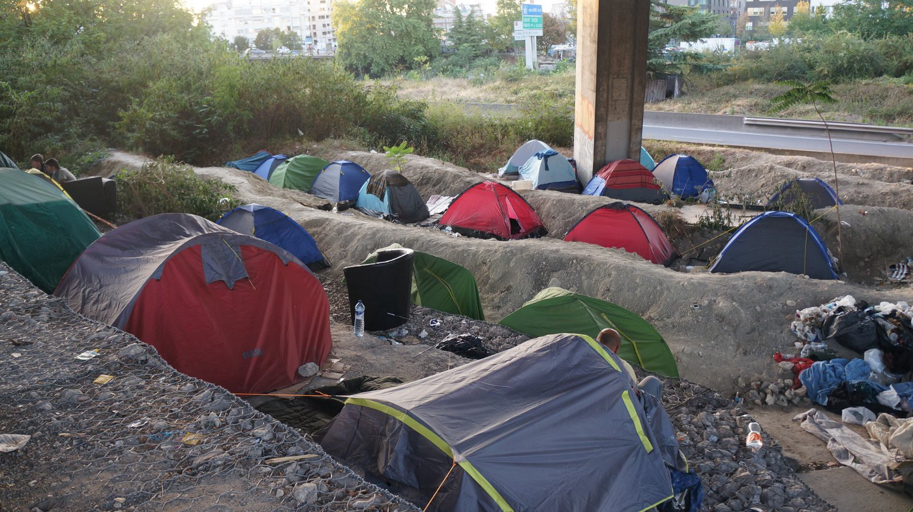
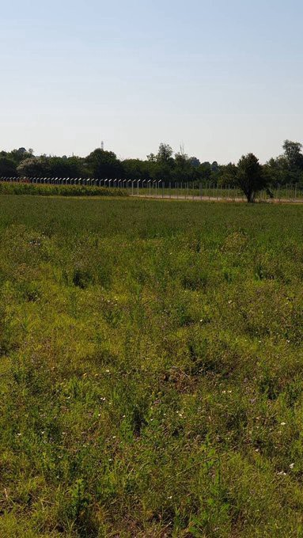

### AYS Daily Digest 10/8/20: Has the pandemic become an excuse for negligence?
### Abusing the pandemic ‘state of emergency’ / Abused and homeless, hundreds across the cities and villages of Bosnia and Herzegovina / This, year, the Atlantic route to Europe exceeds the Mediterranean corridor to Greece in mortality, at least 162 died since July 31 / \+ recommended reads, reports and more

[Are You Syrious?](@AreYouSyrious?source=post_page-----6a1a200029----------------------)

[Aug 11](ays-daily-digest-10-8-20-has-the-pandemic-become-the-excuse-for-negligence-6a1a200029?source=post_page-----6a1a200029----------------------) · 11 min read

### FEATURED

On Chios, at Vial camp, a 23\-year\-old woman in the last stage of pregnancy was tested positive for coronavirus, but — as reported — seems to have recovered from the disease\. All 20\+ people who were in close contact with the woman were quarantined and the woman has [reportedly](https://astraparis.gr/kroysma-koronoioy-se-egkyo-stin-vial-synagermos-stis-ygeionomikes-arches/?fbclid=IwAR3jU5JZ6cYBVOmrU-G8ONdR-gpjR4gAm58LLykU-ad7LXWA9EwZxXzIVl0) been transferred to another location\. In the days leading up to this news, confusing information about the alleged new rules about wearing masks in the camp were circulating, implying a lack of masks, but also fines for those who would not want to wear or have one on\.
Also, 17 of the 38 people who arrived on Lesvos a week ago have tested positive for coronavirus, the municipality of Mytilene announced on Monday\. They will remain in isolation for two weeks in a quarantine clinic set up at the Kara Tepe camp, after which time they will be tested again\. The media reported that all new arrivals will now be quarantined in a camp at Megala Therma in northern Lesvos\.

The lockdown in Greece continues for everyone in the confinement of the refugee camps, however they might be technically defined\. As in other places, the pandemic has been used as an excuse for a range of repressive decisions to remain in place\. For example, the Hellenic Coast Guard has been using it as an excuse to test and implement more dangerous and strict segregation strategies\. There are reports from Kos and Leros, islands we hear fewer reports about, that the people living within the periphery of the camps were forced to go inside official camp structures at the beginning of the pandemic\. As in other camps, enclosure was also enforced, and many people are afraid that a lot of these extraordinary measures will not be eliminated once the pandemic is over, Mare Liberum writes\.

At the same time, in other countries, the pandemic has been used most frequently to keep NGOs and volunteer groups from accessing the reception centres and supporting the people there, to keep people confined, to silently deport them \(although many countries said they would stop these practices due to safety issues during the pandemic\), but also in other ways\.
In France, at least [70 people demonstrated in Calais against the Town Hall](https://l.facebook.com/l.php?u=https%3A%2F%2Flavoixdunord.fr%2F849323%2Farticle%2F2020-08-08%2Fcalais-soixante-dix-manifestants-reclament-un-acces-l-eau-pour-les-migrants%3Ffbclid%3DIwAR1eNOPWoknRJdqeevftP7GrXZyuSsGJVrPJ1C3VP0tVqA9ltGovQ5up81g&h=AT1hH9TqRBZpHSTS5TOCFQdBiCd0lnvB2FQPnOz0ceBBBmcgphhcO4OtjYGrSV80_ENM9xTCtRVetOrZfp3yrSp9888HMO8xB6dKijUIlD-tjMh5c8UJ5HgHuOvrNh4Q-SehrQ-Ye_toyw) denying refugees access to clean water during the pandemic\.
### GREECE
### New arrivals on Kos

Two boats arrived on Kos on Sunday, carrying a total of 26 people\.

The first boat landed in Kardamaina, Kos southwest before first light carrying six adults\. The second boat landed in Therma, Kos southeast, in the afternoon carrying 20 people, five children, and 15 adults\.

These are the first registered arrivals on Kos in five months, the last arrivals on Kos being registered on March 16th\. There are currently **2221 people registered on Kos\.**

Five years ago Greece set up the provisional camp Ritsona\. Today it is clear to many refugees: they cannot get away from there\.
### [Lager für Geflüchtete in Griechenland: Vom Camp zum Wohnsitz](https://taz.de/Lager-fuer-Gefluechtete-in-Griechenland/!5701718/)
### [Vor fünf Jahren errichtete Griechenland das provisorische Lager Ritsona\. Heute ist für viele Geflüchtete klar: Von dort…](https://taz.de/Lager-fuer-Gefluechtete-in-Griechenland/!5701718/)
#### [taz\.de](https://taz.de/Lager-fuer-Gefluechtete-in-Griechenland/!5701718/)
### ROMANIA

In Romania, local analysts say the country’s Ministry of National Defence aims to boost the military’s intelligence, surveillance and reconnaissance capabilities by acquiring new drones, ensuring the country’s armed forces can efficiently monitor Romanian borders\.
### [Eastern European NATO allies ramp up drone buys to protect their borders](https://l.facebook.com/l.php?u=https%3A%2F%2Fwww.defensenews.com%2Fglobal%2Feurope%2F2020%2F08%2F06%2Feastern-european-nato-allies-ramp-up-drone-buys-to-protect-their-borders%2F%3Ffbclid%3DIwAR0y8V5MLYNpo8JqbXFF-53BdkzS0U-o0kv4M1GYpYrAr_1FK628S5SmbFE&h=AT3zjs4uTdrxEXD2NRkJ2POdFSgoTFd30u2348ojzYqY-lCMHkS_st-AgtuV-e_rkBzJoxmgQeuULJ_vQ4NxHaqII0NBCcUpQEOWN_UgCqVOJ4CploOZxRK6XBGXk3jimCHuRv95xcrmkg)
### [WARSAW, Poland — As Russia’s military activities in the Baltic and Black seas mount pressure on NATO’s eastern flank, a…](https://l.facebook.com/l.php?u=https%3A%2F%2Fwww.defensenews.com%2Fglobal%2Feurope%2F2020%2F08%2F06%2Feastern-european-nato-allies-ramp-up-drone-buys-to-protect-their-borders%2F%3Ffbclid%3DIwAR0y8V5MLYNpo8JqbXFF-53BdkzS0U-o0kv4M1GYpYrAr_1FK628S5SmbFE&h=AT3zjs4uTdrxEXD2NRkJ2POdFSgoTFd30u2348ojzYqY-lCMHkS_st-AgtuV-e_rkBzJoxmgQeuULJ_vQ4NxHaqII0NBCcUpQEOWN_UgCqVOJ4CploOZxRK6XBGXk3jimCHuRv95xcrmkg)
#### [l\.facebook\.com](https://l.facebook.com/l.php?u=https%3A%2F%2Fwww.defensenews.com%2Fglobal%2Feurope%2F2020%2F08%2F06%2Feastern-european-nato-allies-ramp-up-drone-buys-to-protect-their-borders%2F%3Ffbclid%3DIwAR0y8V5MLYNpo8JqbXFF-53BdkzS0U-o0kv4M1GYpYrAr_1FK628S5SmbFE&h=AT3zjs4uTdrxEXD2NRkJ2POdFSgoTFd30u2348ojzYqY-lCMHkS_st-AgtuV-e_rkBzJoxmgQeuULJ_vQ4NxHaqII0NBCcUpQEOWN_UgCqVOJ4CploOZxRK6XBGXk3jimCHuRv95xcrmkg)
### NORTHERN MACEDONIA

Until July 15 this year, 14,810 ‘irregular crossings’ were registered by the Ministry of Interior at the Greek\-Macedonian border\. A small number of those people was held at the Vinojug Transit Centre\. After the emergency was announced due to Covid\-19, the transit camp was named the Covid centre for migrants and refugees\. When a person enters the centre, they are locked in their own container and they can move outside it only accompanied by the police\. NGOs are prohibited from speaking to these people or establishing any kind of contact while they are isolated, meaning for a duration of 25 days\. If the test comes out negative, the asylum seeker is taken to the Asylum Seekers’ Centre where they have freedom of movement, but with special protocols due to the pandemic\. A large number of people attempt to enter the country with the help of smugglers\. Since the beginning of the year, there have been eight car accidents, but without fatal consequences\. Those people who are stopped by the police while trying to enter are simply returned to Greece, without any profiling, inspecting documents and identities, checking for vulnerable people, or possibility to offer any kind of protection\. The Tabanovce Transit Centre is empty and is not being used to shelter people on the move\. The Reception Centre now has better conditions, but still with no approved asylum claims, as reported by Legis, who is present in the facility\. Macedonia has extended its state of emergency at the border crossings, for five years now\. 
On June 1, the police arrested a smuggler who was transporting 113 people\. The judge sent the smuggler for coronavirus testing, coming out negative\. Until today, no refugee or migrant who was tested came out positive, Legis reports\.

### SERBIA

Vranje\. There was no electricity in the camp for two days\. The refugees did not even have hot water, and the situation was quite chaotic\. It was especially difficult for families with small children\.

In Subotica, a large number of people are staying in open locations, there are no places in the camp due to full capacities, and additional problems and the need for humanitarian aid are arising\.
### BOSNIA AND HERZEGOVINA

According to the local media, the country’s security minister spoke to the European Commissioner for Neighbourhood and Enlargement, Oliver Varhely\. Reportedly, the Commissioner expressed a readiness to include Bosnia and Herzegovina more actively in the wider migrational policies of the EU, those defining the border procedures, asylum policies and readmission procedures, including returns to the countries of origin\. According to the reports, he promised additional financial and technical help from the EU in order to “enhance the quality of the border control of the state border of Bosnia and Herzegovina, the control of movement across the entire country, in order to raise the safety of the citizens of Bosnia and Herzegovina”, official report stated\.

Nowhere in the text does it mention serious human rights abuses as one of the topics of the conversation, nor any potential problem\-solving suggestions or taking responsibility for what have been some of the worst months since the route shifted to BiH territory\. The abuses continue, by the Croatian border patrols, but also across Bosnia and Herzegovina, by the police and other authorities, including the informal representatives of the local government bodies\.
### Velika Kladuša

A local team in need of support in order to stay there is collecting funds\. If you can, consider supporting them through this crowdfunding campaign:
### [What They Told Me — SOS Team Kladuša organized by Beth Cohen](https://l.facebook.com/l.php?u=https%3A%2F%2Fwww.gofundme.com%2Ff%2Fsos-team-kladusa%3Futm_source%3Dcustomer%26utm_medium%3Dcopy_link%26utm_campaign%3Dp_cf%2520share-flow-1%26fbclid%3DIwAR0tM2GGi8MZjnB_CxcYwXe77KFLdpSMMF3mk_vz6oo1dgFfMVFHm11PgpE&h=AT39p7FNE9DRiNT4CUHRZHTabbePHaZ7Uon5JpcbbhtkP7dE8v_rsM4LoMJxEqluG29LqcpX8f1wzOcSn3EUXyerxsBGz9b47mwS8EOPtF54lbQGccLwYuFC3x3aWWusC8t4KPYs7dPDfQ)
### [I just learned that in Velika Kladuša, a tiny border town in Bosnia where I was welcomed two summers ago, more than…](https://l.facebook.com/l.php?u=https%3A%2F%2Fwww.gofundme.com%2Ff%2Fsos-team-kladusa%3Futm_source%3Dcustomer%26utm_medium%3Dcopy_link%26utm_campaign%3Dp_cf%2520share-flow-1%26fbclid%3DIwAR0tM2GGi8MZjnB_CxcYwXe77KFLdpSMMF3mk_vz6oo1dgFfMVFHm11PgpE&h=AT39p7FNE9DRiNT4CUHRZHTabbePHaZ7Uon5JpcbbhtkP7dE8v_rsM4LoMJxEqluG29LqcpX8f1wzOcSn3EUXyerxsBGz9b47mwS8EOPtF54lbQGccLwYuFC3x3aWWusC8t4KPYs7dPDfQ)
#### [l\.facebook\.com](https://l.facebook.com/l.php?u=https%3A%2F%2Fwww.gofundme.com%2Ff%2Fsos-team-kladusa%3Futm_source%3Dcustomer%26utm_medium%3Dcopy_link%26utm_campaign%3Dp_cf%2520share-flow-1%26fbclid%3DIwAR0tM2GGi8MZjnB_CxcYwXe77KFLdpSMMF3mk_vz6oo1dgFfMVFHm11PgpE&h=AT39p7FNE9DRiNT4CUHRZHTabbePHaZ7Uon5JpcbbhtkP7dE8v_rsM4LoMJxEqluG29LqcpX8f1wzOcSn3EUXyerxsBGz9b47mwS8EOPtF54lbQGccLwYuFC3x3aWWusC8t4KPYs7dPDfQ)
### From Italy to Bosnia and Herzegovina, asylum seekers are victims of systematic pushbacks

People on the move keep testifying that Italian, Slovenian and Croatian border forces and authorities act in a coordinated manner in a continuous practice of mostly violent, illegal pushbacks along the so\-called Balkan Route\. No Name Kitchen team published some of the recent examples:

> _A group of 58 people from Afghanistan were stopped in the Italian city of Trieste by the Italian police, around 11:00 in the morning on the 17th of July 2020\. Of this group, 24 managed to escape, whereas 34 were caught by the officers\. 17 of them are minors and other 17 are adults, aged 19–21\._ 

> _Approximately 15 Italian police officers stopped the group which was walking on the street, heading to a bus station\. According to the description given by the respondent, some of the officers were wearing blue uniforms and others were wearing beige and black uniforms\. The officers ordered the group to sit on the side of the street, in a “sunny area”\. The police forced the group of respondents to stay silent for more or less two hours, by ordering them “not to speak between each other”\. The officers also checked the contents of the people’s backpacks\._ 

> _After waiting for two hours, a pullman came and the group of boys and young men was loaded onto it\. Two of the 15 police officers were with them\. The bus drove for around 20 minutes and stopped at a place which the respondent describes as a sort of camp, with gates and fences, close to which or in which there was a police station\._ 

### FRANCE
### SPAIN
### The most dangerous route to Europe

So far this year, one person has died for every 20 who have landed on the islands, according to IOM’a [Missing Migrants Project](https://missingmigrants.iom.int/) \. 
The migration route to the Canary Islands is more active than in the last 12 years and the trickle of boat wrecks is intensifying, El Pais writes\.

> _As of July 31, 3,269 people had reached the archipelago, but at least 162 died in the attempt\. If the number of people arriving in port is compared with the number of people who die, the Atlantic route to Europe exceeds this year in mortality the Mediterranean corridor to Greece \(where one dies for every 115 migrants who manage to disembark\) and the crossing of the Strait and the Alboran Sea, where one person dies or disappears for every 94 who arrive ashore\. In these terms — not in absolute numbers — it also exceeds the dangerous route to Italy and Malta, where one migrant dies for every 54 who arrive safely\._ 

### GERMANY
### Federal states have to act now

> _The federal government should sit down at the table with the federal states and municipalities who are willing to accept and clarify how to help people quickly and unbureaucratically_ 

The states of Berlin and Thuringia are considering a collective action of several states against the federal government\. Since it was clear that a legal clarification would only be due in several years, a faster way would have to be found, said Berlin’s Senator for the Interior\.

> _We cannot simply shrug our shoulders and accept Horst Seehofer’s no to our willingness to help people in need\. Especially since he does not associate any further perspectives with it\. I support the proposal from North Rhine\-Westphalia to convene a federal\-state conference as soon as possible to discuss how to proceed with the refugee issue\. If we are serious about our European values ​​of freedom, solidarity and humanity, the people in the Greek camps must be helped as quickly as possible\. The Berlin Senate has always said that it has the organizational and personnel capacities to accept 300 people\. We still stand by that, — said Berlin’s Senator for the Interior, Andreas Geisel, on Monday\._ 

### DENMARK

Swedish, Norwegian, Icelandic and Danish PEN has today, in a rare joint appeal for the Angolan poet Adelina Kiame, who has her application for asylum in Denmark rejected, written a letter to Minister of Immigration and Integration Matthias Tesfaye\.

> _“We fear that Adelina Kiame will not be able to continue her writing if she is sent to Angola\. She is known and strongly critical of the Angolan authorities, and we fear that she will be forced to remain silent and hide, thereby losing a shining literary star and a very important voice that can pave the way for other young people from minority backgrounds who fight against discrimination, prejudice and the prohibition against being who they are\. Adelina Kiame’s poems not only touch on topics such as homosexuality, racism and discrimination against minorities, but she also writes critically about the Angolan political system, about violence and rape as a method of upbringing and about the traditional, religious and highly conservative view of women\. The poems are written in English, and although Portuguese is the most common language in Angola, English is becoming more and more common, and many will readily be able to read and understand the content of her poems\. The generally strongly conservative population’s view of homosexuality remains unchanged, although the ban on homosexuality in Angola was lifted in 2019\. Civil society, family, employers, neighbors, etc\. remain of the view that homosexuality is a sin for which those responsible should be punished\. Formally, the legislation after 2019 probably seems to meet international requirements, but the authorities in Angola in many cases do not comply with the law and there is a pattern of impunity for violence committed against LGBT people and activists\. According to Carlos Fernandes, head of the local LGBT NGO Associação Íris Angola, LGBT activists have been killed in recent years, and several new reports, including Amnesty International’s 2019 annual report, point to attacks and harassment against LGBT people… As a writer, Adelina Kiame will be particularly vulnerable, partly because video clips with her already exist on the Internet, which can also be seen in Angola, and partly because several of her poems are available online\.”_ 

According to [Amnesty International](https://amnesty.dk/nyhedsliste/2020/amnesty-aai%C3%BAn-skal-have-beskyttelse-i-danmark) \(Denmark\), in rejecting the asylum case, the Danish Refugee Board stated that it has used information provided by the Danish Immigration Service on the decriminalisation of homosexuality in 2019 and how punishment for hate crimes against homosexuals in Angola has been sharpened\. Because of this, the Board affirmed that the artist does not risk persecution or asylum\-based abuse as a result of her sexuality, [Freemuse reports](https://freemuse.org/news/freemuse-calls-on-the-danish-refugee-board-to-stop-the-deportation-of-angolan-artist-adelina-kiame/?fbclid=IwAR3FY9RMarWpvROwpLKRAmpUXKxgPRrfs-OSPiXrVCjwrV8ua15UohUJFHc) \.
### UK
### Britain First launched a sailing ship at the weekend to carry out “migrant patrols” in the Channel

> _Recent months have seen an increase in the number of people making the perilous journey from northern France to Britain in small boats\. On Friday about 130 refugees landed on the British coast\._ 

Secretary of State for the Home Department Patel is reportedly planning to send in Royal Navy ships despite concerns this could put people’s lives at risk\.
Now, the far right mob has taken the lead and sent in one of their own, a vessel to scare off the people trying to cross the Channel\. The ship, Alfred the Great, spent the day patrolling the waters around Dover searching for “illegal migrants\.”

[Here’s](https://www.syriahr.com/en/178985/?fbclid=IwAR05CnI_9Zz7tFN51lTUeoBB-BhOB3aeglTHWCa92dmxHK_9VI8RK6iu2vY) a comment on these developments\.

The British Prime Minister said that the Channel crossings are a “very bad and stupid and dangerous and criminal thing to do”\. He also said that “there’s no doubt that it would be helpful if we could work with our French friends to stop them getting over the Channel\.”

> _You’re perfectly within your rights to travel through safe countries and claim asylum in Britain\._ 

### FOR FURTHER READING

Age assessment and the protection of minor asylum seekers: time for a harmonised approach in the EU:
### [Age assessment and the protection of minor asylum seekers: time for a harmonised approach in the EU…](https://rli.blogs.sas.ac.uk/2020/08/10/age-assessment-and-the-protection-of-minor-asylum-seekers-time-for-a-harmonised-approach-in-the-eu/?fbclid=IwAR34GjitN_X22YVog4D0lyXNeOzA9pjbH-4jA3-MrOEOFcH-MpPuItlyK7Q)
### [Blog post by Evelien Brouwer \(Amsterdam Centre for Migration and Refugee Law, Vrije Universiteit Amsterdam\) and Romain…](https://rli.blogs.sas.ac.uk/2020/08/10/age-assessment-and-the-protection-of-minor-asylum-seekers-time-for-a-harmonised-approach-in-the-eu/?fbclid=IwAR34GjitN_X22YVog4D0lyXNeOzA9pjbH-4jA3-MrOEOFcH-MpPuItlyK7Q)
#### [rli\.blogs\.sas\.ac\.uk](https://rli.blogs.sas.ac.uk/2020/08/10/age-assessment-and-the-protection-of-minor-asylum-seekers-time-for-a-harmonised-approach-in-the-eu/?fbclid=IwAR34GjitN_X22YVog4D0lyXNeOzA9pjbH-4jA3-MrOEOFcH-MpPuItlyK7Q)
### [Children’s books share refugees’ experiences and offer hope for the future](https://l.facebook.com/l.php?u=https%3A%2F%2Ftheconversation.com%2Fchildrens-books-share-refugees-experiences-and-offer-hope-for-the-future-142864%3Ffbclid%3DIwAR2Cju2gh9FaeeKCAOvtcKx6coFbbLopki84qDg66DuJmXSQZKdyXe398-A&h=AT3ot22F6ZUTUh2DKukLsY7k_6qsHXyJBbq8ubI3egAt5dNePUOOD12LkBudTe7PKJBUK31p_nQguJN5rcQRlgQj_fGQWEWPtwHsSfRXHr_o_Bt38aYkAg1VrA5MkNBoBwYoD1BxpE6xoA)
### [Children’s summer reading may take on new meaning for parents this year\. In the spring, after coronavirus school…](https://l.facebook.com/l.php?u=https%3A%2F%2Ftheconversation.com%2Fchildrens-books-share-refugees-experiences-and-offer-hope-for-the-future-142864%3Ffbclid%3DIwAR2Cju2gh9FaeeKCAOvtcKx6coFbbLopki84qDg66DuJmXSQZKdyXe398-A&h=AT3ot22F6ZUTUh2DKukLsY7k_6qsHXyJBbq8ubI3egAt5dNePUOOD12LkBudTe7PKJBUK31p_nQguJN5rcQRlgQj_fGQWEWPtwHsSfRXHr_o_Bt38aYkAg1VrA5MkNBoBwYoD1BxpE6xoA)
#### [l\.facebook\.com](https://l.facebook.com/l.php?u=https%3A%2F%2Ftheconversation.com%2Fchildrens-books-share-refugees-experiences-and-offer-hope-for-the-future-142864%3Ffbclid%3DIwAR2Cju2gh9FaeeKCAOvtcKx6coFbbLopki84qDg66DuJmXSQZKdyXe398-A&h=AT3ot22F6ZUTUh2DKukLsY7k_6qsHXyJBbq8ubI3egAt5dNePUOOD12LkBudTe7PKJBUK31p_nQguJN5rcQRlgQj_fGQWEWPtwHsSfRXHr_o_Bt38aYkAg1VrA5MkNBoBwYoD1BxpE6xoA)

“Bit by bit, people in these towns get to know the new people and see them as people, not as people from a particular country\.” — The story of Pareja:
### [‘We need people here’: the Spanish towns welcoming migrants](https://www.theguardian.com/world/2020/aug/10/the-spanish-towns-welcoming-in-migrants?fbclid=IwAR0CqkZfTnw11Ioet2huhuZUbuYhGya5lHLCNqdCgYaaQYCoIaIgqtTXC4Q)
### [On the wall of a small flat in Pareja, not far from the chemist, the plaza mayor and the 16th\-century church, hangs a…](https://www.theguardian.com/world/2020/aug/10/the-spanish-towns-welcoming-in-migrants?fbclid=IwAR0CqkZfTnw11Ioet2huhuZUbuYhGya5lHLCNqdCgYaaQYCoIaIgqtTXC4Q)
#### [www\.theguardian\.com](https://www.theguardian.com/world/2020/aug/10/the-spanish-towns-welcoming-in-migrants?fbclid=IwAR0CqkZfTnw11Ioet2huhuZUbuYhGya5lHLCNqdCgYaaQYCoIaIgqtTXC4Q)

**Find daily updates and special reports on our [Medium page](https://medium.com/are-you-syrious) \.**

**If you wish to contribute, either by writing a report or a story, or by joining the info gathering team, please let us know\.**

**We strive to echo correct news from the ground through collaboration and fairness\. Every effort has been made to credit organisations and individuals with regard to the supply of information, video, and photo material \(in cases where the source wanted to be accredited\) \. Please notify us regarding corrections\.**

**If there’s anything you want to share or comment, contact us through Facebook, Twitter or write to: areyousyrious@gmail\.com**
### Sign up for AYS Daily Newsletter
### By Are You Syrious?

Daily news digests from the field, for volunteers, people on the move, journalists, and the general public [Take a look](/are-you-syrious/newsletters/ays-daily-newsletter?source=newsletter_v3_promo--------------------------newsletter_v3_promo-)

_Converted [Medium Post](https://medium.com/are-you-syrious/ays-daily-digest-10-8-20-has-the-pandemic-become-an-excuse-for-negligence-7d6d96b022c0) by [ZMediumToMarkdown](https://github.com/ZhgChgLi/ZMediumToMarkdown)._
