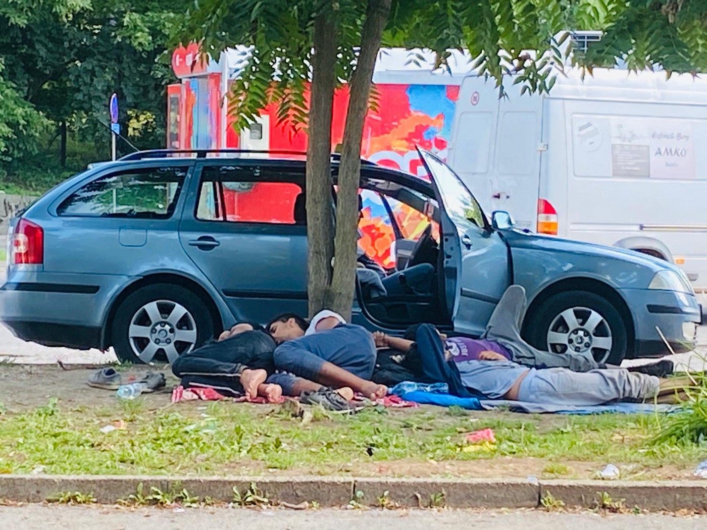

### AYS Daily Digest 11/8/2020 \-“A maritime version of The Hunger Games”

Racist attacks on the rise in Italy / Violent pushbacks from Romania to Serbia / Shots fired by HCG off the coast of Rhodes, Greece / Offshore detention plans to continue in Malta / Situation in Tuzla, Bosnia, is deteriorating and much more…

Tuzla, August 2020 \(Photo taken by a long\-term volunteer\)

**Featured — Asylum journeys to the UK: “ [A Maritime version of The Hunger Games](https://twitter.com/Ian_Fraser/status/1293174786458255366?fbclid=IwAR0iMYh6zK2z-RCliclC_LQvgJRCOK5u6YsNgsyjDzAg5iYfh78iWGcva8E) ”**

As debate continues to rage in the UK about the channel crossings, journalists are being [accused of voyeurism](https://twitter.com/Ian_Fraser/status/1293174786458255366?fbclid=IwAR0iMYh6zK2z-RCliclC_LQvgJRCOK5u6YsNgsyjDzAg5iYfh78iWGcva8E) as they scream interview questions at people in boats and comment as those travelling [try to bail out their boats](https://twitter.com/astroehlein/status/1293150239419969536?fbclid=IwAR0EJ0kwYO6_FRijlhwpohUCmo3WvAZ98cY46VnqJdXn3d-ZttZQid0Ot2M) \. Of course, [what is happening must be documented](https://twitter.com/lizziedearden/status/1293138679196680193) and people on the move must be allowed to have their say, but this is clearly not the way to do it\.

The UK generally has an island mentality and has for years safely watched from afar as hundreds of thousands of people struggle for their lives in far off seas, often dying in their search of freedom\. Now that 4,000 people have reached British shores, the reaction of the Government and many media outlets is sensationalist, harmful and often outright inaccurate\. The very term [‘illegal migrant’ has no basis in law](https://www.kentlive.news/news/kent-news/illegal-dangerous-britain-first-vigilante-4412366) , it is only when someone’s claim is examined that their right to stay under the Refugee Convention can be assessed\.

> Many of those attempting to cross the Channel are fleeing persecution, generalised violence, conflict or other forms of protracted crises in their home countries\. 

> These individuals are rights\-holders\. They are women, men and children who have the right to have their asylum claims assessed with due process, in line with the UN Refugee Convention \(1951 Geneva Convention\) \. — [_Refugee Rights Europe_](https://refugee-rights.eu/2020/08/11/the-uk-channel-crossings-whats-happening/) 

The Government’s policy in this area is entirely reactionary and incohesive\. While stating that they wish to reduce numbers, they are actively creating an environment in which such journeys are in fact more likely:

> The government is set to stop family reunion under the Dublin Regulation — currently the only safe transfer route for refugees on the continent — after the Brexit transition period\. According to Safe Passage International, who help unaccompanied child refugees access Dublin family reunion, the closure of this route will force more children into lorries and dinghies\. — [_Safe Passage International_](https://www.safepassage.org.uk/news/2020/8/11/more-children-will-cross-the-channel-if-government-scraps-family-reunion?fbclid=IwAR3RwivSpuDeM49n6sbVjmpDGFYh__21mESkkHMEXdwWHz6wtyM_a4rQ3Nw) 

The unfortunate truth is that the UK has a long history of persecuting people trying to seek safety within its territory, [including Jewish refugees in the 2nd World War](https://www.theguardian.com/uk/2002/jun/08/immigration.immigrationandpublicservices) fleeing the holocaust, and more recently has even deported on mass its own citizens during the [Windrush Scandal](https://www.jcwi.org.uk/windrush-scandal-explained) \. It must not be assumed that the UK’s policies will be legal under international law or that they will try to uphold human rights\.

Help Refugees are [campaigning against the recent news coverage](https://helprefugees.org/news/this-is-not-journalism/) \.

> Please join us in writing to the BBC and Sky News to demand that this dangerous and dehumanising coverage stops immediately\. 

But more must be done to turn the tide against the increasingly right wing propaganda being aired at the highest levels\.

Dear UK, it’s time to act\.

SEA
#### Central Med

Alarm Phone was [contacted](https://twitter.com/alarm_phone/status/1292902069612032006) on the 10th of August by 25 people in a dinghy in severe distress in international waters\. They were drifting, with no working engine and were afraid for their lives due to the swell of the waves\. As per current practice, none of the authorities informed by Alarm Phone responded to their distress call\. The [last contact](https://twitter.com/alarm_phone/status/1293105655482589185) with the boat was on Monday night\. We’ll try and update on the situation when more information becomes available\.

GREECE
#### Arrivals

Last night 45 people in distress off Lesvos [called](https://twitter.com/alarm_phone/status/1293339825660211201) Alarm Phone\. Luckily, around 06:00 in the morning, they were [picked up by](https://twitter.com/alarm_phone/status/1293453950180614144) the Greek Coast Guard & arrived safely on Lesvos\. As reported below, it is believed that one more boat arrived on the coast of Rhodes carrying 17 people\.

](assets/cdee12666f2d/1*dlDYu8zlzL22657IaZCUiA.jpeg)

[Aegean Boat Report](https://aegeanboatreport.com/)
#### Shots fired by Hellenic Coast Guard

ABR and Greek media reported a number of shots fired by a HCG vessel to prevent a boat from entering Greek waters\. [ABR commented](https://web.facebook.com/AegeanBoatReport/posts/894550024401436) :

> \[Hellenic\] coast guard claims to have fired warning shots against a boat that they say was trying to transport people from Turkey to Greece 03\.30 \[on Monday night off the coast of\] Rhodes\. 

> The Hellenic coast guard said it’s officers “fired warning shots at a safe section of the boat\.” The vessel then slowed down and returned to Turkey\. 

> Turkish coast guard has also reported on the incident, claiming that the three men in the boat, two Turkish and one Syrian National were injured, one of the Turkish nationals severely, all three taken to hospital in Marmaris\. The boat used was so damaged that it sank while it was towed by TCG\. If the statement from TCG is true, it seems that HCG perhaps fired more than just warning shots\. 

> Hellenic coast guard seems to have some “confusion” in their official statement regarding the shooting\. The boat that was shot at wasn’t trying to reach Rhodes, it was trying to return to Turkey\. 

> The three people in the boat were smugglers, who minutes before had left 17 people on the shore of Fanes\. Locals in the area reported they heard something that sounded like a gunfight coming from the sea, local authorities haven’t had any further comments\. 

#### How to use and protect you cash card

Refugee\.Info published a video explaining how to use the Cash Card, the monetary support for asylum seekers provided by the ESTIA program\. Look at it [HERE](https://web.facebook.com/refugee.info/posts/3239927896067335) \.

MALTA
#### Plans for offshore quarantine to go ahead

Despite widespread criticism, Maltese authorities intend to go ahead with their plans to normalise offshore quarantine for people on the move\. This comes at a time when 27 people are still being held on a commercial vessel one week after having being rescued, Maltese media [report](https://timesofmalta.com/articles/view/offshore-migrant-detention-could-cost-tens-of-thousands.811098) \.

27 companies bid their offers to provide an “accommodation vessel” to house Coronavirus\-positive people on arrival on the island\. Bids range between €12,400 to €150,000 per day\. Captain Morgan, the company already involved in the pushback\-by\-proxy organised by Maltese authorities and Libyan coast guard is among the bidders\.

ITALY
#### Racist attacks on migrants and institutional violence

The rise in arrivals in Lampedusa in the last few weeks have prompted aggressive reactions from several notorious far\-right commenters, who published a series of fake news stories depicting people on the move as barbarians, stealing and eating farm animals and dogs\. Despite having been immediately [debunked](https://www.avvenire.it/attualita/pagine/bufala-i-migranti-non-hanno-mangiato-i-cani-lampedusa) , they keep spreading online and such discourses have reignited racist violence in a country where racism has constantly been an under\-reported but endemic issue\. In recent days, Intersos volunteers collected reports from people [attacked](https://www.avvenire.it/attualita/pagine/nuove-aggressioni-a-foggia-adesso-abbiamo-paura) in Foggia on six different occasions\.

> [When a migrant passes by on his bike, they call him from their car\. Thinking it may be a job offer he comes close\. Instead he receives a punch, water or, in one case, pepper spray on his face\.](https://twitter.com/unoscribacchino/status/1292926397183401991) 

Similar attacks have been [reported](https://www.globalist.it/news/2020/08/11/impara-a-rispettare-gli-italiani-un-giovane-immigrato-massacrato-di-botte-a-marsala-2062998.html) in Marsala, Sicily, where in the span of a few hours, several people of colour have been seen with signs of beating\. On one occasion, a group of Italian citizens beat up a young man, telling him to ‘respect Italian people\.’ The man had to go to hospital for his injuries\.

Violence and abuse are widespread within the CPRs of the country\. No Frontiere’s Friuli Venezia Giulia reports on the case in a CPR in Gradisca d’Isonzo, where — among others — H\. was detained, a young man who in the last months had witnessed torture and illegal activities [operated](https://www.bbc.com/news/world-europe-53510221) by the Carabinieri in Piacenza\.

After having reported abuses and coercion, H\. had started a [hunger strike](https://nofrontierefvg.noblogs.org/post/2020/08/10/situazione-insostenibile-chiudere-subito-il-lager/) and managed to hold a protest on the roof of the CPR\. Yesterday, he and 14 other people were [transferred](https://nofrontierefvg.noblogs.org/post/2020/08/11/trasferimento-ora/) from the CPR, maybe to Rome’s CPR \(Ponte Galeria\) \. Some have reported that, on arrival, their phones were taken away\.
#### Lampedusa — Van of the company managing the hotspot set on fire

ANSA, Italian news agency, [reported](https://www.ansa.it/sicilia/notizie/2020/08/11/migranti-a-fuoco-furgone-societa-gestione-hotspot-lampedusa_ee964b96-e822-4164-8096-1194251ca839.html) that on Monday night, the van of the Nova Facility, the company that manages the hotspot on the island, was set on fire\. It is still unknown who carried out the attack\.
#### Sicily — Covid\-19 outbreak in hotspot due to inadequate quarantine

Major of Pozzallo, Sicily, stated that he will send the army to check the hotspot in the town after 64 people tested positive to COVID\-19 in a single day\. The centre was hosting 9 people positive to COVID\-19, already and it is believed that inadequate isolation measures caused the spike in cases, ANSA [reports](https://www.ansa.it/sicilia/notizie/2020/08/11/coronavirus-64-migranti-positivi-nellhotspot-di-pozzallo_1cd6b34e-c84c-4733-a25e-21401e762ede.html) \.

BiH

**Situation in Tuzla is deteriorating**

The constant arrival of people on the move to Tuzla and the surrounding area has been ongoing since May 2018\. Apart from stating the obvious, the federal, cantonal and local authorities have done nothing, or close to nothing, to provide an adequate answer to the situation\. Tuzla is the first transit city in Bosnia and Herzegovina, on the way to Sarajevo and Bihać\.

At the beginning of March, the police officers evicted about 500 people from the provisional tent camp at the bus station, taking them to Blažuj camp near Sarajevo\. When the pandemic started, the number of arrivals dropped slightly\. However, with an improvement in the epidemiological situation, more people started crossing the river Drina and entering the territory of Bosnia and Herzegovina\.

Regarding the provision of aid and direct support to the people on the move in Tuzla, it remains the same — a handful of NGOs and small volunteer groups, whose resources and strength have long since been spent, are the only ones still working since the first groups started arriving\. With winter approaching in a couple of months, the locals foresee a very difficult time for everyone who will be passing through these areas\.

Since March this year, the field office for foreigners in Tuzla no longer registers newly arrived people\. This alone makes it hard or impossible for groups to help people on the move\. According to the instructions of the Service for Foreigners’ Affairs, all people on the move wishing to register as asylum seekers are forwarded to their office in Sarajevo\. The police don’t allow them to stay around the station, and often it happens that the people on the move are taken in a police van to Olovo \(half way to Sarajevo\) \. People are very often made to walk to Sarajevo as they cannot afford any other means of transportation and they are not allowed to stay in one place\. So, in the strongest rain or sun, you can encounter many people on their way from Tuzla to Sarajevo, walking along the road\.

Another common sight is checking NGO and other groups’ members for documents, often while they are providing assistance at the station\. All this is interpreted as a pressure on those doing their work, but also a growing pressure on the people who should have the right to freedom of movement\.
In two and a half years, there has been no political or any other will to open a much needed transit centre in Tuzla, which is — according to the opinion of most of those working directly with the people — the only viable solution\.
Access to the asylum system, medical protection, information etc\. are just some of the problematic issues at hand for those arriving in Bosnia and Herzegovina\. Unfortunately, the list of problems doesn’t end there and is a very elaborate one, pointing to the neglect and disrespect of the existing laws and legal obligations in international documents Bosnia and Herzegovina had signed\.

Very often, citizens willing to provide housing or help to the people on the move approach them in Tuzla, but the language of hate and a lot of misinformation is spread daily, sometimes also in institutions\. A lack of information and the treatment they have been receiving from the police and the Ministry in charge have largely affected the number of people who have been provided assistance\.

There is a certain number of people who have received “yellow cards” — the asylum seekers document\. The biggest problem for these people now is the lack of accommodation and any means of integration into the society\. This work is being done by one single organisation and a group of volunteers\. Consistent and proper support is needed, as well as support in terms of donations, in order to help the people of Tuzla to find any kind of solution\.
Currently, the only assistance provided in Tuzla is the Daily centre, where people can take a shower and have a meal \(one per day\) \. There is also the Safe house, where currently 18 people are staying, generally the most vulnerable individuals; there is also field assistance provided by local groups and volunteers\.

The daily number of people arriving to Tuzla is somewhere between 50 and 100\. Many stay in Tuzla, due to a lack of financial means to sustain themselves in areas with no food or other support, but they are forced to sleep in the streets\.

Given the growing number of people arriving, the poor resources of the NGOs and volunteer groups and the lack of a systemic approach by the authorities or any international stake holders, the situation in Tuzla will continue to deteriorate unless something is done quickly\.
#### Police abuse and violence in Lipa camp

Local volunteers published a [video](https://web.facebook.com/groups/144469886266984/?post_id=613654896015145) from inside Lipa camp, where police and security have been abusing several migrants\. One group reacted, confronting the police\.

SERBIAN / ROMANIAN BORDER
#### Violent pushback from Romania

[Azil u Srbiji Asylum Protection in Serbia](https://twitter.com/APC_CZA) reports of violent pushbacks from Romania to Serbia\. On the 8th of August, Romanian police forcibly returned 5 people to Serbia, near Maidan\. They presented signs of beating on their backs and arms\.

GERMANY
#### Risk deportation flight to Pakistan, 18 August 2020

■■■■■■■■■■■■■■ 
> **[Bayerischer Flüchtlingsrat](https://twitter.com/BFR_089) @ Twitter Says:** 

> > !Attention! We have some informations of a mass deportation to Pakistan, probably on Tuesday, 18 August 2020. We advise all people from Pakistan who are required to leave the country to seek advice from lawyers or advice offices. https://t.co/iVBU1eXRYW 

> **Tweeted at [2020-08-10 12:59:34](https://twitter.com/bfr_089/status/1292807805993451521).** 

■■■■■■■■■■■■■■ 

[HERE](https://w2eu.info/en/countries/germany/deportation-pakistan) you can find more information on deportations from Germany to Pakistan\.
#### Rage against deportations — Demo in Munchen, Thursday 13

](assets/cdee12666f2d/1*Egx-XRv7jFh7GbO4br0ksQ.jpeg)

[**Flüchtlingsrat Bay**](https://twitter.com/BFR_089)

BELGIUM
#### What to do in the event of being arrested

In a time when Channel crossings are again under the media spotlight, Belgian activists from Getting the Voice Out published a flyer in many languages with information on what to do if you are arrested, taken to a detention centre or taken to a prison in the country\.

While in the last few weeks, French authorities have been very busy clearing the camps around Calais and Dunkirk, Belgian police have not carried out any major operation\. There are, however, “many accounts of serious mistreatment of undocumented migrants in car parks and in parks in Brussels by the police or private “security” agencies”\.

Please find all the necessary information in your language [HERE](https://www.gettingthevoiceout.org/what-to-do-in-the-event-of-being-arrested-in-belgium-11-08-2020/?fbclid=IwAR2pmt1cLFEdedFIXbfF9_NUF4qnYuUlOWHyOSFh0pA6cY9QNp_Xf4ll-B4) \.

FURTHER READING
- The European Policy Institute of the Open Society published a report titled ‘ [Are agri\-food workers only exploited in Southern Europe?](https://www.opensocietyfoundations.org/publications/are-agri-food-workers-only-exploited-in-southern-europe) ’ in which they analyse conditions of EU and non\-EU migrant workers in The Netherlands, Germany and Sweden\.
- [The struggle for the accountability of EU member states and EU institutions for the support given to both the Libyan coast guard and the migrant detention system in the country](https://www.thenewhumanitarian.org/analysis/2020/08/10/Libya-migrant-abuses-EU-legal-battle) carries on thanks to the work of Eric Reidy on The New Humanitarian
- L’internationale translated a [long interview with Spanish activist Helena Maleno](https://www.internationaleonline.org/opinions/1041_the_new_normal_must_be_built_with_migrant_knowledge_a_conversation_with_helena_maleno) , in which she stresses the importance of including migrant knowledge in the ‘return to the new normal’\.

**Find daily updates and special reports on our [Medium page](https://medium.com/are-you-syrious) \.**

**If you wish to contribute, either by writing a report or a story, or by joining the info gathering team, please let us know\.**

**We strive to echo correct news from the ground through collaboration and fairness\. Every effort has been made to credit organisations and individuals with regard to the supply of information, video, and photo material \(in cases where the source wanted to be accredited\) \. Please notify us regarding corrections\.**

_Converted [Medium Post](https://medium.com/are-you-syrious/ays-daily-digest-11-8-2020-a-maritime-version-of-the-hunger-games-cdee12666f2d) by [ZMediumToMarkdown](https://github.com/ZhgChgLi/ZMediumToMarkdown)._
