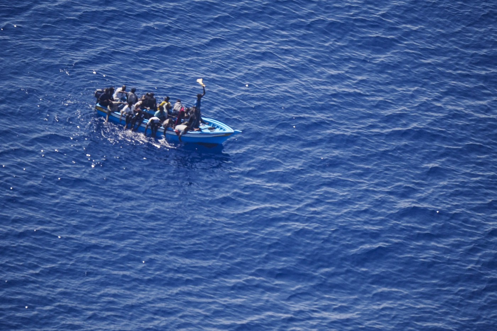
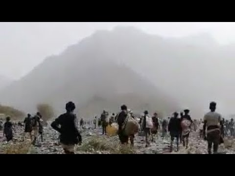
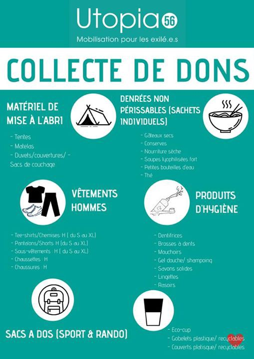

### AYS Daily Digest 13/08/2020: Malta’s authorities once again deliberately refuse rescue
#### Horrendous conditions for arbitrarily detained people in Saudi Arabia // COVID\-19 reaches Vial Camp on Chios // Mare Liberum has a new ship to monitor the South Aegean Sea // Donations needed in Bulgaria and France

Copyright: Sea Watch International
### FEATURE: Sea\-Watch’s airplane Moonbird observed AFM following a boat in distress for almost two days without rescuing its passengers

On Tuesday afternoon, the airplane first spotted a boat whose engine had stopped running\. The approximately 25 people on board, who were not wearing life vests, waved for help and tried to paddle with their hands\. Sea Watch immediately alerted the responsible authorities\. The next morning, the Moonbird spotted a ship of the Armed Forces Malta \(AFM\) about 12 nautical miles away from the boat in distress; shortly later, it observed an AFM speedboat moving towards the boat in distress\. Half an hour later, the boat in distress was very near to the merchant vessel Pemba\. The crew of the vessel confirmed to Sea Watch that the Rescue Coordination Center Malta has ordered them to stay nearby\. Some of the people on the boat in distress were now wearing life vests\. The merchant vessel departed shortly after\. Another half an hour later, the AFM speedboat reached the boat in distress, circled it, and returned to the AFM mothership\. In the evening, Moonbird spotted the boat in distress again\. All people on board were now wearing life vests and the engine was running again\. The AFM ship followed the boat in a distance of about 10 nautical miles\. In the evening, the AFM speedboat reached the boat again\. It got very close, and somebody aboard seemed to fiddle with the engine\. After a while, the engine was running again and the boat was heading for Lampedusa\. Again, the AFM ship was following the boat at some distance\. At some point during the evening, the people on board were rescued by a ship of the Italian Coast Guard\. At 2 am, they reached Lampedusa\. The Maltese authorities had been alerted about the ship some 33 hours before\. Instead of rescuing the people aboard, they seem to have been in nearby waters, fixing the engine and directing the boat towards the Italian SAR\-Zone\.

See the full thread from Sea Watch here:

■■■■■■■■■■■■■■ 
> **[Sea-Watch International](https://twitter.com/seawatch_intl) @ Twitter Says:** 

> > European states refuse to rescue people in distress at sea.
A documentation of Malta's inhumane practice using the example of one case our search plane #Moonbird observed in the last two days: https://t.co/MIvZfXKnPH 

> **Tweeted at [2020-08-13 14:29:34](https://twitter.com/seawatch_intl/status/1293917615883083777).** 

■■■■■■■■■■■■■■ 

For more information, see:

At the beginning of August, Malta’s Prime Minister Robert Abela said that Malta’s authorities would not rescue any boat of migrants unless it is a situation of “life and death”\.

Meanwhile, the merchant vessel Etienne is still not allowed to take to shore the rescued people on board\. The ship rescued 27 people on 5 August and has since been stranded outside territorial waters\. As happened to the MV Talia last month, Malta’s search and rescue coordination centre ordered the merchant vessel Etienne to provide assistance to the people in distress but is now reluctant to let the people disembark and the crew continue their journey\.

As always, Malta is calling for a European solution\. As always, nobody in Europe is interested in answering the call\.
### SAUDI ARABIA

In Saudi Arabia, Ethiopian migrants are held under horrendous conditions\. HRW reported that hundreds, if not thousands, of people are arbitrarily detained in the Jizan region close to Yemen\. The rooms they are held in are completely overcrowded: people are sitting skin\-on\-skin\. A prison for women was flooded with water up to the women’s ankles\. There is little food and water and no functioning sanitary infrastructure\. In April, Houthi forces forcibly chased thousands of Ethiopians out of the northern Yemeni territory under their control\. At the Saudi border, Saudi authorities opened fire at them and killed scores of them, before allowing the rest to enter the country and arbitrarily detaining them\.

■■■■■■■■■■■■■■ 
> **[Nadia Hardman](https://twitter.com/Nadia_Hardman) @ Twitter Says:** 

> > 🚨 #SaudiArabia is arbitrarily detaining 100s if not 1000s of #Ethiopia #migrants in appalling, overcrowded conditions with ltd access to food and water. @[hrw](https://twitter.com/hrw) has identified 2 of the detention sites in al-Dayer and Jizan. Watch our video: [m.youtube.com/watch?feature=…](https://m.youtube.com/watch?feature=youtu.be&v=8tO1R-hHCCc) https://t.co/QsumPAtmL3 

> **Tweeted at [2020-08-13 08:37:51](https://twitter.com/nadia_hardman/status/1293829103318175746).** 

■■■■■■■■■■■■■■ 

For more information, see:

Trigger warning: The video contains graphic and disturbing images\!
### LEBANON

At least 34 of the about 200 people who died after the destructive explosion in Beirut on 4 August 2020 were refugees, the UNHCR reports\. Seven more refugees are still missing\. It is feared that the death toll will continue to rise\. Lebanon hosts about 1\.5 million Syrian refugees, in addition to Palestinians and Iraqis\. UNHCR is mobilizing US$12 million for its emergency response to the hardest\-hit and most vulnerable households in Beirut\.

For more information, see:

### GREECE
#### Vial camp in Chios Island has reported its first COVID\-19 case

This is the first case of infection reported from the overcrowded island camps\. Until August 25 the camp will be under full lock down, the Greek Ministry of Migration and Asylum announced\. According to newspapers, a 35\-year old man from Yemen has been quarantined at a hospital and 30 other people are being tested for the virus\. 3,800 people are currently living in Vial camp, which was built for about 1,000 people\. Social distancing is impossible, and running water for basic hygiene is not available at all times\. It has been foreseeable that the virus would reach the camp for almost half a year now\. Instead of taking concrete measures to protect the people, the camps were simply left under lockdown even while tourists were visiting the islands again\. In case there will be a mayor outbreak in the camp, this is a direct result of european failure\.

The Greek organization METAdrasi, which focusses especially on the protection of unaccompanied and separated children and the protection of vulnerable groups, has signed a Cooperation Agreement with the Portuguese authorities in order to assist Portugal with the relocation of 500 unaccompanied children\. Portugal is the European country that is showing the best efforts to end the unbearable conditions of children living in the overcrowded camps on the islands\. METAdrasi will support the Portuguese authorities with the provision of knowledge, tools and best practices\.

The monitoring NGO Mare Liberum has a new ship named SEBASTIAN K which it hopes to station in the southern Aegean Sea in order to monitor push backs of people who try to cross from Turkey to Greece\. The first ship Mare Liberum will continue its missions around Lesvos\. The NGO Mare Liberum has been monitoring push backs and human right abuses in the Aegean Sea since 2017\. On Wednesday, Mare Liberum announced that it will set sail soon, explaining that the changes in the Ordinance for the Safety of Seagoing Ships \(Schiffssicherheitsverordnung, SchSV\), which clearly aim to prevent rescue and monitoring NGOs from setting sails, are invalid\. In March, amid the unfolding of the Covid\-19 pandemic, the German Minister of Transport Andreas Scheuer made a change in the law applicable for small German NGO ships that demands a security standard that is very hard to obtain\.

Here you can find a thread that explains the background on this change in detail \(German only\):

■■■■■■■■■■■■■■ 
> **[MISSION LIFELINE](https://twitter.com/SEENOTRETTUNG) @ Twitter Says:** 

> > Die gemeinnützigen Vereine Mare Liberum und @[resqship](https://twitter.com/resqship) sind neben [mission-lifeline.de](http://www.mission-lifeline.de) die drei Seenotrettungs-NGOs, die von der neuen Schiffssicherheitsverordnung #SchSV am schlimmsten betroffen sind. Christof Brüning von @[teammareliberum](https://twitter.com/teammareliberum) erklärt Hintergründe und Konsequenzen: https://t.co/GuqjG8X0DT 

> **Tweeted at [2020-07-05 15:35:23](https://twitter.com/seenotrettung/status/1279801053932859395).** 

■■■■■■■■■■■■■■ 

In Tuesday’s digest we reported about an incident in which the Hellenic Coast Guard shot at a boat\. It is still not completely clear what exactly happened\. The Hellenic Coast Guard claims to have fired warning shots at a boat that tried to transport people from Turkey to Greece\. According to them, the boat then slowed down and returned to Turkey\. The Turkish coast guards in turn claim that three men were shot at while being on the way back to Turkey, leaving one of them seriously injured\. According to them, the boat was so damaged that it sunk while being pulled back to Turkey\. 
The Turkish Coast Guard’s version of the story starts to seem more likely when we consider that locals from Rhodos reported that about 30 people were brought ashore before the boat turned back to Turkey with only three people who appeared to be traffickers still on board\. Shooting was heard by locals for about one hour\. Apparently after disembarking, the people from the boat were attacked by local fascists\. As of now, the Greek authorities has not yet mentioned the new arrivals\.

For more information in Greek, see:

### BULGARIA

The council of refugee women in Bulgaria is calling for help for a group of 36 unaccompanied minors\. It is unclear for how long the group has been wandering around in the forest near the border\. According to the NGO, they are severely lacking resources\. They need especially all kinds of clothes and monetary donations\. 
For more information and ways to help, please go to the Facebook page of Council of Refugee Women in Bulgaria\.
### NORTH MACEDONIA

On Wednesday 148 people who tried to cross North Macedonia hiding in two different trucks were discovered in the centre and the north of the country\. One truck carried 103 persons, amongst them 29 children, the other one 45\. Two North Macedonians suspected of smuggling have been detained\.
### BiH

The Minister of Security of BiH, Selmo Cikotić, visited Bihać and Velike Kladuše in the Una\-Sana Canton and talked to local officials\. The two cities are main transit points on the closed Balkan corridor for people who want to travel to Central Europe\. Cikotić explained that he wants to increase funds in order to prevent illegal entries from the eastern borders into BiH and foster cooperation between the police units\.

> “We have a promise from the EU that it will support the equipping and training of BiH institutions in charge of border control, so we expect help from that side\. However, I believe that we ourselves still have a lot of capacity that we can use,” Cikotić said\. \(GT\) 

As we have seen on a very regular base, increased border control will not stop people from trying to move, but instead will lead them to take more and more dangerous routes\.
### TUNISIA

According to the Tunisian Foreign Ministry, a boat carrying 18 people was intercepted by the Tunisian Coast Guard off the coast of Djerba over Tuesday night\.
### SEA

The Sea Watch 4 will soon be ready to set sails in order to save lives in the central Mediterranean Sea\. A sun cover has been installed in order to protect future guests from sun and sea\.

■■■■■■■■■■■■■■ 
> **[Sea-Watch](https://twitter.com/seawatchcrew) @ Twitter Says:** 

> > Auf unserem Achterdeck wurde eine Plane installiert, um zukünftige Gäste vor Sonne &amp; Wetter zu schützen. Bald wird unsere neue #SeaWatch4 bereit sein, in See zu stechen, um wieder einmal dem staatlich verordneten Massensterben an der tödlichen Südgrenze der #EU entgegenzutreten. https://t.co/M7CEzBqBNd 

> **Tweeted at [2020-08-13 12:18:05](https://twitter.com/seawatchcrew/status/1293884527480274944).** 

■■■■■■■■■■■■■■ 

The new ship has been made possible through a crowdfunding campaign that is supported by a network of German civil society initiatives called United4Rescue\. The Protestant church in Germany \(EKD\) is one of the members\. MSF will join the mission in order to provide medical services\.
### ITALY

Some 24 people aboard a quarantine ship that is harboured in Trapani, Sicily, have tested positive for COVID\-19\. Most of the 603 people on board are from Tunisia\. They arrived at Lampedusa and were taken on board the ship in order to undergo quarantine\.
### SPAIN

According to a Spanish newspaper article, a conflict arouse between the Ministry of Inclusion, Social Security and Migration and municipalities like Murcia, Andalusia and the Canary Islands, leading to newly arrived migrants not being taken care of\. A new document that is in effect since the end of July orders municipalities to carry out PCR tests on all people who disembark and provide spaces to quarantine COVID\-19 positive people\. However, some municipalities only carry out rapid tests on a regular basis and only do PCR tests on people with a positive result from the rapid test\. But since the Ministry of Migration does not allow people to access the official accommodation without a negative PCR test, many people end up with no place to go\. More than a hundred people have been affected so far\.

For more information, see:

### FRANCE

Care4Calais reports about the everyday struggle with the police’s cruel behaviour against a group of people from Darfur\. The police come almost on a daily basis to force them out of wherever they try to hide\. The group is sleeping behind a hedge, without tents and only with some blankets\. One time the police threw all their belongings into a ditch of dirty water\.

■■■■■■■■■■■■■■ 
> **[Care4Calais](https://twitter.com/Care4Calais) @ Twitter Says:** 

> > Today we met a group of men from Darfur who have been moved on by police so much that they now sleep behind a hedge. They have no tents or sleeping bags, sharing just a few blankets between them.

But some French locals tipped off authorities, so police found them there. (1/5) https://t.co/a3ODr8nYig 

> **Tweeted at [2020-08-13 17:17:12](https://twitter.com/care4calais/status/1293959803337953283).** 

■■■■■■■■■■■■■■ 

Please consider supporting Care4Calais with donations\.

Utopia 56 Rennes is looking for a place to host a mother with her son with disabilities\. Please contact: [Utopia56\.mineurs\.rennes@gmail\.com](mailto:Utopia56.mineurs.rennes@gmail.com) 
The group is also in need for donations, especially of tents, clothes, backpacks, durable food items, hygiene products and dishes\.

Copyright: Utopia 56

### DENMARK

The Danish journalist and documentarian Michael Graversen launched a campaign to evacuate some of the most vulnerable children from Moria and other Greek island camps to Denmark\.

Facebook: Evakuer børnene fra Moria — og de græske lejre
### EU

The European Asylum Support Office \(EASO\) published its new report with data on asylum applications in June 2020\. After a significant fall in asylum applications in April and May, the numbers rose again in June\. They were almost as high again as in March, when the effects of the Covid\-19 pandemic first became visible in the number of applications\. Compared to February, when the numbers were not yet affected by the pandemic, only half as many asylum applications were lodged\. Most asylum applications were lodged by Syrians and Afghans, followed by people from Venezuela and Colombia\. Together the four countries accounted for two fifth of all applications\. The total number of lodged asylum applications in June in the EU was 31\.500\. The number of pending cases increased in June for the fourth time in a row\.

For the details, see:

### UK

IOM and UNHCR published a joint statement in which they denounce the proposal to intercept boats and return those attempting to cross the English Channel irregularly\.

> “Although increasing numbers of people have been crossing the Channel by boat this summer, the numbers remain low and manageable\. People forced by wars and persecution to flee their homes and people on the move frequently embark on risky journeys in many parts of the world\. Saving lives should be the first priority — both on land and at sea\. UNHCR and IOM reiterate their call to governments in Europe and elsewhere to increase search and rescue efforts and combat human smuggling and trafficking rings\.” 

For more information, see:

_Converted [Medium Post](https://medium.com/are-you-syrious/ays-daily-digest-13-08-2020-maltas-authorities-once-again-deliberately-refuse-rescue-5ba60e0d176d) by [ZMediumToMarkdown](https://github.com/ZhgChgLi/ZMediumToMarkdown)._
