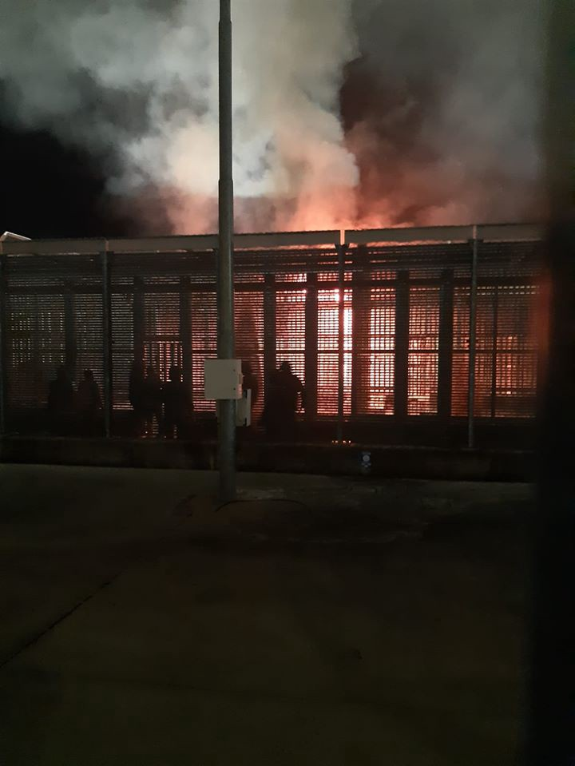

### AYS Weekend Digest 15–16/8/2020: UK: migrants may be ‘tortured’ in France

Fires and protest in Italian detention centre // Stories of torture by Croatian police // Sea pushbacks by Greece // Monthly report from the Border Violence Monitoring Network // Hunger strike updates
### Feature:

Asylum seekers in the UK and France have described injuries they have received at the hands of the French police\. [Speaking to the Guardian](https://www.theguardian.com/uk-news/2020/aug/16/priti-patel-migrants-crossing-channel-uk-they-believe-france-racist?fbclid=IwAR3dhOFgsyNPlXn_ZpnpyPROjzVLV69AJPe0OdHatZTsKSgMqPHaKpxhUyc) , one man in Dunkirk said he had recently received injuries to his hands after the French police beat him\.

Another man who has reached the UK said he was struck in the face, causing injuries to his eyes\. Speaking to the Guardian he reported: “I was beaten very badly by the French police\. I have some injuries to my eyes and I’m still suffering from these injuries,” he said\. “The French police are very bad for asylum seekers\.”

[The Guardian](https://www.theguardian.com/uk-news/2020/aug/16/priti-patel-migrants-crossing-channel-uk-they-believe-france-racist?fbclid=IwAR3dhOFgsyNPlXn_ZpnpyPROjzVLV69AJPe0OdHatZTsKSgMqPHaKpxhUyc) further reports that “According to reports, \(Secretary of State for the British Home Department\) MP Priti Patel told Conservative MPs that refugees and migrants were worried they may be “tortured” in France\. Government sources told PA Media that she had made clear she did not share those views and was simply explaining the “pull factors” that led so many people to risk their lives by making the Channel crossing\.”

Clare Moseley, of [Care4Calais](https://care4calais.org/get-involved/collect-donate/?gclid=Cj0KCQjwsuP5BRCoARIsAPtX_wFuLenwIZ1PrLgtCpeNwR0QZ3aXBmJ5H_XiIJ-YEKUYOAg5QbVxhk0aAmPqEALw_wcB) , a charity that delivers emergency aid to refugees in Calais and areas affected by the European migrant crisis, spoke out against the French police’s treatment of asylum seekers\. “The police seem to be a law unto themselves, “ she said\. “It’s the culture I find so shocking\.”

Further highlighting the brutal treatment of the French police, on the morning of August 16th, [Solidarité migrants Wilson](https://www.facebook.com/watch/Solidarit%C3%A9-migrants-Wilson-598228360377940/) was warned of the increasing violence being directed at refugees and migrants under the bridge of the Porte de Paris in Saint\-Denis\.

> “The police came at 6–7am, they asked us to leave and then started insulting us which made the tension rise\. Then they started to gas the place with sprays and then move away and throw hand grenades with tear gas\. There was smoke everywhere, we were suffocating but when the smoke left the police were o longer there”\. 

In the [video shared by the organisation](https://www.facebook.com/watch/?v=655243465123624) you can see police throwing ‘grenades’ at the ground and smoke filling the air\.
### UK

One hundred civil society groups, Windrush survivors and religious organisations have come together to demand safe and legal routes, in response to the government’s dangerous rhetoric surrounding recent Channel crossings\. Led by the Joint Council for The Welfare of Immigrants, the group has stated that “In its response to Channel crossings, the government has so far sought to abdicate all responsibility”\.

Within the open letter, the groups call upon Priti Patel MP and the wider British government to create a safe system for people to come to the UK to claim asylum\. They highlight that all and any attempts to establish such a system should include members of the Windrush generation, those providing services to people seeking asylum in the UK and in the EU, and migrants who have been affected by the current system\.

To read the full letter or to become a signatory please view the following link:

The Times has shared a short documentary examining the recent upturn in Channel crossings\. In a tweet promoting the documentary, Care4Calais said: “You’ll see all sides of a complicated story that has angered those who think the British and French governments should take a more aggressive approach to enforcement, and saddened those who feel that our country’s reputation for compassion for those in need is being tarnished”\. To watch the full video, please follow the link:

### Italy

The inmates in the CPR of Gradisca have yet again broken into a riot over the weekend, following weeks of violent repression\. While the original cause of the protest has yet to be ascertained, during the protests, advocate group ‘no frontiere fvg’ recall how the repression seems to be even more violent than usual\. In [one video shared](https://nofrontierefvg.noblogs.org/files/2020/08/14-Ago-Gradisca-Pestaggio.mp4?_=1) by the advocacy group, it appears that a ‘ _boy who, coming out of his cell, is targeted by two police forces one after the other, once he returns to his cell he remains bloody and requires his backpack’_ \.

Are You Syrious is closely following these events, and as always when new details about the causes or consequences of the protest emerge, we shall report on them\.

 \)](assets/fa831da5dd46/1*Y-LjSNvvZPE8jKpSJ-Kj6A.jpeg)

Fire that broke out during the protests in the CPR of Gradisca\. \(Photo Credit: [No Cpr e no frontiere — FVG](https://www.facebook.com/nocprfvg/) \)
### Denmark

The Danish government is preparing to provide up to 15 million kroner to assist with the repatriation of so\-called ‘irregular migrants’ who are currently stranded in the Western Balkans\. In a recent press release, the [Ministry of Immigration and Integration Affairs](https://www.kristeligt-dagblad.dk/danmark/danmark-giver-15-millioner-til-hjemsendelse-af-migranter?fbclid=IwAR0gLSJ5-3VCKXuzhGT1eTEqgg5n20RVfg42-rpyTGw1sym3KTwcL-cKubI) stated that 500 irregular migrants are currently stranded and need financial assistance to voluntarily travel back to their home country, with at least 300 being offered further financial support to ‘get a place’ in their home country\.

The project is sponsored by the United Nations Organization for Migration \(IOM\) \. It is supported by the Netherlands, Germany, Austria and the EU\. It is reported that so far, the project has helped more than 1,500 migrants from more than 20 countries to voluntarily return home from the six countries in the Western Balkans\.
### **Balkans**

The [Border Violence Monitoring Network](https://www.borderviolence.eu/balkan-region-report-july-2020/?fbclid=IwAR2wfjWFuReMZls9LiNiWGrkL8e9sTg588o7Ny5ZrTGxSbY2PCrEse9tzZ4) has published its monthly report\. This month, BVMN has published 21 cases of illegal pushbacks during July, documenting the experience of 389 people whose rights were violated at the European Union’s external border\. Volunteers in the field recorded a variety of cruel and abusive acts by officers, representing at least eight different national authorities\. The report analyses among other things:
- Romanian “pull\-ins”
- Frontex deployed to Montenegro
- Continued Greek maritime pushbacks
- Dangerous Italian return protocols
- Landmark ruling in Slovenian courts

The report focuses especially on the Romanian context, where a sequence of pushbacks in the last two months has suggested a practice by Romanian authorities of apprehending transit groups in Serbian territory before bringing them into Romania for short periods of detainment\. Two reports compiled by members of the Border Violence Monitoring Network allude to this practice, and anecdotal evidence from the field reinforces these accounts\.

The brutality of the policing response to the so\-called European refugee crisis was yet again laid bare with the sharing of the story of this young man\. In September 2019 he was found in the woods by Croatian police, who took off his shoes and **tortured him with a red\-hot bar and skinned his leg\.** Despite continued medical treatment, as the photo shows below, this young man still suffers every day from the callous brutality of the Croatian police\.

Lorena Fornasir has shared a link to a petition where she asks the European Court of Human Rights to strongly condemn the violence perpetrated by the Croatian police forces against defenceless people\. In particular, she asks that inhuman and degrading treatment, the use of physical torture and the application of psychological torture through death threats be considered\.

In the petition, Fornaisr recounts not only the story of the young man who was tortured with a red\-hot bar, but also the story of Ali:

> Last February, Ali was captured and the Croatian police, after various mistreatments, pushed him back from Croatia to Bosnia, in the snow and frost, taking off his clothes and shoes\. Ali returned to Velika Kladusa on foot, in the snow, wandering around for hours\. His feet had frozen and had gone necrotic\. After months of suffering, Ali died on Saturday 21 September due to the inhumanity to which he had been subjected by the police\. 

To sign, please follow the link below:

### Greece

[The Aegean Boat Report](https://www.facebook.com/AegeanBoatReport/posts/897343147455457?hc_location=ufi) has published a report on a boat carrying approximately 32 people which tried to cross towards Lesvos north east at 04\.00 on Saturday morning\. The boat was stopped by the Hellenic Coast Guard outside Palios\. **For 8 hours the boat carrying children, women and men was drifting on the border to Europe but denied entry\.** A total of nine vessels was present, including the Turkish coast guard, Greek coast guard, FRONTEX and NATO, as well as three helicopters, but the extent of the involvement of Nato and Frontex is yet unknown\.

](assets/fa831da5dd46/1*s_TfeaJNKsBjNDq0tChIQg.jpeg)

Report and photo credit: [Aegean Boat Report](https://www.facebook.com/AegeanBoatReport/posts/897343147455457?hc_location=ufi)

This weekend, [Mobile Info Team](https://www.facebook.com/mobileinfoteam/photos/a.1800063030222418/2835554363339941/?type=1&theater) have shared an important update regarding **residence permits in Greece:**

> If your residence permit expires before December 31, 2020, you can renew it now\. 

> The refugee department announced that all those who have received asylum in Greece and their residence permit expires before December 31, 2020 can now apply for its renewal\. According to this announcement, if your residence permit expires before December 31, 2020, you need to apply for renewal by October 31, 2020\. The expiration date is written on your residence permit\. In the photo above this post, the expiration date is marked with a red circle\. In general, it is recommended to apply for a residence permit as soon as possible, as the administrative process of residence permit renewal usually takes more than 2 months\. 

> For more information about residence permit, click on the link below: [https://www\.mobileinfoteam\.org/residence\-permit\-fa](https://www.mobileinfoteam.org/residence-permit-fa?fbclid=IwAR3d9QQfqREQlxwPOTNcuk59DGmN_5sQqY9mh2MMZcAmOSSjqtTdDzXjpCQ) \. 

> After applying for a residence permit, please regularly check the link below, which contains ready delivery permits: [http://asylo\.gov\.gr/en/?page\_id=3376](http://asylo.gov.gr/en/?page_id=3376&fbclid=IwAR3qTEfKyfJhhcjWwB5Nj7Aud3Ku8NrS2RCRfZHE7_8s39QkB3LgL7mvVhA) \. 

> If your residence permit expires soon, please visit the local refugee office at least 5 days before its expiration date and apply for a temporary certificate\. This certificate shows that you have applied for a residence permit and are waiting for its administrative steps to go through\. 

Following the report from The New York Times outlining the brutal treatment of refugees and asylum seekers and the ongoing practice of illegal pushbacks by the Greek government, a Statement from the Hellenic Minister of Migration & Asylum, Mr Notis Mitarachi, has been published denying that Greece and the Hellenic Coast Guard are doing anything illegal\.

> [In the press statement the Hellenic Minister of Migration & Asylum said:](https://migration.gov.gr/deltio-typoy-apantisi-se-dimosieymata-xenoy-typoy/?fbclid=IwAR3Q-8Cgn2cCqs64GZjkjtay13F3z9yCNRko2Do9uQTzkZmpwWEZKGU9SC4) 
 

> “Greece implements a tough but fair migration policy and fully respects its obligations under international law\. The Hellenic Coast Guard has saved tens of thousands of lives in the Aegean Sea in recent years and thanks to their efforts, in 2020 we have had only one fatal incident\. 

> Despite the attempt by Turkey to weaponize the migration crisis and despite the COVID\-19 pandemic, we continue to provide asylum to eligible applicants\. 
 

> Currently our country hosts 160 thousand refugees and asylum seekers\. 

> At the same time, we will continue to protect vigorously the borders of the European Union as provided by national and European law\.
 

> We strongly deny claims made to the contrary\. We note that the Turkish Coastguard is mentioned as a source\.” 

Speaking out against the press statement, the [Aegean Boat Report](https://www.facebook.com/AegeanBoatReport/posts/897428410780264?hc_location=ufi) said _“The level of denial shown is just mind blowing, and to even consider denying these facts, shows a total lack of respect, not only for their obligations as a member of the EU, but also towards the Greek people\. We must keep in mind that the illegal orders to the Greek Coast Guard to violate these people’s rights, most likely is designed and implemented by Mr\. Mitarachi himself\.”_

### Sea

[News from the Med](https://www.facebook.com/NewsfromtheMed/posts/1012587325861530?hc_location=ufi) have shared their most recent update from the region, Within their update they report that:
- The 25 people who were in distress off the Libyan coast and turned to the Alert Phone on [Monday](https://twitter.com/alarm_phone/status/1292902069612032006?fbclid=IwAR3j6ROQiLWN3vLbTV_jH9TV2C20t-Fxn7HQdRMXXnaRUKHMdQaR-jBV4eg) were captured by the so\-called Libyan coastguard and returned to [Libya](https://twitter.com/alarm_phone/status/1293545353875271681?fbclid=IwAR3DXtxyjOB8VHRDBvWd-ouIQg3PIzXY3HR65B8rvrYRh2_pwoyNp26IGRs) \.
- The [11 people in the Maltese SAR](https://twitter.com/alarm_phone/status/1294153894390566912?fbclid=IwAR3BPoq2PPbtgRxqjHOYy2Cv1P3r6LJSVT2p5sQcf2tfaGWV22aYFtxHp6I) zone who turned to the [Alarm Phone](https://twitter.com/alarm_phone/status/1294335951263666178?fbclid=IwAR2czaIJQgbqthuFslxmzrgeu1JKPNWbKAy8flB2X7sAnwIxPXnC3AaqfuM) on Friday arrived in Italy after Malta gave them fuel for the boat\.
- Between Monday and Friday, 383 people were caught by the so\-called Libyan coastguard and returned to Libya \[source\- [1](https://reliefweb.int/report/libya/unhcr-update-libya-14-august-2020-enar?fbclid=IwAR0US5YIK1pELXRBMhc7SP8JcuMGnFuS_HWuKc8Sf6jFf-JuSHw68snXjaY) , [2](https://twitter.com/IOM_Libya/status/1292874188068356096?fbclid=IwAR0M4yQRTM_dzs58XXo0FSacrW1Giw19kUo662DAE3fxE27PTmgOFiTsHOg) , [3](https://twitter.com/IOM_Libya/status/1293262748281974785?fbclid=IwAR3a3E2LZyGXcX-jEoChrJZUBqNvzTSb4UkZsyxVQVGoFvc5kyBjPAnctjw) \] \. The [Sea\-Watch](https://twitter.com/alarm_phone/status/1294628823108128768?fbclid=IwAR2a0sB6h4JWoNexn5wcqStaoUh8uqoOFI4398XVv5j2FJmxvWKumg-Hayw) plane Moonbird saw in the Maltese SAR — Zone a Libyan patrol boat that reached some distress boats\.

■■■■■■■■■■■■■■ 
> **[Sea-Watch International](https://twitter.com/seawatch_intl) @ Twitter Says:** 

> > 🔵NOW: The #SeaWatch4 sets sail for the first mission with @[MSF_Sea](https://twitter.com/MSF_Sea) on board! The strong alliance with @[United4Rescue](https://twitter.com/United4Rescue) builds momentum. As long as the European Union condemns people at its borders to death, we will continue fighting. For freedom of movement and the right to life! https://t.co/vRQgSrSw5b 

> **Tweeted at [2020-08-15 16:03:39](https://twitter.com/seawatch_intl/status/1294666070142390273).** 

■■■■■■■■■■■■■■ 

■■■■■■■■■■■■■■ 
> **[Alarm Phone](https://twitter.com/alarm_phone) @ Twitter Says:** 

> > 🆘~65 people in distress off Libyan waters! A white rubber boat with ~65 people reached out to us as their engine is not working and water is entering the boat. They ask for urgent rescue. We alerted all authorities in #Europe, #Libya and #Tunisia. https://t.co/vms71kMvfr 

> **Tweeted at [2020-08-15 19:05:29](https://twitter.com/alarm_phone/status/1294711831810932738).** 

■■■■■■■■■■■■■■ 

■■■■■■■■■■■■■■ 
> **[Alarm Phone](https://twitter.com/alarm_phone) @ Twitter Says:** 

> > Where are they?
We are very worried about the fate of the ~65 people, as we lost contact to them 12h ago. Then the situation was very critical, people were screaming &amp; panicking. The sc Libyan CG is not reachable &amp; MRCC Rome refuses responsibility for the militia Italy is paying. 

> **Tweeted at [2020-08-16 07:15:43](https://twitter.com/alarm_phone/status/1294895599238684673).** 

■■■■■■■■■■■■■■ 

### Syria

[UNICEF](http://UNICEF has expressed "deep alarm" at the recent reports that eight children from the Al-Hawl refugee camp in Northern Syria have died. These children  - all under the age of five - died during a four day period between 6 and 10 August. Four of the children died due to complications related to malnutrition, while the others lost their lives to dehydration due to diarrhea, heart failure, internal bleeding and hypoglycemia. It’s estimated that 40,000 children from more than 60 countries are currently in the Al Hol camp.   UNICEF Executive Director Henrietta Fore said that “The death of any child is tragic. It is even more so when death could have been prevented’. Ms Fore further stated that ‘They lack access to basic services and have to cope with the sweltering summer heat and the trauma of violence and displacement’.) has expressed “deep alarm” at the recent reports that eight children from the Al\-Hawl refugee camp in Northern Syria have died\. These children — all under the age of five — died during a four day period between 6 and 10 August\. Four of the children died due to complications related to malnutrition, while the others lost their lives to dehydration due to diarrhoea, heart failure, internal bleeding and hypoglycemia\. It’s estimated that 40,000 children from more than 60 countries are currently in the Al Hol camp\.

UNICEF Executive Director Henrietta Fore said that “ _The death of any child is tragic\. It is even more so when death could have been prevented”_ \. Ms Fore further stated that “They lack access to basic services and have to cope with the sweltering summer heat and the trauma of violence and displacement”\.
### Bosnia and Herzegovina

A local activist has shared [video](https://www.facebook.com/100010319738101/videos/pcb.1254666458220667/1254663311554315/?type=3&theater) [footage](https://www.facebook.com/100010319738101/videos/pcb.1254666458220667/1254663318220981/?type=3&theater) that shows how a group living outdoors in Bihać have had their tents, clothes and sleeping bags set alight and burned\. Within the post, they allege that this was committed by undercover policemen\.

There has been growing anti\-migrant sentiment within Bosnia and Herzegovina, with [local groups attempting to use force and violence](https://www.radiovkladusa.ba/velika-kladusa-polupao-prozore-na-autobusu-koji-je-vozio-ilegalne-migrante?fbclid=IwAR3wnTziCP25VtvJv_Vo-McQdRQv_UhZI3AVhrBKyGGLe4NQvBPITiVM2XI) to stop buses with migrants on them from moving around the country\. On the 15th this group attempted to peacefully protest a bus of migrants, but by the 16th had escalated their tactics and waited at the bus station in Polje for the bus that contained both local passengers and migrants\. The group broke the windshield of the bus and media reports suggest the bus was forced to leave the bus station\.
### Lebanon

■■■■■■■■■■■■■■ 
> **[Jenan Moussa](https://twitter.com/jenanmoussa) @ Twitter Says:** 

> > Female migrant workers in Lebanon have lost their jobs due to financial crisis &amp; #Beirutblast.

Since they don't have money anymore, they can't pay for a plane ticket to go home to their families.

Who can help these ladies? They are desperate.

@[akhbar](https://twitter.com/akhbar)

https://t.co/XCRC4J8MQJ 

> **Tweeted at [2020-08-15 12:07:03](https://twitter.com/jenanmoussa/status/1294606526804635648).** 

■■■■■■■■■■■■■■ 

### Worth Reading

“For Routed’s eleventh issue, we bring readers an exploration of home and the associated objects, crafts, and cultural expressions that become legacies when home is left behind\. People on the move invariably carry with them traditions, memories, and a bond that stretches back in time, but also far in space\.”

Doctors Without Borders’ Hannah Wallace Bowman tells _The Civil Fleet_ about the medical charity’s imminent return to the central Mediterranean onboard the Sea Watch 4

**Find daily updates and special reports on our [Medium page](https://medium.com/are-you-syrious) \.**

**If you wish to contribute, either by writing a report or a story, or by joining the info gathering team, please let us know\.**

**We strive to echo correct news from the ground through collaboration and fairness\. Every effort has been made to credit organisations and individuals with regard to the supply of information, video, and photo material \(in cases where the source wanted to be accredited\) \. Please notify us regarding corrections\.**

**If there’s anything you want to share or comment, contact us through Facebook, Twitter or write to: areyousyrious@gmail\.com**

_Converted [Medium Post](https://areyousyrious.medium.com/ays-weekend-digest-15-16-8-2020-uk-migrants-may-be-tortured-in-france-fa831da5dd46) by [ZMediumToMarkdown](https://github.com/ZhgChgLi/ZMediumToMarkdown)._
