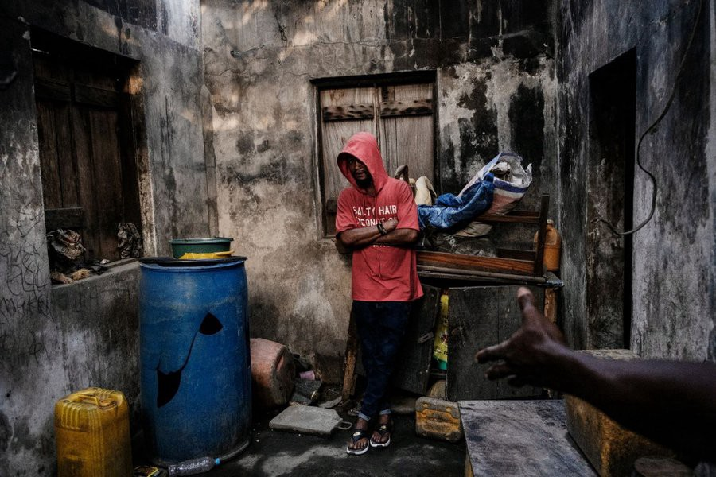
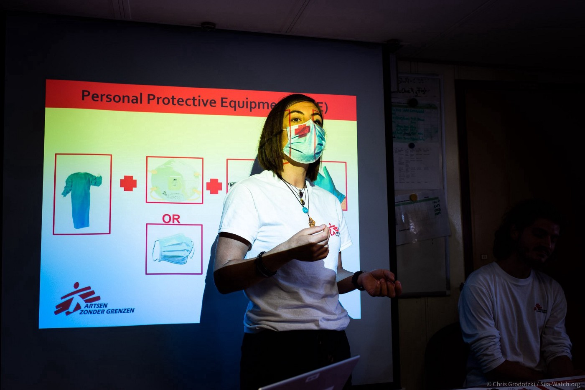
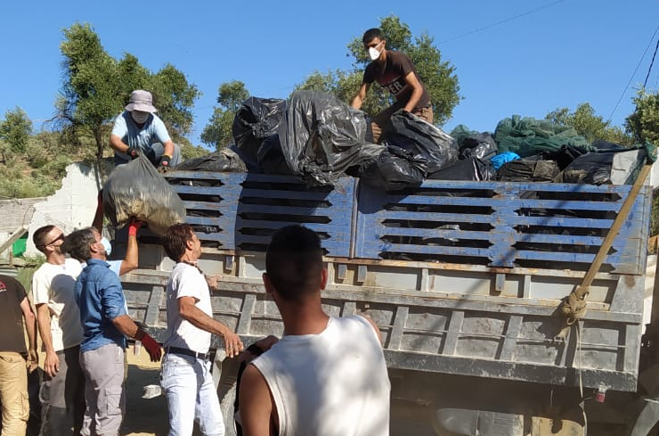
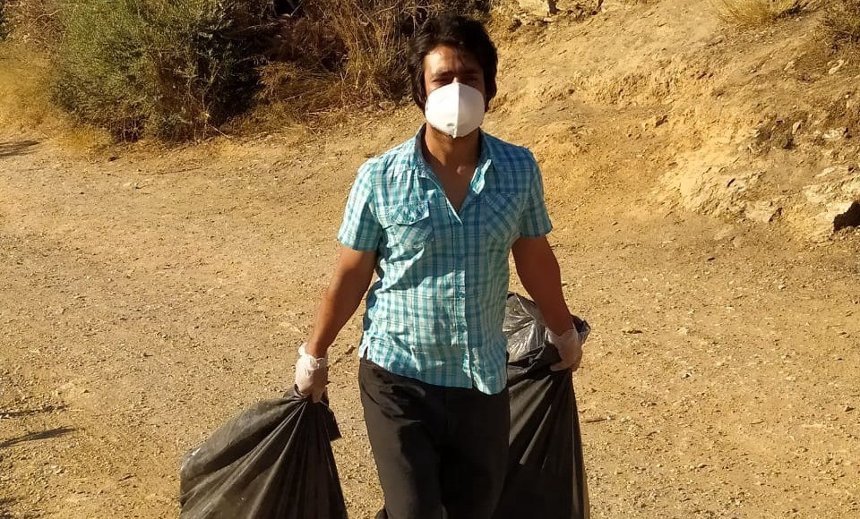

### AYS Daily Digest 17/08/20 Germany is set to continue deporting Nigerians back to “hell”

[Are You Syrious?](@AreYouSyrious?source=post_page-----439e07256b7f----------------------)

[Aug 18](ays-daily-digest-17-08-20-germany-is-set-to-continue-deporting-nigerians-back-to-hell-439e07256b7f?source=post_page-----439e07256b7f----------------------) · 10 min read

_Many updates from AlarmPhone // extreme poverty for refugees in Spain // France’s COVID policies have an adverse effect // COVID in Vial // & more…_
### FEATURE Germany is set to continue deporting Nigerians back to “hell”

### “This is no longer my country, it’s like hell\.”

Following the deportations from Germany to Nigeria, German outlet [Spiegel](https://www.spiegel.de/politik/ausland/aus-deutschland-zurueck-in-nigeria-das-ist-nicht-mehr-mein-land-es-ist-wie-die-hoelle-a-86571264-ac97-4a39-bd69-103830837e6d?fbclid=IwAR1-l22O68TUSXipcVCVgNNZcC01SW3OLRp1yZwpXA2x5mjlQPQ3YJr287w) published a report with this title\. Since tens of thousands of Nigerians are currently threatened with deportation, the article follows some that have already been forced to leave\.

The woman in particular was brought to Europe in 1999 when she was 19 years old by human traffickers\. Her children have never known Africa\. They are now homeless, she cannot find work because of COVID, and often her children have to go without food\. German\-Nigerian activist Rex Osa says:

“In Germany there is hardly any awareness of these returns: Nobody knows that children and women are being deported or has any idea what this means for their health and living conditions\.”

In regards to how well Germany monitors the success of these forced returns, which they have to do in accordance with EU Law, the European Union Agency for Fundamental Rights says:

“We found that the German observation system tends to be fragmented\. It ranges from the Federal Office for Migration and Refugees \(BAMF\) to volunteers who work for church organizations…Effective monitoring appears to cover only selected airports and the national agency for the prevention of torture is limited and ad hoc\.”

Germany is choosing to deport families with children that have only ever known Germany as their home\. Then Germany leaves them on their own in a strange land without support networks\. Since returns are looming ahead as pandemic restrictions loosen, more children born in Germany are likely to face similar fates if brought to Nigeria\.

LEBANON

A total of 200,000 Palestinian refugees live below the poverty line in Lebanon\.

UNWRA states that we cannot forget them when giving aid to Lebanon in these unstable times\. They need to be able to continue the cash assistance to Palestinians for the next round\. A holistic relief plan must include them\. Learn more [here](https://www.infomigrants.net/en/post/26665/beirut-palestinian-refugees-must-be-included-in-aid-un-says?fbclid=IwAR0S7WaGTMki8tpyaCWJS2q9-V3KSvv0oFKrvJKMa50eTFsGmmPjfj60ELk) \.

SEA

Update from [AlarmPhone](https://www.facebook.com/watchthemed.alarmphone/posts/2739726789634880) : “Here we provide a summary of the boats fleeing Libya that called us over the last weekend and today\. Several boats eventually arrived in Europe, while others are still in distress\. We have lost contact with some and fear for their lives\.
~ **85 people** in distress south of Lampedusa and **in Malta SAR** \. The vessel Contship Ray found the boat but are not rescuing\. 
~ **40 people** in distress **in Malta SAR** \. The people told us: “We’re on sea since four days, we don’t have any food and water left\.” 
~ **22 people** distress **in Malta SAR** \. Though not confirmed yet, we believe the boat reached Lampedusa\. 
~ **62 people** in distress **in Malta SAR** \. Though not confirmed yet, we believe the boat reached Lampedusa\. 
~ **86 people** in distress **fled Libya** and eventually arrived in Lampedusa\.
~ **65 people** in distress **off Libya** \. [We are very worried](http://www.vita.it/it/article/2020/08/17/naufragio-con-65-persone-a-largo-della-libia-il-primo-sos-a-ferragosto/156405/?fbclid=IwAR1BvHiLyr8tABA9znTyoMXO3ILicD0De6JZOIwQ7BZCNcrz5EyfXrJrbYw) about the fate of the 65 people, as **we have lost contact** \. Then the situation was very critical, people were screaming and panicking\. The so\-called Libyan Coastguard is not reachable & MRCC Rome refuses responsibility for the militia Italy is paying\.”

And in [a further update](https://twitter.com/alarm_phone/status/1295444149802545154) provided hours later, probably in response to the ~22 people mentioned above:

“ **~20 people** in distress **in Malta SAR** \! On board there are several children & women fleeing Libya & water is entering the boat\. They called us at 20\.00 CEST & we have tried to reach the Armed Forces since then but nobody answers\. The Coast Guard is refusing responsibility\. Rescue now\!”

There are several organized events happening throughout France to demand the release of the Ocean Viking on Friday the 21st\. Find out more [here](https://www.facebook.com/events/631753821073824?acontext=%7B%22action_history%22%3A[%7B%22surface%22%3A%22page%22%2C%22mechanism%22%3A%22page_admin_bar%22%2C%22extra_data%22%3A%22%7B%5C%22page_id%5C%22%3A1620638098209175%7D%22%7D%2C%7B%22surface%22%3A%22events_admin_tool%22%2C%22mechanism%22%3A%22events_admin_tool%22%2C%22extra_data%22%3A%22[]%22%7D]%2C%22has_source%22%3Atrue%7D) \!

GREECE

Three more people test positive in Vial on Chios

Three more people were placed in quarantine after testing positive on Monday with COVID\-19\. The camp is on full lockdown until 25/08/20 because of a man living in the camp and a female employee testing positive last week\. A total of 3,800 people are living in Vial, a camp designed for only a third of that population…evacuate the islands now\!

[Mare Liberum e\.V\.](https://twitter.com/teammareliberum/status/1295372350221942784) reports that the Greek Migration Minister only reports one death so far in the Mediterranean in 2020…

“We know of 71 people that drowned, but probably many more died\. At least 5 as a result of pushbacks\. \#SayTheirNames? Not possible\! Most bodies are never recovered\.”

In fact, here is a video from [Disinfaux](https://www.youtube.com/watch?v=siK8Yeyf7JQ&fbclid=IwAR3aR1UlLNeen2oXpjxhWM07eumrnSOUZL46sN-awciBAmYlO_wG8ID_KrY) on the pushbacks from 27/07/20 where they “document the existence of a makeshift detention facility in the port of Rhodes island, and the use of a ZODIAC liferaft used by the Greek Coast Guard, based on the testimony of witnesses\.” The Greek authorities have proven themselves NOT to be trusted on truthfully reporting what happens at sea…

[**Fenix Humanitarian Legal Aid**](https://www.justgiving.com/crowdfunding/translators) is holding a fundraiser in the month of August to support their translators with reimbursements\. One of their translators recently received asylum, a heartwarming story in these dark times\. But so much work needs to be done, especially because:

“While Greece has opened its borders to tourism and bars and restaurants are filled with people, Moria Camp has been on lockdown for over four months\. Our clients are not allowed to leave the camp unless they get written authorization from the police\. Restrictions of access to essential services have resulted in an increase of tensions, violence and mental health issues\. Medical organizations report an increase of suicidal \(thoughts\), panic attacks and sleeping problems\. Furthermore, during the lockdown 1789 rejections of asylum claims were notified to asylum seekers…

Our clients need us more than ever to monitor the increased violations of human rights, the enactment of unlawful asylum policies and the worsening of living conditions\. To increase our operations, we have had to increase the amount of translators in our team\. This Eid, we are hoping to be able to fund raise to cover for our translators’ housing, transport and food expenses\. Our translators are the heart of our organizations and we would not be able to do the work we do without their hard work and professionalism\.”

Update from Attika Human Support on “warehouse activity August 11–17:
\- Boats still arriving
\- About 20,000 people are stranded on the island
\- Violations of European Convention Of Human Rights and International Maritime Law is ongoing and is supported by the Greek government
\- Stand on our side, we believe that humanity will prevail but we need to be united”
**Support and donate [here](https://www.facebook.com/AttikaHumanSupport/posts/1253764398312546)**

The RIC of Fylakio\-Orestiada is currently under lockdown after someone tested positive for COVID\-19 there\. They are trying their best to follow health and safety guidelines\. Learn more [here\.](https://www.humanrights360.org/announcement-for-the-lockdown-of-the-ric-of-fylakio-orestiada/?fbclid=IwAR0zG7ILs5cySV92RXYnGv-kkFsEDIN5cgiTjz7Pv_K5B3Kg3VG0v90Hzig)

ITALY

Foreign minister Luigi Di Maio visited Tunis on Monday to say that “Italy has no more room” for people migrating\. He met with Tunisian President Kais Saied and made sure that Italy “is ready to present all the necessary aid to Tunisia” to combat migration\. Learn more [here](https://www.france24.com/en/20200817-italy-wants-no-more-illegal-migrants-minister-tells-tunisia?fbclid=IwAR3wnJWWWubKyqgKT2KIrsi3kFZrGAjjXkgvOyhWSGpShhTDgf_eE5Xm-jE) \.

SPAIN

Refugees and migrants are living in extreme poverty throughout Spain, but matters have only been made worse during COVID\. In order to receive aid, many would have to have a residence permit, but many cannot receive one because they would be required to find work first\. The “social roots” approach has been failing many people for years but the effects of COVID are proving that new measures must be adopted\. More [here](https://www.publico.es/sociedad/derechos-gobierno-deja-migrantes-irregulares.html?utm_source=facebook&utm_medium=social&utm_campaign=publico&fbclid=IwAR15-l5_BF5wfzZnaPspM9I0oO-3aSvw-NJ8dH8KD9GbVlgN_D4VGvlgEuw) \.

GERMANY

Find out how how you can make your city a safe harbour [here](https://seebruecke.org/en/) \.

Helmut Philipp Aust, a Professor of Public Law, and Gesine Schwan, a President of the Humboldt\-Viadrina Governance Platform, wrote a piece on Der Tagesspiegel on why Federal Minister of the Interior Horst Seehofer’s arguments are not convincing\. He is trying to say that on legal grounds he cannot accept the project that would allow refugees from Greece to come to three German states\. [Read the full report here\.](https://www.tagesspiegel.de/politik/das-seehofer-nein-zur-laenderaufnahme-warum-seine-argumente-nicht-ueberzeugen/26098116.html?fbclid=IwAR3U9O4Xpfmu_gaIVLicH4as5robzgkQo-cr32RX1rklgP2bKim5Gxq13rI)

“Under the German Council Presidency there is an opportunity to take a big step forward\. In this context, the plan of the three federal states of Berlin, Lower Saxony and Thuringia to take in additional refugees from the camps on the Greek islands for humanitarian reasons\.

Federal Minister of the Interior Horst Seehofer, however, refused to approve this project and — with regret — rejected corresponding applications from the states of Berlin and Thuringia\. As he writes, legal reasons prevent him from doing so\. What are these legal obstacles and are there ways to overcome them? In our analysis, we are based on the example of the letter from the Federal Minister of the Interior to his Berlin counterpart Geisel on July 8th this year\.”

[Sign this petition](https://www.openpetition.de/petition/online/landesaufnahmeprogramm-fuer-fluechtlinge-in-not-jetzt-rlpnimmtauf?fbclid=IwAR0aev4i4kchJeue39KTf7w5zrjlqcTDJ08o4dkC5Ezca7SdDxbVs25UvJw) to evacuate 1,000 refugees to Europe from refugee camps in Libya, Lebanon, and other countries struggling with chaos and instability\. The petition also addresses refugees currently in Greece being rescued to Germany\.

FRANCE

The French response to COVID\-19 is partly to blame for the number of people currently crossing the English Channel\. As David Wilson, communications director for Care4Calais told [KentOnline](https://www.kentonline.co.uk/kent/news/amp/the-truth-behind-channel-crossings-232187/?fbclid=IwAR1-Llfnx-O8Sr6ityyabLUclBydZYEJsHh-_F2qOqhr9BExZW9mjRuwaRk) :

“What we saw when lockdown started was a complete collapse of support for refugees there…People were already living in really tough conditions, but because of lockdown a lot of charities that usually support them pulled out, because they couldn’t get their volunteers there and charity donations were collapsing\.

The French government also reduced food aid, so that meant conditions got even harder, and for some people that tipped the balance for them and made getting into a boat seem like a viable alternative\.”

DENMARK

In a piece on [Refugees D\.K](http://refugees.dk/en/focus/2020/august/refugees-become-danes-over-time-fortunately/?fbclid=IwAR3GxsnRPiYpq_ppUWG17bJSTcAxEGSkTmSZqVxYmUiiop-FKm0S93vb_s8) , Michala Clante Bendixen writes about the Danish government’s shift to temporary stay, and how it is not only counterproductive but ignores how integration could be a great thing for Danish society:

“The “paradigm shift” says that refugees are only supposed to stay for a few years, and Denmark’s focus must be on return instead of integration\. This is also a misunderstanding which will cause serious problems in the future — for the refugees as well as for our society\. Fortunately, we did not kick the Chilean and Iranian refugees out who came in the 1970s, and neither the Yugoslavian ones who came in the 1990s\. They are all Danes today, and an important part of society\. But in the future, it will not be that easy\. Recently the authorities have revoked hundreds of residence permits for Somali refugees, and Syrians are next\. Denmark is the first country in Europe who wants to send refugees back to Bashar al\-Assad\.”

But with this temporary stay notion, Denmark is currently not an ideal place for refugees and asylum seekers, even though they 100% have the resources:

“The number of refugees in the world is rising, and 85% of them end up in the neighbouring countries where there are no resources to take care of them\. Denmark has lots of resources, and we should receive a far larger number than today and allow them to stay\. In 2019, only 2% of all residence permits to foreigners were given to refugees\. But with the new focus on temporary stay, I will recommend refugees avoid Denmark and choose other countries in Europe where it is still possible to build a safe future for themselves\.”

UK

There are thousands of couples in the UK where one person is a UK citizen and another is a non\-EU citizen who are worried about perhaps being split up by not affording the visa minimum income requirement during COVID\. As James Harris explains on [Politics\.co\.uk](https://www.politics.co.uk/comment-analysis/2020/08/17/the-covid-penalty-brits-married-to-immigrants-face-separatio) :

“People in the UK on a spousal visa are further punished by having no recourse to public funds, meaning they are barred from getting any state support at a time when we all need it most\. Indeed, the DWP took time out of its busy schedule to inform my spouse of this fact by post, despite the fact that she hadn’t even tried to get any state support\. The prime minister himself recently seemed surprised to learn of this state of affairs\. It is a rare cruelty to ruin people’s lives and not even bother yourself to familiarise yourself as to how you are doing so\.

In truth, the income benchmark is a relic of another political age\. It presumed a greater degree of stability and prosperity than the pre\-covid labour market could provide\. Fifty\-five per cent of British women, for example, already didn’t meet the threshold, even before the pandemic took hold\.”

Well…we’ll leave you with this:

**Find daily updates and special reports on our [Medium page](https://medium.com/are-you-syrious) \.**

**If you wish to contribute, either by writing a report or a story, or by joining the info gathering team, please let us know\.**

**We strive to echo correct news from the ground through collaboration and fairness\. Every effort has been made to credit organisations and individuals with regard to the supply of information, video, and photo material \(in cases where the source wanted to be accredited\) \. Please notify us regarding corrections\.**

**If there’s anything you want to share or comment, contact us through Facebook, Twitter or write to: areyousyrious@gmail\.com**

Sign up for AYS Daily Newsletter

By Are You Syrious?

Daily news digests from the field, for volunteers, people on the move, journalists, and the general public [Take a look](/are-you-syrious/newsletters/ays-daily-newsletter?source=newsletter_v3_promo--------------------------newsletter_v3_promo-)

_Converted [Medium Post](https://medium.com/are-you-syrious/ays-daily-digest-17-08-20-germany-is-set-to-continue-deporting-nigerians-back-to-hell-df0c1f6c6571) by [ZMediumToMarkdown](https://github.com/ZhgChgLi/ZMediumToMarkdown)._
