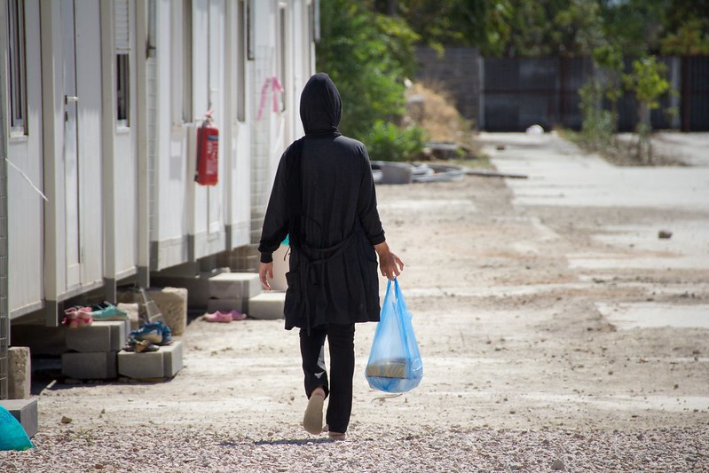

### AYS Daily Digest 18/08/20: Why women are hit even harder by the lockdown
### Report highlights the struggles of women on the move during the pandemic // Arrivals in Greece, Italy and UK increase // UNHCR warns that 1 million displaced people in Burkina Faso lack of support

[Are You Syrious?](@AreYouSyrious?source=post_page-----3c85c782fd7a----------------------)

Follow

[Aug 19](ays-daily-digest-18-08-20-why-women-are-hit-even-harder-by-the-lockdown-3c85c782fd7a?source=post_page-----3c85c782fd7a----------------------) · 6 min read

Due to the lockdown in Greek camps, women became even more vulnerable\. Credits: Thomas Andre Syvertsen/ Norwegian Red Cross \(via [Flickr](https://www.flickr.com/photos/ifrc/21019934472/in/photolist-y2sEcj-y41rVe-x6suWk-xKHzku-xKJtgb-y126jA-y128uY-FfjSB4-T7mpBb-y3kCX6-x6jg5u-y12bJd-xKQhB4-y128Mm-y3kEHF-x6ssXk-x6jjPJ-xKJFaS-y3kzjp-y129su-xKQjSM-xKHFib-x6jkb5-EkytoQ-x6jmGS-D1Wuv4-Ffju48-EhPWEa-F4D14W-Ffk6d6-xKJEAL-EMKbfE-EMKCMh-F4D6c1-EhWLTH-H3zxmT-ABLaSy-zxjyRe-EhBkMQ-EMJM8s-FfjBC6-EhWzFn-F4CHB7-HjGRK8-F6UQQF-Ffiku6-McVLeU-EMJQNy-PUyi2z-23REra1) \)

It is obvious that the Greek government and authorities are disrespecting basic human needs in the overcrowded, dire hotspots\. The [Women’s Media Center](https://womensmediacenter.com/women-under-siege/periods-dont-stop-during-a-pandemic-but-supply-of-hygiene-products-in-a-locked-down-refugee-camp-does?fbclid=IwAR1LS55JFpsdQKbahZDvCxi1aachYmwj_4GWcyg0TMxGY8_YUJN78uBNX_E) now shifts the focus to a problem that most women are affected by — and in times of the pandemic and locked down camps struggle even more with — their periods, when there are no hygiene supplies\.

“The two main providers of menstrual hygiene products in the camp, Euro Relief and Team Humanity, had to pause the regular distribution of sanitary pads to focus on other essential services,” the outlet reports from the Moria camp on Lesvos\. Many projects have ended, been reduced or suspended as of now, which is leaving women abandoned\. The remaining ones rather focus on Covid\-19 relief, a volunteer says\.

Together with further restrictions of access to the camps, independent and even organized volunteering becomes even more difficult\. This forces women to rely on only old pieces of clothes, toilet paper or diapers during their periods — items which are also hardly available\. Along with restricted access for the women at supermarkets or other stores on the island outside the camps, they barely have the opportunity to supply themselves\. This is without even mentioning cuts in cash assistance and sheltering support\.
### [Security Check Required](https://www.facebook.com/watch/?v=3398289956896405)
### [Edit description](https://www.facebook.com/watch/?v=3398289956896405)
#### [www\.facebook\.com](https://www.facebook.com/watch/?v=3398289956896405)

Additionally, sanitary facilities are not sufficently available or hygienic\. This goes along with long distances between facilities, and long waiting lines at facilities\. Considering that the camps are also places of gender\-based violence, the whole lock\-down situation makes it even more difficult and dangerous for women\. “As a stop\-gap solution, clinics have sometimes distributed funnels to women so that they can urinate in a bottle instead of harming themselves”, WMC writes\.

The lockdown has been extended for the seventh time now in Moria and Kara Tepe\. This has also led to increased tensions within the camp, combined with police violence against the residents forced to stay inside, writes the [Legal Centre Lesvos](http://legalcentrelesvos.org/2020/08/18/despite-the-discriminatory-lockdown-on-camps-and-hostility-towards-migrants-and-those-in-solidarity-with-them-resistance-grows/?fbclid=IwAR36GBeJG8gw1GzEkMQEArqSSsuR9M-OqHTJQCLWYeQiV9V3ZTqPVyMvGvs) :

> _The ongoing disregard for migrant lives — whether manifest in the inhumane, overcrowded and unsanitary conditions in the hotspots; authorities’ failure to intervene in fatal fights, or investigate arbitrary losses of life; or the inhibition of migrants’ access to adequate healthcare facilities — further demonstrates the insincerity of any attempt to justify ongoing restrictions to the camps by reference to COVID\-19 prevention\._ 

Women are also in danger on the mainland\. Crimethinc [reports](https://de.crimethinc.com/2020/08/18/summer-in-greece-new-democracy-edition) about sexual assaults from guards and staff at camps, when the women have requested medical help\.

In July, only 285 people arrived on Lesvos and 8 on Samos, according to the [Greek Ministry of Migration and Asylum](https://de.scribd.com/document/472830815/Monthly-Report-July-2020?fbclid=IwAR3HFPcX684UZeNrocLeE4RZJVJdzHZ4RCtGOjhLH_AN5aVBs3RtxOOjFfw) \. However, this number does not include reports about [illegal pushbacks](https://www.facebook.com/AegeanBoatReport/posts/900129897176782?hc_location=ufi) conducted by the [Greek Coast Guard](https://twitter.com/JosoorNet/status/1295785205287067648?fbclid=IwAR3xyD7LHftoT7BYUZtx_RMRkiqQR6v_rtnItC00LsFJX3CPEu3OTlrKPfc) , which faces accusations of abandoning dinghys at sea or even putting people back in rescue boats and letting them drift into Turkish waters\. Still, it should be noted that, officially, more than 4000 people have been transferred to the mainland; although this is no indicator of how the people are sheltered or treated\. Recently, the number of people arriving on the islands is increasing again:
### Italy

The amnesty for people employed in various black labor sectors has been used by more than 207,000 people\. Of this number, only 13,000 foreigners applied for the offer, which was launched in May, according to [InfoMigrants](https://www.infomigrants.net/en/post/26696/over-207-000-apply-for-undocumented-workers-amnesty-in-italy?fbclid=IwAR2T3wssLgP2ntIcVl5OWhM0OBWcp4Jn35NnCniDMml3D_QeAn4ybXhcrCQ) \. 85% were requests from domestic workers and caregivers\.

Like in Greece, the number of new arrivals has massively increased recently\. In a period of a few hours, more than 230 people landed at the shores of Lampedusa, [Adnkronos](https://www.adnkronos.com/fatti/cronaca/2020/08/18/lampedusa-sbarchi-raffica-hotspot-collasso_qv9eDWSpf1zEjlcMsrlZSI.html?refresh_ce&fbclid=IwAR1MjTDbx0ZjMg9XWlYxvDIm7Wz6DFXNyEf1ZGplvMlh0mObLMehQ-gJMZg) writes\. With a capacity limited to around 200 places but already with 1000 residents, the site is about to collapse\.

Read more: [**EU\-supported Libyan Coastguard unable to launch rescue for the second time in one week due to broken ship**](https://thecivilfleet.wordpress.com/2020/08/18/eu-supported-libyan-coastguard-unable-to-launch-rescue-for-the-second-time-in-one-week-due-to-broken-ship/?fbclid=IwAR0GoMfHK3YRe51v2wc6BzmKzblLWYrgRAOQserJurwjfqhMo5iG7pjQ7zE)
### Spain

The Ministry of the Interior will donate 1\.5 million Euro in police equipment to seven African countries to handle irregular migration, [El Pais](https://elpais.com/espana/2020-08-16/interior-donara-15-millones-en-material-policial-a-siete-paises-africanos-para-frenar-la-inmigracion-irregular.html?fbclid=IwAR2l1zkMvwvmbYmEU6lhEEATgeoA_bGZtxWDqkfWCbcmDxC_fOrp3QCdIk8) found out\. The first shipment, consisting of computer equipment to detect false identity documents, is destined for Mauritania and the Gambia\.
### Serbia

Serbia [has erected](https://www.slobodnaevropa.org/a/30789825.html?fbclid=IwAR3ywPm7s5t4Ccg58GP_0ppiT0EBTcjY3-TEiwOk9Gt9_xyHu4830zyLbfQ) a wire fence on the border with Northern Macedonia\. The president of the county says the fence is being erected in agreement with the EU to make “mass illegal crossings” impossible\.
### Croatia

The [Committee for the Prevention of Torture](https://www.coe.int/en/web/cpt/-/council-of-europe-anti-torture-committee-carries-out-rapid-reaction-visit-to-croatia-to-examine-treatment-of-migrants?fbclid=IwAR2fskeL5ua-kGjw9VexT-LYz6Cl3eEXjrXpiQRpUkmjeLW-Yrz1Zfiy5jE) \(CPT\) of the Council of Europe has visited the Croatian\-Bosnian border for five days to examine conditions in detention centers, police stations and informal camps\. Altough they met people who reported about police violence, they are yet to reveal any findings\.
### France

The [Human Right Observers](https://twitter.com/HumanRightsObs/status/1295430554079420416?fbclid=IwAR3Te0gP4RhgawVdClPLB0XsstOdm1_NVwWcH-SPv_8jjbyYKXlPd2v3_zw) group today counted the 698th eviction of an informal camp in Calais\.
### UK

The privately run detention centre, Yarl’s Wood in Bedfordshire, will no longer be used to shelter only women\. According to [The Guardian](https://www.theguardian.com/uk-news/2020/aug/18/yarls-wood-to-house-arrivals-from-small-boats-crossing-channel?fbclid=IwAR3vXjQrMwp-tiiyQQadM_7zbwfzQg7g-ggLxHfjQfG1-Qg41hIRTkIJ66s) , the Home Office confirmed this change, as the number of people arriving in the United Kingdom has increased recently and the facilities in Kent cannot cope with this situation anymore\. At Yarl’s Wood, people will “undergo immigration and health checks, similar to those conducted at short\-term holding facilities across the immigration detention estate”\. A spokesperson added that the number of women in the detention centre was low and they were now housed in small groups elsewhere\. Howevery, the government still intends to deport them\.

Read more: [**As a Syrian academic who settled in Scotland, I find racism against refugees all too familiar**](https://inews.co.uk/opinion/syrian-racism-against-refugees-dover-582003?fbclid=IwAR2MeJB3-RRbWsJUoSUodta68plahKnFfjZPhLkNo5Un7rk3HHVrsEeaqLg)
### Denmark

The project “ [Evacuate the kids from Moria](https://www.facebook.com/evakuermoria/posts/150423523407481) ”, that has already confirmed support from more than 50 potential foster families in Denmark, has now contacted 55 of the total of 98 Danish municipalities for support\. 11 of these are including the issue on the agenda for their next meetings\.
### Norway

Human rights organisations are [critizising](https://www.abcnyheter.no/nyheter/norge/2020/08/16/195697005/menneskerettighetsorganisasjoner-kritiserer-forholdene-pa-trandum?fbclid=IwAR2huGJ6Rt79apzZuelQCLC_IiLokxtBDjOPc8FNGI0jgtGiSZwU39LjePU) the conditions for immigrants at Trandum National Police Immigration Detention Centre \(Trandum Utlendingsinternat\) \.

A report commissioned by the Red Cross in 2018 compared immigration detention centers in Norway, Switzerland, France, Germany and Sweden\. — The main finding in the report is that Trandum is stricter than many other similar institutions in other countries, legal adviser to the Red Cross, Inga Laupstad is stating\. The Civil Ombudsman has also carried out two inspections at Trandum; one in 2015 and one in 2017, where the same was found\.

After the last inspection, the Civil Ombudsman wrote that they were “concerned about the use of force on Trandum\.” It was justified on the grounds that “the immigration detention center’s security routines are largely the same as in the penal care system”\. An example of this is that the inmates are locked inside their rooms, as if they were cells, both at night and for a period of the day\.
### Burkina Faso

The UN refugee agency, [UNHCR](https://www.unhcr.org/news/briefing/2020/8/5f3b84914/mounting-violence-forces-million-flee-homes-burkina-faso.html?fbclid=IwAR2D6M9D292kxTaX-BaUk9jQg2T499snJvrMpa7Hc83hbdKhJLYhC2wx-OY) , highlights the escalating violence in Burkina Faso\. Since the beginning of the year, more than 450,000 people were forced to leave their homes — adding to more than half a million in the previous year, according to national authorities\. Spokesperson Babar Baloch said:

> _Five per cent of the country’s entire population — an astonishing one in 20 people — is now displaced in the world’s fastest\-growing humanitarian and protection crisis\._ 

Baloch further warned that people there are desperately in need of shelter, food, water, protection, health along with education\. The host populations in the Centre Nord and the Sahel regions were not able to cope with situation anymore, as they host 76% of the IDPs\.

**Find daily updates and special reports on our [Medium page](https://medium.com/are-you-syrious) \.**

**If you wish to contribute, either by writing a report or a story, or by joining the info gathering team, please let us know\.**

**We strive to echo correct news from the ground through collaboration and fairness\. Every effort has been made to credit organisations and individuals with regard to the supply of information, video, and photo material \(in cases where the source wanted to be accredited\) \. Please notify us regarding corrections\.**

**If there’s anything you want to share or comment, contact us through Facebook, Twitter or write to: areyousyrious@gmail\.com**

_Converted [Medium Post](https://medium.com/are-you-syrious/ays-daily-digest-18-08-20-why-women-are-hit-even-harder-by-the-lockdown-7e7a43b65238) by [ZMediumToMarkdown](https://github.com/ZhgChgLi/ZMediumToMarkdown)._
