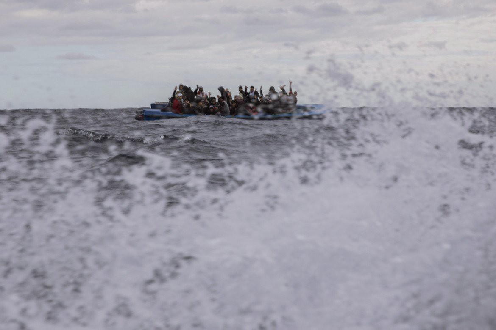

### AYS Daily Digest 20/08/20: A Coast Guard that does not reply to emergency calls
### While IOM and UNHCR express their grief about a shipwreck, Alarm Phone reminds them of another one that has been ignored by authorities // clashes between police and locals in Moria and attacks against refugees and support infrastructure // Greek PM upholds denial of pushbacks //

[Are You Syrious?](@AreYouSyrious?source=post_page-----3e1697b8c6bc----------------------)

[Aug 21](ays-daily-digest-20-08-20-a-coast-guard-that-does-not-reply-emergency-calls-3e1697b8c6bc?source=post_page-----3e1697b8c6bc----------------------) · 12 min read

### FEATURE: More Lives lost at Sea

On 17 August 2020 a shipwreck occurred off Libya, leading to the death of 45 people, among them five children\. About 37 people survived\. They were rescued by local fishermen and were detained upon disembarkation\. 
The shipwreck occurred although Alarm Phone was constantly keeping the so\-called Libyan coast guard informed about the boat in distress\. What is a coast guard good for that ignores emergency calls? 
Alarm Phone gives a short insight into the communication they had with the so\-called Libyan coast guards:

> _“We gave them the information about the case, but they just replied: “tomorrow”\. We insisted saying that it was an emergency but he hung up\. Alarm Phone tried to call again, it rang, but no one picked the phone\.”_ 

IOM and UNHCR have now expressed their grief about the loss of lives and called on EU institutions to launch a search and rescue campaign and lift legal restrictions on NGO vessels:

> _“There is an urgent need to strengthen the current search and rescue capacity to respond to distress calls\. There remains a continued absence of any dedicated, EU\-led search and rescue programme\. We fear that without an urgent increase in search and rescue capacity, there is a risk of another disaster similar to incidents that saw large loss of life on the Central Mediterranean prior to the launch of Mare Nostrum\. NGO vessels have played a crucial role in saving lives at sea amid a sharp reduction in European state\-led efforts\. The humanitarian imperative of saving lives should not be impeded and legal and logistical restrictions on their work must quickly be lifted\.”_ 

IOM and UNHCR further condemn the Libyan coast guard’s practice of detaining rescued people beyond disembarkation and the EU’s cooperation with the Libyan coast guard in spite of what is well known:

> _“Any assistance and responsibilities assigned to Libyan search and rescue entities should be made conditional on no one being arbitrarily detained, ill\-treated or subjected to human rights violations post\-disembarkation\. Without such guarantees, support should be reconsidered, and search and rescue responsibilities redefined\.“_ 

While UNHCR and IOM said in their statement that this was the largest recorded shipwreck off the coast of Libya this year, Alarm Phone debunked this information by recalling a shipwreck that happened presumably on 9 February 2020\. This shipwreck went unnoticed by international institutions, because no boat was actually found\.
Alarm Phone was in contact with a black rubber boat that left from Garabulli, Libya, in the night between 8 and 9 February with approximately 91 people on board\. During the last phone call with Alarm Phone, the people on board were in extreme distress, the boat was deflating, the engine did not work and some people had already gone overboard\. This was the last time anybody heard from the boat\. Since then, relatives of people who were on the boat have been desperately contacting Alarm Phone and asking for any information about their loved ones, as they have not received any news about their whatabouts\. Alarm Phone says:

> _“It is highly unusual that such a large group has not been in contact with relatives and friends — even when detained in Europe or in Libya, word of their arrival or return commonly spreads in migrant communities\.”_ 

In cases were no material evidence of the boat itself can be found, one speaks of invisible shipwrecks\. It is therefore easy for authorities to ignore that they actually happened\. However, Alarm Phone stated that:

> _“After matching all the gathered evidence, we can sadly conclude that the black rubber boat that contacted the Alarm Phone is still unaccounted for\.”_ 

Two weeks after the last contact with the boat, at least nine bodies were washed ashore in Libya\. While it was not possible to identify them, it is clear that they must have been in the water for about two weeks\.

Once again we want to reiterate that what happens in the Mediterranean Sea does not happen against the will of the EU\. The EU financially supports the Libyan Coast Guard in order to reinforce it in doing its dirty business\. At the same time, European authorities are trying to prevent rescue NGOs from being present in the sea\.

These 45 lives were lost because no one was concerned about saving them\.

Find the full statement from IOM and UNHCR here:
### [IOM, UNHCR Call for Urgent Action after 45 Die in Largest Recorded Shipwreck off Libya Coast in…](https://www.iom.int/news/iom-unhcr-call-urgent-action-after-45-die-largest-recorded-shipwreck-libya-coast-2020)
### [Geneva — The International Organization for Migration \(IOM\) and UNHCR, the UN Refugee Agency, are deeply saddened by…](https://www.iom.int/news/iom-unhcr-call-urgent-action-after-45-die-largest-recorded-shipwreck-libya-coast-2020)
#### [www\.iom\.int](https://www.iom.int/news/iom-unhcr-call-urgent-action-after-45-die-largest-recorded-shipwreck-libya-coast-2020)

Find Alarm Phones report on the events here:
### [Shipwreck Off Libya Feared : AlarmPhone](https://alarmphone.org/en/2020/08/17/shipwreck-off-libya-feared/?post_type_release_type=post)
### [Several sources speak of a shipwreck with dozens of the approximately 65 people on board dying\. We await more…](https://alarmphone.org/en/2020/08/17/shipwreck-off-libya-feared/?post_type_release_type=post)
#### [alarmphone\.org](https://alarmphone.org/en/2020/08/17/shipwreck-off-libya-feared/?post_type_release_type=post)

This article gives a good overview of the cooperation between the EU and the so\-called Libyan Coast Guard and on how human rights activists are trying to make the EU accountable for the lives that are lost\.
### [Is the EU responsible for Libya migrant abuses?](https://www.thenewhumanitarian.org/analysis/2020/08/10/Libya-migrant-abuses-EU-legal-battle)
### [MUMBAI, India More than 6,500 asylum seekers and migrants have been intercepted at sea and returned to Libya by the…](https://www.thenewhumanitarian.org/analysis/2020/08/10/Libya-migrant-abuses-EU-legal-battle)
#### [www\.thenewhumanitarian\.org](https://www.thenewhumanitarian.org/analysis/2020/08/10/Libya-migrant-abuses-EU-legal-battle)

Here you can find Alarm Phone’s report on the invisible shipwreck with 91 people presumably drowned:
### [Invisible Shipwreck off Libya: Authorities Remain Silent, but Relatives Speak Up : AlarmPhone](https://alarmphone.org/en/2020/03/19/invisible-shipwreck-off-libya-authorities-remain-silent-but-relatives-speak-up/?post_type_release_type=post)
### [Silence from all relevant authorities on the presumed shipwreck of 9 February 2020\. All 91 people who were on the boat…](https://alarmphone.org/en/2020/03/19/invisible-shipwreck-off-libya-authorities-remain-silent-but-relatives-speak-up/?post_type_release_type=post)
#### [alarmphone\.org](https://alarmphone.org/en/2020/03/19/invisible-shipwreck-off-libya-authorities-remain-silent-but-relatives-speak-up/?post_type_release_type=post)
### GREECE

In the context of President Katerina Sakellaropoulou and Minister of Migration and Asylum Notis Mitarachi’s visit to Moria, violent clashes between Greeks and the police have occurred, along with attacks against refugees and NGOs\. It all started with a protest by the Greek residents of Moria village against the planned opening of a new COVID\-19 clinic outside the camp for people from the camp\. The protesters tried to block the road in order to prevent the opening\. Fascists among the protesters seem to have turned violent\. The Greek riot police used force and teargas to bring the crowd under control\. 
At the same time fires broke out around Moria camp\. It is unclear if they were set by fascists or resulted from the riot police’s use of teargas against the protesters\. There is no evidence whatsoever that they were started by residents of Moria camp, as local fascists often claim when it comes to bushfires in the area\. According to MEP Erik Marquardt who spoke to people on the island, many people suspect fascists of having set fires not only yesterday but in the past weeks\. During the clashes yesterday, MSF’s clinic was attacked with stones\. Members of other NGOs such as Mission Lifeline and journalists were also attacked\. An NGO car that was parked in the village was damaged\.
During her visit to Lesvos, President Sakellaropoulou also paid tribute to two old ladies from a village in northern Lesvos, who became famous in 2015 when they were photographed while taking care of a baby that had just arrived on the island with its mother\. 
Sakellaropoulou said

> _“You are like grandmothers to all of us; you made us all proud and we thank you for that\.” She added, addressing the village and its residents: “The soul of Greece was here\. By helping all of those people you have all shown the empathy and solidarity that humanity needs today\.”_ 

For more information, see:
### [Greece: ‘Lesbos grandmas’ honored in state visit](https://www.infomigrants.net/en/post/26742/greece-lesbos-grandmas-honored-in-state-visit?fbclid=IwAR1Hb3VZPA-jR6mGK2NKY33DJF9EwMvnc33FjpS4DMP6bPR0aUW_7rLVM-E)
### [Greece’s President Katerina Sakellaropoulou has met with two of the three famous ‘Lesbos grandmas’ on the Aegean…](https://www.infomigrants.net/en/post/26742/greece-lesbos-grandmas-honored-in-state-visit?fbclid=IwAR1Hb3VZPA-jR6mGK2NKY33DJF9EwMvnc33FjpS4DMP6bPR0aUW_7rLVM-E)
#### [www\.infomigrants\.net](https://www.infomigrants.net/en/post/26742/greece-lesbos-grandmas-honored-in-state-visit?fbclid=IwAR1Hb3VZPA-jR6mGK2NKY33DJF9EwMvnc33FjpS4DMP6bPR0aUW_7rLVM-E)

Interviewed by CNN Chief International Anchor Christiane Amanpour, the Greek Prime Minister Kyriakos Mitsotakis still stood by his statement that no illegal expulsions of people on the move have happened in the Aegean Sea between Greece and Turkey\. Instead, he once again denounced the reports about the incidents as results of a Turkish misinformation campaign\.

The topic became more prominent after The New York Times published an article on it on one week ago\. In the article, proof is given that

> _“\(t\)he Greek government has secretly expelled more than 1,000 refugees from Europe’s borders in recent months, sailing many of them to the edge of Greek territorial waters and then abandoning them in inflatable and sometimes overburdened life rafts\.”_ 

The New York Times managed to gather information, pictures and video material from 31 of these illegal pushbacks\. A total of 1,072 people have been affected since March 2020\. In some instances, Greek officials would come for people who had already reached the islands, force them to get back on boats, drive them to the perimeter of Greek waters and then place them on non\-steerable and non\-motorized life rafts, leaving them to their fate\. In other cases, the engine of boats that tried to reach the Greek islands and sometimes the boat itself would be destroyed in order to prevent the people from making it to Greece\. Violence is regularly being used\. Often the Greek officials wear black face masks and are armed with sticks or even fire arms\. 
Besides The New York Times, other renowned newspapers like Spiegel, Bellingcat and Light House Repots have reported about the pushbacks, together with big NGOs like Human Rights Watch and Amnesty International and the UN agencies UNHCR and IOM\. Very important watchdogs are, as so often, smaller NGOs such as Alarmphone, Aegean Boat Report, Mare Liberum, Legal Centre Lesvos and others who are often the first to observe and repot about the illegal practices carries out by European states\.

It is ridiculous that the Greek Prime Minister still stands by his denial\.

For the article from The New York Times, see:
### [Taking Hard Line, Greece Turns Back Migrants by Abandoning Them at Sea](https://www.nytimes.com/2020/08/14/world/europe/greece-migrants-abandoning-sea.html)
### [Many Greeks have grown frustrated as tens of thousands of asylum seekers languished on Greek islands\. Now, evidence…](https://www.nytimes.com/2020/08/14/world/europe/greece-migrants-abandoning-sea.html)
#### [www\.nytimes\.com](https://www.nytimes.com/2020/08/14/world/europe/greece-migrants-abandoning-sea.html)

Here you can find a very informative interview with Niamh Keady\-Tabbal, an expert from the Irish Centre on Human Rights:
### [EU migrant crisis: “Migrants endure severe beating before being abandoned at sea” — France 24](https://www.france24.com/en/video/20200819-eu-migrant-crisis-migrants-endure-severe-beating-before-being-abandoned-at-sea?fbclid=IwAR0iTOy4ZgC-RnNjMNYgFH5zdHn4E8eARFAZMVb56kt1-P-BHXCZsvI6ZhM)
### [© 2020 Copyright France 24 — All rights reserved\. France 24 is not responsible for the content of external websites…](https://www.france24.com/en/video/20200819-eu-migrant-crisis-migrants-endure-severe-beating-before-being-abandoned-at-sea?fbclid=IwAR0iTOy4ZgC-RnNjMNYgFH5zdHn4E8eARFAZMVb56kt1-P-BHXCZsvI6ZhM)
#### [www\.france24\.com](https://www.france24.com/en/video/20200819-eu-migrant-crisis-migrants-endure-severe-beating-before-being-abandoned-at-sea?fbclid=IwAR0iTOy4ZgC-RnNjMNYgFH5zdHn4E8eARFAZMVb56kt1-P-BHXCZsvI6ZhM)

The lawyer Vera Magali Keller has put together a very useful thread about the systematic restrictions of asylum seekers’ rights on Lesvos since January this year\. The change in law provided for much harsher living conditions for asylum seekers\. According to Keller, some 229 unaccompanied minors are currently held in administrative detention\.

UNHCR has published July’s factsheet on Greece\. According to the paper, 600 people arrived in Greece in July 2020, and 49 unaccompandied children have been relocated to Portugal and Finland\. UNHCR says that: “The need for such solutions is high as only one in four has a place in a shelter\.”

For the full report, see:
### [UNHCR Greece Factsheet — July 2020 — Greece](https://reliefweb.int/report/greece/unhcr-greece-factsheet-july-2020?fbclid=IwAR0IJ2PTOm80gNyhSj4MO5IbgkzQZWS1YbbT34iYwqZhxLcOX60C2Dop7DU)
### [This month 600 people reached Greece, mostly to Lesvos island\. UNHCR with IOM and UNICEF welcomed the latest…](https://reliefweb.int/report/greece/unhcr-greece-factsheet-july-2020?fbclid=IwAR0IJ2PTOm80gNyhSj4MO5IbgkzQZWS1YbbT34iYwqZhxLcOX60C2Dop7DU)
#### [reliefweb\.int](https://reliefweb.int/report/greece/unhcr-greece-factsheet-july-2020?fbclid=IwAR0IJ2PTOm80gNyhSj4MO5IbgkzQZWS1YbbT34iYwqZhxLcOX60C2Dop7DU)
### SEA

One year ago, Dunja Mijatović, Council of Europe Commissioner for Human Rights, published a paper with recommendations for European member states to balance between the enforcement of borders and the upholding of human rights of people on the move\.

> _“The Commissioner recommends that member states enhance the effective capacity and coordination of rescue operations in the Mediterranean Sea; ensure disembarkation only happens in safe places and without unnecessary delays; co\-operate with NGOs involved in search and rescue operations, avoid stigmatising rhetoric against them and cease any acts of harassment; ensure transparency and accountability in any migration co\-operation activities with third countries; and increase the participation in refugee resettlement programmes and expand other mechanisms that help create safe and legal routes\.”_ 

It seems that a year on, regressions in these fields have been more common than progress\.
### BH

Various accounts of violent incidents against people on the move have been reported to us, conducted both by Bosnian citizens and police\. A video appeared on FB showing a small group of people chasing a person and punching him hard\. According to the person who published the video, the person hunted is a refugee\. Other statements speak about a 15\-year\-old boy from Afghanistan who has been beaten by three locals in Bihać\.
### ITALY

A short film has been published by Aljazeera documenting the abuse and exploitation faced by many of the at least 11,000 Indian economic migrants working on local farms in Agro\-Pontino in central Italy\. The region is one of the country’s main areas of food production\. The people from India who live there are mainly Sikhs from the Punjab region\.
### [Italy’s Sikh Slaves](https://www.aljazeera.com/programmes/peopleandpower/2020/08/italy-sikh-slaves-200819073932216.html?utm_campaign=trueAnthem%3A%20Trending%20Content&utm_medium=trueAnthem&utm_source=facebook&fbclid=IwAR3TVtaQ0Fi93t3QUGioGd6XzM4L7Tntg7F0FkGENWk250FP6B4iF7Lin3w)
### [The vast agricultural plains of the Agro\-Pontino in central Italy is now one of the country’s main areas of food…](https://www.aljazeera.com/programmes/peopleandpower/2020/08/italy-sikh-slaves-200819073932216.html?utm_campaign=trueAnthem%3A%20Trending%20Content&utm_medium=trueAnthem&utm_source=facebook&fbclid=IwAR3TVtaQ0Fi93t3QUGioGd6XzM4L7Tntg7F0FkGENWk250FP6B4iF7Lin3w)
#### [www\.aljazeera\.com](https://www.aljazeera.com/programmes/peopleandpower/2020/08/italy-sikh-slaves-200819073932216.html?utm_campaign=trueAnthem%3A%20Trending%20Content&utm_medium=trueAnthem&utm_source=facebook&fbclid=IwAR3TVtaQ0Fi93t3QUGioGd6XzM4L7Tntg7F0FkGENWk250FP6B4iF7Lin3w)
### MALTA

It has been 15 days since the merchant vessel Etienne saved 27 people from drowning, among them a pregnant woman and a child\. However, Maltese authorities are still not allowing the vessel to enter a Maltese port to disembark the rescued people\. The company Maersk Tankers, to which the ship belongs, is in contact with both Maltese and Tunisian authorities in order to get permission to disembark the people\. Alarm Phone reiterates on Twitter that Tunisia is not a safe place to disembark the people\. They should be brought to Europe now\.
### SPAIN

Many deaths to be mourned in Spain: on Wednesday, Spanish authorities located a boat near the Canary Islands with around 10 dead bodies on board\. The boat could be one that left Mauretania on 15 August with 40 people on board\.

On Thursday one person died while trying to cross the fence of Melilla\. The six\-meter\-high fence is reinforced with barbed wire\. The person was a member of a bigger group of people who tried to climb over the fence\.
### GERMANY

It is against German law to hand over to the Libyan Coast Guard people who have been rescued in the Mediterranean by merchant vessels or NGOs\. This is the result of a paper published by the scientific service of the German Parliament, investigating this question\. Orders by the so\-called Libyan Coast Guard to hand over rescued persons should not be followed, as this violates a prohibition of abandonment of people seeking protection as regulated in § 221 StGB\. The Libyan Coast Guard sometimes asks merchant vessels for help in rescuing people in distress and later wants to bring them back to Libya\. Since Libya is a country without a functioning asylum system and people there are subject to torture and the slave trade, Libya cannot be regarded as a safe place for disembarkation\.

For more information, see here\. The article is in German and also contains links to the relevant documents\.
### [Das Völkerrecht gilt auch für deutsche Reeder](https://www.heise.de/tp/features/Das-Voelkerrecht-gilt-auch-fuer-deutsche-Reeder-4874338.html?fbclid=IwAR3YOgJwPQLlM7Y-T0hWNDHJHO7Cb02cErW7HaD_2P2nfXw5JWBhi899eI0)
### [Das Ausschiffen von geretteten Geflüchteten in Libyen ist nach deutschen Gesetzbüchern strafbar, auch für…](https://www.heise.de/tp/features/Das-Voelkerrecht-gilt-auch-fuer-deutsche-Reeder-4874338.html?fbclid=IwAR3YOgJwPQLlM7Y-T0hWNDHJHO7Cb02cErW7HaD_2P2nfXw5JWBhi899eI0)
#### [www\.heise\.de](https://www.heise.de/tp/features/Das-Voelkerrecht-gilt-auch-fuer-deutsche-Reeder-4874338.html?fbclid=IwAR3YOgJwPQLlM7Y-T0hWNDHJHO7Cb02cErW7HaD_2P2nfXw5JWBhi899eI0)
### FRANCE

Refugee Rights Europe have collected information about the pushbacks from France to Italy in Ventimiglia\. Dozens of people are subject to pushbacks in this region every day\. Many of them are children\.

Find many useful resources on their FB page\.

As we reported yesterday, the body of a 16\-year\-old boy from Sudan was found on Wednesday morning on the beach of Sangatte \(Pas\-de\-Calais\) \. He died while trying to cross the Channel to the UK\. His name was WAJDI HADALLAH HAMMAD\. A rally in his memory was held on Thursday at 6\.30 pm in Richelieu Park in Calais\.

### UK

According to an article published in the Guardian, the UK will probably lose the possibility of transferring migrants who make it to the islands back to other European countries in which they were registered before\. With the end of the Brexit transition period on 31 December, the UK will no longer be a member of the Dublin regulation that set the framework for the transfers\. The EU has rejected a proposal by the UK that would uphold the current regulations even without the UK being a member of the EU\.

Until now, deportation flights under Dublin regulations have continued, mostly to Germany and France\. Especially in France, conditions for asylum seekers are extremely harsh, with thousands living in the streets and being chased after by the police\. Meanwhile Germany is seeing a sharp increase in COVID\-19 infections\. Various human rights groups are calling on the UK government to stop deportations and provide safe passage for people who aim to apply for asylum in the UK, like Wajdi Hadallah Hammad, the teenage boy from Sudan who died in the Channel on Wednesday\.

For more information, see here:
### [EU rejects British plan for post\-Brexit return of asylum seekers](https://www.theguardian.com/politics/2020/aug/20/eu-rejects-british-plan-for-post-brexit-return-of-asylum-seekers?fbclid=IwAR2BZ2LdGWCabtKybVCyxa4whb0oLhGXXegLHbW_CCD8DxrLOqXd5iTN5K0)
### [EU negotiators have rejected a British request for a migration pact that would allow the government to return asylum…](https://www.theguardian.com/politics/2020/aug/20/eu-rejects-british-plan-for-post-brexit-return-of-asylum-seekers?fbclid=IwAR2BZ2LdGWCabtKybVCyxa4whb0oLhGXXegLHbW_CCD8DxrLOqXd5iTN5K0)
#### [www\.theguardian\.com](https://www.theguardian.com/politics/2020/aug/20/eu-rejects-british-plan-for-post-brexit-return-of-asylum-seekers?fbclid=IwAR2BZ2LdGWCabtKybVCyxa4whb0oLhGXXegLHbW_CCD8DxrLOqXd5iTN5K0)

and here:
### [Why can’t the UK stop migrants in small boats?](https://www.bbc.com/news/uk-england-53650537?fbclid=IwAR1_XGklPBYgcxyG8RKBZgdKlMCdh6GPSip9j15E60Mxu7ze5ZflzpSEomY)
### [The government has said it is committed to stopping migrants making the perilous journey to the UK in small boats\. Why…](https://www.bbc.com/news/uk-england-53650537?fbclid=IwAR1_XGklPBYgcxyG8RKBZgdKlMCdh6GPSip9j15E60Mxu7ze5ZflzpSEomY)
#### [www\.bbc\.com](https://www.bbc.com/news/uk-england-53650537?fbclid=IwAR1_XGklPBYgcxyG8RKBZgdKlMCdh6GPSip9j15E60Mxu7ze5ZflzpSEomY)

**Find daily updates and special reports on our [Medium page](https://medium.com/are-you-syrious) \.**

**If you wish to contribute, either by writing a report or a story, or by joining the info gathering team, please let us know\.**

**We strive to echo correct news from the ground through collaboration and fairness\. Every effort has been made to credit organisations and individuals with regard to the supply of information, video, and photo material \(in cases where the source wanted to be accredited\) \. Please notify us regarding corrections\.**

**If there’s anything you want to share or comment, contact us through Facebook, Twitter or write to: areyousyrious@gmail\.com**
### Sign up for AYS Daily Newsletter
### By Are You Syrious?

Daily news digests from the field, for volunteers, people on the move, journalists, and the general public [Take a look](/are-you-syrious/newsletters/ays-daily-newsletter?source=newsletter_v3_promo--------------------------newsletter_v3_promo-)

_Converted [Medium Post](https://medium.com/are-you-syrious/ays-daily-digest-20-08-20-a-coast-guard-that-does-not-reply-to-emergency-calls-8e033d6bc7de) by [ZMediumToMarkdown](https://github.com/ZhgChgLi/ZMediumToMarkdown)._
