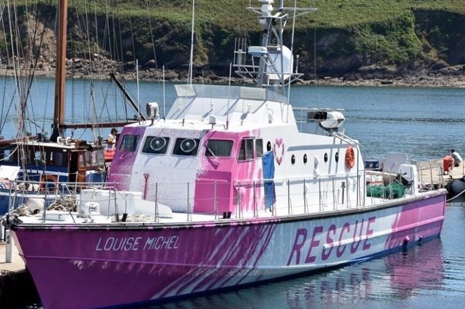

### AYS Weekend Digest 22–23/8/20: Hunger Strikes and Solidarity Protests in UK

Sicilian governor signs propagandistic decree closing all hotspots, but has no power to do it // 104 people rescued by Sea Watch 4 // Louise Michel: New independent rescue ship in the Central Med

 rescue vessel, on route to the Central Mediterranean sea\. \(Photo by [Santi Palacios](https://twitter.com/SantiPalacios/status/1297455565606658048) \)](assets/49ba5121d9ed/1*Xve3z5KE4hWFJlCbHYmC3A.jpeg)

The Stromboli volcano as seen from the Astral, [@openarms\_fund](https://twitter.com/openarms_fund) rescue vessel, on route to the Central Mediterranean sea\. \(Photo by [Santi Palacios](https://twitter.com/SantiPalacios/status/1297455565606658048) \)
#### **Featured: Hunger Strikes and Solidarity Protests in UK**

A group of people from Yemen, Kuwait, Iran and Iraq have been taken from their homes and put into detention at [Brook House](https://www.gov.uk/immigration-removal-centre/brook-house-gatwick) \(contact details in link\) pending their deportations to their arrival countries under the Dublin Convention, despite the widely reported poor conditions in reception countries\. [Detained voices](https://detainedvoices.com/) have managed to conduct interviews with several people some of whom have now been on hunger strike for over a week\.

> On the journey, I was thinking about all I had to endure to get there\. I was thinking about being close to death in the desert and death in the waves\. I felt that like this was the end\. \[…\] 

> We came here and we just want the chance to live and find peace\. And we want to be given the chance to flourish in society\. I have hope that I will be able to get out and I will be treated with justice\. I want to be active and contribute to society here\. 

To name but one situation that these people are fleeing from, Yemen is currently being described as the [largest humanitarian crisis in the world](https://www.hrw.org/world-report/2020/country-chapters/yemen) by human rights groups due to an ongoing civil war who’s birth can be traced back to [British occupation and colonial rule](https://www.bbc.com/news/world-middle-east-14704951) \.

The flights are [scheduled for the 26th and 27th of August](https://morningstaronline.co.uk/article/b/protesters-demand-brook-house-shut-down-migrants-waiting-deportation) , time is running out\.

Protests were held this week by [SOAS Detainee Support](https://web.facebook.com/soasdetaineesupport?_rdc=1&_rdr) and [Lesbians and Gays Support the Migrants](https://web.facebook.com/lgsmigrants?_rdc=1&_rdr) regarding the channel crossings and the death of the Sudanese boy on Tuesday:

> The Tories are once again using refugees as scapegoats for an economic and social crisis of their own making\. Their racist hostile environment practices are currently in full force and as a direct result people — including children — are dying while trying to reach safety in the UK\. There is no migrant crisis\. The UK takes on a minuscule proportion of refugees compared to other countries both in Europe and globally\. Instead of locking up refugee women \(predominately black and brown women\) in Yarls Wood immigration detention centre, they are now planning to repurpose it to lock up refugees who have arrived to the UK by sea, calling them ‘Channel migrants’ instead of refugees\. 

> These are people who have risked death over and over again to reach the apparent safety of the UK\. The Conservative government know what they are doing\. The Home Office knows what it is doing\. Priti Patel knows what she is doing\. When Priti Patel says the death of the Sudanese child who drowned in the English Channel is a ‘tragic loss’ she says so knowing that her policies will kill many more people and leave those who manage to get here stuck in an inhumane asylum process that has proved over and over again to be not only unfit for purpose, but illegal\. She says so knowing that the Tories’ scapegoating of migrants has led to racist, violent attacks on people the moment they land on UK soil\. 

> We gathered yesterday to tell Priti Patel and the Home Office that we stand with the loved ones of the unnamed Sudanese child who died trying to find sanctuary here, that we stand in solidarity with anyone who has had to flee their home and seek a better life in a different country, and that we will never stop fighting against racist borders\. — _Lesbians and Gays Support the Migrants_ 

TUNISIA
#### **Another child has lost their life**

[Aegean Boat Report state](https://web.facebook.com/AegeanBoatReport/) that the body of a small child has been found alone on a beach in Djerba, an island off the coast of Tunisia\.

> Several dead bodies have washed ashore these past few weeks\. Now one ear and the tip of a finger will be removed in hope of one day identifying the little one before the body is placed in a marked grave\. 

> In one week it is five years since Alan Kurdi was found on a beach\. He was not alone, both his mother and his brother were found dead near him\. 

> The whole world cried for Alan Kurdi and we promised «never again»\! 

> The only thing we have done is build a higher fence around Europe’s border making it impossible to seek asylum\. 

> A drowned child, alone on the beach, wrapped in ocean plastic, is the ultimate symbol of our collective neglect\! 

LIBYA

**22 bodies found in desert**

■■■■■■■■■■■■■■ 
> **[Federico Soda](https://twitter.com/fedsoda) @ Twitter Says:** 

> > Today, 22 bodies were retrieved by the Libyan Red Crescent in Zwara, #Libya. 

These painful deaths are the result of the increasingly hardening policy towards people fleeing conflict and extreme poverty, and a failure to humanely manage migration flows. https://t.co/s0oW0EVGwx 

> **Tweeted at [2020-08-23 15:17:18](https://twitter.com/fedsoda/status/1297553507512397830).** 

■■■■■■■■■■■■■■ 

SEA
#### 104 people rescued in the central Med

Between [Saturday evening and Sunday morning 104 people](https://web.facebook.com/seawatchprojekt/posts/2621203854764346) were rescued by Sea Watch 4, just arrived in the central Med\. MSF medics are onboard and are [screening](https://twitter.com/MSF_Sea/status/1297227738449944576) the survivors\. The first boat in distress on Saturday was carrying 7 people and was first [spotted](https://web.facebook.com/seawatchprojekt/posts/2620674618150603) by another newly arrived ship: Louise Michel\. Named after the French anarchist, the ship is a reconverted French custom patrol, repainted by Banksy and its crew include independent international activists, [not affiliated with any NGO](https://www.letelegramme.fr/finistere/crozon/le-bateau-de-sauvetage-louise-michel-fait-peau-neuve-a-camaret-12-03-2020-12524053.php) \.

 \) — Right: Sea Watch Rescue \(photo by [Sea Watch International](https://twitter.com/seawatch_intl/status/1297472642631557121/photo/1) \)](assets/49ba5121d9ed/1*LtgMw4PCjqaE2-QFgnNXSg.jpeg)

Left: Independent Rescue Ship \#LouiseMichel \(photo by [Avvenire](https://www.avvenire.it/attualita/pagine/libia-pe-r-salvare-i-profughi-arriva-la-prima-motovedetta-civile-firmata-bansky) \) — Right: Sea Watch Rescue \(photo by [Sea Watch International](https://twitter.com/seawatch_intl/status/1297472642631557121/photo/1) \)

After spotting the boat in distress the Louise Michel crew [contacted](https://web.facebook.com/seawatchprojekt/posts/2620674618150603) Sea Watch to carry out the rescue\.

On Sunday morning, 97 people were [rescued](https://web.facebook.com/seawatchprojekt/posts/2621203854764346) by Sea Watch 4 from an overcrowded rubber boat\.

GREECE
#### **Evidence of German involvement with push backs in the Aegean**

[Mare Liberum have put together a report](https://mare-liberum.org/en/news/involment-germany-illegal-pushbacks-aegean/) documenting Germany’s complicity in push backs at sea\. They have photographic evidence that the German naval vessel A1411 Berlin, which is under NATO command, has witnessed multiple pushbacks, including instances in which the Hellenic coast guard has purposefully disabled vessels\.

> The German government distinguishes itself by its striking passivity in dealing with blatant human rights violations, while it shows a remarkable degree of commitment when it comes to amending the law to make it impossible for Mare Liberum to monitor human rights\! [\[13\]](https://mare-liberum.org/de/news/germany-detains-ships-of-human-rights-organization-mare-liberum/) Since the beginning of 2020, we have learned about approximately 150 pushbacks, which have deprived 5000 people of their right to apply for asylum\. During the same period, around 71 migrants have died in the Aegean sea [\[14\]](https://missingmigrants.iom.int/region/mediterranean?migrant_route%5B%5D=1377) , at least 5 of them in pushbacks\. Through its behaviour, the German government is also to blame for these deaths\. 

> We demand an investigation of the behaviour of the crew of the Bundeswehr ship A1411 Berlin\! 

> We demand an independent investigation into German involvement in these systematic human rights violations in the Aegean\! 

> We demand an end to the deadly policy of sealing off Europe’s external borders\! 

#### **New Corona Measures brought in for island of Lesvos**

■■■■■■■■■■■■■■ 
> **[Katy Fallon](https://twitter.com/katymfallon) @ Twitter Says:** 

> > 10 new cases on Lesvos today (none in Moria camp yet) - most from Mytilene the main town - bringing it to 37 new cases since August 12th. [stonisi.gr/post/10863/ker…](https://www.stonisi.gr/post/10863/keraynos-me-10-nea-kroysmata-realtime) 

> **Tweeted at [2020-08-22 15:35:47](https://twitter.com/katymfallon/status/1297195774359543810).** 

■■■■■■■■■■■■■■ 

[Local media report](https://www.keeptalkinggreece.com/2020/08/23/lesvos-coronavirus-restrictive-measures/) that the new measures ban the operation of bars, restaurants and entertainment venues from midnight until 7am\. These restrictions will be in place until the 1st of September\.

A maximum of 50 people are allowed to attend events and gatherings\. There are separate measures for restaurants, cinemas and theatres and of course… hotspots such as Moria\.

Other areas under these restrictions are — Crete, Eastern Macedonia, Thrace, Attica, Thessaloniki, Larissa, Corfu, Karditsa, Pella, Pieria, Santorini, Volos, Katerini, Rhodes, Zakynthos and Kos\.

ITALY
#### Sicilian governor attempts to close islands’ hotspot due to ‘invasion’

In a new populist move, right\-wing Sicilian governor Nello Musumeci signed on Saturday a [decree](https://palermo.repubblica.it/politica/2020/08/23/news/entro_le_24_di_domani_i_migranti_fuori_dall_isola_musumeci_firma_l_ordinanza-265271652/) ruling the closure of all hotspots on the island and the transfer of migrants hosted in the structure\. This follows a series of measures by the Governor attempting to put the blame of the spike in Covid\-19 cases on newly arrived people on the move\. It is not clear yet if this new decree will be [implemented](https://www.repubblica.it/politica/2020/08/23/news/sicilia_fonti_viminale_a_repubblica_musumeci_non_puo_farlo_-265276094/) , as hotspots are under national government authority and not regional governors’\. As we reported in past digests, spikes in Covid\-19 cases among people on the move are to be attributed to the lack of quarantine measures on the islands’ hotspots\.

News from the Med [report](https://www.facebook.com/NewsfromtheMed/posts/1018595321927397?_rdc=1&_rdr) that two boats arrived in Lampedusa over the weekend\. They were supposed to be transferred to Sicily, but the Musumeci’s decree could hinder such transfers and worsen the situation on Lampedusa\. At the moment, the small island hosts 1,200 people on the move\. About 1,000 are housed in the hotspot, and 200 are in the house of fraternity of the local parish\.

As Amnesty Sicilia [stresses](https://twitter.com/alswolf/status/1297529613216874497) , the decree is pure propaganda\. It is not applicable, but it serves the governor’s needs to point to an ‘enemy’\. Pietro Bartolo, EMP and doctor in Lampedusa, [commented](https://palermo.repubblica.it/politica/2020/08/23/news/entro_le_24_di_domani_i_migranti_fuori_dall_isola_musumeci_firma_l_ordinanza-265271652/) that the situation on the island won’t get any better without thorough checks and tests for tourists arriving on the island\.

Journalist Eleonora Camilli also [noted](https://twitter.com/EleonoraCamilli/status/1297485957143437313) that the management of Lampedusa and Sicilian hotspots has been “insane”, without any clear protocol\. It will need to be explained why — when arrivals are so low — people have been left in overcrowded structures\.

■■■■■■■■■■■■■■ 
> **[Eleonora Camilli](https://twitter.com/EleonoraCamilli) @ Twitter Says:** 

> > Nota a margine: è la terza estate in cui registriamo numeri di sbarchi al minimo. È la terza estate che parliamo solo di migranti.

Neanche una pandemia mondiale ci ha aiutato a guardare alle vere emergenze. #migranti #coronavirus 

> **Tweeted at [2020-08-23 12:39:09](https://twitter.com/eleonoracamilli/status/1297513708407738368).** 

■■■■■■■■■■■■■■ 

#### Protests and punishment in Brescia reception centre

Over the last week, people on the move housed in the reception centre Pampuri in Brescia [protested](https://www.radiondadurto.org/2020/08/17/brescia-protesta-dei-migranti-al-centro-di-accoglienza-pampuri-situazione-insostenibile-siamo-trattati-come-in-prigione/) against the treatment and the conditions of the centre\. “We are not detainees” is among the slogans\. People housed in the centre have to sign every morning at 6am and every night at 11\.30pm, and every time they leave and re\-enter the centre\. Moreover, protestors says, mattresses are infested with bed bugs and most of the toilets are out of order\.

In retaliation, the direction of the centre, [decided](https://www.radiondadurto.org/2020/08/21/130293/) to transfer 5 of the most active protestors to another centre, far from friends and support networks, and far from their workplace\. Such transfers were [stopped](https://www.radiondadurto.org/2020/08/21/brescia-stop-ai-trasferimenti-dal-pampuri-e-ispezione-sanitaria-nella-struttura-i-risultati-della-lotta/) by a new protest that blocked the gates of the centre, supported by the association Diritti per tutti \(rights for all\) \. A meeting was organised between representatives of the people housed in the centre, the director and public authorities\. At the end of the meeting, public authorities committed to improve hygienic conditions within the centre and to allow transfers only on a voluntary basis\. The director of the centre committed instead to changing the sign\-based system\.

SPAIN
#### **162 people arrived to Gran Canaria safely over the weekend**

[Local media report that](https://www.canarias7.es/canarias/rescatada-patera-inmigrantes-20200823185013-nt.html?fbclid=IwAR3PVgALbReyw9i7oiE2yJBVeQ7E7omE-73m3W2yrhbaEQB7QsBz6O2sSJg) 38 people were rescued 1\.5 nautical miles from Maspalomas beach, in the south of Gran Canaria, by a Spanish Red Cross vessel\. Another 12 people arrived at the beach of Barranco del Vino, in Gáldar\.

On Saturday a further 112 people were also rescued in the waters south of Gran Canaria\.

This was the sixth boat to arrive to the Canary Islands this week, one with twelve survivors and five bodies and another, towed to Arinaga, with fifteen bodies inside\.

So far in August, a total of 127 people have lost their lives or disappeared trying to reach the Canary Islands and 509 have survived\.

> 1 in 5 people trying to reach the island have likely died in the attempt during August\. 

BALKANS
#### **Violence continues in the Balkans**

 \)](assets/49ba5121d9ed/1*C6VnNveWLaURJRSuiQiaUA.jpeg)

\(Photo Credit: [Transbalkan Solidarity Collective](https://transbalkanskasolidarnost.home.blog/violence-against-the-people-on-the-move-must-stop-now/) \)

The Transbalkan Solidarity Collective have [published a statement](https://transbalkanskasolidarnost.home.blog/violence-against-the-people-on-the-move-must-stop-now/) about the recent escalation of violence in Bosnia and Herzegovina:

> The violence in Bosnia and Herzegovina is a direct consequence of the politics of silence, of silent approval, from state level institutions within whose mandate so\-called ‘migration management’ lies\. It is a result of the politics of silence from the international organisations that work in the field of migrations and human rights as well as, primarily IOM, OSCE and Office of the High Representative, but also the Delegation of the EU in the country\. 

> The Transbalkan Solidarity collective demands from the state level institutions and international organisations to put an end to the politics of silence and immediately condemn the violence and put a stop to impunity surrounding these crimes\. We call upon them to ensure a decent, safe and humane environment for the people on the move\. Finally, we call upon the citizens of Bosnia and Herzegovina to resist the normalisation and participation in the violence and criminalisation of the people on the move\. We call for an immediate stop to hate rhetoric, which is grounded in the fear of those that are only seeking safety, or in a nationalistic ideology that once brought permanent destruction to this area\. 

A local volunteer further reports that according to a new regulation, families and unaccompanied minors can’t be transferred to the camps leaving many homeless:

> People have been stranded for days at the roadside near Ključ\. Those who have means to buy bus tickets are returning to Sarajevo, the others are left here, especially families\. We have two people over 65 here, both of them are sick\. Most of them are refugees from Afghanistan\. I understand the frustration of the local people, but we need solidarity now, and a quick reaction from the officials\. 

As these reports come out we have been notified of another death at a Balkan land border\. These policies kill\.

FRANCE
#### Symbolic protests all over France for the release of Ocean Viking

From [SOS MEDITERRANEE France](https://www.facebook.com/sosmedfrance/?__cft__[0]=AZXsZYDVZuANqYUsCFU3h7lApSjfxRtGC_UkPyR2TwibsPxOyucyNfZG8P_WDQJSlLhAv435uDw24awBN6CMAu8gDVmLZuUB_JoAdOV1hS1lCT1h-AnwRT0xr9oPx02cv3cPaw3PydzQcSgwnUaae0MclTJezgB1BoE5lNsjA2pJzw&__tn__=-UC%2CP-R) :

> Through symbolic actions, citizens everywhere in France are mobilizing to demand the release of the Ocean Viking currently held in Sicily by the Italian authorities, and alert the opinion of the dramatic humanitarian situation in the Central Mediterranean\. 

> Yesterday in Lorient, Bordeaux, Concarneau, St Nazaire, Brest\. Today in Frontignan\. 

> You too, sign and share the petition to demand the release of the Ocean Viking\. 

> [https://www\.change\.org/p/lib%C3%A9rez\-l\-ocean\-viking\-2](https://l.facebook.com/l.php?u=https%3A%2F%2Fwww.change.org%2Fp%2Flib%25C3%25A9rez-l-ocean-viking-2%3Ffbclid%3DIwAR2VpdL8X1fbFd4zIhjoUcIQ6U5KwIeQnUOZMJBd9gtWdb0xLk0zCMwcISs&h=AT2-qXVCCwQHOKU472aQgU3E1PBxo5IKFjySrEwqsVz7pFQgTLNHE68RpPkpMr399XR_TKbAQ41na4kBxyOw9ecoo7a9gV3sLhbixh8U5DqBhDlxwI-IUv0n7c0UOpDL20v8djU&__tn__=-UK-R&c[0]=AT3C2joqc49c_FByAMm5t9tjDyluUntoCPoFyKaHwztmQf8pkDLPDQVvK7YSv5yVCr9XOCCfgFbgO8d9tkum6XfLz8OjiExwrSr8ySJCdgeozLYklLdwL3nEpM2bWxMen_WdMtawnnfhi7U3c2hmZQH7QB-htoVUM1dw-xzN7K7tahkXxuzOGsS8H2XcOlE) 

> [\#FreeOceanViking](https://www.facebook.com/hashtag/freeoceanviking?__eep__=6&__cft__[0]=AZXsZYDVZuANqYUsCFU3h7lApSjfxRtGC_UkPyR2TwibsPxOyucyNfZG8P_WDQJSlLhAv435uDw24awBN6CMAu8gDVmLZuUB_JoAdOV1hS1lCT1h-AnwRT0xr9oPx02cv3cPaw3PydzQcSgwnUaae0MclTJezgB1BoE5lNsjA2pJzw&__tn__=*NK-R) 

■■■■■■■■■■■■■■ 
> **[SOS MEDITERRANEE France](https://twitter.com/SOSMedFrance) @ Twitter Says:** 

> > Hier à #Lorient, #Bordeaux, #Concarneau, #StNazaire, #Brest. Aujourd'hui à #Frontignan. Vous aussi, signez et partagez la pétition pour demander la libération de l'Ocean Viking. #FreeOceanViking  
[change.org/p/lib%C3%A9rez…](https://www.change.org/p/lib%C3%A9rez-l-ocean-viking-2)
2/2 https://t.co/3tWvnnj3hY 

> **Tweeted at [2020-08-22 11:01:18](https://twitter.com/sosmedfrance/status/1297126697658089474).** 

■■■■■■■■■■■■■■ 

GENERAL
#### **IOM restarting ‘voluntary return’ flights**

[118 Ghanaian people were returned](https://news.un.org/fr/story/2020/08/1075452) from Libya to Accra, Ghana on Thursday after a five month break in flights due to the pandemic and despite the fact that Ghana is still recording new cases daily\.

WORTH READING
- [**Britain’s Juxtaposed borders: The Human Consequences**](https://www.law.ox.ac.uk/research-subject-groups/centre-criminology/centreborder-criminologies/blog/2019/09/britains?fbclid=IwAR0XRUblTlZH8CIoB8EFvFOCibSeF8s83YATAExx0s7H9Sc4HlXObWyId0o) **by Refugee Rights Europe\.**

> In the context of the recent UK\-French ministerial ‘refugee crisis’ [talks](https://www.theguardian.com/uk-news/2019/aug/30/westminster-looks-at-giving-france-money-to-curb-channel-crossings) regarding attempts by asylum\-seekers to cross the English Channel, it could be argued that the real crisis at hand relates to the alarming array of human rights violations facing prospective asylum seekers at the British border\. 

- [**The Cyprus Papers**](https://www.aljazeera.com/news/2020/08/exclusive-cyprus-sold-passports-criminals-fugitives-200818112722072.html) **by Aljazeera**

> Convicted fraudsters, money launderers and political figures accused of corruption are among dozens of people from more than 70 countries who have bought so\-called “golden passports” from Cyprus, according to a large cache of official documents obtained by Al Jazeera’s Investigative Unit\. 

- [**The Refugee Crisis Is Now a German Superhero Movi**](https://foreignpolicy.com/2020/08/23/the-refugee-crisis-is-now-a-german-superhero-movie/?fbclid=IwAR2HRZ-X9o3PKA6lKmeg_b1-aKC1B5wp2XK2rezBl6CNQGdPEdLEy5v9cAo) **e by Foreign Policy**

> The movie chronicles the crisis from July to November 2015 told through the up\-tempo, behind\-the\-scenes politicking of Merkel, her cabinet, German authorities such as the heads of the federal and border police, and the foreign leaders involved, such as Hungary’s Prime Minister Viktor Orban\. 

- [**BOAT MIGRATION ‘PUSH\-BACK’ WILL NEVER BE THE ASYLUM SOLUTION**](https://newint.org/features/2020/08/22/boat-migration-push-back-will-never-be-asylum-solution?fbclid=IwAR08kG7UbnPIz3T-vGV1J8HgD_sPGlE7zsXpSpDEMGV0bLguj9burBHTFFk) **by New Internationalist**

> Those looking for explanations for the recent rise in boat migration across the English Channel can find some answers near the dark blue Aegean Sea that divides Europe from Asia\. Ruthless new anti\-migrant measures are transforming the dynamic at the Greek\-Turkish border, and empathy for sea\-faring asylum\-seekers has declined at both a state and continental level\. 

**Find daily updates and special reports on our [Medium page](https://medium.com/are-you-syrious) \.**

**If you wish to contribute, either by writing a report or a story, or by joining the info gathering team, please let us know\.**

**We strive to echo correct news from the ground through collaboration and fairness\. Every effort has been made to credit organisations and individuals with regard to the supply of information, video, and photo material \(in cases where the source wanted to be accredited\) \. Please notify us regarding corrections\.**

**If there’s anything you want to share or comment, contact us through Facebook, Twitter or write to: areyousyrious@gmail\.com**

_Converted [Medium Post](https://medium.com/are-you-syrious/ays-weekend-digest-22-23-8-20-hunger-strikes-and-solidarity-protests-in-uk-49ba5121d9ed) by [ZMediumToMarkdown](https://github.com/ZhgChgLi/ZMediumToMarkdown)._
