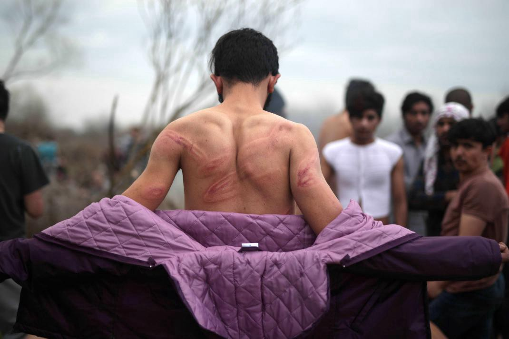
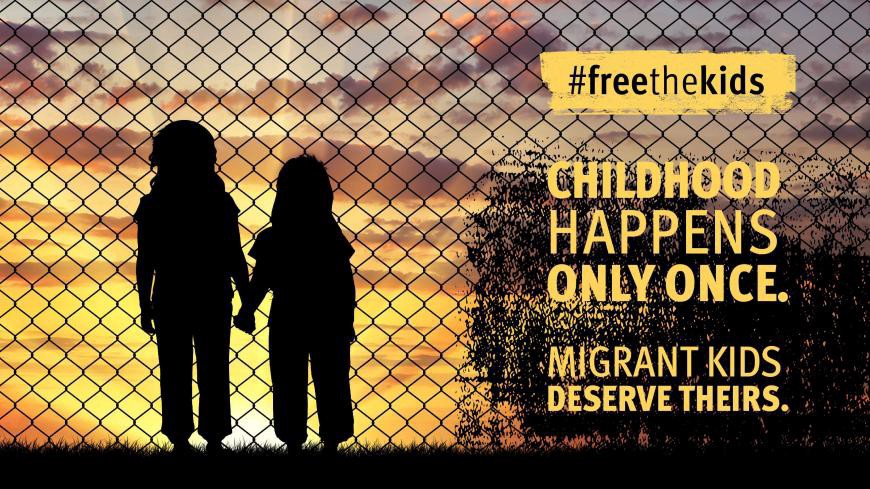
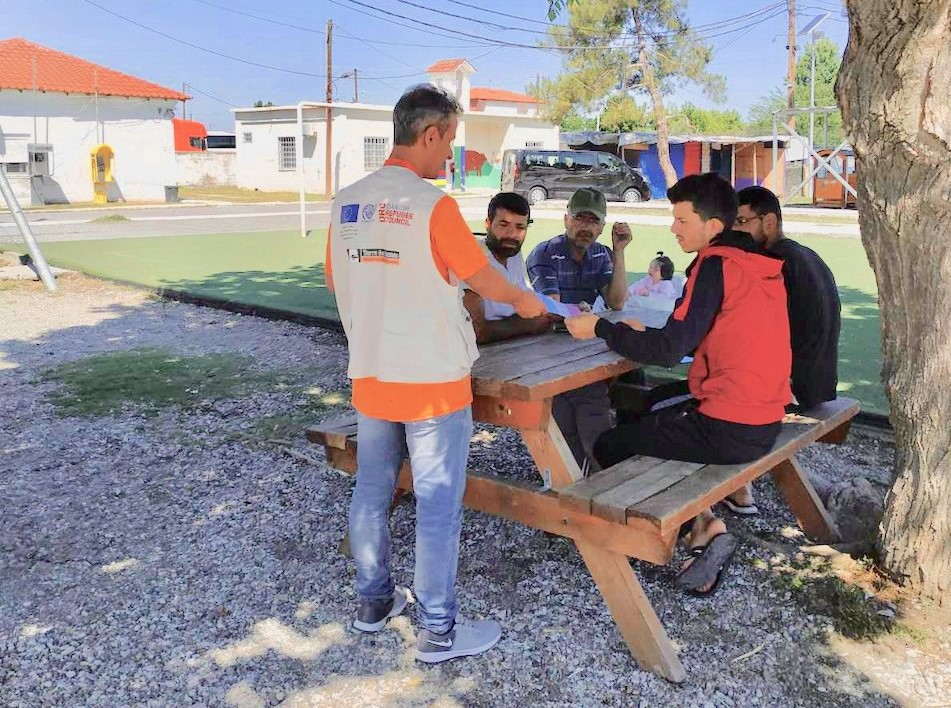

### AYS Daily Digest 24/08/20 Racist attack in Thessaloniki

[Are You Syrious?](@AreYouSyrious?source=post_page-----641fee6ac52d----------------------)

[Aug 25](ays-daily-digest-24-08-20-racist-attack-in-thessaloniki-by-violent-reoccurring-group-641fee6ac52d?source=post_page-----641fee6ac52d----------------------) · 10 min read

_Alarm Phone accounts for 4 shipwrecks last week // devastating insight into Petrou Ralli in Greece // COVID positive tests in Lampedusa // and more…_

### FEATURE: RACIST ATTACK AGAINST ONE MAN BY GROUP OF 16 IN THESSALONIKI

Activists close to AYS report that the attack left the man in severe condition\. In a summary they report:

> _“At 1 am of the 22nd of August, a 22 year old man from Algeria was caught by 16 people while crossing the street in Kamara, Thessaloniki\. The respondent affirms he was going on his own to buy some pizza from Navarino pizza shop and suddenly this group of people came to him, and started insulting and beating him with baseball sticks, belts and knives\. He was severely injured in the head and superficially in the right leg\._ 

> _“The 16 persons were wearing black clothes and masks, with no particular signs or writing\. A woman was involved\. The respondent affirms that this is a known group of racists who often beat immigrants and foreigners\.”_ 

This group seems to be at least part of the growing racist tensions in Northern Greece\. But the man not only faced abuse from the group; the police were of no help\. They did not ask him any questions and mocked him\. How were they able to “file a report” if this is all they did?

> _“When the ambulance arrived, the group left\. Three policemen came too with three motorbikes, but they didn’t ask him anything\. The respondent affirms that the police just looked and laughed at him, and when he said in which direction the group went, the police left but took another direction\. He was then assisted by the ambulance, and brought to the hospital\.”_ 

Also it needs to be known that the police and ambulance arrived BEFORE the racist group actually left and saw from a distance that they were beating the man up\. The respondent says that the police are “afraid” of these people and know that they go around violently attacking refugees and immigrants\. He was treated well once he got into the ambulance\. But his translator told AYS’ contacts that:

> _“So, he said the…always, the police always afraid from them…Same with the ambulance, so yeah, he said I have like 2 years here and he know them…They…so he said I see too many cases like mine, now\. And, like, always the police stay away\. Far away from the case\. So, when this 16 persons from racist Greek, like leave, and the ambulance came, and the police too…Also the police came with the ambulance, they was far away and when they see the people, this people leave, they came to him\. And he said like, they was like laughing, and they was happy because I’m beaten from them\.”_ 

Horrible\. If the local police are not going to protect people against racist attacks, federal authorities and or someone else must step in\. Racism in Greece cannot continue to grow unchecked\.
### SEA

[Sea Watch](https://thecivilfleet.wordpress.com/2020/08/24/release-the-civilian-rescue-ships-sea-watch-4-urges-after-saving-more-than-200-lives-in-under-48-hours-in-the-central-mediterranean/?fbclid=IwAR0_pysoYZtYMHwAklZbQX3eR3FaYls5H3Q_KBHXVrljL-Zil-rB3z4hMwU) said in a statement on Monday:

> _“We are happy to have more than 200 people safely on board the Sea Watch 4, but for the people who drowned last week in the Mediterranean Sea, any help came too late\. If European states had not detained civil rescue ships with absurd allegations, these people might still be alive\._ 

> _The European Union and its inhuman actions are solely to blame for these deaths\.”_ 

**Release ALL civilian rescue ships\!**
### AlarmPhone reports of four shipwrecks in one week off Libya

Between August 13th–20th, [Alarm Phone](https://twitter.com/alarm_phone/status/1297802930263863297) received calls from ~900 people on 14 boats:
- ~100 were returned to Libya
- ~540 reached Europe
- 100\+ people died or went missing
- 160 people’s fate remains unknown

Alarm Phone also outlined the four shipwrecks\. The exact measures they took can be found in [this report](https://twitter.com/alarm_phone/status/1297802930263863297) \. The shipwrecks took place over four deadly days:
- The first \(16–17\.08\) “\(This\) was not just a shipwreck\. People were shot at by a group of five men, their boat caught fire, and 45 people were killed\. Those who did survive are alive only because a local fisherman rescued them\. We collected some of of the survivors’ voices\.”
- The second \(18\.08\) “Of the ~95 people on board, just 65 survived\. While we were on the phone with the people, a tube burst\. After this sound came only silence as we failed to reconnect with the boat\. We raised the alarm with all authorities, to no avail\.”
- The third \(15\.08\) “Through calls from relatives & survivors, we learned of two more shipwrecks” \(this and the fourth\) \. This \(one\) was reported by the presumed only survivor of a wooden boat with 40 people on board\. He said the boat sank off the Libyan coast on 15\.08 and everybody drowned\. He was rescued by a fisherman\.”
- A fourth \(18\.08\) “\(This one\) was reported off Tunisia\. 18 people left Jdareya, three people drowned, and 15 were rescued by the Tunisian Coastguard, close to Tunisia\.”

[Alarm Phone](https://twitter.com/alarm_phone/status/1297992487571775488) also reported on Monday of a disturbing call they received from the eastern Mediterranean\. A total of 44 people were off the coast of Lesvos and for about 12 hours Alarm Phone lost contact with them\. Then hours later when they reestablished contact:

> _“The people on the boat … told us that they were beaten by masked men & forced to return to Turkey\. The person we spoke to said: ‘What the Greeks did to us was not human\.’”_ 

We all need to condemn this state\-enacted violence\. Greece is breaking international law and getting away with it daily\.
### GREECE

**In news for Lesvos:**
- [Mare Liberum e\.V](https://twitter.com/teammareliberum/status/1297913673323872256) is reporting “that three fascists from Germany have been spotted on Lesvos and also several times in Moria pretending to be journalists\. One of them is apparently Severin Köhler, from the youth group of the racist German party AFD\.” **If you’re on Lesvos, please be on the lookout\!**
- There was yet another fire in Moria on Sunday\. A resident told [Dunya Collective](https://twitter.com/DunyaCollective/status/1297860139249213440) “We have a fire here every two or three days near the camp\.” The list of reasons why Moria is unsafe continues to grow\.
- [Mission Lifeline](https://twitter.com/SEENOTRETTUNG/status/1297815120878370816) reported on a protest in Moria due to people “who have a ‘blue stamp’ on their ID card are allowed to move freely within Greece and drive to the mainland in Athens\. But many people have had their blue stamp for 18 \( \! \) months, but are still prisoners\.”

The Solidarity Initiative for Petrou Ralli released a statement on Sunday from one of the prisoners in Petrou Ralli dentention centre\. It’s tough to read, because it articulates a lot of violence from guards, people having horrible illnesses that are going untreated, and children being forced to take medicine with no understanding of why\.

The women in the camp have been gone for 20 days because they were transferred due to the sexual assaults they were facing by the Greek guards\. You can read the full report [here](https://invisibleradio.blackblogs.org/el/2020/08/23/%CE%BC%CE%AE%CE%BD%CF%85%CE%BC%CE%B1-%CE%B1%CF%80%CF%8C-%CF%84%CE%B7%CE%BD-%CF%80%CE%AD%CF%84%CF%81%CE%BF%CF%85-%CF%81%CE%AC%CE%BB%CE%BB%CE%B7-23-8/?fbclid=IwAR0kEmj3alDLgcLFtcG6931W5cst1DtQCDbtB4HzMbOs83Rt1-iQ9wE0GOs) \.

> _“Police have been free to intensify violence & torture against men\. There is an urgent need for solidarity\!”_ 

[Greece](https://uk.reuters.com/article/uk-greece-turkey-fence/greece-to-extend-fence-on-land-border-with-turkey-to-deter-migrants-idUKKBN25K1V7?fbclid=IwAR103kzOhxkeKfGC13vtuxZNuzIBpN7Q15kHNokcG2Ty4b5hMwqJ_MSqDsU) is going to extend its land border fence with Turkey soon\. The announcement came on Monday but the decision was made earlier this year\. There is no way around it: borders kill\. This decision is bound to create a more hostile environment that in many ways won’t work as intended\.
### ITALY
### 58 new positive COVID test results on Lampedusa

This news comes as [38 people](https://www.agrigentonotizie.it/cronaca/lampedusa-test-positivi-migranti-hotspot.html?utm_source=dlvr.it&utm_medium=twitter) have already tested positive in recent days\. As Jolie Rouge aptly puts it:

> _“In Lampedusa, the authorities, in order to prevent the freedom of movement of people, choose to segregate 1000 in a hotspot that could contain 100 \(and already in poor sanitation conditions\), thus causing chain infections\. Apartheid comes before health protection\.”_ 

The 603 people who were stuck in quarantine for two weeks aboard the GNV “Azzurra” have all been tested for COVID\. All the tests came back negative and the people were disembarked in Trapani\. Learn more [here\.](https://www.trapanisi.it/sbarcano-a-trapani-dalla-gnv-azzurra-i-603-migranti-che-hanno-terminato-la-quarantena-video/?fbclid=IwAR3QDNnnQgvEr_sdap9Y3ccbki5Oa5jMEzyCQ0DTI1KaI0Zbhu6fdqO0uuc)
### BALKANS

In a report on the Balkan route, France 24 says “Some 30,000 refugees and migrants were registered in Serbia in the first half of 2020, almost three times the number for the same period last year, according to official data\. Among them, 1,200 are minors travelling alone, the youngest just seven years old\.” Read more [here](https://www.france24.com/en/20200824-childhood-packed-in-a-rucksack-young-refugees-at-risk-in-the-balkans?fbclid=IwAR2TMtGxhtYYnd6Ev70EwO4C3oaLFthLqmo1Xiz9l7H5MvFfvfPuYy2JcvE) \.
### GERMANY

On Monday the Refugee Law Clinic Berlin \(RLC Berlin\) launched its Access To Justice campaign in order to promote the legal tool [IHaveRights](https://ihaverights.eu/?fbclid=IwAR00xmJwA15czht7M1gZxt9giehfGEgfUDB9P8VqHTz0F_1cIkKO1jE6Mpk) :

> _“IHaveRights is a website for streamlining requests for interim measures to the European Court of Human Rights \(ECHR\) in order to protect the human rights of asylum seekers on Samos\. The ECHR has already granted 42 out of 49 requests such as an interim measure for a pregnant refugee woman to be moved from a camp to an apartment in Samos\. We invite anyone knowing or working with asylum seekers to share this legal tool with those who might be in need of better access to justice\._ 
 

> _IHaveRights was created during the corona\-lockdown and aims to give people access to justice who, due to the restriction of their freedom of movement, cannot establish personal contact\. IHaveRights is therefore an important addition to the legal information offered by RLC Berlin on Samos\.”_ 

### Two analyses on Germany knowing of pushbacks, but not acting against them, are worth your read

The first is from State Watch in regard to German naval deployments seeing Greece push people back to Turkey \(read in full [here](https://www.statewatch.org/news/2020/august/german-naval-deployments-sit-back-and-watch-illegal-deportations-by-the-greek-authorities/?fbclid=IwAR3d-KYzZSlh6CxoauBbMKgZjqdAW5-JWGgkl2wYra-SJt3G1kPle1ZiJFs) \):

> _“In response to parliamentary questions, the German Defence Minister has admitted knowing that migrants and refugees have been pushed back to Turkey by the Greek authorities\. Two incidents were observed by German naval vessels, but the fact that they did not intervene to halt the illegal deportations makes Germany equally culpable, says the MP who filed the questions\. The admission comes after months of increased illegal deportations by Greece\.”_ 

The second is from Matthias Monroy, who wrote about how disembarking refugees in Libya is a crime under German law but prosecutors are not doing anything about it:

> _“The disembarkation of rescued refugees in Libya is punishable under German law, including for merchant ships\. This is documented by a Bundestag assessment\. However, the Foreign Office and the public prosecutors are not interested in pursuing captains and shipowners\._ 

> _When asked whether it has itself observed such a case and initiated criminal investigations, the German Foreign Office responded with conspicuously empty words, writing that it is „strongly committed to compliance with applicable international law“ when dealing with „relevant actors“\. However, this was not what was asked, but rather criminal liability according to German law\._ 

> _The German government will not be able to restrain itself for a long time on this issue, because the violations are now also being prosecuted in other countries\. The public prosecutor’s office in Naples wants to put the captain and the operator of the Italian flagged merchant ship „Asso Ventotto“, which brought more than 100 rescued persons to Tripoli in July 2018 and handed them over to the Libyan coast guard, on trial\.”_ 

Read the full piece [here](https://digit.site36.net/2020/08/24/shipowners-are-not-allowed-to-bring-refugees-back-to-libya/?fbclid=IwAR1iyvMjTUuGEhv3B3dqjYVOQN1qOybhU4E9DpdW6QyTs37DNQlkWqU7c80) \.
### FRANCE
### The body of Abdulfatah Hamdallah who drowned trying to cross the English Channel has just now been buried in Calais\.

He was a refugee from [Sudan](https://www.theguardian.com/uk-news/2020/aug/24/drowned-sudanese-refugee-abdulfatah-hamdallah-is-buried-in-calais?fbclid=IwAR3sn_aWDvJdzW7kMqYe2gvRX88tH7Fxfpa84bbMNzlJu1Si6yeupU9cZns) , but his parents gave permission for him to be buried in France because with COVID restrictions, it would have taken three months for his body to reach Sudan\. His funeral on Monday was attended by 150 fellow Sudanese\. His drowning should have never happened\. Despite the fact that he couldn’t swim, he felt compelled to take the risk because of the horrible environment in France\.
### UK

The non profit organization [Detention Action](https://www.huffingtonpost.co.uk/entry/channel-migrants-asylum-children-kent_uk_5f43bc24c5b6763e5dc5e7a9?fbclid=IwAR09cfFM9yTxBhW1U72XlZegK8OUPPeZwuMBnsNeLr-L58yF0QOE2aIjnuE&guccounter=1&guce_referrer=aHR0cHM6Ly9sLmZhY2Vib29rLmNvbS8&guce_referrer_sig=AQAAAG3AWECfdDurHUOr6xt0LVzQTuhInE1BwcqH6pJRkcfKAcfTcuM4P-nxuX7bP8lmEIb3uJEg-sRPFSVhrr202KnS0AVw2x8QwdIDTayiTPbBvMVvLxjE0MskQ9hD5FjlGJNmiDXcrQKA_Qv3j9gJPQL3bRv1y8tN8NB0F942dBeT) sent a letter to the Home Secretary about just how “flagrant” a breach of the the law it is to hold unaccompanied minors in detention\. Their director Bella Sankey said:

> _“Children who have fled the world’s most dangerous situations and made it to the UK without their parents deserve immediate protection and support\. However, children in this situation now face effective detention by the UK Border Force for an unknown length of time in an apparent flagrant breach of UK law\. This should be unthinkable in the UK in 2020 and is why Detention Action has written to the Home Office and Kent County Council for urgent clarification about the present situation and we await their responses with interest\.”_ 

You can find their petition [here](https://twitter.com/DetentionAction/status/1297901896632610819) \.

[Detention Action](https://detentionaction.org.uk/2020/07/24/morton-hall-immigration-detention-centre-to-be-closed/) also released a report on Monday about how Morton Hall immigration detention centre will be closed by 2021\. They welcome this as it has _“the potential to reduce the capacity of the detention estate by nearly 400 people\.”_

> _“In recent months, following Detention Action’s legal challenge over COVID\-19, close to 1,000 people have been released from UK immigration detention centres\. These mass releases have shown just how unnecessary widespread prolonged detention really is\. We hope that the decision to close Morton Hall reflects Government beginning to acknowledge this fact\.”_ 

**Find daily updates and special reports on our [Medium page](https://medium.com/are-you-syrious) \.**

**If you wish to contribute, either by writing a report or a story, or by joining the info gathering team, please let us know\.**

**We strive to echo correct news from the ground through collaboration and fairness\. Every effort has been made to credit organisations and individuals with regard to the supply of information, video, and photo material \(in cases where the source wanted to be accredited\) \. Please notify us regarding corrections\.**

**If there’s anything you want to share or comment, contact us through Facebook, Twitter or write to: areyousyrious@gmail\.com**
### Sign up for AYS Daily Newsletter
### By Are You Syrious?

Daily news digests from the field, for volunteers, people on the move, journalists, and the general public [Take a look](/are-you-syrious/newsletters/ays-daily-newsletter?source=newsletter_v3_promo--------------------------newsletter_v3_promo-)

_Converted [Medium Post](https://medium.com/are-you-syrious/ays-daily-digest-24-08-20-racist-attack-in-thessaloniki-44aac940ab18) by [ZMediumToMarkdown](https://github.com/ZhgChgLi/ZMediumToMarkdown)._
