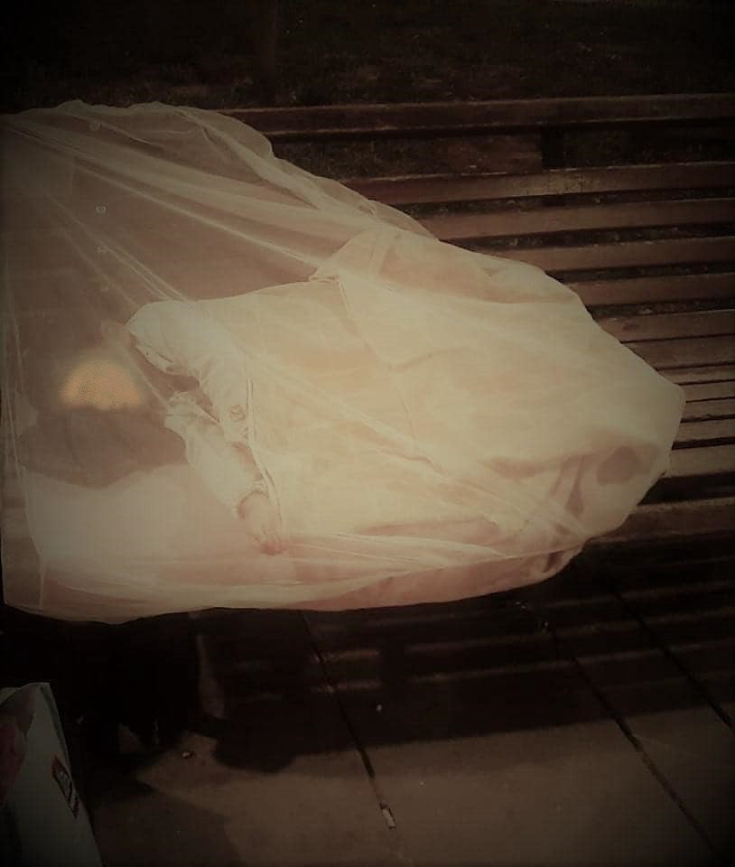

### AYS Daily Digest: 26/08/2020: Suicide attempts in infamous removal centre in UK
#### Hunger strike in PRO\.KE\.K\.A pre\-removal detention centre // refugee\-led organizations in Moria need support // SeaWatch 4 rescued more than 200 people // 27 people stuck on Etienne merchant vessel for more than three weeks now

Child in Trieste, at the end of the Balkan route\. Copyright: Lorena Fornasir
### FEATURE: Despair in infamous Removal Centre in UK

According to the British journalist Ben Smoke, eight people who have been detained at the Brook House removal centre attempted to commit suicide\. In the centre close to Gatwick airport, people who the Home Office is trying to deport are being detained\. The eight Yemeni men who now attempted suicide are supposed to be deported to Spain and Germany\. They face deportation under Dublin regulations, like the rest of the 22 people do who are currently on hunger strike\. According to the journalist, after being deported to European countries under the Dublin scheme, many of them face deportation to Iraq, Sudan and Yemen\. Since some European countries do not currently deport in these countries but might still reject the asylum application, those people await an endless limbo between temporary residence permits and deportation\. One of the hunger strikers:

> “We are Yeminis and were detained here in Brook House\. Our country is going through a war\. We left Yemen to escape persecution and war and to avoid death and to come to a country that is safe, where we can live safely and healthily without fear of persecution\.” 

Brook House Immigration Removal Centre became infamous in 2018 when a BBC Panorama investigation published video footage of guards physically and verbally mistreating inmates\. The centre was at that time run by G4S, one of the biggest security services in the world\. 
A public inquiry into how such abuse was tolerated at the removal centre was opened in April and is chaired by Kate Eves\.

You can sign this petition in order to stop the deportations:

■■■■■■■■■■■■■■ 
> **[SOAS Detainee Support (SDS)](https://twitter.com/sdetsup) @ Twitter Says:** 

> > The Home Office is going ahead with deportations of asylum seekers this week and next week- please sign and share this petition demanding the cancellation of the charter flights #brookhouseprotest #canceltheflights #enddeportations [you.38degrees.org.uk/petitions/canc…](https://you.38degrees.org.uk/petitions/cancel-the-charter-flights-2) 

> **Tweeted at [2020-08-26 08:02:46](https://twitter.com/sdetsup/status/1298531318263877632).** 

■■■■■■■■■■■■■■ 

For more information on the public inquiry, see:

### CYPRUS

On Wednesday morning, a boat with 19 Syrians landed on Cyprus\. The people were tested for coronavirus and then taken to a migrant camp in Lefka\. 
Meanwhile the mayor of the town Paphos reacted to the fact that refugees and migrants are being exploited by “landlords” in the city\. Shops with an area of around 25 square meters are being rented out to big numbers of people on the move as accommodation\. In some cases the people have also been used as cheap labour\. According to the mayor Phedonas Phedonos, the “landlords” would charge the tenants around €300 each per month while letting them live in absolutely appalling conditions\. He declared this situation unacceptable\.

For more information, see:

### GREECE

About 60 detainees at the PRO\.KE\.K\.A pre\-removal detention centre in Moria went on the second hunger strike this year\. The people are being detained in order to be deported to Turkey\. But since deportations stopped due to the coronavirus pandemic, these people have been held at the detention since the beginning of March\. The first hunger strike of detainees that was held in April ended after a special police unit interrogated the strikers, beating a number of them\. It is unclear until now what exactly happened, as many of the affected people do not dare to speak about it\. Suicide attempts and beatings by the guards are a common occurrence\.

Follow _Deportation Monitoring Aegean_ for updates\.

Three refugee\-led organizations at Moria camp need financial support\. The three groups have done immense work to keep the residents of Moria safe and the camp itself clean\. Stand By Me Lesvos calls for their support\. These are the groups:

> **MORIA CORONA AWARENESS TEAM:** Moria Corona Awareness Team \(MCAT\) was created by residents of the camp with the goal of focusing on the education of the communities within the camp on the importance of good hygiene and implemented a process for bottle recycling and the distribution of clean water\.
 

> **MORIA WHITE HELMETS:** Created over a common cause and frustration with the conditions inside camp\.
 

> Waste Removal: Waste management systems and rubbish collection points have been established and maintained by MWH daily to keep Moria as clean as possible\.
 

> First Aid: with limited medical access at night and no night clinic, members of MWH and MCAT in cooperation with Stichting Bootsvluchtinge are completing first aid training, equipping them with life\-saving skills that are desperately needed\. 
 

> **MORIA ACADEMIA:** Offers language education for children, women, and men, equipping people with the necessary skills to integrate into their new community and begin their life in new locations\. The previous version of Academia was sadly lost to looting and fire over the winter months, but we have been hard at work to secure a new location and are currently in the design process\. 

You can support them here:

Once again the Greek police expelled people on the move from Victoria Square in Athens\. This is a common practice these days\. People arrive from the islands after being expelled from the camps and have no where to go\. From Victoria Square where they find some basic kind of support structure, they will be evicted by the police\. Longstanding solutions are needed, especially since summer is coming to an end\.

Two journalists have been victims of bullying by the police after trying to collect evidence of an incident of police violence they randomly witnessed\. They were held in miserable conditions and no protective measures against the spread of coronavirus were being taken\. 
Their lawyer says this is:

> “a shocking case of abuse of power and police arbitrariness that calls into question the constitutional freedoms and principles of democracy — namely freedom of expression and information and the principle of respect for human dignity without discrimination,” \(GT\) 

For more information, see here:

### CROATIA

Two Croatian police officers were charged with violence against people on the move\. One of them, a 35\-year old man, struck a migrant from Afghanistan several times with his fist and feet\. The other one, a 27\-year old man, was present but did not report this incident\. The incident took place in June\. 
Violent pushbacks from Croatia to Serbia and Bosnia and Herzegovina are an ever\-present practice\. Asylum Protection Serbia reported yesterday that a group of 20 people was pushed back by Croatian police some days ago\. Croatian police officers beat them with batons and took their phones and all the money they had with them\.
### SERBIA

At the Subotica reception camp in Serbia, conditions are very difficult\. Families with small children are still housed in tents\. During a rainy night, the tent of a family with a nine\-month\-old baby was soaked with rain\. There is a great need for humanitarian aid\. Asylum Protection Serbia is trying to provide not only hygiene and humanitarian aid, but also emotional support and counseling for families\. 
Asylum Protection Serbia also reports that about 100 people are pushed back every day from Hungary\. The Hungarian police make extensive use of batons, pepper spray and attack dogs\.

■■■■■■■■■■■■■■ 
> **[Azil u Srbiji Asylum Protection in Serbia](https://twitter.com/APC_CZA) @ Twitter Says:** 

> > Horgoš. Mađarska policija pojačala prekomernu upotrebu sile,koristeći pendreke, biber sprej, huškanje pasa, uništavanje telefona. Svakodnevno se oko 100 migranata nasilno gura nazad u Srbiju, najveći broj kod Horgoša. https://t.co/f5JlRM3OuT 

> **Tweeted at [2020-08-26 09:11:03](https://twitter.com/apc_cza/status/1298548500414828544).** 

■■■■■■■■■■■■■■ 

At the same time, about 100 people are entering Serbia daily from North Macedonia and Kosovo\.
### SEA

News from _SeaWatch 4_ : The ship has now more than 200 people on board\. They were rescued in three different operations\. A teenager had to be evacuated because of extensive fuel burns that could not be treated on board\.

■■■■■■■■■■■■■■ 
> **[Sea-Watch International](https://twitter.com/seawatch_intl) @ Twitter Says:** 

> > ⭕ A teenage boy was just evacuated from the #SeaWatch4 by Italy's @[guardiacostiera](https://twitter.com/guardiacostiera). He suffers from extensive fuel burns and was treated by the #MSF team on board but needed to be transferred to a hospital on land. Meanwhile, we're still waiting to be assigned a safe port. https://t.co/EurRPm9Vtj 

> **Tweeted at [2020-08-26 13:48:36](https://twitter.com/seawatch_intl/status/1298618349149196291).** 

■■■■■■■■■■■■■■ 

Fuel burns are very common amongst the survivors of attempted sea crossings\.

> “These chemical burns are caused by the mixture of fuel & salt water which is highly corrosive\. The resulting wounds caused can be significant, highly painful & pose a high risk of infection\.”, 

says Sea Watch International\.

On the merchant vessel Etienne, sailing under the Danish flag, there have been 27 people stuck for over three weeks now\. This is the longest standoff on the Mediterranean so far\. The people were rescued when in distress on 4 August by the crew, upon the instructions of the Maltase authorities\. The ship lies off the coast of Malta waiting for permission to enter the port and disembark the survivors\.
### ITALY

In the norther Italian area of Milan, Italian authorities uncovered systematic illegal labour exploitation of migrants\. Seven people are under investigation for systematic illegal farm labour exploitation of about 100 migrants\. The workers were paid €4\.5 an hour, worked nine hour shifts, were without any protections against the spread of coronavirus and were not paid at all for a two\-day trial period at the beginning of their deployment\.

For more information, see:

The standoff between the island of Sicily’s regional president Nello Musumeci and the federal government in Rome continues\. Right\-wing politician Musumeci has announced the closure of all refugee centres and hotspots on the island and plans to send the people to the mainland\. At the same time he wants to block any migrants from landing on the island\. He argues that only be doing this he can protect the health of Sicilians\. Once again we see the coronavirus pandemic being used to justify racist ideology\.
The government in Rome says that Musumeci’s decree has no legal base, since migration politics lies in the national jurisdiction\. According to the media, the government has appealed to the administrative court in Palermo against Musumeci’s decree\.
### GERMANY

Twenty\-eight children and their families coming from the Greek islands landed Germany\. The group of 121 people has been relocated under the European relocation effort\. Germany’s interior minister, Horst Seehofer, rejected the plans of two German states to take in more people than agreed upon under the federal relocation agreement, provoking sharp criticism\.

For more information, see:

The NGO Seebrücke is organizing a new campaign in order to make the commune’s wish to take in more refugees from the Greek islands visible\. On 5–7 September, people will be called upon to place empty chairs in front of town halls\.

> “The chairs should symbolize our capacity and readiness to receive more refugees\.” says Seebrücke\. 

There have been 172 German cities registered as ‘safe harbors’\. These cities are willing to accept more refugees than they have to under the federal relocation scheme\.
### EU

ECRE published the study “The implementation of the Dublin III Regulation in 2019 and during COVID\-19”\. It provides an update of developments in legislation, policy and practice relating to the application of the Dublin III Regulation in 2019 and the first half of 2020 based on up\-to\-date statistics, practice developments, and case law\. Even before the pandemic, the Dublin regulation was not meeting its objectives\. Emergency measures that have been implemented in the first half of 2020 in order to stop the spread of the coronavirus further undermined the Dublin regulation\. At the same time, the costs of Dublin are high for people on the move\. They are often left in a prolonged state of limbo; forcibly transferred if and when transfers are implemented; and subject to pre\-removal detention\. Access to asylum procedure was effected negatively in the course of the pandemic\. 
The Dublin III Regulation sets out the criteria and procedure for determining which Member State is responsible for an asylum application\. It is highly contentious, as it not only ignores the interest of people on the move, but is also very unbalanced in favour of central European countries\. 
Find the study here:

■■■■■■■■■■■■■■ 
> **[ECRE](https://twitter.com/ecre) @ Twitter Says:** 

> > #AIDA Different figures, same conclusions: ECRE's report on the implementation of the Dublin III Regulation in 2019 and during COVID-19 shows that Dublin III is not working in practice, resulting in unnecessary, lengthy, and costly procedures: [bit.ly/31rIMCy](https://bit.ly/31rIMCy) https://t.co/nrV3brtmqB 

> **Tweeted at [2020-08-26 10:35:42](https://twitter.com/ecre/status/1298569803960066049).** 

■■■■■■■■■■■■■■ 

Statewatch published a study that critically examines the recently introduced and forthcoming EU measures designed to increase the number of deportations carried out by national authorities and the European Border and Coast Guard Agency, Frontex\.

> “It focuses on three key areas: attempts to reduce or eliminate rights and protections in the law governing deportations; the expansion and interconnection of EU databases and information systems; and the increased budget, powers and personnel awarded to Frontex\.” 

You can find the report here:

### GENERAL

UNHCR has published the manual _Procedural Standards for Refugee Status Determination under UNHCR’s Mandate_ \.

You can find the manual here:

### WORTH LISTENING TO / EVENT

On Friday, Latitude Adjustment Podcast will host a live broadcast at 6 pm CET\. Co\-hosts Eric Maddox and Laila Mokhiber will talk to Anwar Alomaisi, a man who was deported in February without warning to his home country of Yemen\. Anwar had spent 22 years in the US, was an accomplished wildlife photographer and a volunteer with his local fire department in the NYC area\. For over two decades he always checked in monthly with immigration officials, but earlier this year he was deported with no opportunity to see his attorney or to say goodbye to his family\.
Please check out Latitude Adjustment Podcast on Facebook\.

**If you wish to contribute, either by writing a report or a story, or by joining the info gathering team, please let us know\.**

**We strive to echo correct news from the ground through collaboration and fairness\. Every effort has been made to credit organisations and individuals with regard to the supply of information, video, and photo material \(in cases where the source wanted to be accredited\) \. Please notify us regarding corrections\.**

**If there’s anything you want to share or comment, contact us through Facebook, Twitter or write to: areyousyrious@gmail\.com**

_Converted [Medium Post](https://medium.com/are-you-syrious/ays-daily-digest-26-08-2020-suicide-attempts-in-infamous-removal-centre-in-uk-b9b4bb91ca46) by [ZMediumToMarkdown](https://github.com/ZhgChgLi/ZMediumToMarkdown)._
