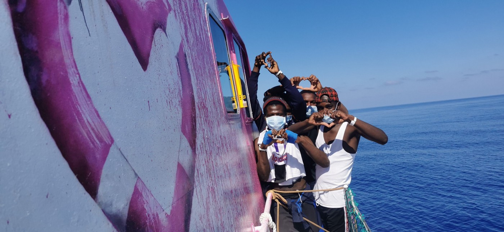

### AYS Daily Digest 28/8/20 \-Malta Punishing Boats for Rescuing Refugees

[Are You Syrious?](@AreYouSyrious?source=post_page-----74a60d90d7a----------------------)

[Aug 29](ays-daily-digest-28-8-20-malta-punishing-boats-for-rescuing-refugees-74a60d90d7a?source=post_page-----74a60d90d7a----------------------) · 13 min read

Deaths after illegal pushbacks in Bosnia // Banksy’s Search\-and\-Rescue ship // Far\-right groups ‘migrant hunting’ in the UK // 130 people stranded at Sea

Photo of the [\#LouiseMichel](https://twitter.com/hashtag/LouiseMichel?src=hashtag_click) after 89 people were rescued\. \(Photo Credit: twitter\.com/MVLouiseMichel\)
### Feature

[Twenty\-seven migrants](https://www.infomigrants.net/en/post/26924/migrants-stranded-at-sea-for-more-than-3-weeks?fbclid=IwAR11ia2VBEOBJl-C5ilQAKIWh0hPuAr1qEBzS7vn1uKbtSlYS5qdSsBm91A) who were rescued by the cargo ship _Etienne_ on August 4 after its crew was alerted to the distress call by migrant rescue organization _Sea\-Watch_ have been stuck on the ship for more than three weeks\.

Since August 4th the ship has been anchored off the shores of Malta waiting for permission to disembark the people who it rescued\. _Sea\-Watch_ has described the three weeks wait as the “longest stand\-off in history\.”

A statement from representatives of the Shipping Company in charge of the _Maersk Etienne_ explained how the crew on board has provided the migrants “with food, water and blankets and helped them as best they can but explained that the ship is not built for passengers,”

> _“My relief has now given way to great concern\. The refugees are still being held on the ship\. I don’t get any information about how my brother is doing\. I am denied a telephone conversation with him\. And I fear that the 27 people might get deported to Tunisia” — said the relative on one of the people currently stuck on the ship_ 

Speaking to _The Civil Fleet_ on Malta’s three\-week punishment of a merchant vessel, _Alarm Phone_ stated:

> _“Malta is refusing disembarkation to send a message not only to the rescued and the Etienne, but to all vessels in the Mediterranean: If you rescue distressed migrants, you will be punished\._ 

> _“We should then not be surprised that people in distress die as commercial actors try to evade their duty to rescue\. Malta and other EU member states incentivise deadly forms of neglect at sea\._ 

In response to the ongoing stand\-off, 29 Members of the European Parliament have published an open letter demanding that Malta put an end to the longest stand\-off in the history of search & rescue and allow the rescued people on the _Etienne_ to disembark on Malta\.

The letter to Maltese Prime Minister Abela and Minister for Home Affairs Camilleri reads:

> _“It has now been 23 days since the Danish flagged oil tanker MAERSK ETIENNE rescued 27 people from distress at sea on August 5\. Since then, the people have been detained off Maltese territorial waters, waiting for a Port of Safety\. The freedom and dignity of these individuals are at stake\.”_ 

The letter urges the Prime Minister and Minister for Home Affairs to put an end to the “ _unacceptable and inhumane situation and to let the people disembark in Malta”_ \. The letter concludes by pledging their continued support to Malta and affirming that they will work to ensure that the people who have been rescued are distributed among the EU Member States\.
### Sea

Banksy has financed and decorated a new Search\-and\-Rescue ship for German NGO _Sea\-Watch_ \. The new ship the _Louise Michel_ , named after the prominent figure within the Paris Commune, features an original piece of [Banksy artwork](https://news.artnet.com/art-world/banksy-refugee-ship-1904572) — a lifejacket\-clad girl holding aloft a buoy shaped like a heart, that is said to be a take on his famous _Balloon Girl_ image\.

Speaking to the Guardian, Sea\-Watch captain Pia Klemp said: “ _Banksy won’t pretend that he knows better than us how to run a ship, and we won’t pretend to be artists”_ \. The rescue ship set sail in secret on the August 18th\. Yesterday it rescued 89 people in distress, including 14 women and four children\.

Today the _Louise Michel_ assisted a further 130 people — among them many women & children\. After the resuce the Louise Michel announced that they were reaching a State of Emergency and needed immediate assistance\. A crew of 10 is now onboard a 30m ship with 219 survivors\. Thirty\-three are still on a liferaft and 1 deceased person in a body bag\.

At 07:48 am on August 29th the _Louise Michel_ tweeted:

> _We repeat, [\#LouiseMichel](https://twitter.com/hashtag/LouiseMichel?src=hashtag_click) is unable to move safely and nobody is coming to our aid\. The people rescued have experienced extreme trauma; it’s time for them to be brought to a [\#PlaceOfSafety](https://twitter.com/hashtag/PlaceOfSafety?src=hashtag_click) \. We need immediate assistance\._ 

### Yemen

Watch _Latitude Adjustment Podcast_ co\-hosts Eric Maddox and Laila Mokhiber’s latest live broadcast where they interviewed Anwar Alomaisi\.

In February of this year Anwar Alomaisi, was deported without warning back to his home country of Yemen\. Anwar had spent 22 years in the US, where he was an accomplished wildlife photographer and a volunteer with his local fire department in the NYC area\. For over two decades he always made monthly check\-ins with immigration officials, but earlier this year he was deported with no opportunity to see his attorney or to say goodbye to his family\.

This decision was taken despite the fact that Anwar feared for his life due to his political activism and with his home country locked in a brutal civil war that has lead to the worst humanitarian crisis in the world according to the UN\. Eric and Laila spoke to Anwar in Aden on Friday, both about his case and about the current situation for the people of Yemen\.

To listen to the podcast please follow the link below:
### [Latitude Adjustment Podcast](https://www.facebook.com/latitudeadjustmentpodcast/)
### [Join Latitude Adjustment Podcast co\-hosts Eric Maddox and Laila Mokhiber for our latest live broadcast, this Friday at…](https://www.facebook.com/latitudeadjustmentpodcast/)
#### [www\.facebook\.com](https://www.facebook.com/latitudeadjustmentpodcast/)
### Italy

On Thursday, [a regional court in Sicily rejected](https://www.infomigrants.net/en/post/26920/italian-court-reverses-sicily-order-to-close-migrant-arrival-centers?fbclid=IwAR2R6Xne6Wjh5GihzzuDi663rRx3-O22GZEIfBUlSp6qdGTRwLzHpfq8x54) a decree issued by Sicily’s governor Nello Musumeci to close the region’s migrants centres\. The decree issued by the governor was said to be aimed at stopping the spread of COVID\-19\. It would achieve this by banning migrants from “entering, transiting and stopping over on the Sicilian region’s territory with vessels big and small, including those belonging to charities\.”

In its ruling judgment, the court stated that, “there was no rigorous investigation to demonstrate that the spread of COVID\-19 was worsening among the local population because of the migration phenomenon,” and added that the measures within the decree, “seemed to go beyond the scope of the powers conferred upon regions,” in managing the COVID\-19 crisis\.

The court will reconvene on September 17th, when Sicily will present new evidence\.

[An Italian court has confirmed](https://www.infomigrants.net/en/post/26916/gangmasters-exploited-migrant-workers-near-milan-farms-seized?fbclid=IwAR3Ia-KioaVoMtQewx8C5FB9YGcLoiBTZaIN71vARvO_7HtMmYx80UYznNk) the legal seizure of properties belonging to the startup _StraBerry_ , which uses solar greenhouses to grow berries in the Milan area\. The seizure of properties comes after the company allegedly exploited and abused African farmworkers, forcing them to work 12 hour days for €4\.50 an hour without a day off\. Testimonies collected regarding the treatment of the workers shows how they were subjected to racist insults and were not provided protective gear against COVID\-19\.

Seven people are under investigation, including the company’s 31\-year\-old founder, Guglielmo Stagno d’Alcontres, a Bocconi business school graduate from Messina, whom the Judge Roberto Crepaldi stated oversaw a system of illegal exploitation\.

Reporting on testimonies from the workers, [Infomigrants report](https://www.infomigrants.net/en/post/26916/gangmasters-exploited-migrant-workers-near-milan-farms-seized?fbclid=IwAR3Ia-KioaVoMtQewx8C5FB9YGcLoiBTZaIN71vARvO_7HtMmYx80UYznNk) how Mohamed, a migrant from Sierra Leone, said that when he tried to exercise his rights and get a fair wage, one of the bosses, “violently pushed me, trying to throw me out of the office, and while he was pushing me he kept getting in my face and shouting and spitting at me in the face\.” He said that his bosses were, “very offensive, always\. They used very vulgar swear words and racial epithets, and called us animals\.”
### Greece

The Greek Coast Guard has reportedly rated the plastic barriers, that were intended to prevent migrants from reaching Lesvos which cost € 500 000, as ‘useless’\.

Its believed that not only would the plastic barrier create a hazard for shipping it could also serve as a kind of “guide” for the smugglers\. It has been predicted that the plastic barrier might be used by individuals to forced the coast guard to initiate rescue attempts by placing themselves at risk and cling onto the barrier\.

The [_Moria Corona Awareness Team_](https://www.facebook.com/MoriaCoronaAwarenessTeam/?__tn__=-UC*F) have reported that there are now more than 80 cases of COVID\-19 infection in Mytilini\. It is being reported that Hospital beds are full, but there is a continuing increase of patients presenting themselves\.

In an emotional statement published by _Moria Corona Awareness Team_ they state:

> _“So what we feared in March is becoming a reality, only in March media and people in Europe cared at least a bit\. Now it seems no one is interested in what happens to us and this island\. We are again abandoned\._ 

> _We will try our best and raise awareness and warn again bout the virus but we are very pessimistic this time that we have a chance to keep it out again\._ 

> _We are left here to wait until it reaches us just because Europe decided one can put humans in such a place with no chance for isolation or social distancing\. Why? What did we do wrong? We only tried to escape war and torture and oppression\. But today seems this is like a crime\.”_ 

### [Moria Corona Awareness Team](https://www.facebook.com/MoriaCoronaAwarenessTeam/photos/a.120666896229156/171423001153545)
### [Now more than 80 \( \! \) cases of Corona infection in Mytillini\. Hospita… l beds are full and only yesterday there were…](https://www.facebook.com/MoriaCoronaAwarenessTeam/photos/a.120666896229156/171423001153545)
#### [www\.facebook\.com](https://www.facebook.com/MoriaCoronaAwarenessTeam/photos/a.120666896229156/171423001153545)

A father and his 4\-year\-old son are still missing following a shipwreck on Tuesday earlier this week\. After the authorities received an emergency call late on Tuesday from a boat [carrying nearly 100 people](https://www.infomigrants.net/en/post/26860/greece-dozens-of-migrants-rescued-as-search-continues-in-aegean-sea) in the Aegean\. Ten boats, two helicopters and a frigate were reported to have assisted the coast guard in the overnight rescue operation\.

[In the second major operation](https://www.infomigrants.net/en/post/26927/second-aegean-coast-guard-rescue-saves-55-migrants?fbclid=IwAR02WB7TTY5i6EJPH2E9wwH3ZNvmy7POzqpk8SM9ZwYzLdxh6fKEV0yljHc) by the Greek Coast Guard in three days, today the coast guards have reportedly rescued more than 50 migrants whose boat was in distress south of the island of Rhodes\.
### Bosnia and Herzegovina

“An entire family condemned to cross the Balkans in the mountains, a journey of several weeks without food\. But above all water is missing, we sleep on the ground without any shelter\.

The oldest of the kids in the picture is 12 years old\.”

[_No Name Kitchen_](https://twitter.com/NoNameKitchen1/status/1299216918805647362) has started humanitarian distributions near Otoka where up\-to 200 people \(including children\) are stranded after being intercepted and dropped outside of the border\. Now, these people are unable to move in any direction and are left without food and shelter\. [Humanitarian staff on the ground](https://twitter.com/Teskraa/status/1298378575742152706) have also indicated that this is also a consequence of vigilante groups in Bosnia and Herzegovina having set up roadblocks, intercepting buses and subsequently forcing migrants and asylum\-seekers off them\.

_No Name Kitchen_ have also [shared](https://www.facebook.com/NoNameKitchenBelgrade/photos/a.312076942523930/1058736411191309/) an emotional and moving story about the deaths of two people on the Bosnian\-Serbian border after there were illegally pushed\-back from Croatia\. The story lays bare the continued brutality of the police treatment against people who are fleeing war and persecution\.

[_InfoMigrants_ report](https://www.infomigrants.net/en/post/26919/migrant-situation-volatile-in-bosnia-border-town?fbclid=IwAR1U6COu3Ot8ue4gmr8d-Y8H_anJaRhYXmIHXRmbUj2YEhKF2Iqfw7HaNQM) on the rising tensions in northwestern Bosnia this week after authorities have launched a crackdown on thousands of migrants\. Special police forces were sent to the migrant camp of Lipa on Wednesday night, after protests erupted over the alleged police beating of an unhoused migrant\. The _AP news_ agency report that _IOM_ staff withdrew from the camp before special police arrived\. It’s reported that police fired warning shots into the air as some migrants threw stones during the protest\.

Peter Van der Auweraert of the _IOM_ said: “I am concerned that the situation may get out of hand, in terms of protests and demonstrations, either by the local population or by the migrant”\.
### EU

In response to the EU’s New Pact on Asylum and Migration, the [_MIT_](https://www.mobileinfoteam.org/submission-eu-pact) team has submitted its feedback regarding what it describes as “the most important deficiencies and human rights failures we’ve observed in our recent advocacy and case work”\.

[Within the submission, MIT recommends that:](https://www.mobileinfoteam.org/submission-eu-pact)
- Practices by border authorities are monitored to ensure that basic humanitarian standards are met and human rights abuses and pushbacks are ended\.
- Asylum seekers must be relocated across EU member states in a timely manner respecting vulnerabilities and the right to family reunification\.
- All asylum seekers receive legal information and assistance in all stages of their asylum procedures\.
- Rights of asylum seekers to services be monitored in order to ensure they are practically available in all cases\.
- NGO registration measures be brought in line with EU standards for Freedom of Association

### Germany

At a federal press conference on Friday, [Chancellor Angela Merkel](https://www.evangelisch.de/inhalte/174199/28-08-2020/fluechtlinge-griechenland-merkel-stellt-sich-hinter-seehofer?fbclid=IwAR0FJIO-iz2PTlUXCdF7fhbxjE8Ui0SEBBbJKaBENa0dwQcvwIcAWZzroQU) backed the Federal Minister of the Interior of Germany Horst Seehofer \(CSU\), over his action to refuse Berlin and Thuringia’s state admission programs\.

The grand coalition had agreed to bring unaccompanied and sick minors from the overcrowded camps on the Greek islands to Germany\. According to current plans, around 900 people will enter via this program\. Berlin and Thuringia also wanted to set up their own state admission programs to bring in more refugees\. Seehofer refused the necessary consent\.

Merkel said that the federal states should also “play with open cards”\. The willingness of the federal states to accept sometimes also results in the federal government being asked for financial support with the provision\. At the same time, she admitted that the situation in camps like the one in Moria on Lesvos was “unreasonable”\.
### Belgium

[_ECRE_ report that several Belgian organisations](https://www.ecre.org/belgium-legal-challenge-of-prolonged-covid-measures-leaving-asylum-seekers-destitute/?fbclid=IwAR0mtlJt1Og_1imps3OOg_F-UD5arxGpvDbKFMRmHZNRgQivT6x1Rtl9cec) have initiated legal proceedings against the Belgian State over the lack of immediate provision of shelter to applicants for international protection\.

Following the COVID\-19 outbreak, access to the asylum procedure was temporarily suspended\. No emergency shelter was provided by the government\. In April 2020 access to the asylum procedure was resumed, but limited which has left men, women and children destitute\.

In dozens of individual cases, the courts already ruled that as applicants for international protection, they have the right to reception, enabling them to lead a life that is in accordance with basic human dignity\. The courts further stressed that having to survive on the street, during a pandemic, makes applicants vulnerable to infection, and in turn, they could also endanger others\. The courts further stated that the responsibility and consequences of the administrative backlog of the immigration office cannot be transferred to the applicants of international protection affecting their entitlement to reception\.

By refusing such access, the Belgian State violates its own national law \(the Reception Act\) as well the EU Reception Directive, which provides that member states shall ensure that material reception conditions are available to applicants when they make their application for international protection\. The organisations, therefore, initiated a collective legal proceeding against the Belgian State\.
### UK

_Care4Calais_ have made a post on their social media pages, which attempts to [dispel the popular myth](https://www.facebook.com/care4calais/photos/a.1046164975416459/3581725738527024/) the refugees and asylum seekers try to come to the UK because of the ‘soft touch’ of the UK immigration and the extensive benfits that they alledgedly recieve upon arrival\.

“The reality is that the refugees who apply for asylum in the UK — usually because of family ties or shared language — don’t have access to any more benefits than in other places\. In the UK, [the weekly allowance for an adult asylum\-seeker £37\.75](https://www.gov.uk/asylum-support/what-youll-get) \. That is lower than in France [where people get £42\.84 each week](https://www.asylumineurope.org/reports/country/france/reception-conditions/access-and-forms-reception-conditions/forms-and-levels#_ftn7) and considerably lower than in Germany [where they get £65\.63](https://www.asylumineurope.org/sites/default/files/report-download/aida_de_2019update.pdf) \.

Asylum\-seekers in the UK can qualify for accommodation and financial help while they wait for their claims to be decided\. But this is the same in other European countries\. The difference is that other European countries allow asylum\-seekers to work if their claims haven’t been decided within a certain number of months\. In Germany [they can work after three months](https://www.asylumineurope.org/reports/country/france/reception-conditions/access-and-forms-reception-conditions/forms-and-levels#_ftn7) and in France [after six months](https://www.asylumineurope.org/reports/country/france/reception-conditions/employment-and-education/access-labour-market) \. In the UK, they can only work after 12 months\. That is a whole year of living off £5 a day while being unable to contribute their skills to our economy and country\.

Additionally detention is [used much more extensively](http://www.asylumineurope.org/comparator/asylum-detention) in the UK’s asylum system than in other EU countries\. The UK also dosen’t have a limit on how long a person can be detained under immigration powers, whereas other countries all do\.”

[This week, a widely circulated video shows](https://www.theguardian.com/world/2020/aug/28/far-right-activists-filmed-hassling-asylum-seekers-in-hotels?fbclid=IwAR14-H9AffUF2BH7rv6cVtju_uAjQjXAXCVZ83Hxpn7WrL-BkBvxAenZobc) far\-right organisation _Britain First_ enter hotels where asylum seekers are being held, knock on their doors to interrogate them and accuse them of wasting taxpayers’ money\.

Campaigners from the group _Status Now_ have raised concerns about the video and have complained to the Home Office and the accommodation provider _Serco_ about the incident\.

Claudia Webbe, the MP for Leicester East, condemned the incident\. “The attacks on asylum seekers at this hotel are disgraceful and I stand in full solidarity with all those who are exercising their legal right to claim asylum,” she said\. “Britain First and other hate groups represent the very worst of our country\. They must not be given any platform to legitimise their vile anti\-migrant discourse\.”

A spokesperson for the _Tyne and Wear Anti\-Fascist Association_ , which monitors hate activity, said: “The violence and threats aimed at asylum seekers are a disturbing reminder of the danger to our wider society by these far\-right extremists\. This is fuelled by the xenophobic rhetoric broadcast by the likes of \[the Brexit party leader Nigel\] Farage and some mainstream commentators who feed fears in a time of pandemic\.”
### Further reading

**Christian Mommers:** The proposed recast of the EU Returns Directive: voluntary return under threat?
### [The proposed recast of the EU Returns Directive: voluntary return under threat?](https://eulawanalysis.blogspot.com/2020/08/the-proposed-recast-of-eu-returns.html?fbclid=IwAR07Wj-PJjJQxEy15aoUcOzIjxkIvxecM19v2gSWeTG6cqfID1V7-xyCItE)
### [Christian Mommers, external PhD candidate at the Europa Institute of the Leiden University Law School and Adviser to…](https://eulawanalysis.blogspot.com/2020/08/the-proposed-recast-of-eu-returns.html?fbclid=IwAR07Wj-PJjJQxEy15aoUcOzIjxkIvxecM19v2gSWeTG6cqfID1V7-xyCItE)
#### [eulawanalysis\.blogspot\.com](https://eulawanalysis.blogspot.com/2020/08/the-proposed-recast-of-eu-returns.html?fbclid=IwAR07Wj-PJjJQxEy15aoUcOzIjxkIvxecM19v2gSWeTG6cqfID1V7-xyCItE)

**Avvenire\.IT** : Migrants\. Sicily, a laboratory of fear\. Between fake news, Covid and Islamic terrorism\.
### [Migranti\. Sicilia, laboratorio di paura\. Tra fake news, Covid e terrorismo islamico](https://www.avvenire.it/attualita/pagine/sicilia-laboratorio-di-paura?fbclid=IwAR30h4DHcf60bKkK9WxWkBGLC57F_SF9CiScqn750q-_SHxslUFlz5SMZ1M)
### [Migranti dormono a terra all’interno dell’hotspot di contrada Imbriacola, a Lampedusa — Ansa La macchina della paura…](https://www.avvenire.it/attualita/pagine/sicilia-laboratorio-di-paura?fbclid=IwAR30h4DHcf60bKkK9WxWkBGLC57F_SF9CiScqn750q-_SHxslUFlz5SMZ1M)
#### [www\.avvenire\.it](https://www.avvenire.it/attualita/pagine/sicilia-laboratorio-di-paura?fbclid=IwAR30h4DHcf60bKkK9WxWkBGLC57F_SF9CiScqn750q-_SHxslUFlz5SMZ1M)

**NYTimes:** ‘It’s a Joy for Me to Bury Them’: A Quest to Honor Migrant Dead
### [‘It’s a Joy for Me to Bury Them’: A Quest to Honor Migrant Dead](https://www.nytimes.com/2020/08/28/world/africa/morocco-bodies-migrants.html?fbclid=IwAR32TGjs8UBFWIZkfQwC6vbADbYQKdm3Qr8YFNWrbxJd9tE4jx7M31zig3Q)
### [Boubacar Wann Diallo is devoted to determining the names and origins of corpses that wash up on Morocco’s shores and to…](https://www.nytimes.com/2020/08/28/world/africa/morocco-bodies-migrants.html?fbclid=IwAR32TGjs8UBFWIZkfQwC6vbADbYQKdm3Qr8YFNWrbxJd9tE4jx7M31zig3Q)
#### [www\.nytimes\.com](https://www.nytimes.com/2020/08/28/world/africa/morocco-bodies-migrants.html?fbclid=IwAR32TGjs8UBFWIZkfQwC6vbADbYQKdm3Qr8YFNWrbxJd9tE4jx7M31zig3Q)

**ECRE:** Weekly Bulletin 28/08/2020
### [ECRE Weekly Bulletin 28/08/2020](https://mailchi.mp/ecre/ecre-weekly-bulletin-28082020?e=989a4aebdd&fbclid=IwAR3i4FoCaPBZeisfWs1xiWAj97BiJ-BJzW6Sk0PDIG_phrn8xAo4V8Vpl7c)
### [By Michala Clante Bendixen, founder of the Danish organisation Refugees Welcome and the information website…](https://mailchi.mp/ecre/ecre-weekly-bulletin-28082020?e=989a4aebdd&fbclid=IwAR3i4FoCaPBZeisfWs1xiWAj97BiJ-BJzW6Sk0PDIG_phrn8xAo4V8Vpl7c)
#### [mailchi\.mp](https://mailchi.mp/ecre/ecre-weekly-bulletin-28082020?e=989a4aebdd&fbclid=IwAR3i4FoCaPBZeisfWs1xiWAj97BiJ-BJzW6Sk0PDIG_phrn8xAo4V8Vpl7c)

**Find daily updates and special reports on our [Medium page](https://medium.com/are-you-syrious) \.**

**If you wish to contribute, either by writing a report or a story, or by joining the info gathering team, please let us know\.**

**We strive to echo correct news from the ground through collaboration and fairness\. Every effort has been made to credit organisations and individuals with regard to the supply of information, video, and photo material \(in cases where the source wanted to be accredited\) \. Please notify us regarding corrections\.**

**If there’s anything you want to share or comment, contact us through Facebook, Twitter or write to: areyousyrious@gmail\.com**
### [Are You Syrious?](https://medium.com/are-you-syrious?source=post_sidebar--------------------------post_sidebar-)
#### Daily news digests from the field, mainly for volunteers…

Following
### Sign up for AYS Daily Newsletter
### By Are You Syrious?

Daily news digests from the field, for volunteers, people on the move, journalists, and the general public [Take a look](https://medium.com/are-you-syrious/newsletters/ays-daily-newsletter?source=newsletter_v3_promo--------------------------newsletter_v3_promo-)
#### You’re an editor of AYS Daily Newsletter
- [Digest](https://medium.com/are-you-syrious/tagged/digest)
- [Refugees](https://medium.com/are-you-syrious/tagged/refugees)
- [Migrants](https://medium.com/are-you-syrious/tagged/migrants)
- [Europe](https://medium.com/are-you-syrious/tagged/europe)

_Converted [Medium Post](https://medium.com/are-you-syrious/ays-daily-digest-28-8-20-malta-punishing-boats-for-rescuing-refugees-cf341f046cc9) by [ZMediumToMarkdown](https://github.com/ZhgChgLi/ZMediumToMarkdown)._
