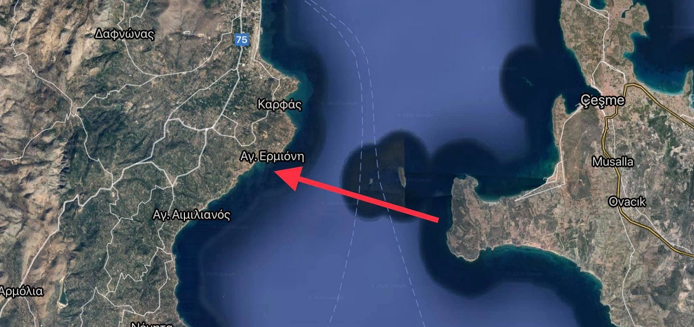
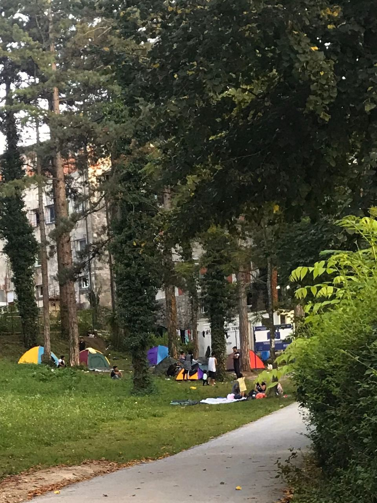
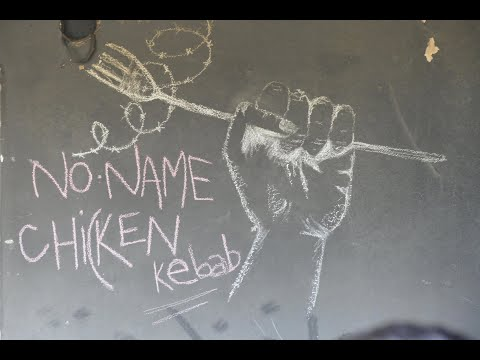

### AYS Weekend Digest 29–30/8/20: The ‘Capital of the Mediterranean’ steps up and opens its port to Louise Michel
#### Marseille opens its port / Bosnia and Herzegovina’s anti\-people treatment funded and supported by the international community; shooting at people reported in Bihać / In Italy, unrest grows with the number of arrivals to Lampedusa / North of France still in need of support as people struggle; a report / recommended stories & more news

](assets/a81db4a141bd/1*vjwx6m312nQds4QWwl7Gqg.jpeg)

Photo\. [Sea\-Watch](https://www.facebook.com/seawatchprojekt/?tn-str=k%2AF&hc_location=group_dialog)
#### FEATURE: BVMN Visual Investigation \- analysis of video footage showing Bosnian special support unit engaged in violent behavior near Miral camp

The [most recent BVMN analysis](https://www.borderviolence.eu/bvmn-visual-investigations-police-violence-in-bosnia-enabled-by-special-support-unit/?fbclid=IwAR3TjxzDfu5AyR6FEkJ8hwYn3aGWcqZ38Bh2DzjYnJQ-0vp4WoMuYtDSUqE) of a video shot in Velika Kladuša clearly links the materials shown in the video to previously documented behavior from the USK’s Special Support Unit towards the people on the move, showing how the donated equipment, funded by the EU, is being used on the ground on a daily basis\.

> During this time of unrest and uncertainty within the Una\-Sana Canton, we believe it is more important now than ever for state institutions to be transparent and open in their behavior\. Should this prove impossible, it is then necessary to hold state institutions accountable to their own actions, but also those supporting such policies and not standing up as international community to prioritize humanitarian approach and upholding of the human rights\. 

The mentioned area outside of Velika Kladuša is in the immediate vicinity of the IOM\-run Miral Camp which houses hundreds of people\-on\-the\-move and has been the focal point of anti\-migrant protests in the area in recent weeks\.
Regular demonstrations outside Miral went on throughout August, wherein incoming buses would be stopped and searched for people\-in\-transit who, if identified, would be taken off and told to walk back in the direction they came from\. Additionally, hateful Facebook groups amassed thousands of followers during this month, discussing ways in which to [aggressively deal](https://www.frontlinedefenders.org/en/case/smear-campaign-online-threats-and-harassment-against-migrant-rights-defender-zehida-bihorac) with people\-on\-the\-move and aid volunteers living in the Una\-Sana canton\.

■■■■■■■■■■■■■■ 
> **[NoNameKitchen](https://twitter.com/NoNameKitchen1) @ Twitter Says:** 

> > Please share. Facebook groups created to locate and hunt migrants and refugees in Bosnia are still open. @Facebook refuses to close them, while every day we know stories of migrants or volunteers being attacked in the streets after being pointed here.

[facebook.com/NoNameKitchenB…](https://www.facebook.com/NoNameKitchenBelgrade/posts/1056469124751371) https://t.co/AwSBGkj0ku 

> **Tweeted at [2020-08-31 07:05:27](https://twitter.com/nonamekitchen1/status/1300328831979528193).** 

■■■■■■■■■■■■■■ 

The official cantonal policies regarding refugees and migrants have shifted, especially in the face of the upcoming elections, and the transit groups have actively been prevented from entering the Una\-Sana Canton for a while now\.

> During this time of heightened tension, serious [physical attacks](http://vladausk.ba/v4/novost/saopcenje-za-javnost/2562) on people\-in\-transit have been reported in northwest Bosnia\. In this context a video, recorded on the 19th of August in Velika Kladuša, began surfacing around social media networks, apparently showing men after and beating a refugee in an open field\. 

[![[Enlarged] Violence from USK-MUP Special Support Unit near Miral Camp on August 19th](assets/a81db4a141bd/1e0d_hqdefault.jpg "[Enlarged] Violence from USK-MUP Special Support Unit near Miral Camp on August 19th")](https://www.youtube.com/watch?v=1xEi_FJXkHU)

Geolocating the video using satellite imagery, stitching together the scene with compiled images, and conducting research on the origins of the vehicle parked at the scene brought the BVMN team to come interesting findings\.
Read the entire investigation report here, while we will stress the importance of monitoring, engagement and active demand for transparency and more advocacy when it comes to human rights of those people who currently find themselves in Bosnia and Herzegovina, on the way to a safer life\.

It should be noted that the EU’s funding of equipment for Bosnian authorities engaging in migration enforcement via the “EU Support to Migration and Border Management in Bosnia and Herzegovina” project has been considerable\. In addition to the three 2020 Renault Master vans, **the IOM has facilitated the donation of [eight cameras, two boats](https://europa.ba/?p=65887) , [five SUVs](https://www.sarajevotimes.com/eu-donates-five-vehicles-to-bosnia-herzegovinas-border-police/) , [35 radios, and 45 computers](https://www.sarajevotimes.com/eu-handed-over-valuable-equipment-to-the-ministry-of-interior-of-una-sana-canton/) to the USK\-MUP and the Bosnian border police in between October and December 2019** alone\. This represents more than 200,000 EUR of support to the Bosnian border police and USK\-MUP in the last year\. Unfortunately, just like in the case of Croatia, who [mismanaged the funds that were intended for independent border monitoring](https://www.theguardian.com/global-development/2020/jun/15/eu-covered-up-croatias-failure-to-protect-migrants-from-border-brutality) \(that never happened\), the funds end up supporting inhumane and degrading treatment of people in search for international protection, unable to use any other means to reach \(what they perceive as\) safe and secure countries that would uphold the rule of law, also when it comes to the right to movement and protection\.
#### SAUDI ARABIA

One of the wealthiest countries on earth is keeping hundreds if not thousands of migrants from Ethiopia locked in heinous conditions reminiscent of Libya’s slave camps as part of a drive to stop the spread of Covid\-19, an investigation has found \(THREAD\):

> One photo shows what appears to be a corpse swathed in a purple and white blanket in their midst\. They say it is the body of a migrant who had died of heatstroke and that others are barely getting enough food and water to survive\. 

#### SEA RESCUE

> Four dead, two missing and five injured is the provisional balance of a new refugee tragedy that took place off the coast of the southern Italian region of Calabria on Sunday\. A boat with dozens of people on board caught fire during a rescue off the coast of Crotone and exploded\. At least four people were killed\. 

At the same time:

### “…what they are trying to leave behind is that much worse”

As it was reported, Louise Michel, the vessel that caught everyone’s attention as it was funded by Banksy, had issued the call late on Friday, saying its seaworthiness was compromised after rescuing 219 people in two days\.
[Sea\-Watch](https://www.facebook.com/seawatchprojekt/?__tn__=%2CdkCH-R-R&eid=ARBY53NCSux87PX7XTS1wXIykYPl6XLAtbg-tQB7F9zMdJwmOkExXXf-qzo_jgbRZb_gcDu0zQhU3WQ7&hc_ref=ARRhB7BrMVtZaem30mvFSiP7HcHYDxhIIRgx9oIs7U6t1UkHJRU_2aEWyCDZB7f-RO8&fref=nf&hc_location=group) reports that after the first rescue of 89 people, the crew of the Louise Michel assisted another 100 people in a second rescue on August 28th\. With the rescued people on board, one person who died on the crossing and more survivors on two life rafts, Louise Michel was unable to maneuver\.
[UNHCR and IOM called for urgent disembarkation,](https://www.unhcr.org/news/press/2020/8/5f491cb64/unhcr-iom-call-urgent-disembarkation-rescued-migrants-refugees-central.html?fbclid=IwAR2SH4MQ6f6zbHCufm32QZNUZl-XC-dBN0xapT85SwTRRtYpykaQ9FQlHbs) saying that “any delays could jeopardize the safety of all people onboard, including its crew members\.”

Mediterranea, meanwhile, announced it would send the ship Mare Ionio from the port of Augusta in Sicily to assist\.

> While European authorities did not show any sign of a reaction, the Sea\-Watch 4 decided to change course to assist\. Upon our arrival, the Italian Coast Guard evacuated 49 people — women and families with children — and brought them to Lampedusa\. 

■■■■■■■■■■■■■■ 
> **[LouiseMichel](https://twitter.com/MVLouiseMichel) @ Twitter Says:** 

> > This is how our Mayday relay calls got ignored: At 28.08.2020, 20.03 CEST we were told by RCC Malta that there are "many other urgent cases" ...how comes then @[Armed_Forces_MT](https://twitter.com/Armed_Forces_MT) that there are no reports about disembarkations in #Malta? What happend to the other people in distress? https://t.co/IXIXRNJaxD 

> **Tweeted at [2020-08-30 14:56:02](https://twitter.com/mvlouisemichel/status/1300084870991888384).** 

■■■■■■■■■■■■■■ 

> “…Now, we are stranded at sea\. Penalised for filling the gap that EU governments have left in the central Mediterranean, where they are leaving people to die with policies of non \-assistance\. This situation is beyond macabre\.” 

### Finally, Marseille opens the port

“They are not migrants\. I do not accept that term\. They are shipwrecked, they are people who risk death\. They are at sea in a critical situation\. Maritime law, maritime history, the history of the city, all call for our responsibility\. Women and children are dying… In that situation, we do not ask for the papers or the regularity of the situation of these people\. We save them, we rescue them,” says Benoit Payan, the first deputy mayor of the city of Marseille\.
“Was it necessary to call on the national authorities to make this decision?

This is a decision that we are taking, we are opening, we are asking the President of the Republic, Europe to take its responsibilities\.”

> Des gens se noient\. 

> C’est notre humanité qui est appelée là\. 

#### TURKEY

Lake Van, Turkey’s biggest lake in the far east of the country, makes up part of the deadly route for people seeking security in Europe\. Before reaching the lake, the people must often cross perilous border mountains\. Villagers often discover frozen bodies after the snow melts\. See the entire story [here](https://www.euronews.com/2020/08/30/turkish-lake-turns-into-migrant-graveyard?fbclid=IwAR3WBXyttdSZIEDZK43Y7MTu4WgHWAx7FcdZ2RmNna5Sew370PTXBhoW6y0) \.
#### GREECE
### Lesvos

After five years of providing lifesaving search and rescue for people crossing the Aegean Sea to the North Shore of Lesvos, Refugee Rescue has made the difficult decision to suspend their operations\.

> The deteriorating situation on the North Shore has made it impossible for us to continue our efforts to assist those in distress at sea at this time\. Unacceptably, the rising criminalization of humanitarian organizations in Lesvos and growing hostilities now pose an irrefutable threat to our staff, assets, and work — and we can not in good conscience continue to operate if we cannot guarantee the safety of our team\. Additionally, the unchecked impunity with which authorities now work has created a situation where we no longer trust that they will allow us to launch our independent rescue boat, Mo Chara\. 

Find the full statement [here](https://l.facebook.com/l.php?u=https%3A%2F%2Fwww.refugeerescue.org%2Flatest-news%2Fstatement-suspension-of-operations%3Ffbclid%3DIwAR3isvx06S0xlPzShn_SkKSVKEb0b9ttkLd7Wfcke3ORuMlstR_ajLTizlQ&h=AT1AJK4ZXc-1zS33Wu1gDKvGfYJOPCTYoGypz1VFugPIHA3XNxWwug1sJ8DK7n3itNKJh43KCE7XWmJRKeTdHHrDJBolIyc4QT24JeN3gtwdYf7JyP2A0NkKnArCG83hQqvhxfk__p1wpthQF6jj7EfORHvJgBT2ELfCbig0dWb7G0o) \.
#### Ongoing hunger strike in Moria — people have been continuing for 4 days

■■■■■■■■■■■■■■ 
> **[Franziska Grillmeier](https://twitter.com/f_grillmeier) @ Twitter Says:** 

> > On 26 August 2020 ~ 60 detained #refugeesgr in #Moria pre-removal detention centre went on hunger strike. 

Since beginning of March, #Greece has been unable to carry out deportations to #Turkey, meaning that people have been deprived of freedom for over 170 days. 

> **Tweeted at [2020-08-30 12:08:02](https://twitter.com/f_grillmeier/status/1300042591858286593).** 

■■■■■■■■■■■■■■ 

### Chios

26 people arrived on two boats outside Ag\. Ermioni, Chios, early Saturday afternoon\. All Turkish nationals, they were onboard two old wooden fishing boats\. They have all claimed political asylum, and have been transported to the quarantine structure in Lefkonia, ABR says\.
### Two people transported to a hospital together with a person who has confirmed COVID\-19 diagnosis

Concerns were raise, once again, for the wellbeing of people in Vial after two suspected, but unconfirmed potential coronavirus patients were transported in the same vehicle with a confirmed coronavirus patient:

■■■■■■■■■■■■■■ 
> **[NoBorders](https://twitter.com/Refugees_Gr) @ Twitter Says:** 

> > ΒΙΑΛ στη Χίο, 3.500 #refugeesgr.
Επιβεβαιωμένος ασθενής #COVID19gr παρουσίασε επιδείνωση με συμπτώματα πνευμονίας. Γιατρός ζήτησε την μεταφορά 2 ακόμα ατόμων με υψηλό πυρετό. Το πλήρωμα του ΕΚΑΒ επέλεξε να τους μεταφέρουν και τους 3 ταυτόχρονα με το ίδιο δρομολόγιο... 

> **Tweeted at [2020-08-29 09:06:02](https://twitter.com/refugees_gr/status/1299634404369879040).** 

■■■■■■■■■■■■■■ 

Among the 3500 people currently living in the infamous camp Vial, five cases of coronavirus have been detected, while another thirty people are in quarantine, which according to the testimony of an employee is not strictly observed since their care is incomplete\.

Here are a few campaigns aiming to help people at Vial, share and take part if you can:

### Greek propaganda for more surveillance amid pushbacks

Turning the attention away from the issue of pushbacks in the Aegean, the Greek [media](https://www.ekathimerini.com/256353/article/ekathimerini/news/bid-to-boost-patrols-after-sea-rescues?fbclid=IwAR1OTyGVpeqToq6zt6noXatEBZvWFj0R_QFHzxf8k98vsc68tMgAnoj8rtc) has now been reporting about the national coast guard “intensifying patrols” and “proposing that a helicopter currently monitoring the Ionian Sea for Frontex should be moved down to the southeastern Aegean\.”
### New allegation of torture inside the detention center of Petrou Ralli

[Reportedly,](https://thepressproject.gr/voitheia-voitheia-voitheia-sto-kentro-kratisis-allodapon-tis-petrou-ralli/?fbclid=IwAR3i_ZbUD6uF0_CP3MpWu8yLgtOUTburscpP5PyNcgMkz7f6iSYxqAqMzN8) the detainees are subjected to torture by brutal beatings and lack of sanitation\. They are desperately seeking intervention and support to end this horrific state of violence\.

The Solidarity Initiative for Petrou Ralli contacted a jailed man inside who described the deplorable conditions of detention — as well as an incident of beating by police — and appealed for help\.
#### BOSNIA AND HERZEGOVINA
### In Bihać, shooting at those seeking refuge

Locals report that late in the evening on Sunday shots were heard and, reportedly, those shots came from the local groups who were shooting at the people nearby\. Quoting a local, a group of Pakistani people, men and women, were beaten, robbed and shot at in order to frighten them and make them leave the area\.

> Last night a group of robbed, beaten, frightened people continues their way into the unknown… Bittered, sad, angry, left behind by everyone…, _one of the locals wrote on her Facebook [profile](https://www.facebook.com/aida.sejdic.50?__tn__=CH-R&eid=ARA3d6W40oo59-0NHYmYDwDsqXhg8aiqqM_86gxhljK0ZI2m9R_5qDgOBUjfZiNvAMHrcXO96igDP2ZH&hc_ref=ARSR9ytCEkukyJCZGBNfe-v3mlCtpra5Iv3h42arMyEAQHpOGbTj6gSgBhJ7xhWtRK0&fref=nf&__xts__[0]=68.ARC5vAxDucRjz2aGvKlPyQoUbc55gXeI0vgcWjLQh0D4hvRy59bRKQPqsyHIOi4WUUmbwi63PBlc2TJD20e0J_ZkDja2rO5rqZ3rkNUgL2YCr9cFLqMVvTFrrM_qwpUTUAURtrjjGSt2r9BxORu7T0N3Z28BYOhgTnsKD-fTRlgxBdO0vkW-22FDClol1xvvfQdcFNQ8yYNHDIESU1Gcemh4B5Y-cFEBITIiA3z4NMXjbGzNQmDkivH7M2iJgXLn-S5nmu1JuvuOFWANEWu70zbWhYvK66szaLun8MTLS7JvbirDxOqZ1B015mlQ1fJWCl_QlB2kW-5p2qLtQn4)_ 

> “People of Bosnia, attacked people of Pakistan, stole everything from them, money, chlothes, everything, and they beat them and shoot on them\. They went away today” _a boy they know was telling them what happened\._ 

> My people are no longer mine\. I don’t belong to such\. 

#### Measures for the people against the people

Text and photo by Hannah Parry, NNK

“Since a change in the law on Friday last week, at least 7 families we know have to sleep outside the official fields in Bihać and its surroundings\.

According to what we were told, there are coronavirus prevention measures, which means that those who return after being deported from Croatia must go to the isolation rooms before returning to their rooms\.

However, isolation facilities are packed in all camps, leaving families with young children sleeping on the ground outside the fields\. It’s been cold and wet at night here\. Country residents have been prevented from taking food outside to help them\.”
#### ITALY
### Lampedusa threatens to “shut down the island” if new arrivals are not deported

Thirty landings on Friday, eight more on Saturday including the arrival of the 49 from the Louise Michel, along with the [other hundreds who arrived](https://l.facebook.com/l.php?u=https%3A%2F%2Fwww.ilgiornale.it%2Fnews%2Fcronache%2Fimpugnata-tar-lordinanza-musumeci-lampedusa-collasso-oltre-1886286.html%3Ffbclid%3DIwAR0Atg_IodlP2ATclcOxZv0J8G8dD6hiIj2x6sAQsPyOt5xncoehOgSb598&h=AT2saauSsDJMo8cqHaV7Q3VaXck2eXbfJg80lxbVrcYMX38llZJuw_Oru7i6g9e7eLPVOPXMn8vunX1v9dyILxkpc__4IKKuERTq7ZYcyhOPndSHrOzXbHTE4z2TGpJFBWIKfo0CmAOHuA) on dinghies prompted many reactions from the local residents, even protests\.

The mayor Toto reacted following the unrest, blaming the government for letting them handle things on their own:

“We are on our knees, with these arrivals the hot spot will exceed 1,500 admissions\. The situation is unsustainable: either the government takes immediate decisions or the whole island will strike\. The administration will directly declare the strike, closing everything\. It is not possible to continue to bear these oppressions by part of the government,” said the mayor of Lampedusa\.

#### SPAIN

A fire has destroyed a makeshift camp in southern Spain where mostly exploited migrant workers live\. We are finding out more about what happened and will report as soon as our information is confirmed\.

#### FRANCE
### Calais

■■■■■■■■■■■■■■ 
> **[Human Rights Observers](https://twitter.com/HumanRightsObs) @ Twitter Says:** 

> > La pluie et le vent ce dimanche matin à #Calais n'ont pas empêché la 717ème expulsion de lieu de vie informel cette année
Réveil en secouant les tentes, les exilé.e.s sont ensuite contraint.e.s à déplacer toutes leurs tentes

Les droits fondamentaux ne sont toujours pas respectés 

> **Tweeted at [2020-08-30 11:52:57](https://twitter.com/humanrightsobs/status/1300038798747860993).** 

■■■■■■■■■■■■■■ 

■■■■■■■■■■■■■■ 
> **[Care4Calais](https://twitter.com/Care4Calais) @ Twitter Says:** 

> > The two key ways to help:

1) Donate your tent to one of our drop-off points at [care4calais.org/thedropoffmap](http://care4calais.org/thedropoffmap)

2) Donate money so we can buy a tent. A two-person tent costs £12 and ensures two vulnerable refugees have somewhere warm to sleep. Visit [care4calais.org/emergency-appe…](http://care4calais.org/emergency-appeal)

Thank you ♥ 

> **Tweeted at [2020-08-30 15:10:16](https://twitter.com/care4calais/status/1300088453485473795).** 

■■■■■■■■■■■■■■ 

### Evictions, arrests, violence and lack of shelter

A new **joint report** published by Human Rights Observers, Choose Love, L’Auberge des Migrants International and RRE shows that:
\- Evictions of informal living sites have continued, with a total of 308 being observed\.
\- Displaced people and human rights defenders have been subjected to ongoing arrests, with a total of 51 arrests being observed\.
\- The practice of law enforcement officials seizing personal items has continued\.
\- COVID\-19 sheltering operations have been insufficient across the time period, with many people still requiring safe accommodation\.

Find the entire report [**here**](https://refugee-rights.eu/wp-content/uploads/2020/08/facing-multiple-crises-report.pdf?fbclid=IwAR3uIcOFWHBNYi_5Df7VcsRlI3o_J_q-NoSy_DcXbQN-qQfbFESG56U-rkU) \.
#### GERMANY

The Federal Administrative Court confirms that open church asylum is not a flight and that the Dublin transfer period is 6 months instead of 18\.

#### UK

Britain First storming into hotels and banging on bedroom doors to harass people who are already scared to death of being deported, C4C reports\.
Reportedly, people in hotels in Birmingham and Coventry are terrified\.
The teams are asking for local volunteers willing to get involved\.

However, here is your daily dose of solidarity to inspire you to get active where you are:

■■■■■■■■■■■■■■ 
> **[Stand Up To Racism](https://twitter.com/AntiRacismDay) @ Twitter Says:** 

> > What solidarity looks like! Great work today. #refugeeswelcome by @[sutrharlow](https://twitter.com/sutrharlow) @WalthamForestSUTR in Epping Essex. Far right thugs targeted refugees. Today, we stand with them. @[Care4Calais](https://twitter.com/Care4Calais) @[TownsendMark](https://twitter.com/TownsendMark) @[SRTRC_England](https://twitter.com/SRTRC_England) https://t.co/EpYqGIknHo 

> **Tweeted at [2020-08-30 15:19:10](https://twitter.com/antiracismday/status/1300090693344522243).** 

■■■■■■■■■■■■■■ 

#### WORTH LISTENING & READING

Here is one of the personal stories behind the drowned: “Last weekends 4 shipwrecks in the Med hit me really hard, I knew one of the over 100 refugees who died\. I know his mother though a common friend, for the past four years she has been calling me from Eritrea to ask what kind help there was for her youngest son who was in Libya\.” :

■■■■■■■■■■■■■■ 
> **[Meron Estefanos](https://twitter.com/meronina) @ Twitter Says:** 

> > Last weekends 4 shipwrecks in the Med hit me really hard, I knew one of the over 100 refugees who died. I know his mother though a common friend, for the past four years she has been calling me from Eritrea to ask what kind help there was for her youngest son who was in Libya. 

> **Tweeted at [2020-08-30 12:22:59](https://twitter.com/meronina/status/1300046354836860929).** 

■■■■■■■■■■■■■■ 

Routed is an online publication founded in the autumn of 2018 by a group of graduate students brought together by a shared interest in migration and \(im\)mobility\. Bridging the divide between specialist academic literature on human mobility and popular portrayals of migration in the media, we hope to bring a fresh, critical perspective to the study of how and why people move\. Challenging perceptions of migration as a binary choice between roots and routes, our work aims to lift up the voices of people ‘on the move’ and to explore human \(im\)mobility in its many varied forms\.

Through short audio recordings, independent volunteers and volunteers working for small organizations in some sites of the EU’s external and internal borders report weekly on their daily work and the dire conditions in which refugees and migrants are living\. The audios are in Spanish and subtitles are also provided in English, and time permitting, in Serbian and Croatian\.
The objective of this project is to help give visibility to what is \(still\) happening at our borders, providing weekly updates of the situation\.

**Find daily updates and special reports on our [Medium page](https://medium.com/are-you-syrious) \.**

**If you wish to contribute, either by writing a report or a story, or by joining the info gathering team, please let us know\.**

**We strive to echo correct news from the ground through collaboration and fairness\. Every effort has been made to credit organisations and individuals with regard to the supply of information, video, and photo material \(in cases where the source wanted to be accredited\) \. Please notify us regarding corrections\.**

**If there’s anything you want to share or comment, contact us through Facebook, Twitter or write to: areyousyrious@gmail\.com**

_Converted [Medium Post](https://medium.com/are-you-syrious/ays-weekend-digest-29-30-8-20-the-capital-of-the-mediterranean-steps-up-and-opens-its-port-to-a81db4a141bd) by [ZMediumToMarkdown](https://github.com/ZhgChgLi/ZMediumToMarkdown)._
