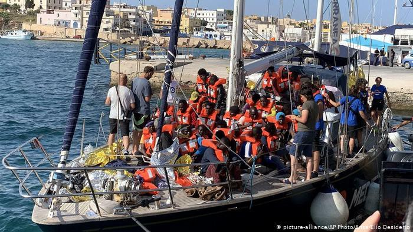
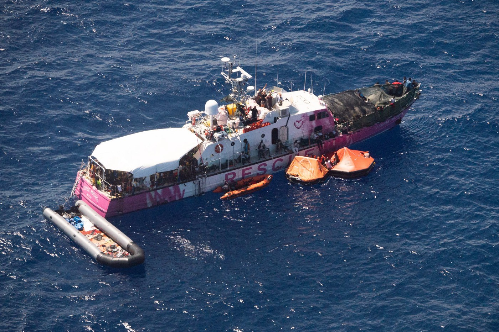
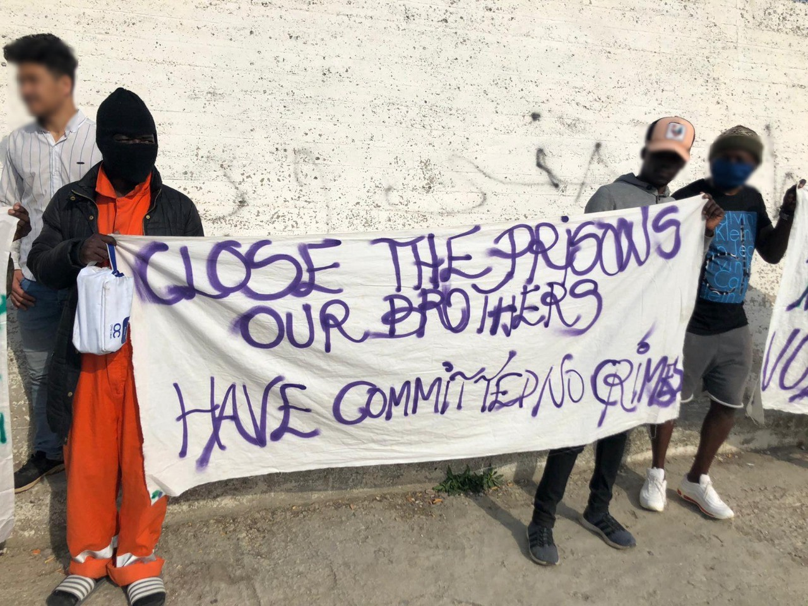
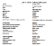
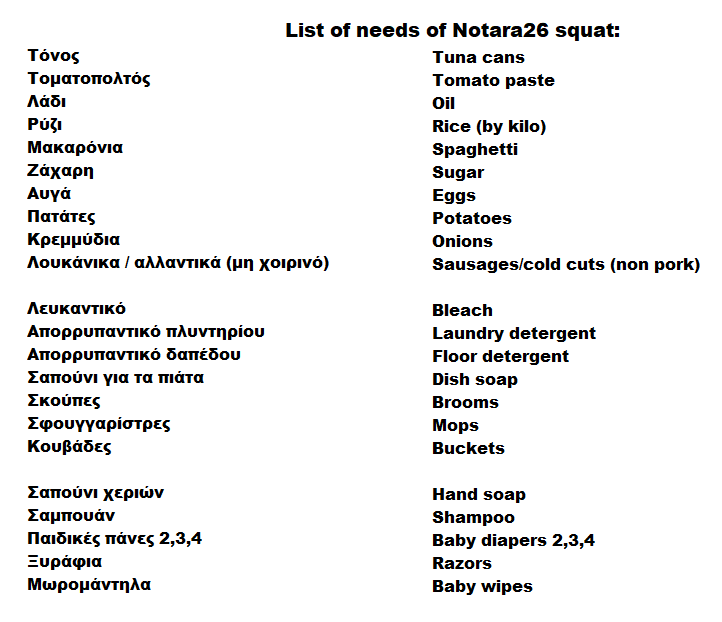
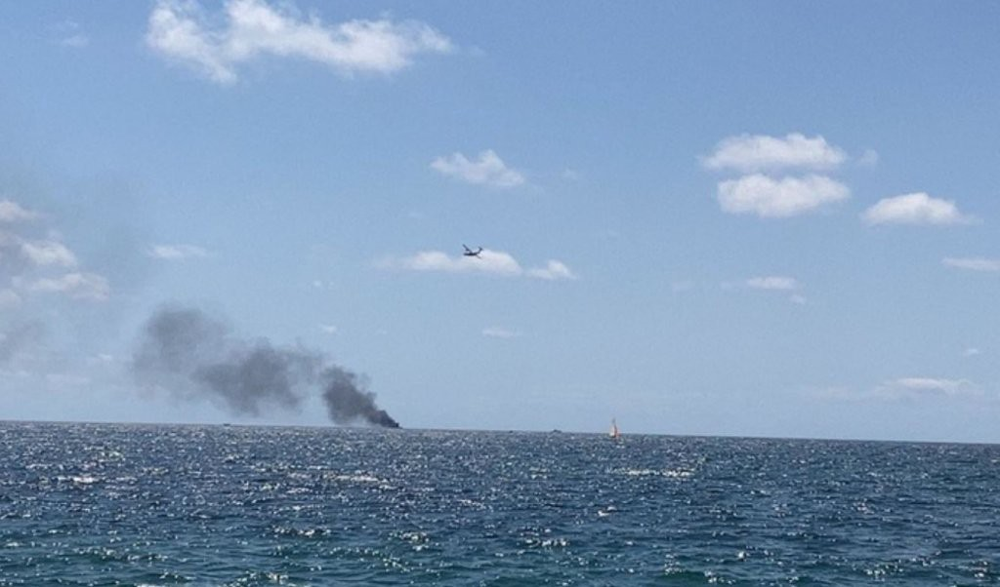
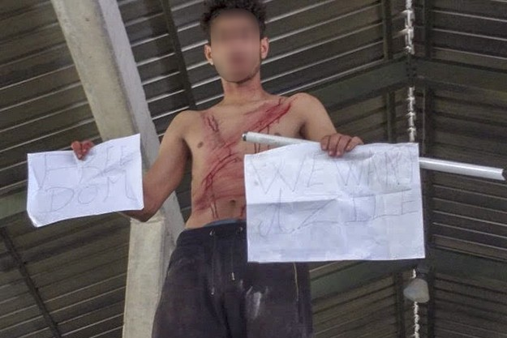
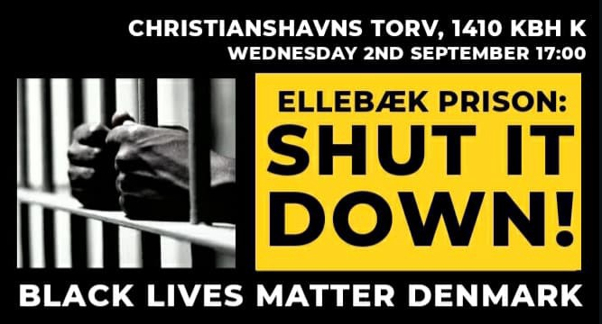
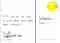
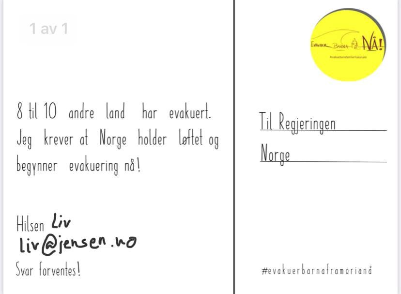

### AYS Daily Digest 31/08/20 This summer’s effect on conditions in Lampedusa
### Many sea updates on rescue ships // pushbacks and detention in Slovenia // Vienna wants to take in 100 children from Moria // and more…

[Are You Syrious?](@AreYouSyrious?source=post_page-----a5752aec1c48----------------------)

[Sep 1](ays-daily-digest-31-08-20-this-summers-effect-on-conditions-in-lampedusa-a5752aec1c48?source=post_page-----a5752aec1c48----------------------) · 11 min read

### FEATURE: Lampedusa’s horrible conditions for refugees coming into focus again

As we at AYS have been reporting on the rise in new arrivals on the island, particularly with the increase in Tunisians fleeing the horrible economic conditions in their country after COVID, the conditions in the already overcrowded island have been getting worse\. [The New Humanitarian](https://www.thenewhumanitarian.org/news-feature/2020/08/31/Italy-Lampedusa-migration?fbclid=IwAR1sHwxWfraLiSgyzsCkX611Ccl41BKP1AxWApz_O7WmjmKyLRDfjKm-8w0) published an excellent piece regarding these conditions written by Stefania D’Ignotion on Monday entitled “Italy’s Lampedusa: Back on the migration front line, ‘The situation needs a planned, long\-term approach\.’” D’Ignotion reports on how these conditions are stoking far right fears:

> _“\(COVID\) infections among migrants made up less than five percent of Italy’s total caseload during the first half of August: In comparison, 25 percent of new infections consisted of Italians returning from abroad\. But the migrant infections have provided fodder for right\-wing political figures — such as former interior minister Matteo Salvini — who have used the pandemic since it began in March to advance a long\-standing anti\-migrant agenda\._ 

> _Asylum seekers and migrants have also been slipping out of the reception centre to escape the overcrowding and search for food to supplement their daily rations, according to Italian media reports\. Their presence outside the centre has led to fears among residents about the potential spread of the virus\. Fake news stories circulating on social media networks and rhetoric from the far\-right painting asylum seekers and migrants as a threat are only making the situation worse, said Martello, the mayor\.”_ 

D’Ignotion cites that according to Maurizio Ambrosini, a professor of migration sociology at the University of Milan, a long term approach to Lampedusa’s situation, especially with the virus, needs to relieve the island’s local resources\. Many locals are feeling abandoned by the federal government, despite what their exact opinions on migration are\.

> _“The Italian parliament is set to reconvene in September, and deciding whether to abolish Salvini’s security decrees is on the agenda\. If the decrees are abolished, that could signal a more open approach to search and rescue, disembarkation, and the recognition of humanitarian protections that would help take some of the pressure off of Lampedusa\.”_ 

Read the piece in it’s entirety [here](https://www.thenewhumanitarian.org/news-feature/2020/08/31/Italy-Lampedusa-migration?fbclid=IwAR1sHwxWfraLiSgyzsCkX611Ccl41BKP1AxWApz_O7WmjmKyLRDfjKm-8w0) \.
### LIBYA

Alarm Phone is reminding us that:

> _“The violent EU border regime that forces people onto unseaworthy boats & into the hands of unscrupulous smugglers has led to several shipwrecks & too many deaths\. All of them have relatives & friends who are mourning and who will never forget them\.”_ 

You can read about one of the people who died, Jemal Mohammed, [here](https://twitter.com/alarm_phone/status/1300336374911037441) \. His life mattered, as did the lives of all of the people who have drowned while the EU looks the other way\.
### TUNISIA

In Tunisia, many parents are mourning the loss of their “harraga” which is what they call their family members who have chosen to cross the Mediterranean, only to drown\. They are a “‘burner’ of borders who seek to flee the country by sea, without a passport or visa, on a miserable raft\.” Many families are exasperated that their loved ones, particularly younger people, might have been convinced by smugglers to leave, only to be killed at sea\.

The environment they are fleeing from includes a lot of hardship\. Mustapha Kessous for [Le Monde](https://www.lemonde.fr/afrique/article/2020/08/26/cette-traversee-ne-peut-rapporter-que-la-mort-en-tunisie-les-familles-pleurent-leurs-harraga_6050026_3212.html?fbclid=IwAR3ZmpH1HJx78fYhYLWB2cozoyIwrAUsR3D4XG8IF7xCS05HS5YNxGlotMs) aptly describes it as follows:

> _“In this corner of Tunisia, the candidates for exile know the answer to this accursed question\. “It’s disgust” , they say to express they are fed up\. “Disgust” to see, helplessly, their country sinking without offering them any future\. Since the 2011 revolution, which ended the dictatorship of Ben Ali, Tunisia’s economy has deteriorated\. In nine years, the minimum wage has hardly increased \(400 dinars, or about 120 euros\) \._ 

> _And this spring, the Covid\-19 pandemic took its toll\. Tourism is at half mast \(revenues halved in July, according to the Central Bank\), the economy in free fall, the GDP fell sharply by 21\.6% in the second half, according to the National Institute of Statistics\. And the unemployment rate is now 18% … So for this youth, graduate or not, the exodus to Italy remains the only solution, to the point that over the last twelve months, Tunisians represent nearly half of the migrants who arrived illegally in the country\.”_ 

### SEA
### “Do black lives really matter? If yes, it has to expand to the central Mediterranean\.”

[Quote by](https://www.irishtimes.com/news/world/europe/europe-doesn-t-care-about-black-lives-activists-say-as-hundreds-abandoned-at-sea-1.4343108?fbclid=IwAR2R86_8ZjMKXnISgm4yQ0s3Z0oT8btjZdjMUS9dYj9JdEqEyhkvk5AVkWU) a refuge from Cameroon, written on board Sea\-Watch 4\.

In an update from [Sea Watch](https://www.facebook.com/seawatchprojekt/posts/2628299654054766) : “In the past week, our Moonbird crew spotted seven boats with more than 380 people on board in five missions:”

— “ **two boats** were illegally pulled back by the so\-called **Libyan Coast Guard** , one boat even out of the Maltese search and rescue zone\. Our airplane crew also witnessed two other interceptions where the people had already been taken on board ships of the so\-called Libyan Coast Guard\.

— **two** **boats** were rescued by the **Louise Michel** \. The rescued people were later transshipped to the Sea\-Watch 4, which is still waiting for a safe port\.

— **one boat** with about 40 people on board arrived independently in **Lampedusa** \.

— **one boat** reached **Sicily** after a very questionable intervention by Maltese armed forces, who — instead of rescuing the people in distress — distributed life vests and directed the boat towards Italy\.

— **one boat** with about 25 people on board was sighted on Friday\. What happened to these people is still **unknown** \.”

In a further update on the Louise Michel ship, [United 4 Rescue](https://www.facebook.com/united4rescue/posts/321713635946939) shared:

> _“Dramatic effort on the Mediterranean\. On Saturday, 29\.08\., the crew of the ‘Sea\-Watch 4 powered by United4Rescue’ rescued 150 people from the ‘Louise Michel\.’ The street art artist Banksy’s sea rescue ship needed help after the emergency crew had to call out\. The situation aboard the ‘Sea\-Watch 4 ‘ — which has now taken on 353 people — is getting worse\. Crew and survivors are exhausted\.”_ 

This is excellent news\! [The Mayor of Marseille](https://www.connexionfrance.com/French-news/Marseille-mayor-opens-door-to-Banksy-funded-refugee-rescue-boat?fbclid=IwAR2SKyyiAnfyDp76SfKVjnJly5VbCFmHLi6cqmtKwxP3h6declTl2crxh3g) said in a statement:

> _“These are refugees, these are people who are risking death\. They are at sea in a critical situation\. Maritime law, maritime history, the history of our city — they all call on our responsibility\. Women and children are dying\. In this situation, we don’t ask for papers or the legal status of these people\. We save them\.”_ 

### GREECE

The second hunger strike in Moria pre\-removal detention centre \(PRO\.KE\.K\.A\) is ongoing\. About 60 detainees are involved\. For context, [Deportation Monitoring Aegean](https://dm-aegean.bordermonitoring.eu/2020/08/26/second-hunger-strike-in-moria-detention-centre-this-year/) elaborated:

> _“Since 5 March, Greece has been unable to carry out deportations to Turkey as a result of the Covid\-19 pandemic\. Detainees have been deprived of freedom for 174 days during which deportation — the only reason for their confinement — has been impossible\. They are locked up without justification in conditions designed to drive them to despair\._ 

> _From 5 to 8 April this year, detainees attempted to hunger strike\. Their protest ended after a special police unit interrogated the strikers, beating a number of them\. What happened during those days is still unclear; many could not speak openly of conditions during these days for fear that conditions would be made worse\. Many believe now that they have no chance of escape but that which they take for themselves\. Suicide attempts are an almost weekly occurrence\. On 6 January, a 31\-year\-old Iranian detainee took his own life after being held in isolation and denied access to psychosocial care\. His death prompted a criminal investigation into staff and services at the facility\.”_ 

As you may have already seen, the BBC’s reporting on the migration crisis has been of little help recently\. From interviewing the locals who are misinformed and interviewing Greek politicians saying that Greece is following international law and denying well documented pushbacks, the BBC failed to produce a revealing and honest exposé\.

In an update from the [Greek Helsinki Monitor](https://twitter.com/VassilisTsarnas/status/1300379231621439488) : \(read it in Greek [here](https://racistcrimeswatch.wordpress.com/2020/08/27/2-244/?fbclid=IwAR1wWwW7PUfIJc5CUZeuxvZqGwJx8Prdmvvik1uT6f5KjCKFGAZRZtM-q14) \)

> _“We filed a criminal complaint to the High Court Prosecutor concerning allegations of push backs at sea of > than 1389 refugees during March, June, July\. Most of them were reportedly forced to risk their lives on rafts pushed by the Greek Coast Guard towards Turkey\._ 

> _Our complaint was based on reports by [@UNHCRGreece](http://twitter.com/UNHCRGreece) [@IOMGREECE](http://twitter.com/IOMGREECE) [@hrw](http://twitter.com/hrw) [@lesboslegal](http://twitter.com/lesboslegal) [@humanrights\_gr](http://twitter.com/humanrights_gr) [@ABoatReport](http://twitter.com/ABoatReport) [@Border\_Violence](http://twitter.com/Border_Violence) [@alarm\_phone](http://twitter.com/alarm_phone) [@EFSYNTAKTON](http://twitter.com/EFSYNTAKTON) [@teammareliberum](http://twitter.com/teammareliberum) [@just\_security](http://twitter.com/just_security) [@SPIEGEL\_English](http://twitter.com/SPIEGEL_English) [@BBCWorld](http://twitter.com/BBCWorld) [@euronews](http://twitter.com/euronews) and [@bellingcat](http://twitter.com/bellingcat) ”_ 

To learn more about a Syrian family’s experience with pushbacks from Greece to Turkey, read Toon Beemsterboer’s piece [“Greece ends Turkey’s deal with the deportation of migrants\.”](https://www.nrc.nl/nieuws/2020/08/30/griekenland-trekt-streep-door-turkijedeal-met-deportatie-van-migranten-a4010298)

### MALTA

The government has announced that it will be spending €33,500 a day \(over €1 million a month\) on hiring the MV Galaxy “a Cypriot flagged 41\-year\-old RO/RO passenger ship” to quarantine refugees and migrants\. It is not clear how long they will have to be detained on board before they are allowed to leave\. This is also taxpayer money the government is using to fund this expenditure, a move the Prime Minister has said is necessary to keep COVID\-19 cases in check\. Cases are steadily on the rise in Malta\. More [here](https://theshiftnews.com/2020/08/31/exclusive-prime-minister-to-spend-e1m-a-month-to-detain-migrants-on-ship/?fbclid=IwAR2cL1elFnGdd_-gIcL-1SraxML0_jT5KAYBwFDF2ajpx4FS_tC_oJrxfwA) \.
### ITALY

### Boat catches fire; at least 4 people died

On Sunday, near the Calabrian coast of Italy, a boat with 20 people caught fire\. Five people were sent to the hospital and two people were reported to be in serious condition\. It is unclear whether any of the four people who died were taken to hospital and died later, or whether they were found dead on the scene\. One person is reportedly still missing\.

Ten of the people on board were minors\. Twelve of the people were taken to a reception center in Crotone\. More [here](https://www.infomigrants.net/en/post/26949/at-least-four-migrants-die-as-boat-catches-fire-off-italy?fbclid=IwAR19oyO1l9IuC7dh0P7JxgSTnmzYLgKPOAWUADVlYbHVs2ZUod0dUA8rNXs) \.
### BOSNIA AND HERZEGOVINA

[Local media](https://www.klix.ba/vijesti/bih/detalji-sastanka-o-migrantima-kamp-bira-ce-biti-zatvoren-u-centar-kod-doboja-smjestit-ce-maloljetnike/200831124?fbclid=IwAR1E6w4J1pldDev9BZMIH3LVeANAXQyHECZ9sTqLT_xn1GJf_BIgk8usP_s) are reporting on a statement the BH Ministry of Security released on Monday:

> _“The BH Ministry of Security issued a brief statement today after a working meeting at which the main topic was migrants, stating only that concrete conclusions were reached on the relocation of migrants from urban areas and the protection of the local population\. As we find out, it was decided to close the camps of Bira in Bihać and Miral in Velika Kladuša\._ 

> _Minors from Bira should be transferred to the Duje Reception Center near Doboj, while adults, if they do not go to the “game” \(illegal crossing of the border op\.a\. \), will be transferred to the Lipa camp\. The selection will then be closed\. Also, the participants of today’s meeting in Sarajevo agree that it is necessary to create conditions for the stay of migrants during the winter in the Lipa camp\.”_ 

Following the attacks by the locals that we reported about in [our Weekend Digest](ays-weekend-digest-29-30-8-20-the-capital-of-the-mediterranean-steps-up-and-opens-its-port-to-95492dd6b06b) , here are more updates from [the local media](http://www.uskinfo.ba/m/vijest/nekoliko-mjestana-naselja-zlopoljac-kod-bihaca-nocima-napada-migrante-bilo-i-pucnjave-nadene-cahure-policija-hapsila/78946?fbclid=IwAR3M5tWHU7t7IiwbqLwdflesF8PgO_sfUEODcoXUrP4g4j330je7Qf1ZjfI) with testimonies by other citizens, most of whom are horrified by these incidents:

_“There was a shooting last night\. The guys who did it were found and the shell casings were found\. Today they attacked these children \(mostly minors\), tomorrow someone else will be killed\. I don’t know what they want to achieve with this”_ — Temida Bulić, who was close to the incident\.
### SLOVENIA

Kristina Božič for Kosovo 2\.0 wrote an in\-depth report on how access to asylum in Slovenia remains problematic at best\. Many of the practices of detaining people, including children, have been compared to the tortuous Hungarian practices:

> _“The Ombudsperson’s Office in Slovenia has warned on several occasions about the problematic role of border police in asylum procedures and about the role of Postojna’s Aliens Center, which is officially considered a detention facility\._ 

> _Furthermore, in its reports the Office acknowledges that families and children were among those previously detained there, a controversial practice it calls to be abolished\. The men who are currently locked up in Postojna complain of further irregularities, including accusing the translators working for the police as being corrupt and unprofessional\. These echo similar claims cited by organizations including Amnesty International Slovenia, while the Ombudsperson’s office has also mentioned it in one of its reports and called on the government to react\.”_ 

You can also read further with our [AYS Slovenia Special: Protest breaks out in detention centre Postojna a week after court decision in favour of an asylum seeker](ays-slovenia-special-protest-breaks-out-in-detention-centre-postojna-a-week-after-court-decision-e86065481fcb) \.
### AUSTRIA

Vienna is trying to take in 100 children from Lesvos as part of the initiative for other EU countries to evacuate the most vulnerable people in inhumanly overcrowded Moria\. They are also calling on the federal government to step up and take in more people as well, especially in light of COVID\. They explicitly said that they know the federal government has the means to do this\. Learn more [here](https://wien.orf.at/stories/3064531/?fbclid=IwAR1lipafAn7_iT_2PVpdlbT7hDZGYjxSGTLcyxpG8PNz1mzjIJlFl0SgTP0) \.
### GERMANY

Michel Brandt of Die Linke in the German parliament released this new request for information on pushbacks from Greece to Turkey:

> _“In a small request, I asked the federal government about pushbacks at the Greek\-Turkish border\. The answer is sobering and is still meaningful\. The federal government claims to know nothing, but the usual media coverage is about illegal pushbacks from Greece to Turkey in 2019\. This is an irresponsible attitude against the fact that German border guards are working in Greece and that the federal government supports the EU\-Turkey deal\. Finally, the practice of illegal pushbacks, both along the Greek\-Turkish land border and along the sea border with Turkey, is well documented\. With its alleged ignorance, the federal government expresses that it condones human rights violations in silence\.”_ 

Read in full [here](https://www.facebook.com/michel.brandt.linke/posts/2640609552870856) \.
### DENMARK

### NORWAY

### GENERAL

Lastly, there is an interesting webinar happening on 18/09/20 called **Webinar ‘Migrant lives in pandemic times’ with Professor Nando Sigona** \. _“While the first wave of Covid\-19 took many by surprise, it seems that the pandemic and the diverse national and local policies that are designed to tackle its further spread will keep staying with us for a while\. This time, we as migration researchers, migrant civil society organisations and migration policy makers can prepare ourselves\.”_ Check it out more [here](https://www.uu.nl/en/events/webinar-migrant-lives-in-pandemic-times-with-professor-nando-sigona?fbclid=IwAR0nAZZJgQqB3ioPImhGgduMzEhbmKteeso_80vKARADRXwaGkCL3CnrVfY) \.

**Find daily updates and special reports on our [Medium page](https://medium.com/are-you-syrious) \.**

**If you wish to contribute, either by writing a report or a story, or by joining the info gathering team, please let us know\.**

**We strive to echo correct news from the ground through collaboration and fairness\. Every effort has been made to credit organisations and individuals with regard to the supply of information, video, and photo material \(in cases where the source wanted to be accredited\) \. Please notify us regarding corrections\.**

**If there’s anything you want to share or comment, contact us through Facebook, Twitter or write to: areyousyrious@gmail\.com**
### Sign up for AYS Daily Newsletter
### By Are You Syrious?

Daily news digests from the field, for volunteers, people on the move, journalists, and the general public [Take a look](/are-you-syrious/newsletters/ays-daily-newsletter?source=newsletter_v3_promo--------------------------newsletter_v3_promo-)

_Converted [Medium Post](https://medium.com/are-you-syrious/ays-daily-digest-31-08-20-this-summers-effect-on-conditions-in-lampedusa-b5c52928d577) by [ZMediumToMarkdown](https://github.com/ZhgChgLi/ZMediumToMarkdown)._
