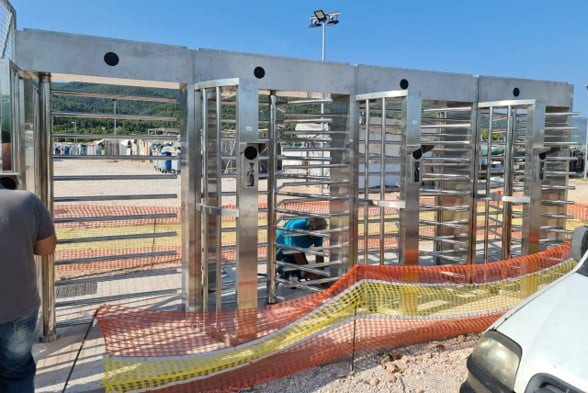

### AYS Daily Digest 1/9/20 Freedom for Hamza and Mohamed

Amnesty publish appeal against Iuventa’s criminalisation / Plan to relocate all people on the move in Krajina out of urban spaces / More reports of pushbacks at the Evros border / Closed detention plans continue on Greek islands / Children detained in Melilla / Sudanese Poet dies in ship wreck / Protest Camp in Paris …

#### Featured: Northern Greece — Appeal hearing for Hamza and Mohamed

On Tuesday 1st of September, in the northern town of Komotini, the first appeal hearing for Hamza and Mohamed was held\.

On the 4th of February 2020, they were sentenced to **4 years and 1 month in prison** for “smuggling” and “aiding illegal immigration”\. They had fled Morocco in search for a better life and, together with other people, made it to Greece on a makeshift boat\.

](assets/ed3414d23867/1*xgvYSn_gPaveyaMOrdFDVw.jpeg)

[Photo by Borderline Europe](https://twitter.com/BorderlineEurop/status/1300708161284911106)

[Borderline Europe has followed their case since the beginning:](https://www.borderline-europe.de/sites/default/files/readingtips/Report%20trial%20observation%20Hamza%26Mohamed_EN.pdf)

> Hamza Haddi and Mohamed Haddar were accused after their own escape of illegally transporting two other Moroccans, including the brother of Hamza, Yassine Haddi, to Greece\. They were also prosecuted for their own illegal entry\. In addition, they were accused of acting for profit\. 

> \[…\] According to the defendants and the two other Moroccans who entered the country and were questioned as witnesses, the facts of the case are as follows: Hamza and Yassine travelled to Istanbul in order to travel on to Europe in order to escape persecution by the Moroccan authorities for their political activities\. Relatives of theirs had already been granted political asylum in other European countries\. 

> In Istanbul they met two other Moroccans and decided to cross the border with Greece, which is marked in the European part of Turkey by the river Evros, together with them\. They found a smuggler who took them to a small island in the river \(of which there are many, especially in summer, when there is not much water in the river\) and left them to their own devices\. 

> The four of them stayed overnight on the island and the next day they found a makeshift boat which they set off towards the Greek shore\. All four took turns rowing; just before they reached the Greek shore, Hamza and Mohamed held the paddles\. Arriving on the Greek side, everyone was arrested by the border police and **criminal proceedings were opened against Hamza and Mohamed for holding the paddles\. They would have made themselves guilty of an offence by illegally bringing the other two to Greece\.** 

> The case of Hamza & Mohamed is emblematic for the systematic criminalisation and incarceration of people on the move\. The European Union not only criminalises those supporting migrants and refugees; following pressure by the EU, Greece has established the necessary legal framework to criminalise people on the move themselves for their own flight\. 

In this way, the Greek Coast Guard arrests 1–2 people from each arriving boat and [accuses them arbitrarily of smuggling and aiding illegal entry](https://dm-aegean.bordermonitoring.eu/2019/07/15/the-war-against-smuggling-incarcerating-the-marginalized/) \. The majority of them disappear unknown and unheard of and with no access to support from outside\. According to official data by the Greek ministry of justice, they make up the biggest group of people imprisoned in Greece\.

Several groups and individuals — among them Carola Rackete and the [European Democratic Lawyers](http://www.aeud.org/) \(AED\) — declared their solidarity with Hamza & Mohamed\.

■■■■■■■■■■■■■■ 
> **[iuventa-crew](https://twitter.com/IuventaCrew) @ Twitter Says:** 

> > #LouiseMichel crew: Hamza &amp; Mohamed fled from Morocco, searching for a better life. Upon arrival in Greece they were shot at &amp; beaten up by the border police &amp; imprisoned for „smuggling“.

Today is their appeal trial.

WE DEMAND FREEDOM FOR HAMZA AND MOHAMED
#freehamzamohamed https://t.co/TO3Rg5ljdp 

> **Tweeted at [2020-09-01 11:18:04](https://twitter.com/iuventa10/status/1300754793154187265).** 

■■■■■■■■■■■■■■ 

The first trial ended with Hamza and Mohamed receiving a ‘low’ sentence of 4 years and 1 months, thanks to the public attention and pressure\. Average sentence for these charges is [44 years](https://dm-aegean.bordermonitoring.eu/2019/07/15/the-war-against-smuggling-incarcerating-the-marginalized/) \) \. Christian Peacemakers team\-Lesvos have been [monitoring smuggling trials on the island since 2014](https://dm-aegean.bordermonitoring.eu/2019/07/15/the-war-against-smuggling-incarcerating-the-marginalized/) :

> One of the major problems in court is a shocking lack of deep processing\. CPT\-Lesvos timed the duration of 28 trials and found that the average duration of an individual trial was only 28\.5 minutes, while the average duration of a joint trial was 43 minutes\. Obviously, this makes a thorough investigation of the question of guilt impossible\. Furthermore, the translation within the trials is extremely poor\. 

We’ll follow the development of the appeal trial\.

**The only right verdict is an acquittal\!**

They are innocent and haven’t done anything wrong\. On top of that, they cannot apply for asylum in Greece if they are not acquitted because then they are “convicted criminals”\.

SEA

According to IOM data, 408 people were [returned](https://twitter.com/IOM_Libya/status/1300759055141613569) to Libya over the last week\. On Tuesday, the [Sea Watch 4](https://web.facebook.com/seawatchprojekt/posts/2629074633977268) was finally granted safe port in Palermo, Sicily for all 353 people on board\.
#### **Sudanese Poet among recent victims of EU deals with Libya**

 \)](assets/ed3414d23867/1*e7s7cboWp6Epawc-SVbSsw.jpeg)

\(Abdel Wahab Yousif\. Photo Credit: [Brendan Woodhouse](https://web.facebook.com/brendan.woodhouse.18?__cft__[0]=AZX253zdN4IbpgShGD7_BathHpR9TtsSen1hLsdpluH5l9rF36fHI63ic9RrzbDNwUQWeO_z_NRZP_F2TwdZnDmq4EgSUqd4AUtYPwXRcTc-AOxncTFnm84Gm2c3M55_OCI&__tn__=-UC%2CP-R) \)

[Abdel Wahab Yousif](https://arablit.org/2020/08/27/trading-misery-for-death-the-tragic-death-of-a-sudanese-poet/?fbclid=IwAR38Uxz1WrwZPDW5QLMNHzEpuZ-5RH2zOadaDs9Mlt2Ks1sI5MdPemO_6X8) , better known as Latinos, died along with 44 other people when their boat sank off the coast of Libya nearly two weeks ago\. In a recent and presentient poem he wrote:

> You’ll die at sea\. 

> Your head rocked by the roaring waves, 

> your body swaying in the water, 

> like a perforated boat\. 

> In the prime of youth you’ll go, 

> shy of your 30th birthday\. 

> Departing early is not a bad idea; 

> but it surely is if you die alone 

> with no woman calling you to her embrace: 

> “Let me hold you to my breast, 

> I have plenty of room\. 

> Let me wash the dirt of misery off your soul\.” 

He knew the danger that awaited him, but his life in war ravaged Darfur had to be fled to be survived\. This week, we can not even call for his death to be the last, because so many have lost their lives in the intervening days\.

Every human is unique\. Every human has a voice\. We ask the EU to finally listen\.

**Sea\-Eye to launch new rescue ship, GHALIB KURDI**

In commemoration of Alan’s older brother, Ghalib, who also lost his life along with his sister, Rehanna, nearly five years ago, Sea\-Eye are launching a new ship with the support of the Kurdi family\.

> We couldn’t save our own family\. Let’s save the others\. — [_Tima Kurdi_](https://sea-eye.org/ghalib-kurdi-ist-unser-neues-rettungsschiff/?fbclid=IwAR1WKfUitNOOOaZpGzgEoIMJv2lt15Z8BP4gtNDy31ZlIg19AdCoEKMZ9WA) 

**Moonbird report on most recent Human Rights violations in the Med**

On Saturday the Moonbird plane witnessed the Libyan coast guard taking people from international waters back to Libya as well as a FRONTEX plane which they believe is alerting the Libyan Coast Guard to boats\.

> These interceptions were not only funded by the EU, but also coordinated by it too\. 

They also witnessed the situation with the Louise Michel as they were forced to overload themselves, putting the lives of all those on board at risk\.

> I am outraged by this\. 

> Every\. Single\. Day\. Over\. And\. Over\. Again\. 

> One day there will be a system in which the ones responsible for these mass killings will be indicted\. And in which people can flee from war, torture, hunger and other horrors and don’t have to fear being killed by the states they hope to receive protection from\. 

> One day, people will be free to move where they want to\. _— [Neeske Beckmann, Moonbird](https://thecivilfleet.wordpress.com/2020/08/31/the-eu-doesnt-have-to-shoot-refugees-the-sea-will-do-the-dirty-work-for-it/?fbclid=IwAR3vlB5wTKibB5AS2nxyo9s45a8yypGfgHTfqXSatDEr38q9-d55RxXMnUk)_ 

GREECE
#### Arrivals

#### Call for help by family of father and son still missing after last week’s shipwreck off Rhodes

A Kurdish woman from Mardin, in the southeast of Turkey, published a video on social media, asking for help locating her husband and son who have been missing since a boat went down off the coast of a small Greek island near Rhodes on August 25 — media [report](https://www.duvarenglish.com/human-rights/2020/09/01/kurdish-woman-asks-for-help-finding-husband-son-after-migrant-boat-crash-in-greece/) \.

She stated that the Greek government told her that her son and husband were in hospital but has not shown her any proof\.

“They’ll tell me \[my son and husband\] are in the hospitals\. The Greek government needs to show me my husband and my son,” the woman said in the video where she’s seen speaking Kurdish\.
#### Mitarakis pushes for turning islands’ RICs into closed centres

Migration minister Mitarakis has turned to Facebook to spread further government propaganda, with a series of shameful posts on arrivals, on the situation on the islands, and on the plan to turn RICs into detention facilities\. He also [celebrated three weeks with no arrivals on Lesvos](https://www.facebook.com/AegeanBoatReport/posts/910802526109519) , omitting that more than 500 people were pushed back in the same period, and omitting that the HCG puts people on life\-rafts and leaves them adrift in the Aegean sea\. According to the government, none of this ever happened\.

In a last [shameful public attempt](https://www.facebook.com/notismitarachi/posts/3371322812957030) to justify such a plan, he described it as a measure to ensure the safety of people on the move\.

 \)](assets/ed3414d23867/1*wehjHaYom1JTxjg-H7dHnQ.jpeg)

Works for the construction on closed facilities, Greece, September 2020 \( [via migration minister Notis Mitarakis](https://www.facebook.com/notismitarachi/posts/3371322812957030) \)

As [Europe Must Act](https://www.facebook.com/europemustact/posts/170151531264216) points out, the reality is far different:

> \[these\] detention centres will further reduce refugees’ access to essential services \(legal aid, medical care, education, fresh food, etc\. \) \. The already appalling living conditions for asylum seekers on the islands will drastically worsen\. 

> Instead of building detention centres, European governments must make work of an orderly and humane decongestion of the island camps, through fair relocation across European states\. 

#### Pushbacks: Report on enforced disappearances by BVMN

For the International Day of the Victims of Enforced Disappearances, the Border Violence Monitoring Network releases its [seminal report](https://www.borderviolence.eu/15638-2/?fbclid=IwAR20Eu5uUT2BzWrpbda6ocAsl4KQ0Bf0iKDssxCof3J8HzJCHX_cxW37rmI) to the United Nations Committee on Enforced Disappearance regarding the use of illegal pushbacks by the Greek government\.

Read it [HERE](https://www.borderviolence.eu/wp-content/uploads/BVMN-Extended-Report-the-19th-Session-for-the-Committee-on-Enforced-Disappearances.pdf) \.
#### Pushbacks of recognised refugees on the land border

■■■■■■■■■■■■■■ 
> **[Josoor](https://twitter.com/JosoorNet) @ Twitter Says:** 

> > This spring, Greek police started a new practice: collective expulsions of registered #refugees from inland camps. This practice continues to this day. Yesterday afternoon, police took around 50 people from the #Diavata camp outside Thessaloniki. (1/3) 

> **Tweeted at [2020-09-01 12:01:34](https://twitter.com/josoornet/status/1300765741529128961).** 

■■■■■■■■■■■■■■ 

As Josoor [report](https://twitter.com/JosoorNet/status/1300765745098489856) , they will likely be detained for a night or two, be forced to sign untranslated documents and then be taken to the Turkish border and forced across the Evros river\. This practice has been extensively documented by [BVMN](https://www.borderviolence.eu/press-release-documented-pushbacks-from-centres-on-the-greek-mainland/) in the past months\. “Since April, hundreds of people, many of whom had been in Greece longer than a year & all of whom officially registered, “disappeared” this way — and then magically found themselves in Turkey\. Greece keeps denying any of this, but we are sure we’ll find the 50 missing people in Turkey soon\.”
#### Moria updates

Attika Human Support published an update:

> 1 year facts of the New Greek administration 

> \- Before elections was promised to decongest the camps on the island\. 

> Facts: Moria from about 5\.000 tenants last summer, went up to about 22\.000 in the winter and presently is about 14\.000 tenants 

> \- Before elections was promised to make closed facilities against local’s will and against every legal ground 

> Facts: they used the excuse of the COVID 19 to extend the lockdown in the camps, since March till now, while the rest of the country have freedom of movement\. 

> Wondering how many laws of our constitution, International laws and European convention of Human rights are violated 

> \- Government is constantly denying the pushbacks 

> Facts: Reports from several organisations have proven that push backs are happening\. 

> But not only this \. 

> The German government admitted in early August at least 2 pushbacks which was reported by the German NATO ship “Berlin” which is heading the NATO fleet in east Med concerning the border protection\. One of this pushbacks was from people already landed on Chios island\. 

> Is about time to take legal steps and we are calling every advocacy organisation to collaborate with the organisations on the ground to build up the cases against the violations of the European Convention of Human Rights and the International laws 

In the meantime they continue to support people on the move and humanitarian groups on the island\. If you can support them you can do so [HERE](http://www.attikahumansupport.org/donate) \.

[Watershed Foundation](https://www.facebook.com/watershedstiftung/photos/a.1590611401018893/3432839536796061/) is re\-plumbing one of the many broken toilets in Moria\.

One Happy Family published their September newsletter\. Read it [HERE](https://ohf-lesvos.org/?mailpoet_router&endpoint=view_in_browser&action=view&data=WzE1MywiYWNiMzBiMGI0MGRiIiwwLDAsMCwxXQ&fbclid=IwAR2bo9JSrLkSslLyRI4nOgsUgp209d3SJSw7E9nJPC6JN8KxfArieyR9Vlw) \.

Due to the increase in covid\-19 cases on the island, [Stand by Me Lesvos](https://www.facebook.com/www.standbymelesvos.gr/posts/705826700010355) decided to stop all events in their Lyceum and Academia, “because we all need to follow the new rules on the island and try to be an example for others\. We will find ways to continue without endangering the health of anyone”\.
#### Updates from Samos

#### Accommodation facility for unaccompanied minors in Vyronas under quarantine

Media [report](https://m.tvxs.gr/mo/i/323898/f/news/ellada/synagermos-ston-eody-dekades-kroysmata-koronaioy-se-domi-filoksenias-anilikon-ston-byron.html) s that there are 28 cases of coronavirus in an accommodation facility for unaccompanied minors: 20 of the cases are said to be guests and 8 staff\. The facility has been put under quarantine, while the tracking of their contacts has begun\. Entry and exit from the facility has been suspended, except for staff, who can exit every 48 hours\. These measures are valid for 14 days, until 14/09/2020 at 21\.00\.
#### Testimony from Victoria Square, Athens

**Recognized but unprotected —** The testimony of Maryam, an Afghan refugee woman who arrived from Moria at Victoria square in Athens\. With her husband and two children, she found herself in the midst of a lack of planning by the European Union and the Greek government\. The only answer to their situation up until now has been homelessness and police brutality\.

Listen to Maryam and spread her voice everywhere:

> I hope my voice will be heard and help us to change the situation\. We have not committed a crime, we are just refugees, and we need help\. We are going through difficult times\. 

The video is with Greek and English subtitles, translated to Greek by [NoBorders](https://www.facebook.com/nobordersnetwork/?__tn__=kK-R) \.
#### New website for the Greek Asylum Service \(GAS\)

The new Greek Asylum Service microsite \( [https://migration\.gov\.gr/gas/](https://migration.gov.gr/gas/?fbclid=IwAR05O12WnjXfUbdCxehehxtC5XajkK7yswY92HPVr3YflzjuNwL2tSQQeSg) \) is now active\. It replaces the old asylo\.gov\.gr\.

ITALY
#### Amnesty Italia launches an appeal against the crimilisation of Iuventa’s crew

The 10 crew members of the rescue ship Iuventa were charged in 2017 with aiding illegal migration, in connection with three rescue operation between 2016 and 2017\. They are risking prison sentences of up to 20 years\.

Several reports have pointed out that such charges were arbitrary and unfounded, and were used to get rid of one more rescue vessel that didn’t accept the so\-called code of conduct of then interior minister Marco Minniti, established in an attempt to limit rescue operations in the Central Med\.

Sign the appeal [HERE](https://www.amnesty.it/appelli/lindagine-contro-i-10-della-iuventa-va-archiviata/?asset_code=50134&utm_source=Twitter&utm_medium=tweet&_campaign=iuventa10&fbclid=IwAR0PJ2zICBgBPygXkjG-KjQhjLRWMBS4dBhEOf5P57q8tmn42S5vmd2Hq0Y) \.

SPAIN
#### **Children’s Platform call for 143 children to be released**

[Local media report](https://www.elsaltodiario.com/infancia/coronavirus-distancia-68-organizaciones-defensa-infancia-piden-traslado-143-menores-hacinados-ceti-melilla?fbclid=IwAR3nv_hWE--2gN95OqITSnIMjS_IHiB5u4E6J49uOOfZuOZ3Pz_eTxOPRZI) s that at least 143 children live in the Melilla Immigrant Temporary Stay Centre where 1\.375 people stay in a space designed for 782\. There have already been recorded corona cases and 40 residents have been isolated\.

Given the overcrowding, and especially in light of COVID\-19, the situation implies “a violation of their rights in accordance with Spanish law and the Convention on the Rights of the Child”\.

The Children’s Platform, which brings together [68 child advocacy organizations,](https://plataformadeinfancia.org/quienes-somos/miembros/) has requested by letter to the Ministry of the Interior the children’s urgent transfer to the peninsula\.
#### **Update from Melilla**

 \)](assets/ed3414d23867/1*VBq_FZTI1cvWjAJ0TkJonw.jpeg)

\(Social Distancing? Photo Credit: [Solidary Wheels](https://web.facebook.com/NoNameKitchenBelgrade/posts/1061689087562708) \)

[No Name Kitchen](https://web.facebook.com/NoNameKitchenBelgrade/posts/1061689087562708) and [Solidary Wheels](https://l.facebook.com/l.php?u=http%3A%2F%2Fwww.solidarywheels.org%2F%3Ffbclid%3DIwAR0en8Av3ZYQqbgQoMJt5o84nkZZCd801-KSBMpWc51_MVvCZRZ7_iBxlfM&h=AT3SncytDlvDjZgBgh2IsY-_SIihpSs7ncjNXChxsb1-sUufXd66DFdDaA0Ct93S9OvtxIP_2yijN1JpwdIfCrSAwsojAtF8hsz4X_SYH0I9txq3TFgnEiinm9Z-rTqGmJg&__tn__=%2CdkK-R&c[0]=AT3J19shg8sGkQgnJwStLOrlT3TaeCxA-oQGeX0ajS3i11zY0Udjo6-4DmhnO0kcVymMIdvP_sFKUFTFjlUxHKftlzrJMg7XQRmzQqZVucAI3S2TqVN3O0PNoxMDqKGxncrVHwmuEwmjo588tHix7_k0gvLLLkxfHEzf3cYU05sZI1D6AjVn6lOT0i_dQuU) report on recent abuses and the death of another child at the hands of Europe’s border regime\.

> August 20th, fence jump with the death of one person in his attempt to get a better life\. The people who arrived in [\#Melilla](https://web.facebook.com/hashtag/melilla?__eep__=6&__cft__[0]=AZVGoKtcv1cQezSXje-1JnsEStlTWjLcnhD2MxbOPK7viJdnMSCfiAMPz7tXntSRJXLFOkNx9fjwcmFtnUGTDbLOIil2unTG6dugO_EwSsDdbKkg9pWvGVbBnfcB4AXbv9Gq2XntmU_-KasIO1X97JlNwXvKGdviFkEWA-uyvaKu-g&__tn__=*NK-R) , after spending the day exposed to the heat with no coverage of their basic needs, were taken into the bullring accomodation center\. They had to keep [\#quarantine](https://web.facebook.com/hashtag/quarantine?__eep__=6&__cft__[0]=AZVGoKtcv1cQezSXje-1JnsEStlTWjLcnhD2MxbOPK7viJdnMSCfiAMPz7tXntSRJXLFOkNx9fjwcmFtnUGTDbLOIil2unTG6dugO_EwSsDdbKkg9pWvGVbBnfcB4AXbv9Gq2XntmU_-KasIO1X97JlNwXvKGdviFkEWA-uyvaKu-g&__tn__=*NK-R) , and instead of being properly isolated, the whole section A of this temporary [\#center](https://web.facebook.com/hashtag/center?__eep__=6&__cft__[0]=AZVGoKtcv1cQezSXje-1JnsEStlTWjLcnhD2MxbOPK7viJdnMSCfiAMPz7tXntSRJXLFOkNx9fjwcmFtnUGTDbLOIil2unTG6dugO_EwSsDdbKkg9pWvGVbBnfcB4AXbv9Gq2XntmU_-KasIO1X97JlNwXvKGdviFkEWA-uyvaKu-g&__tn__=*NK-R) was forced to be isolated, making it forbidden for anyone to leave the centre\. 

> August 21st, closure of the [\#CETI](https://web.facebook.com/hashtag/ceti?__eep__=6&__cft__[0]=AZVGoKtcv1cQezSXje-1JnsEStlTWjLcnhD2MxbOPK7viJdnMSCfiAMPz7tXntSRJXLFOkNx9fjwcmFtnUGTDbLOIil2unTG6dugO_EwSsDdbKkg9pWvGVbBnfcB4AXbv9Gq2XntmU_-KasIO1X97JlNwXvKGdviFkEWA-uyvaKu-g&__tn__=*NK-R) \. A [\#Covid19](https://web.facebook.com/hashtag/covid19?__eep__=6&__cft__[0]=AZVGoKtcv1cQezSXje-1JnsEStlTWjLcnhD2MxbOPK7viJdnMSCfiAMPz7tXntSRJXLFOkNx9fjwcmFtnUGTDbLOIil2unTG6dugO_EwSsDdbKkg9pWvGVbBnfcB4AXbv9Gq2XntmU_-KasIO1X97JlNwXvKGdviFkEWA-uyvaKu-g&__tn__=*NK-R) case was diagnosed in the centre and 1,350 people were locked up inside a space meant for under 800\. We reiterate the complaints about [\#overcrowded](https://web.facebook.com/hashtag/overcrowded?__eep__=6&__cft__[0]=AZVGoKtcv1cQezSXje-1JnsEStlTWjLcnhD2MxbOPK7viJdnMSCfiAMPz7tXntSRJXLFOkNx9fjwcmFtnUGTDbLOIil2unTG6dugO_EwSsDdbKkg9pWvGVbBnfcB4AXbv9Gq2XntmU_-KasIO1X97JlNwXvKGdviFkEWA-uyvaKu-g&__tn__=*NK-R) and [\#unhealthy](https://web.facebook.com/hashtag/unhealthy?__eep__=6&__cft__[0]=AZVGoKtcv1cQezSXje-1JnsEStlTWjLcnhD2MxbOPK7viJdnMSCfiAMPz7tXntSRJXLFOkNx9fjwcmFtnUGTDbLOIil2unTG6dugO_EwSsDdbKkg9pWvGVbBnfcB4AXbv9Gq2XntmU_-KasIO1X97JlNwXvKGdviFkEWA-uyvaKu-g&__tn__=*NK-R) conditions, and the lack of [\#HealthGuarantees](https://web.facebook.com/hashtag/healthguarantees?__eep__=6&__cft__[0]=AZVGoKtcv1cQezSXje-1JnsEStlTWjLcnhD2MxbOPK7viJdnMSCfiAMPz7tXntSRJXLFOkNx9fjwcmFtnUGTDbLOIil2unTG6dugO_EwSsDdbKkg9pWvGVbBnfcB4AXbv9Gq2XntmU_-KasIO1X97JlNwXvKGdviFkEWA-uyvaKu-g&__tn__=*NK-R) for the residents\. You can see it in the photos shared by people living inside the place\. 

> August 24th, the decree issued by the government of [\#Melilla](https://web.facebook.com/hashtag/melilla?__eep__=6&__cft__[0]=AZVGoKtcv1cQezSXje-1JnsEStlTWjLcnhD2MxbOPK7viJdnMSCfiAMPz7tXntSRJXLFOkNx9fjwcmFtnUGTDbLOIil2unTG6dugO_EwSsDdbKkg9pWvGVbBnfcB4AXbv9Gq2XntmU_-KasIO1X97JlNwXvKGdviFkEWA-uyvaKu-g&__tn__=*NK-R) on the closure of the shelters was overturned by a judge\. The centres remain closed\. 

> After 4 days of [\#confinement](https://web.facebook.com/hashtag/confinement?__eep__=6&__cft__[0]=AZVGoKtcv1cQezSXje-1JnsEStlTWjLcnhD2MxbOPK7viJdnMSCfiAMPz7tXntSRJXLFOkNx9fjwcmFtnUGTDbLOIil2unTG6dugO_EwSsDdbKkg9pWvGVbBnfcB4AXbv9Gq2XntmU_-KasIO1X97JlNwXvKGdviFkEWA-uyvaKu-g&__tn__=*NK-R) , without protection measures and without taking into account the extreme vulnerability of many [\#CETI](https://web.facebook.com/hashtag/ceti?__eep__=6&__cft__[0]=AZVGoKtcv1cQezSXje-1JnsEStlTWjLcnhD2MxbOPK7viJdnMSCfiAMPz7tXntSRJXLFOkNx9fjwcmFtnUGTDbLOIil2unTG6dugO_EwSsDdbKkg9pWvGVbBnfcB4AXbv9Gq2XntmU_-KasIO1X97JlNwXvKGdviFkEWA-uyvaKu-g&__tn__=*NK-R) residents, a peaceful [\#protest](https://web.facebook.com/hashtag/protest?__eep__=6&__cft__[0]=AZVGoKtcv1cQezSXje-1JnsEStlTWjLcnhD2MxbOPK7viJdnMSCfiAMPz7tXntSRJXLFOkNx9fjwcmFtnUGTDbLOIil2unTG6dugO_EwSsDdbKkg9pWvGVbBnfcB4AXbv9Gq2XntmU_-KasIO1X97JlNwXvKGdviFkEWA-uyvaKu-g&__tn__=*NK-R) begins\. They demand being allowed to leave and demand [\#transfers](https://web.facebook.com/hashtag/transfers?__eep__=6&__cft__[0]=AZVGoKtcv1cQezSXje-1JnsEStlTWjLcnhD2MxbOPK7viJdnMSCfiAMPz7tXntSRJXLFOkNx9fjwcmFtnUGTDbLOIil2unTG6dugO_EwSsDdbKkg9pWvGVbBnfcB4AXbv9Gq2XntmU_-KasIO1X97JlNwXvKGdviFkEWA-uyvaKu-g&__tn__=*NK-R) to the mainland\. 

> They wanted the protest to be stopped and the riot police intervened firing [\#rubberbullets](https://web.facebook.com/hashtag/rubberbullets?__eep__=6&__cft__[0]=AZVGoKtcv1cQezSXje-1JnsEStlTWjLcnhD2MxbOPK7viJdnMSCfiAMPz7tXntSRJXLFOkNx9fjwcmFtnUGTDbLOIil2unTG6dugO_EwSsDdbKkg9pWvGVbBnfcB4AXbv9Gq2XntmU_-KasIO1X97JlNwXvKGdviFkEWA-uyvaKu-g&__tn__=*NK-R) , smoke and tear gas\. We remind that families, children and vulnerable people live inside the [\#CETI](https://web.facebook.com/hashtag/ceti?__eep__=6&__cft__[0]=AZVGoKtcv1cQezSXje-1JnsEStlTWjLcnhD2MxbOPK7viJdnMSCfiAMPz7tXntSRJXLFOkNx9fjwcmFtnUGTDbLOIil2unTG6dugO_EwSsDdbKkg9pWvGVbBnfcB4AXbv9Gq2XntmU_-KasIO1X97JlNwXvKGdviFkEWA-uyvaKu-g&__tn__=*NK-R) \. The result: [\#injured](https://web.facebook.com/hashtag/injured?__eep__=6&__cft__[0]=AZVGoKtcv1cQezSXje-1JnsEStlTWjLcnhD2MxbOPK7viJdnMSCfiAMPz7tXntSRJXLFOkNx9fjwcmFtnUGTDbLOIil2unTG6dugO_EwSsDdbKkg9pWvGVbBnfcB4AXbv9Gq2XntmU_-KasIO1X97JlNwXvKGdviFkEWA-uyvaKu-g&__tn__=*NK-R) people, 33 [\#arrested](https://web.facebook.com/hashtag/arrested?__eep__=6&__cft__[0]=AZVGoKtcv1cQezSXje-1JnsEStlTWjLcnhD2MxbOPK7viJdnMSCfiAMPz7tXntSRJXLFOkNx9fjwcmFtnUGTDbLOIil2unTG6dugO_EwSsDdbKkg9pWvGVbBnfcB4AXbv9Gq2XntmU_-KasIO1X97JlNwXvKGdviFkEWA-uyvaKu-g&__tn__=*NK-R) and phones seized, leaving the residents without tools to inform the outside world about what was happening\. 

> The government’s representative in [\#Melilla](https://web.facebook.com/hashtag/melilla?__eep__=6&__cft__[0]=AZVGoKtcv1cQezSXje-1JnsEStlTWjLcnhD2MxbOPK7viJdnMSCfiAMPz7tXntSRJXLFOkNx9fjwcmFtnUGTDbLOIil2unTG6dugO_EwSsDdbKkg9pWvGVbBnfcB4AXbv9Gq2XntmU_-KasIO1X97JlNwXvKGdviFkEWA-uyvaKu-g&__tn__=*NK-R) , Sabrina Moh, using dangerous language and a punitive tone, [\#criminalizes](https://web.facebook.com/hashtag/criminalizes?__eep__=6&__cft__[0]=AZVGoKtcv1cQezSXje-1JnsEStlTWjLcnhD2MxbOPK7viJdnMSCfiAMPz7tXntSRJXLFOkNx9fjwcmFtnUGTDbLOIil2unTG6dugO_EwSsDdbKkg9pWvGVbBnfcB4AXbv9Gq2XntmU_-KasIO1X97JlNwXvKGdviFkEWA-uyvaKu-g&__tn__=*NK-R) the [\#residents](https://web.facebook.com/hashtag/residents?__eep__=6&__cft__[0]=AZVGoKtcv1cQezSXje-1JnsEStlTWjLcnhD2MxbOPK7viJdnMSCfiAMPz7tXntSRJXLFOkNx9fjwcmFtnUGTDbLOIil2unTG6dugO_EwSsDdbKkg9pWvGVbBnfcB4AXbv9Gq2XntmU_-KasIO1X97JlNwXvKGdviFkEWA-uyvaKu-g&__tn__=*NK-R) of the [\#CETI](https://web.facebook.com/hashtag/ceti?__eep__=6&__cft__[0]=AZVGoKtcv1cQezSXje-1JnsEStlTWjLcnhD2MxbOPK7viJdnMSCfiAMPz7tXntSRJXLFOkNx9fjwcmFtnUGTDbLOIil2unTG6dugO_EwSsDdbKkg9pWvGVbBnfcB4AXbv9Gq2XntmU_-KasIO1X97JlNwXvKGdviFkEWA-uyvaKu-g&__tn__=*NK-R) saying “no transfers to the mainland will be made”\. We remind, that the Spanish Ombudsman and the UN High Commissioner for Human Rights have been warning for months about the urgent need for these transfers\. 

> August 28th, [\#reopening](https://web.facebook.com/hashtag/reopening?__eep__=6&__cft__[0]=AZVGoKtcv1cQezSXje-1JnsEStlTWjLcnhD2MxbOPK7viJdnMSCfiAMPz7tXntSRJXLFOkNx9fjwcmFtnUGTDbLOIil2unTG6dugO_EwSsDdbKkg9pWvGVbBnfcB4AXbv9Gq2XntmU_-KasIO1X97JlNwXvKGdviFkEWA-uyvaKu-g&__tn__=*NK-R) of the city’s reception centres\. Court decision reversing the decree issued by the city of [\#Melilla](https://web.facebook.com/hashtag/melilla?__eep__=6&__cft__[0]=AZVGoKtcv1cQezSXje-1JnsEStlTWjLcnhD2MxbOPK7viJdnMSCfiAMPz7tXntSRJXLFOkNx9fjwcmFtnUGTDbLOIil2unTG6dugO_EwSsDdbKkg9pWvGVbBnfcB4AXbv9Gq2XntmU_-KasIO1X97JlNwXvKGdviFkEWA-uyvaKu-g&__tn__=*NK-R) considering the measures taken to be disproportionate\. 

> August 26th to 27th, [\#death](https://web.facebook.com/hashtag/death?__eep__=6&__cft__[0]=AZVGoKtcv1cQezSXje-1JnsEStlTWjLcnhD2MxbOPK7viJdnMSCfiAMPz7tXntSRJXLFOkNx9fjwcmFtnUGTDbLOIil2unTG6dugO_EwSsDdbKkg9pWvGVbBnfcB4AXbv9Gq2XntmU_-KasIO1X97JlNwXvKGdviFkEWA-uyvaKu-g&__tn__=*NK-R) of a \# minor while trying to swim to the \# ferry that goes to the [\#mainland](https://web.facebook.com/hashtag/mainland?__eep__=6&__cft__[0]=AZVGoKtcv1cQezSXje-1JnsEStlTWjLcnhD2MxbOPK7viJdnMSCfiAMPz7tXntSRJXLFOkNx9fjwcmFtnUGTDbLOIil2unTG6dugO_EwSsDdbKkg9pWvGVbBnfcB4AXbv9Gq2XntmU_-KasIO1X97JlNwXvKGdviFkEWA-uyvaKu-g&__tn__=*NK-R) \. [\#Risky](https://web.facebook.com/hashtag/risky?__eep__=6&__cft__[0]=AZVGoKtcv1cQezSXje-1JnsEStlTWjLcnhD2MxbOPK7viJdnMSCfiAMPz7tXntSRJXLFOkNx9fjwcmFtnUGTDbLOIil2unTG6dugO_EwSsDdbKkg9pWvGVbBnfcB4AXbv9Gq2XntmU_-KasIO1X97JlNwXvKGdviFkEWA-uyvaKu-g&__tn__=*NK-R) , as they call it, is a dangerous practice and is a consequence of institutional abandonment and a bureaucratic boycott that violates their rights\. 

> As of today, August 31st, we still don’t know the exact cause of his death\. 

BiH
#### Minister to move unaccompanied minors in Duje reception centre\.

Media report that BiH minister of security Selmo Cikotic plan to [move](http://www.federalna.ba/bhs/vijest/332296/detalji-sastanka-u-ministarstvu-sigurnosti-bih?fbclid=IwAR1e4JCQU2abLXWNJe-a7mDSL5HVZbBAlEWt9Y_a48SiHcvi5IQmAP6YY5w) all unaccompanied minors in the Karjina region to the Duje reception centre, near Doboj\. This would be the first step to “restore order and peace” in the region, which means to relocate all people on the move from urban area and close the facilities in Bira and Miral\. Duje centre is away from the city, making it difficult for people staying in it to move freely\. Also, there is no access to independent organisations nor the media\.
#### Government questioned on 70m of EU funding received since 2016

Media report [that](https://6yka.com/novosti/bih-za-migrantsku-krizu-dobila-vise-od-70-miliona-eura-pomoci-a-sta-je-uradeno?fbclid=IwAR1gbaoCXAGpTb-ZPGOO-VrObgIeVJNuq_3lwscyH-Iw12Wa5iYRykRw1rQ) , during a House of People session, the BiH government failed to explain how the money received to ‘stop the migration crisis’ was used\.

The minister of finance of BiH Vjekoslav Bevanda said that institutions have created open accounts for payment of funds to solve the migration crisis\. 781,845 KM \(400\.000 euro\) was paid into the account of the Ministry of Civil Affairs, and more than 1,190,000 KM \(608\.000 euro\) was paid into the account of the Ministry of Security\. The Minister of Security said that he does not have all the facts\.

Instead, Delegate Dušanka Majkić stated that the EU has paid more than 70 million euros since the beginning of the crisis\. Mostly, these funds are paid into the account of the IOM and are used to buy food, medicine and other supplies\.

FRANCE
#### **Camp made in protest in central Paris**

■■■■■■■■■■■■■■ 
> **[Sara Creta](https://twitter.com/saracreta) @ Twitter Says:** 

> > #Paris Over a hundred families, single women &amp; unaccompanied minors from #Somalia #Afghanistan #Ivorycoast have been setting up a camp in front of Paris city hall to call for dignified conditions. Following the protest, authorities were forced to find an emergency solution. https://t.co/OjDAD4CTZD 

> **Tweeted at [2020-09-01 20:28:23](https://twitter.com/saracreta/status/1300893285100269573).** 

■■■■■■■■■■■■■■ 

> “The purpose of this symbolic action is to stop pretending that these people don’t exist,” Mael de Marcellus, the Paris coordinator of Utopia 56, told [InfoMigrants](https://www.infomigrants.net/fr/post/26979/paris-a-peine-installe-un-camp-de-familles-est-demantele-et-pris-en-charge-dans-l-hotel-de-ville?fbclid=IwAR3vlB5wTKibB5AS2nxyo9s45a8yypGfgHTfqXSatDEr38q9-d55RxXMnUk) \. “The authorities want to make them invisible by preventing them from settling on the sidewalks of Paris and its region\. Many lived in tents near Aubervilliers but were regularly driven out by the security forces, but they must be housed in a dignified and unconditional manner…” 

#### **Update from Calais**

■■■■■■■■■■■■■■ 
> **[Mortaza](https://twitter.com/mortazabehboudi) @ Twitter Says:** 

> > À Calais, on risque de voir se créer une nouvelle "jungle". Les conditions de vie sont déplorables. La traversée de la Manche s’est corsée plus depuis le nouveau plan élaboré par Paris et Londres pour renforcer les garde-côtes. 

[arte.tv/fr/videos/0993…](https://www.arte.tv/fr/videos/099387-000-A/la-nouvelle-jungle-la-situation-indigne-des-refugies-de-calais/) 

> **Tweeted at [2020-09-01 12:59:12](https://twitter.com/mortazabehboudi/status/1300780247051382785).** 

■■■■■■■■■■■■■■ 

In Calais, there is a risk that a new “jungle” will be created\. The living conditions are deplorable\. Crossing the Channel has become more difficult since the new plan drawn up by Paris and London to strengthen the coast guard\. The video, in French, shows the current situation people are facing\.

_SWEDEN_
#### **Families torn apart by Swedish Deportations**

 earlier this year\)](assets/ed3414d23867/1*j910sw7sjhDGLC7Jyygexw.jpeg)

\(Photo Credit: [Marie, Ali’s mother\. Ali’s father was deported from Sweden away from his wife and young family](https://web.facebook.com/permalink.php?story_fbid=939441366538026&id=100014165134189) earlier this year\)

> I would really like to ask the prime minister of Sweden, Stefan Löfven: 

> What the hell are you doing when you want to deport the father of Ali to the war in Afghanistan? 

> What about the children’s convention that became law in Sweden in January 2020? — [_Marit Törnqvist_](https://web.facebook.com/profile.php?id=100014165134189&__cft__[0]=AZVWu1CpjzH6KB1JwjG6q06DCEsCAUwkUdGRPzMJdOYYxKTQINDG0T864LffHu9jyWpgHnreqe_5RXYAIU2ZG5WqKahJ0UqBbOenZYaVinSTwWGXf_qcZ6t9spYoCB_zcD4&__tn__=-UC%2CP-R) 

Yet more deportations are planned, including the case of 35\-year old [Bayan Hassan from Iraqi Kurdistan](https://www.svt.se/nyheter/lokalt/vasternorrland/rullstolsburne-bayan-hassan-ska-utvisas-efter-nio-ar-i-sverige?cmpid=del%3Afb%3A20200901%3Arullstolsburne-bayan-hassan-ska-utvisas-efter-nio-ar-i-sverige%3Anyh%3Alp&fbclid=IwAR0T7L9z3T_2OyUjff3vs3u7tPISLgccMcAjXJBtw8S459desMcShyMCJO4) who currently faces deportation after 9 years in Sweden\. She is a wheelchair user and survived honour\-related violence and rape before she arrived in Sweden\. She is now doing a sit\-in protest at the city hall of Sundsvall, as she hopes the social services in the municipality will help her with accommodation\. She started the strike at the city hall after the Migration Agency kicked her out of her previous accommodation, which followed the decision about deportation\. After a decision has become final it is no longer possible to appeal against the Migration Agency and they have no responsibility to offer the rejected asylum seeker accommodation if the person does not cooperate\. Cooperation in this context often means agreeing to return ‘voluntarily’\.

During the pandemic, it has been difficult to deport people back to a lot of countries\. Therefore some have been accommodated longer than they would usually\. But several countries are now opening their borders again and deportations are slowly resuming\.

[In two weeks a new migration policy will be presented to the parliament](https://web.facebook.com/story.php?story_fbid=10213215080171662&id=1835743201) , but there is unlikely to be a consensus\. Since the so\-called migration crisis in 2015, Sweden has implemented a temporary and strict migration law\. This permanent replacement law will likely only comply to the minimum EU standards and continue to fail to protect the rights of families to stay together and vulnerable asylum seekers in general\.

Prime Minister Stefan Löfven, why?

UK
#### Arrivals

Media [report](https://www.aa.com.tr/en/europe/august-record-breaking-month-for-uk-migrant-arrivals/196019) that 1,450 people crossed the channel in August, signalling what is thought to be the highest number so far\. The British Government has published their data on asylum applications and resettlement\. Find it [HERE](https://www.gov.uk/government/statistical-data-sets/asylum-and-resettlement-datasets) \.

Further Reading
- [**COVID\-19 fallout drives Tunisians to Italy despite deportations**](https://www.thenewhumanitarian.org/news-feature/2020/09/01/Italy-Tunisia-migration-deportations-coronavirus)

> …In the weeks that followed, Italy [resumed](https://www.infomigrants.net/en/post/26477/italy-tunisia-migrant-repatriation-flights-to-resume-on-august-10) deportation flights to Tunisia that had been suspended in March due to the coronavirus crisis, and the EU announced an additional [10 million euros](https://www.tap.info.tn/en/Portal-Politics/12984402-eu-mobilises-10) \($11\.9 million\) in funding for the Tunisian Coast Guard to improve migration management\. During a visit to Tunisian Coast Guard units on 2 August, President Saied said that approaching migration solely as a security issue was “ [insufficient](https://www.tap.info.tn/en/Portal-Politics/12941207-sa%C3%AFed-urges) ”, and it was time to reflect on the real reasons pushing people to leave\. “We need to recognise that in Tunisia we haven’t managed to resolve the problems with the economy and development,” he [said](https://www.tap.info.tn/en/Portal-Society/12942107--illegal) \. 

- [**Analysis of the United Kingdom’s Proposal for a UK\-EU Readmission Agreement**](https://eulawanalysis.blogspot.com/2020/08/analysis-of-united-kingdoms-proposal.html)

> The UK’s proposal cannot, in many respects, be viewed as a ‘standard’ readmission agreement\. It represents a departure from the UK’s previous readmission policy, which, outside of its participation in 14 EU agreements \(the status of which have not been confirmed post\-transition period\), has relied primarily on memoranda of understanding with third countries, supplemented by a small number of bilateral readmission agreements \(such as with [Algeria](https://assets.publishing.service.gov.uk/government/uploads/system/uploads/attachment_data/file/238389/7921.pdf) and the [Republic of Korea](https://assets.publishing.service.gov.uk/government/uploads/system/uploads/attachment_data/file/236042/8392.pdf) \) \. It is also a departure from existing EU readmission agreements\. Although the core of the readmission process itself is identical, the UK’s proposal departs in its content and interpretation on other important elements, with several new provisions and alterations on data protection, governance, interpretation, non\-affection and direct effect\. 

- [**Greece ends Turkey’s deal with the deportation of migrants**](https://www.nrc.nl/nieuws/2020/08/30/griekenland-trekt-streep-door-turkijedeal-met-deportatie-van-migranten-a4010298) **\(in German\)**

> Deportations are now common practice in the Aegean Sea and at the Greek\-Turkish land border\. A Syrian teacher made four unsuccessful attempts to reach the Greek islands\. “I thought Turkish smugglers were bad,” says Muhammad, serving Syrian coffee with cardamom and biscuits\. “But after the action of the Greek Coast Guard, I lost my faith in humanity\. They rammed our boat, and hit Muhammad with a stick, injuring him\. I was afraid they were trying to drown us, kill us at sea, where no one could see it\. ” 

- [An abundant listing of Open Access literature from the **Forced Migration blogsite** since 15 August 2020](https://fm-cab.blogspot.com/2020/08/open-access-round-up-31-august-2020.html?fbclid=IwAR33DSHuSM3_DjhqtDX1LF1Mlb2X1abHwUCv2FfKS6OqXXVCtcXQnTH2jB0) by Forced Migration Current Awareness blog\.

**Find daily updates and special reports on our [Medium page](https://medium.com/are-you-syrious) \.**

**If you wish to contribute, either by writing a report or a story, or by joining the info gathering team, please let us know\.**

**We strive to echo correct news from the ground through collaboration and fairness\. Every effort has been made to credit organisations and individuals with regard to the supply of information, video, and photo material \(in cases where the source wanted to be accredited\) \. Please notify us regarding corrections\.**

**If there’s anything you want to share or comment, contact us through Facebook, Twitter or write to: areyousyrious@gmail\.com**

_Converted [Medium Post](https://medium.com/are-you-syrious/ays-daily-digest-1-9-20-freedom-for-hamza-and-mohamed-ed3414d23867) by [ZMediumToMarkdown](https://github.com/ZhgChgLi/ZMediumToMarkdown)._
