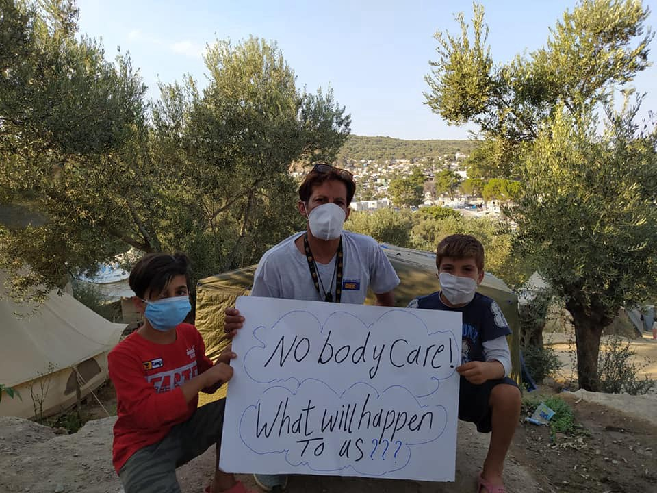
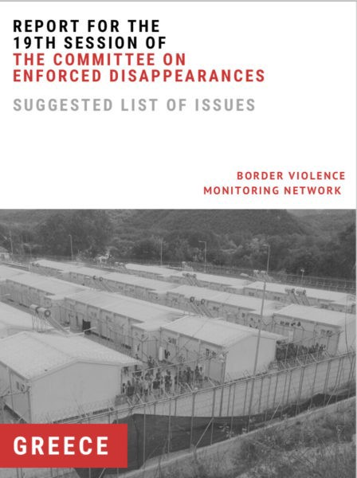
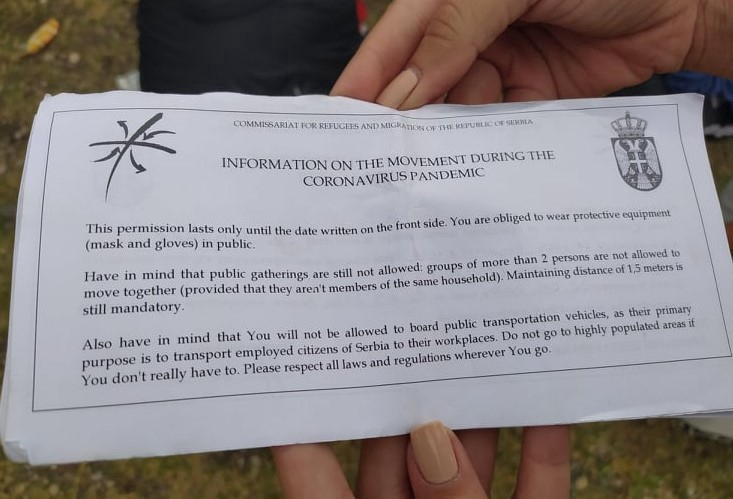
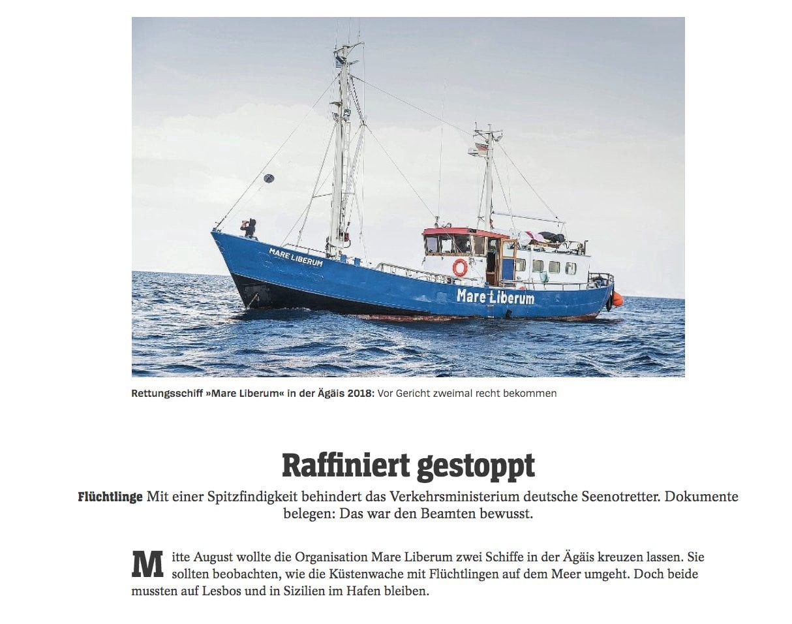

### AYS Daily Digest 4/9/20: “They are crueler during the night”
### Report to the United Nations Committee on Enforced Disappearance regarding the use of illegal pushbacks by the Greek government / undercover journalist at a French police station reveals hatred and racism of the officers / Revealed documents show the German Ministry was intentionally preventing the sailing of civil SAR ships in the Mediterranean / Anti\-racists are staging their own protest in solidarity with refugees in Dover / & more news

[Are You Syrious?](@AreYouSyrious?source=post_page-----4558ec5cd72f----------------------)

[Sep 5](ays-daily-digest-4-9-20-they-are-crueler-during-the-night-4558ec5cd72f?source=post_page-----4558ec5cd72f----------------------) · 14 min read

### FEATURED

Even though attention to and general concern about violent collective expulsions, pushbacks, has weakened, we wish to remind everyone that this continues, so this time we focus on one of the recently documented cases from the eastern part of Croatia\.

Long\-term activists in the area of Šid have documented testimonies from a group that, upon crossing into Croatia, after having slept for two hours in a forested area near the E70 highway north of Zupanja, were awoken by a group of six Croatian officers wearing black balaclava masks, standing over them\. What happened next is described in the BVMN’s [report](https://www.borderviolence.eu/violence-reports/august-25-2020-0000-zupanja-croatia/?fbclid=IwAR19-iySJi9HIKAYpFK3ni-5F2b116wWWgKk3Kq395-Sa6g3DjVPyGhZTJI) as follows:

> _At this point, the respondent described that it was in the middle of the night, in the early morning hours of August 24th at sometime between 2:00 and 5:00 am\. According to the respondent, the officers had arrived at their location with two cars had with them at least one dog\._ 

> _The officers discharged their firearms two times in the air next to their heads in order to scare them and, without talking or even asking any questions, they started to beat them with batons\. Afterwards the officers sent their dogs to jump on the respondents\._ 

> _According to the respondent, the dogs had muzzles so they could not bite and make marks on the bodies of people\-on\-the\-move\. The respondent said that the officers would stop the dogs from attacking and then revert to beating with batons\. This appeared to have been repeated a couple of times\._ 

> _After this, the Croatian authorities searched the involved people\-on\-the\-move and took and destroyed their phones\. Apparently, the primary respondent carried a phone for navigation and was subsequently beaten more than his friends\. He assumed that this was because the officers thought he was a smuggler\. He also recalled that for every possession they had with them, they would have been beaten more\._ 

> _“Everything I took out of my bag, they hit me\. Whatever it was, they hit me\.”_ 

In spite of all the evidence, reports and inquiries citing violent border practices supported by the European border agency and other institutions, things seem to remain the same\. Even more, as we wrote in yesterday’s News Digest, representatives of the German EU presidency argue that Frontex should be able to coordinate deportation flights on its own\. They also want to increase Frontex’s access to various databases and enhance its role in “voluntary return\.” While everything in this proposal is frightening and heralds a gross increase in Frontex’s powers, the casual discussion of the deportation of children who have no family to take care of them shows how callous the European border regime is\. In the meantime, the border violence — officially on behalf of all of us — continues\.
### EU
### First returns to Iraq

On Thursday, Germany’s Federal Office for Migration and Refugees \(BAMF\) [said](https://l.facebook.com/l.php?u=https%3A%2F%2Fwww.infomigrants.net%2Fen%2Fpost%2F27057%2Ffirst-european-voluntary-return-flight-to-iraq-since-start-of-pandemic%3Ffbclid%3DIwAR1aLRCct9aU84KbV1htdv136AO8HU9CvsnpaoLuk55xm9kblT-H4YFWsXc&h=AT2oJVouYsOfzVev8cnkzHqo9OUbhCEqVv8iQxz8tzk8PGmMAaw0nGJWXa84Tmt0eyYvxmuggltI6zMWmVkCsV0RG7_7CHG1Hh2dlxJyfuXIiQ9lSLyr9ExXxLVFWWfp4jK2d3F_d2ncLw) that Germany, France, the Netherlands and Belgium, together with the International Organization for Migration \(IOM\), provided a flight to Erbil and the capital Baghdad for 50 Iraqis\. The plane took off on Wednesday, September 2\.
According to BAMF, the return flight was supported by the European Union and financed by Frontex, the EU’s border and coast guard agency\.
### SEARCH AND RESCUE
### 27 people abandoned at sea

CSDM, Alarm Phone, Sea\-Watch and Mediterranea — Saving Humans requested an urgent intervention from United Nations Special Rapporteurs, seeking humanitarian assistance and safe disembarkation by the Government of Malta for the 27 migrants rescued and on board the commercial vessel Maersk Etienne\.

The _Maersk Etienne_ , currently at Hurd’s Bank, is at double its usual carrying capacity and has been out at sea for over a month\. It rescued the 27 people at sea on August 4 and has been unable to bring them to shore since, with no government accepting responsibility for them\.

One of the 27 refugees stuck on a merchant ship that has been blocked from Malta’s ports for four weeks threatened to kill himself by jumping overboard, the captain has warned\.
### [Refugee threatened to jump overboard from merchant ship blockaded by Malta for four weeks](https://thecivilfleet.wordpress.com/2020/09/04/refugee-threatened-to-jump-overboard-from-merchant-ship-blockaded-by-malta-for-four-weeks/?fbclid=IwAR0EXyXJk1ptz48WGvZUpYYCtZq71M5rd3afZMMjlNHRkSrOWeFKwWgFWDM)
### [The 27 refugees’ four\-week ordeal onboard the Etienne must come to an end, UNHCR urges ONE of the 27 refugees stuck on…](https://thecivilfleet.wordpress.com/2020/09/04/refugee-threatened-to-jump-overboard-from-merchant-ship-blockaded-by-malta-for-four-weeks/?fbclid=IwAR0EXyXJk1ptz48WGvZUpYYCtZq71M5rd3afZMMjlNHRkSrOWeFKwWgFWDM)
#### [thecivilfleet\.wordpress\.com](https://thecivilfleet.wordpress.com/2020/09/04/refugee-threatened-to-jump-overboard-from-merchant-ship-blockaded-by-malta-for-four-weeks/?fbclid=IwAR0EXyXJk1ptz48WGvZUpYYCtZq71M5rd3afZMMjlNHRkSrOWeFKwWgFWDM)

Maersk say that it is the longest time a commercial vessel has been stuck at sea due to a migration\-related standoff, media [report\.](https://timesofmalta.com/articles/view/watch-captain-makes-desperate-appeal-following-four-week-standoff.816162?fbclid=IwAR1aLRCct9aU84KbV1htdv136AO8HU9CvsnpaoLuk55xm9kblT-H4YFWsXc)

Read more [here](https://centre-csdm.org/csdm-alarm-phone-sea-watch-and-mediterranea-to-request-urgent-intervention-from-un-special-rapporteurs-for-27-migrants-on-board-maersk-etienne/?fbclid=IwAR1aLRCct9aU84KbV1htdv136AO8HU9CvsnpaoLuk55xm9kblT-H4YFWsXc) \.
### GREECE
### Islands

In the last two weeks, there has been an increase in bigger boats trying to cross from Turkey towards the Greek Aegean islands\. These boats are usually old, in very bad condition, and can’t be seen as anything other than death traps, ABR [reports\.](https://www.facebook.com/AegeanBoatReport/posts/913272389195866?hc_location=ufi)

The situation for people in Moria is getting worse, amind the reported Covid\-19 cases we reported about earlier\. 
Here is what the Moria Corona Awareness Team said in their statement:

> _“No one was sure that the virus would stay away from the camp, as we said thousands and thousands of times, all media right now is aware that the virus is not something that you can fight against, you cannot see the virus\._ 

> _Everyone has to be responsible for him or herself, because everyone is responsible for their own health\. We will continue, we will give information to the people, as we did in the past and also right now\. And the fight that we did in March was very successful, we didn´t let the virus get into the camp\._ 

> _So the Moria refugee camp is not even a place for human beings and it has been hard to control it but we controlled it from March until now, so we will continue our efforts and we will fight again like in March, raising awareness and giving information to the people and we will tell all the residents of Moria to be self\-organized\._ 

> _The virus finally got to the camp and it was something we did not expect at this point\. So let´s see what happens, no one knows\. as the whole world and all the European countries are fighting against this virus and there is still no treatment, no vaccine, no medical treatment for this virus\._ 

> _We will continue these activities to raise awareness\. We didn´t expect the virus to get into the camp, but unfortunately it got to the camp\. We said it a hundred times, that we are not sure because no one is able to fight against this virus\. So our enemy is really big, it´s COVID\-19, it´s Coronavirus and it´s really dangerous, so all around the world everyone is fighting\.”_ 

You can now get involved in the action to supply people at Vial, Chios, with bicycles\.

> _The camp is 1 hour 45 minutes walk from the town for an able bodied person and longer if you have children to carry or have mobility issues\._ 
 

> _Public transport is scarce and people have little money to pay for taxis \(This month the cash allowance for a single person has been cut from 90 euros to 75 per month\! \) \._ 
 

> _A bicycle could mean the ease of transport to get everyday supplies and access services, independence, some dignity, exercise and some happiness\._ 

### [🆘 URGENT WINTER APPEAL\. £10 = A Warm pair of feet in Vial Camp🆘](https://www.facebook.com/donate/739991096856889/?fundraiser_source=feed)
### [Winter will soon be upon us and once again it will be torture for the 4000 people living in freezing cold tents and…](https://www.facebook.com/donate/739991096856889/?fundraiser_source=feed)
#### [www\.facebook\.com](https://www.facebook.com/donate/739991096856889/?fundraiser_source=feed)

In the mainland, a number of people, including families with children, camped at the central Victoria Square in Athens this week\. Many struggle to get by and they end up homeless\. One of the reasons is that they lose the right to stay in asylum\-seeker housing once they’re granted refugee status\. 
In the meantime, following the prolonged lockdown, the Ministry of Asylum and Migration further announced [another round](https://www.ecre.org/greece-camp-lockdown-extended-children-in-detention-cuts-in-housing-red-tape-on-ngos-and-continued-push-backs/) of closures of hotel accommodation facilities for asylum seekers, in Kozani, Edessa, Prespes and Grevena\.

In the meantime, the practice of pushbacks continues:

For the [International Day of the Victims of Enforced Disappearances](https://www.un.org/en/observances/victims-enforced-disappearance) , the Border Violence Monitoring Network released its seminal report to the United Nations Committee on Enforced Disappearance regarding the use of illegal pushbacks by the Greek government\.

> _BVMN has consistently documented the disappearance of refugees and migrants from Greek territory, including the illegal pushbacks of 1196 persons\. BVMN is increasingly concerned about the disappearance and pushbacks of refugees and migrants from humanitarian distribution sites, refugee camps and pre\-removal centres in Greece\. The illegal pushback and disappearance of refugees and migrants is systematically followed by the statewide dismissal of credible evidence and the perpetual refusal to open a free and fair investigation into the whereabouts of the missing\._ 

### [Press Release: Enforced Disappearances Report to UN Committee on Enforced Disappearances — Border…](https://www.borderviolence.eu/15638-2/)
### [For the International Day of the Victims of Enforced Disappearances, the Border Violence Monitoring Network releases…](https://www.borderviolence.eu/15638-2/)
#### [www\.borderviolence\.eu](https://www.borderviolence.eu/15638-2/)

Official info for asylum seekers

Applicants for International Protection may [apply online](https://l.facebook.com/l.php?u=https%3A%2F%2Fapplications.migration.gov.gr%2Fen%2Fypovoli-aitiseon-metavoles-stoixeion%2F%3Ffbclid%3DIwAR0Bwy4wn7ydRzphRRlgEXZCGFnBcZsBwzFLtQtO1ZGYIgvWndtY2-ndaQQ&h=AT1k_uZYq5RT0re67fpxh5U8RyLXxB2ovz_dy1Pj72jegnxUK_nmU7EtnKfDEVrHC9_AeVWV1LFffgCTrRojya1l0qEvfZEuJYb3TOtTXhxwyERXCz9ZKXUIJlHIMyrXnwECOIY2wqfZRt_wJfIXIUUhaWCNvbhkE0jCrnWRtZp77L-2Aha-4Ekgi35od8SyplodWrplVIo3dymtZp7co4bxgQ0f4PcOOXNafFZcaEUxD55_cqj8mHJgbBTEG2F3rSsWpOiGWEbK9-TrJO9NzAiG5QjS6zYSUx0RpekVsZ1wHTApUZiCR-ZsJqN2etovWTxNHGLNCGx2AeKycWj-EFju3bSILCeY66jLPMqGDfUB-KjieDTk1wYpZIZtfZaj00g4gtQwQDruCrXIcUYSG17lDaGRubIviMW19rWLMj2u86q0c2W_tuTDDWGbavX6aAKCk6hDyo8RgnpQ61pL0k7Mu73GLpiYosfPdXz1gG1A0fJl-d_3Y_oMIOJqd1RgxXZX0tQaHHMol79AHysxfrkyW5CCpMVECXtwIOyenv_VrZ-nu0vqQYWDy4peLA1kIJ9op7hsqJFFRMr0syqTuUKTgEVBX2BaSFGeKKEtSJi1s074UeFPIOEAQKq64lpVQVI) and in their native language for the following services:
• Application to Change Contact Information
• Application to Change Personal Data
• Application to Postpone/Expedite the Interview Date
• Application to Request Statement of Application Status
• Application to Separate Files
• Application to Submit Additional Documents
• Application for Copies of Personal Files
• Application for Legal Aid

SERBIA

The Serbian association [Klikaktiv — Centar za razvoj socijalnih politika](https://www.facebook.com/klikaktiv/?tn-str=k%2AF&hc_location=group_dialog) reported encountering a group of people who had arrived at the old railway station in Loznica\. The activists took a photo of their “permit for entry and exit from the camp”\. As Klikaktiv reports, those permits aren’t valid nor are they in line with the laws of Serbia because people have the right to move freely and leave the camp whenever they want\. People running the camps issue such permits, without any official stamp, only to control them\. Unofficially, these papers are called “72 hours permit” because their front side says the person is allowed to stay outside the camps for 72 hours and that they will not be allowed in unless they come back within the given deadline\.

What worries them most are the points listed at the back of the paper, among others the second one in the photo above\.
The law on transport nowhere states that refugees in the territory of Serbia could be facing such an official limitation\. Given the fact that such flyers are printed at the reception camps and centres for asylum, the lawlessness of such a practice is even more notable\.

Also, the instruction that suggests refugees should avoid populated places bears a message that it is undesirable for them to be seen by a large number of people and thus, they are directly “pushed” toward abandoned buildings that are mostly in the periphery of smaller towns and villages, only to be blamed later for illegal squatting\. In this way, the authorities are pushing these people into the hands of smugglers and people traffickers\.

HUNGARY

Closing down

As reported in the recent ECRE Weekly bulletin: “From 1 September, Hungary has [**closed its borders**](https://www.euronews.com/2020/08/28/hungary-to-close-its-borders-in-bid-to-curb-covid-19-resurgence) to all foreigners with the exception of the V4 countries, reportedly for one month\. The closure was introduced as a COVID\-19 measure and according to prime minister Viktor Orbán’s head of cabinet, Gergely Gulyás, the reason is that: “there a risk of introducing the virus and most of the new infections are of foreign origin…” However, the initiative has met with criticism from the European Commission, warning Hungary that border closures are “not efficient” to fight COVID\-19\. Commissioners [**Ylva Johansson**](https://twitter.com/YlvaJohansson/status/1300726852814856192) and [**Didier Reynders**](https://twitter.com/dreynders/status/1300728199878332421) sent a letter to the Hungarian government: “recalling the importance of the integrity of the Schengen area and of applying border measures in a non\-discriminatory way to all EU citizens and residents”, and stating that “any measures that do not comply with those fundamental principles of EU law should of course be immediately retracted”\.”

ITALY

Eritreans Granted Entry Visas to Apply for Protection 11 Years After Being Illegally Returned

ECRE [reports](https://mailchi.mp/ecre/ecre-weekly-bulletin-04092020?e=989a4aebdd&fbclid=IwAR1m-4BiZ6wCuQjA45TXljDewfnw9Dyb89a90vh-mDZvTWVN0ixkAB4kIyo) : On 30 August 2020, five Eritrean nationals [**entered Italy**](https://www.asgi.it/asilo-e-protezione-internazionale/vittoria-diritto-asilo-respinti-illegalmente-eritrei-oggi-in-italia-con-visto/) after obtaining entry visas in order to access procedures for obtaining international protection after they were illegally returned to Libya in 2009\.

Their arrival follows a November 2019 [**ruling**](https://www.asgi.it/wp-content/uploads/2020/08/sentenza-22917.pdf) by the Court of Rome, which determined that the rejection and immediate return of 89 individuals to Libya was [**illegitimate**](https://www.asylumlawdatabase.eu/en/content/italy-recognition-right-enter-compensation-illegitimate-collective-expulsions-libya-italian) \. The Court determined that as a result of the immediate return, the individuals were unable to benefit from international protection due to the illicit action of the Italian authorities\. The ruling has therefore highlighted the necessity to expand the field of appreciation for international protection\.

FRANCE

Expulsions continue

The 725th expulsion since the start of this year has been documented in Calais\. Those affected did not have time to try to recover their personal belongings; 30 tents were seized\.
On September 4, fundamental rights are still not being respected, the local activists report\.

“Don’t worry, guys like him deserve death”

This is one of the many statements by a police officer about migrants, among them commonly called “the bastards“\.
It is a part of the testimony of a journalist, Valentin Gendrot, who went undercover for six months at the 19th police station\. It was in this same police station that Yann Manzi spent 40 hours in custody for filming a police check of people on the move, done by police officers who also injured him\. The founder of Utopia 56 was injured during his arrest [as he witnessed a beating\.](https://www.facebook.com/permalink.php?story_fbid=1527000710834029&id=598228360377940&hc_location=ufi)
### [“ Les flics sont censés lutter contre la violence, en pratique, ils en sont souvent un avant\-poste…](https://l.facebook.com/l.php?u=https%3A%2F%2Fwww.lemonde.fr%2Fpolice-justice%2Farticle%2F2020%2F09%2F03%2Fen-theorie-les-flics-sont-censes-lutter-contre-la-violence-en-pratique-ils-en-sont-souvent-un-avant-poste_6050802_1653578.html%3Ffbclid%3DIwAR19-iySJi9HIKAYpFK3ni-5F2b116wWWgKk3Kq395-Sa6g3DjVPyGhZTJI&h=AT0zxe5DniUjqht8bYyvHtSOh54zZxDPEl4Z0T7DBeIzhxJOpjQsBa3Vdu4Zm5U1xXdwcoDutVbOVHmpN7Ysy6yJLC4gsYWV5hQkGtEXzbb82O8SBRFdSKRdVBwfPQXygzdOc4zJwMT-2w)
### [Le journaliste Valentin Gendrot a passé six mois comme adjoint de sécurité au sein du commissariat du 19e…](https://l.facebook.com/l.php?u=https%3A%2F%2Fwww.lemonde.fr%2Fpolice-justice%2Farticle%2F2020%2F09%2F03%2Fen-theorie-les-flics-sont-censes-lutter-contre-la-violence-en-pratique-ils-en-sont-souvent-un-avant-poste_6050802_1653578.html%3Ffbclid%3DIwAR19-iySJi9HIKAYpFK3ni-5F2b116wWWgKk3Kq395-Sa6g3DjVPyGhZTJI&h=AT0zxe5DniUjqht8bYyvHtSOh54zZxDPEl4Z0T7DBeIzhxJOpjQsBa3Vdu4Zm5U1xXdwcoDutVbOVHmpN7Ysy6yJLC4gsYWV5hQkGtEXzbb82O8SBRFdSKRdVBwfPQXygzdOc4zJwMT-2w)
#### [l\.facebook\.com](https://l.facebook.com/l.php?u=https%3A%2F%2Fwww.lemonde.fr%2Fpolice-justice%2Farticle%2F2020%2F09%2F03%2Fen-theorie-les-flics-sont-censes-lutter-contre-la-violence-en-pratique-ils-en-sont-souvent-un-avant-poste_6050802_1653578.html%3Ffbclid%3DIwAR19-iySJi9HIKAYpFK3ni-5F2b116wWWgKk3Kq395-Sa6g3DjVPyGhZTJI&h=AT0zxe5DniUjqht8bYyvHtSOh54zZxDPEl4Z0T7DBeIzhxJOpjQsBa3Vdu4Zm5U1xXdwcoDutVbOVHmpN7Ysy6yJLC4gsYWV5hQkGtEXzbb82O8SBRFdSKRdVBwfPQXygzdOc4zJwMT-2w)

As InfoMigrant reported, in Paris, people are being thrown out from the provisional tent campsites every morning, after not having slept during the night for obvious reasons\. Surrounded by highways and major city thoroughfares, the camp has no benches to sit on, no toilets, and only one water point for about 300 people\. A single wooden chair has been placed in the middle of the camp, but no one seems to risk sitting on it\. It now counts about 200 small tents, and every day, new ones are added\. Volunteers from the French NGO Utopia 56 regularly visit the camp, which is inhabited by single men mostly hailing from Afghanistan\. [Here](https://www.infomigrants.net/en/post/27009/informal-settlement-near-paris-every-morning-the-police-tell-us-to-get-out?fbclid=IwAR3mHzyJ4G-Wye4SuoiVQS1GcqunV5ZmhG5AtY0dQVM_VU4_pKkDWfMM99s) ’s the story\.

SPAIN

Conditions inside the centre extremely unhealthy

In Melilla, more than 1,400 people — including 150 women and 143 children — have again been confined in the enclave’s overcrowded CETI \(Center for Temporary Stay of Immigrants\) following a Covid\-19 diagnosis, [it is reported](https://www.globaldetentionproject.org/covid-19-immigration-detention-platform?fbclid=IwAR3mHzyJ4G-Wye4SuoiVQS1GcqunV5ZmhG5AtY0dQVM_VU4_pKkDWfMM99s#Spain) \. On 21 August, the facility was closed with no\-one permitted to enter or exit — despite a judge’s decision on 24 August to overturn the government’s closure of this nominally open facility\.

As observers have highlighted since the start of the pandemic, conditions inside the centre are extremely unhealthy, with detainees unable to practice social distancing or implement recommended sanitation measures \(for more on conditions in CETIs, see our 15 May update\) \. This, combined with the news that a detainee had tested positive for the virus, prompted rising fears amongst the centre’s confined population, and on 25 August some of the centre’s detainees orchestrated peaceful protests in which they requested transfers to the mainland\. In response however, riot police fired rubber bullets and tear gas on the protestors\. According to Solidary Wheels, an independent group present in Melilla, several protestors were injured and 33 were arrested and had their phones confiscated\. The government’s spokesman also announced that as punishment, those arrested would not be transferred to the mainland\.

GERMANY

Documents to which the DER SPIEGEL had access prove that the Bundesministerium für Verkehr und digitale Infrastruktur, led by Andreas Scheuer, is “consciously” preventing the sailing of civil sea rescue ships in the Mediterranean\.

DENMARK

A letter explaining the conditions for the detained in Exit Center Ellebæk supports the growing need to close the centre\. The reading of the letter was one of the entries in the event “Shut It Down” that has previously been reported in the AYS News Digest\. Join the protest on Wednesday:
### [Ellebæk Prison — SHUT It DOWN\!](https://www.facebook.com/events/599405160945070/?acontext=%7B%22source%22%3A%224%22%2C%22feed_story_type%22%3A%22308%22%2C%22action_history%22%3A%22%5B%7B%5C%22surface%5C%22%3A%5C%22group%5C%22%2C%5C%22mechanism%5C%22%3A%5C%22main_list%5C%22%2C%5C%22extra_data%5C%22%3A%5B%5D%7D%5D%22%7D)
### [Causes event by Luk Ellebæk / Close Ellebæk and 3 others on Wednesday, September 2 2020 with 1\.1K people interested and…](https://www.facebook.com/events/599405160945070/?acontext=%7B%22source%22%3A%224%22%2C%22feed_story_type%22%3A%22308%22%2C%22action_history%22%3A%22%5B%7B%5C%22surface%5C%22%3A%5C%22group%5C%22%2C%5C%22mechanism%5C%22%3A%5C%22main_list%5C%22%2C%5C%22extra_data%5C%22%3A%5B%5D%7D%5D%22%7D)
#### [www\.facebook\.com](https://www.facebook.com/events/599405160945070/?acontext=%7B%22source%22%3A%224%22%2C%22feed_story_type%22%3A%22308%22%2C%22action_history%22%3A%22%5B%7B%5C%22surface%5C%22%3A%5C%22group%5C%22%2C%5C%22mechanism%5C%22%3A%5C%22main_list%5C%22%2C%5C%22extra_data%5C%22%3A%5B%5D%7D%5D%22%7D)

UK

Anti\-racist campaigners in Dover tomorrow in solidarity with refugees

Going against the far\-right groups who are set to descend on the port town, anti\-fascists are gathering in Dover this Saturday to oppose their racist agenda\. Reportedly, the fascist groups said they intended to “take over” Dover by blocking the port with a motorcade in protest against refugees crossing the Channel\.

The event, organised by Kent Anti\-Racism Network \(KARN\), is being held following the discovery of the body of drowned Sudanese refugee Abdulfatah Hamdallah washed up in Calais\. Their presence will counter the narrative spewed by far\-right groups that the government is leaving veterans on the street while providing refugees with hotel accommodation\.

“The fascist far\-right has no place in society and all anti\-racists must speak up in unequivocal solidarity with asylum\-seekers, refugees and migrants\. The real crisis is in housing, public services, and in an economy rigged in the interests of the super\-rich”

Officially campaigning to deter people who have the right to seek asylum

Although it turns out that the officials had done no formal research to establish why people were choosing the UK over other European countries, they now plan to launch a “strategic communications” campaign to deter asylum seekers from crossing the Channel\. Ministers have characterised crossings as “illegal migration” but the Home Affairs Committee was told that 98 per cent of the people who have arrived on small boats so far in 2020 were asylum seekers\.
Evidence presented to the Home Affairs committee of MPs on 3 September makes clear that the majority of those making the perilous crossing are either being granted refugee status straight away or come from countries for which the success rate in asylum applications is extremely high, FreeMovement [reported\.](https://www.freemovement.org.uk/channel-boat-people-are-refugees-home-office-officials-confirm/?fbclid=IwAR19-iySJi9HIKAYpFK3ni-5F2b116wWWgKk3Kq395-Sa6g3DjVPyGhZTJI)
### FOR FURTHER READING

More than 400 people on the move have been trapped between Una\-Sana and Republic of Srpska, with no food, water and possibility to be medically treated\. Here is one of the reports on the mounting number of troubles for the people there\.
### [Izbjeglice na ničijoj zemlji između saosjećanja, politike i napada — Detektor](https://detektor.ba/2020/09/04/izbjeglice-na-nicijoj-zemlji-izmedju-saosjecanja-politike-i-napada?fbclid=IwAR1aLRCct9aU84KbV1htdv136AO8HU9CvsnpaoLuk55xm9kblT-H4YFWsXc)
### [Alžirca Halida policija je iz Bihaća, zajedno sa još nekoliko stotina izbjeglica i migranata, prebacila izvan…](https://detektor.ba/2020/09/04/izbjeglice-na-nicijoj-zemlji-izmedju-saosjecanja-politike-i-napada?fbclid=IwAR1aLRCct9aU84KbV1htdv136AO8HU9CvsnpaoLuk55xm9kblT-H4YFWsXc)
#### [detektor\.ba](https://detektor.ba/2020/09/04/izbjeglice-na-nicijoj-zemlji-izmedju-saosjecanja-politike-i-napada?fbclid=IwAR1aLRCct9aU84KbV1htdv136AO8HU9CvsnpaoLuk55xm9kblT-H4YFWsXc)

What happens if you come to Europe with a tourist visa and claim asylum?
### [What happens if you come to Europe with a tourist visa and claim asylum?](https://l.facebook.com/l.php?u=https%3A%2F%2Fwww.infomigrants.net%2Fen%2Fpost%2F26903%2Fwhat-happens-if-you-come-to-europe-with-a-tourist-visa-and-claim-asylum%3Ffbclid%3DIwAR1aLRCct9aU84KbV1htdv136AO8HU9CvsnpaoLuk55xm9kblT-H4YFWsXc&h=AT1NhPoOST4I6EtPZcTrPeX31rlQtuiV3Dt8kwuTEwwUOdV8n1Y3O3QNeU1f_6_I4XK0HZrFV43V-HnZ587d_XrGHwk1PPwbwvd07a5JYvTgycfljzw4X1bpQxjXS3lJYU3iQ426egfRMQ)
### [The Dublin Regulation is the European law that determines where an asylum seeker’s claim is processed\. But does it…](https://l.facebook.com/l.php?u=https%3A%2F%2Fwww.infomigrants.net%2Fen%2Fpost%2F26903%2Fwhat-happens-if-you-come-to-europe-with-a-tourist-visa-and-claim-asylum%3Ffbclid%3DIwAR1aLRCct9aU84KbV1htdv136AO8HU9CvsnpaoLuk55xm9kblT-H4YFWsXc&h=AT1NhPoOST4I6EtPZcTrPeX31rlQtuiV3Dt8kwuTEwwUOdV8n1Y3O3QNeU1f_6_I4XK0HZrFV43V-HnZ587d_XrGHwk1PPwbwvd07a5JYvTgycfljzw4X1bpQxjXS3lJYU3iQ426egfRMQ)
#### [l\.facebook\.com](https://l.facebook.com/l.php?u=https%3A%2F%2Fwww.infomigrants.net%2Fen%2Fpost%2F26903%2Fwhat-happens-if-you-come-to-europe-with-a-tourist-visa-and-claim-asylum%3Ffbclid%3DIwAR1aLRCct9aU84KbV1htdv136AO8HU9CvsnpaoLuk55xm9kblT-H4YFWsXc&h=AT1NhPoOST4I6EtPZcTrPeX31rlQtuiV3Dt8kwuTEwwUOdV8n1Y3O3QNeU1f_6_I4XK0HZrFV43V-HnZ587d_XrGHwk1PPwbwvd07a5JYvTgycfljzw4X1bpQxjXS3lJYU3iQ426egfRMQ)

Biometrics have crept into humanitarian aid, but the systems may disadvantage women who need help most\.
### [Big Brother Turns Its Eye on Refugees](https://foreignpolicy.com/2020/09/02/big-brother-turns-its-eye-on-refugees/?fbclid=IwAR04ZAkfgwg8Xgu4Er_2-B-pUoz4ljwetpw4dYrPkW5pCee68AlBjTarylM)
### [Perhaps without us realizing it, biometrics have crept into many corners of our lives\. The prevalence of biometrics\-the…](https://foreignpolicy.com/2020/09/02/big-brother-turns-its-eye-on-refugees/?fbclid=IwAR04ZAkfgwg8Xgu4Er_2-B-pUoz4ljwetpw4dYrPkW5pCee68AlBjTarylM)
#### [foreignpolicy\.com](https://foreignpolicy.com/2020/09/02/big-brother-turns-its-eye-on-refugees/?fbclid=IwAR04ZAkfgwg8Xgu4Er_2-B-pUoz4ljwetpw4dYrPkW5pCee68AlBjTarylM)

**If you wish to contribute, either by writing a report or a story, or by joining the info gathering team, please let us know\.**

**We strive to echo correct news from the ground through collaboration and fairness\. Every effort has been made to credit organisations and individuals with regard to the supply of information, video, and photo material \(in cases where the source wanted to be accredited\) \. Please notify us regarding corrections\.**

**If there’s anything you want to share or comment, contact us through Facebook, Twitter or write to: areyousyrious@gmail\.com**
### Sign up for AYS Daily Newsletter
### By Are You Syrious?

Daily news digests from the field, for volunteers, people on the move, journalists, and the general public [Take a look](/are-you-syrious/newsletters/ays-daily-newsletter?source=newsletter_v3_promo--------------------------newsletter_v3_promo-)

_Converted [Medium Post](https://medium.com/are-you-syrious/ays-daily-digest-4-9-20-they-are-crueler-during-the-night-882d652e676a) by [ZMediumToMarkdown](https://github.com/ZhgChgLi/ZMediumToMarkdown)._
