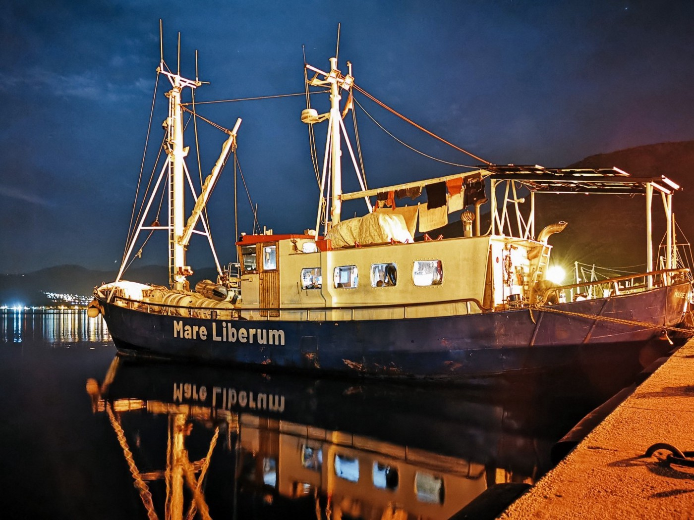
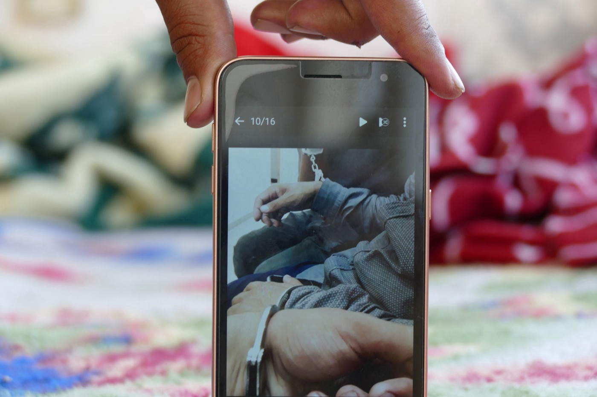
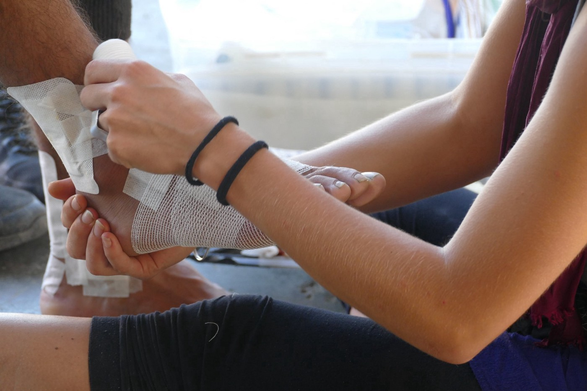

### AYS Weekend Digest 05–06/9/20: The Mare Liberum must not be silenced\!
#### Video of illegal pushback from Croatia // Far\-right anti\-migrant protests in the UK // Death of three children in Syrian refugee camp // Transfer of 800 people from overcrowded Italian refugee centres // Two new coronavirus cases in Moria

The Mare Liberum \(Photo Credit: [https://mare\-liberum\.org/en/mare\-liberum/](https://mare-liberum.org/en/mare-liberum/) \)
### Feature

Mare Liberum, a leading human rights monitoring and search\-and\-rescue organisation, [had their ship searched](https://www.facebook.com/MareLiberumOfficial/) by the Hellenic Coast Guard and Greek police on Friday\. During the search, the police confiscated all electronic devices and took four crew members to the police station for almost 8 hours\. Mare Liberum aims to document and draw public attention to the dangerous situation at the European border between Turkey and Greece and to strengthen solidarity and fundamental human rights\. They have constantly documented the use of illegal pushbacks by the Hellenic Coast Guard and Greek police\. The search of the ship and the arrest of four crew members is a clear attempt to criminalise their work and intimidate their crew and is part of a growing wave of repression against refugees and human rights NGOs that has been initiated since the right\-wing party Nea Demokratia came into power\.

In addition to the harassment from the Greek authorities that Mare Liberum has to endure, they also face similar efforts by the German government to restrict and limit their reporting and rescue activities\. In August, German authorities ordered the detention of the ships “Mare Liberum” and “Sebastian K” of the non\-profit association Mare Liberum e\.V\.

Speaking about the blockade, [Hanno Bruchmann, board member of Mare Liberum said](https://mare-liberum.org/en/news/germany-detains-ships-of-human-rights-organization-mare-liberum/) : “ _We are furious and won’t accept the blockade of our mission for solidarity and human rights\. Now that our ships are officially detained, we will immediately urge for an accelerated response to repeal the detention\. The German Federal Minister of Transport, Andreas Scheuer, deliberately prevents humanitarian operations with the change of law in the regulation on ship safety\. It violates higher\-ranking German law and will not last”\._ On Friday, Mare Liberum submitted an appeal for an accelerated response to the German court for a decision that allows them to sail their two ships\.

The current attempts by the Greek and German authorities to silence, limit or restrict the work of Mare Liberum have come shortly after the publication of a series of investigative reports by the organisation into the role of both countries in the illegal pushback and refoulement of refugees and migrants in the Aegean Sea\. On August 8th, Mare Liberum published an investigation into ‘ [how Greece and the EU systematically violate human rights’](https://mare-liberum.org/en/news/how-greece-and-the-eu-systematically-violate-human-rights/) whereby they detailed the use of pushbacks, the sabotaging of boats and the use of dangerous manoeuvres by the Greek coast guard\. [On August 22nd](https://mare-liberum.org/en/news/involment-germany-illegal-pushbacks-aegean/) , they published another report where they examined to what extent are German police and Bundeswehr \(German military\) ships involved in practices that violate international maritime law, the Geneva Convention and applicable EU law\.

Mare Liberum must not be silenced\. If you wish to support them with donations or follow their activities, please follow the link below:
### [Mare Liberum](https://mare-liberum.org/en/)
### [Mare Liberum leistet mit einem Schiff Beobachtungen der Menschenrechte in der Ägäis\.](https://mare-liberum.org/en/)
#### [mare\-liberum\.org](https://mare-liberum.org/en/)
### Bosnia and Herzegovina

No Name Kitchen has published a new video exposing what it looks like to be pushed back from Croatia with your five\-year\-old son: cramped in a dark van, drenched in sweat, nauseous, surrounded by twenty other people in an area intended for only eight persons, nervous of the violence that faces you ahead\. No Name Kitchen met Mehran who is from Afghanistan and is the father shown in the video and he shared the following with them:

> _“During my stay in Bosnia, I made five trips to Croatia\. I walked from the forest to Glina three times\. I entered Croatia twice from the Šturlić border crossing with a group of single men and my child, and this film is the same with which I was able to document a small piece of the cruel behaviour of the Croatian police on July 24th\._ 

> _When the Croatian police approach the refugee, the first thing they do is inspect and receive the refugee’s mobile phone \[in order to hide\] the crimes they have committed against humanity\. Fortunately, I was able to hide my mobile phone\. Dozens of terrible disasters are committed by those who chant the slogan of human rights and humanity\._ 

> _I hope and pray that no one will have to leave their warm home for the scary and cold forest with a 5\-year\-old child \[as I have done\] \. Or that they don’t have to go for a year without seeing their child, as my wife has done\.”_ 

[The Service for Foreigner’s Affairs of Bosnia](http://www.federalna.ba/bhs/vijest/332584/drzavljani-turske-pakistana-i-iraka?fbclid=IwAR14YjdpgNbT0tsSzCIoh6lkGimJTKu3dQlf1w4VPU6MdPgo29mutqYWM24) and Herzegovina has returned 16 people from the territory to the Republic of Turkey\. In addition to the return of these 16 people, through the Program of Assisted Voluntary Return which is conducted through cooperation with the IOM, they have recently returned six citizens of Pakistan and five citizens of Iraq to their respective country of origin\.
### Libya

[The UNHCR has published their September update\.](https://reliefweb.int/sites/reliefweb.int/files/resources/UNHCR%20Libya%20Update%204%20September%202020.pdf) They state that as of 2nd September, 7,535 refugees and migrants have been registered as rescued/intercepted at sea by the Libyan Coast Guard and disembarked in Libya\. The majority of those who disembarked in Libya as of yet, comprise nationals from Sudan \(28 per cent\), Bangladesh \(13 per cent\) and Mali \(8 per cent\) \. So far this year, a total of 2,214 persons of concern to UNHCR have been disembarked in Libya\.
### Sweden

On Friday, [a quiet moment of remembrance](https://www.svt.se/nyheter/lokalt/varmland/minnesstund-efter-flera-sjalvmord-bland-ensamkommande?cmpid=del%3Afb%3A20200904%3Aminnesstund-efter-flera-sjalvmord-bland-ensamkommande%3Anyh%3Alp&fbclid=IwAR1bUPSKPMl2DAC-NlKzt9e1JB_bVH4un9A4yE39K4sIT7ciJIeOLjd_SIE) was held in memory of two young unaccompanied Afghan asylum seekers who had recently lost their lives through suicide\. The organisers stated that they ‘ _first and foremost want to show compassion for the two who took their lives but also help others, so it does not happen again_ ’\. In Sweden, an unfortunately high number of minors are committing suicide while waiting to be notified of a resident permit\.

According to a survey [conducted in 2018 by Karolinska Institutet](https://www.svt.se/nyheter/inrikes/flera-fall-av-sjalvmord-bland-ensamkommande-barn) , suicide is the leading cause of death in the group, with approximately twelve unaccompanied asylum\-seeking children having committed suicide during the year of the study\. Within Sweden, as asylum seekers do not have social security numbers, it is more difficult to keep statistics on suicide among them in comparison to other social groups\. Petra Rinman, head of the National Board of Health and Welfare’s knowledge centre for unaccompanied children and young people said in 2018 that: _“The young people who are most difficult to help are those who have ended up outside the system, and who today are referred to the support of voluntary organisations, it is deeply worrying”\._
### Sea

The Maersk Tanker \(the Etienne\), who over thirty days ago responded to a request from Maltese authorities to help a nearby boat in distress, has reported horrifying new updates about the situation of the 27 people still stuck onboard\. On the 6th of September, the Maersk Tanker tweeted that three desperate migrants had jumped overboard\. The crew managed to act quickly and recover the persons and brought them back on board, but the continued refusal by Maltese authorities to allow safe disembarkation of the migrants is causing deep desperation among both the crew and the people who they rescued\.

Speaking to [The New York Times about the refusal of Malta to allow the boat into port to disembark](https://www.nytimes.com/2020/09/04/world/europe/migrant-tanker-mediterranean.html?smid=tw-share) , Tommy Thomassen, the chief technical officer of Maersk Tankers said:“ _It is one of the rules of life at sea that you respond to those in distress, and we have always done that and we will keep doing that…But the lack of a response here sends the wrong signals to those out there in the commercial fleet\.”_

_“We’ve done our duty as a shipping company,_ ” Mr\. Thomassen said\. “ _Now it’s up to the authorities to do their duty and find a solution\.”_
### UK

[Detainedvoices\.com](https://detainedvoices.com/) ; an organisation that reports the stories, experiences and demands by people held in UK immigration detention centres has shared the story of a Syrian man currently detained in Brook House IRC, a detention centre near Gatwick\. [The story details his experience watching the deportation of some of his Syrian friends:](https://detainedvoices.com/2020/09/06/detainee-speaks-on-friends-deportations-to-the-people-who-talk-about-human-rights-come-and-see-how-they-are-treating-us/?fbclid=IwAR1bUPSKPMl2DAC-NlKzt9e1JB_bVH4un9A4yE39K4sIT7ciJIeOLjd_SIE)

> _After my friends were deported, we could hear the very same guards laughing and drinking all night till 4 am\. As if they were celebrating the deportation\. What is this racism?_ 

> _I spoke to my friend today, who was deported\. He is on the streets now\. His brother passed away and his mother risked everything to get him here\. There is nothing for him in Spain, you could say he might as well be in Syria\. He doesn’t have his Syrian passport or his identity card\. Nothing\. No food\. He is on the streets\. There’s nothing\._ 

> _They deported them all without their passports, without their identity cards\. They took them from us in Dover, and never gave it back to them\. We’ve lost so much trying to get here\. Our families have sold all their properties, and all that they have\. They have nothing left\. We are tired of this\. It is too much\._ 

> _They are targeting people who crossed by water\. They are trying to scare us\. Where are the human rights that we hear about? There’s no human rights here\. What have we done to deserve this treatment?_ 

To read the full story and to hear the experiences of the individuals currently stuck in UK detention centres please follow the link below:
### [Detainee speaks on friends’ deportations: To the people who talk about human rights… come and see…](https://detainedvoices.com/2020/09/06/detainee-speaks-on-friends-deportations-to-the-people-who-talk-about-human-rights-come-and-see-how-they-are-treating-us/)
### [A man fleeing violence in Syria calls us from Brook House IRC, a detention centre near Gatwick, London, He calls in the…](https://detainedvoices.com/2020/09/06/detainee-speaks-on-friends-deportations-to-the-people-who-talk-about-human-rights-come-and-see-how-they-are-treating-us/)
#### [detainedvoices\.com](https://detainedvoices.com/2020/09/06/detainee-speaks-on-friends-deportations-to-the-people-who-talk-about-human-rights-come-and-see-how-they-are-treating-us/)

This weekend, [dozens of far\-right, anti\-immigration protesters mobilised in the English coastal town of Dover](https://www.dw.com/en/far-right-protesters-clash-with-uk-police-at-anti-migrant-march/a-54828206?fbclid=IwAR2yBwjsnz4w5oAVLzvsF_esD2zviLRlWc5hahBuplA229lzLD6rV2j5_IE) to protest against the numbers of migrants sailing to the United Kingdom from France\. The mobilisation of the far\-right in Dover has come just weeks after far\-right group Britain\-First harassed migrants and refugees being housed in a hotel during a ‘ [migrant hunting](https://www.mirror.co.uk/news/uk-news/cowardly-britain-first-go-migrant-22595314) ’ trip\.

Video footage on Twitter shows fights breaking out between police and a number of far\-right protesters\. Those detained were held on suspicion of violent disorder, assaulting an emergency worker and a racially aggravated public order offence, a police statement said\.

Discussing the arrests, Chief Superintendent Nigel Brookes said: “ _We stated that it was unacceptable for anyone to use the event as an excuse for criminal behaviour and we were robust in taking action against those who did”\._
### Syria

Activists from the Syrian Observatory and the Syrian Civil Defence\-White Helmets have reported the death of three children after a fire broke out in the Al\-Salama refugee camp\. The reasons behind the outbreak of fires in the camp are yet to be known — either caused by a gas leak inside the camp or the high temperatures\.

[Syriahr\.com report how the recent heat wave](https://www.syriahr.com/en/182889/?fbclid=IwAR2yBwjsnz4w5oAVLzvsF_esD2zviLRlWc5hahBuplA229lzLD6rV2j5_IE) has worsened the inhumane situation of the displaced people who live in uninhabitable tents where they suffer from the lack of minimum levels of basic necessities\. Reporting on the heat\-wave, SOHR sources said that several people passed out due to the high temperatures\. This has been acerbated by the rising prices and lack of ice blocks that are used for cooling drinking water, with people waiting in long lines in order to get only a small piece of ice which can now be sold for upwards of 3,500 SYL \(€5\.07\) \.
### Spain

[EuropePress reports](https://www.europapress.es/asturias/noticia-asturias-destina-100000-euros-hacer-frente-coronavirus-republica-democratica-congo-20200905120034.html?fbclid=IwAR14YjdpgNbT0tsSzCIoh6lkGimJTKu3dQlf1w4VPU6MdPgo29mutqYWM24) that the Government of the Principality of Asturias has announced that it will finance a UNHCR aid program to help cope with the effects of COVID\-19 in the Democratic Republic of the Congo\. The 100,000 Euro finance package is reported to benefit an estimated 300 families \(a total of 1,800 people since the average is six members\), to whom the community will build a house or deliver self\-construction kits, depending on the degree of vulnerability\. Further to this, the overall project aim is to avoid contagions, protect health and favour the integration of the inhabitants\.
### Bangladesh

[On Saturday, Bangladeshi authorities](https://www.aa.com.tr/en/asia-pacific/rohingya-tour-islet-marked-for-relocation-by-bangladesh/1964208?fbclid=IwAR14YjdpgNbT0tsSzCIoh6lkGimJTKu3dQlf1w4VPU6MdPgo29mutqYWM24) took a group of Rohingya refugees to inspect a tiny islet near its coast, where it is reported that the authorities hope to relocate some of the 1\.2 million Rohingya refugees who sought safety in Bangladesh\. Despite widespread criticism of the plan, a total of 40 Rohingya refugees were taken to Bhashan Char, an islet in the Bay of Bengal around 50 kilometres \(31 miles\) off Bangladesh’s southwestern coast to “evaluate the living conditions and decide whether the land is suitable for relocation”\. It’s reported that no international observer was part of the group visiting the settlement\.

A UN official told [Anadolu Agency](https://www.aa.com.tr/en/asia-pacific/rohingya-tour-islet-marked-for-relocation-by-bangladesh/1964208?fbclid=IwAR14YjdpgNbT0tsSzCIoh6lkGimJTKu3dQlf1w4VPU6MdPgo29mutqYWM24) that any relocation must be voluntary and can only commence after a thorough evaluation by competent authorities\.

> _“The UN’s longstanding position remains that comprehensive technical and protection assessments to evaluate the safety and sustainability of life on Bhasan Char are essential before any relocations to the island take place, and that any relocations should be voluntary,” said Mostafa Mohammad Sazzad Hossain, a UN Refugee Agency \(UNHCR\) communications officer in Dhaka\._ 

Some have said the new location will be nothing but “an open\-air prison” for the Rohingya community, the Bangladeshi authorities have suggested under this new plan, up to 100,000 people will be able to live here\.
### Italy

On Saturday, the Italian government transferred an estimated 800 migrants to a ferry from a facility on the small island of Lampedusa\. Although it’s reported that the aim of this move is to relieve some of the severe overcrowding at the centre, the centre still remains hugely overcrowded as it currently houses 500 people despite being designed for a maximum of 200\.
### Greece

[No Name Kitchen have shared](https://www.facebook.com/NoNameKitchenBelgrade/posts/1066073537124263) how in recent weeks testimonies have emerged from Patras of inhuman and degrading treatment inflicted by the police and private security forces operating in the port area\.

Every day, NNK say that they are witnessing the abuse of the “monopoly of violence”\. They speak of the ‘batons, fists, threats, insults, jerks, breaking cell phones, night and day raids inside the factories, detention or forced transfers without a trace’ that face the people that currently seeking safety in the port area\.

To read their full public statement please view [the link below:](https://www.facebook.com/NoNameKitchenBelgrade/posts/1066073537124263)
### [No Name Kitchen](https://www.facebook.com/NoNameKitchenBelgrade/photos/pcb.1066073537124263/1066067903791493/)
### [\(ESPAÑOL DEBAJO\) This is what it looks like to be pushed back from … Croatia with your five\-year\-old son: cramped in…](https://www.facebook.com/NoNameKitchenBelgrade/photos/pcb.1066073537124263/1066067903791493/)
#### [www\.facebook\.com](https://www.facebook.com/NoNameKitchenBelgrade/photos/pcb.1066073537124263/1066067903791493/)

On Saturday, two new coronavirus cases were detected at the refugee reception and identification centre at Moria, Lesvos\. These cases were detected from the first 500 samples collected by the National Public Health Organization \(EODY\) in and around the Moria hotspot\. [The National Herald report](https://www.thenationalherald.com/archive_general_news_greece/arthro/fire_on_greek_tanker_off_sri_lanka_under_control_ship_towed_away-808939/) that 2 newly infected patients lived near the tent of a 40\-year old Somali man, a Moria resident, who tested positive for COVID\-19 on Wednesday and who is currently hospitalized at Mytilini general hospital with complications from underlying health issues\.

The 500 samples that were taken are part of an ongoing effort to collect a total of 2,000 samples\. The sampling takes place in the sanitary unit of the Moria Hospital, which was recently built with a donation from the Dutch Government\. While not yet fully operational, the Ministry of Immigration and Asylum has affirmed that the hospital will be completely ready within the current month of September\.

Speaking about the two new coronavirus cases, [The Moria Corona Awareness Team](http://still%20there%20are%20old%20and%20sick%20people%20in%20the%20camp.%20not%20as%20many%20as%20in%20march%20and%20april%20but%20the%20need%20to%20be%20evacuated%20now.%20otherwise%20this%20is%20their%20death%20sentence.%20%20we%20are%20all%20in%20a%20very%20very%20dangerous%20and%20bad%20situation.%20not%20only%20us%20in%20the%20camp%20but%20everyone%20on%20this%20island.%20%20but%20we%20will%20are%20not%20ready%20to%20give%20up.%20this%20morning%20all%20the%20mask%20sewing%20time%20came%20even%20earlier%20and%20will%20stay%20longer.%20they%20just%20said%20the%20can%20easily%20sew%20enough%20masks%20for%20everyone%20in%20the%20camp%20if%20they%20receive%20enough%20cloth%20and%20support./) published a public statement on Facebook where they wrote:

> _Still there are old and sick people in the camp\. Not as many as in March and April but the need to be evacuated NOW\. Otherwise this is their death sentence\._ 

> _We are all in a very very dangerous and bad situation\. Not only us in the camp but everyone on this island\._ 

> _But we will are not ready to give up\. This morning all the mask sewing time came even earlier and will stay longer\. They just said the can easily sew enough masks for everyone in the camp if they receive enough cloth and support\._ 

### Germany

[Evangelisch\.de report](https://www.evangelisch.de/inhalte/174513/05-09-2020/vizekanzler-scholz-kommunen-sollten-fluechtlinge-aufnehmen-duerfen?fbclid=IwAR2yBwjsnz4w5oAVLzvsF_esD2zviLRlWc5hahBuplA229lzLD6rV2j5_IE) that Vice\-Chancellor Olaf Scholz has spoken out in favour of enabling cities and municipalities that have declared their willingness to accept refugees from the Greek camps to do so beyond the agreed measures of the federal government\. Vice\-Chancellor Olaf Scholz told the “Neue Osnabrücker Zeitung” on Saturday: “ _We should make the humanitarian gesture possible to take in refugees from these camps when cities and municipalities in Europe agree to take them”_ \. The finance minister and SPD candidate for chancellor responded to this by further clarifying “s _uch decisions are not enacted by a government or from Brussels alone, but are made possible by the civil society commitment of the local people”\._
### Cyprus

On Saturday afternoon a boat with 33 migrants was spotted off Limassol, Cyprus\. After “consultations” with the Lebanese authorities, the Cypriot authorities decided to push back the group, including 14 children and six women\.

The Cypriot authorities leased a private boat to conduct the pushback as it was deemed too dangerous to send the group back to Lebanon in the boat they first arrived on\. [The Cyprus\-Mail](https://cyprus-mail.com/2020/09/06/arrests-after-arrival-of-migrant-group-another-one-sent-back/?fbclid=IwAR1bUPSKPMl2DAC-NlKzt9e1JB_bVH4un9A4yE39K4sIT7ciJIeOLjd_SIE) report that the group was escorted back to Lebanon with nurses, an interpreter, migration and police officers\.

Police on Sunday said they arrested four of the men in that group, three from Syria aged 31, 25 and 21, and one from Lebanon, 19, on suspicion of people smuggling\. They are believed to be the owners and drivers of the boat\.
### Further Reading:

OpenDemocracy — OpenJustice:Opinion
Government rhetoric on migrants is a smoke screen for a deeper agenda:
### [Government rhetoric on migrants is a smoke screen for a deeper agenda](https://www.opendemocracy.net/en/openjustice/human-rights-coronavirus/government-rhetoric-migrants-smoke-screen-deeper-agenda/?fbclid=IwAR2yBwjsnz4w5oAVLzvsF_esD2zviLRlWc5hahBuplA229lzLD6rV2j5_IE)
### [A political storm is raging over desperate people crossing the Channel in small dinghies\. Last month we saw the death…](https://www.opendemocracy.net/en/openjustice/human-rights-coronavirus/government-rhetoric-migrants-smoke-screen-deeper-agenda/?fbclid=IwAR2yBwjsnz4w5oAVLzvsF_esD2zviLRlWc5hahBuplA229lzLD6rV2j5_IE)
#### [www\.opendemocracy\.net](https://www.opendemocracy.net/en/openjustice/human-rights-coronavirus/government-rhetoric-migrants-smoke-screen-deeper-agenda/?fbclid=IwAR2yBwjsnz4w5oAVLzvsF_esD2zviLRlWc5hahBuplA229lzLD6rV2j5_IE)

Niamh Ni Bhriain
The Deadly Politics of Colonial Borders during the COVID\-19 Pandemic:
### [Niamh Ni Bhriain — The Deadly Politics of Colonial Borders during the Covid\-19 Pandemic \| Brave New…](https://braveneweurope.com/niamh-ni-bhriain-the-deadly-politics-of-colonial-borders-during-the-covid-19-pandemic?fbclid=IwAR14YjdpgNbT0tsSzCIoh6lkGimJTKu3dQlf1w4VPU6MdPgo29mutqYWM24)
### [There is a concerted effort by EU leaders to keep people seeking asylum out at all costs, & far too often they pay the…](https://braveneweurope.com/niamh-ni-bhriain-the-deadly-politics-of-colonial-borders-during-the-covid-19-pandemic?fbclid=IwAR14YjdpgNbT0tsSzCIoh6lkGimJTKu3dQlf1w4VPU6MdPgo29mutqYWM24)
#### [braveneweurope\.com](https://braveneweurope.com/niamh-ni-bhriain-the-deadly-politics-of-colonial-borders-during-the-covid-19-pandemic?fbclid=IwAR14YjdpgNbT0tsSzCIoh6lkGimJTKu3dQlf1w4VPU6MdPgo29mutqYWM24)

My Name is Not Refugee and The Boy With Two Hearts on Bishop’s Stortford College librarian Lizzie Hall’s recommended reading list on the subject of refugees:
### [Read these incredible and inspiring stories to better understand the plight of refugees](https://www.bishopsstortfordindependent.co.uk/whats-on/read-these-incredible-and-inspiring-stories-to-better-understand-the-plight-of-refugees-9121581/?fbclid=IwAR14YjdpgNbT0tsSzCIoh6lkGimJTKu3dQlf1w4VPU6MdPgo29mutqYWM24)
### [Dear Reader\. Almost every day we see news stories about refugees\. And there are countless children in this country who…](https://www.bishopsstortfordindependent.co.uk/whats-on/read-these-incredible-and-inspiring-stories-to-better-understand-the-plight-of-refugees-9121581/?fbclid=IwAR14YjdpgNbT0tsSzCIoh6lkGimJTKu3dQlf1w4VPU6MdPgo29mutqYWM24)
#### [www\.bishopsstortfordindependent\.co\.uk](https://www.bishopsstortfordindependent.co.uk/whats-on/read-these-incredible-and-inspiring-stories-to-better-understand-the-plight-of-refugees-9121581/?fbclid=IwAR14YjdpgNbT0tsSzCIoh6lkGimJTKu3dQlf1w4VPU6MdPgo29mutqYWM24)

“Politics of letting die” at EU borders:
### [Migrationsforscherin: “Politik des Sterbenlassens” an EU\-Grenzen](https://www.tagesschau.de/ausland/migrationsforschung-flucht-interview-101.html?fbclid=IwAR14YjdpgNbT0tsSzCIoh6lkGimJTKu3dQlf1w4VPU6MdPgo29mutqYWM24)
### [Die Fluchtursachen bleiben, die Gesetze werden härter, das Gesellschaftsklima rauer: Migrationsforscherin Hess…](https://www.tagesschau.de/ausland/migrationsforschung-flucht-interview-101.html?fbclid=IwAR14YjdpgNbT0tsSzCIoh6lkGimJTKu3dQlf1w4VPU6MdPgo29mutqYWM24)
#### [www\.tagesschau\.de](https://www.tagesschau.de/ausland/migrationsforschung-flucht-interview-101.html?fbclid=IwAR14YjdpgNbT0tsSzCIoh6lkGimJTKu3dQlf1w4VPU6MdPgo29mutqYWM24)

Refugee Phrase Book:
### [Basic Conversation — Refugee Phrasebook](https://refugeephrasebook.de/basic-conversation/?fbclid=IwAR14YjdpgNbT0tsSzCIoh6lkGimJTKu3dQlf1w4VPU6MdPgo29mutqYWM24)
### [including general phrases for refugees \(>600 items\), phrases for helpers \(>150 items\), short version \(>180 items\) To…](https://refugeephrasebook.de/basic-conversation/?fbclid=IwAR14YjdpgNbT0tsSzCIoh6lkGimJTKu3dQlf1w4VPU6MdPgo29mutqYWM24)
#### [refugeephrasebook\.de](https://refugeephrasebook.de/basic-conversation/?fbclid=IwAR14YjdpgNbT0tsSzCIoh6lkGimJTKu3dQlf1w4VPU6MdPgo29mutqYWM24)

**If you wish to contribute, either by writing a report or a story, or by joining the info gathering team, please let us know\.**

**We strive to echo correct news from the ground through collaboration and fairness\. Every effort has been made to credit organisations and individuals with regard to the supply of information, video, and photo material \(in cases where the source wanted to be accredited\) \. Please notify us regarding corrections\.**

**If there’s anything you want to share or comment, contact us through Facebook, Twitter or write to: areyousyrious@gmail\.com**

_Converted [Medium Post](https://medium.com/are-you-syrious/ays-weekend-digest-05-06-9-20-the-mare-liberum-must-not-be-silenced-5cfb38db9db) by [ZMediumToMarkdown](https://github.com/ZhgChgLi/ZMediumToMarkdown)._
