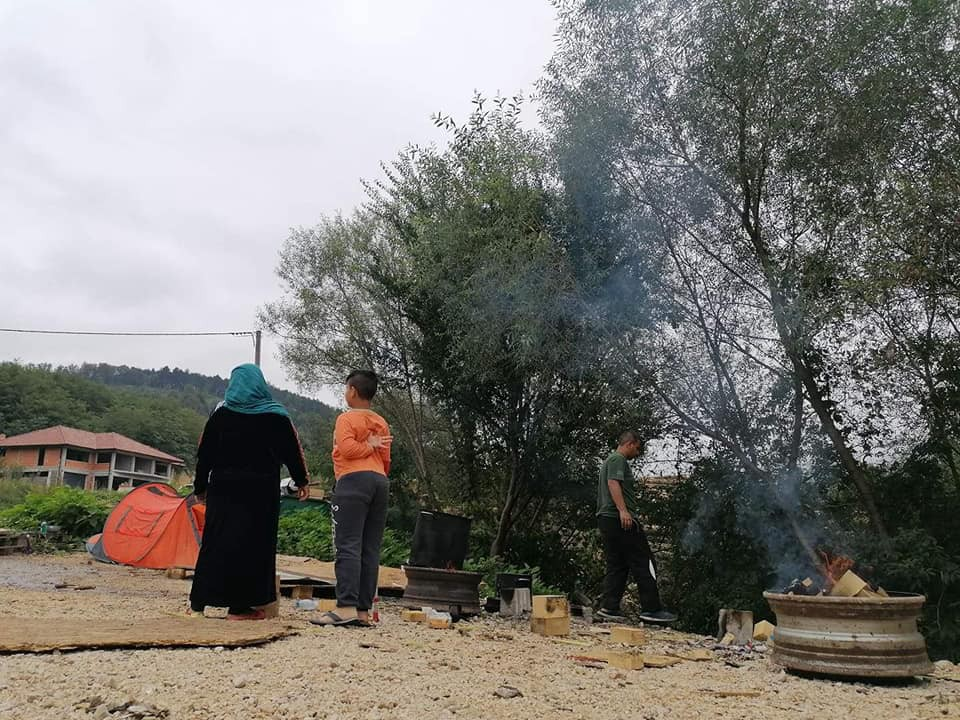
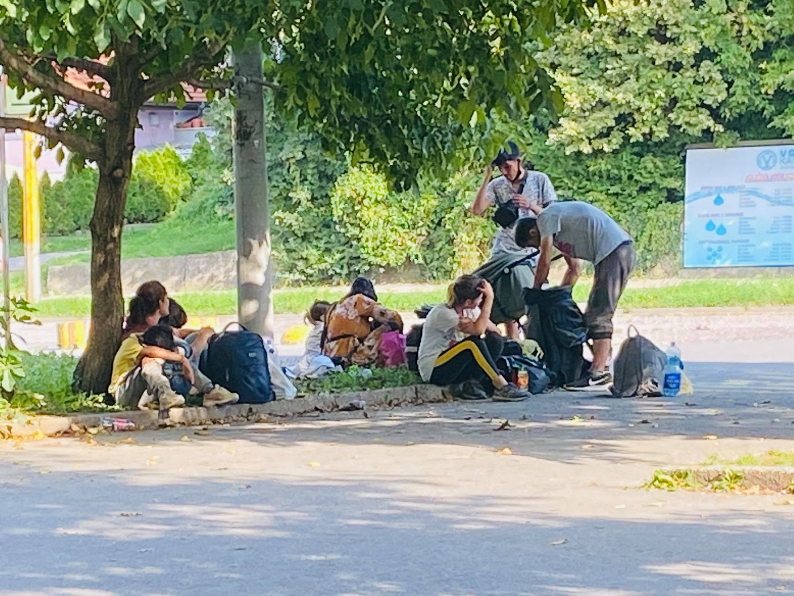
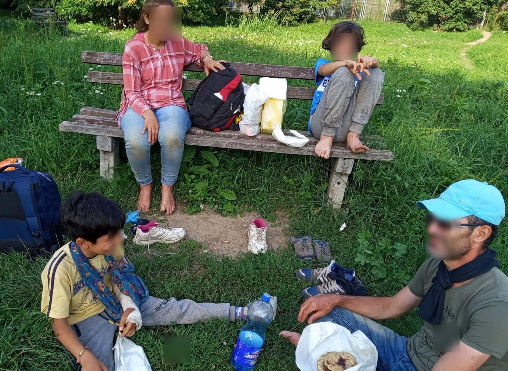
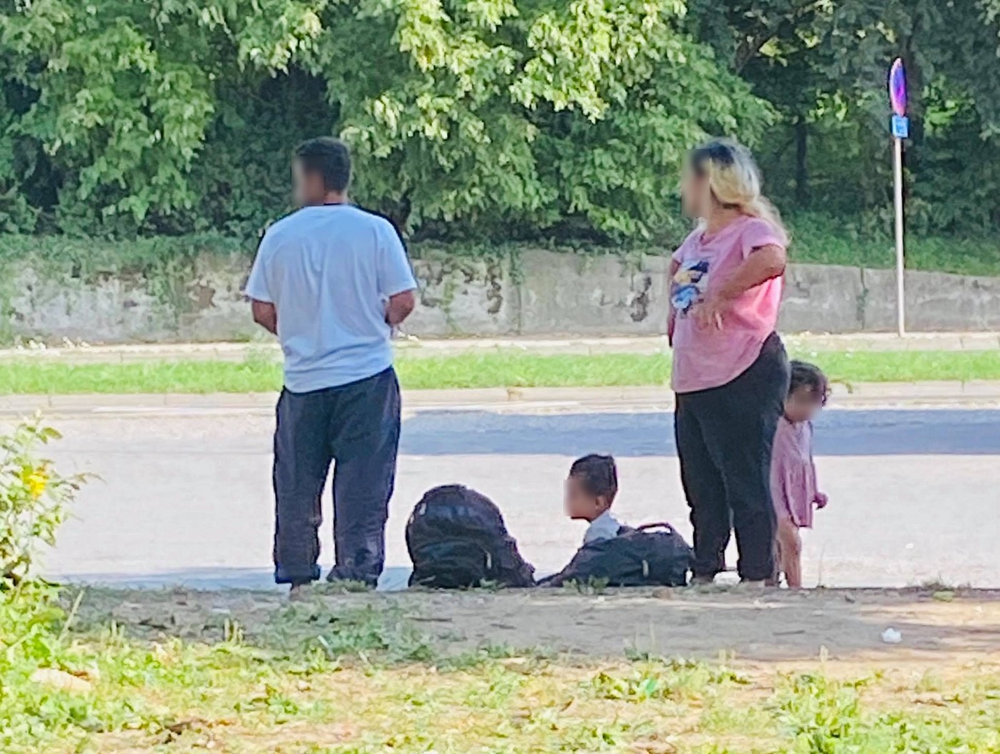
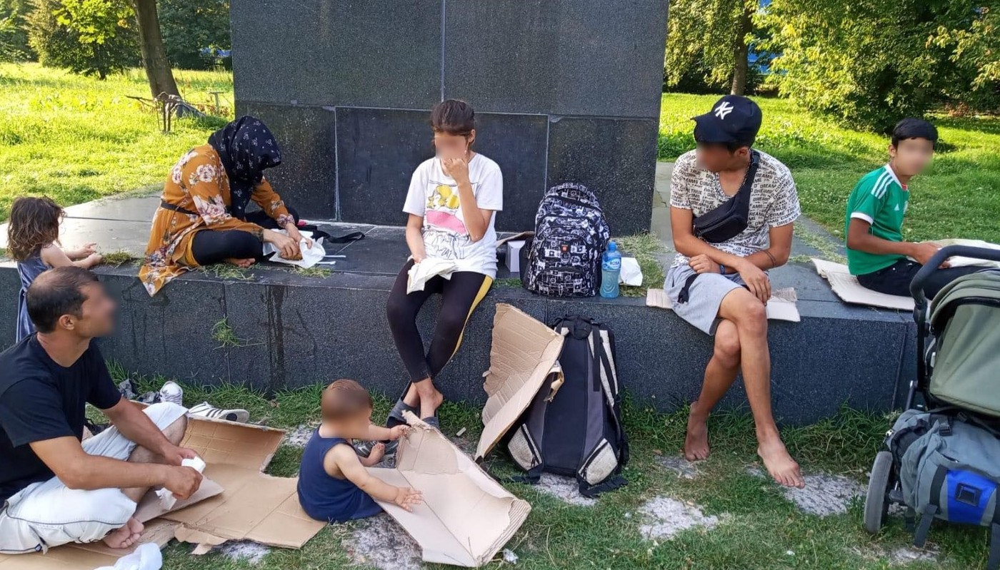
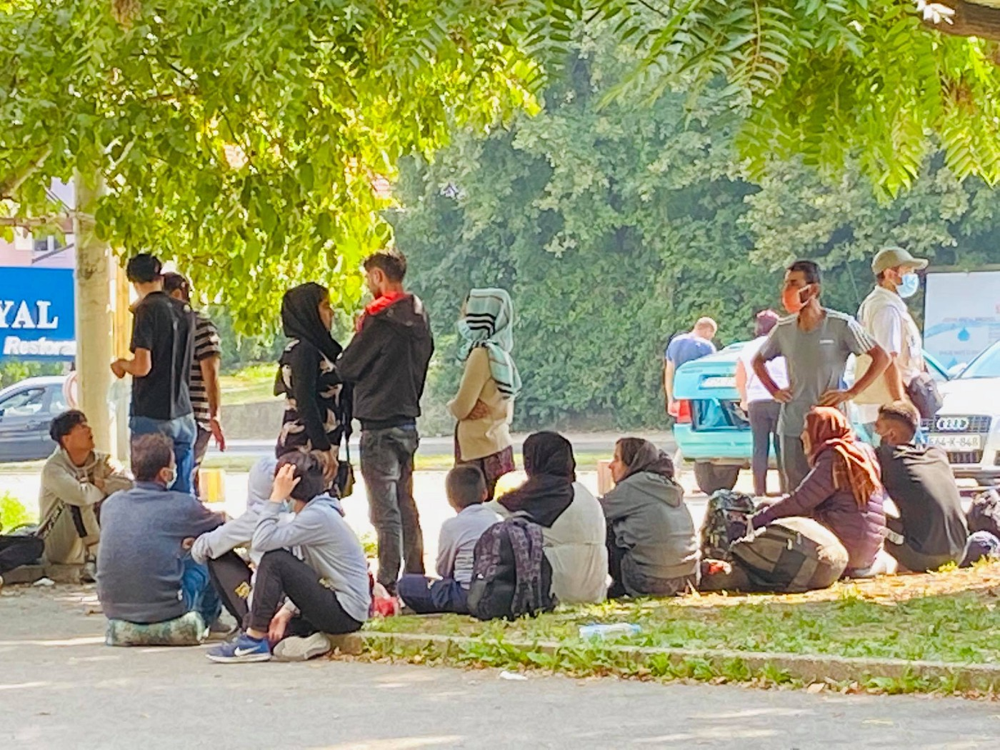
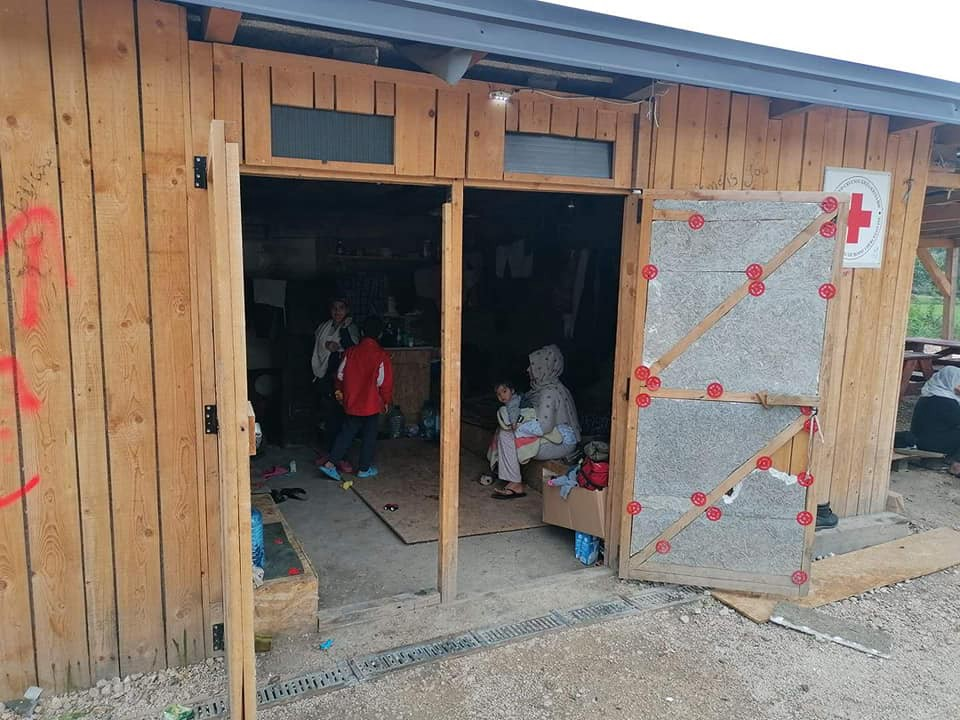
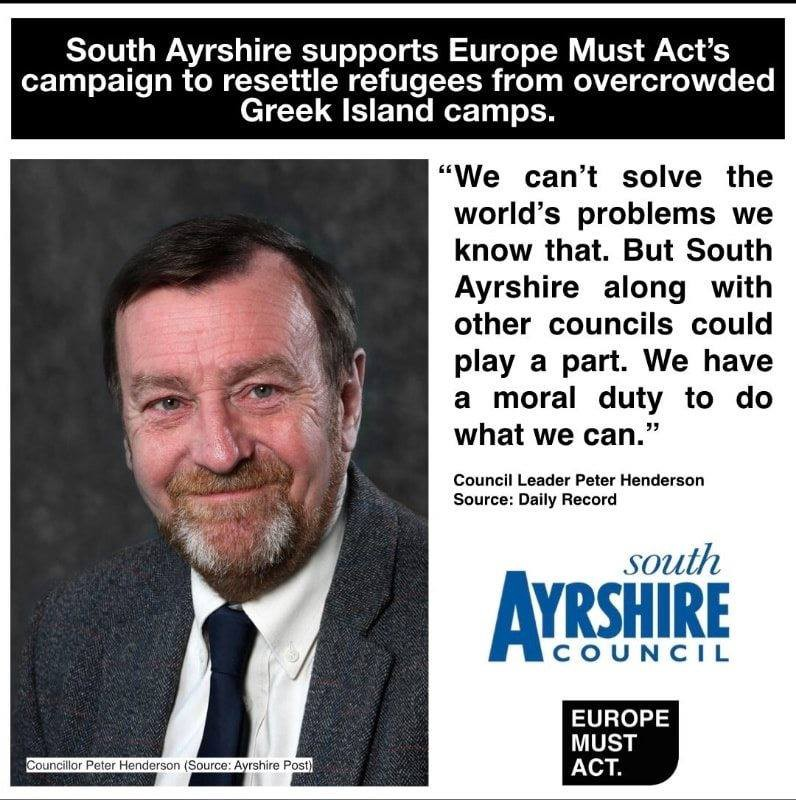

### AYS Daily Digest 7/9/20: Applying political pressure on our decision\-makers is critical
#### **News from the Balkans / The Administrative Court in Zagreb ruled the Ministry of Interior’s decision to deny asylum was illegal — all decisions were signed by the wrong person\. What now? /** More than 140 people arrived on four different Canary islands last Sunday / UK: a powerful message of citizen solidarity that the government cannot ignore / recommended reads & more news

Velčevo, Bosnia and Herzegovina \(Photo: Sanela Lepirica\)
### FEATURED — The western Balkan Route
#### Serbia: Many families and individuals stuck in centres across the country

According to the InfoPark latest report, a man at the camp in Preševo was tested positive for coronavirus\. This information was confirmed by the Preševo community health centre, and the patient was transferred to the hospital in Vranje\. This was the first reported Covid\-19 case in Presevo RC\.

According to official data, there are 4,500 people currently staying at the asylum and reception centres in Serbia\. “This clearly shows the increased number of newly arrived people on the move towards EU countries, in comparison to the same period last year”, InfoPark team noticed\.

328 attempts of crossing the border into Hungary were intercepted during the Bank Holiday weekend of 28–30 August, official Hungarian statistics say\. During its regular outreach activities, during the past week Info Park mobile team counted 130 refugees and migrants on average present in the Savamala neighborhood, with the number increasing to up to 250 in the late afternoon hours, despite police patrols regularly ushering refugees and migrants out of the parks\. **Transportation of newly arrived people to the reception centres to which they are referred by the authorities remains a gap** in the field\. Currently, SCRM is providing transportation to Bogovađa AC for newly arrived unaccompanied boys\.
While the majority of families from Syria and Iraq who were interviewed by Info Park team upon their return were attempting to cross the border with Romania, **unaccompanied boys seem to usually try _the game_ to Croatia and Bosnia and Herzegovina** \.
#### Bosnia and Herzegovina: more people, fewer solutions — the case of Tuzla

With fewer restrictions as precautions due to the coronavirus in the region, there are more people arriving in Tuzla, the first station for people on the move after crossing the border from Serbia\. During the past week alone, **more than 300 people** could be seen **daily** around the bus station in the city\. There are families, children, underage young people and unaccompanied minors, mostly from Pakistan and Afghanistan, but also people from Morocco, Algeria, Bangladesh, Iraq, Iran, Erithrea, etc\.

The state, cantonal and local authorities still have not offered any viable solution for the issue of people on the move in Tuzla, since May 2018\. A **lack of insight and knowledge among officials** , false information in the public, and the increasingly frequest repressive actions of the police — following somebody’s orders, outside the legal stipulations — have targeted people on the move and in the eyes of the locals made them a threat to the local community\. This has **helped the spread of hate speech, discrimination, and racism** \.

#### The ignorance behind the populist decisions

The officials state that since the beginning of the year, close to 6,500 people have arrived in the country\. However, according to the estimates made by the local teams who are present in the field daily, **the number is much higher** \. The fact that remains one of the biggest problems is that the Field Office of the Office for Foreigners **stopped registering people on the move in March** this year, as we reported before\. Their lack of engagement also presents a security issue because thousands of people, without any registration, pass through the city and continue the same way \(at least\) until Sarajevo\. Most importantly, it presents a **health issue** , given that the number of those infected by Covid\-19 in Bosnia and Herzegovina is rising, and nobody is testing the people on the move\. Without registration and the so\-called “white card”, these people have **no way of receiving help and assistance** in an adequate manner\. This presents an obstacle also for those working with the people, trying to ease their stay in the area of eastern Bosnia and Herzegovina\.

People on the move in Tuzla have almost no rights, and even the simplest things have become impossible\. For example, they are forbidden to enter hair salons, some market places, cafes, and the atmosphere has only been inflamed further by media reports\. The image they portray should be more objective because the common behavior in the community usually depends much on what the media say, local activists say\.
#### Pressure to close the Day Centre

9 families with 41 family members were staying at the PUŽ safe house during the first eight days of September\. Eighteen of them are children, and accommodation was also provided for two unaccompanied minors\. Families sometimes stay for several days there until a place in the nearest camp \(in Sarajevo\! \) opens up\. **The nearest camp is 130 kilometres away** from Tuzla\.

At the Day Centre, at least 100 people have been arriving daily in order to take a shower, to equip themselves with clothes and take food\. The centre was opened in March this year, but since recently, there has been a number of city inspections\. Although **no legal obstacles were detected, they were told that providing hygiene support, food distribution and other activities for people in need can no longer take place in the centre\.** The document cites many citizens’ complaints — even though, according to the police records, there have been no security issues reported in the area around the centre\. The local community simply refuses to have in their midst the centre and the people it is providing assistance to\. The local activists and those providing help at the Centre have reportedly also been insulted and threatened\.

Emmaus from Doboj East has been providing hot meals six days a week\. The meal distribution now has to take place in the streets, parks and squats, wherever people stay\. The Zemlja Djece association has been providing NFI packages for the unaccompanied minors, directing them to camps or safe houses, whenever there is enough place\. One of the activities provided by the local Caritas on the premises of Merhamet is the laundry service\. This has proven to be of huge help to all the people across the city who can come and wash their clothes there\. Medical assistance is provided by the local Red Cross in collaboration with DRC\. However, most of the more complicated issues still end up on the backs of the volunteers\. Transport to the hospital, visits and equipping people for a hospital stay, these are just some of the activities done by volunteers\.

As in many other areas, locals report that **the international and other large organisations are definitely nowhere near doing what they can and should in the given situation\.** We do not know why, but are happy to receive and publish any official explanation in case there are objective reasons or the mentioned organisations think they have reached their maximum\. Our address is always there for everyone who wants to react or send additional information/corrections: areyousyrious@gmail\.com
#### What lies ahead

Colder months ahead will no doubt exacerbate the situation\. Volunteers’ donations have long run dry, and winter requires serious preparation\. The upcoming local elections have proven once again to be a reason to \(ab\)use this situation even more in political campaigns\. As in other countries, fascist and politically impotent rhetoric regarding the issue of migration and people on the move is harming those whose voice and rights have long been denied\. This is currently happening in the Una\-Sana canton\.
#### Worsening of the situation at Velčevo

](assets/10bcf4735d10/1*rzmRV3QTCZ3U-Uq2cB6hyg.jpeg)

Photos: Sa [nella Lepirica](https://www.facebook.com/sanela.lepirica?__cft__[0]=AZWKiQnz1KzOjciab3HJj2pFlJte-NeglWmjfdh0x2eV8yMXhmN92yCvyBjSEMe0JiqCofgzhHUFEkp26fNY5TdLeGs7d27IVjRVoGzY6zcBrCsU_EHshUoIhM507Hdog9WoJ5uT7o5Z-ARHgpKZumDzIf9dOWQ80ryxns2bgrSbpPLB1-0mHwARbvxg7Sd69trfgiI-ucnYfyTmppLu1vks&__tn__=-UC%2CP-y-R)

From that part of the Bosnian route, our friends active in Velčevo report an ever difficult situation getting more hard to handle or respond to with each day\. At a local Red Cross point next to a road, “in the middle of nowhere”, people trying to travel towards the Una Sana canton are being thrown out of buses and other transportation means, but are also taken there from the Republic of Srpska by policemen who want them out of their jurisdiction\.

> Children with fractures, chronic patients, old people, unaccompanied minors, … Still, there are no changes or loosening of the rigorous measures taken on the cantonal level\. 

> These people are prevented from being provided accommodation at the official camps\! Why are political games always at the expense of the most vulnerable, _says Sanela, coordinating the ground team_ 

#### Croatia: a chronic lack of knowledge or avoiding decision making?

This question has been bothering us for years now when it comes to issues of migration, asylum, international protection, and human rights in this context in Croatia\. Now, this question is openly being asked of the Ministry of the Interior by the media after the Court ruling which leads us to the conclusion that almost all the decisions on international protection issued in Croatia could be annulled if the recent ruling is applied to them\.

Here is what happened\. **The Administrative Court in Zagreb had ruled that the Ministry of the Interior’s decision to deny** the application for international protection of a woman from Tunisia **was illegal** due to the fact that all this time a person who cannot \(legally\) make such decisions has been making them\. In all of the cases\. One of the State secretaries of the MoI, Zdravko Katić, signed this decision, and another one, and more of the same\. 
All this time, it was the Minister of the Interior whose signature should have been on all the decisions, but for some reason, it seems that the Minister is oblivious to many things that have been done on behalf of his Ministry, the police and instead of him, but this one might just startle the top of the Ministry as it begs the question \(already asked by the investigative j [ournalist](https://www.telegram.hr/politika-kriminal/sud-pravomocno-presudio-mup-godinama-protuzakonito-donosio-odluke-o-azilantima/?fbclid=IwAR37ApfaAIueLjtQ1OxdJhiLjkoAOwLj6xYCEC3EEib4Ln40jcMg3H9UezU) \): **How many negative decisions on international protection have so far been made by Secretary Katić, how many court procedures are ongoing against them, and who will be making these decisions in the future?** Another good one is — who will sign that answer and the decision, as it seems it is never the Minister\.
#### SEARCH AND RESCUE AT SEA

> Send a clear message that states must ensure that maritime search\-and\-rescue incidents are resolved in accordance with the letter and spirit of international law 

The International Chamber of Shipping has called on the International Maritime Organisation to “urgently intervene” in the _Maersk Etienne_ standoff, but the Maltese [government insists](https://timesofmalta.com/articles/view/intervene-in-migrant-standoff-shipping-chamber-urges-un-maritime.816696?fbclid=IwAR37ApfaAIueLjtQ1OxdJhiLjkoAOwLj6xYCEC3EEib4Ln40jcMg3H9UezU) that the rescue by the _Etienne_ on August 4 was never in Malta’s search\-and\-rescue zone\.
#### GREECE
### The urgency has become an immediate disaster warning

As we reported earlier, a joint decision of the Ministers of Civil Protection, Health, Immigration and Asylum on Monday night put the refugee camps of Malakasa, Schisto and Elaionas in quarantine until 21 September\.

In Moria, the local newspaper reports 15 cases of coronavirus in the last five days and everyone inside the camp is doing whatever they can, as the [Moria Corona Awareness Team](https://www.facebook.com/MoriaCoronaAwarenessTeam/?__cft__[0]=AZXiBpn0i4ntvZp-h3t9Dvmu6mrDeS_7dUJF7Ams92eeJHz0lstFrJJ_lGMsC9lsHhcX8cQbjmjJSE6T1li_BBfVuvuJCzuBYDt4J-Q9b5GTYwzk12Vussb-qRYKS2r65dFi6NHA2PMwMguwqU00Nxe2jHGrz_dKOFBBIV9ca-prtA&__tn__=-UC%2CP-R) reports:

> In Lyceum in the jungle of Moria we have a full team of Afghan women sewing masks to help protect people\. Meet Mahmoudi and hear what she has to say\. We are very grateful for the Greeks to come and do testing and find out numbers of people with positive cases but also we understand that we need to take care of ourselves on our own because “Moria is not safe” for us\. 

[](https://l.facebook.com/l.php?u=https%3A%2F%2Fwww.infomigrants.net%2Fen%2Fpost%2F27083%2Fcoronavirus-lesvos-migrant-camp-risks-catastrophe-oxfam%3Ffbclid%3DIwAR37ApfaAIueLjtQ1OxdJhiLjkoAOwLj6xYCEC3EEib4Ln40jcMg3H9UezU&h=AT2UNJi3WL5OThHele7tta2F2gqYvR-rVWr1QfrIgCV_KpzD3Rx0Fr_lw0ZhoP27Q5DevNLQeujPvxU30ICpda4hr5yQhNff9Pk9_Y1U3OH0uUcoZdonprLiwTVRgDVvoGo0avhYOUHv1A&__tn__=R]-R&c[0]=AT2iHdBvnjyUySFGcCgr-T_1mJpNA0-7hS1O8i6k2-MLlelOqP8hxxoIrdMQH2Rg1Cls3L1fs4l9weD6mWq1XTpnJ-jNX4-Ix6Xw5fpqatZ6jvOwydcq9-lsDvHmZZdg_645GBgJ27rdS5gC0KFJ1lt0Yq0AMML9E7SoccU7NmkmrEnjqs8kTPtDd0wsCfA87nqa2X0eXG9kLPwSnG8l6vBhe1428iC3YaKMvSzqyoNbwl5zvQHQ-Q)

Along with the previous reports in [AYS Daily News Digest](ays-daily-digest-03-09-2020-greek-government-uses-covid-to-excuse-crackdown-in-moria-10e5116ef30c) , we will be reporting more extensively in the coming days on the situation, reactions from other EU countries and demands by a number of organisations for immediate relief in Moria

**Event announcement**

An international digital journalism training and news platform that champions the stories of women and girls from resource\-poor communities, will screen several of its short pieces from Athens, Greece, followed by a discussion by the young women journalists\-in\-training\.
**No Labels No Walls \+ We Are One Festival 2020 \-** The festival is free and everybody is welcome\! You are invited to follow the festival live from 14\. — 19\.9\.2020 from [https://www\.nolabelsnowalls\.net](https://www.nolabelsnowalls.net/?fbclid=IwAR37ApfaAIueLjtQ1OxdJhiLjkoAOwLj6xYCEC3EEib4Ln40jcMg3H9UezU)
#### CYPRUS

Cyprus will send a team to Beirut in the next two days to consult with officials, Interior Minister Nicos Nouris said on Monday, as five boats with migrants from Lebanon have attempted to seek entry in recent days\.
Four of the 51 people who landed off Limassol on Saturday afternoon are being investigated for people smuggling\. As the media report, “the group was escorted back to Lebanon with nurses, an interpreter, migration and police officers\.”
#### SPAIN
### More than 140 people arrived on four different Canary islands on Sunday

Reportedly, the people arrived in six boats, but they could not be registered straight away as regisration was closed at midnight, when the Salvamar Al Nair arrived at the Arrecife pier with 53 people rescued from a pneumatic boat 65 kilometers from the island\. And almost at the same time, the Helimer 222 Salvage helicopter located 65 kilometers southeast of Lanzarote a pneumatic boat with fifty people on board\. They were immediately met by Salvamar Al Nair, who returned with them to their base in Arrecife, where they arrived at midnight\. Salvamento Marítimo later helped 47 people located on board three boats in a strip located seven to 18 kilometers away from Maspalomas in the south of Gran Canaria, and the people were registered in the morning\.

The emergency services and groups such as Caminando Fronteras believe that these are the people who left for the Canary Islands from Tarfaya \(Morocco\) on a pneumatic tire at 3:00 am on Saturday\. NGOs are always very aware of the alerts with pneumatic, because several of them have been shipwrecked so far this year and another with 63 people were completely lost a few weeks ago, without any news of what happened to the people who were on board, Spanish media [report\.](https://cadenaser.com/emisora/2020/09/07/ser_las_palmas/1599455852_797648.amp.html?__twitter_impression=true&fbclid=IwAR37ApfaAIueLjtQ1OxdJhiLjkoAOwLj6xYCEC3EEib4Ln40jcMg3H9UezU)
### Coronavirus in Melilla

The Temporary centre \(CETI\) of Melilla has raised the number of residents infected by coronavirus to 25 and to 350 close contacts in 15 days, since they first registered a positive case on August 20, the first one since the start of the pandemic\. The CETI has a maximum capacity for 750 people, but It is occupied by 1,380 residents at the moment\.

President de Castro has defended a “logical measure from the point of view of public health to get people out of there” to “control” the situation, and not only the people who have suffered a contagion, who are already outside the CETI, but also the defined as close contacts, it is [reported\.](https://www.lavanguardia.com/vida/20200905/483326734137/los-contagios-en-ceti-de-melilla-se-elevan-a-25-con-350-contactos-estrechos.html?fbclid=IwAR37ApfaAIueLjtQ1OxdJhiLjkoAOwLj6xYCEC3EEib4Ln40jcMg3H9UezU)
#### UK
### Writing letters and emails works\!

A single letter to the Head of the South Ayrshire Council from a Europe Must Act campaigner led to Councillors from South Ayrshire Council unanimously voting to pass a motion stating their commitment to relocate refugees from the Greek Islands last week\.

The [motion asked](https://www.dailyrecord.co.uk/ayrshire/council-wants-rehome-more-refugees-22622040) the “UK Government and UNHCR to support the decongestion of the Aegean Island camps and allow UK councils to take inhabitants of these camps as an immediate emergency measure under the new UK Resettlement Scheme”\.

Whilst South Ayrshire Council does not have the legislative power to directly relocate refugees themselves, the council’s chief executive will now write to the UK Government’s Home Office urging them to allow UK councils to take relocated refugees from the Aegean\. This motion sends a powerful message of citizen solidarity that the government cannot ignore\.

> Will you write to your UK Council today asking them to follow the example of this Scottish Council? 

#### WORTH READING

[](https://l.facebook.com/l.php?u=https%3A%2F%2Fwww.freemovement.org.uk%2Fcomment-the-channel-crisis-and-the-politics-of-compassion%2F%3Ffbclid%3DIwAR37ApfaAIueLjtQ1OxdJhiLjkoAOwLj6xYCEC3EEib4Ln40jcMg3H9UezU&h=AT3oMYQqleT1Zw3ymDWLwEVdwWVsqP9BQvkyWRDZ_wKGoIvhxsgWMWAG5NrsgxpYYbnBkvNqRyykqY1yrmqkjHXQKY2qmmS7ISgLTfUqhcS79ab57BTVI4lRErTKbM6lOw&__tn__=%2CmH-R&c[0]=AT2ykdsdIlqvCB0mOXkwFSX1pghhyn180xsQoutXRsi5rZUMHxK_wprJLp3M-X_cp9zqxlMt_sIOiBmBun2oWL2yhYMN2DC8X566yN41zQCVJATAbEMlvTTE4dW6Egn3gKgSss3lboUJqwvDOseqcu-HOHCkyhUyETj-oWdcGr7B8gFosajqQuCKqbjfaIV1OAC4YL0bMAHMxM-i)

Migrants to Europe from the South of the Sahara, undergo two crossings: that of the Sahara, then that of the Mediterranean\. Many experience hell in Libya, while others find themselves stranded in Morocco\. Everyone has to deal with the aftermath of a grueling journey\.

[](https://l.facebook.com/l.php?u=https%3A%2F%2Fwww.infomigrants.net%2Ffr%2Fpost%2F27071%2Fafrique-le-traumatisme-des-migrants-qui-ont-traverse-le-sahara%3Fpreview%3D1599466338238%26fbclid%3DIwAR37ApfaAIueLjtQ1OxdJhiLjkoAOwLj6xYCEC3EEib4Ln40jcMg3H9UezU&h=AT0l-389EhU6v9oNLiSqEQ_XIDvbZLgIBZLvI8XZeM0gps1nn8gr_K1-qcv88XiLcOPiAlWOs-lK4a5KGxIZXcst4LRj1IZ6q_vNm4-4DQHyhmHeK_yaR51O69wknPrLXw&__tn__=-UK-R&c[0]=AT0jndRpnTNFYPcZZ5VII8tlQtttNUXAUvSwM9yiaJFsSSPjdSvFMdG2Atkc1HxCCKaoLjs4jhM26xuLq3IJZtyHnwYGP-u9MJFWma_AL85o83hF1o06Yrd0ODYoOz9ravXrgiTFXe6vGB1i22inz65pIa1QBtiZFv8ZOKjxfEiLUmTilAspserLZnjPPSMwvJJORTqn3ymV7sW3)

An unresolved issue — “Rather than losing face by going home, people prefer to remain in that country irregularly, even if it means living without any legal status, without access to the formal labour market and without any entitlement to public services or welfare benefits\.”

**Find daily updates and special reports on our [Medium page](https://medium.com/are-you-syrious) \.**

**If you wish to contribute, either by writing a report or a story, or by joining the info gathering team, please let us know\.**

**We strive to echo correct news from the ground through collaboration and fairness\. Every effort has been made to credit organisations and individuals with regard to the supply of information, video, and photo material \(in cases where the source wanted to be accredited\) \. Please notify us regarding corrections\.**

**If there’s anything you want to share or comment, contact us through Facebook, Twitter or write to: areyousyrious@gmail\.com**

_Converted [Medium Post](https://medium.com/are-you-syrious/ays-daily-digest-7-9-20-applying-political-pressure-on-our-decision-makers-is-critical-10bcf4735d10) by [ZMediumToMarkdown](https://github.com/ZhgChgLi/ZMediumToMarkdown)._
