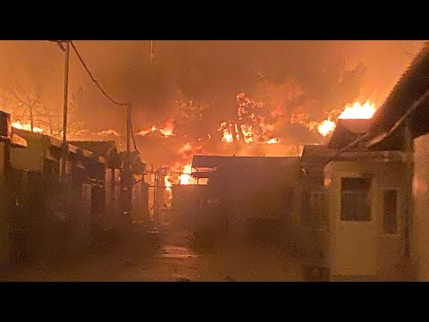
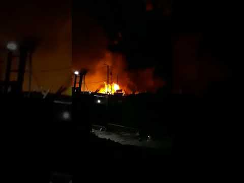
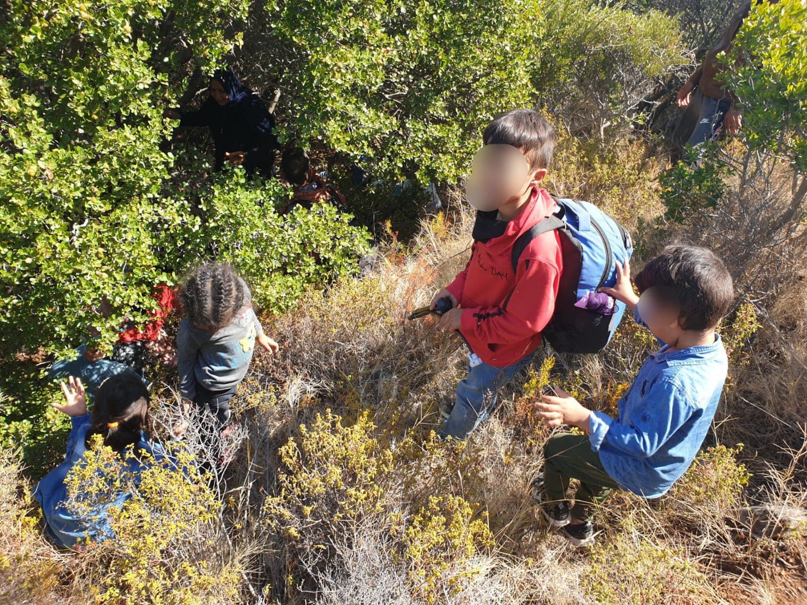

### AYS Daily Digest 08/09/20 Actual Hell: the entirety of Moria burns

_Confirmed COVID cases in Syrian refugee camp in Jordan // Amnesty Internationals report on Malta // Cyprus sending authorities to Lebanon // the cost on displaced of America’s War on Terror // and more…_

](assets/3fa46514a6aa/1*mybHqMyvVDDsnNXBjMHUtw.png)

The end of Moria? Screenshot of video sent to [Franziska Grillmeier](https://twitter.com/f_grillmeier/status/1303478067348803584)
### FEATURE — The Hell that is Moria entirely engulfed in flames: could this be the end?

And with it, European ideas, hate, arrogance, dignity, and humility\. 13,000 people are trying to escape the camp safely, and many are asking the same question: could this be the end of Moria? Whatever the answer, we’ll continue following this unfolding story, but here is the information we have in the early hours of Wednesday morning\. **Most of the information in this report comes from the organization [Stand by me Lesvos](https://www.facebook.com/www.standbymelesvos.gr/)** \. We are very grateful for their continued updates and we encourage you to follow them for the most up to date information\.

Stand by me Lesvos first reported on Facebook at 22:52 Tuesday evening\. While they did not state when exactly the first fires broke out, in the [first post](https://www.facebook.com/www.standbymelesvos.gr/posts/711306612795697) they said:

> “Currently various fires in the camp are reported and it seems even shootings happen\. It’s a nightmare coming true, but a nightmare that could have been easily prevented and all the months were not used for it\.” 

[At 22:58](https://www.facebook.com/www.standbymelesvos.gr/posts/711308839462141) they made note of shooting sounds and that there were big fires in three zones in the camp\. [At 23:05](https://www.facebook.com/www.standbymelesvos.gr/posts/711311149461910) they said the situation was rapidly deteriorating with rapid spread and that fires are spreading everywhere\. Apparently the fire brigades were by the entrance with some angry protesters\. A [t 23:22](https://www.facebook.com/www.standbymelesvos.gr/posts/711316812794677) fires had reached Zone 12\. A [t 23:56](https://www.facebook.com/www.standbymelesvos.gr/posts/711330916126600) they reported that EASO office was in flames and that “riots have made a move towards the new hospital in Moria too\!”

At [00:13 Wednesday morning](https://www.facebook.com/www.standbymelesvos.gr/posts/711336649459360) they reported that:

> “Now fire reached inside the main camp\. Structures there are burning\. Thousands of refugees are in panic while other use this night to get out all their anger and frustration and criminal elements are happy to use the chance to steal and loot\. It’s complete chaos and probably the end of Moria\.” 

There were multiple reports of [confusion](https://twitter.com/lucypapa96/status/1303479364353486849?fbclid=IwAR3UVIt20llsqdcdEi60o32NntSNzRsDZKcfQrpNbeVOZiTqlKWzc9uZzxg) and people trying to evacuate\. There were [reports](https://www.facebook.com/e.andrew.maddox/posts/10159160589674575) of the police “not letting us out\.” In Stand by me Lesvos’ [post at 00:37](https://www.facebook.com/www.standbymelesvos.gr/posts/711344512791907) they quoted one of their partners in the camp:

> “Where is the police, where is the fire brigade, where is anyone\. We are burning, our tents are burning\. Everything is burning\. We came here to burn to death\. All is on fire” 

At [00:42 Wednesday morning](https://www.facebook.com/www.standbymelesvos.gr/posts/711345796125112) they reported that the police finally showed up and were telling people to evacuate\. They were only several hours late\. At [01:13](https://www.facebook.com/www.standbymelesvos.gr/posts/711355886124103) they said:

> “…getting reports that Moria residents who are trying to escape are being pushed back and attacked by locals\.” 

■■■■■■■■■■■■■■ 
> **[Franziska Grillmeier](https://twitter.com/f_grillmeier) @ Twitter Says:** 

> > „It is the night that #Moria is burning to the ground,” says one friend. “I am standing in the flames and yet I cannot believe, what is happening in front of me.”

This video is filmed by him and sent just now. https://t.co/qTEScei7SJ 

> **Tweeted at [2020-09-08 23:39:23](https://twitter.com/f_grillmeier/status/1303478067348803584).** 

■■■■■■■■■■■■■■ 

At the time of writing the digest, Stand by me Lesvos’ [last post at 01:21](https://www.facebook.com/www.standbymelesvos.gr/posts/711359092790449) Wednesday morning said:

> “People escaping out of Moria\. We pray that these people will have had enough trauma for tonight as we simultaneously are getting reports of locals attacking and blocking people’s passage into the nearby village\.” 

In [Aegean Boat Report’s](https://www.facebook.com/AegeanBoatReport/) last post for the night, they made note that the new hospital is gone, the quarantine area in Mandala is gone, people are fleeing in mass to Mytilíni, and:

> “All assets on Lesvos is being used, fire department, police, riot police, to try to get things under control, but it seems hopeless, the fire is just to massive, growing bigger by the minute… 

> …What caused these fires is to early to say, but riots is the most plausible explanation\. The camp has been under lockdown for months, stem has been building up\. Greek government has used the pandemic, as a pretext to keep camps closed all over Greece, people have just had enough, tonight it exploded\.” 

Here is an accumulation of videos posted by Stand by me Lesvos:

Here is the video AYS was sent:

Here is a video by Refocus Media Labs of “over a thousand people walking roads out of Moria for safety\.” They also reported “Thousands more in the olive groves seeking shelter — Police blocking main roads to Mytiline — Reports of armed locals attacking support vehicles trying to bring supplies in to those stranded\.”

### At the time of writing the digest there is no word on any deaths from the fire\. We sincerely hope ALL can be spared\. More updates to follow…
#### JORDAN
### UNHCR confirmed that there are 2 confirmed COVID\-19 cases in Azraq camp for Syrian refugees

The news comes on Tuesday from Azraq camp, where over 40,000 people are now living\. Aljazeera reports that “They are the first infections to be detected among Syrians living in refugee camps in Jordan\. The UNHCR said the two patients were transferred to quarantine facilities after testing positive late Monday, and their neighbors have been isolated as more testing is carried out\.” Jordan and Lebanon are struggling as it is to help their refugee populations, as well as their own citizens from COVID\-19\. There needs to be a better international response to the pandemic\.

](assets/3fa46514a6aa/1*GBLQJneZJBVF0QKx3O5cdw.jpeg)

“Palestinian refugees wait in front of the Amman New Camp health centre to register their names to get medication amid concerns over the spread of coronavirus in Amman\.” Photo by [Muhammad Hamed/Reuters](https://www.aljazeera.com/news/2020/09/covid-19-cases-confirmed-jordan-camp-syrian-refugees-200908121425186.html?fbclid=IwAR1nER5vm0FK93OZ0icl0n5_OKUIzUkg2kMiBroTjApiiV3qidwfBLdND90)
#### LIBYA

UNHCR just released their report entitled **UNHCR’s POSITION ON THE DESIGNATIONS OF LIBYA AS A SAFE THIRD COUNTRY AND AS A PLACE OF SAFETY FOR THE PURPOSE OF DISEMBARKATION FOLLOWING RESCUE AT SEA\.** Many reports of violence and accounts of the failing state are cited, and they conclude with:

> “UNHCR does not consider that Libya meets the criteria for being designated as a place of safety for the purpose of disembarkation following rescue at sea\. 

> UNHCR therefore calls on States to refrain from returning to Libya any persons rescued at sea and to ensure their timely disembarkation in a place of safety\. UNHCR recalls that the principle of nonrefoulement applies wherever a state exercises jurisdiction, including where it exercises effective control in the context of search and rescue operations outside its territory\. Where a State’s coordination or involvement in a SAR operation, in view of all the relevant facts, is likely to determine the course of events, UNHCR’s view is that the concerned State’s negative and positive obligations under applicable international refugee and human rights law, including non\-refoulement, are likely to be engaged\.” 

Please read the full report [here](https://www.refworld.org/docid/5f1edee24.html?fbclid=IwAR1nER5vm0FK93OZ0icl0n5_OKUIzUkg2kMiBroTjApiiV3qidwfBLdND90) \.
#### SEA

■■■■■■■■■■■■■■ 
> **[Sea-Watch International](https://twitter.com/seawatch_intl) @ Twitter Says:** 

> > 🔴 BREAKING: our #Moonbird is grounded!
The criminalization of our sea rescue and aerial monitoring missions continues – now the Italian authorities have grounded our Moonbird and try to close our eyes on the #Mediterranean. https://t.co/XyFDX7Lnd0 

> **Tweeted at [2020-09-08 11:13:14](https://twitter.com/seawatch_intl/status/1303290292641169411).** 

■■■■■■■■■■■■■■ 

[Mediterranea Saving Humans](https://www.facebook.com/Mediterranearescue/posts/663034727651088) released a statement in solidarity with the Moonbird:

> “Since last Friday the Moonbird sighting plane of HPI and [Sea\-Watch](https://www.facebook.com/seawatchprojekt/?__cft__[0]=AZUauz6UP2sBev1kJLpUzRbswUOJ22E1RzRHx0hFlKMgQ5dgIusSddijx6HTUqAB6n0hozz_lggZvnW8E3DBurbNHgG3kkkx__z1KY4iS9E7hY0Ip7pVlpKmDuJI-v0uynHHQdo1dxL5-NWFLlwe59PmCIS-TY0ltaAO1Nb1CJ0kXg&__tn__=kK-R) can no longer fly from Lampedusa and any other airport in Sicily\. ENAC, the highest civil aviation authority, banned it at the request of the Italian Ministry of the Interior\. 

> His fault? To have reported for too many times and for too long boats struggling in the central Mediterranean, as required by the law\. From June to today Moonbird, in its observation and monitoring missions, has indicated the need to rescue over 2600 people in need, who risked dying, including 117 shipwrecked by our Mare Jonio in two distinct operations of rescue\. 

> This ban is yet another hostile act, certainly not the first, aimed at striking solidarity in the central Mediterranean and carried out by the Italian Government in complicity with other European governments\. The authorities that should safeguard the lives of people in need in that stretch of sea condemn it to become a desert, where continuous human rights violations are perpetrated, where, when they do not drowned, people are abandoned for days to their fate or rejected to Libyan hell\. 

> Full solidarity with HPI and [Sea\-Watch](https://www.facebook.com/seawatchprojekt/?__cft__[0]=AZUauz6UP2sBev1kJLpUzRbswUOJ22E1RzRHx0hFlKMgQ5dgIusSddijx6HTUqAB6n0hozz_lggZvnW8E3DBurbNHgG3kkkx__z1KY4iS9E7hY0Ip7pVlpKmDuJI-v0uynHHQdo1dxL5-NWFLlwe59PmCIS-TY0ltaAO1Nb1CJ0kXg&__tn__=kK-R) from Mediterranea Saving Humans\. We will return to sea as soon as possible, the central Mediterranean needs solidarity, not bans\.” 

[Open Arms](https://twitter.com/campsoscar/status/1303407421398937600) rescued 83 people Tuesday night\. This comes after _“6 months and a comprehensive rehabilitation later, with exhaustive compliance with all covid\-19 security measures\.”_ Sea rescue is needed\! \!

Alarm Phone also reported a distress call at sea late Tuesday evening\. The call came from the Ionian Sea\. _“We alerted MRCC Rome, but did not receive confirmation that a rescue operation was launched\.”_ [More here](https://www.facebook.com/watchthemed.alarmphone/posts/2759173141023578) _\._

Denmark and Tunisia are in a dispute over who’s responsibility it is to take in the 27 people who were rescued by a Danish ship off the coast of Malta over a month ago\. The Danish government claim that since they have not been able to find an EU port to accept them, Tunisia must take them in\. Tunisian authorities insist it’s not their responsibility:

> “A Tunisian foreign ministry spokesperson said the migrants were not Tunisia’s responsibility, since they left from the Libyan city of Zuwara, capsized off Malta and were rescued by a Danish ship\. The official spoke on condition of anonymity as he was not authorized to speak to the press\.” 

More [here](https://www.nytimes.com/aponline/2020/09/08/world/europe/ap-eu-denmark-tunisia-migrants.html?fbclid=IwAR1nER5vm0FK93OZ0icl0n5_OKUIzUkg2kMiBroTjApiiV3qidwfBLdND90) \.
#### CYPRUS

On Monday, Cyprus officials announced that they are sending a team to Beirut to help stop migrants from fleeing Lebanon\. [Al Arabiya](https://english.alarabiya.net/en/News/middle-east/2020/09/08/Cyprus-sends-team-to-Beirut-to-stop-migrants-fleeing-crisis-ridden-Lebanon?fbclid=IwAR1nER5vm0FK93OZ0icl0n5_OKUIzUkg2kMiBroTjApiiV3qidwfBLdND90) is reporting:

> “Cyprus is on alert after at least five boats carrying over 150 migrants were spotted off the coast of the tourist island by authorities in recent days, and the interior ministry held an emergency meeting on the situation on Monday\. Many of those on board were Syrians, as well as Lebanese\. Some were permitted to disembark, but others were sent back\.” 

#### GREECE

](assets/3fa46514a6aa/1*TrMWKynGKhquStR9p2KKsA.jpeg)

18 people were taken by the Greek Coast Guard after landing on Samos\. There current whereabouts are unknown\. “\(They\) arrived on Cape Praso, Samos north east this morning 06\.00\. The people fled to the woods after landing, scared to be returned to Turkey by Greek coast guard\.” Info and Photos by [Aegean Boat Report](https://www.facebook.com/AegeanBoatReport/posts/916038108919294)

[**Moria Corona Awareness Team**](https://www.facebook.com/MoriaCoronaAwarenessTeam/posts/174461474183031) **have confirmed 35 new positive cases of COVID\-19** \. According to official figures, only one of the 35 people is currently displaying symptoms, the rest are asymptomatic\. Over 100 people are now in isolation from having had contact with the 35\. More [here](https://www.stonisi.gr/post/11241/35-ta-kroysmata-koronoioy-sth-moria?fbclid=IwAR3UVIt20llsqdcdEi60o32NntSNzRsDZKcfQrpNbeVOZiTqlKWzc9uZzxg) \.

[Locals in Lesvos](https://www.sbs.com.au/ondemand/video/1780923971853/Dateline-S2020-Ep19-Welcome-To-Lesbos?fbclid=IwAR3UVIt20llsqdcdEi60o32NntSNzRsDZKcfQrpNbeVOZiTqlKWzc9uZzxg) are still very divided with all of these events taking place\. Prioritize tourism or helping refugees? Can you recover economically with continued rising COVID case numbers?

### Unfortunately Refugee Rescue has had to make the decision to suspend its operations on Lesvos

The charity from Northern Ireland has been operating on the island since 2015\. In a statement, one of the founders, Jude Bennett said:

> “It’s incredibly frustrating, but the truth is it was becoming far too dangerous for us to operate and ensure the safety of our volunteers\. The rising criminalisation of humanitarian organisations in Lesvos and the growing hostilities now pose a very real threat to our staff, assets and work — and we can not in good conscience continue to operate if we cannot guarantee the safety of our team\. 

> We have faced a number of challenges in the past five years but the hardline stance of the Greek authorities have made our mission impossible to pursue\. Our decision to suspend operations for the foreseeable future does not in any way mean that search and rescue is not still urgently needed\. In fact, human rights violations have only intensified — from authorities leaving people stranded at sea for hours, to illegal pushbacks on Greek waters — which have all made the journey from Turkey to Greece more perilous than ever for those seeking refuge\. The record low number of arrivals to the North Shore recently signals that people are being forcibly prevented from exercising their right to seek asylum\. It deeply saddens us that we are unable to operate where independent search and rescue is desperately needed\.” 

Reportedly there was a car accident involving refugees in Evros\. Thankfully no one was killed\. These reoccurring accidents are an effect of the Greek border regime\. More [here](https://twitter.com/lk2015r/status/1303439247257542656?fbclid=IwAR3UVIt20llsqdcdEi60o32NntSNzRsDZKcfQrpNbeVOZiTqlKWzc9uZzxg) \.

The Pomegranate Project is back in action in Athens\! “The Pomegranate Project is the first of its kind in Greece\. It is run entirely by women, for women, offering a holistic programme to protect and empower women displaced by conflict and violence\.” Learn more [here](https://www.facebook.com/actionforwomenCH/posts/2114411445370000) about them and please support them if you can\!
#### MALTA
### Amnesty International just released its report “Malta: Waves of Impunity — Malta’s Human Rights Violations and Europe’s Responsibilities in the Central Mediterranean”

On Tuesday this report was released as an important condemnation of Malta’s policies towards refugees, sea rescue, disembarkation, and more\. We strongly encourage you to [read it in its entirety](https://twitter.com/matteodebellis/status/1303220773432307712?fbclid=IwAR3UVIt20llsqdcdEi60o32NntSNzRsDZKcfQrpNbeVOZiTqlKWzc9uZzxg) , but here is an excerpt from the executive summary:

> “In the first half of 2020, Maltese authorities were implicated in multiple failures to respect and protect the rights of refugees and migrants at sea\. Under their coordination, people were pushed back to Libya, a country at war where refugees and migrants are systematically abused\. Delays in attending to distress calls exposed people to the risk of drowning\. People rescued at sea were denied disembarkation and were unlawfully detained for weeks on board private vessels meant for brief pleasure cruises\. The Maltese government also signed an agreement with Libyan authorities, likely to make it even harder for refugees and migrants to flee from Libya and reach the Maltese search and rescue \(SAR\) region\. 

> Although the number of people attempting the crossing of the central Mediterranean from Libya to Europe has plummeted in recent years, based on historical data and recent trends it can be expected that people will continue to flee the country on unseaworthy boats\. If the Maltese authorities’ unlawful conduct is left unchallenged, the already dire predicament of refugees and migrants fleeing across the central Mediterranean could become even worse\.” 

#### SPAIN

The Secretary of State for Migration, Hana Jalloul has responded “favorably” to a petition “ _to end the barriers that asylum seekers who, demanding residence due to exceptional circumstances, faced up to now\._ ” Many see these barriers as an automatic loss of their asylum application\. If the obstacles can be lifted, this would definitely help people attain residency\. Learn more [here](http://prensa.inclusion.gob.es/WebPrensaInclusion/noticias/inmigracionemigracion/detalle/3890?fbclid=IwAR1nER5vm0FK93OZ0icl0n5_OKUIzUkg2kMiBroTjApiiV3qidwfBLdND90) \.
#### BOSNIA AND HERZEGOVINA

 an aid worker](assets/3fa46514a6aa/1*cmVteUiRRlzaqIpKRyGMxQ.jpeg)

“Today we had two intervention where two people were taken to a health home\! The condition is bad\.
People who survived torture, Chase, war, lost children on this road, experience they have no rights but to stop and suffer further\.” Photo by [Sanella Lepirica](https://www.facebook.com/sanela.lepirica/posts/3516877361696802) an aid worker

![A few days ago we witness a very difficult situation at the transition point in velečevu — the key\.
People are serious and difficult health condition, sick and injured\. At the point there are two young children, one of which has a leg break, with severe pain, and the other \(girl\) also strong pain of right shoulder, where we also doubt the break\.
We are trying to reduce their suffering by treat their injuries local, at the scene of the injury\.
We have a woman of 50 and a few years also heavy health condition with high values of blood sugar, which is treated from diabetes for 20 years as well as the following disease DM\.
Today, our volunteers had the integration of the loss of consciousness of a very young man, which was brought to HP\.
These are just some of the cases our volunteers meet at the point in velecevu\. Photo by [Crveni Križ Općine Ključ](https://www.facebook.com/permalink.php?story_fbid=2755527208101196&id=100009318317491)](assets/3fa46514a6aa/1*0UoOQeCyc3P-vtFQ9_pY1Q.jpeg)

A few days ago we witness a very difficult situation at the transition point in velečevu — the key\.
People are serious and difficult health condition, sick and injured\. At the point there are two young children, one of which has a leg break, with severe pain, and the other \(girl\) also strong pain of right shoulder, where we also doubt the break\.
We are trying to reduce their suffering by treat their injuries local, at the scene of the injury\.
We have a woman of 50 and a few years also heavy health condition with high values of blood sugar, which is treated from diabetes for 20 years as well as the following disease DM\.
Today, our volunteers had the integration of the loss of consciousness of a very young man, which was brought to HP\.
These are just some of the cases our volunteers meet at the point in velecevu\. Photo by [Crveni Križ Općine Ključ](https://www.facebook.com/permalink.php?story_fbid=2755527208101196&id=100009318317491)

[Here is a video](https://www.facebook.com/transbalkanskasolidarnost/posts/173492180934438) of some of the injuries from another pushback from Croatia to Bosnia and Herzegovina\. The video came in Tuesday evening\. The Croatian police need to be held accountable\. How much more violence is it going to take?

**Also can you please take the time to sign this petition [“Stop violation of human rights for refugees in Bosnia Herzegovina\.”](https://www.change.org/p/special-rapporteur-on-the-human-rights-of-migrants-stop-violation-of-human-rights-for-refugees-in-bosnia-hercegovina?recruiter=1147488249&utm_source=share_petition&utm_medium=copylink&utm_campaign=share_petition)**
#### GERMANY
### Bremen could accept 100 refugees from Moria

Local media is reporting that _“the Bremen government alliance made up of the SPD, the Greens and the Left is in favor of a state acceptance program, on the basis of which up to 100 people in particular need from Greek refugee camps could come to the smallest federal state\. The coalition committee of the three parties spoke out in favor of such a move on Monday evening\.”_ More [here](https://www.weser-kurier.de/bremen/bremen-stadt_artikel,-rotgruenrot-fuer-bremer-aufnahmeprogramm-_arid,1932485.html?fbclid=IwAR1nER5vm0FK93OZ0icl0n5_OKUIzUkg2kMiBroTjApiiV3qidwfBLdND90) \.
#### THE NETHERLANDS

The Netherlands prides itself as being a safe haven for those in the LGBTQ\+ community\. But they actually reject many asylum applications from people of those sexual orientations because of certain protocol by the Immigration and Naturalisation Service \(IND\) \. For further reading, please check out [this thesis](https://dspace.library.uu.nl/handle/1874/399230?fbclid=IwAR1nER5vm0FK93OZ0icl0n5_OKUIzUkg2kMiBroTjApiiV3qidwfBLdND90) on “ _how the IND work instructions as part of the LGBT asylum procedure enact a homonationalist discourse_ \.”
#### UK

[Doncaster Free Press](https://www.doncasterfreepress.co.uk/news/people/artist-helping-connect-asylum-seekers-doncaster-art-though-ceramics-project-2963722?fbclid=IwAR1nER5vm0FK93OZ0icl0n5_OKUIzUkg2kMiBroTjApiiV3qidwfBLdND90) reported on a local artist who is creating care packages with art supplies for art therapy for asylum seekers\. While it might seem small, she hopes she can create a community of intercultural dialogue\. More people like this please\!

> “Sarah will be delivering clay packs to 24 families across Doncaster and they will include everything needed to make a piece of art\. As well as the therapeutic nature of making art Sarah has set up communication between the different families through social media which has helped them to form bonds and even friendships\.” 

#### GENERAL
### “At Least 37 Million People Have Been Displaced by America’s War on Terror: A new report calculates the number of people who fled because of wars fought by the United States since Sept\. 11, 2001\.”

To conclude, please take the time to read the [New York Times Magazine’s](https://www.nytimes.com/2020/09/08/magazine/displaced-war-on-terror.html?fbclid=IwAR1nER5vm0FK93OZ0icl0n5_OKUIzUkg2kMiBroTjApiiV3qidwfBLdND90) article\. These results are simply devastating\. 20 years of a key tenet of US foreign policy \(as well as much support from European countries\) has not made the world a safer place…just a more displaced one…

**Find daily updates and special reports on our [Medium page](https://medium.com/are-you-syrious) \.**

**If you wish to contribute, either by writing a report or a story, or by joining the info gathering team, please let us know\.**

**We strive to echo correct news from the ground through collaboration and fairness\. Every effort has been made to credit organisations and individuals with regard to the supply of information, video, and photo material \(in cases where the source wanted to be accredited\) \. Please notify us regarding corrections\.**

**If there’s anything you want to share or comment, contact us through Facebook, Twitter or write to: areyousyrious@gmail\.com**

_Converted [Medium Post](https://medium.com/are-you-syrious/ays-daily-digest-08-09-20-actual-hell-the-entirety-of-moria-burns-3fa46514a6aa) by [ZMediumToMarkdown](https://github.com/ZhgChgLi/ZMediumToMarkdown)._
