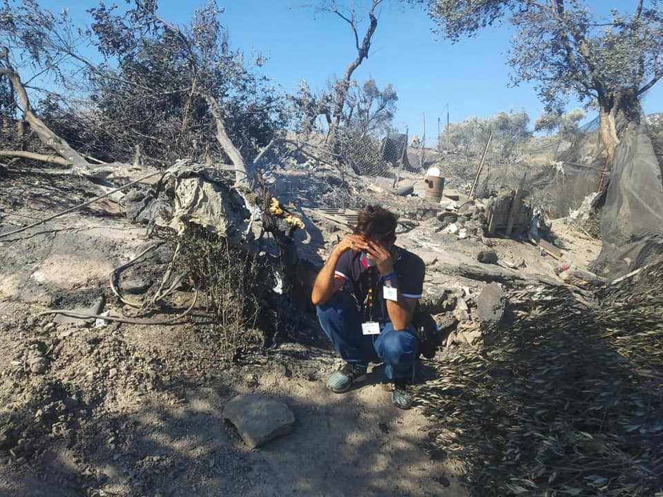
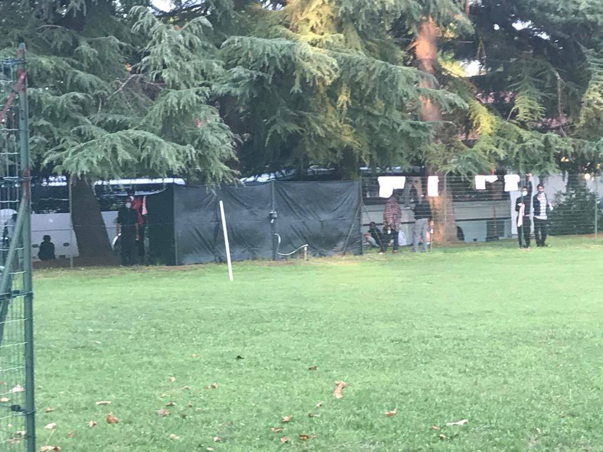

### AYS Daily Digest 09/09/20: Chaos, despair, ash — Moria in ruins, people in fear of fascist groups
#### Field reports from Moria \(ongoing\) / Camp raids and evictions in Bosnia and Herzegovina / Norway to take more people from Moria / Scandinavian education of children with refugee background — studies / Evacuation from Lampedusa & more news

Moria after the big fire\. Credits: [Moria White Helmets](https://www.facebook.com/MoriaWhiteHelmets)
### FEATURED

The day after the big fire in Moria camp on Lesvos, Europe shows its usual face\. Pictures and videos of burning tents, screaming children, running men and women are shown, headlines try to catch the extent of this catastrophe in simple phrases\. Some people demand solidarity with these people, others keep silent\.

However, some things should be understood when it comes to Moria or the hotspot\-system implemented on the Greek islands\. While the fire itself is a disaster, at the same time it seems to be the end of the worst tragedy within the European Union this century\. For more than four years, Moria was the symbol of failing politics on the back of human beings\. It forced tens of thousands of people to live in horrible conditions, with malnutrition, almost no hygiene or sanitary facilities, no real coordinated support\. At the edge of the continent, on an isolated spot on an isolated island, this was tolerated, accepted, and promoted as a model for refugee politics\. All of this has repeatedly been reported, analyzed, and criticized\. The response was never more than a symbolic action\.

The [European Commission](https://ec.europa.eu/home-affairs/sites/homeaffairs/files/what-we-do/policies/european-agenda-migration/background-information/docs/greece_state_of_play_report_en.pdf) itself once [described](https://ec.europa.eu/home-affairs/sites/homeaffairs/files/what-we-do/policies/european-agenda-migration/background-information/docs/greece_state_of_play_report_en.pdf) Moria as the only “functional hotspot” and the system as a key measure of “crucial importance” for managing migratory flows — well aware of all the public critics denouncing **the system as inhumane and violating basic human rights** \. They were a consequence of the EU\-Turkey deal, trying to discourage people from reaching Greek soil by boat, although Moria was already set\-up in [October 2015](https://www.ecre.org/wp-content/uploads/2016/12/HOTSPOTS-Report-5.12.2016..pdf) \. European countries have repeatedly refused to evacuate the 13,000 people from Moria, which has an official capacity of 3000\.

Now up to 13,000 people are homeless\. Not to say they had a home before\. **They were homeless even before** \. Now they lost their little shelter, something the could barely call a residence\.

**Living in Moria meant** , that sharing a tent with nine strangers should be considered a comfortable situation compared to sleeping completely rough\. Waiting in line for hours to get some food, clothes or medical treatment\. Having only cold water available to take a shower, sometimes not even running water to fill a bottle\. Having children educated by volunteers and NGOs\. Leaving women in fear of being sexually assaulted while going to the toilet at night\.

Since the beginning of the pandemic, Moria turned even more into **a dangerous prison for people who did not commit a crime** — there was a full lockdown, prohibiting people to leave the territory\. The only thing they did was to enter Greek soil \(and therefore the European Union\) to make use of their legal right to submit an asylum application\. In Moria, this meant waiting for years in these terrible conditions to receive a decision — and let it be negative, following the risk of deportation\.

Why then does the fire not mean a happy end of an shameful chapter? There are various reasons\. Let’s start on a personal level\. Speaking to Are You Syrious, a volunteer from [Europeans for Humanity](https://www.facebook.com/europeansforhumanity/) described the scene, when her team drove to Moria around 2am, after they prepared to provide first aid\. “Thousands of people were running out of the camp, women, children, people in wheelchairs\. It was dramatic,” she recalls\. They saw how people were still jumping over the fence to escape the fire: “The fire turned bigger and bigger, people were in a panic trying to run away\.”

Volunteers and reporters on Lesvos are used to bad news\. “We have new deaths weekly, police violence, and fires from time to time”, the volunteer recalls\. But it quickly turned out, that this fire has another dimension\. “This is no big surprise\. For months we were warning a big catastrophe will happen\.”

In fact, it does not make it easier for people\. They even lost the life they did not have\. All belongings they did not rescue from the flames are gone\. According to the Greek government, nobody died and there were no severe injuries\. “ **We do not know the full extent of the incident** ,” says the volunteer\. Many are still missing their relatives, as some ran towards the city, others to Kara Tepe or in the forest to hide from fascists and others returned to Moria\. “The situation was completely desperate and uncoordinated,” she described this moment of shock\.

Even though her team was equipped to provide first aid, they could not\. “Police sent us away”, the volunteer says\. When they tried to enter the camp from another side, they were **attacked by a group of fascists** , who threw stones at their car and pulled the driver out of it\. “They tried to kill us,” she says\. The group was forced to hide in the forest for hours\.

According to the Chief of Fire Service, Konstantinos Theofilopoulos, several fires broke out around 10\.30pm\. Apparently, some tents were set on fire\. Firefighters were hindered with thrown stones\. However, it is not known yet who started the fires\. Reports say, residents started the fires, as they were frustrated about the quarantine and 35 positive tests for coronavirus in the hotspot\. Patient zero seems to be a man, [who had to return from Athens](https://displaced.substack.com/p/athens-takes-advantage-as-corona?fbclid=IwAR02926z5xt6mA9pxTL_QXQQPG8VP2HF2s521Z5bzunGAhu6e6oOF0gSmZc) \. The Greek government has now declared a state of emergency on Lesvos for the next four months\.

Instead of putting all efforts to find shelter for the people and provide first aid, the **police are blocking the road from Moria to Mytilene, forcing people to stay in the fields** \. Only 400 unaccompanied minors were [assured](https://www.keeptalkinggreece.com/2020/09/09/eu-johansson-minors-moria-fire) to be transferred to the mainland\. During the day, another fire broke out on the site\. Reportedly, the Moria residents will now be sheltered in boats and tents — so it is not like a lot will change in the end\.

What also is unclear, is what happened with the data of the asylum seekers\. As the EASE containers burnt, too **it [seems](https://twitter.com/we_are_solomon/status/1303733314344411142) that the case files might have been destroyed** , too\.

Meanwhile, fascists still drive through the city of Mytilene with scooters, which makes them fast and flexible\. “They know us now,” says the volunteer\. They hide in the forests and when they see their targets, there’s suddenly a large group of attackers; they seem to focus on volunteers rather than people on the move\. “We need to evaluate how we can continue without being threatened by fascists\.”

](assets/c410c29eb68e/1*ayEDsVv4V6nbBDKfDXhIrw.jpeg)

Photo: [Kirsty Evans](https://www.facebook.com/kirstyevans123?__tn__=%2Cd%2AF%2AF-R&eid=ARB1d7gQ_KfqgYDfnr6bGB74g8Y1CIi7u1ZJvLZ2DXfg4Z6Qm8CetxGCAqzh9kGzQ9BFMFig1YzLGAB8&tn-str=%2AF)

We’re sharing the testimonies from people active in the Aegean, to help raise awareness of the severe hardships people trapped in the camps across the Aegean islands are, here is today’s by [Daniel J Chapman](https://www.facebook.com/danieljchapman1404?__tn__=%2CdCH-R-R&eid=ARBcbr5KmMCRywCb47MoHcN9UmLShbRicnSRrkFVoKdBdPdqgfC39qqGfKxKItSDP_M1Pl9-ppnc6t5w&hc_ref=ARRupenIbZPSC674WcghiPVVw40Hh3_bJhxNrQIQF9nOV2Ba4DCg4G23B7LQNk9mp74&fref=nf) :

> _If you want an idea of how bad Greece’s refugee camps are:_ 

> _\-Today I had to tell an 18 y/o boy that the best protection i could currently offer him from the middle age man threatening daily to rape him is an attack alarm\. I had to tell him that if he is raped that he can’t wash or change his clothes before going to the hospital is he wants any form of justice, which is very unlikely\. No one should need to be given advice like that\. We will try a referral for secure accommodation but it won’t do anything, half of the camp need protective accommodation\. He tries to sleep tonight with this fear hanging over him\._ 

> _\- Last week I had to explain to a woman that even though she’d been raped multiple times, for being LGBT, by the same man, the passivity of the hospital and the police mean she still has to live in the camp with him\. Shes petrified she’ll be raped another time, petrified that tonight it will happen again\._ 

> _\-As I write this 2 young Syrian men are trying to swim back to Turkey because they’ve been here a year and conditions are so unbearable, they tried to deport themselves for some dignity but we’re even denied this\. I don’t know if they’ll survive the night, I can only hope they do\. 2 futures, 2 lives, 2 people so badly let down\._ 

> _I could tell you countless stories about sexual violence, self harm, suicide attempts, depression, hopelessness, discrimination and the fear that refugees face living in Samos Camp every day\._ 

> _Daily i’m having to convince people that their lives are worth continuing living\. It feels so disingenuous knowing what people are going through\. I don’t know how anyone survives the camps at all\._ 

> _Countless more stories or torture, sexual violence and more from before people arrived in Samos\. Service are stretched to breaking point, with need far outweighing resources, conditions get worse and the EU and Greek Government are complicit in these actions\._ 

> _Europe should be providing safety and dignity to asylum seekers\._ 

> _Instead it subjects asylum seeker to degrading conditions akin to torture\._ 

> _Moria has burnt down, we shared warnings after the devastating fires in Samos but conditions deteriorated\. More displacement, more trauma, more helplessness and fear\. Unnecessary suffering we are all complicit in allowing\._ 

> _How bad do things have to get for change to come?_ 
 

> _How bad do things have to get for you to act?_ 

> _Until the hotspots are evacuated suffering will continue, irreversible psychological damage caused and lives lost\._ 

> _Humanity has been lost at Europe’s borders\._ 

### BOSNIA AND HERZEGOVINA
### Pressure on people on the move, closing of Bira and police raid in Sarajevo

The Bosnian officials continue to stir things up and use the people in need of protection for their own political gains ahead of the upcoming elections\. Although there are many people without a roof over their head, even less any decent accommodation or additional care, the local operative group for migrant crisis, as they named themselves, has decided to close a camp in Bihać, move people from the Bira camp in Bihać to the tent camp set up in Lipa, a field of some 20 kilometres from the city of Bihać\. All this without any coordination, organisation, measures or protection for the people inside the facilities\. The Lipa camp has also been brought into attention because people were complaining of police and security forces treating them violently, people were reportedly beaten up, kicked out of the camp etc\. It was also presented as a solution, although the nature of the camp is provisional and should not be treated as a viable solution for people who need dignified lodging, especially ahead of the winter months, when that specific spot is very windy and cold, and will become so very soon\. Still, the local politicians decided to send more people to the overcrowded camp \(set up for 1,000 people, it now has close to 1,200 people\) \. In their first reaction, over the phone with a regional TV station, the IOM said that the relocation of people from Bira to Lipa was not done in coordination with them or the Office for Foreigners\. However, in the meantime, the people in Bira are scared and they don’t understand what’s going on\. There have been no reactions or decisions taken by the organizations, international community, nor any of the Bosnian organisations and activist groups so far\.

Back in Sarajevo, a police raid took place in the camp Blažuj\. According to the media, it was done by the order of the Municipal Court in Sarajevo\. They apparently raided the camp in order to “find objects and persons who are brought in connection to performing criminal acts”, as the police officially stated\. In the end, they seized 18 people\.

> _“Three people of security interest were found who were expelled from Bosnia and Herzegovina by the Service in charge and placed under supervision in the Immigration Center of the Service for Foreigners\. They are one citizen of Algeria and two citizens of Morocco\. The Service for Foreigners Affairs shall carry out further measures and actions within its competence upon their removal from Bosnia and Herzegovina\. Also, after the procedure, the Service issued a measure of expulsion for 15 people, 4 from Afghanistan, 3 from Pakistan, 3 from India, 2 from Algeria, 1 from Morocco, 1 citizen of Guinea and 1 citizen of Iran, who were assigned the measure of placing under supervision in the Immigration Center or by restricting movement at a particular place\. These are persons for whom material evidence of their identity has been found, as well as other evidence that can be used in the readmission procedure and their removal from Bosnia and Herzegovina\.”_ 

The Police Directorate of the Ministry of the Interior of the Sarajevo Canton said they would continue with the activities of “enhanced control of migrants in the Sarajevo Canton, all with the aim of preventing crimes and misdemeanours\. taking measures and actions in accordance with the law\.”

Police and private security companies have been treating many people across the camps in BiH violently, but also those who would be passing by, often without anywhere to go\. This type of behaviour has not yet been clearly condemned by any relevant \(to them or the public\) source or organisation, so the practice goes on, and relations are even more fired up now that the political motivations run the public information channels and shape the entire rhetoric on migrations in the country\.
### ITALY
### Evacuation from Lampedusa

2500people were evacuated from the island of Lampedusa\. The people are now headed to the ports of Augusta, Palermo and Trapani, Sicily, but will first spend two weeks quarantined on the ferries\. After that, they will await a decision on their asylum applications — which can take up to two years — in Sicily or elsewhere in Italy, the media [report](https://www.dw.com/en/italy-removes-2500-asylum-seekers-from-crowded-lampedusa-camp/a-54858830?fbclid=IwAR0gUA54daaxLjETyUS2aqgeFyThmZgtDSJPvYUZsWUTA6-t5oUx7BiEWuM) \.
### Udine: depraved of any dignity

[Ospiti in Arrivo](https://www.facebook.com/ospitinarrivo/?__xts__%5B0%5D=68.ARAkD9kYS9N-K5DDeqacCvki6PzSwk2ZEKgqFwEgBpTfqO1ACYj8aoyDhCRt5JNg7yq1Z5Z9f5tkg4Xn_QNOYvOgiqmFBI9J32PKtIMbcXwQdel9I0DpxhRtjxJMXrDv3HGISiF0Fe7PnYat7VHLMm_-22UgIYq9zuVL9K-HOc6ohN5-qg9h_ZXhZdyThKGf03MFFUp9UVFN0_mEAsoTZrXSXt1bIW6A98iAYr7SaDM_rsIr4fjGvmWy-S9K82SuPY3YpGR98vLkUhFu_yb6RNpFmLSn_ZUGwNNjjBgrxmSdgqpDCxQdiIo32kT8SqQDqftBUadKTZnQyNouqN_aA1PB_BE7&__tn__=k%2AF&tn-str=k%2AF) report that the former Cavarzerani barracks are beyond capacity\.

> _No structure is prepared to welcome people from the Balkan route\.The prefecture makes seventy asylum seekers quarantine, after thousands of kilometers and bad experiences under their feet, aboard three couriers parked on the Sanctuary of Tricismo\. Then the mayor protested and people were moved like they’re objects, that they have always been in the eyes of Italian and European institutions\._ 

> _Now there are thirty people divided into two couriers parked near the ex\-psychiatric hospital of Sant ‘ Osvaldo, right in front of where we play cricket with the Playing For Change Udine project\._ 
 

> _They are sleeping on the seats, using chemical bathrooms, washing with the water pipe under the watch of the police and civil protection\. Meanwhile, at Cavarzerani, many asylum seekers have been taken away who knows where \. \.Migrants are not people with life projects but bodies we can have at our disposal and the important thing is that they get out of the way\. The most recent news is that these people will be welcomed by Caritas, but we think that it’s time to take personal responsibility and oppose with Strength to the cancellation of human rights that happens daily before our eyes, because in this way, shame in shame, we can’t go on anymore_ 

Photo: Ospiti in arrivo
### SCANDINAVIA

Norway have [said that they will take 50 people](https://www.nrk.no/norge/regjeringen-henter-asylsokere-fra-moria-leiren-til-norge-1.15152925?fbclid=IwAR0gUA54daaxLjETyUS2aqgeFyThmZgtDSJPvYUZsWUTA6-t5oUx7BiEWuM) from Moria after the fire\. Mainly families with children\. Previously, Norway said that 8 countries had to relocate people before they should do it — but after seeing photos from the fire Erna Solberg, the Norwegian PM, said that they will go ahead with the relocation despite the fact that “only” 7 other EU countries have accepted refugees from the islands as a part of an agreement brokered by the EU earlier this year\.

The significant increase in the number of people arriving in the Nordic countries in recent years has brought a focus on the education of refugee children and youth\. In general, young people of refugee background who arrive in the Nordic countries at a late school age do less well in school than their peers\. But there is also a significant difference between the Nordic countries\. Refugee children living in Sweden show the best school results, while Denmark and Finland demonstrate the poorest school results among refugee children compared to the children in the general population, recent two scientific [studies](https://www.miragenews.com/refugee-children-in-sweden-do-better-in-school-than-refugee-children-in-denmark/) have shown\.
### UK

**If you wish to contribute, either by writing a report or a story, or by joining the info gathering team, please let us know\.**

**We strive to echo correct news from the ground through collaboration and fairness\. Every effort has been made to credit organisations and individuals with regard to the supply of information, video, and photo material \(in cases where the source wanted to be accredited\) \. Please notify us regarding corrections\.**

**If there’s anything you want to share or comment, contact us through Facebook, Twitter or write to: areyousyrious@gmail\.com**

Following
- [Digest](https://medium.com/are-you-syrious/tagged/digest)
- [Moria](https://medium.com/are-you-syrious/tagged/moria)
- [Refugees](https://medium.com/are-you-syrious/tagged/refugees)
- [Europe](https://medium.com/are-you-syrious/tagged/europe)
- [Italy](https://medium.com/are-you-syrious/tagged/italy)

_Converted [Medium Post](https://medium.com/are-you-syrious/ays-daily-digest-09-09-20-chaos-despair-ash-moria-in-ruins-people-in-fear-of-fascist-groups-c410c29eb68e) by [ZMediumToMarkdown](https://github.com/ZhgChgLi/ZMediumToMarkdown)._
