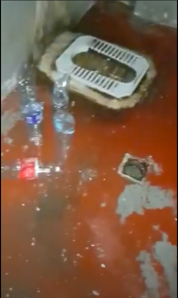
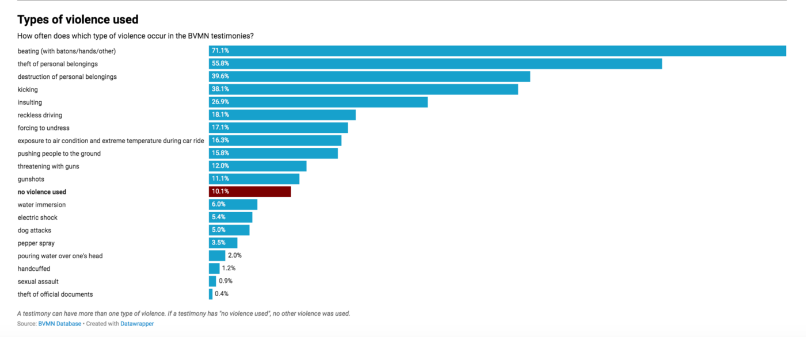

### AYS Daily Digest 11/09/2020: Hunger Strike in Inhumane Greek Police Station

[Are You Syrious?](@AreYouSyrious?source=post_page-----212060b61c75----------------------)

[Sep 12](ays-daily-digest-11-09-2020-hunger-strike-in-inhumane-greek-police-station-212060b61c75?source=post_page-----212060b61c75----------------------) · 13 min read

New camps being constructed in Lesbos // Evidence of inhumane conditions in Greece // Malta “not responsible” for 27 people abandoned at sea for 38 days // Record number of pushbacks // NGOs prohibited from distributing food in Calais
### Feature

On Friday, members of the AYS team in Athens were contacted by one of the people detained in Keratea\. Twelve people have been on hunger strike for five days now, while one person had to stop on Thursday\.

They are from Iran, Egypt, Syria, Bangladesh, Germany, Ghana, Sri Lanka and other countries\. Most have active asylum claims, while three have signed deportation papers, without anyone to translate the documents for them, and only to escape the conditions in which they are being forced to survive\.

One individual was transferred there nine days ago, but other people have been detained in these basement cells for up to 10 months\. The police station should be a temporary detention facility, and it is not equipped for long\-term detention\. As the EU’s Commission for the Prevention of Torture stated in their last report published in April, “as regards conditions of detention, most police establishments visited were totally unsuitable for holding detained persons for periods of longer than 24 hours\.”

They live in small dark rooms, four people in each one, while some sleep on the floor in the corridor\. In the whole facility, there are only nine beds\. Once the hunger strike started, police raided the cells and seized personal belongings and phones\. Police told them not to complain because they are living in “VIP conditions” compared to months before, when up to 16 people were sleeping on the floor of the corridor\. Also, reportedly police has been violent towards one of the detainees, who was punched, and told them: “If you die here, we won’t put you in a grave”\.

The police have allegedly refused medical treatment to one detainee who is suffering from a brain tumour, telling him that he had to give them money to buy medication when he, of course, has none because he is detained\.

Lawyers are of no help either\. Most of the detainees have paid between 300 and 1000 euro to lawyers who now are not answering their calls\. It is not the first time we hear reports of fake lawyers approaching people on the move and asking to be paid in advance, only to disappear days later\.

The detainees demand respect of their basic human rights: hot water, beds, hygiene facilities, natural light, access to the outside world, medical treatment and legal support\.
### Greece

Multiple reports have suggested that the army has started to construct a new camp on Lesvos\. [Giorgos Christides,](https://twitter.com/g_christides/status/1304440552528711683) a Der Spiegel journalist, stated that a _ccording to his info a new camp started being built today after Moria was destroyed which will have a capacity of 4–5k and will host asylum seekers for up to five months\._ He indicated that _the Government plans to not only make multiple similar camps on Lesvos but also intend to rebuild Moria and keep it at capacity\._

The [Greek newspaper Stonisi](https://www.stonisi.gr/post/11338/o-kyvos-errifthh-kataylismos-pisw-apo-to-pedio-volhs-realtime-pics?fbclid=IwAR0hWjaeryCsmc97RmzwksZOIY424djDfZ5OfB3F9e_dCUrUhXH2LVA11YI) reported that tents are being flown in by helicopter in order to begin setting up a camp to immediately house thousands of refugees and migrants living on the street\. It has been indicated that the temporary site for this camp is behind the firing range of Kara Tepe in an area owned by the Greek State\. The armed forces have been drafted in to set up the camp, with the UNHCR, the UN High Commissioner for Refugees and the International Organization for Migration contributing to the creation of the camp through the donation of tents\. Each tent will house about six people, and its believed the temporary camp will be able to house 3,000 people\.

[At around 2pm today](https://www.efsyn.gr/ellada/koinonia/259400_theloyme-na-fygoyme-afiste-mas-eleytheroys-fonazoyn-oi-prosfyges-exo-ap-kara) , thousands of asylum seekers and migrants, holding placards made of cardboard boxes, marched to Kara Tepe, where the camp is being constructed\. The five thousand people, mostly women and children, shouting “Azadi, azadi” or “Freedom” were met with a strong police presence with officers equipped in riot gear and carrying weapons\.

[The UN High Commissioner for Refugees \(UNHCR\)](https://www.efsyn.gr/ellada/koinonia/259400_theloyme-na-fygoyme-afiste-mas-eleytheroys-fonazoyn-oi-prosfyges-exo-ap-kara) has called for long\-term solutions for refugees and asylum seekers in Moria, seeking more support, including from European countries and institutions, and other structures on the Greek islands\.

The statement [published](http://%22The%20events%20in%20Moria%20demonstrate%20the%20long-term%20need%20to%20improve%20living%20conditions,%20alleviate%20overcrowding,%20improve%20security,%20infrastructure%20and%20access%20to%20services%20at%20all%20five%20reception%20centers%20on%20the%20Greek%20islands,%22) by the UNHCR said “The events in Moria demonstrate the long\-term need to improve living conditions, alleviate overcrowding, improve security, infrastructure and access to services at all five reception centres on the Greek islands\.”
### Pushbacks

Today the Border Violence Monitoring Network published the 800th pushback testimony on their database\. Over the past three years, the grassroots organizations which make up the Border Violence Monitoring Network have collected these testimonies from people\-on\-the\-move in Greece and along the Balkan Route\. The pushbacks described on the database concern over 9,000 persons subjected to illegal treatment and violence on the doorsteps to the European Union\. Access the entire public database at [www\.borderviolence\.eu](http://www.borderviolence.eu/?fbclid=IwAR3WWPomsgQ4aSMVOC9HwIKCt5sABy3J20mtGedgC40os5-XK9CBtsnKA9c) \.

The graphic below shows some of the most common forms of violence described by individuals in these reports\. We must never forget that behind each one of these testimonies stands a group of persons with their own complex emotions and lifegoals which have been irreparably affected by the border policies of EU\-member states\.

### Sea

The 27 rescued persons who have been onboard Maersk Etienne for 38 days have been safely transferred to the ship Mare Jonio operated by the non\-governmental organisation Mediterranea\. For 38 days, these people have been denied safe disembarkation to the Maltese port, and thus have been left stranded at sea\. The Maltese authorities were informed of the intervention by the Mare Jonio but declared themselves “not responsible” and refused to assign a safe port for the 27 people rescued\.

Tommy Thomassen, Chief Technical Officer, Maersk Tankers, said _“We are relieved and grateful\. The rescued persons can now finally get the medical care they need and our crew can continue their voyage safely\. While we are appreciative of the support from Mediterranea in helping us to bring closure to this unprecedented situation we are at the same time deeply concerned that it has not been possible to find a solution to the situation before now\. It has been very difficult for the rescued persons and our crew”_

Maersk Etienne will proceed to a suitable port where we will follow up with a debriefing of the crew and ensure they too get the care they need\.

France

On Thursday, [Natacha Bouchart, the mayor of Calais](https://www.lavoixdunord.fr/863431/article/2020-09-10/migrants-le-ministre-interdit-la-distribution-des-repas-par-les-associations) , went to Place Beauvau to meet Minister of the Interior Gérald Darmanin\. The meeting that for weeks had consistently been requested by Mayor Bouchart lasted just over an hour, and concluded with the [mayor obtaining ‘several advances’](https://www.lavoixdunord.fr/863431/article/2020-09-10/migrants-le-ministre-interdit-la-distribution-des-repas-par-les-associations) \. Among the ‘advances’ was a drafted prefectural decree which would effectively prohibit the distribution of food by NGOs in Calais\.

Germany

In the wake of the fire that destroyed the Moria refugee camp on the Greek island of Lesbos, [several German municipalities have pledged to take in asylum seekers\.](https://www.thelocal.de/20200911/ten-german-towns-and-cities-pledge-to-take-in-refugees-from-moria?fbclid=IwAR3gJcOz8JA6aFdF0M4Zji8NQ32S1DJUXHvOU0ivY6pk6Jhu2glHuiIp4RQ)

The leaders of 10 towns and cities \(Bielefeld, Düsseldorf, Freiburg, Gießen, Göttingen, Hanover, Cologne, Krefeld, Oldenburg and Potsdam\) across Germany have written to Chancellor Angela Merkel and Interior Minister Horst Seehofer stating that _“We are ready to take in people from Moria in order to defuse the humanitarian catastrophe\.”_

Since the fire, a [n estimated 13,000 refugees](https://www.bbc.com/news/world-europe-54082201) have been homeless on the island\. Armin Laschet \(CDU\), the state premier of Germany’s most populous state, North\-Rhine Westphalia, stated that NRW would take in 1,000 refugees from the camp while calling for aid to be provided\.

Laschet told Berlin’s [Tagesspiegel newspaper](https://www.tagesspiegel.de/politik/wie-weiter-nach-dem-brand-in-moria-laschet-will-1000-fluechtlinge-in-nrw-aufnehmen/26171270.html) “ _We now need both: quick emergency aid for Moria and sustainable, European help with the admission of children and families”\._ While it is welcome to hear that Germany and France have promised to take in the bulk of the minors, with AFP reporting that each country will bring in between 100 and 150 people, it is also important to ensure that EU member states also extend safe passage to the thousands of adults and families who have been plunged even further into destitution by the fire\.

Jordan

[US\-based NGO Make Life Skate Life is using skateboarding to bring refugee communities together in Amman, Jordan](https://www.middleeastmonitor.com/20200911-a-skateboard-ngo-is-bringing-refugee-communities-together-in-jordan/?fbclid=IwAR3gJcOz8JA6aFdF0M4Zji8NQ32S1DJUXHvOU0ivY6pk6Jhu2glHuiIp4RQ) \. The NGO hosts a range of classes and workshops with local children every week, including a youth leadership programme that trains older children to become skateboarding instructors\. The aim is to encourage skateboarding in Amman and provide a space where refugee and local communities can interact\.

Speaking to the Middle East Monitor, Kas Wauters, the programme manager of the [7Hills Skate Park in Amman](https://www.middleeastmonitor.com/20200902-jordan-to-resume-regular-commercial-flights-from-8-september/) , a skate park was built in 2014 by a coalition of local skateboarders and the Make Life Skate Life, said:

_“Once you share a common interest or a common passion, all the barriers, or all the differences, fade away\. Skateboarding is quite intense and requires a mental battle and physical balance in every individual, so it’s really easy to forget everything around you\.”_

Wauters explains that this scheme has been successful in Amman\. “ _Bad ass kids from the neighbourhood who were, at the beginning, trying to trash the space and steal skateboards… have got into our youth leadership programme”\. “Now, these boys are taking care of the skateboards and making sure no boards are getting stolen\. They are also making sure the park is kept clean\.”_

Discussing the outreach of the programme, Wauters said “ _Before 7Hills; the Sudanese had no space to go to in Amman\. They were staying at home in the city because they didn’t feel safe in public and the kids weren’t going to school\._ ” In response, Wauters and other members of the NGO’s team came up with the idea of a Sudanese\-only skate class once a week\. It started on a Saturday with just one mother and a handful of Sudanese refugee children, but is now one of 7Hills’s biggest programmes\.

Spain

[InfoMigrants reports that the Spanish coast guard](https://www.infomigrants.net/en/post/27189/one-dead-among-nearly-300-new-arrivals-on-canary-islands?fbclid=IwAR1TuyTf_wDDwgH2PwdI7pn5z7xZYtVA981lHrKNjxdVlIX0qPQiL91EPbU) has confirmed that on Tuesday and Wednesday they rescued 283 migrants from several boats as they approached the Canary Islands\. On a boat that was carrying 57 people, including a child and two women, there was also a dead body\.

Europa Press reported that according to figures they obtained from the Ministry of the Interior, there had been a “ _600% rise in the numbers of migrants arriving on the Canary Islands in the first eight months of this year”\._ These figures have been corroborated by AFP stating that according to the Ministry of the Interior, 3,933 people had arrived up to August 31, with the recent arrivals increasing this number to over 4,000\.

Libya

Addressing the security council regarding the ongoing situation in Libya, acting Special Representative of the Secretary\-General Stephanie T\. Williams expressed her concern that migrants, refugees and asylum\-seekers continue to attempt to cross the Mediterranean, at great risk to their lives\.

In her statement, the Special Representative said: _I am deeply saddened by the recent deaths of 45 migrants and refugees in a single incident on 18 August when their boat sank off Libya’s coast attempting to cross to Europe\. More than 7,000 migrants and refugees have attempted this crossing this year; more than 300 of whom have died\. Reports of delays in rescue and disembarkation highlight the need for a review of the European countries’ approach to this situation and for a more humane and predictable disembarkation mechanism in line with the responsibilities placed on Member States by international human rights law as well as search and rescue obligations\. Libya cannot be considered as a safe port for disembarkation\. Many migrants and refugees that have been intercepted at sea have been returned to Libya and placed into detention\. As of 21 August, almost 2,400 migrants and refugees are in official detention centres in Libya, where they are subjected routinely to grave human rights violations\. Many more are in unofficial sites where the UN does not have access\. I continue to urge for greater steps by the authorities against smugglers and traffickers and for finding alternatives to detention in Libya\._

Frontex

The EU border agency Frontex is in the process of updating the rules governing its highly\-criticised individual complaints mechanism\. [Statewatch report that the complaint mechanism was set up in 2016](https://www.statewatch.org/news/2020/september/eu-updates-to-frontex-complaints-mechanism-shrouded-in-secrecy/?fbclid=IwAR3gJcOz8JA6aFdF0M4Zji8NQ32S1DJUXHvOU0ivY6pk6Jhu2glHuiIp4RQ) and in theory allows anyone who believes they have had their rights breached by the action or inaction of officials involved in a Frontex operation to lodge a complaint with the agency, after which it will be dealt with by the agency itself or forwarded on to the relevant national authorities\.

Since its introduction, the complaint mechanism has faced increasing calls for reform due to the lack of any mention of the possibility to appeal against decisions on the outcome of complaints, or of any time limits for processing complaints\. As explored in the recent [**_Statewatch_ publication**](https://www.statewatch.org/deportation-union-rights-accountability-and-the-eu-s-push-to-increase-forced-removals/) _Deportation Union: Rights, accountability and the EU’s push to increase forced removals_ , the minimum standards to qualify a complaints mechanism as an effective remedy include “institutional independence, accessibility in practice, adequate capacity to conduct thorough and prompt investigations based on evidence, and a suspensive effect in the context of joint expulsions\.”

[Statewatch have further reported](https://www.statewatch.org/news/2020/september/eu-updates-to-frontex-complaints-mechanism-shrouded-in-secrecy/?fbclid=IwAR3gJcOz8JA6aFdF0M4Zji8NQ32S1DJUXHvOU0ivY6pk6Jhu2glHuiIp4RQ) that their attempts to ensure transparency over those updates — which have important implications for the protection of fundamental rights — have, so far, been unsuccessful\. On 20 May 2020 _Statewatch_ made a request to the Frontex “transparency office” for access to various documents, but have consistently faced delays or denial from Frontex\.

[In a public statement](https://www.statewatch.org/news/2020/september/eu-updates-to-frontex-complaints-mechanism-shrouded-in-secrecy/?fbclid=IwAR3gJcOz8JA6aFdF0M4Zji8NQ32S1DJUXHvOU0ivY6pk6Jhu2glHuiIp4RQ) discussing the refusal by Frontex to supply Statewatch with the requested documents, Statewatch said “ _The issue at hand is the design and structure of a mechanism intended to deal with complaints against an agency that wields growing powers over individuals who may be in particularly vulnerable situations\. Not only is this an issue of fundamental public interest, but greater transparency would likely be an aid in designing a better\-functioning mechanism\. Unfortunately, the agency against which any complaints would be filed thinks otherwise\.”_

To read Statewatches full update, please view the link below:
### [EU: Updates to Frontex complaints mechanism shrouded in secrecy](https://www.statewatch.org/news/2020/september/eu-updates-to-frontex-complaints-mechanism-shrouded-in-secrecy/?fbclid=IwAR3gJcOz8JA6aFdF0M4Zji8NQ32S1DJUXHvOU0ivY6pk6Jhu2glHuiIp4RQ)
### [EU border agency Frontex is in the process of updating the rules governing its highly\-criticised individual complaints…](https://www.statewatch.org/news/2020/september/eu-updates-to-frontex-complaints-mechanism-shrouded-in-secrecy/?fbclid=IwAR3gJcOz8JA6aFdF0M4Zji8NQ32S1DJUXHvOU0ivY6pk6Jhu2glHuiIp4RQ)
#### [www\.statewatch\.org](https://www.statewatch.org/news/2020/september/eu-updates-to-frontex-complaints-mechanism-shrouded-in-secrecy/?fbclid=IwAR3gJcOz8JA6aFdF0M4Zji8NQ32S1DJUXHvOU0ivY6pk6Jhu2glHuiIp4RQ)

UK

New analyses from the [Migration Observatory at the University of Oxford](https://migrationobservatory.ox.ac.uk/press/policies-to-tackle-uk-irregular-migration-are-based-on-a-data-black-hole/?fbclid=IwAR3gJcOz8JA6aFdF0M4Zji8NQ32S1DJUXHvOU0ivY6pk6Jhu2glHuiIp4RQ) have highlighted how UK policies to tackle irregular migration are based on a fundamental lack of data on the irregular migrant population in the country\.

The Observatory has published two new pieces of analysis demonstrating that the UK government has not since 2005 published estimates of the size of the UK’s irregular migrant population \(neither does the government publish statistics on the number of people whose migration status is regularised under long residence routes\) \. The second new publication highlights how analysis by the Migration Observatory demonstrated that methods currently used by the UK government to develop any estimates of the UK’s irregular migrant population are unreliable\.

Dr Peter William Walsh, an author of both new publications, said: _“Several estimates for the UK’s irregular migrant population have been bandied around over the last year, but we cannot rely on any of them as robust estimates\. There is little doubt that the UK does have a number of residents without legal status, or whose status is unclear for one reason or another, but at this stage quantifying it with any degree of reliability has proved impossible for those who have tried\.”_

Dr Walsh added: _“The lack of a clear baseline number for the irregular migrant population in the UK means that policies such as the ‘Hostile Environment’ that are designed to reduce the number of irregular migrants in the country cannot be evaluated, so — whatever you might think of them in principle — you can’t know if they work\.”_

Cyprus

[CyprusMail](https://cyprus-mail.com/2020/09/11/group-of-syrian-migrants-sent-back-to-lebanon-report-cyprus-to-echr/?fbclid=IwAR3WWPomsgQ4aSMVOC9HwIKCt5sABy3J20mtGedgC40os5-XK9CBtsnKA9c) has reported that a group of migrants sent back to Lebanon on Tuesday have filed a complaint with the European Court of Human Rights against the Republic of Cyprus, fearing some may be returned to Syria\.

According to migrant support NGO Kisa, the organisation had informed the migrants who had been pushed back to Lebanon about their rights under refugee laws and human rights laws and explained that the migrants who filed the complaint were afraid of their potential return to Syria from where they had originally fled\. Upon their return to Lebanon, the group filed the complaint\.

_“The Cypriot authorities did not make any individual assessment of the applicants… as to their needs and the reasons why they were on the shores of the Republic\. They also did not provide the slightest access to the international protection procedure and did not take into account any of the legal requirements of refugee law, which are not affected by the fact of ‘illegal entry’,”_ the NGO said\.

Bulgaria

Following the fire that devastated Moria, Bulgaria has offered to accept 20 unaccompanied children from the island\. A total of 400 unaccompanied children are among the nearly 13,000 migrants who were left homeless\. “Academic & policy researcher” Tihomir Sabchev said that the “Bulgarian government hits a new low,’ further explaining that the Bulgarian reception system has 5000\+ places for asylum seekers and 93% of them are empty\.

Further Reading

Refugee History: Refugee deaths, Refugee Lives
### [Refugee deaths, refugee lives — Refugee History\.](http://refugeehistory.org/blog/2020/9/11/refugee-deaths-refugee-lives?fbclid=IwAR3WWPomsgQ4aSMVOC9HwIKCt5sABy3J20mtGedgC40os5-XK9CBtsnKA9c)
### [Do \(some\) refugees’ lives matter only in so far as they die prematurely and in the glare of some kind of publicity…](http://refugeehistory.org/blog/2020/9/11/refugee-deaths-refugee-lives?fbclid=IwAR3WWPomsgQ4aSMVOC9HwIKCt5sABy3J20mtGedgC40os5-XK9CBtsnKA9c)
#### [refugeehistory\.org](http://refugeehistory.org/blog/2020/9/11/refugee-deaths-refugee-lives?fbclid=IwAR3WWPomsgQ4aSMVOC9HwIKCt5sABy3J20mtGedgC40os5-XK9CBtsnKA9c)

State Watch: UN Special Rapporteur: Ending immigration detention of children
### [UN Special Rapporteur: Ending immigration detention of children](https://www.statewatch.org/news/2020/september/un-special-rapporteur-ending-immigration-detention-of-children/?fbclid=IwAR3WWPomsgQ4aSMVOC9HwIKCt5sABy3J20mtGedgC40os5-XK9CBtsnKA9c)
### [The UN Special Rapporteur on the human rights of migrants, Felipe González Morales, has produced a report in which he…](https://www.statewatch.org/news/2020/september/un-special-rapporteur-ending-immigration-detention-of-children/?fbclid=IwAR3WWPomsgQ4aSMVOC9HwIKCt5sABy3J20mtGedgC40os5-XK9CBtsnKA9c)
#### [www\.statewatch\.org](https://www.statewatch.org/news/2020/september/un-special-rapporteur-ending-immigration-detention-of-children/?fbclid=IwAR3WWPomsgQ4aSMVOC9HwIKCt5sABy3J20mtGedgC40os5-XK9CBtsnKA9c)

**Find daily updates and special reports on our [Medium page](https://medium.com/are-you-syrious) \.**

**If you wish to contribute, either by writing a report or a story, or by joining the info gathering team, please let us know\.**

**We strive to echo correct news from the ground through collaboration and fairness\. Every effort has been made to credit organisations and individuals with regard to the supply of information, video, and photo material \(in cases where the source wanted to be accredited\) \. Please notify us regarding corrections\.**

**If there’s anything you want to share or comment, contact us through Facebook, Twitter or write to: areyousyrious@gmail\.com**

Sign up for AYS Daily Newsletter

By Are You Syrious?

Daily news digests from the field, for volunteers, people on the move, journalists, and the general public [Take a look](/are-you-syrious/newsletters/ays-daily-newsletter?source=newsletter_v3_promo--------------------------newsletter_v3_promo-)

_Converted [Medium Post](https://medium.com/are-you-syrious/ays-daily-digest-11-09-2020-hunger-strike-in-inhumane-greek-police-station-f9b01980e949) by [ZMediumToMarkdown](https://github.com/ZhgChgLi/ZMediumToMarkdown)._
