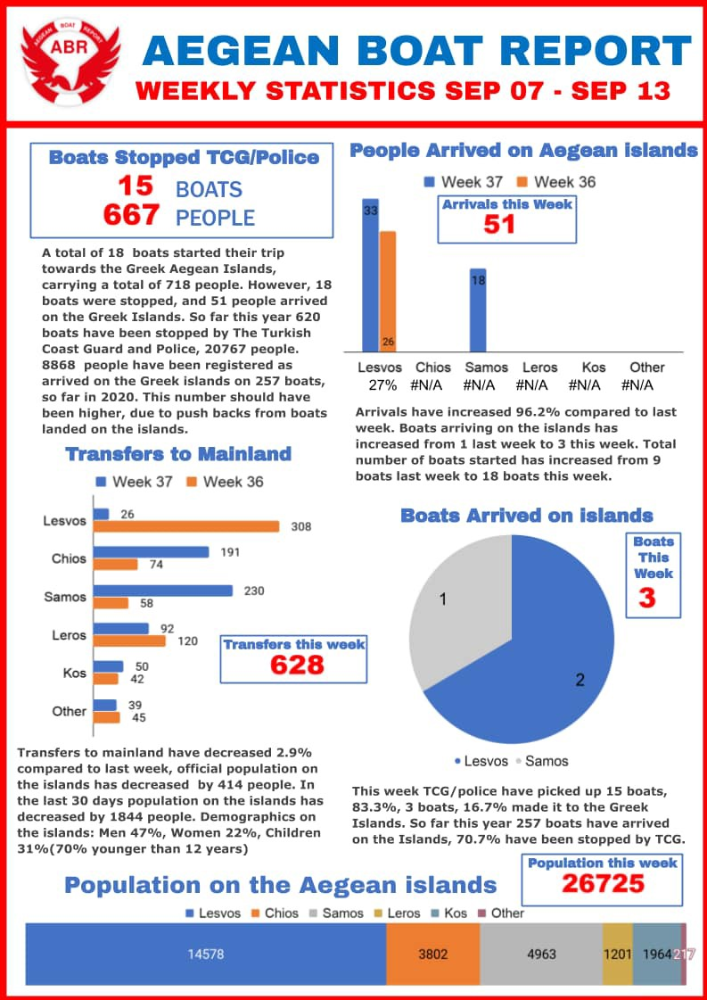
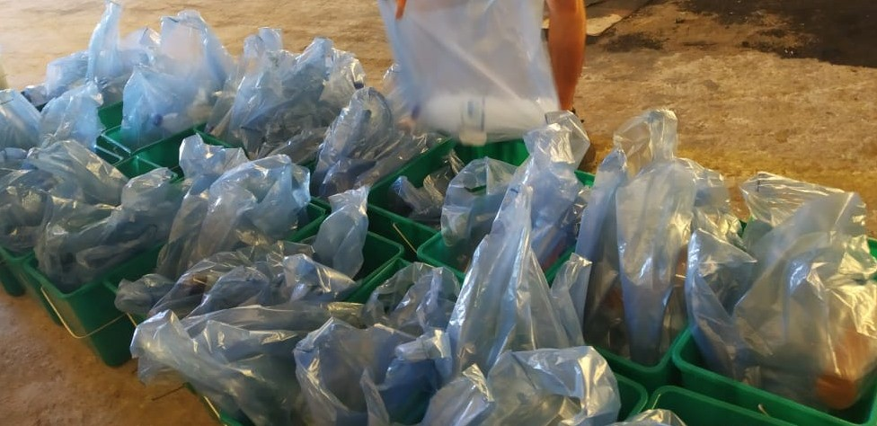
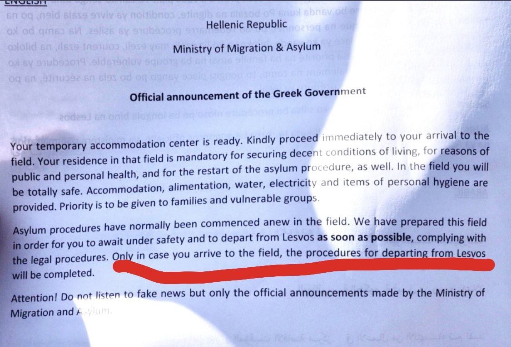
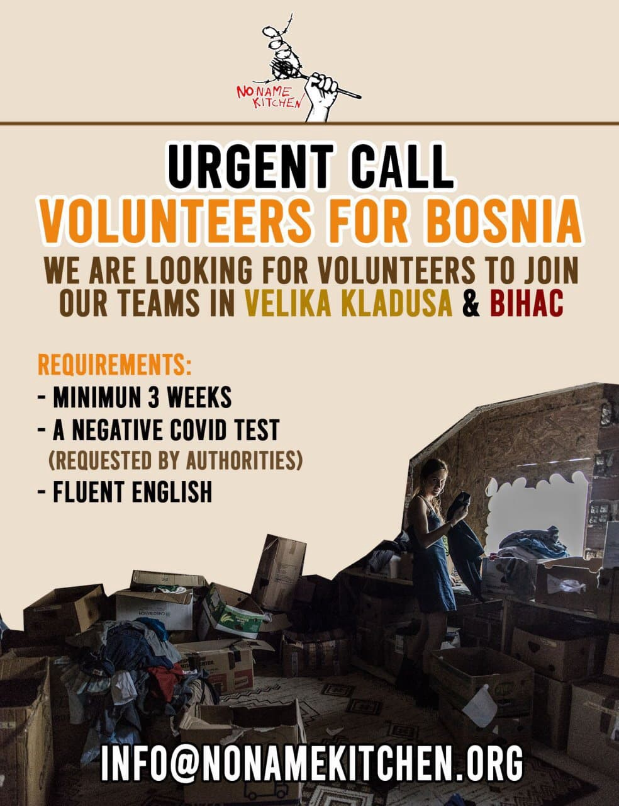
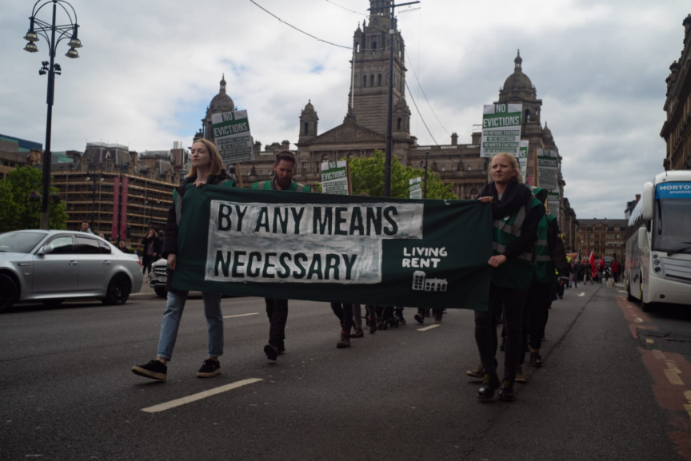

### AYS Daily Digest 14/9/20: Too little and too late — the EU’s reaction to disasters
#### The growing number of hate groups across the EU shows the system must teach by example, not avoid responsibility / Two children and a woman dead off the coast of Crete / As Germany calculates over the number of children they will help from the abyss of Moria, the UK offers nothing / updates & recommended reads \+ a positive story from Glasgow

![This image shows a drawing by a child calling for freedom\. It exists upon a wall adorned with children’s pictures depicting the negative space Moria occupies in their heads, misshaping their minds, deforming their development\.
This wall of colourful warnings is next to a family tent erected outside on the street side, with little inside it other than too many people\. This is an image of the now\-times; I hope this is not indicative of what is to come for people who deserve better\.
Let’s learn from these pictures, let’s draw a new pathway, let this pathway prioritise healthy development, let’s act on the messages resilient children have crafted and remember “no good Moria”\. Let’s do this for dignity and put our hearts into housing, let’s build for better and let people live in peace\. \(By [Kirsty Evans](https://www.facebook.com/kirstyevans123?__tn__=lC-R&eid=ARAM_TKfUdnxgmlpBfihjjODtSkWgmlA_Mri_25Cv2_SU-sjNhxzmBAPdmJAC3artEx2tqtXNaiJHMPa&hc_ref=ARQAnEsQUbQyXqOlkZ2uUolC6Hs9GHakHycno9ogy_s0UHihbiO9rbM1WZk-RYDMNRc&ref=nf_target&__xts__%5B0%5D=68.ARAKsNgDGe7mAMW6v6_klg98EqZt2oDK1QAILLCJzFZbOy4h2rvHl5Qnqf02B7FBn68okYnfLBdspvjM7hFVMAXHbjN8ewqaLZvjxFJQxbrX4e53HjFdjhRHhuaQvyZlTTcEq3IHTknMz3hZHxayaCY6Mf__2V5y7I3MNf-NNjSoG8PLywdM53j58sIdjiPjDdqnyPTIn50v4Pss5nT1xZgUrl5HQwBid9YVoAftL6DxgUEKVrQnLGpSbzRMBNjZKML_aNZ-KJSUlCEfQCnNd0XzsEASuQqGqLc) \)](assets/8fd269bc17b0/1*uvUvGLqxz5vYqInfxuPxtQ.jpeg)

This image shows a drawing by a child calling for freedom\. It exists upon a wall adorned with children’s pictures depicting the negative space Moria occupies in their heads, misshaping their minds, deforming their development\.
This wall of colourful warnings is next to a family tent erected outside on the street side, with little inside it other than too many people\. This is an image of the now\-times; I hope this is not indicative of what is to come for people who deserve better\.
Let’s learn from these pictures, let’s draw a new pathway, let this pathway prioritise healthy development, let’s act on the messages resilient children have crafted and remember “no good Moria”\. Let’s do this for dignity and put our hearts into housing, let’s build for better and let people live in peace\. \(By [Kirsty Evans](https://www.facebook.com/kirstyevans123?__tn__=lC-R&eid=ARAM_TKfUdnxgmlpBfihjjODtSkWgmlA_Mri_25Cv2_SU-sjNhxzmBAPdmJAC3artEx2tqtXNaiJHMPa&hc_ref=ARQAnEsQUbQyXqOlkZ2uUolC6Hs9GHakHycno9ogy_s0UHihbiO9rbM1WZk-RYDMNRc&ref=nf_target&__xts__%5B0%5D=68.ARAKsNgDGe7mAMW6v6_klg98EqZt2oDK1QAILLCJzFZbOy4h2rvHl5Qnqf02B7FBn68okYnfLBdspvjM7hFVMAXHbjN8ewqaLZvjxFJQxbrX4e53HjFdjhRHhuaQvyZlTTcEq3IHTknMz3hZHxayaCY6Mf__2V5y7I3MNf-NNjSoG8PLywdM53j58sIdjiPjDdqnyPTIn50v4Pss5nT1xZgUrl5HQwBid9YVoAftL6DxgUEKVrQnLGpSbzRMBNjZKML_aNZ-KJSUlCEfQCnNd0XzsEASuQqGqLc) \)
#### FEATURED

As the Moria fire and further disasters at the Mediterranean capture the public eye, some have perhaps forgotten that Croatia has been doing the EU’s ‘dirty work’ along the longest land border of the Union, that of Croatia with Bosnia and Herzegovina, and with Serbia\. The oft\-discussed and documented violent and illegal practices carried out by people wearing Croatian police uniforms — regardless of whose orders they are acting upon — have been ongoing for a long time now\. In the meantime, under pressure from the international public and some MEPs, the European Commission has made the EU’s financial support to border management conditional on putting into practice independent border monitoring, also to be funded from the same sum given to Croatia\. Croatia’s Ministry of the Interior \(which decides on and runs all things regarding asylum, migration and integration, to be clear\) has now been defending their practice and the partially misused money, which — due to the above\-mentioned condition — should have been returned\. But — politics\.

To refresh your memory of what happened, here is the article that brought attention to the issue:

Following that, some MEPs posed questions and demanded clear decisions and answers\. A very debatable answer has just arrived\. 
Here is the MEPs’ question, initiated by the Spanish MEP Domènec Ruiz Devesa, posed in June:

> On 15 June 2020, _The Guardian_ published an article entitled ‘EU “covered up” Croatia’s failure to protect migrants from border brutality’\. It suggests that the Commission has withheld information from Parliament on the Croatian Government’s underspending on the establishment of a fundamental rights monitoring mechanism at the external border, and intended to assist the country in drafting the implementation report justifying such underspending\. As part of the emergency assistance support for migration and border management to Croatia, EUR 300 000 were provided to establish a monitoring mechanism\. However, the article claims that only EUR 84 672 have actually been spent\. The article also details two brutal attacks on immigrants at the Croatian border, allegedly carried out by Croatian forces\. 

> 1\. Can the Commission clarify how the remaining EUR 215 328 intended for the monitoring mechanism have been spent? Will the Commission launch an audit on the expenditure allocated to border management in Croatia, including the monitoring mechanism? 

> 2\. Parliament supports Schengen accession when the technical and legal criteria have been fulfilled\. What impact would the failure to establish a monitoring mechanism ensuring compliance with fundamental rights and EU asylum laws, coupled with the increasing number of reports of push\-backs, have on Croatia\`s accession to the Schengen area without internal border controls? 

The [answer has arrived](https://www.europarl.europa.eu/doceo/document/E-9-2020-003758-ASW_EN.html) , and we bring the full version as it does not get precise enough for us to summarize it in a meaningful way:

> According to the project’s final implementation report provided by the Croatian authorities [**\(1\)**](https://www.europarl.europa.eu/doceo/document/E-9-2020-003758-ASW_EN.html#def1) , EUR 87 567\.72 [**\(2\)**](https://www.europarl.europa.eu/doceo/document/E-9-2020-003758-ASW_EN.html#def2) were spent for the technical monitoring of border control\. Circa EUR 15 000 earmarked for this component have not been spent thanks to savings or support from other sources, including the national budget\. 

> As the planned monitoring activities had been completed with lower costs, **the Croatian Ministry of Interior and the Commission agreed** to reallocate around EUR 200 000 to another component of the emergency assistance grant used for strengthening border control \(as per an amendment of the grant agreement done in October 2019\) \. 

> As part of its control strategy, the Commission carries out _ex post_ audits to verify the legality and regularity of the expenditure incurred by beneficiaries and paid from the EU budget\. All grants, once implemented and paid, are part of the ‘auditable population’ and subject to audit if sampled\. **If ineligible expenditure is found, the Commission must recover misspent EU resources\.** 

> In its communication of 22 October 2019 [**\(3\)**](https://www.europarl.europa.eu/doceo/document/E-9-2020-003758-ASW_EN.html#def3) , the Commission stated that Croatia had taken the measures to ensure that the necessary conditions for the application of all relevant parts of the Schengen _acquis_ had been met\. These included an assessment that **Croatia continues to make progress in the protection of human rights\.** 

> The decision on Croatia’s full integration into the Schengen area now lies with the Council\. The Commission reiterates the importance of a monitoring mechanism to ensure full compliance with the EU Charter of Fundamental Rights obligations, EC law in the area of border management as well as prompt, effective and independent investigations on any allegations of mistreatment\. 

Given the reports, evidence, and countless documented statements that prove otherwise, along with the constant concerns by the Croatian Ombudswoman, and possibly concurring reports by the Council’s Committee for the Prevention of Torture and Inhuman or Degrading Treatment or Punishment, we wonder if any of those things will have an impact on the core European institutions and their reconsideration of the aforementioned decisions unless politics have become so powerful and have gone so astray that the acronyms that stand in our name no longer represent the people, but are merely paid by the people\. We will see\.

In the meantime, EC President Von der Layen announced the presentation of the New Pact on Migration and Asylum for 23 September\.

**When refugees relinquish their fingerprints in return for aid, they don’t know how traces of themselves can travel through an invisible digital architecture\.**

> A centralised biometric infrastructure enables opaque, automated data\-sharing with third parties\. Human rights advocates worry about sensitive identifying information falling into thehands of governments or security agencies\. According to a recent privacy\-impact report, the **UNHCR shares biometric data with the Department of Homeland Security** when referring refugees for resettlement in the US\. ‘The very nature of digitalised refugee data,’ as the political scientist Katja Jacobsen says, ‘means that it might also become accessible to other actors beyond the UNHCR’s own biometric identity management system\.’ 

Please, read this very important text on the abuse of sensitive personal information:

#### TUNISIA
### “When I am here, I am frustrated, I am angry, I want to leave\.”

Tunisian migration had until recently been overshadowed by much larger numbers of people departing from [Libya](https://www.thenewhumanitarian.org/news-feature/2020/08/05/missing-migrants-Libya-forced-returns-Mediterranean) , but Tunisia now rivals Libya as the main point of departure\. So far this year, **more than [8,400](https://www.interno.gov.it/it/stampa-e-comunicazione/dati-e-statistiche/sbarchi-e-accoglienza-dei-migranti-tutti-i-dati) Tunisians have crossed the Mediterranean by boat to Italy** — accounting for over 40 percent of arrivals — compared to just over [2,600](https://data2.unhcr.org/en/documents/details/73536) in all of 2019\.
[Read the human stories behind the numbers\.](https://www.thenewhumanitarian.org/news-feature/2020/09/14/Tunisia-fishing-migration-smuggling?fbclid=IwAR2aTAbCiQMZbIokru-P7MZJYgfPjDWwo0tipzo4rGVMgFvJW-Gvzg65jxI)
#### SEARCH AND RESCUE AT SEA

 with 278 shipwrecks on board even though rescues were carried out in their SAR area of responsibility\. This refusal contravenes several international agreements: EU Regulation 656/2014: landing in the nearest port\.
Image © Francisco Gentico \(via [Proactiva Open Arms](https://www.facebook.com/proactivaservice/?tn-str=k%2AF&hc_location=group_dialog) \)](assets/8fd269bc17b0/1*FvfQcjkEjHo92zIQK7NLLg.jpeg)

Malta denies formally and repeatedly medical evacuations and safe harbor to [\#Openarms](https://www.facebook.com/hashtag/openarms?__eep__=6&source=feed_text&epa=HASHTAG) with 278 shipwrecks on board even though rescues were carried out in their SAR area of responsibility\. This refusal contravenes several international agreements: EU Regulation 656/2014: landing in the nearest port\.
Image © Francisco Gentico \(via [Proactiva Open Arms](https://www.facebook.com/proactivaservice/?tn-str=k%2AF&hc_location=group_dialog) \)

**SAR Updates**

“The nightmare journey for 27 people blockaded from Europe for 40 days and left in limbo on a merchant vessel finally came to an end this weekend”, as it was [reported](https://thecivilfleet.wordpress.com/2020/09/13/forty-day-nightmare-finally-over-as-the-mare-jonio-brings-the-etienne-27-to-land/?fbclid=IwAR2aTAbCiQMZbIokru-P7MZJYgfPjDWwo0tipzo4rGVMgFvJW-Gvzg65jxI) , and we wrote about it earlier\.

**In Greece, three people are dead and 53 were saved after a boat sank off Crete** 
The survivors of the shipwreck are reportedly in shock, and cannot give useful information or describe what exactly happened\. The Greek media reported that the coast guard said a Greek naval frigate and an air force helicopter were taking part in the search, together with two coast guard boats and three merchant ships in the area\.

■■■■■■■■■■■■■■ 
> **[Jeff Crisp](https://twitter.com/JFCrisp) @ Twitter Says:** 

> > So, according to UNHCR, interceptions and returns by the Libyan coastguard are needed to save lives at sea.
That's exactly what the EU has been arguing. 

> **Tweeted at [2020-09-15 09:24:16](https://twitter.com/jfcrisp/status/1305799586234224640).** 

■■■■■■■■■■■■■■ 

#### GREECE

### Moria updates

Greece will build new refugee camps on Lesvos with the European Union’s support after the fire in Moria\. A number of sites have already been selected and funding for their construction should come from the EU, a spokesman of the EU executive told reporters on Monday\.

■■■■■■■■■■■■■■ 
> **[Begüm Başdaş](https://twitter.com/BegumBasdas) @ Twitter Says:** 

> > What do we expect when the first rain falls or strong waves hits the shores of #Lesvos?

The new tents are built w/o distance btw them for fire prevention &amp; other safety measures. They are also built on soil area covered w/ stones on the sea.

📷Άλκης Κωνσταντινίδης/Reuters https://t.co/WtBYsfgyiN 

> **Tweeted at [2020-09-14 19:03:35](https://twitter.com/begumbasdas/status/1305582986390384641).** 

■■■■■■■■■■■■■■ 

Activists on site report that in the current emergency state it is [Médecins Sans Frontières / MSF](https://www.facebook.com/msfinternational/?__tn__=K-R&eid=ARCn-JcNylDF4KZorkhoaGXzJhuAv8mzA_6iIBW9E5O_PNZFJzwFtEe4I0g8qXuv5Rcmmj8N9bo9HZHH&fref=mentions&__xts__%5B0%5D=68.ARB4OVWSIC0rQZZI1NucDeYu_qElaOq5lgWAumx7xK8iReQVsQwzGesGTynRkSQPiuKs0HkWV6DXPzcHbkcIfyj6lyDbLI3dIFfVIzNt-Q6y4mvy31kag8EI4ZKgHcryNYylbyIFEMDV_ZyRQMRfJTiIBnQFgp92iTvh3L-wYkq2zHFFXxJTav24GarVVx92fzMWpATVuAB9kMzhp8FBZMUm6Gz_bIf_Ie8fEkbt1Ah4i52TKwH314-OI55VLnkFGHMEwdbRYXkM-z0IOQ3iC_WuXJbc3UVFko4) medical clinic to support vulnerable people sleeping in the streets, abandoned by Europe in the aftermath of the fire\. Other organisations are also present, providing support in different ways\. ABR has published their list of recommended organisations who could use your support:

We will continue sharing calls for support, local news and updates from the ground, as well as any reports done by the field teams\.

![Slowly system of distribution to members of MCAT, White Helmets and Acadamia works\. Today everyone received new masks to protect against Corona\. New posters are also soon ready to raise awareness\. Our way of distribution is that our members know when van is coming and team leaders pick up for everyone\. Takes ten minutes because we don\`t want to create big crowds\. This is always bad but especially bad since we don’t know how many people already are infected with Corona and it’s chaos we need to try to find system that prevents more spreading\. Its still not good but we work on how to do it better\. — [Moria Corona Awareness Team](https://www.facebook.com/MoriaCoronaAwarenessTeam/?__tn__=%2CdkCH-R-R&eid=ARATd_nfppf7ZDwRdkG4MrMQstoRQlsIV88T5I45EyVfIeHUCsShqGLMfLidlw1YzUctzFKWUAfHr3z9&hc_ref=ARQgUMz5tMwUqoba2cuXTAwSVUM9nxclfY94SXIDMcC_kmdWqcC5fvZtcaFmGEA0D8M&fref=nf&hc_location=group)](assets/8fd269bc17b0/1*w32a295xkzvyQysBcVnVFg.jpeg)

Slowly system of distribution to members of MCAT, White Helmets and Acadamia works\. Today everyone received new masks to protect against Corona\. New posters are also soon ready to raise awareness\. Our way of distribution is that our members know when van is coming and team leaders pick up for everyone\. Takes ten minutes because we don\`t want to create big crowds\. This is always bad but especially bad since we don’t know how many people already are infected with Corona and it’s chaos we need to try to find system that prevents more spreading\. Its still not good but we work on how to do it better\. — [Moria Corona Awareness Team](https://www.facebook.com/MoriaCoronaAwarenessTeam/?__tn__=%2CdkCH-R-R&eid=ARATd_nfppf7ZDwRdkG4MrMQstoRQlsIV88T5I45EyVfIeHUCsShqGLMfLidlw1YzUctzFKWUAfHr3z9&hc_ref=ARQgUMz5tMwUqoba2cuXTAwSVUM9nxclfY94SXIDMcC_kmdWqcC5fvZtcaFmGEA0D8M&fref=nf&hc_location=group)

Concern has also been raised that unaccompanied minors who had been in the Moria camp remain stranded on Lesbos, because they were not identified for transfer to the mainland\. On the other hand, that those who had been transferred hadn’t been given adequate information about what was happening\. While the EU argues over the evacuation from Lesbos, Greece is failing to provide people with food and drink\. Observers also [warn](https://l.facebook.com/l.php?u=https%3A%2F%2Fwww.spiegel.de%2Fpolitik%2Fausland%2Ffluechtlinge-auf-lesbos-nach-brand-von-moria-die-katastrophe-nach-der-katastrophe-a-f5e625f8-7b42-4a60-bc91-247bbb21e2e7%3Ffbclid%3DIwAR0Jhyk6i_mq6hBeGSdENlCxhWnf5kFUR3FcxfesnHcXYUJ4Lq5iJTSi6ZA&h=AT21vS2gg-nMdKWAwY1KeidtLejcWgMv-RT0bKHQe3vKmxrC0yyxXL2H57upvks6k8CrzxOlSPU6qL9geVVznP-GIZw7k0vGMxnhR87mlsKLSDf5as5fC_Tzf9PXU-BwiwHK9jjyo71Rjw) of “pogrom\-like conditions”\.

This is a flyer handed out to people from Moria \(via Anna Surinyach\)

■■■■■■■■■■■■■■ 
> **[Giorgos Christides](https://twitter.com/g_christides) @ Twitter Says:** 

> > The reason some #Moria homeless refuse to register at the new camp is not that they demand to move to the mainland or Europe, but fear of deportation. They have 2 rejected asylum decisions (and was easier to elude deportation in the chaos of the former camp). 1/2 

> **Tweeted at [2020-09-14 11:10:20](https://twitter.com/g_christides/status/1305463889895796736).** 

■■■■■■■■■■■■■■ 

Here are some of the daily updates on Moria:

If you want to support the growing number of initiatives to evacuate Moria residents, you can find many petitions, lists for donations etc\., and you can also urge your representatives on the EU level to act on your behalf\. For this purpose, some activists have drafted a letter to the MEPs in different languages that you can find in your language, sign and send to some of the MEPs from your country:

A criminal investigation is under way against a man who uploaded an older picture of himself, armed, in the military shooting range of Kara Tepe, where over the weekend authorities have set up a provisional camp for people after the Moria fire\. According to [stonisi](https://www.stonisi.gr/post/11406/apolythhke-apo-thn-ethnofylakh) , the man from Kalloni, Lesvos, is also a member of the Community Council\. Unfortunately, these kind of reports are no exception and much fear has been spreading among the volunteers and activists over violent extremists from the local area in the past days\.

■■■■■■■■■■■■■■ 
> **[DunyaCollective](https://twitter.com/DunyaCollective) @ Twitter Says:** 

> > At this moment in #Mytilini #Lesvos. An armed police truck heading towards the area of #KaraTepe. Seems to be part of the military buildup announced by the 🇬🇷government to stop protesting #refugeesgr.
#NoMoreMoria #LeaveNoOneBehind 

> **Tweeted at [2020-09-14 09:09:31](https://twitter.com/dunyacollective/status/1305433486749245441).** 

■■■■■■■■■■■■■■ 

### Postponed hunger strike in Keratea

A hunger strike in the infamous police station of Keratea, a town in East Attica \(about 25 km from Athens\) has been halted for one week on Monday as improvement in conditions has been promised\. So far the hot water has been fixed\. On Sunday one person was hospitalised after long negotiations between inmates and guards as a result of the hunger strike\.
The detainees demand respect of their basic human rights: hot water, beds, hygiene facilities, natural light, access to the outside world, medical treatment and legal support\.
We reported previously in detail on the situation there, find it in our [AYS Daily News Digest of September 11](ays-daily-digest-11-09-2020-hunger-strike-in-inhumane-greek-police-station-212060b61c75) \.
#### Need for donations — ECHO Refugee Library

ECHO is a multilingual library on wheels that gets books, learning resources, internet and a community space to these places\. As the border crisis continues, we need your help to run this service\.

#### SERBIA
### Brutality at the borders continues

Five days ago, the Hungarian police forced a group of migrants of Arab origin to kneel for five hours, occasionally pouring ice water on them\. In addition, their phones were smashed and they were returned to the territory of Serbia illegally, APC reported\.
They also report that the Romanian police remain brutal in returning people to Serbian territory\. During a violent pushback from Romania a few days ago, a Romanian policeman used a whip and hit migrants from Palestine and Libya on the body and face, others used batons and destroyed their phones\.
#### BOSNIA AND HERZEGOVINA

**Responsible and dedicated volunteers are wanted to support the ongoing efforts of the NNK in the border area of BiH with Croatia:**

No Name Kitchen has an urgent need for volunteers to assist with their projects in Velika Kladuša and Bihać\. The situation in the region is quite desperate for people on the move currently and as the autumn approaches, there is a real need for new volunteers to replace the team which has been present there in the past months\. They accept volunteers for a minimum of three weeks\. Longer stays, however, are very much welcome and encouraged\. 
For more information, send an email to info@nonamekitchen\.org

#### CROATIA
### Welcoming 12 children from Moria, hopefully soon

We welcome the Croatian quick reaction to the Greek appeal to help take in some of the people stranded in Moria, by taking in 12 children from the island, answering the call by the EU Commission as one of the 11 countries which have agreed to do so\. However, we are also aware of the fact that Croatia pledged to take in 10 unaccompanied minors in March this year, and so far not a single child has arrived\. Ten lives could have been spared the shock and tragedy of the fire, and possibly would have avoided the risk of coronavirus in the conditions in which they were living back in Moria\. So, the MoI said this would be speeded up, adding two more children to the list after the fire\. If the practice remains the same, and no children are moved, they could just as well have added a larger number or no children at all to their list and avoided raising hopes which would only be disappointed again\. 
AYS has always been open to offer every possible support to children, but also people on the move — asylum seekers and asylees of all ages, and we have maintained our pedagogical, social and other activities in support of the people, all throughout the lockdown, with all necessary safety measures\. We are continuing to provide help and assistance and will do so in the future, regardless of who gets the funding to actually do the job\.
#### FRANCE

Two people were found unconscious on Thursday evening in the trailer of a truck near the Channel Tunnel\. Seriously injured, they were transported to Calais hospital\. Meanwhile, the distribution of meals to people on the move is prohibited in the city centre of Calais if carried out by associations not mandated by the State\. The Minister of the Interior said the “distributions of meals are obviously always authorized” and denounced the “dishonest caricature” made by the associations\.
### Boiling divisions over basic human\(itarian\) actions

French activists have reported that this Sunday in Rennes, during a demonstration asking for formal regularization of people now called “the undocumented” and the closure of the CRA \(Administrative Detention Centres\), as well as housing for all, a group of young anti\-migrant protesters crashed in with signs reading “refugees are not welcome“, trying to sabotage the gathering by throwing stones at people and with racist insults\.

](assets/8fd269bc17b0/0*CnkY8kSzMDAZ0OBy)

In support of the people on the move and in order to wake the public to this burning issue \(Photo: Thomas Bregardis, Copyrights: [media\)](https://www.ouest-france.fr/bretagne/rennes-35000/a-rennes-ils-s-en-prennent-aux-soutiens-des-migrants-6971323?fbclid=IwAR0Jhyk6i_mq6hBeGSdENlCxhWnf5kFUR3FcxfesnHcXYUJ4Lq5iJTSi6ZA)
#### GERMANY
### Chancellor's cabinet to decide by Wednesday how to help more substantially, Berlin already in action

Reportedly, the German move to take in up to \(only \)150 unaccompanied children is just the first step in alleviating the suffering of people stuck in the middle of nowhere after Moria burned down\. “The government needs to come together to make a second and more substantial contribution”, the vice\-chancellor said\.
However, Berlin Interior Senator Andreas Geisel criticized MoI Seehofer’s plan to take in up to 150 minors as a [“shamefully low” number](https://www.rbb24.de/politik/beitrag/2020/09/potsdam-berlin-aufnahme-gefluechtete-moria-lesbos-brand.html) \. He is now meeting [with Greek authorities](https://www.berlin.de/aktuelles/berlin/6291964-958092-innensenator-geisel-fliegt-zu-gespraeche.html) to see what kind of aid the state of Berlin can offer, as he allegedly [wants to explore the possibilities](https://l.facebook.com/l.php?u=https%3A%2F%2Fwww.sueddeutsche.de%2Fpolitik%2Fmigration-berlin-innensenator-informiert-sich-in-athen-ueber-fluechtlingslage-dpa.urn-newsml-dpa-com-20090101-200913-99-546098%3Ffbclid%3DIwAR0Jhyk6i_mq6hBeGSdENlCxhWnf5kFUR3FcxfesnHcXYUJ4Lq5iJTSi6ZA&h=AT0hrTu-pMx9NOUJ_XVveLajb-LbXRqirIVr9gcGoG4WgmQdsfFx7YtP_TFVPyaYHZjK3pfANjJ9CLXB7O7R93u14AQesi1o3lX9UCUY_SVNeqWoionbbsS99DWTYeGWpAXEJHSfLTiUVw) of accepting people via a Berlin state program\.

> It is a shame that accepting a few hundred people should be a major humanitarian achievement\. 

Taking in 400 minors and distributing them to ten countries is far too little, said the Bavarian Evangelical bishop — “That can’t be true\! Europe can do a lot more\!”
“There is a willingness to accept refugees in Europe, it must just no longer be blocked by the governments of the states,” said [Bedford\-Strohm](https://www.spiegel.de/thema/heinrich_bedford_strohm/) \. “If you then also carry the Christian formulations in front of you, then that is all the more unbearable\.”

> My patience is really running out\! — [_said_](https://www.spiegel.de/panorama/heinrich-bedford-strohm-aufnahme-von-400-fluechtlingen-ist-keine-humanitaere-grosstat-a-25e1a741-367f-4c8c-b9eb-e8f2387ae2dc?fbclid=IwAR2aTAbCiQMZbIokru-P7MZJYgfPjDWwo0tipzo4rGVMgFvJW-Gvzg65jxI) _the bishop_ 

#### SCANDINAVIA & THE NORTH

The 8th ‘Nordic\-Baltic Migration Conference’ will take place online on Friday 18 September\.
Panellists will discuss past, present and future cross\-border mobility pattern between Estonia, Finland, and their neighbours\.

#### UK
### Avoiding doing the right thing would be an outrage

While other countries have so far offered to take in at least a number of unaccompanied minors and children from Lesvos, the UK has offered nothing so far\.

> “We’re dragging our heels\. Other countries are doing a lot better\. The Greeks made a plea for other countries to help sometime ago, before the fire, and we haven’t responded\. It’s very depressing\. This is an international emergency which requires international cooperation\.” — _Lord Dubs_ 

According to the British [media](https://www.independent.co.uk/news/uk/home-news/lesbos-fire-migrants-greece-moria-camp-children-uk-relatives-b430657.html?fbclid=IwAR0Jhyk6i_mq6hBeGSdENlCxhWnf5kFUR3FcxfesnHcXYUJ4Lq5iJTSi6ZA) , the Home Office spokesperson said they had received Lord Dubs’ letter and would respond in due course, but added that the UK’s longstanding policy was to not participate in relocation within Europe, as the UK’s resettlement schemes already provide safe and legal routes directly from conflict regions\.

That was stopped on March 12, due to the pandemic\.
### A positive story\!

The struggle for safe, secure and quality housing rages on in Glasgow\. Through direct action and legal proceedings, activists and lawyers in Glasgow were able to prevent the lock\-change evictions from happening\.

[Within a week of Serco first revealing its plans](https://scotland.shelter.org.uk/__data/assets/pdf_file/0006/1898952/A_Site_of_Resistance_Report.pdf/_nocache) in summer 2018 to evict asylum seekers whose applications had been denied, activists, lawyers and third sector organisations including Shelter Scotland had convened to discuss how to resist, NM reports\.

> “We built a coalition with Glasgow’s Unity Centre and other organisations that support refugees and asylum seekers, which was crucial because they had much more experience,” he said\. “The campaign wouldn’t work without the input and involvement of asylum seekers and refugees\.” 

Buying time with concrete actions, Shelter Scotland and Legal Services Agency had enough time to take Serco to the Glasgow sheriff’s court in order to acquire interdicts to stop individual evictions\.

Photo: Leo Plumb/ Living Rent

Eventually, the new landlord has pledged to provide better support to asylum seekers and replace lock\-change evictions with a proper court process\. Read the entire story [here](https://novaramedia.com/2020/09/14/how-we-won-the-activists-and-lawyers-who-stopped-asylum-seekers-being-evicted-in-glasgow/?fbclid=IwAR0Jhyk6i_mq6hBeGSdENlCxhWnf5kFUR3FcxfesnHcXYUJ4Lq5iJTSi6ZA) and — get inspired for action\.
#### FOR FURTHER READING AND WATCHING

_While much of the world remains distracted by the COVID\-19 pandemic, Turkey is trying to reshape its geopolitical neighborhood, and Lebanon is descending into another domestic crisis\. The situation is ripe for another migration crisis, for which European countries are woefully unprepared:_

Another take on the subject of the Balkan Route and the EU’s neglect of both those passing along it, and those taking up all the burden of the crisis:

**Stories of suffering and compassion carried by the flow of a Bosnian river:**

> Nearly three decades after their lives were upended by Europe’s most brutal conflict since the World War II, residents of eastern Bosnia, many of them former refugees, and their first neighbors across the border in Serbia are again witnessing human suffering\. This time, however, those who suffer and sometimes die before their eyes are migrants and refugees escaping war and persecution in their faraway homelands\. The ordeal of the “new” people on the move is triggering painful memories and heartfelt compassion in the Balkan region, still stunted by its long\-ago fratricidal wars\. 

**Find daily updates and special reports on our [Medium page](https://medium.com/are-you-syrious) \.**

**If you wish to contribute, either by writing a report or a story, or by joining the info gathering team, please let us know\.**

**We strive to echo correct news from the ground through collaboration and fairness\. Every effort has been made to credit organisations and individuals with regard to the supply of information, video, and photo material \(in cases where the source wanted to be accredited\) \. Please notify us regarding corrections\.**

**If there’s anything you want to share or comment, contact us through Facebook, Twitter or write to: areyousyrious@gmail\.com**

_Converted [Medium Post](https://medium.com/are-you-syrious/ays-daily-digest-14-9-20-too-little-and-too-late-the-eus-reaction-to-disasters-8fd269bc17b0) by [ZMediumToMarkdown](https://github.com/ZhgChgLi/ZMediumToMarkdown)._
