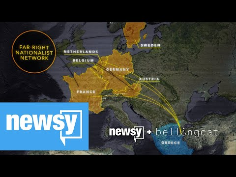
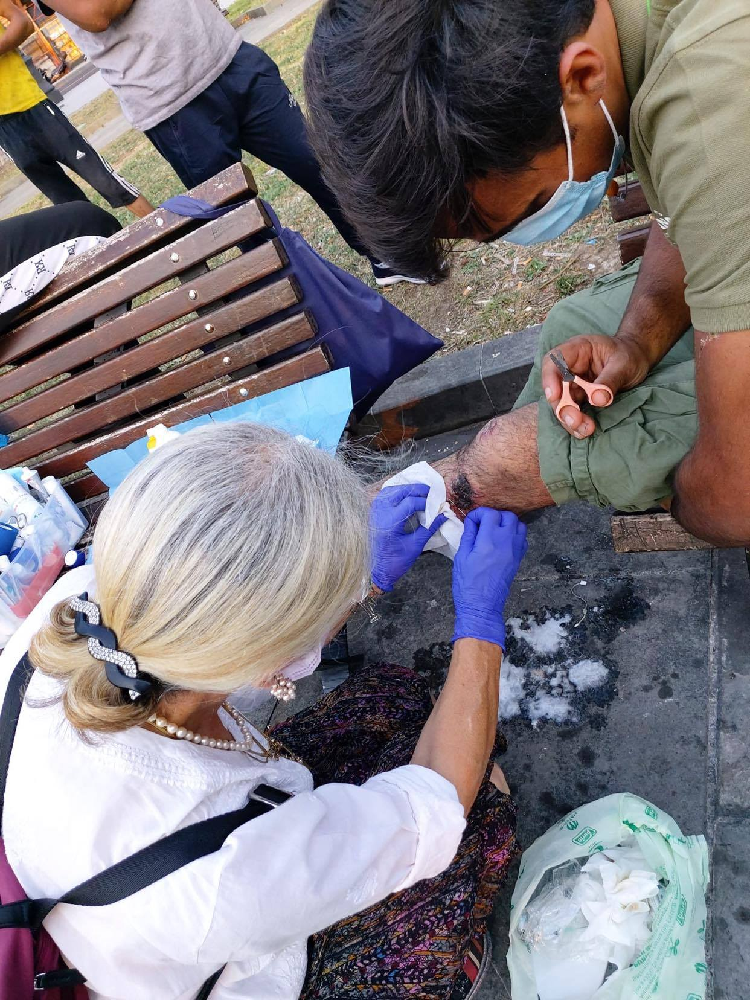

### AYS Daily Digest 15/09/20 Fire and COVID cases on Samos

_Updates on Moria // shipwreck off Libya // Germany to take in more people from all 5 islands // Lithuania refuses to take in people from Greece // new asylum suggestions in Sweden // and more…_

](assets/652d2ff59e3c/1*a7ls88xIY4FD9fI_PIqyvw.jpeg)

Photo by [Anne Derenne — Adenecartoon](https://www.facebook.com/Adenecartoon/posts/1712536902228780)
### Fire and COVID\-19 in Vathy camp on Samos

What happened to Moria could very well happen to any of the island camps\. AYS’s member on Samos provided this update on the fire that started on Tuesday around 20:10 and was “almost completely out” later in the night:

> “There have been no reports of any hospitalization\. It is unclear exactly who started the fire, but tensions in the camp have been very high since two confirmed COVID\-19 cases were announced today and the camp is in lockdown until 29 September\. The fire itself started at the edge of the “jungle” and spread up the hill, in part due to the wind direction, and away from where anyone lives\.” 

As for recent life in the camp, our member elaborates on the tensions:

> “People living in the camp are scared, frustrated and really worried for what might happen in the coming days; the threat of COVID\-19, potential for more fires, the terrible food they are subject to in the camp \(since now no one can leave to buy food\), and being completely trapped inside the camp\.” 

As [the first two COVID\-19 cases](https://www.samos24.gr/%ce%b4%cf%8d%ce%bf-%ce%b1%ce%b9%cf%84%ce%bf%cf%8d%ce%bd%cf%84%ce%b5%cf%82-%ce%ac%cf%83%cf%85%ce%bb%ce%bf-%ce%bc%ce%b5-%ce%ba%ce%bf%cf%81%cf%89%ce%bd%ce%bf%cf%8a%cf%8c-%cf%83%cf%84%ce%bf-%ce%ba%cf%85/?fbclid=IwAR3FQGgk9bMaQwAcG3wwfvM45PTZ4iP9hNeWy4twLElOpnx4N7dRrAZ947s) were confirmed on Tuesday inside Vathy, our member warns that there are rumors in the camp that this is a lie:

> “They \(the rumors\) are coming from a pretty general consensus/ belief that the Greek government and elements of Greek society want to lock these people away\. It feel like a matter of time before some awful incident occurs\. We just hope that everyone \(authorities, people & NGO workers\) keeps calm and can work something out together\. The awful camp food is a really big issue, and is one of the starting points of tension in the camp\.” 

#### SEA
### SHIPWRECK OFF LIBYAN COAST: 24 dead

Yet [another tragedy](https://www.gulftoday.ae/news/2020/09/15/boat-capsizes-near-libya-24-migrants-presumed-dead-un) , or just ‘effective migration management’ to the EU\. The 45 people who survived were returned to Libya by the Libyan coast guard\.

■■■■■■■■■■■■■■ 
> **[Alarm Phone](https://twitter.com/alarm_phone) @ Twitter Says:** 

> > 🔴Yesterday, people on 2 boats reached out to Alarm Phone, one carrying ~30, the other ~60 people. We alerted authorities and hoped for rescue but, in the end, both groups were forced back to #Libya. 

A third boat, which had not called us, capsized and 20 people are missing. 

> **Tweeted at [2020-09-15 14:19:07](https://twitter.com/alarm_phone/status/1305873788991672320).** 

■■■■■■■■■■■■■■ 

Also, four people have now died from the shipwreck near [Crete](https://www.ekathimerini.com/256977/article/ekathimerini/news/death-toll-from-migrant-smuggling-boat-wreck-off-crete-climbs-to-4?fbclid=IwAR0jPn1lq1Kpt_r-tQ2ju8hDObadtHxgLPhmXGzTCZH0hSK2GdqVLsFWNZg) , after authorities found another body on Tuesday\. Two of them were children, ages 6 and 7\. More may have died as well\.

These stories might be cause for more rescue operations but unfortunately, [Sea\-Watch’s Moonbird](https://www.arte.tv/de/videos/099640-000-A/seenotrettung-moonbird-bleibt-am-boden/) aircraft is barred from taking off\. It was previously operating off Lampedusa before its [operations were stopped](https://www.infomigrants.net/en/post/27157/italy-grounds-moonbird-plane-used-to-search-for-migrants-at-sea) by Italian authorities\.

Finally, [**Malta and Italy**](https://thecivilfleet.wordpress.com/2020/09/15/malta-and-italy-refuse-doctors-call-to-evacuate-pregnant-women-from-refugee-rescue-ship/?fbclid=IwAR0jPn1lq1Kpt_r-tQ2ju8hDObadtHxgLPhmXGzTCZH0hSK2GdqVLsFWNZg) **are both refusing to take in two pregnant women off the the Open Arms ship** , even after receiving orders from doctors\. A doctor from the medical charity Emergency warned that 9 people are in need of immediate hospital treatment\. Open Arms currently has 278 people on board, 56 of whom are unaccompanied minors\. Tuesday was their seventh day waiting to find a port\. [The Special Envoy](https://twitter.com/cochetel/status/1305888149789433857) of the UNHCR for the Central Mediterranean situation said:

> “2 of the 3 boats were rescued in Maltese SAR\. Malta received less sea arrivals this year so far than in 2019 \(minus 4%\) with 2161 arrivals in 2020\. Maritime obligations must be observed & solidarity should be effective with countries of disembarkation\.” 

#### GREECE
### UPDATES ON MORIA FIRE AFTERMATH

■■■■■■■■■■■■■■ 
> **[Franziska Grillmeier](https://twitter.com/f_grillmeier) @ Twitter Says:** 

> > Women protesting on top of a warehouse next to the street of LIDL &amp; Kara Tepe, where still 1000s are stranded after the #fire. 

One sign reads: “Its better to die for freedom when you spent the whole life &amp; day in prison.” 

#Lesvos #EU #Moria https://t.co/PA9uqSccgq 

> **Tweeted at [2020-09-14 20:56:11](https://twitter.com/f_grillmeier/status/1305611323309522944).** 

■■■■■■■■■■■■■■ 

**CONDITIONS FOR REFUGEES** : Currently 12,000 are still living on the streets and in makeshift camps\. Only 800 people were accepted into the new tent camp erected on a former shooting range for the military\. [Mare Liberum e\.V\.](https://twitter.com/teammareliberum/status/1305886705082421249) reported that “Over 12,000 are still refusing to go into the camp — demanding freedom\.” The Ministry of National Defense is also requiring the Ministry of Immigration and Asylum to pay a total [2\.9 million](https://www.stonisi.gr/post/11449/29-ekatommyria-gia-noikia-ston-kara-tepe-mexri-to-2025-sthn-kata-ta-alla-proswrinh-domh?fbclid=IwAR09kc16JxAq2hx4BK8Z136G7c6ArLYtFEBwfojBzb9-xZkTtrI1f1fTGVQ) euros for rent of this area until 2025 \(for a five year “temporary” camp\) \. Conditions for the [almost 13,000](https://www.infomigrants.net/en/post/27271/in-pictures-one-week-after-the-moria-blaze-homeless-migrants-face-squalid-conditions?fbclid=IwAR09kc16JxAq2hx4BK8Z136G7c6ArLYtFEBwfojBzb9-xZkTtrI1f1fTGVQ) people include:
- standing in line for hours for food donations
- very little access to running water \(some are “showering” in the sea\) \(some are getting fresh water from irrigation pipes\)
- garbage cans overflowing in areas where children play
- many are using bamboo poles and blankets to make their own tents
- [at least 25 people](https://www.europemustact.org/post/moria-fire-daily-update-15-09-20?fbclid=IwAR09kc16JxAq2hx4BK8Z136G7c6ArLYtFEBwfojBzb9-xZkTtrI1f1fTGVQ) have tested positive for COVID\-19 and are isolated\. [Moria White Helmets](https://www.facebook.com/MoriaWhiteHelmets/posts/185760656400335) is reminding everyone to wear a mask \(including journalists and NGO workers\) \. Despite this precaution, under these conditions COVID\-19 could spread very easily\.

](assets/652d2ff59e3c/1*dU0wjuONXlQsxsD_Y0Xg5Q.jpeg)

This is what civilization and has come to: homeless and foodless refugees are sleeping outside a Lidl grocery store packed with water, food, and supplies\. Photo by [Mehdi Chebil for InfoMigrants](https://www.infomigrants.net/en/post/27271/in-pictures-one-week-after-the-moria-blaze-homeless-migrants-face-squalid-conditions?fbclid=IwAR09kc16JxAq2hx4BK8Z136G7c6ArLYtFEBwfojBzb9-xZkTtrI1f1fTGVQ)

**GREEK GOVERNMENT PLANS:** What are [the government’s plans](https://www.ekathimerini.com/256922/article/ekathimerini/news/government-concerned-other-migrant-camps-may-follow-moria-suit?fbclid=IwAR09kc16JxAq2hx4BK8Z136G7c6ArLYtFEBwfojBzb9-xZkTtrI1f1fTGVQ) to address this tragedy?

The government does not want to evacuate everyone from Moria, for fear that it will spark outrage on the other islands\. They are continuing their plans for building a temporary camp that will house roughly 12,000 people, giving priorities to families with children\. They are also moving forward with a new reception and identification center \(RIC\) \(aka CLOSED CAMP\) where people will not be able to move in and out freely \(something many Greek residents want\) \.

■■■■■■■■■■■■■■ 
> **[RSA](https://twitter.com/rspaegean) @ Twitter Says:** 

> > Nothing more permanent than a temporary solution: Gov't proceeds with 5-yr rental of #Karatepe shooting range land where the temporary centre is located #refugeesgr #Lesvos https://t.co/a5uS0n8NsU 

> **Tweeted at [2020-09-15 16:55:50](https://twitter.com/rspaegean/status/1305913224437563393).** 

■■■■■■■■■■■■■■ 

[**6 MEN**](https://www.keeptalkinggreece.com/2020/09/15/moria-fires-arsonists-arrested/#.X2C9nhNa2hw.facebook) **WERE ARRESTED FOR ALLEDGEDLY STARTING THE FIRE:** But it is very IMPORTANT to state that no evidence has yet been put forward by the Greek police or authorities\. The narrative is extremely convenient for the Greek government, but as yet it can be considered with a [very critical lens](https://twitter.com/ninarei/status/1305902258563973122?fbclid=IwAR09kc16JxAq2hx4BK8Z136G7c6ArLYtFEBwfojBzb9-xZkTtrI1f1fTGVQ) \.

**UNHCR RESPONSE** : In a statement on Tuesday, [UNHCR](https://www.unhcr.org/news/briefing/2020/9/5f6073db4/unhcr-scales-immediate-shelter-support-moria-asylum-seekers-urges-long.html?fbclid=IwAR09kc16JxAq2hx4BK8Z136G7c6ArLYtFEBwfojBzb9-xZkTtrI1f1fTGVQ) put forward some of what it is currently doing, as well as its plans for stepping up support on Lesvos:
- “Assisting in the setup of this new temporary tented facility to accommodate those most at risk and providing technical advice and sharing expertise regarding site setup and planning\.”
- “Site planning and works are currently underway, including gravelling\. So far, UNHCR has provided 600 family tents, which are already accommodating some 700 as of yesterday evening\. We have also provided chemical toilets and handwashing stations and are ready to provide additional water, hygiene and sanitation support that may be required\.”
- “To prevent and mitigate the spread of COVID\-19, asylum seekers are undergoing rapid COVID\-19 testing, by the national health authorities, before entering the new facility\.”
- “Supporting the national health authorities in establishing a medical area in the new site, in accordance with WHO guidance, providing three tents, installing a Rubb hall and fencing to serve as isolation areas\. Already functional, 20 people confirmed with COVID are now quarantining in this isolation area\.”
- Providing a lot more food packages

**JOURNALISTS ARE BEING DENIED ACCESS** : [Europe Must Act](https://www.europemustact.org/post/moria-fire-daily-update-15-09-20?fbclid=IwAR09kc16JxAq2hx4BK8Z136G7c6ArLYtFEBwfojBzb9-xZkTtrI1f1fTGVQ) said that as of Tuesday morning “This morning, journalists were yet again denied access to the Kara Tepe road by police road blocks\. This lack of press freedom and access is concerning\. MSF and a few other NGOs were allowed through the police blockade but others were also denied access\.” [Here is a statement](https://twitter.com/AnnaKarastathi/status/1305803318392913921?fbclid=IwAR09kc16JxAq2hx4BK8Z136G7c6ArLYtFEBwfojBzb9-xZkTtrI1f1fTGVQ) from a journalist demanding freedom of the press on Lesvos\.

**THE FAR RIGHT ON LESVOS** : From [Europe Must Act](https://www.europemustact.org/post/moria-fire-daily-update-15-09-20?fbclid=IwAR09kc16JxAq2hx4BK8Z136G7c6ArLYtFEBwfojBzb9-xZkTtrI1f1fTGVQ) : “The Greek City Times is reporting an interview with German right wing activist Rebecca Somer just returned from Lesvos, claiming that fires were set by refugees assisted by German NGOs, presence of armed jihadists amongst the camp residents, refugees obstructing firefighters & being extremely aggressive towards the police\. This has been widely circulated on social media\.” Also check out this really important reporting on the far right networking coming to Lesvos from all over Europe \(particularly western Europe\):

**WAYS TO HELP** : Please support Menstrual hygiene for Lesvos — a project of Feminist Support Lesvos\. Their goal is to provide more menstrual hygiene products for those in need, especially considering the severe lack of access to running water and other hygiene needs/services right now\. Find out more [here](https://www.betterplace.org/en/projects/84301-menstrualhygiene-for-lesvos?fbclid=IwAR3FQGgk9bMaQwAcG3wwfvM45PTZ4iP9hNeWy4twLElOpnx4N7dRrAZ947s) \.

 : “Yesterday morning, the screams of a woman in labour paused time on \#Lesvos\. The screams, a reminder that pregnant women in need of medical treatment and attention are now displaced on the street\.
We were notified of the woman by our colleagues from Because We Carry\. 
Together, we helped as much as we could whilst waiting for an ambulance to arrive\. Our volunteer Thomas, who happens to be a fifth year medical student, checked the woman’s contractions while our other volunteer Caterina was holding her with Inger, a colleague from Because We Carry\. 
In the end, a baby was born yesterday and is in good health\!
They say the moment a baby is born, a mother is born too\. What if this can be a re\-birth, a beginning of a new safe and dignified life for the other 12,999 human beings?” Photo by Giorgios Moutafis](assets/652d2ff59e3c/1*dFzyXwDu9fZbJ30CRtah1g.png)

Message from [Movement on the Ground](https://www.facebook.com/movementontheground/posts/1825516910957946) : “Yesterday morning, the screams of a woman in labour paused time on \#Lesvos\. The screams, a reminder that pregnant women in need of medical treatment and attention are now displaced on the street\.
We were notified of the woman by our colleagues from Because We Carry\. 
Together, we helped as much as we could whilst waiting for an ambulance to arrive\. Our volunteer Thomas, who happens to be a fifth year medical student, checked the woman’s contractions while our other volunteer Caterina was holding her with Inger, a colleague from Because We Carry\. 
In the end, a baby was born yesterday and is in good health\!
They say the moment a baby is born, a mother is born too\. What if this can be a re\-birth, a beginning of a new safe and dignified life for the other 12,999 human beings?” Photo by Giorgios Moutafis

**PLEASE READ THIS FROM A PROMINENT LEGAL SCHOLAR:** [“At the End of Strength: Asylum policy after the fire in Moria, Europe is losing its conscience, writes legal scholar Dana Schmalz\.”](https://www.freitag.de/autoren/der-freitag/am-ende-der-kraft?fbclid=IwAR3Yjh3OyEvFqmA8QHB2RblvcLpDTqtHS_lgWweHm26nXBQTWfYwdmHwt9I)
#### ITALY
### 119 refugees arrived in Lampedusa: the camp is “full again”

AGI is reporting that _“Another five landings, for a total of 119 migrants, were registered in Lampedusa\. The first landing, of a small group of seventeen people, took place late in the evening at the Favarolo pier after the sighting of the patrol boats of the Guardia di Finanza and the Coast Guard\. During the night, then, there were four other landings with a minimum of 15 and a maximum of 58 migrants\. All have been taken to the hotspot, where there are currently over 250 people with a maximum capacity of 192 guests\.”_ More [here](https://www.agi.it/cronaca/news/2020-09-14/lampedusa-119-sbarchi-hotspot-pieno-9652832/?fbclid=IwAR29ZS5AatsNuup-ceAiCIPHg0BP5uiBqmjblNARfbiclUVBFsnSQ24DrFQ) \.

[The Mayor of Castel Volturno](https://www.infomigrants.net/en/post/27292/castel-volturno-mayor-says-migrant-situation-is-unmanageable?fbclid=IwAR29ZS5AatsNuup-ceAiCIPHg0BP5uiBqmjblNARfbiclUVBFsnSQ24DrFQ) , a southern Italian municipality near Caserta, is saying that the population of refugees and migrants in their small town is now “unmanageable\.” They have about 23,000 refugees and migrants\. He is saying that after the lockdown measures to contain COVID\-19, the population grew substantially\. He is asking for the state to intervene\.

On Monday, 5 people were handed over to the Slovenian authorities after crossing into Italy\. The police presence and procedures for catching people on the move entering from the Balkan route are increasing\. More [here](https://messaggeroveneto.gelocal.it/udine/cronaca/2020/09/14/news/esercito-e-migranti-1.39305419?fbclid=IwAR29ZS5AatsNuup-ceAiCIPHg0BP5uiBqmjblNARfbiclUVBFsnSQ24DrFQ) \.
#### BALKANS

![“\#BalkanRouteEurope Trieste September 15th Linea d’Ombra ODV
Afghans, small and large, minors and older, many injured, the first thing they ask you is: ′′ mom, food please mom “\. They drank the mud of water, they didn’t eat for 4 or 5 days , are cooled by cold nights in the woods\. Almost no one wants to stay, they’ll leave tomorrow\. At night forwarded, after Goga and Marianna’s food and wound care, we manage to give the shoes and the minimum clothes to take the earth off\. Turning your back on the square of the world to return home is the hardest gesture to do\.” Photo by [Lorena Fornasir](https://www.facebook.com/lorena.fornasir/posts/3250043401779401)](assets/652d2ff59e3c/1*H2GsPe5xtyxsdc_7bfXiNA.jpeg)

“\#BalkanRouteEurope Trieste September 15th Linea d’Ombra ODV
Afghans, small and large, minors and older, many injured, the first thing they ask you is: ′′ mom, food please mom “\. They drank the mud of water, they didn’t eat for 4 or 5 days , are cooled by cold nights in the woods\. Almost no one wants to stay, they’ll leave tomorrow\. At night forwarded, after Goga and Marianna’s food and wound care, we manage to give the shoes and the minimum clothes to take the earth off\. Turning your back on the square of the world to return home is the hardest gesture to do\.” Photo by [Lorena Fornasir](https://www.facebook.com/lorena.fornasir/posts/3250043401779401)

![“POSTCARD TO EU FROM THE BORDER: Velika Kladuša
For five days in a row, four families from Afghanistan, including a pregnant woman who is in eight months, a nine\-Month\-old baby and seven young children, sleep in front of camp miral\. Last night, the locals found an abandoned house where they provided them with such a shelter, only that they were not under the open sky\. Food and basics are brought to them by organizations that dare to do so\. Some time ago the usk authorities made a decision \(not the law\) to prevent the share of aid\. Such a decision is not in line with the existing laws, however the police and institutions, using various methods, from fear to punishment of helpers, and does everything to prevent anyone who wants to help\. Also, the fine police violence that has become everyday in this part of bih is sending a scary message to citizens and citizens of Bosnia and Herzegovina, and many are trying to help, at least public\.” Photo by [Transbalkanska solidarnost](https://www.facebook.com/groups/144469886266984/permalink/637040770343224/)](assets/652d2ff59e3c/1*aaXfqkLgpbPImkZs5iKZSA.jpeg)

“POSTCARD TO EU FROM THE BORDER: Velika Kladuša
For five days in a row, four families from Afghanistan, including a pregnant woman who is in eight months, a nine\-Month\-old baby and seven young children, sleep in front of camp miral\. Last night, the locals found an abandoned house where they provided them with such a shelter, only that they were not under the open sky\. Food and basics are brought to them by organizations that dare to do so\. Some time ago the usk authorities made a decision \(not the law\) to prevent the share of aid\. Such a decision is not in line with the existing laws, however the police and institutions, using various methods, from fear to punishment of helpers, and does everything to prevent anyone who wants to help\. Also, the fine police violence that has become everyday in this part of bih is sending a scary message to citizens and citizens of Bosnia and Herzegovina, and many are trying to help, at least public\.” Photo by [Transbalkanska solidarnost](https://www.facebook.com/groups/144469886266984/permalink/637040770343224/)
#### GERMANY

■■■■■■■■■■■■■■ 
> **[Giorgos Christides](https://twitter.com/g_christides) @ Twitter Says:** 

> > A group of 109 children asylum seekers have departed from Greek Hotspot islands for relocation to Germany today. They are children with serious health problems, along with members of their nuclear family: Greece Migration Ministry 

> **Tweeted at [2020-09-15 12:26:03](https://twitter.com/g_christides/status/1305845333373734913).** 

■■■■■■■■■■■■■■ 

### Spiegel is reporting that the German government will take in 1,553 additional refugees from the 5 Greek islands

> “ [The Union and the SPD have agreed on this](https://www.spiegel.de/politik/deutschland/moria-bundesregierung-will-1553-fluechtlinge-aus-griechenland-aufnehmen-a-848ab100-e4e9-4100-b389-77f890f37a3b?fbclid=IwAR29ZS5AatsNuup-ceAiCIPHg0BP5uiBqmjblNARfbiclUVBFsnSQ24DrFQ) , as Vice Chancellor Olaf Scholz \(SPD\) announced in Berlin\. These are 408 families with children who have already been recognized in Greece as in need of protection\. 

> This should be the second step after Federal Interior Minister Horst Seehofer \(CSU\) announced on Friday that Germany would accept up to 150 young people from a total of 400 unaccompanied minors\. The 400 minors are to be distributed to European countries\. In a third step, more people should be admitted if there are agreements with other European countries\. The SPD had called for the inclusion of a significant proportion of those affected\. 

> 53 unaccompanied underage asylum seekers have already been admitted, according to a press release from the federal government\. The admission of 243 children in need of treatment and their core families is already being implemented\. This is likely to affect at least 1,000 people, of whom more than 500 are already in Germany\. The total number of people that Germany is taking over from the Greek islands is accordingly around 2,750\.” 

#### FRANCE

The Kurdish activist Mehmet Yalçin, a refugee in Bordeaux, has been refused asylum\. On Tuesday morning he was arrested, sent to Paris, and will be returned to Turkey which many warn is “synonymous with a death sentence\.” There was a rally to support him at the Bordeaux airport\. More [here](https://rue89bordeaux.com/2020/09/refugie-a-bordeaux-un-militant-kurde-sur-le-point-detre-livre-a-erdogan/?fbclid=IwAR29ZS5AatsNuup-ceAiCIPHg0BP5uiBqmjblNARfbiclUVBFsnSQ24DrFQ) \.
#### NETHERLANDS

[Local news](https://www.dutchnews.nl/news/2020/09/measures-to-discourage-asylum-seekers-from-safe-countries-draw-mixed-reactions/?fbclid=IwAR0jPn1lq1Kpt_r-tQ2ju8hDObadtHxgLPhmXGzTCZH0hSK2GdqVLsFWNZg) is reporting on new asylum assistance measures:

> “Plans to discourage asylum seekers from safe countries from coming to the Netherlands will only force them into the illegal circuit and could hurt people who really need asylum, critics have said\. The new measures are aimed at asylum seekers from countries such as Morocco and Algeria, who stand little chance of getting a residence permit, and who are putting too much pressure on the system\.” 

#### LITHUANIA

[The Interior Minister](https://www.lrt.lt/en/news-in-english/19/1231494/lithuania-refuses-to-accept-refugees-from-greece-saying-it-is-focused-on-belarus?fbclid=IwAR0jPn1lq1Kpt_r-tQ2ju8hDObadtHxgLPhmXGzTCZH0hSK2GdqVLsFWNZg) said on Monday that Lithuania won’t accept any refugees from Greece, because they are focusing on people fleeing from neighboring Belarus:

> “Lithuania was approached \[about accommodating refugees from the Greek camp\], but at the moment we are focused on Belarus and are putting maximum effort into helping citizens from the neighboring country to come to Lithuania on a humanitarian basis\. Therefore, we decided that we cannot accept people from other countries at the moment\.” 

#### SWEDEN

On Tuesday the “migration committee” handed over their suggestion of a new, long term migration policy to the minister of migration\. The committee, consisting of politicians from all of the parties in the parliament, failed to agree — instead they voted\. Which means that some suggestions are supported by some parties etc\. It is important to note: they are still suggestions, and it’s expected that the debate will continue\. But this is the “final” suggestion from the committee to the government\.

The Swedish Refugee Law Center had some thoughts about the suggestions:

> “Temporary residence permits continue to be the main rule\. Broadly speaking, the proposal is an extension of the restrictions that followed from the temporary law, but there are some reliefs\. Temporary residence permits are also proposed to continue to be the main rule in Sweden\. Refugees receive a three\-year permit and alternatively those in need of protection receive 13 months, both permits can be extended\. People who come as quota refugees through the UNHCR’s quota refugee program receive permanent residence permits\. The category other in need of protection is removed\. 

> One of the questions that has been big during the spring is whether Sweden should have a humanitarian basis\. If the proposals go through, Sweden will once again grant residence permits for particularly painful circumstances with certain relief in matters concerning children\.” 

Read their whole critic and thoughts [here](https://sweref.org/forslagen-till-ny-migrationspolitik-miniminiva-ar-det-nya-normala/?fbclid=IwAR29ZS5AatsNuup-ceAiCIPHg0BP5uiBqmjblNARfbiclUVBFsnSQ24DrFQ) \.
#### IRELAND

[The Irish Examiner](https://www.irishexaminer.com/news/arid-40049435.html?fbclid=IwAR29ZS5AatsNuup-ceAiCIPHg0BP5uiBqmjblNARfbiclUVBFsnSQ24DrFQ) is reporting that Ireland is considering taking in more children from Greece:

> “Children’s minister Roderic O’Gorman is giving “urgent consideration” to taking in unaccompanied children left stranded by fires that destroyed a massive refugee camp in Greece last week\. In a meeting between the minister met and UNHCR Ireland, the issue was raised and, after, its Head of Office Enda O’Neill urged Ireland to meet its commitments to relocate unaccompanied children\. Mr O’Neill pointed out that Ireland committed two years ago to take in 36 unaccompanied minors from Greece, but that only eight had arrived to date\.” 

#### UK

](assets/652d2ff59e3c/1*t81jOsPqS4Wywa4l5K5uZw.jpeg)

One of Care4Calias volunteers who organized a drive “We’ve raised almost £1,200 and my living room is quickly filling up with bags of good\-quality, clean, sensible clothes\. At a time when the far right is making so much unpleasant noise, friends and neighbours have been only too happy to be able to contribute to something positive\.” To join one of the Care4Calais local groups in the UK please email annie@care4calais\.org Photo by [Care4Calias](https://www.facebook.com/care4calais/posts/3640232492676348)

The Guardian is reporting that _“ **the government is planning to “opt out” of parts of the European convention on human rights in order to speed up deportations of asylum seekers** and protect British troops serving overseas from legal action\. The proposals are being coordinated by Downing Street aides\. They are intended to rule out claims in areas where judges have supposedly “overreached” their powers\. The restrictions, according to the Sunday Telegraph, could pre­vent mi­grants and asylum seek­ers from us­ing the leg­is­la­tion to avoid being removed from the UK and to shield Bri­tish sol­diers against claims following over­seas op­er­a­tions\.”_ Learn more [here](https://www.theguardian.com/law/2020/sep/13/uk-government-plans-to-remove-key-human-rights-protections?fbclid=IwAR2RghD6u-Icn5KmO9TSPOGe9p59vz5VqUfjRw9n1YD-hx3GFbcg9JPynUM) \.
#### GENERAL

](assets/652d2ff59e3c/1*36ylf2bSYa_yCNe5AoI8aQ.jpeg)

Check out this protest\! Photo by [Europe Must Act](https://www.facebook.com/europemustact/posts/173557690923600)

**Find daily updates and special reports on our Medium page\.** 
**If you wish to contribute, either by writing a report or a story, or by joining the info gathering team, please let us know\.** 
**We strive to echo correct news from the ground through collaboration and fairness\. Every effort has been made to credit organisations and individuals with regard to the supply of information, video, and photo material \(in cases where the source wanted to be accredited\) \. Please notify us regarding corrections\.** 
**If there’s anything you want to share or comment, contact us through Facebook, Twitter or write to: [areyousyrious@gmail\.com](mailto:areyousyrious@gmail.com)**

_Converted [Medium Post](https://medium.com/are-you-syrious/ays-daily-digest-15-09-20-fire-and-covid-cases-on-samos-652d2ff59e3c) by [ZMediumToMarkdown](https://github.com/ZhgChgLi/ZMediumToMarkdown)._
