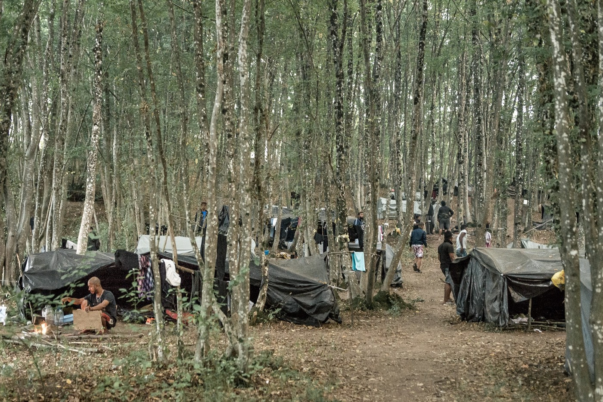

### AYS Daily Digest 17/09/20: 13 years old, forced naked and beaten by Greek police — the inhumane treatment of refugees

Lockdown in Nea Kavala refugee camp // Testimonies from people facing deportation in Spain // Ireland criticised for only taking 4 children from Lesvos // 70 people jump overboard while waiting to disembark // and more
### Feature

[In Samos, on September 2nd](https://www.efsyn.gr/ellada/koinonia/260119_xylo-horis-aitia-se-dyo-prosfygopoyla) , the Hellenic Police beat and stripped naked two children aged 13 and 15 because they thought the children had stolen a bicycle\.

The two children ended up in hospital after they were handcuffed, beaten, humiliated, stripped naked, and insulted — all because the police believed they had stolen a bike\.

On the day in question, the 15 year old, who Efsyn reports has been living with his parents and three brothers on the island for 17 months, was riding his bicycle with his friend to the city centre\. The young boys approached an ATM where they were going to withdraw money, but a woman unknown to him stopped him, shouting at him in English that the bike he was riding was hers and that he had stolen it\. The little boy attempted to explain that the bicycle had been donated by an NGO, but the woman insulted him and called the police\.

“Four police officers came with a patrol car\. They did not even listen to us; we were trying to explain…The two started hitting us, me more because I was closer”, [the 15\-year\-old explained recalling his experience with the police](https://www.efsyn.gr/ellada/koinonia/260119_xylo-horis-aitia-se-dyo-prosfygopoyla) \.

The police handcuffed the children, who recalled that even after being handcuffed, they were still attacked\. “They punched me in the head and back and pushed us into the car\. “Both the co\-driver and the one sitting next to us in the back seat were beating us”\. As the police spoke Greek to each other, the children could not understand why they were being arrested and assaulted — or what their fate might be\.

“When we arrived at the department, there were five police officers\. They emptied my bag\. They hit us again\. They first put my friend in a room that looked like a warehouse\. Then they put me\. I was asked to undress completely\. Then they took the data from us\. They did not let us talk to explain”, [the 15\-year\-old recalls](https://www.efsyn.gr/ellada/koinonia/260119_xylo-horis-aitia-se-dyo-prosfygopoyla) \. After being beaten and abused, the terrified child was expelled from the police station without any record of the incident\. The police have not provided a reason as to why the children were forcibly arrested, detained and stripped naked\.

 \)](assets/a27b93e6a2a7/1*v22ScupXZZK3f-Yr_qddeQ.jpeg)

The medical certificate given to the two minors\. Photo Credit: \( [Efstn\.gr](https://www.efsyn.gr/ellada/koinonia/260119_xylo-horis-aitia-se-dyo-prosfygopoyla) \)

The father of one of the children was restricted from seeing his child during this ordeal and was not provided with an explanation for the arrest\. The parents took the children to the hospital, where they had their injuries examined and confirmed\. The parents are also awaiting the results from an examination by a psychologist\.

The disgusting police abuse — which may even amount to further crimes under international human rights law because of the cruel and debasing nature of the treatment — left one child with injuries to his left shoulder and arm\. Again it should be reaffirmed that this horrific abuse by the police occurred because two children aged 13 and 15 were suspected of stealing a bike that was provided to them by an NGO\.
### Moria

[Aegean Boat Report](https://www.facebook.com/AegeanBoatReport/posts/923015078221597) has shared a video demonstrating the unprecedented scale of the new “temporary” camp in Kara Tepe, Lesvos\. Once finished, this camp will be like ‘nothing we have ever seen before in Europe” and will have the capacity to house 12,000 people, according to the Greek government\.

Humanitarian assistance organisations have already raised concerns about the quality of the ‘“temporary” camp\. Most of the tents have been placed directly on the ground without any palates underneath, which means that if and when it starts to rain, water and mud will be a huge problem in the camp\.

While from the air the new camp may look adequate, in reality, people are being placed in a camp with “no running water \(one bottle of water for two people\), just a few filthy toilets, in tents without flooring in an ex\-military shooting range\.”

Furthermore, [eight legal groups](https://www.efsyn.gr/node/260218) have raised concerns over the resumption of asylum procedures in Kara Tepe, arguing that the remote interviews that this requires will jeopardize fundamental guarantees of the asylum process\.

Next Monday, the system of remote interviews for applicants who have settled in the new structure of Kara Tepe will be implemented, yet eight organizations who are providing legal assistance on the island have stated that “the access of legal assistants and lawyers to the structure has not been guaranteed”\.

In a letter to the authorities, they question whether the preferred interviewing system ensures the confidentiality of such a serious process and the protection of the interviewees’ “personal data”\. They have also emphasised that asylum procedures on the island must operate “in such a way as to ensure that asylum seekers can exercise their legal rights and to meet their obligations under the law”\.

The announcement is co\-signed by the organizations Diotima, European Lawyers in Lesvos, Hellenic Refugee Council, FENIX Humanitarian Legal Aid, HIAS Greece, Legal Center Lesvos, PRAKSIS and Refugee Support in the Aegean\.
### UK

[The Guardian has exclusively reported](https://www.theguardian.com/politics/2020/sep/17/uk-awards-border-contract-to-firm-criticised-over-role-in-us-deportations?fbclid=IwAR3McckYbGc--n8YIF6D3g7ntskytVkqx8Ddhg-_4X7R2UEk7AUe53h0iV4) that the British government has awarded oversight of the UK’s post\-Brexit border and customs data to Palantir, an American tech firm notorious for assisting the Trump administration’s push to deport migrants from the US\. According to a Cabinet Office document seen by the Guardian, “ _Services are being procured from Palantir, a leader in data analytics, to provide the data infrastructure and analytics capabilities to support the development of a border flow tool”_ \. According to this document, the UK’s new “border flow tool” is set to collate data on the transit of goods and customs from 31 December\.

Palantir has courted controversy in the past\. The organisation has been publicly criticized due to its ongoing partnership with Immigration and Customs Enforcement \(ICE\) \. The organization has also attracted attention due to the activities of its co\-founder Peter Thiel, a vocal supporter of Trump, who once wrote: [“I no longer believe that freedom and democracy are compatible”\.](https://www.cato-unbound.org/2009/04/13/peter-thiel/education-libertarian)

During an evidence session with the Home Affairs Select Committee on Wednesday, [Charities and NGOs warned that child refugees in northern France](https://www.independent.co.uk/news/uk/home-news/child-refugees-france-smugglers-relatives-uk-boat-crossing-delays-b452894.html) who have relatives in the UK are being pushed into the hands of people smugglers and trafficking gangs due to delays in the process of joining their families through legal mechanisms\.

During the meeting, MPs were told that “consistent delays” in transferring children to the UK legally were driving minors to seek “quicker and alternative” routes to the UK, notably boat crossings, which place them at risk of exploitation\.

_“The delays, the pressure in the system and the complete halt of the procedures during Covid has had a huge impact on those with a legal right to come to the UK\. It’s pushed them further into the hands of smugglers”_ [said Beth Gardiner\-Smith, chief executive of Safe Passage](https://www.independent.co.uk/news/uk/home-news/child-refugees-france-smugglers-relatives-uk-boat-crossing-delays-b452894.html) \. Ms Gardiner\-Smith later described the “tragic case” of the teenager with a brother in the UK who started the family reunion process in February, but for whom “everything ground to a halt” due to the pandemic, leading him to give up\.

Speaking to the Committee, Maddy Allen, field manager at Help Refugees, also stated that children attempting to cross via unauthorised routes were at significant risk of exploitation\. _“Often children are ending up in situations of debt bondage, whereby they are making the journey across to the UK, and therefore having to work in exploitative and illegal conditions once in the UK to pay back the money for that journey,”_ [she said\.](https://www.independent.co.uk/news/uk/home-news/child-refugees-france-smugglers-relatives-uk-boat-crossing-delays-b452894.html)
### Sea

[Sea\-Watch published a statement](https://www.facebook.com/seawatchprojekt/photos/a.1579563625595046/2643528639198534/) on their Facebook page explaining that the Sea\-Watch 3 is on her way to the shipyard in Burriana\. They have been granted a single voyage permit to transfer the ship from Porto Empedocle to their shipyard harbour in Spain\. However, it is still blocked by the Italian authorities\. They are afraid that this will also happen to Sea\-Watch 4, which is still anchored off Palermo\.

This systematic criminalization must stop, and all civilian rescue ships must return to the Central Mediterranean as soon as possible\!

](assets/a27b93e6a2a7/1*LQ0hfSu7dTXIO22fXK-ZtA.jpeg)

Baptiste Brebel\. Photo Credit [\(Sea\-Watch\)](https://www.facebook.com/seawatchprojekt/photos/a.1579563625595046/2643528639198534/)

“After repeated [\#Malta](https://twitter.com/hashtag/Malta?src=hashtag_click) refusals and [\#Italia](https://twitter.com/hashtag/Italia?src=hashtag_click) reporting the situation of maximum vulnerability of some rescued people, more than 70 people jumped into the water off Palermo while we awaited instructions for disembarkation\. Some countries pervert agreements and human rights\.”

Unfortunately, Malta’s frequent refusal to allow disembarkation of refugees and migrants rescued at sea, either by search and rescue vessels or commercial fleets who have followed their legally mandated duty to rescue boats in distress, is leading more and more people to desperation while facing week\-long delays\.

■■■■■■■■■■■■■■ 
> **[Oscar Camps](https://twitter.com/campsoscar) @ Twitter Says:** 

> > Después de reiteradas negativas #Malta y de informar #Italia de la situación de máxima vulnerabilidad de algunas personas rescatadas, más de 70 personas se lanzaron al agua en Palermo mientras esperamos instrucciones para el desembarco. Algunos países pervierten convenios y DDHH. https://t.co/21TychNOaC 

> **Tweeted at [2020-09-17 10:35:53](https://twitter.com/campsoscar/status/1306542385871097856).** 

■■■■■■■■■■■■■■ 

### Iceland

Rósa Björk Brynjólfsdóttir, an MP for the Leftist\-Green Party, has resigned from the parliamentary party, citing the government’s unwillingness to intervene to prevent the deportation of a family of six, including four young children\.

[Grapevine\.is reporting that Rósa Björk says](https://grapevine.is/news/2020/09/17/left-green-mp-resigns-from-party-over-governments-handling-of-refugee-family-case/?fbclid=IwAR0pAKxpH3zBp5wd7Jdkv3oW5Mh9gxEsUZpGvcq3xYs3nz8YobO48n780xs) she saw no other choice than to leave the party _“and take a position against the Icelandic government deporting children and families with children\. In the three years that the Leftist\-Greens have been in the government, little to nothing has been done to create a new policy regarding immigrants and asylum seekers, or to follow the human rights platform of the party, which the government nonetheless promised\. I am very disappointed\.”_

The case in question is a family of six who fled Egypt and sought asylum in Iceland\. The father was persecuted in Egypt due to his political activities; namely, for supporting former Egyptian president Mohammed Morsi\. It’s reported that he had survived a knife attack and an attempted kidnapping before the family left Egypt\. The family, which includes four young children, have lived in Iceland for over two years now\. Despite all this, the Directorate of Immigration denied their application in July 2019\.

Speaking on the Directorate’s decision to refuse the application for asylum that was filed on humanitarian grounds in 2018, the family’s lawyer, Magnús Davíð Norðdahl, told [Vísir](https://www.visir.is/g/20202009446d/-ologlegt-sidferdilega-rangt-og-omannudlegt-) : “ _We completely disagree \[with the Directorate’s decision\] \. \[The parents\] are terrified of being sent back to Egypt, and that they will be arrested\. They won’t be able to care for their children while they’re in prison\.”_

Grapevine\.is reports that the family in question, whose [whereabouts are now unknown](https://grapevine.is/news/2020/09/16/family-not-deported-location-unknown/) , are technically protected from deportation due to the Convention on the Rights of the Child, which Iceland encoded into law years ago\.
### Spain

[Detained voices](https://detainedvoices.com/2020/09/17/i-am-still-scared-because-i-dont-know-what-is-going-to-happen-next/?fbclid=IwAR2mDmq-aXzXkEXHriGFhk2bKjFxVd9vifbmYNjdZfPViYbseqKdDKH58X4) has published a new statement from someone due to be deported to Spain on 17\.09\.20, testifying to the terrifying experience of deportation:

> When we first came via the channel, they took us to a hotel\. We were in the hotel for about a month, and they said we had to sign papers\. While we were in the hotel and still signing the papers, that’s when they came and got us\. 

> On the 22nd of August, that’s when they brought me to Brook House\. On the 14th of September, I tried to commit suicide before my ticket\. They didn’t take me to the hospital; they just kept me at Brook House and gave me medicine\. I spoke to my lawyer, but I didn’t tell her that I tried to commit suicide\. Because at that point she told me that the ticket had been cancelled\. She said yesterday that she was going to call me to talk about my case, but she still hasn’t called me\. 

> **_How do you feel about the cancellation of the flight?_** 
 

> I am still scared because I don’t know what is going to happen next\. Others have been released, and I have not been given an address so I am still scared\. I have an address to go to but I just need to be released\. 

> **_What are conditions like in Brook House now?_** 
 

> It’s a mix, some people are getting released and some people are waiting to hear\.
 

> I just want to get out\. I have a lot of anxiety and mental health issues\. 

> **_What are conditions like in Brook House now?_** 
 

> It’s a mix, some people are getting released and some people are waiting to hear\.
 

> I just want to get out\. I have a lot of anxiety and mental health issues\. 

### Bosnia and Herzegovina

](assets/a27b93e6a2a7/1*dLq8BS5immQfONF_V3L4pg.jpeg)

Photo Credit: [No Name Kitchen](https://www.facebook.com/NoNameKitchenBelgrade/posts/1074567662941517)

“My wife and I have been in front of Miral camp for four days\. The Croatian police took all our belongings, money and clothes included\. My wife hasn’t had a bath for six days\. There are seven families \-some with babies\- with us, all in the same situation\. Two women are pregnant, and we haven’t been able to eat today”\.

This is a message the team of [No Name Kitchen in Velika Kladuša received](https://www.facebook.com/NoNameKitchenBelgrade/posts/1074567662941517) some days ago\. NNK has been helping families in the area for weeks\.

A few hours after receiving this message, the team brought tents, blankets and clean clothes to those families\. It was already dark, and three of the families said that they did not want to set up their tents because they feared of being spotted by the police and expelled from the site \(they were in a meadow in front of the official camp\) \.
### **Greece**

The lockdown in the Nea Kavala refugee camp continues and, for the moment, is established until September 25th\. [The Open Cultural Centre are reporting](https://www.facebook.com/OpenCulturalCenter/photos/a.1304076196287462/3901472669881122/) that after a week of quarantine, residents are complaining about the worsening of basic conditions\. The guards only allow one person for every three containers to go to the nearest supermarket, which significantly limits the entry of food and basic products to the camp\.

Most tents and containers do not have water or a kitchen, which means that residents have to queue for long hours to access the shared facilities without being able to respect security measures like social distancing\. Health care has also worsened: there is only one doctor in the morning to attend to the 1,600 people who live in the camp, and those who must be transferred to the hospital must now pay €20\. Fines of €150 have been applied to people who did not wear their mask properly\. Surveillance and entry restrictions have been imposed more strongly\. And the tension between the inhabitants is increasing\.

 \)](assets/a27b93e6a2a7/1*w9sZ6ZtTZ73e77ACJJmv7A.jpeg)

Nea Kavala Camp at night\. Photo Credit \( [Open Cultural Center — OCC](https://www.facebook.com/OpenCulturalCenter/?__cft__[0]=AZXXllCd5mdJRHUNdbpq7SAm-_wDDbhOGYjdOo-f74FajqPLXEADGlpmlZD5zC_rmjc5UTYYHaluLIGVvIxJCifA4Nz-EZmo_ew-TrNq7FxvKB3vyKwezoMxBv331qae8uQKCTsWW-eOoWesRbY2E0-v2_dcDtXwj6umhZYdysLH2A&__tn__=-UC*F) \)

[Mobile Info Team](https://www.facebook.com/mobileinfoteam/posts/2867922440103133) has published new information that the Ministry of Migration and Asylum is planning to automatically extend all white cards\. **They report that the white cards are prolonged according to the last number of your case number\. You can find your case number on your white card\. It is a 5 or 6 digit number\.**

The Asylum Service will give appointments on specific dates and times when you can come to renew your white card\. Your appointment to renew your white card will be published on the website of the Ministry of Migration and Asylum\. Information about individual appointments is not yet available\. The Mobile Info Team will inform you as soon as the information is published online\.

Attention: If you are in Lesvos, then the date of validity of your white card does not depend on your case number\! The validity of all white cards, where the Regional Asylum Office of Lesvos is responsible for the renewal, is extended until January 14, 2021\.

To read more and find the full explanation of the dates of extension, please see the link to the [Mobile Info Team post](https://www.facebook.com/mobileinfoteam/posts/2867922440103133) \.
### Austria

[The Association of Visual Artists Vienna Secession](https://www.facebook.com/SecessionWien/posts/10157790655118315) have hung a banner above the entrance to the Secession: a sign of solidarity with all people seeking refuge and protection, in Moria and elsewhere\. In a public statement released on their Facebook page, they state that they “wish to harness the prominent visibility of our gallery building to draw attention to the undiminished urgency of this concern\. As artists and citizens, we feel the need to take a clear stand on the issue and express our commitment to treating refugees humanely and with compassion\.”

In their public statement, they seek to appeal to the governments of Austria and the member states of the EU to live up to their international responsibility, both by offering aid to those affected by the current emergency in Moria and by working toward sustainable solutions to ensure the humane and dignified treatment of refugees\.

 \)](assets/a27b93e6a2a7/1*g8D93jjwC0TEWfzDfyTRvA.jpeg)

The Secession Building with a ‘Moria’ banner\. Photo Credit \( [Vienna Secession](https://www.facebook.com/SecessionWien/?__tn__=-UC*F) \)
### Ireland

[Ireland is to take four unaccompanied minors](https://www.rte.ie/news/world/2020/0917/1165688-greece-migrant-camp/#:~:text=Ireland%20to%20take%20four%20unaccompanied%20minors%20from%20Moria%20camp&text=Ireland%20is%20to%20take%20four,the%20Greek%20island%20of%20Lesbos.&text=%22The%20fire%20compounded%20the%20incredibly,so%20many%20people%20are%20living.%22) left homeless following the fire which destroyed large parts of the Moria camp on the Greek island of Lesvos\. The Irish Minister for Children Roderic O’Gorman made the announcement following what he explained was active engagement with Tusla, the Department of Justice, and the Department of Foreign Affairs\.

In a statement he said: “Last week, we witnessed the shocking scene of a fire destroying large sections of the Moria migrant camp in Lesvos… I have therefore asked that arrangements be made with Tusla to accelerate the arrival of 4 more unaccompanied children in the coming weeks\.”

Ireland’s announcement that it will accept 0\.1% of the 4,000 children from Lesvos has drawn some criticism\. Isabel Simpson, Executive Director of MSF Ireland, said: “While any commitment to resettle unaccompanied children and teenagers who have been through unimaginable trauma is welcome, it has to be noted that around 4,000 minors affected by the fire remain in insecure and unsafe conditions\.”

■■■■■■■■■■■■■■ 
> **[Jennifer Whitmore TD](https://twitter.com/WhitmoreJen) @ Twitter Says:** 

> > The Taoiseach has just confirmed in the Dail to me that Ireland is currently in discussions to take 4 (yep 4!) unaccompanied minors from Lesbos. This is a wholly inadequate response to this crisis and Ireland needs to take its responsibility seriously. 

> **Tweeted at [2020-09-15 13:59:48](https://twitter.com/whitmorejen/status/1305868926853799940).** 

■■■■■■■■■■■■■■ 

### Events

**Protests:** Moria fire demonstrations
Europe Must Act is holding public protests in cities across Europe between the 17th — 26th September\.
On their call to action, they write “ _The time has come — people all over Europe are organizing demonstrations to shine a light on the devastating consequences of the migration policies in Europe\. Join the demonstration wave and help to amplify the voices of those that need to be heard”_

**Webinar** : Spotlight on hostspots and the new EU Migration Pact 
On Wednesday, 23 September 2020, 17:00 CET, the German Law Journal will host a webinar on the New EU Migration Pact\.

**Lecture:** consequences of deterrence as migration control
On Thursday next week, Professor Michael Collyer from the University of Sussex will give a lecture on the history and consequences of deterrence as migration control\. This lecture is organised by the Swiss NCCR\-on the move and Lisa Marie Borelli from the [Université de Neuchâtel](https://www.facebook.com/UniNeuchatel/?__cft__[0]=AZXJHrYPifPNFqW2msrrVlXeSUStoC4Bz18a3VvMcxa8Nvhkr0fMa_AZUhmXHklhjxCS43pvGmBancPKYJ9lzX9yHWcEULNRWPwYIYA2SZo44exZ8dvxzGlwNfoFsqSAucDmwnr7ZCtoJH7NFOmycmcGY0f93wkKN-IjyJsq5sb0KA&__tn__=kK-R) will act as a discussant\. The lecture will be accessible online on the following [**YouTube channel**](https://www.youtube.com/channel/UCxWqqEvz7iXC29yZJiHaxQQ) on Thursday, 24 September 2020, 17\.15–18\.45 London time\.
### Worth Watching

BBC News: Migrant crisis 2015 — What happened to Nujeen Mustafa

Sara Creta and Jan M\. Scäfer: End of the Line Libya — Europe Isolates Itself

Dear World: Portraits of Strength — Syrian Refugees

**Find daily updates and special reports on our Medium page\.** 
**If you wish to contribute, either by writing a report or a story, or by joining the info gathering team, please let us know\.**

**We strive to echo correct news from the ground through collaboration and fairness\. Every effort has been made to credit organisations and individuals with regard to the supply of information, video, and photo material \(in cases where the source wanted to be accredited\) \. Please notify us regarding corrections\.**

**If there’s anything you want to share or comment, contact us through Facebook, Twitter or write to: [areyousyrious@gmail\.com](mailto:areyousyrious@gmail.com)**

_Converted [Medium Post](https://medium.com/are-you-syrious/ays-daily-digest-17-09-20-13-years-old-forced-naked-and-beaten-by-police-the-inhumane-a27b93e6a2a7) by [ZMediumToMarkdown](https://github.com/ZhgChgLi/ZMediumToMarkdown)._
