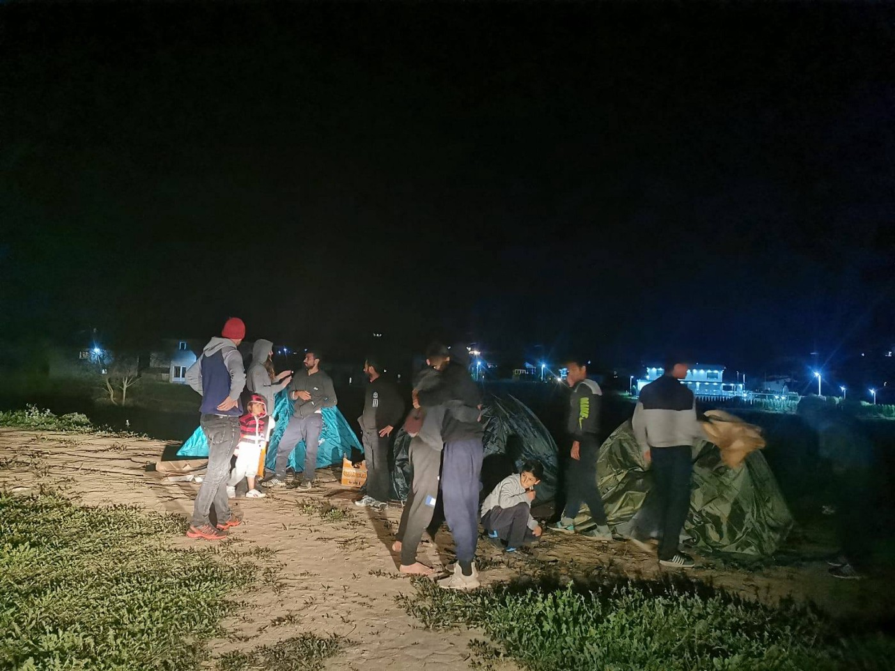

### AYS Weekend Digest 19–20/9/20: Is This Europe?

Fire breaks out in Samos / The EU furthers its collaboration with Libya / Call for help from Azzurra quarantine ship / Refugees are forced into the new “Moria”

](assets/c08b886529ba/1*3-vAIbSls1P9SUBZ8cSGMg.png)

Photo credit: [Nicola Colin for FP](https://foreignpolicy.com/2020/09/20/europes-failed-migration-policy-caused-greeces-latest-refugee-crisis/)
#### Featured: Lesvos, is this Europe?

On the Greek island of Lesvos, 9,198 people have moved to the new camp so far and there are already [214 positive cases of COVID\-19](https://www.stonisi.gr/post/11553/9000-sth-nea-domh-anoiksan-oi-dromoi?fbclid=IwAR31Rwo8__wAMUuswiQijzJyIZwMPHD1Z-ih058iHy48fJCxWYj7r5gNL00) at the time of writing\. Their treatment has been nothing short of barbaric as journalist Franziska Grillmeier highlights:

■■■■■■■■■■■■■■ 
> **[Franziska Grillmeier](https://twitter.com/f_grillmeier) @ Twitter Says:** 

> > In the new camp on #Lesbos, #refugeesgr who were tested #Covid_19 positive were placed behind barb wire in entrance of ex-shooting range, exposed to the wind + sea, families, men &amp; women, while access to sanitary facilities &amp; running water remain limited. https://t.co/krkm8WZ1H6 

> **Tweeted at [2020-09-20 12:30:13](https://twitter.com/f_grillmeier/status/1307658322896711682).** 

■■■■■■■■■■■■■■ 

A well\-written [post from the Aegean Boat Report](https://www.facebook.com/285298881993223/posts/924537871402651/) beautifully sums up the current events on the island\. A version of their post is highlighted below with some edits for context\.

This new “temporary” camp that is set up in Kara Tepe for the refugees after the fire in Moria, might look clean and good from a distance, but when you get a closer look, everything isn’t as it seems, in many aspects\.

> We are 100 people in one big tent\. We have no shower, no toilets and not enough water\. It’s not good to put so many people in one tent\. We are so scared of [\#covid19](https://twitter.com/hashtag/covid19?src=hashtag_click) \. 

After the fire in Moria on September 9th, there has been a desperate need for housing for the thousands of people left homeless and for the families living on the streets, in car parks and in the hills in the surrounding areas\. To call the shacks they lived in a home is by any standard outrageous, but it was all they had\. The question now is, is this new camp an “upgrade” from what they had, or is this a new “hell” in the making, where limitation of movement is the main purpose?

■■■■■■■■■■■■■■ 
> **[NoBorderKitchen](https://twitter.com/noborderkitchen) @ Twitter Says:** 

> > While yesterday some people could leave the camp, today authorities locked everyone in because "the shops are closed and there is no reason for people to go out"

#Moria 2.0 is a prison

#LeaveTheCampsBehind https://t.co/8mmHf1Ec7b 

> **Tweeted at [2020-09-20 09:48:21](https://twitter.com/noborderkitchen/status/1307617587858231302).** 

■■■■■■■■■■■■■■ 

Greek authorities have wanted to make closed camps for a long time\. Prisons, where they can lock everyone up, including families and children, where they can control their movements, limit their access to basic needs, advocacy, health care, to journalists\. All under the pretext of “protecting” them, and only “thinking” of their best interests\. It remains to be seen if people can move freely in and out of this new camp\. We don’t know if they will be able to go for a walk or go to the shops like you and me, without being stopped by a barbed wire fence\.

■■■■■■■■■■■■■■ 
> **[Franziska Grillmeier](https://twitter.com/f_grillmeier) @ Twitter Says:** 

> > FIY: Press was only allowed in approx. 150 meters into the camp site. 

> **Tweeted at [2020-09-19 16:47:47](https://twitter.com/f_grillmeier/status/1307360750185394176).** 

■■■■■■■■■■■■■■ 

Many people didn’t want to go into this new camp\. They were afraid of what this camp represents and how it would affect their lives\. The Greek government first tried a friendly approach, asking people to “move in” to their new “homes” — telling them that their everyday needs would be met and that it would be a safe and good place to live\. When that didn’t work, they started handing out flyers and sending out text messages to people in the area, saying that they, the government, were the only ones people could and should trust\. They called out NGOs and volunteers trying to highlight them as an untrustworthy enemy\.

> _Dear asylum seeker, if you are in Lesvos, the only safe place for you and your family is in the new camp\. There, the Greek State guarantees your safety and provides you with electricity, water, medical care, wifi etc\. Listen only to the official authorities\. Do not trust anyone else, they are using you\._ 

When this tactic also failed, they used something they called “friendly force\.” It’s obviously a contradiction of terms, as it’s not actually possible to be considered friendly and use force at the same time\. They made corridors in the streets where people lived, blocking off the street with police buses on both ends, and moved in a massive police force to “persuade” people to move\. Riot police with shields, batons and guns went into the area\. The refugees living there didn’t stand a chance, they had no option, they had to obey\. In order to make it difficult to document their actions, the Greek Government restricted journalists from entering the area, saying there is no “freedom of the press\.”

■■■■■■■■■■■■■■ 
> **[Stavros Malichudis](https://twitter.com/Malichudis) @ Twitter Says:** 

> > Greek govt has been allowing journalists to enter only specific areas of the new camp in Kara Tepe and for very limited time, and yesterday asked them to "not talk with refugees".

This is what the rest of the new camp looks like. https://t.co/piOG1oH1sE 

> **Tweeted at [2020-09-20 09:39:05](https://twitter.com/malichudis/status/1307615255611179010).** 

■■■■■■■■■■■■■■ 

To put the last “nail in the coffin,” the State pointed out that the only people who would be able to get their asylum cases processed were the ones living in this new camp — and if that wasn’t enough, they prohibited all organizations from giving out food\.

Finally, we have to call attention to the hypocrisy of the government and UNHCR\. In only five days, the Greek government, in cooperation with UNHCR, managed to find **thousands** of tents, toilets, and beds, and the funds to make this massive camp\. It seems like a “miracle\.” Now let’s be clear, we aren’t blaming them for providing much needed aid, we are only highlighting the fact that for the last five years, neither the government nor UNHCR have been able to give proper housing or living conditions inside Moria or inside the “jungle” outside the official camp\. People had to make shacks out of tarpaulin and garbage, and all of a sudden they magically came up with all of this material, enough to rebuild an entire camp\. Where were these resources 5 years ago? Or one year ago when the camp held nearly 20,000 people? How could that possibly be? Why couldn’t they give them to people who desperately needed them before, why let people suffer unnecessarily for five years, when it seems a solution, the materials, and the ability to rebuild a whole camp was actually possible to do in only five days\.

This is not to say that all of these resources would have made the situation perfect, the best solution and the one we advocate for is still no camps, no Moria, no tents with hundreds of people\. But if the government was unwilling to consider moving people to the mainland to respect their human rights, they could have at least done their best to improve the horrible conditions they were living in, by offering more housing, bathrooms, etc\.

This new camp is not a solution\. It might have all of the makings of a “proper” camp, but when you look closer you see the true danger of this new set up\. First this camp is built on the seafront, when winter comes people will literally freeze to death, and if the cold doesn’t kill them, they will probably drown in mud, or from the polluted ground these tents are built on\. The area is known to flood when the rain comes, and there isn’t enough drainage to handle the water that will pour down in the coming months\. Most of the tents are constructed directly on the ground, without gravel or pallets, many without any flooring at all\. The camp is built on an old military shooting range, the ground is literally packed with bullets, grenade fragments and no one really knows what else the military might have used in the area over the years\. Military personnel have walked around with metal detectors, picking up whatever they could find, but the ground is polluted and unsafe\. There is no question about that\. And in this area the government will let families and kids live and play\. Would you do the same with your own family? Would you want that for any other family?

■■■■■■■■■■■■■■ 
> **[DunyaCollective](https://twitter.com/DunyaCollective) @ Twitter Says:** 

> > Good morning #Europe! Video from inside the new camp: A soldier with a mine detector searching for old AMMUNITION &amp; EXPLOSIVES. Next to #refugeesgr. This how 🇬🇷 &amp; 🇪🇺 accommodating refugees survived the 🔥 in #Moria. The ground is chemical pulluted &amp; dangerous.

#LeaveNoOneBehind https://t.co/TgsW5YXUIz 

> **Tweeted at [2020-09-19 07:26:33](https://twitter.com/dunyacollective/status/1307219512849313795).** 

■■■■■■■■■■■■■■ 

In the pictures, we can see some huge tents in a row, but we can’t see inside\. These huge tents are housing for single men, around 200 men in bunk beds in each tent, literally sleeping and living on top of each other\. They say that the tents will be locked up at night, if this is true, it will certainly resemble the barracks from the concentration camps in Germany\.

The head of UNHCR on Lesvos, Astrid Castelein, said when asked about the relocation of people in to this new camp, “As long as it’s peaceful, we believe it’s a good move, here on the street, it’s a risk for security, for public health, and there is no dignity which we need for everyone\.” I wonder what side UNHCR is really on, when talking about security and dignity, she definitely can’t be referring to the people inside the camp, behind fences and barbed wire, living in the mud and on polluted ground\. Is this the only kind of protection you can offer?

It didn’t take UNHRC long to go out on social media and ask for more money to fund their “efforts” on Lesvos\. Philippe Leclerc, the Greek representative of UNHCR didn’t waste any time when the opportunity arose to get his hands on more money, but he didn’t lift a finger when 20,000 people were freezing in Moria last winter\. We have to be honest, most of the support for refugees over the last five years in Greece has been from independent organizations and NGOs, and NOT from UNHCR, so to have the nerve to go out and ask people to give them more money is laughable\.

This area, as with most military areas, has a photography restriction, meaning that journalists and people in general will have restricted access to the area\. Documenting the situation through video or photography can be regarded as criminal activity\. This is a huge win for the government and UNHCR who don’t want people to see what’s really going on\.

What will happen with the people in this camp is difficult to predict, but the fact that they will be behind double fencing and barbed wire, locked behind a gate with access control and video surveillance, guarded by a massive police force, seems more like they are being locked away in a prison than they are being relocated to a refugee camp\.

They say this camp is “temporary” but they have signed a lease for the next five years, at the astronomical price of 2\.9 million Euros, enough to buy the area three times over\. It’s perhaps more permanent than they make it out to be\.

Is this an “upgrade” from Moria? I would say quite the opposite, it is yet another attempt to treat people seeking protection and refuge in Europe in the most inhumane way, without any concern for their best interests or their human rights\. This is “Moria the sequel”, a hell in the making, and most of us are just watching as it happens all over again\.

■■■■■■■■■■■■■■ 
> **[RSA](https://twitter.com/rspaegean) @ Twitter Says:** 

> > #Refugeesgr take shower inside the new camp. "Conditions here are even worse than #Moria hotspot. No place to shower, toilets which are all dirty", says a refugee #Lesvos 

 https://t.co/QuOhV7yITJ 

> **Tweeted at [2020-09-19 19:16:52](https://twitter.com/rspaegean/status/1307398269161689091).** 

■■■■■■■■■■■■■■ 

LIBYA
#### **Returns**

128 people have been [returned](https://twitter.com/msehlisafa/status/1307438549520842755) to Libya just this weekend\.
#### EU to help draft Libyan strategy on border security and management

According to an internal EU document, the EU will help write Libya’s national strategy for border security and management\. The move sends the signal that greater efforts are being made to prevent the arrival of migrants and refugees from fleeing war\-torn countries\.

Dated 1 September and obtained by the [EU Observer](https://euobserver.com/migration/149468) , the document spells out what the EU’s border assistance mission in Libya \(EUbam\) intends to do over the next six months and what it has already done in the past 6 months\. Drafted in part by EUbam’s head of mission for Libya, Vincenzo Tagliaferri, the 60\-page report details its efforts to train the Libyan coast guard in “rescues” and returns\. The coast guard has been a key actor preventing people from fleeing Libya — but often sending those ‘saved at sea’ to detention centres, where they face torture or worse\.

Only three years ago, Tagliaferri [described Libyan institutions as chaotic](https://euobserver.com/foreign/139234) , highlighting how Libya suspended its defence minister following the Brak Shati massacre\. Now EUbam is set to sign a new agreement with Libya’s interior minister, which aims to “enhance relations” including on border management and law enforcement\. This all comes against a backdrop of a spike of Libyan Covid\-19 cases as well an increased risk of roadside bombings for those returning to Tripoli from the frontlines of what the report clearly describes as an active conflict\.

These talks are all unfolding while shipwrecks at sea continue:

■■■■■■■■■■■■■■ 
> **[Alarm Phone](https://twitter.com/alarm_phone) @ Twitter Says:** 

> > 🆘BREAKING! SHIPWRECK HAPPENING NOW off Garabulli #Libya. A fisherman just told us that he rescued 21 people but had to leave 33 people behind clinging on the rubber boat tubes. He tried to inform authorities but no reaction. 

They might still be alive &amp; need RESCUE NOW! 

> **Tweeted at [2020-09-19 19:11:32](https://twitter.com/alarm_phone/status/1307396927290576897).** 

■■■■■■■■■■■■■■ 

**SEA**
#### Remembering Abdulfatah Hamdallah

Today marks one month since the death of Abdulfatah Hamdallah\. Exactly one month ago, he jumped onboard a little inflatable boat and used shovels as oars in a desperate attempt to reach the UK\.

Today we are remembering Abdulfatah, as just one of the hundreds of cases of lives lost at sea\. We shouldn’t forget them, and should instead when the opportunity arises remember them and talk about them in human terms\. Abdulfatah or Wajdi, as he liked to be called, was just 28 years old\. Like so many of the young men in Calais, he absolutely loved football\. He was a student in West Kordofan, but left to find work in Libya with his brothers\. He knew that even with a diploma, there were no opportunities for him in Sudan\. There was only fear\.

His friends say he tried to cross to England twice before his last attempt\. Every single time he was happy, looking forward to a chance to start over\. He leaves behind four heartbroken siblings and some touching words posted to his Facebook a month before he died: “On the palm of fate we walk, and we don’t know what’s written\.”

Abdulfatah was the first person that we know of to die crossing the Channel this year\. We can only be relieved that there hasn’t been another tragedy like this since\.

But not far from the busy waters of the Channel, refugees like Abdulfatah are dying right here, in the UK\. In May, a young Syrian asylum\-seeker was found dead in a Glasgow hotel\. In August, we lost Abdullah from Yemen and Mercy from Uganda\. All avoidable tragedies in places where they should have been safe\.
#### Updates from central Med

In other news at Sea, distress calls are going out in Maltese waters for rescue\. This situation is ongoing and there doesn’t seem to be any response from authorities\.

■■■■■■■■■■■■■■ 
> **[Alarm Phone](https://twitter.com/alarm_phone) @ Twitter Says:** 

> > 🆘️ About 28 people in distress in Malta SAR!

A boat with ~28 people in distress just reached out to Alarm Phone. They have run out of fuel and are drifting on a wooden boat. They need to be rescued immediately. RCC #Malta, do not evade your duty again! https://t.co/kDSzoMtOpN 

> **Tweeted at [2020-09-20 15:12:31](https://twitter.com/alarm_phone/status/1307699166072758272).** 

■■■■■■■■■■■■■■ 

In Italian waters, [Sea Eye made three rescues](https://twitter.com/gorden_isler/status/1307706598559801346) and is now heading towards Lampedusa, despite MRCC Italy refusing to take responsibility\. There is said to be 133 people and 62 minors on board\.

GREECE
#### Arrivals

50 people arrived on Gavdos yesterday, a small island south of Crete\.

■■■■■■■■■■■■■■ 
> **[RSA](https://twitter.com/rspaegean) @ Twitter Says:** 

> > A sailboat carrying 50 #refugeesgr arrived today in #Gavdos. Strong winds were blowing in the area. Last Monday a boat sank near #Crete. Two women and two boys, ages 6 and 7, died in the shipwreck. #safepassage. 
[neakriti.gr/article/kriti/…](https://www.neakriti.gr/article/kriti/hania/1590355/istioforo-me-metanastes-sti-gaudo-anamesa-tous-paidia/) 

> **Tweeted at [2020-09-20 09:04:00](https://twitter.com/rspaegean/status/1307606426492297216).** 

■■■■■■■■■■■■■■ 

#### Samos: Fire in Vathi camp

Last night around 8:30pm [a fire broke out in the Vathi camp on the island of Samos](https://www.in.gr/2020/09/20/greece/fotia-tora-sto-kyt-tis-samou/) \. This was the second fire this week\. It is still unconfirmed how many people were affected, but we do know two people were injured and have been taken to hospital\. Three containers were also damaged\. Minors in the area have now been moved to police cells/containers within the RIC\.
#### Chios: Unaccompanied minors to be transferred to mainland

In Chios, a [plan for the transfer of all unaccompanied refugee children](https://astraparis.gr/feygoyn-apo-tin-vial-90-asynodeytoi-anilikoi-gia-tin-ipeirotiki-ellada/) , a total of about 90 people, from the reception and identification center of VIAL to mainland Greece is expected to be implemented within the next few days, under the responsibility of the International Organization for Migration \(IOM\) \.

This development comes in the light of the recent dramatic events in Moria, Lesvos, and it seems that the positive international climate is being utilized, in order for a number of recognized refugees and mainly unaccompanied refugee children to be transferred first to structures on the mainland and then to European Union countries\. According to information from [astraparis\.gr](https://www.astraparis.gr) , the plan for transportation will be implemented in the structures of the other islands as well \(Samos, Leros and Kos\) \.

The procedure involves informing all the unaccompanied refugee children, who are to be transferred from VIAL, performing all the necessary medical examinations and completing the foreseen bureaucratic procedures by the end of next week\.
#### Athens, volunteers needed at Cafe Patogh

[Cafe Patogh needs volunteers\!](https://www.facebook.com/100010082855510/videos/1261201710892579) If you are a teacher, trainer, cook, motivated person consider helping them with their great work\!

ITALY
#### Protests on quarantine ship Azzurra

Over the weekend [protests were held on the Italian ship GNV Azzurra](https://twitter.com/JigginoRuss/status/1307635416204546048) \. The ship is carrying around 600 people and has been quarantined at sea for more than 14 days\. On Friday, one person attempted suicide, as a form of protest against the racist Italian laws which provide for imprisonment and collective deportations\. The boat is mostly carrying Tunisian citizens\.

■■■■■■■■■■■■■■ 
> **[Jolie Rouge](https://twitter.com/JigginoRuss) @ Twitter Says:** 

> > L'ennesima protesta delle persone, in gran parte di origine tunisina, segregate sulla nave prigione Azzurra GNV, contro le deportazioni
[youtube.com/watch?v=dZ9eee…](https://www.youtube.com/watch?v=dZ9eeel0FfI) 

> **Tweeted at [2020-09-20 10:59:12](https://twitter.com/jigginoruss/status/1307635416204546048).** 

■■■■■■■■■■■■■■ 

Additionally, as it has done so many times before, Italy allowed Sea Watch to dock only to block and then seize the ship\.

■■■■■■■■■■■■■■ 
> **[Sea-Watch International](https://twitter.com/seawatch_intl) @ Twitter Says:** 

> > 🔴 SURPRISE: The #SeaWatch4 is blocked! For 11 hours, the inspectors searched for the needle in a haystack - and once again found absurd reasons to detain us. With this arbitrary blockade the @[guardiacostiera](https://twitter.com/guardiacostiera) is deliberately putting human lives at risk! https://t.co/53mLoJ7p4L 

> **Tweeted at [2020-09-19 21:46:33](https://twitter.com/seawatch_intl/status/1307435939594219524).** 

■■■■■■■■■■■■■■ 

Read MSF press release on the blockade [HERE](https://twitter.com/MSF_Sea/status/1307613537687216129) \.

SPAIN
#### Voices from the ‘Plastic Sea’

In Almería’s vast farms, migrants pick food destined for UK supermarkets\. But these ‘essential workers’ live in shantytowns and lack PPE as Covid\-19 cases soar\.

Hassan, a migrant worker from Morocco who spends 12 hours a day under a sweltering late summer sun harvesting vegetables in one of the vast greenhouses of Almería, southern Spain [talked to a Guardian reporter about conditions there](https://www.theguardian.com/global-development/2020/sep/20/we-pick-your-food-migrant-workers-speak-out-from-spains-plastic-sea) \.

The vegetables he digs from the red dirt are destined for dinner plates all over Europe and in supermarkets including Tesco, Sainsbury’s, Asda, Lidl and Aldi\.

The tens of thousands of migrant workers working in the province are vital to the Spanish economy and the pan\-European food supply chains\. Throughout the pandemic, they have held essential worker status, labouring in the fields while millions across the world sheltered inside\.

Here, in the middle of Spain’s _Mar del Plastico_ \(Plastic Sea\), the 31,000 hectares \(76,600 acres\) of farms and greenhouses in the region of Andalucía known as “Europe’s garden”, many of El Barranquete’s inhabitants don’t have electricity, running water or sanitation\. Hassan’s house, like all the others in El Barranquete, is constructed from whatever he could find on rubbish dumps or the side of the road; pieces of plastic foraged from the greenhouses, flaps of cardboard and old hosing tied around lumps of wood\. Under Spain’s blazing sun, the temperature can reach 50C — at night the plastic sheeting releases toxic carcinogenic fumes while he sleeps\.

When he first arrived in Spain, Hassan was stunned by how the workers were treated on the farms\. Like other workers in El Barranquete, Hassan says he earns only about €5 \(£4\.50\) an hour, well under the legal minimum wage\.

“The working conditions are terrible,” he says\. “Sometimes we work from sunup to sundown in extreme heat, with only a 30\-minute break in the whole day\.”

Now, as Almería faces a wave of Covid\-19 infections, workers say they have been left completely unprotected\. “We pick your food,” says Hassan\. “But our health doesn’t matter to anyone\.”

Read more about the situation for migrant workers in Spain [HERE](https://www.theguardian.com/global-development/2020/sep/20/we-pick-your-food-migrant-workers-speak-out-from-spains-plastic-sea) \.
#### Registration of foreign citizens in Melilla: one year later

September 20th marked the one year anniversary of the Spanish ombudsman’s recommendation to the city of Melilla to register the citizens residing there\.

At present, a multitude of people, including many families residing for several generations in Ceuta and Melilla, remain unable to register with the ‘padrón,’ and therefore find their most basic rights impossible to obtain, such as access to education and to healthcare\.

A year ago today, the recommendation that the Spanish ombudsman Francisco Fernández Marugán made to the autonomous city of Melilla on the obligation to register the citizens who inhabit it and also to those without a Spanish nationality\. Many citizens of the provinces of Morocco surrounding Melilla \(Nador\) and Ceuta \(Tetuán\) have been residing in these autonomous cities for generations without being allowed to register\.

According to the Law on Basics of Local Regime, registration is an obligation for all persons residing in a locality regardless of their administrative or nationality and therefore it is an obligation of the municipality to register them\.

Moreover, the Aliens Act provides that “City councils shall incorporate foreigners who have their habitual home in the municipality and keep updated information about them without any reference to the requirement for a visa, residence permit or any other instrument of foreigners\.”

In fact, it is even possible to register in a fictitious home in the cases of people without a fixed home as recalls a resolution of the Spanish Government of April 29 of this year\.

In Bosnia and Herzegovina and Serbia, Solidarity Wheels and NNK have come to meet people born in Melilla who, because they did not have this basic right, decided to go on the Balkan route so they can reach the Spanish peninsula and meet with their family members\.

The Balkan route can be one or two years of travel, costing huge amounts of money while also impacting the physical and psychological health of people\. But somehow it’s still ‘safer’ \(that is, as people always say, record less fatalities\) than crossing the Mediterranean on a boat\.

BiH

Speaking of the situation in Bosnia, every day more families are arriving in Velika Kladuša\.

 \)](assets/c08b886529ba/1*8xXKoKZ_oKFkjHOX-IoeKw.jpeg)

\(Photo by [Барбарче Бекарес Кастањоска](https://www.facebook.com/groups/144469886266984/user/1119820502/?__tn__=-UC*F) \)

Yesterday, [some groups \(seen in photos\) were pushed back](https://www.facebook.com/groups/144469886266984/permalink/639821226731845/) across the border after the Croatian police burned their tents and broke their phones\. At night, they camped in front of Miral, and this morning the police told them to leave\.

FRANCE
#### Refuge Solidaire in Briancon to close in October

Since the end of confinement, dozens of migrants have tried to cross the Italian\-French border to file asylum requests or to try their luck in France\. Unfortunately, this weekend it was [announced](https://www.infomigrants.net/fr/post/27383/briancon-le-refuge-solidaire-hebergement-emblematique-pour-les-migrants-va-fermer) that Le Refuge Solidaire, an emergency accommodation center for migrants arriving in France from Italy, will close their doors by the end of October\. The new mayor \(LR\) of this Hautes\-Alpes municipality and the new councilor Arnaud Murgia explained their decision saying the center welcomes **too many** people and “has shown its limits regarding the respect of accommodation and security rules\.”

This is the latest step in a long line of attacks on NGOs and migrant welcoming communities\.

For refugee aid associations, the upcoming closure is a blow\. Since 2017, the center has welcomed more than 10,000 migrants offering them the opportunity to rest, take a shower and eat a meal after walking long hours across the Alpine border\. Philippe Wyon, a spokesperson for the Refuge, told AFP that,

> We are in complete agreement about the need to find a more suitable place, but we do not at all agree to close without first finding an alternative\. 

UNITED KINGDOM
#### Abed Alkhalaf’s story

To close this weekend’s digest, we are going to end with a positive story\. So much of what we cover is difficult to read, to comprehend and sometimes leaves us wondering where humanity has gone\. So, in solidarity and strength, we will close today with the BBC’s recent story about the reunification of Abed Alkhalaf, his wife and their seven children in Belfast\. Read more below\.

Abed Alkhalaf fled the Syrian war for Belfast five years ago and was forced to leave his wife and children behind\. This is the harsh reality for thousands of refugees living throughout the UK and continental Europe\.

Abed, his wife and family were living in Deir ez\-Zor, Syria, when the war broke out in 2011\. Initially, they were unable to leave as they were caught in between the fighting\. “The situation was hell”, Abed said, “more than you can imagine\.” Caught in between fighting factions like Al\-Nusra, the Islamic State group \(IS\) and QASD militia, Abed said these groups were notorious for killing and terrorising people, and stealing their money and property\.

In 2015, Abed escaped, but had to leave behind his wife and children in this uncertain and dangerous situation\. He eventually made it to the Greek island of Chios where he met other refugees trying to migrate to Macedonia\. After months of hardship, dangers and fatigue while travelling through Hungary, Austria, Germany and France, he reached the UK where he claimed asylum and was given residence papers\.

More than 3,000 miles away in Syria Abed’s family were trying to move to neighbouring countries but IS controlled the entrances to and from their city\. Finally in 2018, they were able to make it to Beirut where they sent their papers from the consulate office in Lebanon to the British Embassy in Amman, Jordan\. Months of visa rejections followed and soon their money ran out\. Life was difficult, but Abed never lost hope\. Finally, in November 2019 their visas were approved and last month \(August 2020\) the family was reunited in Belfast\.

FURTHER READING

For a deeper look and analysis of Europe’s Failed Migration Policy and its intersection with the fire in Moria and the crisis in Greece read [Andrew Connelly’s great piece in Foreign Policy](https://foreignpolicy.com/2020/09/20/europes-failed-migration-policy-caused-greeces-latest-refugee-crisis/) \. He sheds light on how the burning of Moria exposes the EU’s short\-sighted, inhumane, and ineffective approach to asylum\.

**Find daily updates and special reports on our [Medium page](https://medium.com/are-you-syrious) \.**

**If you wish to contribute, either by writing a report or a story, or by joining the info gathering team, please let us know\.**

**We strive to echo correct news from the ground through collaboration and fairness\. Every effort has been made to credit organisations and individuals with regard to the supply of information, video, and photo material \(in cases where the source wanted to be accredited\) \. Please notify us regarding corrections\.**

**If there’s anything you want to share or comment, contact us through Facebook, Twitter or write to: areyousyrious@gmail\.com**

_Converted [Medium Post](https://medium.com/are-you-syrious/ays-weekend-digest-19-20-09-2020-is-this-europe-c08b886529ba) by [ZMediumToMarkdown](https://github.com/ZhgChgLi/ZMediumToMarkdown)._
