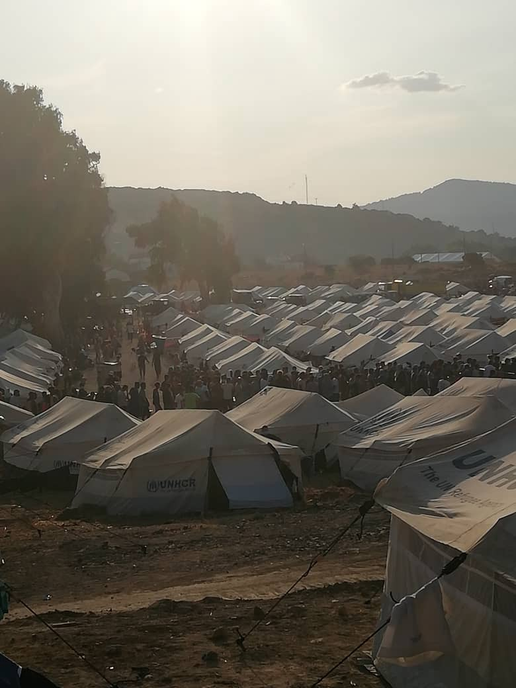

### AYS Daily Digest 22/9/20: New European ‘ _Morias’_ across the Balkans
#### Reflections from Bosnia and Herzegovina, staring in the face of collective misery and indifference / Will the new Pact prolong the same mistakes tat brought to the current state in Greek camps and across the Balkans? / news and updates from Greece, Slovenia, France, Spain and Sweden

 \)](assets/e23d1e7181e4/1*tqCYLDmiltjDYp1Z8QZkmw.jpeg)

“Moria 2”, as the activist call it\. The second, provisional camp set up for the people evacuated from Moria \(Photo: [DunyaCollective](https://twitter.com/DunyaCollective) \)
#### FEATURED

> It seems that the families who stayed in front of Ušivak were taken inside the camp\. Most likely, due to the pressure\. However, this will merely last until a new situation and the next group of people… 

> It has been several years that we are witnessing suffering of people on the move who are passing through Bosnia and Herzegovina\. For years we have been witnessing them being criminalized and how we are being directed to think and act against the people on the move\. They are also trying to criminalize some of the people who cannot stand to see hungry and thirsty people sleeping rough, so they give them food\. 

> For years I have been dwelling over what it means to provide humanitarian assistance\. Is that a political act in solidarity, and in doing that, to what extent are we absolving those with the responsibility to do the job they are very well paid for\. How much is the humanitarian effort incessantly exhausting us, and how much we are only running in circles\. 

> For a long time now I have found that by providing humanitarian assistance, we are in fact expanding the circle of hell\. I’ve had a lot of fights with professionalized foreign volunteers on this issue because they only seem to be persistent in feeding the people and not acting in a political way\. In fact, it is washing one’s white consciousness\. Some of us do it, too\. It is hard to resist and not fall into this vicious circle of cleaning the conscience because we always fall into the feeling of guilt\. 

> Unfortunately, this can go on indefinitely\. And I am not sure how much more strength I have for something like that\. 

> Also, unfortunately, because we are so intellectually lazy, we avoid being politically active\. I don’t mean entering a political party, but rather using all available political \(legal, institutional, and other\) means to change something\. Not only because these people are passing through B&H, not because they could contribute to the economy if they stay, and not because they have the right to asylum and not only …\. but rather because we need to change this whole world that rests on injustice and rule of the stronger\. Not because it concerns people on the move, but because it concerns all of us\. 

> For the past 3 days, families who went through the hell of the Mediterranean, then the horrors of Moria, after having walke the Balkan Route, they got stuck in front of the camp Ušivak\. They were not let inside because allegedly there was no space\. Next to children who had no access to sanitation services, lodging or food, well paid employees of several different UN agencies, including the UNICEF, were passing by, along with some of the NGOs \(such as BHWI\) \. Some of us reacted in anger, some stressed that how this proves it’s not only men who are people on the move, and now what… Some went to help and provide food to the people\. Some yelled\. 

 — the families who were left outside the Ušivak camp were taken in the day afterwards, but places in an unequipped common tent, all together\.](assets/e23d1e7181e4/1*oOYy8AbROtVD7URDBA18PQ.jpeg)

Photo originally published by [Transbalkanska solidarnost](https://www.facebook.com/transbalkanskasolidarnost/?__xts__%5B0%5D=68.ARCKs23CtVANyWYc4XpTFGTkoLVVTWh0fVqbT-WtvRKZK3rooY9AVe3iFqdNpA7TG7TJpjcFWEuE5m5oKKAiN-OTz9-au2GUN_hD4hYe9wxpUzMmwYNCD_gc5UaXNbVpzFZg-VZZ8T94XA86lGOEYpkdwvZ9w-obXJ-lbgg8xyQjoi-9YQC39brBcwYh3wVcMaU_pDX5SfFEkvocm4hVRVbaojeBDsg-J5Brz55styU3dIdD7X5FCuWwVh7HAcNo_2i_C2W6LtdiH02WMruqj40jBUA8hmE1DYC4c-OgJ7SCE-Wgh4QyahMymcGMpWfJVtsiUM667avPzheKWpwPBGw&__tn__=k%2AF&tn-str=k%2AF) — the families who were left outside the Ušivak camp were taken in the day afterwards, but places in an unequipped common tent, all together\.

> All this confronted mee with a number of dilemmas: 

> Why do we keep being surprised that the UN employees refuse to do anything outside the things defined in their contracts? We have seen the same some 25–30 years ago\. Nothing has changed, only the salaries must have gone up and their ‘imperialist’ assignments are more elaborate\. 

> What does it mean to ask for the people to be taken in a camp? Ušivvak is not a place where anyone should be lodged as the conditions are nowhere near humane anough\. Entry of 80 more people means poorer conditions for those already inside, and these people who bear the trauma of Moria will surely not have it any better\. Are we not taking part in segregation by calling for them to bee squeezed in? Because at the end of the day, when they enter the camp, they become invisible also to us\. We shift the responsibility\. 

> For years we have been critical of the camp system and the inhumanity of such approach\. If we formulate a new demand, to whom are we directing it? Because, the EU is sending funds, but the EU is to blame for the whole situation\. As far as we can see, thee new policies will go further in the direction of securitisation and insisting on a restrictive regime of asylum\. Onec again, we face the problem we have been pointing to, which is that the money should have never went to the colonial UN forces, but it should have rather — in spite of everything — been directed at B&H\. Then we could at least have someone to turn to officially, and to demand a change in approaches and policies\. This way, both sides are finding excuses to be a part of this crime against humanity\. 

> Finally, about this group in Ušivak\. The next one is surely on their way\. The other day we asked for all _Morias_ to be abolished, but aren’t we witnessing the becoming of another Moria right here, in Ušivak? The official capacity of 800 places has long been filled\. And the winter is coming… 

> Lastly, we can only hope that the politics working against people on the move will not further weaken our voice\. And that we don’t stop thinking about these families after they have been taken inside Ušivak\. 

— Gorana Mlinarević, Human Rights Lawyer and activist from Sarajevo
#### GREECE

243 coronavirus cases have been detected at the new temporary facility at Kara Tepe\. Reportedly, authorities have conducted a total of 7,064 rapid tests at the tent camp\. The average age of the Covid\-19 patients at Kara Tepe is 24\.

■■■■■■■■■■■■■■ 
> **[Dirty Girls](https://twitter.com/DirtyGirlsL) @ Twitter Says:** 

> > @[BrunoTersago](https://twitter.com/BrunoTersago) And this is the quarantine area. https://t.co/Dh67cqNK5h 

> **Tweeted at [2020-09-21 23:35:36](https://twitter.com/dirtygirlsl/status/1308188156735508481).** 

■■■■■■■■■■■■■■ 

■■■■■■■■■■■■■■ 
> **[Lydia Emmanouilidou](https://twitter.com/lydiaemman) @ Twitter Says:** 

> > A video from inside the new refugee camp on Lesbos, sent to me by an asylum-seeker. https://t.co/c9kPyeQ8Cb 

> **Tweeted at [2020-09-22 18:52:54](https://twitter.com/lydiaemman/status/1308479403421315072).** 

■■■■■■■■■■■■■■ 

Dunya Collective has reported on some of the basic conditions in the new camp:

■■■■■■■■■■■■■■ 
> **[DunyaCollective](https://twitter.com/DunyaCollective) @ Twitter Says:** 

> > SHELTER I

The tents at #Moria2 where set up quickly. They have no floor. What's if it rains? They are not winter-proof. The camp is exposed to the north. In autumn & winter the wind is heavy & cold. How to heat these tents? There is no electricity. Almost no light at night 2/9 https://t.co/QSdtTMpxmQ 

> **Tweeted at [2020-09-22 11:55:34](https://twitter.com/dunyacollective/status/1308374376891510786).** 

■■■■■■■■■■■■■■ 

Apart from the field not being safe for children or for sleeping, as it was used as a military shooting range, local groups say there is not enough food and water\. Water is distributed once a day in a food line, and according to some, only one bottle \(1,5 l\) per person is distributed per day\. The food delivered is the same as in Moria and of poor quality\.

Food line in the camp

There doesn’t seem to be any proper organized medical infrastructure inside the new camp\. Patients have been asking for medical treatment for days, some groups say\. The situation remains as chaotic at it was in Moria\.

■■■■■■■■■■■■■■ 
> **[DunyaCollective](https://twitter.com/DunyaCollective) @ Twitter Says:** 

> > SANITATION I

The hygiene situation is disastrous. No showers. Just chemical toiletts No adequate sanitary facilities at all. #RefugeesGR have to wash themselves in the salty sea water. „Who can stand it, not taking a shower for 2 month?“ a youngster living in the camp said. 6/9 https://t.co/24znUviJTf 

> **Tweeted at [2020-09-22 12:04:46](https://twitter.com/dunyacollective/status/1308376692751249409).** 

■■■■■■■■■■■■■■ 

The entire infrastructure of the reception system doesn’t seem to be able to answer peoples’ basic needs and its own international minimal standards\.

> Eating once a day\. That’s what it sticks to at the moment\. A resident writes that out of desperation some would try to cook something\. The fear is standing in line and then going out empty\. This happens a lot\. The money comes from the [\#EU](https://www.facebook.com/hashtag/eu?__eep__=6&hc_location=ufi) \. Why is food short?
 

> Everyone is laying on these rocks in the new warehouse\.
 

> Too few toilets\.
 

> Too little water\.
 

> Too little tents, some families have been sleeping in the open air for days, says the young woman who writes to me\.
 

> Hearings have been postponed further\. That means: hold on longer and wait\. 

■■■■■■■■■■■■■■ 
> **[Isabel Schayani](https://twitter.com/isabelschayani) @ Twitter Says:** 

> > Alle liegen im neuen Lager auf diesen Steinen. 
Zu wenig Toiletten. 
Zu wenig Wasser. 
Zu wenig Zelte, manche Familien schlafen seit Tagen unter freiem Himmel,sagt d junge Frau, die mir schreibt. 
Anhörungen wurden weiter verschoben.Das heisst:länger ausharren und warten. #Moria https://t.co/I8cq3M9VPq 

> **Tweeted at [2020-09-22 14:39:15](https://twitter.com/isabelschayani/status/1308415569486585858).** 

■■■■■■■■■■■■■■ 

The situation on Samos is growing more serious by day, and reports show it will only get worse if a structural change is not implemented quickly\.

> The likelihood is high that the situation in the camp in Samos will escalate even more\. People are living tent to tent here, a highly contagious virus is going around and they are being locked up\. An escalation is the logical consequence\. 

— [Glocal Roots](https://l.facebook.com/l.php?u=https%3A%2F%2Fwww.migros.ch%2Fde%2FMagazin%2F2020%2Ffluechtlinge-auf-samos.html%3Ffbclid%3DIwAR2QY9YjZytuJNCO3xvzsSb15yY-fO2BLFSlYKo2FTek5prlQX4uiHgvN7c&h=AT2Pizirqcq7v-OIgLSfZBahmfvffAWCztUFRif3vb_EcZkllj30DgSs9TBlHitR_TK9LWSryHq9-PN11O40ncfvm9o3ju3v5BvCBgoOKhFsk_z1E-lV5H9wMaXjL9tFF43XpCH8cCenOg)
### Mainland

The situation for those relocated to the Greek mainland [doesn’t seem to be much](https://l.facebook.com/l.php?u=https%3A%2F%2Ftaz.de%2FGefluechtete-in-Griechenland%2F!5715343%2F%3Ffbclid%3DIwAR1uliY8MCPkPWmd-NVamYxSxRxtxmEbHukE46Yo4eUqdaVOrqXf8VIlJ-M&h=AT0atuik868O3oLFE8-HUM0on9cqZqO6dnFc4ePqsH4FSqdp-NXNprmutFL3TiFHxtKtZOEgyHeWcUXQydf3FLCme1IjVJsYCMcuLDskHkuXVM0TheYg72NJYl8ZVv_2HELd_rE1EUABeA) better either unfortunately\. There are many more tents outside camps than before and, entering their third 2\- week quarantine, they are now like a closed prison camp\. The police even patrol the nearby train station to make sure no “escapees” make their way into Athens, one of the activists reports from Malakasa\.

■■■■■■■■■■■■■■ 
> **[Mortaza](https://twitter.com/mortazabehboudi) @ Twitter Says:** 

> > Peace is coming 
Peace is dancing in fire in rash 
Where is peace?
Peace is losing 
Peace is wounded 
Peace is crying 
Its wings are broken.

Elena, former #Moria resident and afghan refugee wrote and made this song. Please listen and watch. https://t.co/nGf5DEqE91 

> **Tweeted at [2020-09-22 17:50:42](https://twitter.com/mortazabehboudi/status/1308463749582540801).** 

■■■■■■■■■■■■■■ 

### Organisations insist on an investigation and warn against replicating the failures

Several non\-governmental organizations on Tuesday urged the European Commission to investigate Greece and initiate an infringement procedure for the “systematic violation” of EU law and the treatment of people seeking asylum on European territory\.

> “The Commission should urgently assess whether the Greek authorities are respecting EU law and, if not, initiate legal proceedings against Greece for exposing people seeking asylum on its territory to suffering and abuse,” _said the director of Oxfam\._ 

They insist that the Greek government “has not investigated or addressed the well\-documented allegations of rights violations”, including, “the continuous and violent rejections” and “blatant disregard for asylum”\.

AYS will feature the upcoming EU’s new pact on Migration and Asylum in tomorrow’s News Digest\. In the meantime, many sceptics are discussing whether the EU will replicate the same mistakes from previous migration policies\.

■■■■■■■■■■■■■■ 
> **[Judith Sunderland](https://twitter.com/sunderland_jude) @ Twitter Says:** 

> > I don’t know about you, but I’m on pins and needles over the Pact on Migration & Asylum coming out tomorrow. The European Commission has kept the draft under wraps, but they seem awfully excited about it. Thread 1/X https://t.co/kg8je5w1ud 

> **Tweeted at [2020-09-22 12:32:04](https://twitter.com/sunderland_jude/status/1308383563633623040).** 

■■■■■■■■■■■■■■ 

■■■■■■■■■■■■■■ 
> **[NoBorders](https://twitter.com/Refugees_Gr) @ Twitter Says:** 

> > "Θα εκτίσουν τη ποινή, θα τιμωρηθούν, θα απελαθούν", λέει η κυβέρνηση για τους "συλληφθέντες" μεταξύ τους, ανήλικοι. Δίκη χωρίς δίκη, απέλαση χωρίς αίτημα ασύλου, κατάλυση κάθε δικαιώματος.Για το πραγματικό έγκλημα της Μόριας τόσα χρόνια,με δεκάδες νεκρούς, ένοχη είναι η ΕΞΟΥΣΙΑ. https://t.co/DBfBCJANRB 

> **Tweeted at [2020-09-22 09:28:27](https://twitter.com/refugees_gr/status/1308337355191975936).** 

■■■■■■■■■■■■■■ 

#### SLOVENIA
### Slovenian activists on intensified repression and new chain pushbacks

According to people imprisoned in the concentration camp in Postojna, police took sanctions against those who communicated with the protesters through the fence\. According to their testimony, one person was imprisoned in solitary confinement for 7 days\. For others, police restricted access to their phones, confiscating them and allowing them to use the phone for two hours a day after breakfast: after, they have to return them\. This means that in crucial moments people do not have phones to be able to record violence being perpetrated against them\.

Immediately after the protest, the Centre of Foreigners officially introduced a ban on visits, which were previously allowed every day between 2pm and 6pm\. A few people who were not allowed to visit the centre tried to talk to people through bars, but the police prevented the communication\. A police officer stated that the Centre for Foreigners has new rules which prohibit imprisoned people from this type of communication\. If they do not follow these rules, they are punished\.

Refugees also report receiving large amounts of sedatives that makes them sleepy and dizzy\. Consequently, they are also dizzy and unfocused at court hearings where they have to defend their request for freedom\.

Last week, 11 people resumed their hunger strike\. This is just one form of protest with which they want to draw attention to their lawless situation\. Unfortunately, the channels through which they could inform the public are getting narrower, and the repression against them is growing stronger\.

Yesterday, one of the protesters contacted us from Bihać\. After two and a half months in the concentration camp, Slovenian police handed him over to Croatian police, who immediately took him to BiH — without money or telephone, of course\. He landed empty\-handed in Bihać, where he was not admitted to the overcrowded refugee camp\. Due to lack of capacity, many people sleep on the streets, and even the most basic humanitarian or medical assistance is no longer available\. This is the situation co\-created by the Slovenian policy of mass expulsions, and the police continues to return asylum seekers to BiH, preventing them from any possibility of appeal\.” — [Ambasada Rog](https://www.facebook.com/ambasadarog/)
#### FRANCE
### The court rejects food distribution

The Lille administrative court on Tuesday, September 22, 2020 rejected the association’s request to suspend the prefectural decree prohibiting them from distributing food and drinks to migrants in the center of Calais\.

> The court considers that this situation does not characterize unworthy living conditions such as to justify the urgent suspension of this order made on September 10 by the prefect of Pas\-de\-Calais\. 

The associations that challenged the decree [reportedly](http://The court considers that this situation does not characterize unworthy living conditions such as to justify the urgent suspension of this order made on September 10 by the prefect of Pas-de-Calais.) continue to distribute meals and drinks near the city center, the ban having had the sole effect of displacing the places of distributions of a few hundred meters away\.
#### SPAIN
### Spain spent 8 times more on detaining and expelling people than on reception and integration

Spectram r [eports](https://www.goteo.org/project/spectram?fbclid=IwAR1cbGklFjRzYQg_rodOmbVoVuaEjxWhbItjTjwDXDTWU9zZ74SSu5YayTI) that in Spain, 10 companies receive 65% of the 660 million allocated\. Lobbies, revolving doors, an unapproachable institutional framework seasoned with a discourse of fear and hatred that is not accidental, make it difficult to change a system that dedicates 8 times more to detain and expel than to integrate\. These are the results of our latest investigation of more than a year of work with 1,600 contracts analyzed\.
### A surge in arrivals

The Balearic coast is currently experiencing the largest numbers of boat landings in its history\. In a single night, thirteen vessels, mostly from Algeria, have been intercepted with at least 190 people on board\. That is almost the same number of people who arrived in all of 2018\.

■■■■■■■■■■■■■■ 
> **[Solidary Wheels](https://twitter.com/SolidaryW) @ Twitter Says:** 

> > Investigations like the one by @[porCausaorg](https://twitter.com/porCausaorg) are incredibly important to uncover who profits from the migration policies of #FortressEurope and its human rights violations. Supporting them is vital to shine a light on the dodgy Migration Control Industry👇🏿

[goteo.org/project/spectr…](https://www.goteo.org/project/spectram) 

> **Tweeted at [2020-09-21 15:20:09](https://twitter.com/solidaryw/status/1308063474447265792).** 

■■■■■■■■■■■■■■ 

However, the official reaction is often not the one people would expect — to want to save lives first and ask questions later\. According to the recording and documentation below, the Spanish government forbid rescuing people from a boat, ordering them to wait for the arrival of the civil guard\.

■■■■■■■■■■■■■■ 
> **[Patricia Fdez Vicens](https://twitter.com/patucafvicens) @ Twitter Says:** 

> > !Quita los cabos, Mario!

@[interiorgob](https://twitter.com/interiorgob) prohíbe rescatar un cayuco a @[salvamentogob](https://twitter.com/salvamentogob), ordenando que esperen a la llegada de la @[guardiacivil](https://twitter.com/guardiacivil) 

Escucha el audio completo

[youtu.be/3xmxh9Y9R0E](https://youtu.be/3xmxh9Y9R0E)

Esto es lo poco que le importa el derecho a la vida a Marlaska y @[abalosmeco](https://twitter.com/abalosmeco) https://t.co/Tg0GwCdttw 

> **Tweeted at [2020-09-22 13:17:49](https://twitter.com/patucafvicens/status/1308395076847128579).** 

■■■■■■■■■■■■■■ 

#### SWEDEN

The Swedish Campaign group HÅLL IHOP SVERIGE will have a crucial meeting with the Swedish government representative\. Abdul Ghafoor will share his years of experience working with deportees, the challenges they face post deportation and the trend of re — migration among those deported to Afghanistan:

](assets/e23d1e7181e4/1*_uE0blUK4H_7NpNrxukKLg.jpeg)

[Afghanistan Migrants Advice & Support Org](https://www.facebook.com/AmasoAfg/?tn-str=k%2AF&hc_location=group_dialog)
#### FOR FURTHER READING

Matthias Monroy on how Frontex apparently did not consider that the new regulation does not provide a legal basis for its own firearms:

**Find daily updates and special reports on our [Medium page](https://medium.com/are-you-syrious) \.**

**If you wish to contribute, either by writing a report or a story, or by joining the info gathering team, please let us know\.**

**We strive to echo correct news from the ground through collaboration and fairness\. Every effort has been made to credit organisations and individuals with regard to the supply of information, video, and photo material \(in cases where the source wanted to be accredited\) \. Please notify us regarding corrections\.**

**If there’s anything you want to share or comment, contact us through Facebook, Twitter or write to: areyousyrious@gmail\.com**

_Converted [Medium Post](https://medium.com/are-you-syrious/ays-daily-digest-22-9-20-new-european-morias-across-the-balkans-e23d1e7181e4) by [ZMediumToMarkdown](https://github.com/ZhgChgLi/ZMediumToMarkdown)._
