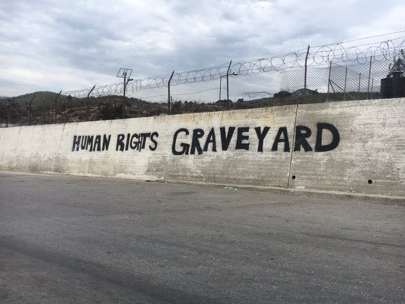

### **AYS DAILY DIGEST: 24/09: Where Human Rights Go to Die**

**Human Rights Violations All Around the World including Yemen, USA, and Lebanon**

**EU MIGRATION PACT**

Are You Syrious? is closely following the reports coming out about the EU Pact on Migration and Asylum and will continue to highlight the most relevant and thorough analyses as they arise\. In light of this, here are some updates from leaders in the field\.

According to the Danish Refugee Council \(DRC\), one of the world’s largest and leading displacement NGOs, the new EU Pact on Migration and Asylum suggests a wide range of worrying propositions when it comes to the treatment of people seeking protection in the European Union\. Their media report highlights:

In terms of Member State reactions, it is clear the Visegrad group rejects asylum seeker quotas and will continue to be predictably unwilling to play a role in the EU’s proposed “solidarity” mechanism\. Hungary’s Viktor Orban, Poland’s Mateusz Morawiecki, and the Czech Republic’s Andrej Babis shot down the EU’s planned migration reform ahead of scheduled talks\.

Spanish media also report that the country received nothing of what it asked for and is dissatisfied, but not surprised, with the proposed plan\. One major sticking point for the country was the lack of an enforcement mechanism for relocation\. The result of nine months of negotiations was foreseeable, though, and Madrid did not hold much hope of seeing its aspirations, rejected by the Eastern and Northern countries, reflected in the new document\.

Relocations, a major part of the plan, are one of the major flaws in the proposed system\. Relocation is highly contentious, lacks an enforcement mechanism, and is exactly what some states need and exactly what others are trying to avoid\. The low numbers of relocations carried out can be seen in the data collected by IOM over the past year\. Relocations by number across Europe pale in comparison to arrivals and hardly make a dent on the asylum process\.

■■■■■■■■■■■■■■ 
> **[IOM Greece](https://twitter.com/IOMGREECE) @ Twitter Says:** 

> > 927 asylum seekers, UMC & vulnerable population, have been relocated from 🇬🇷 to other European Countries this year. IOM supports the EU Relocation, as led by the @[govgr](https://twitter.com/govgr)  and the Special Secretary UMC with @[UNHCRGreece](https://twitter.com/UNHCRGreece) @[UNICEF_Greece](https://twitter.com/UNICEF_Greece) and @EASO & the funding of the @[EU_Commission](https://twitter.com/EU_Commission). https://t.co/sKONuckkXh 

> **Tweeted at [2020-09-24 09:58:06](https://twitter.com/iomgreece/status/1309069592850051072).** 

■■■■■■■■■■■■■■ 

Researchers from Amnesty International took to Twitter today to explain in detailed threads the issues with the proposed plan and to shed some light on its ramifications for refugees and asylum seekers\.

[https://twitter\.com/AdrianaTdn/status/1309151450912743424?s=1](https://twitter.com/AdrianaTdn/status/1309151450912743424?s=19)

■■■■■■■■■■■■■■ 
> **[Eve Geddie](https://twitter.com/evegeddie) @ Twitter Says:** 

> > 1/ #MigrationPact and #RuleofLaw: a thread

Member states hostile to #RuleofLaw and to EU values, are also those most hostile to migrants & refugees.

This is neither a surprise nor a concidence. 

[theguardian.com/law/2020/apr/0…](https://www.theguardian.com/law/2020/apr/02/eu-court-rules-three-countries-czech-republic-hungary-poland-broke-law-over-refugee-quotas) 

> **Tweeted at [2020-09-24 08:41:41](https://twitter.com/evegeddie/status/1309050360917618692).** 

■■■■■■■■■■■■■■ 

**GREECE**

In Greece, the government and major media outlets are presenting victims of the Moria fire as “immigrants” in what appears to be a targeted effort to delegitimize their claims and turn public opinion against them\. However, according to recent research, the majority of claimants on Lesvos \(at least ⅔\) have legitimate protection concerns and will most likely be granted international protection\.

A young Afghan couple who have been waiting for eight months on Lesvos without an interview were covered for the story and exemplify the types of people seeking refuge in Greece\.

The couple has a “strong” case\. Back in Afghanistan, the couple was living in Baghlan, one of the 34 provinces of the country, north of Kabul\. The Taliban are now in control of most of the Baghlan province, and the couple decided to flee the country so that they would no longer have to live in constant fear and under threat\. Neimatollah, the husband, had been pressed to join the Taliban’s forces\.

When their asylum claim is processed, it is most probable that they both will be granted international protection and will be allowed to live in Greece\.

However, according to both the Greek government and major TV channels, Hamasa and Neimatollah are not refugees: they are “immigrants”\. This type of rhetoric has been on the rise since the New Democracy party came to power in 2019\. Since then, ND has completely changed the language used to describe the “refugee crisis” that Greece is experiencing\.

The new government chose to present the asylum seekers still present in Greece, or those arriving on the Aegean islands, solely as “immigrants,” placing implicit doubt on the legitimacy of their asylum claims−and thus their own responsibility of maintaining a humanitarian approach\. In November 2019, however, a Solomon analysis found that this shift in the state’s rhetoric was not at all in accordance with the actual data of the time\.

In order to reclaim the narrative, refugees are writing and reporting on their own experiences and those of their fellow humans seeking refuge\. An example of their work can be found on Al\-Jazeera, listed [here](https://www.aljazeera.com/news/2020/9/24/greece-refugee-journalists) \.

On Lesvos, it has also been reported that 2500 people are leaving for the mainland the next few days\. This is a good first step, as the new camp cannot hold so many people and with the impending winter coming, it is essential to move as many as possible to accommodation on the mainland\.

In the aftermath of the fire on Lesvos, life carries on:

■■■■■■■■■■■■■■ 
> **[Franziska Grillmeier](https://twitter.com/f_grillmeier) @ Twitter Says:** 

> > Postcards from Europe. 

Burnt #Moria and the pre-detention camp in the back. https://t.co/B0BwhR4aDZ 

> **Tweeted at [2020-09-24 08:18:03](https://twitter.com/f_grillmeier/status/1309044410731167752).** 

■■■■■■■■■■■■■■ 

In Athens, more passport offices are opening up to help in the distribution of documents to asylum seekers\.

On Samos, we find the situation worsening, with children looking through the garbage for food\.

**ALBANIA**

In Albania, a transit country for people on the move, 30,500 citizens have applied for asylum in other EU Member States, according to data from Eurostat\. This equates to around **50 people per day\.**

Out of those applying, 78% were under the age of 34\. Over 15,000 were between 18–34, and 6,898 were 17 or under\. France is the most popular destination for minors under the age of 14 and there were 3,460 such applications during this time frame\. Germany was also popular with 1,145 applications, Greece with 695 applications, and the UK with 525, and Italy with 310\.

Out of these applications, many were refused, but several hundred were given refugee or protection status\. In 2019, a total of 279 Albanian nationals received refugee status in the UK\. Exit spoke with a source within the Home Office who confirmed that most common reasons for protection being granted included political persecution, LGBTIQ individuals who fear for their safety, and in some cases, blood feuds\.

**BALKANS**

In the Balkans, AYS is continually receiving reports about push backs and violence — a fact which was for the first time publicly acknowledged at the release of the New Pact on Migration\. As winter approaches, conditions generally worsen and people risk everything to find safety\.

**BULGARIA**

Bulgaria is said to be taking in refugees from Moria in the aftermath of the fire there\. Bulgaria is somewhat of a surprising new player offering to take in refugees as there have been many Islamophobic attacks and violent mistreatment of migrants over the last few years\. However, EE makes the case that Bulgaria should “slowly increase the small annual number of refugees it accepts, as the anti\-migrant backlash seen at the height of the refugee crisis has dwindled and it would be good for the dwindling population\. Moreover, the already numerous Muslim population and historical ties to the Middle East could make the Balkan state a more desirable destination for migrants from the region than other emerging Europe countries”\.

Read more on their analysis [here](https://emerging-europe.com/news/bulgaria-will-take-refugees-from-moria-camp-but-xenophobia-remains-widespread/) \.

**SPAIN**

Detention centres \(CIES\) in Spain are reopening\. The Interior reopens the CIEs closed by the pandemic to reactivate the machinery for the expulsion of immigrants, saying: “we are ready to resume this return policy\.”

Since the start of the week, more than 20 boats carrying asylum seekers and refugees\. have arrived on the eastern coast of Spain from western Algeria\. Over the past few months, Algeria has become a main point of departure for migrants hoping to reach Europe\. The Spanish press reported that more than 20 boats have reached the coasts of eastern Andalusia, specifically the coasts of Almeria, Murcia, and the Balearic Islands, since the start of the week, carrying hundreds of migrants\.

On 24 July, the external border radar detected 30 boats carrying 400 migrants who set off from the Algerian coast and arrived in Spain the same evening\. The unprecedented number of vessels was described with hateful rhetoric with authorities saying it was “a planned attack\.”

In more positive news, Spain is welcoming today 138 refugees coming from Lebanon, including 53 children\.

■■■■■■■■■■■■■■ 
> **[ACNUR España](https://twitter.com/ACNURspain) @ Twitter Says:** 

> > Spain is welcoming today 138 refugees coming from #Lebanon, including 53 children.

We are grateful to the Spanish authorities for giving them an opportunity to rebuild their lives and for using resettlement as a durable solution🙏

Thanks @[UNHCRLebanon](https://twitter.com/UNHCRLebanon) for coordinating @[Refugees](https://twitter.com/Refugees) https://t.co/jMnes4Sr6r 

> **Tweeted at [2020-09-24 11:35:10](https://twitter.com/acnurspain/status/1309094017955659777).** 

■■■■■■■■■■■■■■ 

**ITALY**

A ship with 125 rescued refugees and migrants on board reached the Italian island of Sardinia on Thursday, according to the aid organisation Sea\-Eye, which added that the fate of its survivors remains unclear\.

The Alan Kurdi docked at the port of Arbatax on the east of the island, having been “instructed by the port authorities to drop anchor and wait for further instructions\.” According to Italy’s ANSA news agency, the ship had been allowed to take shelter from rough seas off Sardinia and would get approval to dock if conditions worsened\. “We have granted shelter and we have spoken to other European countries, which have said they are willing to take all but 25, who would stay in Italy\.”

In more sea\-related news, Italy seems to want to withdraw its draconian penalties for sea rescuers\. Previous crews of rescue ships expected fines of up to one million euros\. Now, the Italian government plans to change the relevant decree\. Read more [here](https://www.zeit.de/politik/2020-09/migration-italien-seenotrettung-sicherheitsdekret-aenderung-strafen) \.

In another turn of events, the Ministry of the Interior has signed an agreement to take in 300 refugees from Greece, mainly from the island of Lesvos, where a fire broke out a few days ago, making the lives of thousands of asylum seekers impossible\. The memorandum of understanding is founded on two pillars: ‘reception and integration\.’ It states that the arrival “in a legal and safe way of applicants for international protection will be facilitated, with particular attention to the most vulnerable for whom a path of social, cultural and linguistic inclusion and stabilisation is urgently needed”\. The project is scheduled to last 18 months and will give priority to the relocation of families and unaccompanied minors\.

**FRANCE**

“For four years now, we’ve been building this great chain of solidarity to not let the unmissable settle in our cities and at the very heart of our lives\. Almost 1500 days of tears, sharing and action\.

“So if you want to know more, come meet us this Saturday\.”

**NORWAY**

The Progress Party’s \(FRP\) leading politicians, Sylvi Listhaug and Jon Helgheim, want to make it impossible for people to obtain residence status by applying for asylum in Norway\.

**“Europe must tell asylum seekers: If you reach the border, you will not be granted residence,”** FRP’s Jon Helgheim and Sylvi Listhaug told newspaper Aftenposten\.

According to the proposal, which the lawmakers believe “will put an end to drownings and trafficking across the Mediterranean, through which human traffickers make a lot of money,” only a limited number of refugees should be allowed to stay in Norway\.

Additionally, asylum seekers who arrive at the Norwegian border will have their application processed, but will not be granted residence in Norway — even if their application is granted\.

“If you need protection, then you should get protection in a third country\. The Refugee Convention states that you should not send anyone back to where they are being persecuted or sentenced to death,” they added\.

**SEA**

Today, a boat was located 17 miles off the south of Gran Canaria with 43 people on board\.

■■■■■■■■■■■■■■ 
> **[SER Las Palmas](https://twitter.com/SER_LasPalmas) @ Twitter Says:** 

> > 🔴ÚLTIMA HORA| Cayuco localizado a 17 millas del sur de #GranCanaria con 43 personas a bordo. Se prevé su llegada al muelle de Arguineguín sobre las 15:00 h 

> **Tweeted at [2020-09-24 13:23:43](https://twitter.com/ser_laspalmas/status/1309121335206064129).** 

■■■■■■■■■■■■■■ 

**UNITED KINGDOM**

Dr Yahya al\-Rewi, 60, from Yemen, has gone from diplomat to dinghy — illustrating the devastating impact war and violence can have on anyone\. He was president of his government’s national information centre, part of the interior ministry — and now is seeking asylum in the UK\.

_“Before all the problems started I travelled from country to country by plane using my diplomatic passport\. When I arrived at airports I didn’t have to queue as I was taken through the special gate for diplomats\. At that time all the doors were open for me\. Now they are closed\. I had no choice but to cross the Channel to the UK in a dinghy to try to reach safety\.”_

Another woman, coming originally from Eritrea and later from Calais, describes her journey to the UK, saying, “I have suffered a lot in my life\.” She arrived in the UK earlier this month on a small boat after being separated from other members of her family\. She is pregnant as a result of being raped in Libya five months ago by five police officers\.

The fate of asylum seekers like Dr al\-Rewi and the unnamed woman may be at risk\. A new plan is emerging that would send people on the move who cross the Channel to a controversial detention centre\. The Guardian has confirmed that Priti Patel’s office has authorised discussions to use government accommodation including parts of a controversial immigration removal centre in Lincolnshire\. The detention centre, which can accommodate 392 people and is run by the prison service, [is particularly unpopular because of its remote location and jail\-like conditions](https://www.theguardian.com/uk-news/2020/jul/23/controversial-immigration-detention-centre-in-lincolnshire-to-close) \. Read more on the story [here](https://www.zeit.de/politik/2020-09/migration-italien-seenotrettung-sicherheitsdekret-aenderung-strafen) — and if you are in London and looking to lend a hand, Care4Calais is in need of volunteers\.

**SERBIA**

APC reports horrible conditions in the quarantine room of the camp in Obrenovac\.

■■■■■■■■■■■■■■ 
> **[Azil u Srbiji Asylum Protection in Serbia](https://twitter.com/APC_CZA) @ Twitter Says:** 

> > Southern Serbia, 24.09.2020. Oko 500 ljudi smešteno u kampu Preševu Više od polovine migranata koji dnevno udju u Srbiju(150-300)ne stane u Preševu i idu direktno za Beograd, pa ka granicama EU.Mnogi dolaze iz Turske, gde su godinama boravili, a brzo putuju Balkanom do Srbije. https://t.co/DXn6HZIjx5 

> **Tweeted at [2020-09-24 15:32:07](https://twitter.com/apc_cza/status/1309153650900635655).** 

■■■■■■■■■■■■■■ 

**LEBANON**

_“I Had to Throw My Baby’s Body into the Sea”_

Due to the severe economic crisis, more and more people are risking everything to leave Lebanon\. According to AFP, five boats, carrying more than 150 migrants in total, were spotted during the month of September near the Cypriot coast alone\. There is no exact figure today for such departures, but the number of people arrested in Cyprus after crossings from Lebanon is on the rise\. On Friday, the UN High Commissioner for Refugees \(UNHCR\) and the UN Children’s Fund \(UNICEF\) expressed their “deep concern” over several attempts at illegal emigration off the Lebanese coast that have resulted in several deaths\. They said they were “shocked by the death of a woman and children during these migrations” and called for addressing the root of the problem, namely “poverty and lack of economic opportunities” in Lebanon\.

**UNITED STATES OF AMERICA**

In a report from El Pais, dozens of Latin American immigrants may have been victims of mass sterilizations without their consent\. The Mexican government is currently following the trail of an alleged massive abuse of migrants\. Democratic congressmen and organizations defending immigrants in the United States have pressed for clarification of the complaint that was uncovered last week by one of the nurses who worked at the center, Dawn Wooten, and collected by some NGOs such as Project South, Georgia Detention Watch and the Georgia Latino Alliance for Human Rights\. In her public complaint, the former worker stated that the Irwin County Detention Center performed massive hysterectomies on migrants from different Latin American countries, refused to test detainees for COVID\-19, and destroyed medical documents\. If confirmed, it would be one of the largest abuses of migrants committed during the Trump Administration\.

**LIBYA**

A new report from Amnesty International highlights how people on the move are being trapped in cycles of abuse in Libya\. After enduring maltreatment and violence in Libya, asylum seekers risk their lives at sea, only to be caught and transferred back to the same hellish conditions they came from\. This report from Amnesty is timely as it comes just a day after the EU’s Pact on Migration announcement which focused on greater collaborations between then EU and third countries like Libya\.

_“Libya, a country torn apart by years of war, has become an even more hostile environment for refugees and migrants seeking a better life\. Instead of being protected, they are met with a catalogue of appalling human rights abuses and now unfairly blamed for the spread of the COVID\-19 pandemic on deeply racist and xenophobic grounds\. Despite this, even in 2020 the EU and its member states continue to implement policies trapping tens of thousands of men, women and children in a vicious cycle of abuse, showing a callous disregard for people’s lives and dignity\.”_

Since 2016, European Union \(EU\) member states, led by Italy, have been collaborating with the Libyan authorities — providing speedboats, training and assistance in the co\-ordination of operations at sea — to ensure people attempting to flee the country by boat are intercepted at sea and brought back to Libya\. During this period, an estimated 60,000 men, women and children have been captured at sea and disembarked in Libya by the EU\-supported Libyan Coast Guard \(LCG\), 8,435 of them between 1 January and 14 September 2020 alone\. This is the type of action the New Pact on Migration hopes to perpetuate\. Read more of their [report](https://www.amnesty.org/en/latest/news/2020/09/libya-new-evidence-shows-refugees-and-migrants-trapped-in-horrific-cycle-of-abuses/) \.

**YEMEN/SAUDI ARABIA**

Hundreds of Ethiopians are being held prisoner and treated inhumanely in Saudi Arabia and Yemen\. In Yemen, Houthi militias have used the corona crisis to violently chase out Ethiopian migrants across the border to Saudi Arabia\. There, they have been shot at by the Saudi border control\. Now, more than five months later, hundreds of Ethiopians migrants are still being held in Saudi detention centres in dire circumstances\.

_‘These people have corona\. Their lives are worthless\. Let them die and don’t say anything about what happened to them’ —_ Houthi militia man\.

Health care workers and doctors who work in a local hospital in the north of Yemen, were instructed not to tend the wounded who had been brought in\. They had survived the attack directed on their camp, but were given no medical care, and so they died of their wounds\.

Hundreds of migrants are dying in attacks by Houthi militias and those that survive remain imprisoned in detention centres, where they suffer from deprivation\. The situation is dire and receives very little international media attention\.

To close the digest today, AYS is spotlighting a storytelling project that focuses on what happens in life after deportation:

■■■■■■■■■■■■■■ 
> **[Platform for Undocumented Migrants (PICUM)](https://twitter.com/PICUM_post) @ Twitter Says:** 

> > What happens to people after they've been deported? We've collected some of their stories in this booklet - thanks to @[MJAlpes](https://twitter.com/MJAlpes)
Read and share! [picum.org/wp-content/upl…](https://picum.org/wp-content/uploads/2020/09/Removed-stories.pdf) https://t.co/buWQ0wq8pt 

> **Tweeted at [2020-09-22 12:12:49](https://twitter.com/picum_post/status/1308378719858421760).** 

■■■■■■■■■■■■■■ 

**Find daily updates and special reports on our [Medium page](https://medium.com/are-you-syrious) \.**

**If you wish to contribute, either by writing a report or a story, or by joining the info gathering team, please let us know\.**

**We strive to echo correct news from the ground through collaboration and fairness\. Every effort has been made to credit organisations and individuals with regard to the supply of information, video, and photo material \(in cases where the source wanted to be accredited\) \. Please notify us regarding corrections\.**

**If there’s anything you want to share or comment, contact us through Facebook, Twitter or write to: areyousyrious@gmail\.com**

_Converted [Medium Post](https://medium.com/are-you-syrious/ays-daily-digest-24-09-where-human-rights-go-to-die-1dd85247e75d) by [ZMediumToMarkdown](https://github.com/ZhgChgLi/ZMediumToMarkdown)._
