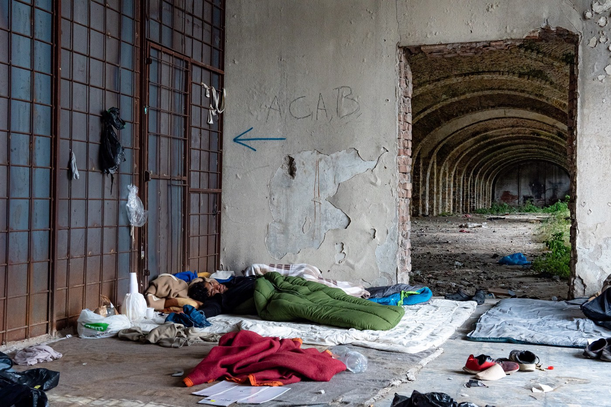
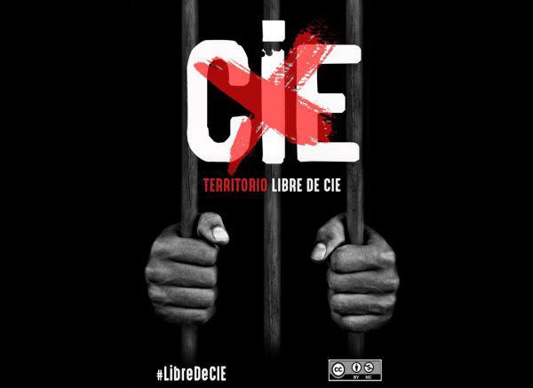

### AYS Daily Digest 25/9/20: German court stopped deportation back to Greece due to Moria conditions
### In Libya, the militia of General Khalifa Haftar has forcibly expelled more than 5,000 people since the start of this year / Trieste documents the suffering of people who came via the Balkan Route / Condemnation of Spain’s reopening of CIES centres / recommended reads & more updates

[Are You Syrious?](@AreYouSyrious?source=post_page-----6044f5d283fe--------------------------------)

[Sep 26](ays-daily-digest-25-9-20-german-court-stopped-deportation-back-to-greece-due-to-moria-conditions-6044f5d283fe?source=post_page-----6044f5d283fe--------------------------------) · 6 min read

### FEATURED

The Bavarian Administrative Court in Munich stopped the impending deportation of a 34\-year\-old asylum seeker to Greece in an urgent procedure\.

The 34\-year\-old from Yemen, who was in custody in Eichstätt in Upper Bavaria, is now free again\. Originally, he was supposed to be deported from Bavaria, SDZ [reported](https://www.sueddeutsche.de/bayern/jemenit-in-eichstaett-gericht-stoppt-abschiebung-1.5043155?fbclid=IwAR12dK59K5fWK0wnSL1ZZOxR-sMTleIzbGRZ2p7dUu2F648Sm6L7mquXsU8) \.
This decision was ′′impeachable “, the court stated in its order\.
In its decision, the court points out that a new application for asylum by the man “would again be rejected as inadmissible” because he was already granted international protection in Greece\. At the moment, however, there is a ‘serious risk‘ of the 34\-year\-old being treated in Greece in a way that is ‘incompatible with human dignity and the fundamental rights guaranteed in Europe\.‘

The court cited reports from non\-governmental organizations, “refugees still do not have secure access to accommodation, food, medical and psychological treatment or the labour market\.”
### LIBYA

> _The eastern forces have forcibly expelled more than 5,000 refugees in 2020, without due legal process or the opportunity to challenge the deportation_ 

The militia of General Khalifa Haftar has forcibly expelled more than 5,000 refugees in 2020, Amnesty International reported\. They criticised the policy of the EU countries in intercepting Libyan refugees and returning them back, only to face the same vicious circle of excessive violations in Libya\. AI report confirmed that the EU “implements policies besieging tens of thousands of Libyan men, women and children in a vicious circle of violations, showing callous disregard for people’s lives and dignity\.”

**Weather alert for the Central Mediterranean\!**

> _Currently and over the next days, the weather in the Central Med is very dangerous for departures\. We hope that people planning to leave [\#Libya](https://www.facebook.com/hashtag/libya?__eep__=6&hc_location=ufi) in the next days are aware and will consider the weather conditions before departure\. — Alarm Phone_ 

### GREECE
### Lesvos

**One week bus for free from the new camp to Mytillini and back**

From 9 am to 2 pm starting Monday a bus will offer free rides from the camp to Mytillini and back at every full hour\.

Only 1,000 of the people can go outside the military camp per day from 8am/8pm\. The new Europe’s largest hotspot doesn’t have showers, nor enough taps, people on the ground testify\.

> _“I did not wash my child w soap & water since the fire\.”_ 

[Join the residents from Pikpa camp](https://www.facebook.com/pikpalesvos/posts/2762845950657485?hc_location=ufi) and make a video/picture with a placard/message to let everyone know why Pikpa must stay open\!

The local group from Pikpa invites everyone to join the group of support:
### [Facebook Groups](https://www.facebook.com/groups/633160610380429/)
### [Save Dignity — Safe Pikpa has 7,083 members\. JOIN the SAVE DIGNITY — SAVE PIKPA COMMUNITY Pikpa camp and Kara Tepe camp…](https://www.facebook.com/groups/633160610380429/)
#### [www\.facebook\.com](https://www.facebook.com/groups/633160610380429/)

**On the EU’s hotspot policy**

Anthropologist and Associate Professor at the University of Bergen, Synnøve Kristine Nepstad Bendixsen, shares her reflections on the EU’s hotspot policy, the refugee camp as a political and repressive space, and the dire need for a new turn in Europe’s asylum policy\.
### [Understanding the inferno on Lesbos: — We need new perspectives on migration to solve this…](https://protectproject.w.uib.no/understanding-the-inferno-on-lesvos/?fbclid=IwAR1zQxbPFXNs140d_XRzAh1AYA2kPMVnwqRACarUywEYFYqq1uJ6RWpfZUU)
### [In this interview, Anthropologist Synnøve Kristine Nepstad Bendixsen shares her reflections on the EU’s problematic hot…](https://protectproject.w.uib.no/understanding-the-inferno-on-lesvos/?fbclid=IwAR1zQxbPFXNs140d_XRzAh1AYA2kPMVnwqRACarUywEYFYqq1uJ6RWpfZUU)
#### [protectproject\.w\.uib\.no](https://protectproject.w.uib.no/understanding-the-inferno-on-lesvos/?fbclid=IwAR1zQxbPFXNs140d_XRzAh1AYA2kPMVnwqRACarUywEYFYqq1uJ6RWpfZUU)
### Samos

Reportedly, there are more than 60 positive cases of COVID \-19 in Samos camp\. The camp is under quarantine\. The capacity of 648 people is today packed with 4,497 people, only exacerbating the existing problematic state\.
### ITALY

> _While the European Union is looking for slimmer, faster and chameleon ways to repel the suffering bodies it has created in decades of wars and exploitation, in Trieste, Lesvos, Bihać, Ventimiglia, Calais, people, brothers and sisters, continue to arrive in a quest for that dignity that, with our privileges and indifference, we deny them every day\._ 

> _Every day, in Piazza della Libertà in Trieste, a group of activists fights racism, violence and borders through the care of the other, using their bodies, time and resources — not for charity but as a political action, as a subversive way towards society that dehumanizes and commodifies people\. — [Francesco Cibati](https://www.facebook.com/francesco.cib?__tn__=%2CdCH-R-R&eid=ARAfTft_ITL3Z12T3bE4gAdNP6OZEMFlauXtPsRDBeMZpN24CcsE0iWiazlOO1bWgSy8Ja12H4nS5dfR&hc_ref=ARTfArwUa71HCqstRf7sR6HEVmG0dck0ki7jW43sO7WdW1vOyWf_Bgpwaq7hvC2OdjY&fref=nf&hc_location=group)_ 

### FRANCE
### Calais

Four deputies from La France Insoumise carried out a symbolic action on Friday by bringing packed lunches to migrants in Calais, to protest against the ban on non\-state\-mandated associations from distributing food and drink to them\.
### Paris

On Tuesday evening, hundreds of people were violently driven from the capital to the Seine\-Saint\-Denis\. The scene was partially repeated on Wednesday, September 23, 2020, this time without violence, local media reported\. Under a bridge in Aubervilliers, everyone was subjected to identity checks\.

Utopia 56 keeps activating its network of «solidarity hosts» to find lodging for the families on the street\. But since the beginning of the coronavirus health crisis, there have been many withdrawals\. On Wednesday night, three families were housed, when it was up to 80 on some nights before Covid\-19\. The others will have to camp, despite the rain, and hope that the next day will bring no police raids and at least some positive change\.
### SPAIN
### Organizations condemn the reopening of detention centres

The Spanish Government has ordered deprivation of liberty of people by reopening the detention centers, putting into operation dysfunctional institutions that are far from being places with guaranteed rights and decent living conditions, Spanish associations have [reported](https://www.apdha.org/apdha-rechaza-reactivacion-de-los-cie/?fbclid=IwAR0xT0isYbDH8QlMthpIgqseFl0314bk3C-ZZCVEWxJy_RGy_AThEORmU3g) \.

> _Now a clear strategy is announced, referring to those people who have just arrived in boats, who are of Algerian and Moroccan nationality or who arrive from Mauritania\. Once again, the use of CIEs as a tool for migration management is reflected, using detention for deportation, where proper identification of people with a need for special protection is crucial\._ 

### Events
### [Live For Moria: Relief for the refugees of Lesvos, Greece](https://l.facebook.com/l.php?u=https%3A%2F%2Fgogetfunding.com%2Fliveformoria%3Ffbclid%3DIwAR2HdYPe6fXrxMRwazoTtaUDiAp2g8XbCqX1DqS3hRs_aP1rK5Uo5PEl0EY&h=AT3Pu5Ggq-8eHaW_0UbpvYP8GB71FqWZAbFzG6fTsEYL7JPmF52bMapc1ObzsQxFPECSHmEb00O7qGmDcWhzkQc2hN91xcaxoSFsYmrkqeJJnBz6MNfpQPTQV-G5m3dbHTFknUOV10c_gQ)
### [LiveForMoria — Μία ημέρα μουσικής για τους πρόσφυγες \(Scroll down for English\) Το Σάββατ&om](https://l.facebook.com/l.php?u=https%3A%2F%2Fgogetfunding.com%2Fliveformoria%3Ffbclid%3DIwAR2HdYPe6fXrxMRwazoTtaUDiAp2g8XbCqX1DqS3hRs_aP1rK5Uo5PEl0EY&h=AT3Pu5Ggq-8eHaW_0UbpvYP8GB71FqWZAbFzG6fTsEYL7JPmF52bMapc1ObzsQxFPECSHmEb00O7qGmDcWhzkQc2hN91xcaxoSFsYmrkqeJJnBz6MNfpQPTQV-G5m3dbHTFknUOV10c_gQ)
#### [l\.facebook\.com](https://l.facebook.com/l.php?u=https%3A%2F%2Fgogetfunding.com%2Fliveformoria%3Ffbclid%3DIwAR2HdYPe6fXrxMRwazoTtaUDiAp2g8XbCqX1DqS3hRs_aP1rK5Uo5PEl0EY&h=AT3Pu5Ggq-8eHaW_0UbpvYP8GB71FqWZAbFzG6fTsEYL7JPmF52bMapc1ObzsQxFPECSHmEb00O7qGmDcWhzkQc2hN91xcaxoSFsYmrkqeJJnBz6MNfpQPTQV-G5m3dbHTFknUOV10c_gQ)

FOR FURTHER READING

Policy overview and analysis of the Greek situation:
### [Greece Struggles to Balance Competing Migration Demands](https://l.facebook.com/l.php?u=https%3A%2F%2Fwww.migrationpolicy.org%2Farticle%2Fgreece-struggles-balance-competing-migration-demands%3Ffbclid%3DIwAR2sQ5Yj0I1PknHF04vG_GrAeSWqs5ibY-xSWTYRN_ILucotXZA1-GuvftQ&h=AT1g5WX-HTIr8d2nTc910mHVz5GWezU36Z2YH9WgA2hMTEwM9G0jtj6bQlUivfyQBqEfW46P_ucZjWX55uhhtwYeuL-acMAKNUEy8MxEWvqVzZJcBDsjE7pxgrDY1FYQalNuUHh-UP08MQ)
### [When he was elected prime minister in 2019, Kyriakos Mitsotakis promised what he called “strict but fair” reforms to…](https://l.facebook.com/l.php?u=https%3A%2F%2Fwww.migrationpolicy.org%2Farticle%2Fgreece-struggles-balance-competing-migration-demands%3Ffbclid%3DIwAR2sQ5Yj0I1PknHF04vG_GrAeSWqs5ibY-xSWTYRN_ILucotXZA1-GuvftQ&h=AT1g5WX-HTIr8d2nTc910mHVz5GWezU36Z2YH9WgA2hMTEwM9G0jtj6bQlUivfyQBqEfW46P_ucZjWX55uhhtwYeuL-acMAKNUEy8MxEWvqVzZJcBDsjE7pxgrDY1FYQalNuUHh-UP08MQ)
#### [l\.facebook\.com](https://l.facebook.com/l.php?u=https%3A%2F%2Fwww.migrationpolicy.org%2Farticle%2Fgreece-struggles-balance-competing-migration-demands%3Ffbclid%3DIwAR2sQ5Yj0I1PknHF04vG_GrAeSWqs5ibY-xSWTYRN_ILucotXZA1-GuvftQ&h=AT1g5WX-HTIr8d2nTc910mHVz5GWezU36Z2YH9WgA2hMTEwM9G0jtj6bQlUivfyQBqEfW46P_ucZjWX55uhhtwYeuL-acMAKNUEy8MxEWvqVzZJcBDsjE7pxgrDY1FYQalNuUHh-UP08MQ)

Encounters and experiences of everyday realities the unaccompanied minors relive day in, day out, across Europe \(Italian\):
### [Migranti\. Trieste\. Il corpo dice più di quanto non possano le parole\.](https://minoristranierinonaccompagnati.blogspot.com/2020/09/migranti-trieste-il-corpo-dice-piu-di.html?fbclid=IwAR297YBoUTMLq-gWObPLsC7Xl_SBc7zkzPwo1dMqvLT014yk52Zl0aGczmE)
### [Corpi\. Uomini giovani, giovanissimi, anche ragazzi \(i cosiddetti ‘minori’\), famiglie talora, con bimbi, anche piccoli…](https://minoristranierinonaccompagnati.blogspot.com/2020/09/migranti-trieste-il-corpo-dice-piu-di.html?fbclid=IwAR297YBoUTMLq-gWObPLsC7Xl_SBc7zkzPwo1dMqvLT014yk52Zl0aGczmE)
#### [minoristranierinonaccompagnati\.blogspot\.com](https://minoristranierinonaccompagnati.blogspot.com/2020/09/migranti-trieste-il-corpo-dice-piu-di.html?fbclid=IwAR297YBoUTMLq-gWObPLsC7Xl_SBc7zkzPwo1dMqvLT014yk52Zl0aGczmE)

A detailed report on social cohesion amongst Syrian refugees and the Turkish host population:
### [Turkey: Syrian Barometer 2019](https://data2.unhcr.org/en/documents/details/78901?fbclid=IwAR1JmMsWastsjqboNxir6HrV4JLDfLBMVng06ZFaGZsSJOaL96jBXoShhGc)
### [Turkey: Syrian Barometer 2019](https://data2.unhcr.org/en/documents/details/78901?fbclid=IwAR1JmMsWastsjqboNxir6HrV4JLDfLBMVng06ZFaGZsSJOaL96jBXoShhGc)
#### [Turkey: Syrian Barometer 2019data2\.unhcr\.org](https://data2.unhcr.org/en/documents/details/78901?fbclid=IwAR1JmMsWastsjqboNxir6HrV4JLDfLBMVng06ZFaGZsSJOaL96jBXoShhGc)

The challenges of being an entrepreneur in a refugee camp:
### [The world’s toughest business school](https://www.economist.com/business/2020/09/24/the-worlds-toughest-business-school?fbclid=IwAR26Ybk8opfwnylOC5abS6VTRWMbOeDJMqBZAyfdbSTHtR0b-414rACqhnw)
### [I N 1996 CIVIL war erupted in what was then Zaire and is now the conflict\-ravaged Democratic Republic of Congo \( DR C\)…](https://www.economist.com/business/2020/09/24/the-worlds-toughest-business-school?fbclid=IwAR26Ybk8opfwnylOC5abS6VTRWMbOeDJMqBZAyfdbSTHtR0b-414rACqhnw)
#### [www\.economist\.com](https://www.economist.com/business/2020/09/24/the-worlds-toughest-business-school?fbclid=IwAR26Ybk8opfwnylOC5abS6VTRWMbOeDJMqBZAyfdbSTHtR0b-414rACqhnw)

**Find daily updates and special reports on our [Medium page](https://medium.com/are-you-syrious) \.**

**If you wish to contribute, either by writing a report or a story, or by joining the info gathering team, please let us know\.**

**We strive to echo correct news from the ground through collaboration and fairness\. Every effort has been made to credit organisations and individuals with regard to the supply of information, video, and photo material \(in cases where the source wanted to be accredited\) \. Please notify us regarding corrections\.**

**If there’s anything you want to share or comment, contact us through Facebook, Twitter or write to: areyousyrious@gmail\.com**
### Sign up for AYS Daily Newsletter
### By Are You Syrious?

Daily news digests from the field, for volunteers, people on the move, journalists, and the general public [Take a look](/are-you-syrious/newsletters/ays-daily-newsletter?source=newsletter_v3_promo--------------------------newsletter_v3_promo-----------)

_Converted [Medium Post](https://medium.com/are-you-syrious/ays-daily-digest-25-9-20-german-court-stopped-deportation-back-to-greece-due-to-moria-conditions-c4a7d906e1c1) by [ZMediumToMarkdown](https://github.com/ZhgChgLi/ZMediumToMarkdown)._
