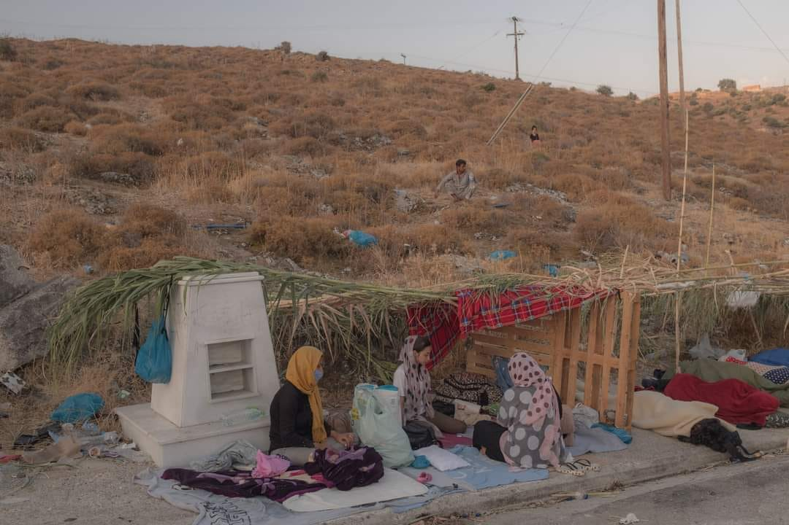
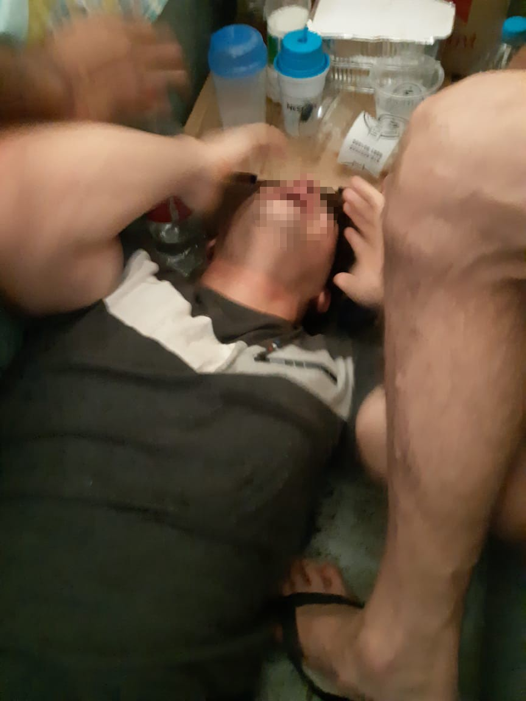

### AYS Weekend Digest 26–27/9/2020: Abuse in detention at Alimos, Greece

First covid\-related death in Malakasa camp in Greece // Updates from \#SavePikpa campaign on Lesvos // More than 200 deaths in the Central Med over the last week // Protests in reception centre in southern Italy // and more…

Lesvos, September 2020, survivors of the Moria refugee camp\. \(Photograph by Aggelos Barai\)
#### Featured: Abuse in police detention in Athens, Greece

AYS team members were contacted by a friend of detainees in Alimos, south of Athens, on Sunday\. On the same day, a 23 year old Palestinian young man attempted suicide at 3PM\.

Fellow detainees asked for medical help right away, and continued asking for help from the officers\. At 5\.46PM no help for the man had arrived, nor any other signs of action from the police officers\.

> The officers told the detainees: “if he wants to die, let him die”\. 

From 5\.52PM the phones went silent from Alimos\. The assumption is that the phones from the detainees were taken\.

This is yet another tragic event where a desperate human being in detention sees no other way out than ending their own life\. And no help from the officers in sight\. Two weeks ago, we [reported](ays-daily-digest-11-09-2020-hunger-strike-in-inhumane-greek-police-station-212060b61c75) about more abuses in the police station of Keratea, in Attica, where detainees had started a hunger strike to protest the appalling conditions they suffered\. We are receiving an increasing number of reports about asylum seekers detained in prisons and police stations for months, having committed no crime\. Allegations include inhumane treatment, violence, refusal of medical help, refusal of legal help, lack of information and unhygienic living conditions\.

SEA
#### More than 200 people died in the Central Med in one week

Over the last week, AlarmPhone report that 6 shipwrecks took place in the Central Mediterranean, killing around 200 people\. Moonbird, the SeaWatch’s aircraft, was on the scene at one of them: despite the presence of a commercial vessel in the area, Italian MRCC did not allow for any rescue, even when people were already in the water\.

■■■■■■■■■■■■■■ 
> **[Sea-Watch International](https://twitter.com/seawatch_intl) @ Twitter Says:** 

> > Again 3 people died trying to cross the #Mediterranean.
Again state authorities remained inactive despite cries for help.
Again a merchant vessel observed the situation without intervening - as ordered by Italian Maritime Rescue Coordination Center &amp; so-called Libyan Coast Guard. https://t.co/ym4Unbodeq 

> **Tweeted at [2020-09-26 11:43:15](https://twitter.com/seawatch_intl/status/1309820827530137600).** 

■■■■■■■■■■■■■■ 

The worst shipwreck took place on the 21st of September but was only discovered last Saturday\. One more proof that EU policies are not just cruel, but are a clear attempt to hide as much as possible what is happening in the stretch of sea between Libya and Europe, turning it into what Italian journalist [Sergio Scandura](https://twitter.com/scandura) had termed a ‘black hole’ of information\. The continuous seizing and blocking of humanitarian vessels operated by Italian authorities goes in this direction as well\.

■■■■■■■■■■■■■■ 
> **[Alarm Phone](https://twitter.com/alarm_phone) @ Twitter Says:** 

> > 🔴 SHIPWRECK off #Libya!

111 people died in a terrible shipwreck off Zuwara, Libya on 21 September. Only 9 of the 120 people on board survived, rescued by a fisherman after days at sea. Together with survivors we try to reconstruct the events. They need urgent medical assistance 

> **Tweeted at [2020-09-26 13:36:14](https://twitter.com/alarm_phone/status/1309849260033269760).** 

■■■■■■■■■■■■■■ 

#### Four boats still missing in the Western Med

AlarmPhone reported that, at the moment of writing four boats are still missing in the Western Mediterranean:
- around 13 people missing between Bab el Ouad, in Algeria and the Balearic islands;
- around 4 people missing between Ceuta and mainland Spain;
- around 59 people \(including 10 women & 2 children\) missing between Boujdour, in the Western Sahara and the Canary islands;
- 31 people missing after having left Dakhla, in the Western Sahara on 25/09\.

GREECE
#### More reception structures in lockdown

Greek authorities have placed under medical quarantine the camps in Thiva and Serres \(previously known as “Georgiki Scholi”\) \. Lockdown measures are extended for camps in Eleonas, Koutsochero, Malakasa, Inofyta, Ritsona, Schisto, as well as the RICs in Leros, Samos and Fylakio\. Measures for these structures will remain in effect until October 9th\.

All other accommodation structures in the country, which had witnessed new limitations to people’s free movement since August 28th, have measures extended until the end of September\.
#### _“Greece guards its borders with absolute respect for International and European Law”, Mitarakis says\._

Migration minister Mitarakis [keeps lying](https://www.real.gr/politiki/arthro/mitarakis_ston_realfm_stoxos_h_mideniki_paramoni_metanaston_se_ebro_kai_nisia-673932/?fbclid=IwAR1rtBGQAmhW4rFI-BHumL-Te_n1TWjIxIYaYA3A2a1Omy2Rzkp0MQLvBMc) about the activities of Greek border force on the [well documented illegal push\-backs and abuses](https://www.theguardian.com/global-development/2020/sep/27/catastrophe-for-human-rights-as-greece-steps-up-refugee-pushbacks?fbclid=IwAR0TPepOwl6A0okxK4qN408M9pxbQM_pmeYAcTGpJN_m3G6pfeh8HNBajHI) \.

He also discussed the cooperation between Greece and Germany in the Aegean Sea\. Both [Mare Liberum e\.V\.](https://twitter.com/teammareliberum/status/1310264747879694338) and German journalists have reported on the German navy ship “standing by” and witnessing illegal pushbacks by the Greek coastguard\.

■■■■■■■■■■■■■■ 
> **[Joel Dullroy](https://twitter.com/joeldullroy) @ Twitter Says:** 

> > A German navy ship stood by as the Greek coastguard pushed migrant boat out of EU waters - a possible international crime. Greece denies illegality. EU lawmakers want an investigation into #pushbacks. An NGO says the Germans must share evidence. @[dwnews](https://twitter.com/dwnews) @[teammareliberum](https://twitter.com/teammareliberum) https://t.co/FF1ue6oO7M 

> **Tweeted at [2020-09-22 13:00:51](https://twitter.com/joeldullroy/status/1308390805221117952).** 

■■■■■■■■■■■■■■ 

Mitarakis stated that “the German government has never questioned the way in which Greece guards its borders\. In the new EU policy, border protection is a priority for all states”, bragging about how Greece “broke” the smuggling chain in the Aegean and reducing arrivals by more that 89% from one year ago _\._

The minister also discussed the recent case of racist protests in the town of Kamena Vourla, where groups of locals blocked the road to stop 39 minors being moved to a hotel in the town\. Minister confirmed that local authorities had only been informed at the very last minute, and stated that these children and teenagers will be hosted in the structure only for a short period of time, before being transferred to other European countries\.

In total, 750 minors have been [transferred](https://twitter.com/daphnetoli/status/1309814597101256704) from the Aegean islands to the mainland in September, within the process of relocation to other European countries\.
#### Resident of Malakasa camp dies of Covid\-19

A 61\-year\-old Afghan, a father of two children, who lived in Malakasa camp, north of Athens, has [died](https://news.yahoo.com/greece-says-first-migrant-dies-195331115.html) at a hospital in Athens, media report\. The camp has been in lockdown on and off for the past six months, with the last measures coming into force on September 7th\. This is the first recorded Covid\-related death in an accommodation structure in the country\.

Protests took place in the camp on Sunday\. “Family members and a group of refugees blocked the side of the national road outside the structure, protesting his death and the lack of basic measures to protect guests”, media [report](https://www.efsyn.gr/ellada/koinonia/261638_entasi-sti-malakasa-meta-ton-thanato-prosfyga-me-koronoio) \. Data and figures on the camp change a lot according to the source: while IOM data [reportedly state](https://www.efsyn.gr/ellada/koinonia/261638_entasi-sti-malakasa-meta-ton-thanato-prosfyga-me-koronoio) that “the structure, with a capacity of 1,589 seats, operates at an overcrowding of 132\.4%”; The Hellenic National Defence General Staff, which is responsible for the camp, [state](https://geetha.mil.gr/wp-content/uploads/2020/09/20200925_en.pdf) that the capacity is 3,052 and the population is 2,949\.
#### Lesvos: Save Pikpa

Greek media [revealed](https://www.stonisi.gr/post/11720/ekkenwste-to-pikpa-ews-tis-15-oktwvrioy) a letter sent by the Secretary General of Social Solidarity and Poverty Control of the Ministry of Labor and Social Affairs George Stamatis to the Lesvos police department, authorising the eviction of the area on which Pikpa camp is by October 15th\. Only a few days ago, minister Mitarakis had revealed the government intention to shut down the independent structure and move all residents within the new camp Moria 2\.0\. It was also revealed that the municipality\-run camp in Kara Tepe will be closed as well\.

Dunya collective has interviewed Carmen, one of the volunteers working in Pikpa — watch the video below:

■■■■■■■■■■■■■■ 
> **[DunyaCollective](https://twitter.com/DunyaCollective) @ Twitter Says:** 

> > ❗SHARE❗

PIKPA, a self-managed camp for most volnurable refugees at #Lesvos, is in GREAT DANGER OF BEEING EVICTED by Greek government on October 15.

We spoke with Carmen, active at the community based project for years.

#SavePikpa 
#LeaveNoOneBehind
#moriastory https://t.co/YvRBXwaRXK 

> **Tweeted at [2020-09-27 15:25:09](https://twitter.com/dunyacollective/status/1310239057553784839).** 

■■■■■■■■■■■■■■ 

As Carmen states: while conditions in the new Moria 2\.0 camp are reported as worse than in the old camp, “the Greek government has now decided to attack and erase and close all the alternatives in the island for dignified accommodation”\.

Pikpa camp is much more than a camp, “it is a struggle for solidarity, equality and the dignity of people”, a demonstration that there is no need to close thousands people in overcrowded and unsanitary camps, forcing them to live in inhuman conditions\.

\#SavePikpa
#### Containment, deterrence, return: Updates from Moria 2\.0

[Legal Centre Lesvos](https://www.facebook.com/LesvosLegal/posts/3576509535721067) published a detailed analysis of the situation since the fire:

> In the three weeks that have passed since the fires that destroyed Moria refugee camp, the European Union and Greek authorities have seized upon this opportunity to further their pre\-existing policy objectives\. A new containment camp has been built, with financial support from European institutions and the material support of UNHCR; Member States have made and reneged upon relocation pledges; the Greek authorities’ assault on those in solidarity with migrants continues, as manifested by the recent declaration that Pikpa camp — run by a local grassroots organisation — will be forced to close; and the European Commission has reaffirmed its commitment to containment, deterrence and return, as stated in the new Migration Pact\. 

> The gulf between declarations made at the European level, including the Commissioner for Home Affairs’ promise of ‘no more Morias’, and the reality for migrants in Lesvos, could not be more stark\. The new camp’s orderly facade, with its rows upon rows of UNHCR\-branded tents, belies its dysfunctional and fundamentally inhumane reality\. The site is exposed, and vulnerable to inclement weather\. Greek authorities are still conducting searches with metal detectors on site, and migrants have found bullet casings around the camp owing to the site’s former use as a shooting range\. There are no showers, leaving people to wash in the sea or with bottled water\. Food is still distributed just once daily, and the majority of people in contact with Legal Centre Lesvos have reported that they are hungry\. The nights are growing colder, and people are sleeping on the cold ground without mattresses, warm clothes, or adequate blankets\. 

> \[…\] There remains no official announcement on how the camp will function — that is to say, whether it will remain temporary and controlled, or permanent and ultimately closed\. Similarly, there has been no announcement from the Asylum Service about when the offices in Lesvos will be re\-established, and how interviews and other procedures will be conducted\. 

> \[…\] authorities have made no effort to identify vulnerable people presently in the quarantine sites\. \[…\] It has been announced that vulnerability assessments will not take place in the new camp — effectively denying those entitled to procedural or reception guarantees the ability to access their rights\. 

> The Greek authorities’ pursuit of detention continues, despite the ongoing COVID\-19 pandemic and the associated global call to end the detention of migrants and asylum seekers\. Over thirty people who were formerly detained in Moria camp’s pre\-removal centre, PRO\.KE\.K\.A, have been apprehended by authorities and transferred to a detention centre in mainland Greece, in Xanthi\. There are still no official deportations taking place, and police stated that their transfer was for practical reasons \(owing to the lack of detention capacity in Lesvos\) as opposed to facilitating their deportation — which is, for many, the sole reason stated for their detention\. 

On Sunday, people have been denied exit from the camp, “because it is Sunday”, Kathy Fallon [reports](https://twitter.com/katymfallon/status/1310186278474985486) \. Also, Dephne Tolis [report](https://twitter.com/daphnetoli/status/1309548732661280768) of metal detectors installed at the camp’s entry point, and of residents being searched for sharp or metal objects before accessing the camp\. Mission Lifeline reported that an object resembling a mine was unearthed on the premises on the camp:

■■■■■■■■■■■■■■ 
> **[Simona #AllRefugeesWelcome](https://twitter.com/simonajeger) @ Twitter Says:** 

> > Reportedly an object suggestive of a mine has been found in #KaraTepe today. @[YourAnonCentral](https://twitter.com/YourAnonCentral) @[SEENOTRETTUNG](https://twitter.com/SEENOTRETTUNG) @[N_Waters89](https://twitter.com/N_Waters89) @[EliotHiggins](https://twitter.com/EliotHiggins) 

> **Tweeted at [2020-09-27 19:54:59](https://twitter.com/simonajeger/status/1310306966711840768).** 

■■■■■■■■■■■■■■ 

#### Solidarity with those arrested for Moria fire

Thessaloniki based squatted factory Fabrica Ifanet pubished a statement in solidarity with the people arrested for the fire in Moria camp\. Read it [HERE](https://yfanet.espivblogs.net/2020/09/25/allileggyi-se-osoys-katigoroyntai-gia-tin-exegersi-sti-moria/?fbclid=IwAR3qUoG57-DytB2hNnbwrpNDE0uwGU0w7BB3lW_JMHcPPYWb9Jq7DtS_J3s) \(in Greek\) \.

ITALY
#### Protest in Benevento reception centre for lack of water

On Saturday, people on the move hosted in the reception centre of the town protested due to the lack of water in the centre, local media [report](https://www.ottopagine.it/bn/cronaca/229898/covid-proteste-al-centro-migranti-che-ospita-i-positivi-foto.shtml?utm_source=dlvr.it&utm_medium=twitter&utm_campaign=ottopagine) \. Furthermore, within the centre, five people have tested positive for Covid\-19, but their transfer has kept being delayed\. Management of the centre dismissed the protest, while institutions called for an inspection\.
#### ‘Active quarantine’ for migrant farm workers in the Val di Non region

In the north\-eastern Val di Non area, over the last month, more than 1,700 migrant farm workers have been tested for coronavirus after some workers presented symptoms\. 54 positive workers were put in quarantine\. Not to slow down the fruit harvesting season of this productive area, local authorities came up with the ‘ [active quarantine](https://www.ladige.it/news/cronaca/2020/09/27/val-non-raccoglitori-54-casi-positivit-lavori-vanno-avanti-spediti) ’ for all the workers who had been in contact with those who had tested positive\. This means that workers have to carry on the harvesting with increased safety measures\.
#### Secret agents, interceptions, and fake news: the story of the criminalisation of the Iuventa

We have reported for years about the seizing of the Jugend Rettet vessel in 2017, the trial faced by their 10\-strong crew, and the electoral use of this case by both right\-wing party Lega Nord and populist Cinque Stelle to win the 2018 national election\. Daniel Trilling wrote recently about the case, recapping five years of an improbable criminal case, worthy of an Italian ‘poliziottesco’ B\-movie, used by Salvini and his partners to boast racist and anti\-migration rhetorics\. Read it [HERE](https://www.theguardian.com/news/2020/sep/22/how-rescuing-drowning-migrants-became-a-crime-iuventa-salvini-italy?fbclid=IwAR1Iz_yyKUMzRl4wKhsfl9MNS_TXn_SE29dbN2y7LWdSNmLBHlkU8V2E17k) \.
#### Baobab Experience needs your help

‘Solidarity doesn’t go on holiday’ is the motto of the [fundraising](https://www.produzionidalbasso.com/project/baobab-experience-la-solidarieta-non-va-in-vacanza/) that is ending on Wednesday to help one of the most active grassroots group in supporting people on the move in the streets of Roma\.

Donate if you can\!

BALKANS
#### ‘A very long line’, the Balkan route as seen from Trieste

SWITZERLAND
#### Swiss voters halt right wing anti\-immigration turn

Over the weekend, Swiss citizens [voted](https://www.swissinfo.ch/eng/politics/swiss-set-to-rebuff-right-wing-attack-on-eu-immigration/46040240?fbclid=IwAR2o6Fsgaq80C_miJyUByu6A9bzMFeDfbEIgL89pNEC8ItJ9zxkzdvOoqzU) on a proposal to scrap a major immigration accord — regarding free movement of people across the country — with the European Union\. The proposal, which was launched by the right\-wing Swiss People’s Party, was rejected by 61\.7% of the voters\.

FRANCE
#### Squat in Saint\-Etienne threatened by eviction

About forty people are currently living in the [squat of the former post office](https://radar.squat.net/en/saint-etienne/squat-de-lancienne-poste-de-solaure) , including school children, people in poor health and people undergoing training\.

 \)](assets/dafb14261187/1*OoDZ8x2JPv-6NakbWB9PSg.jpeg)

Solaure ex\-post office squat, St\. Etienne \(Photo via [Enoughisenough14](https://enoughisenough14.org/2020/09/27/saint-etienne-france-imminent-eviction-of-the-squat-of-the-post-office-of-solaure/) \)

On Tuesday September 22nd, a new judgment was handed down at the Administrative Court of Lyon\. The City of Saint\-Etienne is claiming a housing project\. The court handed down its decision on Thursday September 24th with the order to leave the premises and the possibility of immediate eviction by the police\. The residents are, as of today, in permanent risk of being thrown out onto the street without accommodation\.

Read more [HERE](https://enoughisenough14.org/2020/09/27/saint-etienne-france-imminent-eviction-of-the-squat-of-the-post-office-of-solaure/) \.

DENMARK
#### “Damascus is safe”, says Danish government

[Danish activist](https://www.facebook.com/lenekjj/posts/3262078077240791) reported about the latest _exploit_ in the county’s migration politics: Damascus is safe\! The government has decided it\. In this way they can began to withdraw residence permits for Syrians in the country\.

> It is written directly in the refusals from the Refugee Board that they are well aware that the refusals are a violation of the European Convention on Human Rights on the right to family life\. 

> However, this is weighed against the interests of the Danish state — and the state’s interests are obviously destroying families\! 

Those who will not decide to go to Damascus voluntarily will be placed in a detention centre with very poor conditions and forcibly separated from their families\.

A number of people already decided to leave Denmark for Germany, in order to avoid this\.

ICELAND
#### Iceland to welcome 15 more people from Moria

Icelandic authorities boasted about their decision to welcome 15 people from Moria, on top of their annual ‘quota’ of 85 people, media [report](https://www.ruv.is/frett/2020/09/25/iceland-to-welcome-moria-fire-refugees) \. They intend to prioritise Syrian families\. Iceland welcomed 52 in 2018, 74 last year, and plans for 100 this year\.

EU
#### Frontex’s report on cooperation with third countries

Statewatch published a [report](https://www.statewatch.org/news/2020/september/frontex-report-on-cooperation-with-third-countries-in-2019/?fbclid=IwAR0qOVSGq05R2__yL_ZiKDvOP5JLwA1020C2ZGxkRfE89EoXS-livNzu_z4) authored by Frontex and circulated to the European Commission, Council of the EU and European Parliament in June 2019 in which the agency stresses its role in information gathering across the Mediterranean, in implementing European\-led border control in non\-European countries and in increasing the number of deportations\.
#### No public disclosure for EU Commission’s documents on McKinsey consultancy

Earlier this summer, Ludek Stavinoha and Apostolidis Fotiadis published the [results](https://balkaninsight.com/2020/06/22/asylum-outsourced-mckinseys-secret-role-in-europes-refugee-crisis/) of their investigation on the role of McKinsey firm in implementing the EU\-Turkey deal\. The EU Commission only allowed for the public disclosure of a heavily redacted version of the documents relating to the awarding of the consultancy and the consultancy itself\. Now, the Commission has confirmed its decision despite an appeal to the EU Ombudsman\.

■■■■■■■■■■■■■■ 
> **[Ludek Stavinoha](https://twitter.com/LudekStavinoha) @ Twitter Says:** 

> > "We are dealing with the question whether citizens have a right to know what ideas shaped EU policies that have diminished the rights of thousands of people on the Greek islands."
 
My reply to EU Ombudman re @[vonderleyen](https://twitter.com/vonderleyen)'s decision to obstruct transparency in the McKinsey case. https://t.co/5sVJCLv9NT 

> **Tweeted at [2020-09-26 16:28:43](https://twitter.com/ludekstavinoha/status/1309892669422927873).** 

■■■■■■■■■■■■■■ 

GENERAL
#### Against the ‘good refugee, bad migrant’ dichotomy

Stefan Schlegel [published](https://www.politico.eu/article/stop-discriminating-against-economic-migrants) an important piece on the discriminations against ‘economic migrants’ \- people fleeing poverty\. Over the last decades, and especially the last years, the words immigrant, migrant and economic migrant have been used to define those people who are not worthy of coming to the EU legally\. The ‘good refugee’ and the ‘bad migrant’ is a false dichotomy that plays into the divisive and exclusionary policies on migration of European institutions, foster racist rhetorics and divert public attention from the fact that migration is not the problem, borders are\.

FUTURE EVENTS

The prolongation of the Joint Way Forward on migration issues between the EU and Afghanistan is an online event on 28th September 2020 \(16:00–17:30 PM\) \. among the topic discussed: insecurity as a big challenge for deportees in Afghanistan; situation of deportees after deporting; causes of not being able to implement Joint Way Forward agreement\. Find out more about it [HERE](https://www.facebook.com/AmasoAfg/posts/3683158565047734) \.

WORTH READING
- [**From corridor to encampment\. Mapping EU strategies of containment in Serbia**](https://movements-journal.org/issues/08.balkanroute/14.contenta--from-corridor-to-encampment.html) **\.** From 2015 to 2017, the state of Serbia has rehabilitated, refurbished, and built new camp facilities using European funds\. Following a European strategy of containing and impeding migration movements from south to north, Serbia has kept thousands of people outside of the western EU territory\. Whether under the label of transit, reception, or asylum centres, camps have pushed, held, and left thousands of people on the move hopeless, without clear future alternatives, living in legal and humanitarian limbos for years\.
- [**For Afghanistan, the most unsafe country, return is also the standard\.**](https://www.facebook.com/AmasoAfg/posts/3683272068369717) Interview with Abdul Ghafoor, director of AMASO about the situation of Afghan deportees and the trend of re\-migration among those who were deported in the past couple of years \(in Dutch\) \.
- [**More appearance than reality?**](https://verfassungsblog.de/mehr-schein-als-sein) A legal analysis of the Migration and Asylum pact reveal the legislative ambiguities and operational pitfalls of the EU asylum package \(in German\) \.

**Find daily updates and special reports on our [Medium page](https://medium.com/are-you-syrious) \.**

**If you wish to contribute, either by writing a report or a story, or by joining the info gathering team, please let us know\.**

**We strive to echo correct news from the ground through collaboration and fairness\. Every effort has been made to credit organisations and individuals with regard to the supply of information, video, and photo material \(in cases where the source wanted to be accredited\) \. Please notify us regarding corrections\.**

**If there’s anything you want to share or comment, contact us through Facebook, Twitter or write to: areyousyrious@gmail\.com**

_Converted [Medium Post](https://medium.com/are-you-syrious/ays-weekend-digest-26-27-9-2020-abuse-in-detention-at-alimos-greece-dafb14261187) by [ZMediumToMarkdown](https://github.com/ZhgChgLi/ZMediumToMarkdown)._
