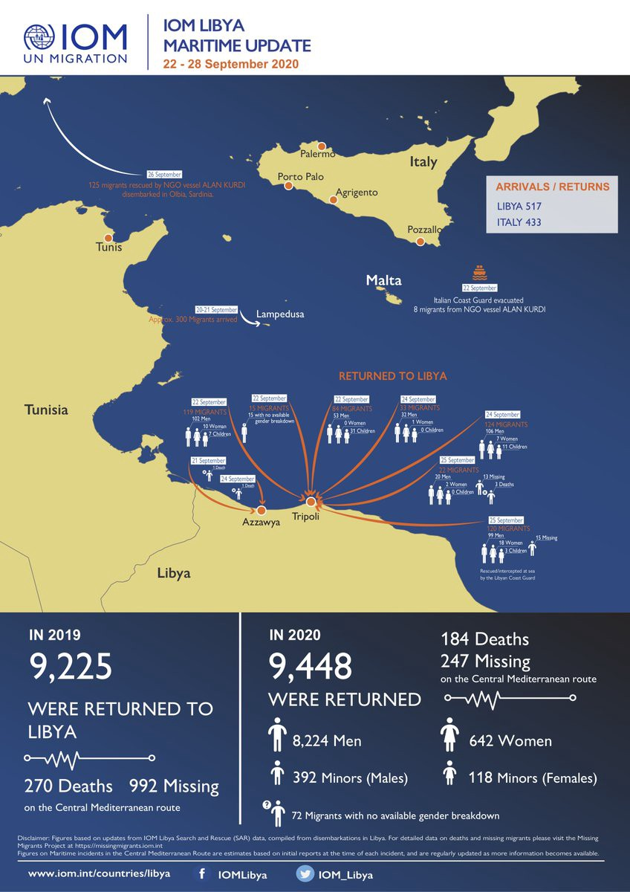

### AYS Daily Digest 28/9/20: A ruling that could pave the way for thousands of unlawfully deported from the UK
#### On the situation in Greece / Italy — after the landing of the 125 on board Alan Kurdi / France — police evicted a squat in Montpellier / Home Office Under Scrutiny for eviction plans / The Cognitive Dimensions of the New EU Pact on Migration and Asylum and other recommended reads

#### FEATURED

It was ruled that the decision to reject the asylum claim of a 27\-year old gay woman, who was subsequently unlawfully deported from the UK to Uganda where she had been gang\-raped, was unlawful as it did not give her sufficient time to obtain evidence to support her case\. This ruling against the Home Office is a rare happy end to the stories of victims in thousands of such asylum cases that were decided under the Home Office’s “detained fast\-track” system that ended in 2015\.

There were 1,212 asylum [applications lodged](https://l.facebook.com/l.php?u=https%3A%2F%2Fwww.gov.uk%2Fgovernment%2Fpublications%2Fimmigration-statistics-year-ending-june-2020%2Fexperimental-statistics-asylum-claims-on-the-basis-of-sexual-orientation%3Ffbclid%3DIwAR3CWTQP2oOg6nVMWpRQJTWVOos1HCVY1HWYQa_qBze-X-GxUG_vGJe6EUY&h=AT1FmGKb9nQCY5nzriOA2vguOnSeBNoNVLPlr9sjfFzZUQYO622EuazkM_XBBXl7uL--B2rMk5e1vDymF80jbI_8SD4fY5mJIxeWooAxAVuRhLHDtvkIzYD4U_Csx9B2CeqIeI8yNGhaWQ&__tn__=R]-R&c[0]=AT3MBilfpfU2-lTWUZwW25GcTgYKqPhUrfm_ebKRinovtDHd5oDKwSNARgYzde5jjvQq2ji5MRozgQxk4Cww45Az038Kh_yMjfPQeDdZx9UiotyivjOCLyThCCq3wpscwB-GhudtqwVvq0CH4EeaSTWGnTjfG5XGsXkpaZzAkRMuF0Hk1acEQVWzlbub5MZLPi9nIWPwTPZ92cSp) in the UK in 2019, where sexual orientation formed part of the basis for the claim \(LGB asylum applications\), representing 3% of all asylum applications\. For most nationalities, LGB asylum applications account for a small proportion of total asylum applications\. However, although numbers are relatively small, just under half of all applications received from Ugandan \(43%\) and Malaysian \(40%\) nationals had a sexual orientation element\.

■■■■■■■■■■■■■■ 
> **[Eiri Ohtani](https://twitter.com/EiriOhtani) @ Twitter Says:** 

> > #EUMigration policy makers are smitten with the idea of accelerated procedures to keep asylum seekers out&amp;deport them quickly. The UK lesson has been clear: such a system is incapable of assessing claims fairly. A policy fantasy that will only lead to a human rights disaster. 

> **Tweeted at [2020-09-28 13:38:59](https://twitter.com/eiriohtani/status/1310574730211217411).** 

■■■■■■■■■■■■■■ 

#### LIBYA

■■■■■■■■■■■■■■ 
> **[Jeff Crisp](https://twitter.com/JFCrisp) @ Twitter Says:** 

> > Strange. A senior IOM staff member said a couple of weeks ago that the work of the Libyan coastguard should be described as 'search &amp; rescue' rather than  'interception &amp; return'. 

> **Tweeted at [2020-09-28 20:14:33](https://twitter.com/jfcrisp/status/1310674275871981568).** 

■■■■■■■■■■■■■■ 

#### GREECE
### Lesvos

A proposal to [create a new](https://www.stonisi.gr/post/11734/kyt-kai-kataylismos-pane-sto-kameno-dasos?fbclid=IwAR3Kbv1wHg8jNDE5WGjPbi6cYkXoLKX4pwngdjT9xhGcsuHY5PuShMLnZSA) ‘reception and identification centre’ structure with a capacity of 2,500 people, and a planned 500 employees overall, in the area of ​​the former shooting range of Kamenos Dasos in central Lesvos seems to have been passed, as the majority of Mytilene municipal authority confirmed\. The area belongs to the administrative area of the Municipality of Mytilene\. Although the conditions on frontline islands like Lesvos has not changed in meaningful ways in the past few years, the same pattern of migration and reception policies seems to continue into 2021\.

In the meantime, more and more questions are being raised widely on the discrepancies in the official capacity numbers issued by the authorities\.

■■■■■■■■■■■■■■ 
> **[Clara Anne Bünger](https://twitter.com/C_AB_) @ Twitter Says:** 

> > How does this work @[MigrationGREECE](https://twitter.com/MigrationGREECE)? Didn't you update the capacity of the R.I.C. /Hotspot on #Lesvos after the burn down of #Moria? Even one day after - the same capacity. And now: Still the same capacity in #KaraTepe as the former camp of Moria? @[f_grillmeier](https://twitter.com/f_grillmeier) 
#refugeesGR https://t.co/jNZqjITpIw 

> **Tweeted at [2020-09-28 19:28:14](https://twitter.com/c_ab_/status/1310662621985734658).** 

■■■■■■■■■■■■■■ 

The 2nd Primary School of **Mytilene** has successfully welcomed refugee children in reception classes for two school years\. However, some of the parents managed to introduce their racist viewpoints in this context, as reported by locals and the [local media](https://l.facebook.com/l.php?u=https%3A%2F%2Fwww.stonisi.gr%2Fpost%2F11747%2Fkata-ths-foithshs-prosfygopoylwn-sto-sxoleio-twn-paidiwn-toys%3Ffbclid%3DIwAR3R464wLErQ16cqcdoMimWMmRnzLRZqIKHNKqW70vGz0YnCGxra69HWXAY&h=AT1k2C3llKCh4qUKRN6RkEtAIqm7EwySl6tpursFtgy_B3VepfdJLFZGKDygiwl9cmGYfGfMVYR4MygEkR0xsli5b-TX0DtSnQh6MgeFIg5B_8p1qW7HDDwNuFIyfmiad5Jr-773MqKkuQ&__tn__=R]-R&c[0]=AT2hW8Cp-SRFVSakCLsENqzEHLr1rP4Fu7HaYdjBRslLVpMLc9hdjqqML9xCoE6_KzpNkuutQFQKY5F4D5bo1Jlr34HTkekGUe1HYQagyE1mphvOTuIlMnEbOVrLs9zCXc-UsQf28GBrdpqpJoY7p5nLqRTQx9bUOjGXtMNWTj0Qp-XIrJdhkAzSMWIla9e6_qjfgxmsu11QKDTb) \.

As many have reported, the situation in the “Moria 2”, as many call it, is dire: tents are not going to withstand bad weather, and rain will turn the area into a swamp\. Basic facilities such as showers are missing, and food is only distributed once daily, one of the activists who was there reported\. Here is an update on ‘Moria 2’:

■■■■■■■■■■■■■■ 
> **[refocusmedialabs](https://twitter.com/refocusmedialab) @ Twitter Says:** 

> > One week since being forced to enter the new camp and still no showers. Today, without saying more than "because it's Sunday", no one was allowed to leave camp. The physical and mental damage from this structural violence is immeasurable. #EuropeMustAct https://t.co/iQNNvSftwA 

> **Tweeted at [2020-09-27 21:44:40](https://twitter.com/refocusmedialab/status/1310334566805233664).** 

■■■■■■■■■■■■■■ 

All the while, close to the burnt\-down camp, many are sleeping rough, with not many solutions available to them:

■■■■■■■■■■■■■■ 
> **[Franziska Grillmeier](https://twitter.com/f_grillmeier) @ Twitter Says:** 

> > Since the fire in #Moria, dozens of people with an accepted refugee status are sleeping outside the burnt camp structure. They are not allowed inside the new camp &amp; at the same time are not allowed to leave the island. 
They don’t get any food supplies, no water, no electricity. https://t.co/TTWQ16S2JT 

> **Tweeted at [2020-09-25 12:33:51](https://twitter.com/f_grillmeier/status/1309471173512777728).** 

■■■■■■■■■■■■■■ 

Transfers of people from Lesvos to the mainland have been announced\.

■■■■■■■■■■■■■■ 
> **[Bruno Tersago](https://twitter.com/BrunoTersago) @ Twitter Says:** 

> > Greek authorities are moving people from camp in Kara Tepe to the mainland https://t.co/KF358RD3YQ 

> **Tweeted at [2020-09-28 18:42:17](https://twitter.com/brunotersago/status/1310651057652068352).** 

■■■■■■■■■■■■■■ 

However, the official rhetoric of IOM sheds a light on the core reasons for such a move, citing not a more efficient reception and asylum system and alleviating the suffering of people who have been struggling throughout their time on Lesvos, but rather “in the scope of the Government’s endeavors to decongest the island”\.

> The EU funded HELIOS pilot scheme will offer beneficiaries accommodation and administrative support for two months in order for beneficiaries to find long — term accommodation in apartments that will be rented in their names as part of their integration pathway into the Greek community\. 

■■■■■■■■■■■■■■ 
> **[Եհҽմɾցíɑ_ցօҽԵíɑ ⛧](https://twitter.com/Theurgia_Goetia) @ Twitter Says:** 

> > 65 #RefugeesGR φεύγουν σήμερα από Χίο για Γερμανία.
#chios #relocation #reunification 

> **Tweeted at [2020-09-28 07:49:25](https://twitter.com/theurgia_goetia/status/1310486760363827202).** 

■■■■■■■■■■■■■■ 

#### ITALY
### Ten people tested positive among those disembarked from Alan Kurdi vessel

The 125 people who disembarked on Friday off the Sea Eye’s Alan Kurdi at the industrial port of Olbia will [reportedly](http://www.farodiroma.it/olbia-la-diocesi-di-tempio-pausania-si-prende-in-carico-i-10-migranti-positivi-dellalan-kurdi-il-centro-astalli-non-si-possono-lasciar-morire-in-mare-le-persone/?fbclid=IwAR3tJrL2Mu_kQLl4ylc0wfeo71TgAl7gF_wb9bvnqIYXywSs5WB2gGni44Q) be temporarily hosted in the maritime station and in another port building\. The diocese of Tempio Pausania will host the 10 people among them who were tested positive for Covid\-19\. The rest of the people were planned to be hosted in four provinces: Sassari, Cagliari, Nuoro and Oristano\. However, as officials confirmed, only 25 people will be received by Italy, while the others are planned to be relocated to other EU Member states\.

In the meantime, many have lost their lives trying to reach European shores, while the EU policies shift towards aggravating the situation and facilitating crime, trafficking and ultimately, more human suffering\.

> “Close to the pain of the families of the victims, we want to reiterate that letting men, women and children die at sea, in the indifference of governments, institutions and civil society is an unacceptable evil of our time\.” — Centro Astalli 

The draft for a new Italian decree on migration [reportedly](https://www.infomigrants.net/en/post/27597/italy-new-decree-on-migration-ready-salvini-regulations-out?fbclid=IwAR3qQSkI5HK8ySHxd1WTDNl0ND5M3krKwhQH_JSSe728IVyDwCne-E-ZsEs) includes a reform of the migrant reception system, the broadening of conditions that allow for applying for humanitarian protection, and the possibility to convert stay permits into work permits\.
#### FRANCE
### Eviction in Montpellier

On the morning of Friday, September 25th, the police evicted a squat in Montpellier, leaving about thirty people without a solution, half of them children, [_Squat Net_](https://en.squat.net/2020/09/25/montpellier-the-police-evict-a-squat-in-rue-triolet-eight-families-with-young-children-find-themselves-without-solution/) reported\.

> The network of solidarity has allowed the families to find a place to stay for a few days, but nothing stable\. Some children who left this morning for school will bitterly discover this afternoon that they no longer have a home\. A construction company is on site to seal the entrances, the toilets have already been broken\. 

> This eviction is part of an offensive against squats\. At the end of August, the media repeated over and over again the story of a couple from Lyon, distraught by the occupation of their second home by a family\. 

#### UK

■■■■■■■■■■■■■■ 
> **[Care4Calais](https://twitter.com/Care4Calais) @ Twitter Says:** 

> > Last month Britain First stormed into the Daresbury Hotel and banged on the door of a family of eight. The youngest of the six kids was just 7 months old. After harassing them on camera, the parents were left traumatised. They had to explain to their kids what racism means. (1/5) https://t.co/otGYOakYaW 

> **Tweeted at [2020-09-28 19:11:44](https://twitter.com/care4calais/status/1310658470530646017).** 

■■■■■■■■■■■■■■ 

### Home Office under scrutiny for eviction plans

Thousands of [asylum seekers](https://www.theguardian.com/uk-news/2020/sep/19/home-office-plans-to-evict-thousands-of-refused-asylum-seekers) currently in hotel accommodation are facing eviction amid the UK’s second wave of coronavirus\. A letter from the [Home Office](https://www.theguardian.com/uk-news/2020/sep/19/home-office-plans-to-evict-thousands-of-refused-asylum-seekers) to charities stated evictions of rejected asylum seekers will take place “with immediate effect\.” It was also revealed this week that the Home Office plans [weekly flights](https://www.infomigrants.net/en/post/27430/uk-government-plans-weekly-flights-to-return-channel-migrants) to return migrants who have arrived in the UK\. Both these moves fall as the UK Parliamentary Public Accounts Committee released its [report](https://publications.parliament.uk/pa/cm5801/cmselect/cmpubacc/407/40705.htm#_idTextAnchor003) which strongly criticises the Home Office’s approach to immigration enforcement, ECRE recalls\.
#### WORTH READING

The system creates disempowered adults, unresourced, unprepared, dysfunctional in a European society, so different from their own\. We make them another brick in a wall\. From Betterdays Lesvos:

[](https://l.facebook.com/l.php?u=https%3A%2F%2Fmedium.com%2F%40betterdaysngo%2Fanother-brick-in-the-wall-cd3bf128e918%3Ffbclid%3DIwAR2DBTSqMfgfPEsW7s0NFDU4mNqpJpQ_JcR1AOm5XbXG53VMmHnDjdMDFYE&h=AT1RoZxQdAtxz5eS5Dafk-VtCQ1O50TSSHSrwffMsE0yPTamY2E2ikHZ65MYObmifxchfcwRTTOHWDMiZgcDbydNnZUhkG-W0Xv73Ax_9NXsTO1IfyDXF4mA7b2VbAgo5w&__tn__=R]-R&c[0]=AT0H_ha-S3C_Z3kosOxVIqurraKy7w9Ajovk1UM20ex3Y_ugol27Twnb8m4l6z6pF8P_rAI6N_lvPcdPUJd4E2LT4K030T_iym-azXoHA5cvEG_b1c_GVqstkYAxdZuyLDHZccyusEdNZOz8mFv4s6AVlDpxEk7udNVg66QcNQTWECDAqu9BpdlTVyZ7PB1NmsW_ygRi5w)

/Podcast/ Wave Thessaloniki co\-founder Hope Barker speaks to ‘The New Arab’ about the situation for single young men in Greece:

Greece Struggles to Balance Competing Migration Demands:

The Cognitive Dimensions of the New EU Pact on Migration and Asylum:

**Find daily updates and special reports on our [Medium page](https://medium.com/are-you-syrious) \.**

**If you wish to contribute, either by writing a report or a story, or by joining the info gathering team, please let us know\.**

**We strive to echo correct news from the ground through collaboration and fairness\. Every effort has been made to credit organisations and individuals with regard to the supply of information, video, and photo material \(in cases where the source wanted to be accredited\) \. Please notify us regarding corrections\.**

**If there’s anything you want to share or comment, contact us through Facebook, Twitter or write to: areyousyrious@gmail\.com**

_Converted [Medium Post](https://medium.com/are-you-syrious/ays-daily-digest-28-9-20-a-ruling-that-could-pave-the-way-for-thousands-of-unlawfully-deported-f5b5436bf837) by [ZMediumToMarkdown](https://github.com/ZhgChgLi/ZMediumToMarkdown)._
