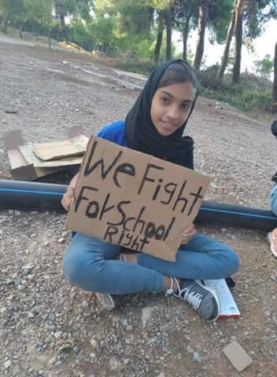
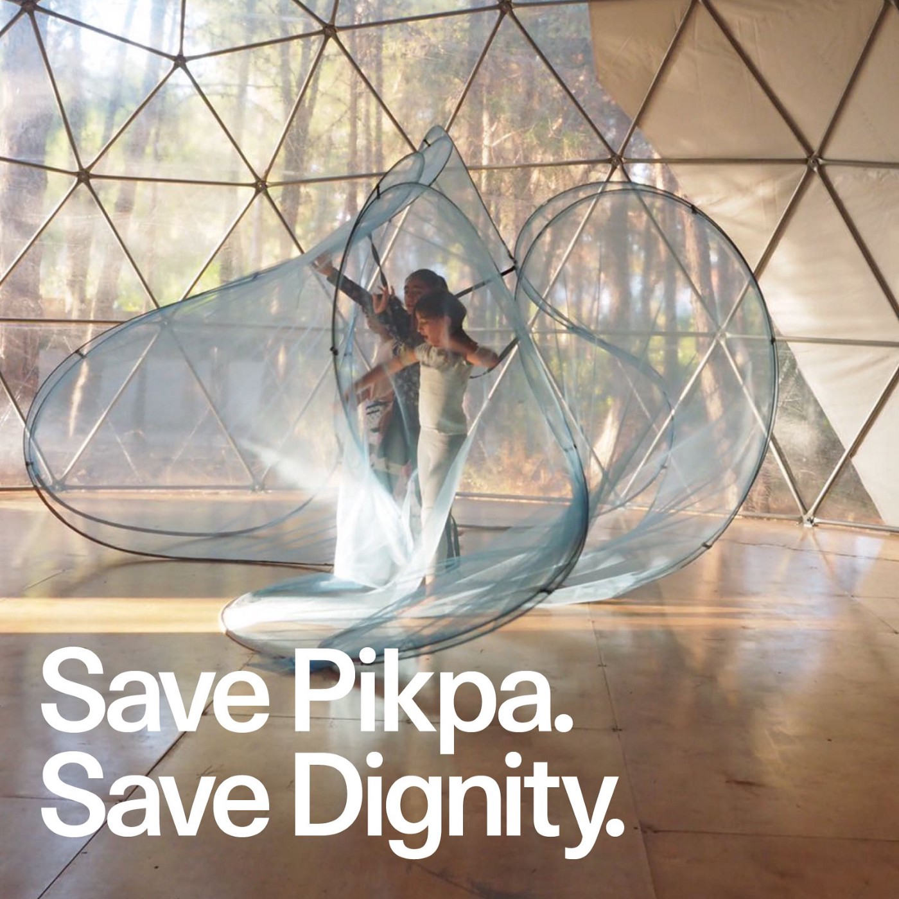
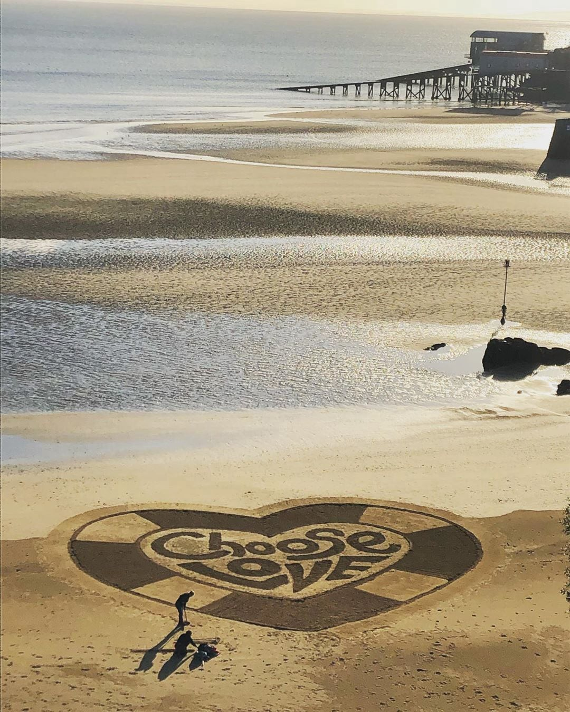

### AYS Daily Digest 29/09/2020 — Greece Ramps Up Persecution of NGOs
### Illegal Pushbacks in Cyprus///Mob Violence near Velika Kladuša Against People on the Move///Judge Stops Housing Discrimination in Trento///&More

[Are You Syrious?](@AreYouSyrious?source=post_page-----6d7e08015a6e--------------------------------)

[Sep 30](ays-daily-digest-29-09-2020-greece-ramps-up-persecution-of-ngos-6d7e08015a6e?source=post_page-----6d7e08015a6e--------------------------------) · 10 min read

FEATURE
### Greek Government Accuses NGO Members of Human Trafficking, Spying With no Proof

On Monday, the Greek government [filed charges](https://www.keeptalkinggreece.com/2020/09/28/greece-ngo-members-human-traffickers-lesvos-turkey/) against 35 foreign nationals who are members of search and rescue NGOs for assisting human trafficking, forming and joining a criminal organization, espionage and violation of state secrets\. The police confiscated a computer and several logbooks according to pro\-government media\.

These charges are completely manufactured\. The real purpose of the charges is to silence NGOs that are [documenting illegal pushback](https://twitter.com/lk2015r/status/1310870073280692224') s in the Mediterranean\. As echoed in a pro\-government paper, the police feel that NGOs want to put pressure on the government by publishing information about ships in distress and pushbacks on social media\. According to the Greek police, [documenting the illegal actions](https://twitter.com/_Wiesenthal_S_/status/1310838282981343233) of government forces is worse than the illegal act itself\.

The charges are calculated to harm the [already damaged reputation](https://twitter.com/joelhdz/status/1310914908037558274) of NGOs among the Greek public after endless [disinformation campaigns](ays-daily-digest-18-09-2020-greek-government-publishes-lies-vilifies-ngos-in-statement-to-3984e59344c1) \. One government\-friendly paper already labelled them “ [dark NGOs](https://www.ethnos.gr/ellada/125993_skoteines-mko-skanaran-limeniko-eihan-hartes-tis-morias-miloysan-me-toyrkia) ” and said their goal was to recruit people on the move to continue the “uninterrupted\[…\]migration flows from Turkey to Greece\.” The truth does not matter, only the lies that can be shaped to fill the headlines\.

Charging search\-and\-rescue NGOs with spying and trafficking has precedent in Greece\. In 2018, two volunteers for ERCI, including the famous Syrian swimmer Sara Mardini, were [arrested and accused of espionage](https://www.infomigrants.net/en/post/27620/greek-government-accuse-foreign-aid-workers-of-migrant-smuggling-and-spying?fbclid=IwAR1dN30O9VwBGcz1sQT1daNvCdgtPINThzQ-u5rXRDRf-4rvPRRGAoopFEE) \. Although they were released after a few months, the charges still haven’t been officially dropped and the case made many NGOs too afraid to patrol beaches\. It’s unlikely that the persecutions will stop here as the Deputy Minister of Civil Protection already announced that all “ [NGOs and foreign networks](https://www.amna.gr/home/article/492098/Enas-ilektronikos-upologistis-sto-mikroskopio-ton-Archon-gia-tin-drasi-ton-4-MKO-sti-Lesbo?fbclid=IwAR2f8UfB6KttvXCAqINmp4XNQCaBlV6jq6gjk8snGKjIIeHIfM5zN2IxyJE) ” should expect more controls\. However, the people will not be stopped from doing their important solidarity work\. We’ll end here with the brave words of [Aegean Boat Report](https://www.facebook.com/AegeanBoatReport/posts/932446337278471) , whose statement can be read in full on their Facebook page:

> _We have seen this same approach several times before, trying to criminalize NGOs, aid workers and those who dare stand up against the injustice done by this disgraceful government\. Make no mistake, they are trying to scare people to silence, anyone standing up against and highlighting their inhuman treatment of vulnerable people seeking safety, is a treat, and needs to be eliminated\._ 

> _\[…\]_ 

> _Aegean Boat Report will not be intimidated to keep quiet, or look the other way when vulnerable people’s rights are being violated, and will continue to put the spotlight towards injustice\. I will not go quiet into the Night\!_ 

### CYPRUS
### Illegal Pushbacks from Cyprus to Lebanon

[Human Rights Watch reported](https://www.hrw.org/news/2020/09/29/cyprus-asylum-seekers-summarily-returned?fbclid=IwAR17JfErqfctsTnx0_RWPbpMw7FkicH32KdqTA5EDl-gVk-8YE6jFAv_7mY#) that Cyprus conducted illegal pushbacks against over 200 people in the first week of September alone\. The people pushed back reported intimidation, threats and even beatings from Greek and Turkish Cypriot Coast Guards\. Some explicitly requested asylum from authorities but were not allowed to lodge formal claims — this is in direct violation of international law\. Those who were able to land were put in Pournara camp, which has unsanitary living conditions and scarce food and water\.

Overall, the situation for people on the move in Cyprus is difficult\. In April, a young Syrian man named Jamal Alhadzi was murdered by fellow Syrians, sparking a xenophobic media frenzy and vigilanteism\. For more on this case and the situation in general, read [this article](https://www.thenewhumanitarian.org/news-feature/2020/09/29/Cyprus-migration-xenophobia-refugee-integration?utm_source=The%20New%20Humanitarian&utm_campaign=980926ee32-EMAIL_CAMPAIGN_09_29_2020_DAILY&utm_medium=email&utm_term=0_d842d98289-980926ee32-75608317&fbclid=IwAR17JfErqfctsTnx0_RWPbpMw7FkicH32KdqTA5EDl-gVk-8YE6jFAv_7mY) \.
### GREECE
### People in Distress in Evros River

On Tuesday morning, AlarmPhone [received a distress call](https://twitter.com/alarm_phone/status/1310904033922686978?s=20&fbclid=IwAR0iUsm4AGZ2Ng6BDnDUcGGQmByPNYIylPgBhcbZ2yHRIzueUW-leBKgloA) from 120 people stranded on an islet in the river dividing Greece and Turkey\. The group included several children and had no food or water\. By the end of the day, they [had not been rescued](https://twitter.com/alarm_phone/status/1311026223280250881) \.

The new camp on Lesvos is “ [full of empty promises](https://www.spiegel.de/politik/ausland/lesbos-das-leben-im-neuen-fluechtlingslager-kara-tepe-ist-und-bleibt-der-horror-a-eb1015b8-f6fa-4dc4-aa3c-e6903bcb8c92?utm_source=dlvr.it&utm_medium=[facebook]&utm_campaign=[spontop]&fbclid=IwAR1A-kOrNCj_0rr0e-t_SOhUaTktnMLV2UXxLxgQ-q7FzKHyM_7b9aCcjlY#ref=rss) \.” People have no running water and showers, and some families book hotel rooms for a few hours just to wash their children\. People do not have adequate access to medical care, even though many are sick after spending a week sleeping on the streets and there are over two hundred positive cases of coronavirus\.

The people and solidarity workers are doing their best to bring necessary services to the camp\. Stand by Me Lesvos started its [e\-academia program](https://www.facebook.com/www.standbymelesvos.gr/posts/726327414626950) and partnered with a local bus company to start [free bus rides](https://www.facebook.com/www.standbymelesvos.gr/posts/726387224620969) from the camp to Mytilene\. The Moria Corona Awareness Team [restarted their recycling project](https://www.facebook.com/MoriaCoronaAwarenessTeam/posts/180134903615688) in the new camp\. Finally, the good work of Refocus Media Labs is being seen [as far as Wroclaw](https://www.facebook.com/refocusmedialabs/posts/3044718815758327) \.

A government official bragged that [all unaccompanied minors](https://www.ekathimerini.com/257498/article/ekathimerini/news/all-unaccompanied-refugee-children-relocated-says-government-official?fbclid=IwAR24ULfT0oZziXIOo48PLNowqxazXafHVnCXCUAoCbIl3jjvAVWqvm0TMPI) had been relocated from Moria and other camps on the Aegean islands, but this information might be false\. Even if the children were relocated, what is the point if they face situations like Kamena Vourla, where locals blocked a food delivery to unaccompanied minors? A prosecutor [will investigate the incident](https://www.ekathimerini.com/257494/article/ekathimerini/news/prosecutor-steps-in-after-kamena-vourla-residents-prevent-food-delivery-to-refugee-children?fbclid=IwAR0NHSN4KtMkeKvC6_wot2UgvDh-h-t7nbQLG04knwEo_v08TCHK3L-yj4s) , but imagine how traumatized the children must be after coming face\-to\-face with such hatred\.

Writer Parwana Amiri wrote that [fights broke out l](https://twitter.com/parwana_amiri/status/1311016735450050565) ast night in Ritsona, terrifying her family\. She [called the police](https://twitter.com/parwana_amiri/status/1311024484388941825) , who are stationed at the camp entrance, multiple times but they did not intervene\. What is the point of highly policed camps if the police do not actually keep the peace?

The number of positive coronavirus cases in the Samos camp has [grown to 80](https://twitter.com/AVeizis/status/1310994921101328385?s=20&fbclid=IwAR139JqCiEW7NdfFcPJmIDdBDYW-yaI9ofV7wJNNGAG3VAqahuBk4_9GMbs) \. The camp is thousands of people over capacity and nothing has been done to help protect people inside from the pandemic\.

All over Europe, people are expressing their solidarity with Pikpa camp, which the Greek government is threatening to close\. For more about the importance of Pikpa, check out this episode of [Latitude Adjustment Podcast](https://www.facebook.com/e.andrew.maddox/posts/10159214895164575) , with cofounder Efi Latsoudi\.

Pro Asyl and RSA [published a statement](https://www.proasyl.de/news/schliessung-von-pikpa-griechenland-will-elendscamps-alternativlos-machen/?fbclid=IwAR1OQBBmvhP4uQu60asKx4hRaaavuapOAiMUFp5UxD1gElWzHXzN9q6HwLw) calling for the defense of the last humane accomodation on Lesvos and warning about the consequences if everyone is funneled into Moria 2\.0\.

### BALKANS
### Mob Violence Near Velika Kladuša

In the town of Vrnograč in the Velika Kladuša municipality, about a dozen local men [spent several days](https://www.etrafika.net/drustvo/77182/nasilje-u-vrnogracu-lokalne-kabadahije-se-izivljavaju-nad-ljudima-u-pokretu/?fbclid=IwAR19K1TxuYtOnI8zLvmlXxLR1NsBdVuYuDAAh8e-o0IpDOcOhiXbwadoTx4) attacking four people on the move with knives, tasers and other weapons\. The men, from Algeria and Morocco, suffered injuries including deep knife wounds\. The hooligans even burnt down the house people on the move were sleeping in, although they luckily escaped in time\.

The four people affected were quick to explain that besides this band of local criminals, most locals were kind to them\. Police did nothing and when they were contacted by the media claimed that their hands are tied\. The group are terrorizing locals as well, who are afraid to speak on the record out of fear of retribution\.

The population of people on the move in Serbia [is growing](https://www.infomigrants.net/en/post/27630/numbers-of-migrants-in-serbia-hoping-to-cross-borders-increasing?fbclid=IwAR12fbLBi21tIbKN-3LofqPd8rj7YRlethE8cV0gp1mrjYkAWijwhpsmqW0) , according to NGOs\. Harsh, militarized border policies in Hungary, Croatia and now Romania are trapping many in Serbia with no way to reach the EU\.
### ITALY
### Province of Trento Can No Longer Put Residency Barriers on Access to Public Housing

A Trento judge [ruled in favor](https://www.asgi.it/wp-content/uploads/2020/09/20_09_29_Tribunale_Trento_sentenza.pdf?fbclid=IwAR1681vMPDBV5Hv_v4tKuRvXo4yVGt__ivZPW3bYXzYyGHlhYeJ6wkfhj4Q) of ASGI and an Ethiopian citizen’s appeal against the housing laws in Trento\. Previously, people could only apply for public housing and rent assistance if they’d been residents in Italy for 10 years or more\. The judge ruled that [this was discriminatory](https://www.asgi.it/discriminazioni/case-popolari-illegittimo-10-anni-residenza/?fbclid=IwAR3O2ZgjdKr8TqQE7JdAr3gnqMQJxrn5KnmLoarBK0NU3gSuKjwZsCFVgH0) and violated EU law\. Finally, some good news\!

A group of people on the move escaped from the [Villa Sikania detention center](https://www.siciliareporter.com/siculiana-migranti-in-fuga-in-massa-dal-centro-accoglienza-villa-sikania/?fbclid=IwAR0CQ-5175bLXzAzscvYr7let8OC4CGATd_XG-xvCHZUfpsARyA-aFdoo_c) in Siculiana, Sicily\. A similar revolt happened a few weeks ago\. For weeks, people on the move and locals have questioned whether the detention center is fit for habitation\. The police, carabinieri and army are currently looking for the people who escaped\.

In other news from Sicily, Matteo Salvini will [stand trial this Saturday](https://www.stol.it/artikel/politik/stunde-der-wahrheit-fuer-salvini-lega-chef-am-samstag-vor-gericht?fbclid=IwAR0vbJTIlax5KgMn5tnDBKkx02x69CSCK00_liH-rvoI9ZqI2fE4H-ZMMrg) for his blockade of the coast guard ship “Gregoretti” after it rescued people in distress at sea\.
### SPAIN
### Judge Stops the Internment of 31 Asylum Seekers

A judge in the Canary Islands stopped 31 people from Mali from being [interned in a CIE](https://www.eldiario.es/canariasahora/365-dias-de-migraciones/jueza-evita-internamiento-cie-tenerife-31-malienses-solicitantes-asilo_132_6250894.html?fbclid=IwAR2p2QzjEN1s9tKpx1iB_qTRUvc1Krwl_-QNduXLhYtrRyAdmhhC4wAX0Gg) where they would be in danger of deportation, sending them instead to a humanitarian reception center\. Last year, Spain wrongfully expelled a Malian asylum seeker after placing him a CIE due to overcrowding in the humanitarian center\. The European Court ruling in that case formed the precedent in this current case\.

While these particular men will hopefully find asylum, we cannot forget that hundreds of Malians were deported from the end of 2019 into 2020\.

Salvamenta Maritimo [rescued 15 people](https://www.lavanguardia.com/vida/20200929/483757150208/rescatan-a-15-inmigrantes-cerca-de-la-costa-de-granada.html?fbclid=IwAR2aAfnXE4Ncxs-OEVy7XXnjr8CBNtXDTfN2ntRysUL79Cb1bPhVRogbpXk) off the coast of Granada early Tuesday morning\. Thankfully, there were no injuries and the Red Cross was on\-site to provide medical aid\.
### FRANCE
### Police Clear Out Calais, Expel 800 People

Early Tuesday morning, French police [evicted hundreds of people](https://www.theguardian.com/world/2020/sep/29/french-police-clear-calais-migrant-camp-launch-point-britain?fbclid=IwAR1F1QAhoFRsaKB8O3tVWYhbOxNoujzrwFpAptOnjZQJ7-6N8-5hi1QvHwE) camping in Calais\. While the police carries out sporadic evictions every other day, this was the biggest operation since 2016, probably influenced by the British government’s recent call for France to step up border security\.

The police took people’s tents and sleeping bags and put them on buses\. Many [do not know](https://twitter.com/Care4Calais/status/1310898710163922945?fbclid=IwAR17JfErqfctsTnx0_RWPbpMw7FkicH32KdqTA5EDl-gVk-8YE6jFAv_7mY) where they are being taken\. Several hundred were taken to other parts of Hauts\-de\-France and it is almost certain they will return to Calais soon, except now they will have no shelter\.

In a cruel twist showing the worst of Europe’s border policy, one of the people evicted was among the 11 Syrians deported from the UK to Spain earlier this week who ended up homeless in the Spanish capital\.

People will inevitably return to northern France because evictions only work to intimidate and demoralize people\. They will need support from organizations like Care4Calais, which needs [your financial support](http://donate) to keep going\.
### GERMANY
### Germany Rejected Almost 70% of Family Reunification Applications

Despite heartfelt claims for there to be “no more Morias,” the German government is forcing people to stay in the hells that are Greek camps by rejecting [almost 70% of claims](https://www.migazin.de/2020/09/29/rechtsbruch-deutschland-fluechtlingen-griechenland-familiennachzug/?fbclid=IwAR3td-T2jri9HGftIj48O0bQ9U7sN7C9cpd4HYh2UvOHrQb7F_laq1L6pLo) for family reunification\. These numbers are a sharp drop from previous years — in 2017, the acceptance rate was over 90%\. This is in direct violation of the Dublin III Regulation and morally unacceptable as well, as family reunification is one of the only legal pathways for people to exit the camps\.

An undercover documentary recorded AfD politician Christian Lueth saying he thinks people on the move [should be “gassed](https://www.aljazeera.com/news/2020/9/29/afd-sacks-official-who-reportedly-said-refugees-could-be-gassed?fbclid=IwAR03E0fGWtlI_86Os9oGsmITJqH2bd5ALcO6vQFUKMzba7Sl5DFTnK_wScg) \.” Lueth was already suspended from the party in April for identifying as a fascist but the AfD was quick to say the comments are “incompatible” with the aims of the party\. However, the AfD has done much to demonize people on the move through rhetoric and their policies, creating an environment where someone would feel safe to express these ideas\.
### BELGIUM
### Government Will Implement House Arrest for Asylum Seekers

Belgium’s Immigration Office and Fedasil are working to [implement house arrest for asylum seekers](https://www.nieuwsblad.be/cnt/dmf20200928_93680743?fbclid=IwAR3QuMSM1xQG5CGe9L32V3cmo-zx_hAaMkhPsW_MeNFpr42v5_TKRV_xT64) dubbed a “flight risk,” usually people who’ve already been fingerprinted in other European countries\. The government justified this decision by pointing out that only 7% of deportations under the Dublin Regulation were carried out in 2019\. A moral government would take that as proof that deportations are unfeasible and go against the wishes of asylum seekers so the focus should be on providing people with a new home, but restricting people’s rights even more is the path the Immigration Office has chosen\.
### UK
### Home Office Considered Shipping Asylum Seekers to Remote South Atlantic Island

It was recently revealed that the UK Home Secretary Priti Patel asked officials to look into building asylum processing centers on [Ascension and St\. Helena Islands](https://www.ft.com/content/ff1dc189-5531-4d81-8d17-7f332596f2cd?fbclid=IwAR0W_Af3n3zVqUTk5ivDtHSoo8fX151A59d-jekKvHNAWI_2KZLXWCqA0So) , volcanic islands in the South Atlantic famous for being the site of Napoleon’s exile\. The plan was abandoned not because it would be unimaginably cruel to ship asylum seekers over 4,000 miles away to a remote island with poor amenities, but because it would be logistically difficult\.

Immigration minister Chris Phelps claimed in parliament that the UK cannot take any more unaccompanied minors as the country is at a “ [breaking point,](https://www.independent.co.uk/news/uk/politics/refugee-children-migrant-crisis-greece-europe-breaking-point-uk-b692154.html?fbclid=IwAR0iUsm4AGZ2Ng6BDnDUcGGQmByPNYIylPgBhcbZ2yHRIzueUW-leBKgloA) ” rhetoric that dangerously echoes Nigel Farage\. He claimed that the UK has the most unaccompanied minors of any European country, which is blatantly untrue\. Not only does the UK refuse to accept more children, it denies basic rights to unaccompanied minors in its “care,” such as the right to be [reunited with their families](https://www.amnesty.org.uk/actions/families-together?fbclid=IwAR3PRTEUHiMfmbIucc1ivLpdoLq48JNc1WfC_BJ1Wrh87xiInTENTRpz4WY) \. Phelps justified the opposition to family reunification by claiming the policy is an incentive for smugglers\.

### IRELAND
### \#400Welcomes Wants to Help People Find New Homes in Ireland

\#400Welcomes is a campaign to get the Irish government to accept at least 400 people from Lesvos and allow them to resettle in Ireland\. The organization is asking Irish people to contact their TD and provides more information [here\.](https://action.uplift.ie/campaigns/400-welcomes-lesbos?fbclid=IwAR2p2QzjEN1s9tKpx1iB_qTRUvc1Krwl_-QNduXLhYtrRyAdmhhC4wAX0Gg)
### EU
### More Reflections on the New/Old Migration Pact

The more time people have to read and reflect on the new migration pact, more flaws jump out\. Refugee Rights Europe called the pact “ [an exacerbation of past failures](https://refugee-rights.eu/2020/09/28/new-pact-on-migration-an-exacerbation-of-past-failures-in-shiny-new-packaging/?fbclid=IwAR0IZcNlniXzC6y1cqUow8VKyaHW0jreopBoYdPU-EOyfMaF1P2sPUcPxS8) in shiny new packaging\.” Like many others, EU Observer pointed out that the solidarity scheme, which allows states to “sponsor” people’s deportations instead of accepting relocated asylum seekers, will just lead to [people getting reshuffled](https://www.gppi.net/2020/09/28/new-eu-asylum-rules-even-the-bare-minimum-will-require-radical-politics?fbclid=IwAR03E0fGWtlI_86Os9oGsmITJqH2bd5ALcO6vQFUKMzba7Sl5DFTnK_wScg) across the continent due to lack of solidarity, governmental incompetence and more\. Others raised concerns about expansion of EU powers with unclear accountability, concerns triggered by calls to [expand the powers of Europol](https://www.statewatch.org/news/2020/september/eu-head-of-europol-supervisory-group-wants-to-create-a-european-fbi/?fbclid=IwAR19K1TxuYtOnI8zLvmlXxLR1NsBdVuYuDAAh8e-o0IpDOcOhiXbwadoTx4) as well as the pact\.

As ECRE has pointed out, respecting human rights is [\#HardlyRocketScience](https://www.ecre.org/campaign-european-pact-on-asylum-and-migration/?fbclid=IwAR24ULfT0oZziXIOo48PLNowqxazXafHVnCXCUAoCbIl3jjvAVWqvm0TMPI) \. Check out their campaign for migration policy based on solidarity and respect [here](https://hardlyrocketscience.org/?fbclid=IwAR24ULfT0oZziXIOo48PLNowqxazXafHVnCXCUAoCbIl3jjvAVWqvm0TMPI) \(EU officials would be wise to listen to them as well\) \.
### FUTURE EVENTS

This Saturday there will be a demonstration and film screening in Vienna, hosted by Voices for Refugees\. More information can be found [here](https://www.facebook.com/events/313122893282801) \.
### FURTHER READING

The New York Times broke the story of the [Italian warship Caprera](https://www.nytimes.com/2020/09/28/world/europe/italy-warship-migrants-libya-cigarettes-smuggling.html?fbclid=IwAR1EAIscGEqCc29vPsxnScFjH3M_Hd_xze6OWcyrufXWlrAskbvWT-K6RGc) , deployed to Libya to “stop human trafficking” but which in reality served as a base for smuggling operations for its sailors\. The Caprera also helped the Libyan Coast Guard conduct pushbacks\. A worthy, if infuriating read\.

“Return,” voluntary or forced, is a bit of a buzzword in Europe these days, but what actually influences people’s willingness to return? This paper from ReliefWeb analyzes the [conditions shaping return](https://reliefweb.int/sites/reliefweb.int/files/resources/PR%20Syrian%20Refugees%20Policy%20Brief_2020.09.25.pdf?fbclid=IwAR2RdsMhIM5k-aATWTKELEzEZoHk48jbJTbE2EpnQccWfBkS_2T9-wE7kAI) for Syrians\.

[This piece](https://www.asileproject.eu/community-sponsorship-the-pact-and-the-compact-towards-protection-principles/?fbclid=IwAR3t8mUY3URfMZJfXLbKUdMCjvLCD8CbOrcWw_cmLCkGOMgtHjVn2wBt8lw) analyzes “community sponsorship” and how to approach it with best practices in mind\.

Let’s end the digest on an artistic note\. [This profile](https://scenearabia.com/Noise/SYRIAN-CASSETTE-ARCHIVES-Preserving-Syrian-Musical-Heritage-One-Tape-at-a-Time?fbclid=IwAR3td-T2jri9HGftIj48O0bQ9U7sN7C9cpd4HYh2UvOHrQb7F_laq1L6pLo) of the “Syrian Cassette Archives” which is trying to preserve the musical heritage of Syria, is well worth a read\.

**Find daily updates and special reports on our [Medium page](https://medium.com/are-you-syrious) \.**

**If you wish to contribute, either by writing a report or a story, or by joining the info gathering team, please let us know\.**

**We strive to echo correct news from the ground through collaboration and fairness\. Every effort has been made to credit organisations and individuals with regard to the supply of information, video, and photo material \(in cases where the source wanted to be accredited\) \. Please notify us regarding corrections\.**

**If there’s anything you want to share or comment, contact us through Facebook, Twitter or write to: areyousyrious@gmail\.com**

_Converted [Medium Post](https://medium.com/are-you-syrious/ays-daily-digest-29-09-2020-greece-ramps-up-persecution-of-ngos-6995b28fcf29) by [ZMediumToMarkdown](https://github.com/ZhgChgLi/ZMediumToMarkdown)._
