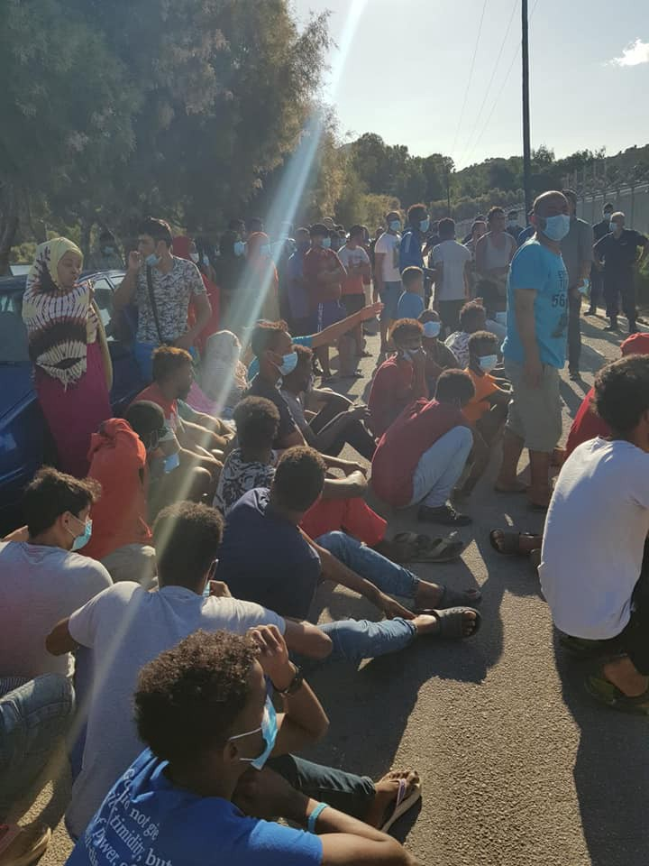

### AYS Daily Digest 30/09/2020 — The lack of humane treatment
#### Activists send airplane to Lesvos; volunteers arrested // Italian trade unions criticize migration pact // New weeks report for the Mediterranean // Report on inhumane treatment of undocumented workers in Spain

People on Leros demonstrating against the renewal of quarantine\. Credits: Leros Refugee Youth Group
### Greece

The Leros Refugee Youth Group advises residents of the camp to stay in quarantine and follow the orders of local authorities\. Following peaceful demonstrations, after police renewed the quarantine until 12 October, the team managed to reach an agreement saying:
- Police should double the number of those, who want to get fingerprinted
- Police will provide transfers for appointments
- All people get food and water
- Police will provide some facilities to the residents according to their needs

160 organizations and individuals have signed an open letter asking to that alternative accommodations on Lesvos not be closed\. “They should further strengthen and protect all dignified alternative solutions for asylum seekers’ housing and protection”, the letter reads\. You can find the full statement on [Greek Helsinki Monitor](https://greekhelsinki.wordpress.com/2020/09/30/1-443/) \.

■■■■■■■■■■■■■■ 
> **[DunyaCollective](https://twitter.com/DunyaCollective) @ Twitter Says:** 

> > Mina from Afghanistan is another inhabitant of PIKPA. The young mother loves the place because she feels save there and has much more freedom than she experienced in previous camps like #Moria.

#SavePikpa
#LeaveNoOneBehind https://t.co/mBC8cC8LjF 

> **Tweeted at [2020-09-30 11:23:35](https://twitter.com/dunyacollective/status/1311265431735414784).** 

■■■■■■■■■■■■■■ 

■■■■■■■■■■■■■■ 
> **[Katy Fallon](https://twitter.com/katymfallon) @ Twitter Says:** 

> > I also witnessed the same thing  on 3 separate days: what appeared to be 2 different queues at the @[Lidl_Hellas_](https://twitter.com/Lidl_Hellas_) Lesvos -  one for asylum seekers - one for everyone else. It also seemed mostly asylum seekers who were asked to put their belongings in lockers too before entering. 

> **Tweeted at [2020-09-30 14:05:18](https://twitter.com/katymfallon/status/1311306126407987201).** 

■■■■■■■■■■■■■■ 

According to journalist Franziska Grillmeier, some 8600 people are registered at the new camp\. Up to 600 were transferred to the mainland, 139 were relocated from Athens to Germany\.

■■■■■■■■■■■■■■ 
> **[Bruno Tersago](https://twitter.com/BrunoTersago) @ Twitter Says:** 

> > #COVIDー19 #Greece // 354 new cases [23 incoming travellers, 6 got symptoms after arrivals], 195 in Attica - total 18,475 // 3 new deaths today, 391 total // 78 remain intubated // 212 discharged from ICU // 1,307,549 tests performed (10,754 in past 24 hours) 

> **Tweeted at [2020-09-30 17:39:27](https://twitter.com/brunotersago/status/1311360019909292036).** 

■■■■■■■■■■■■■■ 

Volunteers of Stelp have been held in custody for several hours on Lesvos\. According to their [own account](https://www.facebook.com/STELP.SupporterOnSite/posts/2280902075388807) , first they were permitted to enter the military zone where the camp is located\. When leaving, other officers arrested and questioned them for several hours\. When leaving for Athens, they saw some of the officers observing and filming them in the airplane and at the airport\.

Activists from Let’s Bring Them Here \(LBTH\) Netherlands intend to send an airplane to Lesvos on 5 October\. With this action they hope to put pressure on the Dutch and Greek governments to relocate more people\. However, they cannot issue such permissions; so, for now, this can only be seen as a symbolic action\.

■■■■■■■■■■■■■■ 
> **[Tihomir Sabchev](https://twitter.com/TihomirSabchev) @ Twitter Says:** 

> > A plane comes from the Netherlands to Lesvos next week to take refugees. 189 empty places were reserved on board, all paid by civil society. The only thing needed for the plane not to return empty is a permission from the Dutch &amp; the Greek authorities. Why is this not news in 🇬🇷? 

> **Tweeted at [2020-09-30 09:33:30](https://twitter.com/tihomirsabchev/status/1311237729158602752).** 

■■■■■■■■■■■■■■ 

Meanwhile, German chancellor Angela Merkel, currently chairing the EU presidency, [praised](https://english.alaraby.co.uk/english/indepth/2020/9/25/tna-voice-podcast-bahrain-uae-israeli-normalisation-greeces-moria-camp-burns) Turkey’s efforts in hosting four million refugees, while failing to mention the awful conditions on many sites and the political instrumentalization of them\. On the other hand, she criticized Greece for their treatment — without mentioning how the EU fails in solidarity with the country\.

If you want to know more about the situation on Lesvos, you can listen to the recent podcast of [The New Arab](https://english.alaraby.co.uk/english/indepth/2020/9/25/tna-voice-podcast-bahrain-uae-israeli-normalisation-greeces-moria-camp-burns) \.
### Croatia

In a [statement](https://www.index.hr/vijesti/clanak/milanovic-posao-policajca-je-orijentiran-politicki-ali-ne-stranacki/2217897.aspx?fbclid=IwAR1BTbKire72TeIFC49tYrZMoqyy8_CLn7krYLqruDQ2tR5fU15deEYz800) , the Croatian president banalizes human rights and shows a complete lack of basic understanding of what’s been going on at the Croatian/EU borders over the past months, in his most recent shocking statement that stirred waves of disappointment among the Croatian voters who put him in the position he holds now\. One quote reads:

> One thing is to be in need of humanitarian aid, another is to think it is your right to arrive wherever you want, whenever you want\. 

### Italy

Like many other organizations, Italian trade unions [criticized](https://www.infomigrants.net/en/post/27645/italian-unions-lash-out-at-new-eu-migration-pact?fbclid=IwAR3uR9hGe00ibIRMSvPVjS3f4f9mYS5UyjtRXuklSexvlDfJ9OmoPZ5n6JM) the suggested new migration pact of the EU as mainly security\-based, not fulfilling the obligation of sea rescue and denying general human rights:

> The announcement that the Dublin Regulation would be left behind just seems to be yet another twisted bureaucratic mechanism, and a harbinger of more suffering\. 

### Sea

SOS Mediterranee has published its [weekly report](https://sosmediterranee.com/eyes-on-the-central-med-eu-commission-recalls-legal-and-moral-duty-to-rescue-but-deadly-shipwrecks-and-lengthy-standoffs-continue-and-no-ngo-ships-are-left-at-sea/?fbclid=IwAR2GplN9abLUgH_gjfSUJw-uMku0fiKj37jR3UnQMahSRQil1PT4TTJPC20) on the situation on the Mediterranean Sea\.

■■■■■■■■■■■■■■ 
> **[MOAS](https://twitter.com/moas_eu) @ Twitter Says:** 

> > #MOASMed: welcome to your update on #migrant crossings in the Mediterranean, highlighting the urgent need for #safeandlegalroutes &amp; bringing you a digestible breakdown of what's happening. 
*Data taken from IOM Flow Monitoring and IOM Missing Migrants Project. https://t.co/B60onmv8MQ 

> **Tweeted at [2020-09-30 12:01:33](https://twitter.com/moas_eu/status/1311274986062086144).** 

■■■■■■■■■■■■■■ 

### Spain

Several media have highlighted the inhumane situation for undocumented field workers in Spain\. InfoMigrants [concludes](https://www.infomigrants.net/en/post/27635/forgotten-migrant-workers-in-southern-spain-speak-out-about-conditions?fbclid=IwAR28IoNUYX51a12LPJ24wCy9dcSBUEsjLU7ZuDn6TtIv4FVZ0dEObxx8QRE) : “During the global fight against COVID\-19, conditions either remained unchanged or became worse for many of these workers, who live and work close together, often without adequate protective equipment and a lack of access to hygiene facilities\.” Another point is the minimum wage, which employers often do not pay by charging the people for extra services which they are not, in fact, provided\.
### France

French authorities have evicted some 800 people from two makeshift camps around calais\. “Almost as many are already back on the streets today: without shelter, without tents and without sleeping bags”, Project Play France [states](https://www.instagram.com/p/CFwg7zyD89Z/?igshid=1w879obpljpbb&fbclid=IwAR2rv6cIAqmtpXhJqcJ4GOYqhM-lpGZIJGBbaZvVI1PKeb5YQsBBGcscQ5Y) \. According to [InfoMigrants](https://www.infomigrants.net/en/post/27661/new-calais-migrant-camp-dismantled-by-french-authorities-1?fbclid=IwAR0SrK3eRZh4bR_eY3K_TD_5NOenPVsht-D_A82pI81UHtcOXzSkp_n_CO8) , it was the biggest eviction since the dismantlement of the jungle in October 2016\.
### Denmark

Danish authorities are ready to physically force foreigners without legal residence in Denmark to be tested for coronavirus if this is necessary for their repatriation, DR [writes](https://www.dr.dk/nyheder/politik/regeringen-vil-tvinge-udlaendinge-uden-lovligt-ophold-til-coronatest?fbclid=IwAR3j1FOysI3UfPZFERZzRWW8n9Ly6mHH1PGO0jXFALWXliNSZTokSojYdkI) \.

This is part of a new bill that Minister of Immigration and Integration Mattias Tesfaye \(Social Democratic Party\) is now presenting to the Danish parliament\.

> —I have been told that some are refusing to be tested and that for this reason we can not send them home\. — And I fear that if this option starts to spread, all of a sudden there will be a lot of rejected asylum seekers who just say no to testing\. And this will not be acceptable, states the minister\. 

The proposal has come forward because certain airlines and countries demand a negative corona test from the foreigners in question\.

As this now stands, the Danish authorities are not able to force foreigners to be examined for COVID\-19 or other infectious diseases in connection with deportation\.

“It is annoying to me that some have claimed they do not want to be tested and then simply leaned back on the couch\. While the rest of us have to pay a thousand kroner note \(approximately €135\) a day to have them accommodated in Denmark,” says the minister\.

At the same time, more Danish municipalities are [voting](https://www.facebook.com/evakuermoria/posts/164271872022646) YES to accept taking in children from Moria as a result of the Evacuate Moria campaign started by the author and documentarist Michael Graversen who just returned from yet another visit to Lesvos\.

[Rosa Lund](https://www.facebook.com/mette.nielsen.35513/posts/10158746943226683) , who is a member of parliament from the Red\-Green Unity List has today convened the relevant ministers for a parliamentary debate about Denmark’s so\-called emergency aid to Moria, with the aim of getting Denmark to bring 300 children and their families from Lesvos\.

### General

Researcher Lena K\. has begun analysing European Parliament legislative documents and debates on migration for work\. Follow her thread for more insight:

■■■■■■■■■■■■■■ 
> **[Lena K.](https://twitter.com/lk2015r) @ Twitter Says:** 

> > Currently analysing European Parliament legislative docs &amp; debates on migration for work, so here's an example of NGO criminalisation by the far right: an amendment tabled by Swedish Democrat K. Winberg to an EP resolution in the Med in 2016. 

[europarl.europa.eu/doceo/document…](https://www.europarl.europa.eu/doceo/document/LIBE-AM-577029_EN.pdf) https://t.co/ELVhQJbaQI 

> **Tweeted at [2020-09-30 09:39:22](https://twitter.com/lk2015r/status/1311239202370093056).** 

■■■■■■■■■■■■■■ 

Further, Jane O\. Newman published a new book on redefining refugees\. On the [UCI website](https://www.humanities.uci.edu/SOH/calendar/story_details.php?recid=2172&fbclid=IwAR3XCMJBFx0JNhY7dV2w_5k8y55aA9zlS1Dg7aRYqOMHTqdj6uKkhwa_fs8) , she gave an interview\.

In [The New Humanitarian](https://www.thenewhumanitarian.org/opinion/2020/09/30/Afghanistan-EU-Joint-Way-Forward-migration-asylum-seekers?fbclid=IwAR030SBkuzZjnFS1qv0e_o8_i4FH7uc4gNnbHO-qJSj76cX4DZDo3IWNIhE) , Evan Jones published an article, suggesting alternatives to sending Afghans back to conflict zones\.

**Find daily updates and special reports on our [Medium page](https://medium.com/are-you-syrious) \.**

**If you wish to contribute, either by writing a report or a story, or by joining the info gathering team, please let us know\.**

**We strive to echo correct news from the ground through collaboration and fairness\. Every effort has been made to credit organisations and individuals with regard to the supply of information, video, and photo material \(in cases where the source wanted to be accredited\) \. Please notify us regarding corrections\.**

**If there’s anything you want to share or comment, contact us through Facebook, Twitter or write to: areyousyrious@gmail\.com**

_Converted [Medium Post](https://medium.com/are-you-syrious/ays-daily-digest-30-09-2020-the-lack-of-humane-treatment-f1d0c930a1c9) by [ZMediumToMarkdown](https://github.com/ZhgChgLi/ZMediumToMarkdown)._
