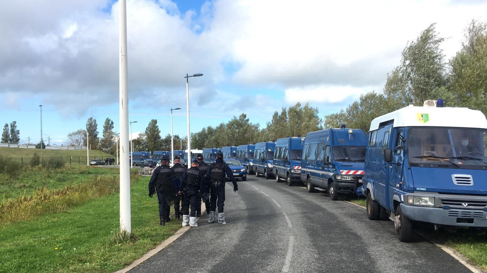
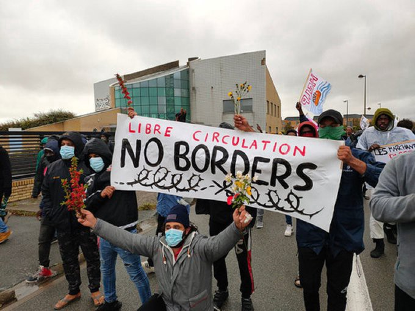

### AYS Daily Digest: 01/10/20: Evictions and pushbacks all over Europe
### Eviction of the official UN\-run Bira camp in BiH // Illegal eviction of unofficial camp in Calais // Pushback from Spanish islet to Morocco // large\-scale pushbacks from Cyprus to Lebanon // 7300 pushbacks monitored in Aegean since March // What is it like to be a refugee child in Greece? // Solidarity with PIKPA

[Are You Syrious?](@AreYouSyrious?source=post_page-----5d8eaf67d294--------------------------------)

[Oct 2](ays-daily-digest-01-10-20-evictions-everywhere-5d8eaf67d294?source=post_page-----5d8eaf67d294--------------------------------) · 13 min read

Large\-scale eviction in Calais on September 29\. Copyright: Human Rights Observers
### FEATURE: As winter approaches, the situation of refugees in Bosnia\-Herzegovina is deteriorating

On Wednesday, 30 September, the Una Sana Canton authorities forcibly transferred refugees from the temporary reception centre Bira in Bihać\.

The event unfolded as follows:

> _“According to people on the move and other witnesses on site, at 3PM today, around 70 minors were taken from their designated area in Bira to the nearby Borići camp, where children and families reside\. As soon as the evacuation of minors was done, dozens of special police and regular police officers entered the premises for single men and started removing them from the camp\. The plan was not announced to the residents, many of whom panicked as they were taken away\. By 6PM, five buses of single men were taken towards the desolate Lipa camp, while around 100 people were allowed to leave Bihać in an unorganised manner\. According to information from the field, more than 300 people on the move are now in front of Lipa camp but they say IOM doesn’t allow to them to enter inside\. They say there is no food or blankets provided outside the camp, and inside resources are also lacking\. Low temperatures and remoteness of the site are making things worse for people who’ve been removed from the relative safety of the solid\-structured camp\. According to information from Velika Kladuša, another major migrant hub in the Una\-Sana canton near the Croatian border, closure of Miral camp is also expected within the next 48 hours\.”_ 

> _AYS Breaking News, Facebook_ 

It is important to state that both the emptied camp and the one that people are now waiting in front of are run by IOM\. The Lipa camp is not at all equipped for winter conditions; it was only set up in spring as a temporary emergency facility to respond to COVID\-19 measures\. IOM’s western Balkan Coordinator Van der Auweraert calls on the local authorities to provide solutions for the people who have nowhere to go\. However, he could have let the people enter the IOM\-run Lipa camp\. Instead, he only allowed 10 people with injuries to enter, as the camp was full\.

The Croatian NGO CMS denounced the local government, IOM and the UN camp management agency for playing “ping\-pong with responsibilities and human lives”\.

The EU also condemns the latest actions by BiH’s authorities\. A statement of the Delegation of the EU to BiH reads as follows:

> _“The EU expects the competent Ministry of Security of Bosnia and Herzegovina to urgently take all necessary measures to prevent a humanitarian crisis from unfolding, ensure shelter for all persons in need, including unaccompanied minors, facilitate humanitarian assistance and stop further evictions\. The EU also expects violations of the law to be duly investigated and the rule of law to be upheld\. The EU has provided considerable support to Bosnia and Herzegovina to manage migration and asylum\. The EU urges Bosnia and Herzegovina authorities to live up to their commitments\.”_ 

Full statement [here](http://europa.ba/?p=70146) \.

BiH is currently hosting some 10,000 people on the move who try to find a way into the EU and are repeatedly being violently pushed back at the Croatian border\. Only around 7,000 are housed in IOM\-run official camps; the rest are sleeping rough\. Winter is coming, and we are once again watching a humanitarian catastrophe unfolding before our eyes\.

Van der Auweraert also published videos showing makeshift camps of people on the move in the area of Velika Kladuša:

The pushbacks conducted by Croatian police are continuously carried out in a violent and sadistic manner\. NoNameKitchen published the testimony of a man who was, together with many other people, forced by Croatian police to swim across the Korana river to BiH:

> _“Rahim described that they were brought to the secluded banks of the Korana river under the cover of darkness and ordered out of the vans in one large group\. He recalled that six additional officers were present there, all dressed in black uniforms with their faces covered by balaclava masks\. Lined up and facing the river bank, Rahim described that they were told to get in the river and swim across: “Everyone together\. Tell everyone to go…We’re in a line and beating until people go\.”_ 

> _Rahim described that many people screamed that they did not know how to swim but the officers beat them and forced them into the water anyway\.”_ 

Two people from Rahim’s group did not survive the crossing\.
### GREECE
### Solidarity with PIKPA

More than 160 Greek and international organization, universities, and other institutions all over Europe call on the Greek authorities to reverse the decision to end the operation of PIKPA and Kara Tepe facilities for vulnerable asylum seekers on the island\. Are you Syrious? is among the signatories, together with many grassroots organization and big players like Amnesty international and Human Rights Watch\.

The two facilities, which provide dignified accommodation for vulnerable asylum seekers, are supposed to close at the end of October, following a decision by the Minister of Immigration and Asylum\. PIKPA is a self\-managed solidarity area that houses unaccompanied children, unmarried mothers and survivors of torture\. It is not yet clear what will happen to the people from Kara Tepe and PIKPA, but:

> _“the undersigned are convinced that going to the new “emergency” camp would endanger their physical and mental health and should be avoided at all costs”_ 

For the full statement, see:
### [Save Dignity, Save PIKPA And Kara Tepe](https://lesvossolidarity.org/en/blog/news/save-dignity-save-pikpa-and-kara-tepe)
### [Also available: News EL Μore than 160 Greek and international organizations, academics and other actors from all over…](https://lesvossolidarity.org/en/blog/news/save-dignity-save-pikpa-and-kara-tepe)
#### [lesvossolidarity\.org](https://lesvossolidarity.org/en/blog/news/save-dignity-save-pikpa-and-kara-tepe)
### Over 7300 pushbacks in Aegean since March

As NGOs who try to monitor crimes committed by European authorities are being criminalized, it is once again important to call out the actual criminals: Greek authorities have pushed back over 7300 refugees in the Aegean since March\.

Alarm phone published a report in which it sums up its work and the changes to its relationship with the Greek Coast Guards over the last few years, and especially in recent months\.

> _“Human rights violations reached a new level in the Aegean Sea since the beginning of March\. This escalation in violations went along with acts of repression against NGOs and all sorts of solidarity structures for refugees and migrants\. Obviously, the Greek state wants to eliminate witnesses of the crimes against humanity they commit on a daily basis\. It is clear that it is bothered by our activity considering that this year alone, the Alarm Phone has witnessed and documented push\-backs and serious human rights violations in numerous cases\.”_ 

Read the full report [here](https://alarmphone.org/en/2020/10/01/the-real-crimes-are-push-backs-and-human-rights-violations-by-the-greek-government/?fbclid=IwAR3C2Kj5dWQAUHUWAqNNq5pWESxFAkvVRwE4nXAdAxDNivzca1Sqc2ujtyY) \.
### What is it like to be a refugee child in Greece these days?

The teenage girl and writer Parwana Amiri once again finds strong words for the reality she is living in\. In her _letter to the world from Ritsona №10_ that was published by Voice of Refugees, she speaks about her frustration of having to fight for her right to education, in Europe:

> _“Be brave, imagine you are one of us, imagine that your child is one of us\. Put yourself in our shoes\._ 

> _At daybreak, when you wake up your children to get ready for school and stand by their beds to make sure that they get up, we are sleeping\. We are still sleeping, not because we are lazy or we want to waste our days\. We are sleeping, because there is nothing constructive for us to do\. Sleeping, we can, at least, dream of a classroom where we can learn and of a teacher who teaches us\.” \[…\]_ 

> _“The discrimination we suffer is not due to the superiority of your children, but to the arbitrary fact of where we were born\.”_ 

The situation that unaccompanied minors face is different still from what Parwana is living through\. A long\-read from BalkanInsight gives a very strong account of their experience\. Unaccompanied minors struggle to make their way between being brought to hostels in remote Greek towns where they can do nothing but wait for their fate to be decided, sleeping in the streets of Athens, being in protective custody \(which is detention, basically\), and working in fields for less than 4€ an hour\.

4,700 unaccompanied minors are registered in the country\. While some are in temporary or long\-term accommodation or reception centres, 200 are held in _protective custody_ and 1,000 are in _insecure housing conditions_ , “which can mean anything from a bunk bed in a squat to a sleeping bag on the streets of Athens or Thessaloniki”\.

This article is worth reading if you want to understand the situation of unaccompanied minors:
### [The Teenage Refugee’s Post\-Pandemic Survival Guide \| Balkan Insight](https://balkaninsight.com/2020/10/01/the-teenage-refugees-post-pandemic-survival-guide/?fbclid=IwAR2-htPFLwOs94r1AGan3OMZDPcPo0Htd3S3E80UUq4N8RCRoFGkjHKLLZw)
### [A fight had broken out in Victoria Square, four guys scuffling and shouting over something or other\. One of them…](https://balkaninsight.com/2020/10/01/the-teenage-refugees-post-pandemic-survival-guide/?fbclid=IwAR2-htPFLwOs94r1AGan3OMZDPcPo0Htd3S3E80UUq4N8RCRoFGkjHKLLZw)
#### [balkaninsight\.com](https://balkaninsight.com/2020/10/01/the-teenage-refugees-post-pandemic-survival-guide/?fbclid=IwAR2-htPFLwOs94r1AGan3OMZDPcPo0Htd3S3E80UUq4N8RCRoFGkjHKLLZw)
### New route

A new and very dangerous migration route is emerging\. In the last months, boats have been rescued repeatedly off the coast of Crete or the peninsula Peloponnese\. Apparently these boats started their journey from Turkey and were trying to make it all the way to Italy\. Since this is a very long journey, damage to the machinery is very likely\. Yesterday, 60 people were rescued from a shipwreck off Crete\.

For more information \(in German\) see:
### [Erneut Dutzende Menschen im Mittelmeer vor Kreta gerettet](https://orf.at/stories/3183527/?fbclid=IwAR2CIKlCDiOrllHw_uvUxghWcNzObd4nS2yhY4vXqT9NZXMmPoy4mj1khsI)
### [Die griechische Küstenwache hat rund 60 Menschen von einem havarierten Boot vor Kreta aufgegriffen\. Es war wegen eines…](https://orf.at/stories/3183527/?fbclid=IwAR2CIKlCDiOrllHw_uvUxghWcNzObd4nS2yhY4vXqT9NZXMmPoy4mj1khsI)
#### [orf\.at](https://orf.at/stories/3183527/?fbclid=IwAR2CIKlCDiOrllHw_uvUxghWcNzObd4nS2yhY4vXqT9NZXMmPoy4mj1khsI)

The **Greek Health organization** is explicitly naming the number of “foreigners” among positive cases of COVID\-19 infection on Twitter\. By doing so, an official institution is once again reinforcing narratives that blame the vulnerable for their situation and present them as a threat to the public\. Since no effective preventive measures are provided for people on the move, how could they possibly not get infected?
### Transfers from Lesbos

According to the journalist Franziska Grillmeier, another 500–600 recognised refugees are supposed to be transferred from Lesbos to the mainland\. Currently 8,630 people are registered at the new camp structure\.

120 people were stranded on an islet in the middle of Evros river\. During Tuesday night they were brought back to Turkey by Turkish soldiers\.
### CYPRUS
### Pushbacks become common practice

According to Human Rights Watch, more than 200 refugees from Lebanon have been pushed back, abandoned and expelled while trying to reach Cyprus during the first week of September\.
At least 13 people died between August 29 and September 7 while trying to reach Cyprus\. The number of people trying to leave Lebanon by boat towards Cyprus rose dramatically after the explosion in the port of Beirut in early August\.

> _“Every migrant interviewed by Human Rights Watch who had encounters with Cypriot authorities said that they pleaded not to be returned to Lebanon — and some explicitly requested asylum — but in no case were any allowed to lodge asylum claims\.”_ 

In one instance, a wooden boat full of people was rammed by a metal coast guard vessel, leading to injuries\. In another instance, Cypriot coast guards forced people, while still at sea, to transfer to another vessel and then brought them right back to Lebanon\. According to some testimonies collected by HRW, people were even deported back to Lebanon without any sort of legal proceedings after having already been staying in camps on Cyprus\.
The conditions in Pournara camp, where the people who actually manage to arrive on Cyprus are often brought to, are horrendous\.

> _“They \[the witnesses\] said water is scarce, food insufficient, and sanitation conditions poor, with insects and uncollected trash everywhere\.”_ 

Some people said that in their section of the camp they had two portable toilets for 100 people\. Neither toilets nor shower were separated by gender\. Also there seems to be no special area for women and families\.
**None of the persons interviewed by HRW was able to lodge an asylum claim before being deported back to Lebanon, although they repeatedly tried to do so** \. The act of collectively expelling people is prohibited under the European Convention on Human Rights \(Art\. 4 of Protocol 4\) \.

> _“The European Court of Human Rights ruled in Hirsi v\. Italy that it is a violation of that prohibition to summarily expel multiple migrants traveling irregularly by boat who are interdicted at sea, and in Sharifi and Others v\. Italy and Greece made the same ruling regarding those who had landed\.”_ 

People further have a right to effective remedy and not to be subjected to inhuman or degrading treatment\. All these legal norms are repeatedly broken — not only by Cyprus, but by all European authorities who conduct push\-backs at sea or at land\.

For the full HRW report, see:
### [Cyprus: Asylum Seekers Summarily Returned](https://www.hrw.org/news/2020/09/29/cyprus-asylum-seekers-summarily-returned)
### [Cypriot coast guard forces summarily pushed back, abandoned, expelled, or returned more than 200 migrants, refugees…](https://www.hrw.org/news/2020/09/29/cyprus-asylum-seekers-summarily-returned)
#### [www\.hrw\.org](https://www.hrw.org/news/2020/09/29/cyprus-asylum-seekers-summarily-returned)
### SEA

**A pushback from Spanish territory to Morocco** , carried out by the Guardia Civil, appears to have happened on 1 October\.

The Spanish NGO Caminando Fronteras was contacted by a group of six people who stranded on one of the uninhabited Islas Chafarinas\. At 1 pm a Guardia Civil boat arrived to the island, the phones of the people were confiscated, and they were brought back to Morocco\. Among them was a pregnant woman\. When her husband requested protection from the guards, they apparently beat him on the head for speaking\.

Two boats in distress in Maltese SAR:
### ITALY

In Milan a controversy over the reopening of a migrant repatriation center \(CPR\) has sparked after right\-wing parties celebrated the decision\. One of the biggest proponents of the reopening was Matteo Salvini, leader of the right\-wing anti\-migrant League party and former interior minister\.

Centre\-left politicians in turn appealed the decision to reopen the center and activists demonstrated in front of city hall on Wednesday\.

**Matteo Salvini will have to appear before court in Catania** , **Sicily** on Saturday 3 October for a preliminary hearing\. He has been accused of deprivation of liberty of 131 migrants whom he blocked from disembarking from the Italian Coast Guard ship Gregoretti in July last year\.
### SPAIN

The body of a young man has been found floating in the vicinity of Alcaidesa, in the Straits of Gibraltar\. According to the Missing Migrants Project of IOM, 11 people died so far this year in the Straits of Gibraltar\.

One boat arrived to Los Abrigos, Tenerife, with about 25 people on board\. A total of 84 people were rescued on September 30 only and brought to Gran Canaria\.
### FRANCE

Three days after the latest eviction in Calais, the events of the eviction are becoming clearer\. On 29 September, a large\-scale eviction of the area next to the Calais hospital and another small camp called BMX\-camp, next to a sports ground, took place\. This seems to have been the biggest eviction since the dismantlement of the Jungle in 2016\. About 650 people were loaded on busses and brought to accommodation centres all over France, some as far away as the Spanish border\. 34 people with irregular residence status were detained\. According to a statement published by NGOs, five of them are minors\.
While evictions in the past often happened on the base of an action of eviction by the landowner, followed by a bailiff’s visit to the site and an announcement of the forthcoming eviction in advance, the latest eviction happened out of nowhere\. The people had hardly any time to collect their personal belongings or leave the area before being forced into busses and driven away\.
In a video published by the NGO Utopia 56, one can see men ditching what have been the personal belongings of the people — clothes, tents, pillows, bags\.

Seven NGOs published a joint statement in which they denounce the eviction and state that it happened without any legal base\. According to the statement:

> _“from a legal point of view, the eviction was justified by the law enforcement authorities with investigations, in the context of which evidence may be seized, but which in no way allow an eviction\.”_ 

Regardless, an eviction would have to be announced in advance, which did not happen\. This further made it impossible for the residents to take legal action against the eviction\. Apparently NGOs were hindered from monitoring the eviction\. In some instances tear gas was used against the people being evicted\.
On Saturday, a protest march of migrants, Calais residents, and volunteers set off from the now evicted area next to the hospital and made its way in the pouring rain to the city centre\. The participants protested against the Council of States’ decision not to suspend a prefectural decree from 11 September that prohibits humanitarian aid workers from distributing food to migrants in the city centre\.

from Saturday’s demonstration, Copyright: enough14

Eviction and transportation to accommodation centres all over the country are common practices in Calais\. However, this cannot be regarded as a solution in any sense\. Often the accommodation facilities are in very bad condition — a few weeks ago, we saw videos of a facility with a kitchen packed with cockroaches\. Most people will try to return to Calais as soon as possible, as they are desperately searching for an opportunity to reach the UK\. According to the NGO Care4Calais, about 200 people already returned back to Calais after the latest eviction\. They are now again left without tents and sleeping bags\. The police told Care4Calais that they would carry out small evictions every day from now on\.
### UK

European police arrested 12 people suspected of smuggling people across the channel from France to UK\. In a joint operation, police force from Belgium, France, UK and Denmark worked together with Eurojust\.

> _“The network is believed to have made huge profits from smuggling migrants in small boats from the north coasts of France to the UK\.”_ 

says Eurojust in a press release\.

For more information, see:
### [Channel smugglers ‘made huge profits’, European police](https://www.infomigrants.net/en/post/27673/channel-smugglers-made-huge-profits-european-police?fbclid=IwAR2-htPFLwOs94r1AGan3OMZDPcPo0Htd3S3E80UUq4N8RCRoFGkjHKLLZw)
### [European police have arrested a dozen people suspected of smuggling migrants across the English Channel to Britain\. The…](https://www.infomigrants.net/en/post/27673/channel-smugglers-made-huge-profits-european-police?fbclid=IwAR2-htPFLwOs94r1AGan3OMZDPcPo0Htd3S3E80UUq4N8RCRoFGkjHKLLZw)
#### [www\.infomigrants\.net](https://www.infomigrants.net/en/post/27673/channel-smugglers-made-huge-profits-european-police?fbclid=IwAR2-htPFLwOs94r1AGan3OMZDPcPo0Htd3S3E80UUq4N8RCRoFGkjHKLLZw)

**Find daily updates and special reports on our [Medium page](https://medium.com/are-you-syrious) \.**

**If you wish to contribute, either by writing a report or a story, or by joining the info gathering team, please let us know\.**

**We strive to echo correct news from the ground through collaboration and fairness\. Every effort has been made to credit organisations and individuals with regard to the supply of information, video, and photo material \(in cases where the source wanted to be accredited\) \. Please notify us regarding corrections\.**

**If there’s anything you want to share or comment, contact us through Facebook, Twitter or write to: areyousyrious@gmail\.com**
### [Are You Syrious?](https://medium.com/are-you-syrious?source=post_sidebar--------------------------post_sidebar-----------)
#### Daily news digests from the field, mainly for volunteers…

Following

_Converted [Medium Post](https://medium.com/are-you-syrious/ays-daily-digest-01-10-20-evictions-and-pushbacks-all-over-europe-442d0f01a168) by [ZMediumToMarkdown](https://github.com/ZhgChgLi/ZMediumToMarkdown)._
