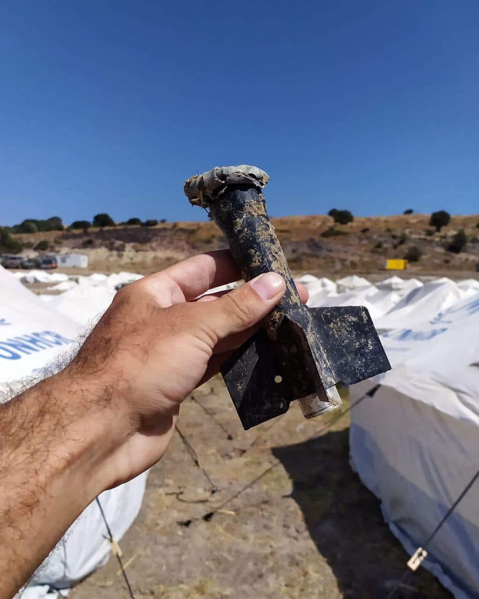

### AYS Daily Digest 2/10/2020: 1300 people still stuck in the CETI in Melilla

Kara Tepe new camp may have been built on toxic soil / Repatriations from Spanish enclaves to Morocco after month of border closure / Italy and Tunisia agree on doubling deportations / New police raid in Calais / Updates from the Med, Greece, Bosnia…

 \)](assets/6592109a6e66/1*IeWtNqXqVAT98LNKm55qRw.jpeg)

Child playing with ammunition cases found on the ground at Kara Tepe new camp \(Photo by [Aegean Boat Report](https://www.facebook.com/AegeanBoatReport/posts/934839927039112) \)
#### FEATURED — 1300 people still stuck in the CETI in Melilla, despite supreme court ruling

Amnesty International denounce the fact that more than 1,300 people continue to be stuck in the CETI in Melilla, which has a capacity of 782, four months after the last transfer from the enclave to the mainland, and despite several rulings \(the last one in July issued by the Spanish supreme court\) upholding the right of asylum seekers to free movement throughout the national territory\.

Interior, migration and health ministers spent the past several months refusing to comply with such rulings, and passing the buck between each other\. In the meantime, more than 130 ‘residents’ tested positive for coronavirus in a structure where no form of health security is provided\.

The July supreme court ruling “only confirms what **22** other **judgments** of the Andalusian and Madrid courts of justice have been saying since 2010”, judgments that have constantly been appealed against by Spanish authorities\. Of the over 1,300 ‘residents’ of the CETI, **250 are asylum seekers, “many of them women and children in vulnerable situations”** \. The authorities’ latest excuse has been the “need to carry out administrative changes and modify a 2010 instruction in order to comply with the Supreme Court ruling, as declared \[on Thursday\] by the Secretary of State for Security in parliament”\.

LIBYA
#### EU’s options for intervention in Libya

Politico reveal that EU officials have drawn up a range of options to deploy European military observers to Libya to bolster a cease\-fire in the country — from offering advice to a Libyan\-led effort to deploying a fully fledged EU Miltary and Observation Mission, complete with land and air elements\.

Read more [HERE](https://www.politico.eu/article/eu-libya-military-options-ceasefire/) \.

SEA
#### Updates from the Central Med

Following yesterday’s reports by AlarmPhone, two boats were in distress in Maltese waters\. One boat, carrying 84 people, has safely [reached](https://twitter.com/alarm_phone/status/1311720563866562561) Lampedusa\.

The other boat, with approximately 38 people on board, had been first [monitored](https://twitter.com/alarm_phone/status/1311905471285153792) by the Maltese commercial ship Ambra\. Ambra left the scene once a vessel from the Maltese Armed Forced \(AFM\) appeared in the area\. Ambra communicated that the AFM vessel failed to fix the engine of the boat in distress, did not allow for people to be transferred to the military vessel, and started towing the boat north\. When contacted by Alarm Phone and by Maltese [media](https://timesofmalta.com/articles/view/afm-allegedly-spotted-towing-distressed-vessel-in-maltese-sar-zone.821815) , AFM refused to comment\. It is still not clear where the 38 people are at the moment\.
#### Important victory for Mare Liberum

■■■■■■■■■■■■■■ 
> **[Mare Liberum e.V.](https://twitter.com/teammareliberum) @ Twitter Says:** 

> > We won! The court declares the change of ship security law by german Minister #Scheuer is against EU-rules. That means that the detainment of our ships is liftet. Yes! A good day #ForRefugees, for monitoring human rights + Civil Search and Rescue! Ain't no stopping solidarity! https://t.co/9ZOGCjgsAQ 

> **Tweeted at [2020-10-02 11:17:38](https://twitter.com/teammareliberum/status/1311988708443328513).** 

■■■■■■■■■■■■■■ 

Read more about it [HERE](https://www.spiegel.de/politik/deutschland/seenotrettung-andreas-scheuer-scheitert-vor-gericht-gegen-mare-liberum-a-c0d13032-b7a7-4c6b-8fe2-f9d1959e364e?fbclid=IwAR0EBQTzMjbinzsKzDDZ45pGI3b8HIn_WwD1Gu5WZFtT7nxCU0rwW0ZFMdc) \(in German\) \.
#### Sea\-Eye Academy: Teach, learn, save

Sea\-Eye humanitarian rescue organisation launched its academy to train people for the different roles needed at sea and on land\. Find more information [HERE](https://sea-eye.org/academy/) \.

GREECE
#### Lesvos: More doubts about the safety of Kara Tepe new camp

We have already reported about the possible contamination of the area in which the so\-called ‘Moria 2’ was hastily built\. Until last year, the area was used as an active shooting range for the Greek Army\. Mission Lifeline [reported](https://twitter.com/SEENOTRETTUNG/status/1310141074925654016) about sighting soldiers checking the ground with metal detectors, and unearthing operations to retrieve what seemed to be a mine\.

 \)](assets/6592109a6e66/1*1z_GFMI4yFiCuHxcHiKrUw.jpeg)

New camp in Kara Tepe \(Photos by [Aegean Boat Report](https://www.facebook.com/AegeanBoatReport/posts/934839927039112) \)

On Friday, Aegean Boat Report [published](https://www.facebook.com/AegeanBoatReport/posts/934839927039112) more information on the situation:

> The new “temporary” camp in Kara Tepe, Lesvos, is as we all know built partially on an old military firing range\. For the government this already restricted area was perfect, it was already fenced in\. As in all military areas there are a lot of restrictions, the most important ones are the restrictions of movement and the restrictions on taking pictures\. 

> \[…\] The main concern is the possibility of lead contamination\. The presence of lead and lead dust is well documented on such sites as are the extreme danger to health if lead is absorbed by children\. Children younger than 6 years are especially vulnerable to lead poisoning, which can severely affect mental and physical development\. At very high levels, lead poisoning can be fatal\. 

> \[…\] Due to the fact that it took only 5 days to put up this camp, after the fire in Moria, it’s highly unlikely that any proper survey has been taken\. This new site requires urgent toxicity checking by independent experts to reveal whether lead is present on the new site, which could indicate an evacuation might be necessary to protect the lives of vulnerable children\. 

> Some areas in the camp has been levelled out by bulldozers, in other areas soil from the levelled areas has been reused as landfill\. By doing so, things that have been buried in the ground for decades have resurfaced, possibly making the situation even worse\. Residents in the camp have found remains of ammunition casings and grenades around the tents, and military personnel have been observed using metal detectors on the outskirts of the camp\. To see small children who have fled war play with used ammunition in a European refugee camp, should raise some questions\. 

This raises even more questions on the role of UNHCR\. The Refugee Agency has been assisting Greek authorities in the new camp, in various capacities\. As ABR notes, this is not the first time that UNHCR have [rehoused displaced people on toxic land](https://www.facebook.com/AegeanBoatReport/posts/934839927039112) \.

So far, UNHCR Lesvos and UNHCR Greece have failed to provide any comment\.

Read more [HERE](https://www.aljazeera.com/news/2020/10/2/lead-poisoning-greece?fbclid=IwAR2C8Z2ydd_4C6yCzBLL17Vy4aZZILED7W5j_v4nSt_XgQF01RWVA4mTPoE) \.
#### Lesvos: interviews to resume on October 8, with new appointments

Refugee\.Info [reports](https://www.facebook.com/refugee.info/posts/3419408934785896) that asylum interviews on the island will resume on October 8, 2020\. Past interview appointments mentioned in the asylum seekers’ cards or in the calls for interviews are NOT valid\. New invitations for an interview will be notified to the asylum\-seekers registered in the new site of Kara Tepe, who will be located with the assistance of the Reception and Identification Service\.

Find more details [HERE](https://www.refugee.info/greece/coronavirus-emergency-in-greece/update-on-reception-identification-centers-on-the-greek-islands-lesvos-samos?language=en&fbclid=IwAR0rHA6w0ZhE8nQsX22sUKzicMq3qHznsqp_fHhIv7I-GJ2uRfWCdCRASxE)
#### Vathy, Samos: another cycle of misery

MSF has [published](https://www.msf.org/european-policies-deterrence-and-containment-degrade-human-life) a long read focusing on the implementation of European and Greek containment policies on the island, and pointing out that such policies “will always give rise to new Morias”\. Around 4,500 people are trapped in Vathy today — a camp that has a capacity of 650 people\. Among them are children, patients with chronic health problems and people whose lives will be endangered if exposed to COVID\-19\. In this regard, “the plan for Samos is the same as it is anywhere involving reception centres: quarantine and isolation\. All the other problems that co\-exist do not concern anyone: accumulated pain, exposure to danger, no rights, exclusion, and the constant fear of being forgotten in a closed centre that will keep people locked in miserable conditions\.”

> On Samos island, anyone forced to live in the Vathy reception centre continues to get sick, to be in danger every day and to be forced to survive without even basic supplies\. Their only hope continues to be an asylum application that can take months or even years to be considered, with few chances of prosperity and without any promise of integration even if their claim for asylum is eventually recognised\. 

> This reality is known to the Greek authorities, the European leaders and the financial mechanisms that enable it\. Asylum seekers and refugees held on the Greek islands remain excluded and invisible because this is what works best for EU migration politics\. 

> The only time they become visible is when they are targeted as troublemakers, as dangers to public health or as beneficiaries of EU aid\. 

> Does anyone really believe that managing the arrival and processing asylum seekers and refugees is beyond the ability of European states? 

Read more on the conditions of Vathy camp [HERE](https://www.rnd.de/politik/fluchtlingslager-auf-samos-kinder-leben-zwischen-ratten-und-skorpionen-K23GTXFHARADHMHCLYXKJOG5JM.html?fbclid=IwAR22C4ixWEsfbYfMAgfhhdAzvpsFriIRQwtvZEtQAJWKFNC81yieQUGpIdw) \(in German\) \.
#### New portal for all asylum application information

The Greek Asylum Service has launched a new online portal, through which asylum seekers will be informed about their appointment planning for the renewal of the International Protection Applicants\. The renewals of the bulletins will now be made exclusively by scheduled appointments\.

Asylum seekers should type their case number in the link below [https://apps\.migration\.gov\.gr/applicant\-card\-rv/search](https://apps.migration.gov.gr/applicant-card-rv/search?fbclid=IwAR3txdQzlgwmKMDzieN5SLzlk9VmlesgBONNx6ncksMGvdz6dQpnGrzPylU) They will immediately be updated about the time, the day, and the service they should go to with their family to receive the renewed bulletin\.

Read more [HERE](https://bit.ly/3nfHh3w) \.
#### From Lesvos to Leros and Samos: more self\-organised refugee groups are formed

#### From the mainland to the islands

StoNisi media outlet [provided](https://www.stonisi.gr/post/11842/aposymforhsh-alla-me-aytoys-poy-epistrefoyn-ti-ginetai) an insight into an often overlooked phenomenon\. While thousands of people are waiting to be allowed to leave the Greek islands, it is estimated that 20 to 30 recognised refugees return to Lesvos from the mainland every day\. It should be no surprise after witnessing the treatment of refugees over the summer in Platia Victoria in Athens\. “As they say, they can not leave Greece and there is no possibility of a basic stay in the big city\.”
#### Athens: Three new shelters for unaccompanied minors to open

[Movement on the Ground reported](https://movementontheground.com/story/movement-on-the-ground-and-the-home-project-partner-to-open-three-new-shelters-for-unaccompanied-minors-22548) that they have partnered with The Home Project to to provide more safe and enabling environments for vulnerable unaccompanied minor refugees in Greece\. There are currently 4,500 unaccompanied children in Greece, with many falling outside the system of protection and in urgent need of accommodation\. The project is jointly supported by the Dutch and Greek governments\. The organisations announced the opening of the first shelter for unaccompanied minor girls and minor mothers with their babies\. The additional two shelters are due to open soon after\. “Each of the three shelters will have the capacity to host 16 unaccompanied children, aged from 13 to 18 years old\. Subject to the progression of the asylum procedure for each minor resident, successful family reunification and the adult legalisation once a child turns 18, new places in the shelters will become available\. It is expected that hundreds of minors will reside in the shelters over a period of three years\.”
#### Nea Kevala: Camp lockdown extended until October 12

[Open Cultural Centre \(OCC\)](https://www.facebook.com/OpenCulturalCenter/posts/3951949858166736) report that two positive cases of Covid\-19 have been confirmed this week and that the authorities have decided to extend the lockdown until 12th October\. During this time, school and group activities in the camp are prohibited and there is no possibility for students to access public schools\. The camp’s asylum office remains closed until the end of lockdown and the residents are only allowed to leave the camp to arrange legal procedures \(e\.g\. ID, travel documents, interviews\) on specific days\.

“Camp residents have been complaining about these measures, claiming there are no real cases and criticising big incoherencies like taking all together the bus to arrange asylum documents or the fact that in the nearby villages no lockdown is implemented\.”

ITALY
#### Arrivals

According to Italian journalist Angela Caponneto, 170 people [disembarked](https://www.facebook.com/angela.caponnetto.54/posts/10221559818857334) on Friday in Lampedusa, in two different boats\.

Also, two boats have been [intercepted](https://www.facebook.com/angela.caponnetto.54/posts/10221559818857334) in the Ionian Sea not far from the Calabrian coast\. One was towed to Reggio Calabria, and had 48 people on board, all reportedly from Turkey\. It seems that the boat could have arrived from Greece\.
#### Italy and Tunisia agree on increasing returns

Media reveal that a new [agreement](https://www.repubblica.it/cronaca/2020/09/21/news/migranti_al_via_i_rimpatri_straordinari_verso_la_tunisia_voli_charter_aggiuntivi_per_rimandare_indietro_chi_arriva_con_gli-267981368/) is in place between Italy and Tunisia which allows the Italian authorities to increase the number of deportations\. The agreement has not been publicised yet by either of the countries, but it seems that it will bring the number of deportations up from 80 per week \(as per 2011 agreements, still secreted\) to around 160\.

SPAIN
#### Arrivals

At least four boat have been reported arriving in the Canary islands on Friday \(98 people, one confirmed death, five people in hospital\) \.
- 22 people [arrived](https://www.europapress.es/islas-canarias/noticia-localizados-22-migrantes-patera-llegada-propios-medios-gran-canaria-rescatan-otra-17-personas-20201002090713.html?fbclid=IwAR0f5ZvGQeIGaExRA9SG-ne0pb5e79U1hFUxNFTutTh_qhvyYEpbzYk0NGg) by their own means in Playa del Inglés, on the south coast of Gran Canaria\.
- 17 people were [rescued](https://www.europapress.es/islas-canarias/noticia-localizados-22-migrantes-patera-llegada-propios-medios-gran-canaria-rescatan-otra-17-personas-20201002090713.html?fbclid=IwAR0f5ZvGQeIGaExRA9SG-ne0pb5e79U1hFUxNFTutTh_qhvyYEpbzYk0NGg) by Salvamento Marítimo about 18 kilometers from Maspalomas \(Gran Canaria\) and taken to Arguineguín dock, in the municipality of Mogán, Gran Canaria\.
- A dinghy with 26 people on board [arrived](https://www.eldiario.es/canariasahora/365-dias-de-migraciones/cayuco-26-personas-llega-muelle-abrigos-tenerife_1_6262879.html?fbclid=IwAR2u_10UhgZKyC8NKXnEKLwbt4H0O4ApPgUVIADqtr1ho70Wy1zcpU_8tjU) in the night at the Los Abrigos dock, in Granadilla, Tenerife\.
- A boat with 33 people was [rescued](https://www.europapress.es/islas-canarias/noticia-migrante-muerto-cinco-estado-grave-rescatar-patera-33-personas-sur-gran-canaria-20201002230808.html?fbclid=IwAR0fm69Pd1TZZMs7-kHEW8BslJB6Y5y9zE-I3XuANqBz2bT57P7yECg08f4) by Salvamento Marítimo south of Gran Canaria island\. One of the passengers did not survive the crossing and another five have been taken to the local hospital, with two of them in critical condition\.

#### Canaries: Judge rules that transfers from rescued boats to CIEs \(migrant detention centres\) are unlawful

Media [report](https://www.eldiario.es/canariasahora/365-dias-de-migraciones/malienses-internados-cie-gran-canaria-seran-liberados-pedir-proteccion-internacional_132_6260022.html?fbclid=IwAR2uOUSZopU_FOSrFtimGBxNEE6BXAmHNX0KWCJWdoIX9rRdbJ4HpCbSvHs#) that thirty people from Mali will be released from the CIE in Barranco Seco and will be transferred to a reception centre after having requested international protection\.

After visiting the CIE on Wednesday, the judge noted that none of them had been informed of their right to seek asylum, despite Mali being a country at war\. The judge highlighted how all people arriving in Spain heve to be informed of their rights, “ though a lawyer and an interpreter, individually and privately”\.

The judge also pointed out that the overcrowding conditions within the CIE are exactly the same as those that forced its closure during the first wave of the pandemic\.
#### Morocco temporarily lifts border closure with Melilla and Ceuta to repatriate citizens

Spanish media [report](https://elpais.com/espana/2020-10-01/los-dramas-callados-de-los-marroquies-atrapados-mas-de-seis-meses-en-ceuta-y-melilla.html?fbclid=IwAR00YyLBbRc5mkdTCK7ab5kTvt_AYTsTGbfqByM3nznY69K4QQU0K4hhW5M) that for a second day this week, Morocco has lifted its covid\-19 border closure with the two Spanish enclaves, allowing Moroccan citizens to return to the country after more than six months\. At the moment of writing it is unclear if such repatriations are only voluntary, as the media articles [imply](https://elfarodemelilla.es/segunda-jornada-marruecos-melilla-frontera-coronavirus/?fbclid=IwAR2flPCc8jB7a3Jy8XyouILmX4W_3qb4FUTcNEU8gLp92V2AHFFbFcXUvbY) or include forced deportations\.
#### A second wave of support from the Basque country to Lesvos

The Basque association Zaporeak has [launched](https://eldiariosolidario.com/zaporeak-segunda-ola?fbclid=IwAR04TG3XuFEJeHZYBo0iGhK55EQaLSzpn9su9hV2HeXZhruraKp8iPRz_LY) a “second wave” of support for the Greek island of Lesvos and will bring donations to the island in the next weeks\. Over the weekend, different municipalities in the area will have collection points where it will be possible to donate food and NFI for people stuck in Greece\.

BALKANS
#### Chain pushback From Austria to Bosnia and Herzegovina

■■■■■■■■■■■■■■ 
> **[NoNameKitchen](https://twitter.com/NoNameKitchen1) @ Twitter Says:** 

> > ***#Pushback reported from Laafeld, Austria to Velika Kladuša, Bosnia-Herzegovina**

Our volunteers in VK recorded the testimony of a man who described being apprehended by Austrian authorities and chain pushed back to BiH via Slovenia and Croatia this week @[TSolidarnost](https://twitter.com/TSolidarnost) https://t.co/6H1XY8otKc 

> **Tweeted at [2020-09-12 14:47:18](https://twitter.com/nonamekitchen1/status/1304793714146062336).** 

■■■■■■■■■■■■■■ 

BOSNIA AND HERZEGOVINA
#### Updates after the closure of Bira camp

Local media [report](https://radiosarajevo.ba/vijesti/bosna-i-hercegovina/cikotic-u-klin-fazlic-u-plocu-hoce-li-se-migranti-vratiti-u-kamp-bira/391830?fbclid=IwAR2uOUSZopU_FOSrFtimGBxNEE6BXAmHNX0KWCJWdoIX9rRdbJ4HpCbSvHs) on infighting among BH authorities following the closure of the camps\. Especially, state authorities are reportedly looking into ways of reopening the camp that was closed earlier this week on the order of local authorities\.

[No Name Kitchen](https://www.facebook.com/NoNameKitchenBelgrade/posts/1086206238444326) commented the closure of the camp:

> \[…\] This means that the people who have been expelled from Bira will now have to sleep outside this camp, like hundreds of other people who have been forced to go to this settlement in the last few weeks are already doing\. This is the horror\. Far from everything, sleeping on mud and wet grass because it often rains and, even if it doesn’t, the nights are very wet in this region\. 

](assets/6592109a6e66/1*m7kiOkg1wN4PA32f8_29Aw.jpeg)

Lipa Camp, photo by [No Name Kitchen](https://www.facebook.com/NoNameKitchenBelgrade/photos/a.312076942523930/1086203985111218/)

> \[…\] The closure of Bira has come one day after the meeting of the Operational Group for Coordination of Activities and Supervision over the Migrant Crisis in the Area of Una\-Sana Canton\. According to official information, this meeting was attended by local authorities and also by representatives of the IOM and UNHCR\. According to the information published from this meeting, the group adopted and reiterated among others, the following measures: the prohibition of transport of migrants by any means of transport; the prohibition of providing accommodation services to migrants \(these measures were already in place, but were emphasised\) or the prohibition of migrants to walk in public areas — something which was already very limited due to constant harassment and sometimes, [police violence against them](https://www.facebook.com/VLADAUSK/posts/2864217467130941) \. 

> \[…\] They have also committed to shut down the Miral camp located next to Velika Kladuša one of these days\. And there is talk of taking the people who live there to state\-run facilities outside the Una Sana Canton\. We are waiting to see what will happen because there is no space in those centres, according to the information we have\. Today there is a huge amount of police officers around the Miral camp telling people to leave the place and we are expecting what could happen during the day\. 

Read their full statement [HERE](https://www.facebook.com/NoNameKitchenBelgrade/posts/1086206238444326) \.

Read also [Amnesty’s statement](https://www.amnesty.org/en/latest/news/2020/10/bosnia-and-herzegovina-authorities-create-gratuitous-suffering-for-hundreds-left-without-shelter/?s=09&fbclid=IwAR3jWHbW5M5jSqHtc8Lmbu3_qbO7m59spImGA9tWPEy3eELlnjf1TsZ1Xbk) \.

FRANCE
#### New eviction in Calais

Care4Calais [report](https://www.facebook.com/care4calais/posts/3695122660520664) :

> Just three days after Tuesday’s major eviction in Calais, refugees have been hit by **another shocking police raid** \. People who were exhausted, stressed and terrified, many having walked for up to 24 hours to return to Calais, were once again woken in the early hours this morning and evicted from the rough ground on which they sleep\. Over the past three days nearly 1,000 people have been evicted from areas around Calais\. 

](assets/6592109a6e66/1*TCuzcMZs9eYa-jSx3Bi6dQ.jpeg)

Photo by [Care4Calais](https://www.facebook.com/care4calais/posts/3695122660520664)

> This has been combined with an **extension to the already controversial ban on food distributions** which was imposed in September\. This ban has now been extended to cover the Beau\-Marais district\. 

> Unlike last time, this extension to the ban was accompanied by a **reduction in government food distributions** \. 

> The refugees in Calais are being bullied by the French authorities\. They’ve been hit by multiple police raids over the past three days and those who remain in Calais are being denied access to food and basic supplies\. The vulnerable people in Calais are exhausted, stressed and terrified\. 

If you can, support Care4Calais [HERE](https://care4calais.org/donate-now/) \.

DENMARK
#### Demonstration for the children of Moria

A demonstration is [launched](https://www.facebook.com/events/2535294270028787/) for Thursday 8th October, in Christiansborg Palace Square, Copenhagen, where candles will be lighted for the children stuck in Greece camps\.

EU
#### “Border Procedures” assessment by EASO

Statewatch has republished a [study by EASO looking at how member states have implemented the 2013 Asylum Procedures Directive, which allows for the use of “border procedures” for a rapid assessment of asylum applications](https://www.statewatch.org/news/2020/october/eu-european-asylum-support-office-study-border-procedures-for-asylum-applications-in-the-eu-countries/?fbclid=IwAR0SFGB0LOcpixdDGCo0gjX0bsaQLzth8-4aScR42JsO0j12fn14hW6MxHw) \. Under measures recently\-proposed as part of the Pact on Migration and Asylum, such rapid assessments, and accompanying large\-scale detention, would become far more widely used\.

FURTHER READING
- [**Open Access Round\-up: 30 September 2020**](https://fm-cab.blogspot.com/2020/09/open-access-round-up-30-september-2020.html) **,** by Forced Migration Current Awareness\. A listing of Open Access literature, referenced on the blog since 15 September 2020\.
- [**Viewpoint: The legal and illegal businesses of Fortress Europe**](https://www.statewatch.org/analyses/2020/viewpoint-the-legal-and-illegal-businesses-of-fortress-europe/?fbclid=IwAR3sLXaWQ9Gtywy9rHzMxdiTRAGye53qdbkzYwT8ql6UnL9ik97NLWt875s) **,** by _Ana González\-Paramo_ , who argues that border controls are big business — for the companies supplying the fences, technology and equipment used to put them in place, and for the smugglers who seek to circumvent them\.
- [**The path of least resistance? EU cities and locally organised resettlement**](https://www.fmreview.org/cities/sabchev-baumgartel) , by _Tihomir Sabchev and Moritz Baumgärtel\._ The scaling up of locally organised, city\-led routes to resettlement could form part of a larger solution to Europe’s current political crisis and deadlock around migration\.
- [**Notes from the field\. “Migrant crisis” in Bihac, Bosnia and Herzegovina**](https://movements-journal.org/issues/08.balkanroute/08.hromadzic--notes-from-the-field.html) , by Azra Hromadžić, who attempts to capture some of the dynamics of the everyday life of people waiting to cross the border with Croatia, by focusing on multiple encounters between the people of Bihać and _migranti_ with a special focus on the local people’s perspectives\.

**Find daily updates and special reports on our [Medium page](https://medium.com/are-you-syrious) \.**

**If you wish to contribute, either by writing a report or a story, or by joining the info gathering team, please let us know\.**

**We strive to echo correct news from the ground through collaboration and fairness\. Every effort has been made to credit organisations and individuals with regard to the supply of information, video, and photo material \(in cases where the source wanted to be accredited\) \. Please notify us regarding corrections\.**

**If there’s anything you want to share or comment, contact us through Facebook, Twitter or write to: areyousyrious@gmail\.com**

_Converted [Medium Post](https://medium.com/are-you-syrious/ays-daily-digest-2-10-2020-1300-people-still-stuck-in-the-ceti-in-melilla-6592109a6e66) by [ZMediumToMarkdown](https://github.com/ZhgChgLi/ZMediumToMarkdown)._
