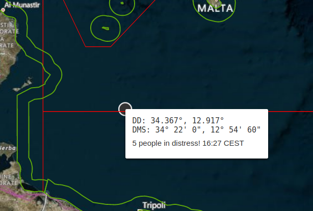
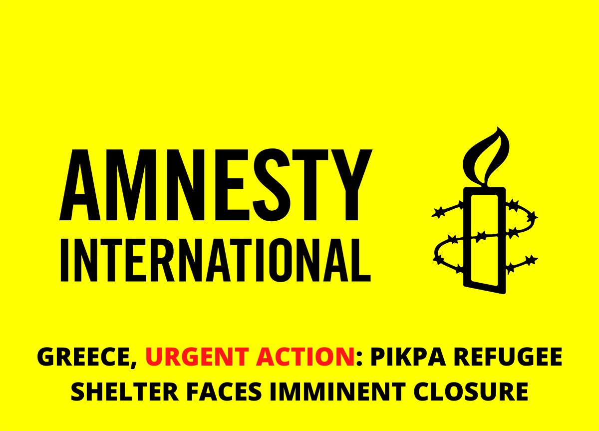
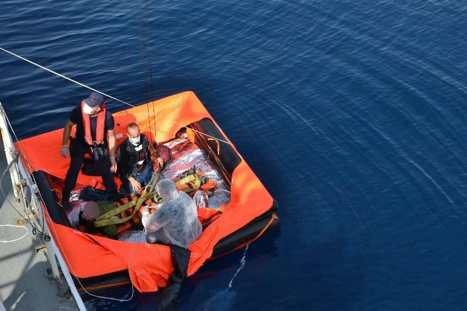
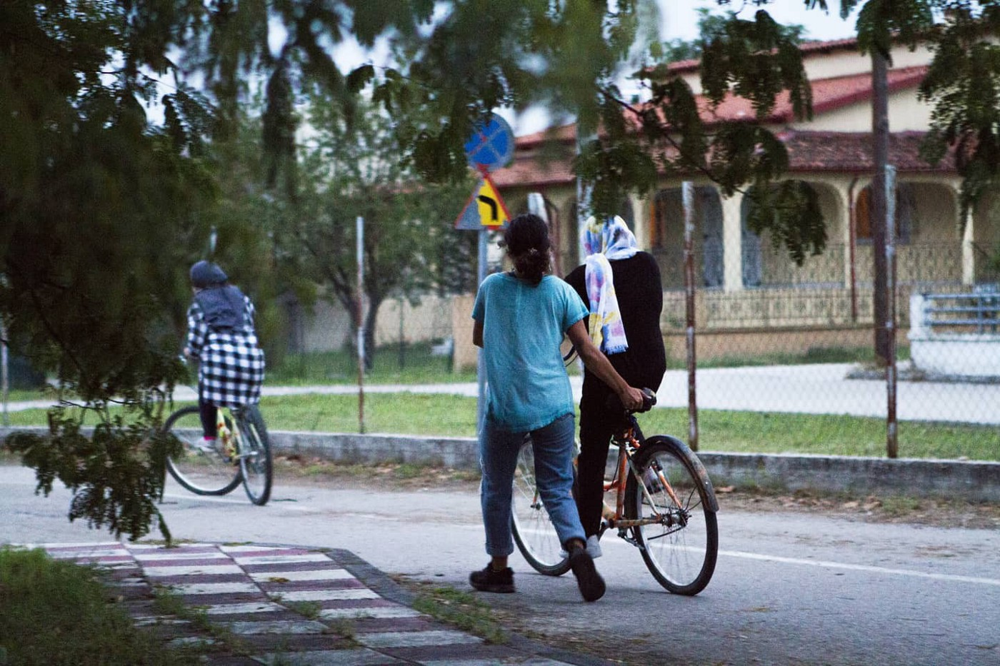
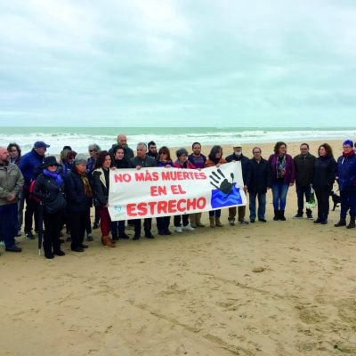

### AYS Daily Digest 05/10/20 Torturous attacks at port of Patras

[Are You Syrious?](@AreYouSyrious?source=post_page-----b3b958b1aa13--------------------------------)

[Oct 6](ays-daily-digest-05-10-20-torturous-attacks-at-port-of-patras-b3b958b1aa13?source=post_page-----b3b958b1aa13--------------------------------) · 12 min read

_Serious defeats for UK Immigration Bill // changes to Salvini’s decrees // more crossings and deaths from Yemen // fewer refugees in Germany now over past 9 years // over 20,000 deaths in Med since 2013 // and more…_

### FEATURE: TORTURE AT PORT OF PATRAS

These reports are according to testimony by dozens of people about incidents starting from [September 25, 2019 to September 8, 2020\.](https://www.efsyn.gr/node/262903) The testimonies were taken by volunteers of the organization No Name Kitchen and the Movement for the Defense of the Rights of Refugees and Immigrants/Women and published on [tetartopress\.gr](https://tetartopress.gr/limani-patras-apokalyptikes-martyries-gia-xylodarmoys-epitheseis-me-skyloys-kai-vasanismoys-metanaston/?fbclid=IwAR3MFPklo1KaY5Gd_egsayXe4v6FWPAqbu88KiZHfrdHMx2AcKXqaIBbvo8) \. Here are some of the horrible accounts:

> _“The three men entered the port of Patras and hid under a truck\. Eventually they were caught by two men, who were not wearing uniforms but had a dog with them and were riding in a patrol car\. The Afghans escaped but the two men stopped them after chasing them with the patrol car\. Then they started hitting them on the body with fists\. Then they took one of the three Afghans, immobilized his leg and one of them drove over the leg\. Then one of the two men turned the Afghan’s arm and tried to press it with the car\. “The Afghan managed to free himself and left limping\.”_ 

This is a common phenomenon apparently:

> _“The majority of the testimonies concern incidents of physical and verbal violence, as well as the destruction of the personal belongings of immigrants \. Reading them, one can easily find that all the violent incidents have nothing to do with preventing the entry of migrants into the port of Patras, as most of them took place when the migrants had already been arrested or were immobilized\._ 

> _Of the incidents recorded, more than 35 took place inside the port, 8 outside it \(in places where migrants live or on the road\), in two of them tasers were used while in at least 7 of them there is an attack and dog bites\. Typical are the photos included in the testimonies that show the signs of the dogs’ attacks\.”_ 

[Drownings](https://www.efsyn.gr/node/262903) were even reported:

> _“Also noteworthy is the complaint about the drowning of two Afghans, 21 and 22 years old, while their hands were handcuffed, which allegedly happened on July 7\. According to the interviewed volunteers, the report is the result of indirect testimony collected a week after the incident\. However, it could be considered credible as it was confirmed by different interviewees\.”_ 

Awful…something must be done to stop the violence at Patras and bring justice\!
### YEMEN
### > Eight people are dead & 12 are missing off Djibouti

The people were forced off a smuggler’s boat off the coast of Djibouti \(located in the Horn of Africa in East Africa\) \. There were 14 survivors and they are currently “receiving medical care\.” IOM reports that “some 2,000 migrants have arrived in Djibouti from Yemen in the past three weeks alone\.” Fleeing from war, this is a growing migration route, one we must pay attention to considering the worst humanitarian crisis in the world is happening in Yemen\.
### LEBANON

The Army is reporting that it just blocked a boat of 37 people, mostly Syrians, from leaving Tripoli to cross the Mediterranean to Cyprus\. People have increasingly been trying to cross on this route\. More [here](http://www.naharnet.com/stories/en/275485-army-blocks-migrants-risking-sea-crossing?fbclid=IwAR166rCA4J-iy0XcgiUqjpNiAoxoq07fBcoxQE6_4bUVEh75CNN2Ivaz3G8) \.
### SEA
### Over 20,000 people migrating have died in the Mediterranean since 2013

[We’ve](https://www.infomigrants.net/en/post/27731/more-than-20-000-migrants-died-in-mediterranean-since-2013?fbclid=IwAR0RhZ2g0uf41QOnSsafJgYWpJpIXyPCI_NFqXadPWPt1U78AmjnSlKPtzo) reached a new milestone…one we cannot remotely be proud of…

### GREECE
### Lesvos: Save Pikpa and daily life in “new Moria”

[Departures](https://www.thenationalherald.com/archive_general_news_greece/arthro/850_refugees_to_depart_from_lesbos_headed_for_mainland_greece-958640/?fbclid=IwAR2qSfZyLqr-hrHO7uqjOOUf_N7cPdRhjZAFUT2206G9ObO9HhESSlzSo9A) to mainland on Monday:

> _“ **Approximately 850 refugees with free\-movement permits are departing Lesvos on Monday night** for the port of Lavrion, in Attica, on board the ferry ‘Nissos Chios’\. They will then be transferred to accommodation facilities in mainland Greece, awaiting relocation to European countries through Greece’s agreements with several EU member states\._ 

> _This latest departure of refugees from Lesvos brings the total number of those remaining on the island to below 10,000 and those at the new refugee camp at Kara Tepe at below 8,000\. Another 720 refugees left Lesvos on the same ferry last Monday, as the Migration & Asylum Ministry’s effort to decongest the island continues, while some 300 were transferred on regular ferries Tuesday and Wednesday with the help of the UN High Commission for Refugees\.”_ 

**COVID cases on Lesvos:** 9 new cases announced on Monday\. This includes a pregnant woman\. More [here](https://www.stonisi.gr/post/11916/ekrhksh-kroysmatwn-koronoioy-sth-lesvo-ennea-astheneis-se-24-wres?fbclid=IwAR02SHqzXtlG7cm42wd7t8AXy3Ibf-eheG86GRjyz940VnqZ125Od-RYTN0) \.

**Update on the food situation** : _“A short update on the food situation in the new warehouse after Moria : 1\) There is only food once a day: Between 12:30 & 13:30 or 13:00 and 14:00\. 2\) When food is over, for many there is nothing and no alternative\. 3\) No electricity, so many have to cook on fires\.”_ More [here](https://twitter.com/f_grillmeier/status/1313176049350516738) \.

**Separate but \(never\) equal?** To enter Lidl in [Mytilene](https://www.kar.org.gr/2020/10/05/sto-lidl-tis-mytilinis-yparchoyn-dyo-oyres-mia-gia-eyropaioys-kai-mia-gia-prosfyges/?fbclid=IwAR3upuc9WZ1ZicGTd8UADzt57kYrAOhMLg0qCLbaa1A9FDisJpexQXHUZbU) there is one line for refugees and another for Greeks\. Racism is on full display…\.

**Update on checks:** _“Checks at the entrance to \#Moria2\. Leaving the camp could mean hours & hours of waiting to get in again\. Bags are thoroughly searched & ppl get checked with metal detectors like in a prison\. The result are often long lines up the main road leading to Mytilini\.”_ See video [here](https://twitter.com/DunyaCollective/status/1313154484256665604) \.

Some of you may have already heard of the [Dutch civilian plane](https://www.kathimerini.gr/society/561104653/mploko-se-ptisi-poy-naylosan-ollandoi-aktivistes-gia-ti-lesvo/?fbclid=IwAR3t-5o1x_Msfo61CDPKjylNUxMb770R1PI_1FKDJ1ywY2bqvCWTvrjbC5E) which landed in Athens and is trying to bring back refugees, bypassing Dutch government officials\. [Sumita Shah posted](https://www.facebook.com/groups/AthensVolunteersInformation/permalink/2230258197106465/) an elegant reminder of Athens volunteers’ stance on such matters:

> _“We were not supportive of these random actions previously and we continue to remain sceptical about this new action, that of taking an empty plane to try to take refugees in this way, without any proper discussion, viable strategy or considered plan\. It appears that the Dutch State of Secretary for Asylum, Ankie Broekers\-Knol had already rejected this plan on Friday\. This means that the Greek Govt could not release any refugees in their custody anyway\!_ 

> _We repeat the same messages that we outlined before\. While we are supportive of solidarity events which seek to raise awareness of the plight of refugees…we are not supportive of events which will raise false hopes and create unrest in an already vulnerable group of people\.”_ 

### ITALY
### The new Immigration Decree modifies Salvini’s decrees

Basically [major changes](https://www.redattoresociale.it/article/notiziario/migranti_ecco_come_il_nuovo_decreto_immigrazione_modifica_i_dl_salvini?fbclid=IwAR1pG6tEZgEaWkiZODZ93R9yAC6x-_6XfRH-IfSv-SCJw6ZxJV0CL6cZwks) occur regarding:
1. The old “protezione umanitaria” cancelled by the Salvini decree will be reinserted as a “special protection”
2. Local reception systems will be supported and rights such as medical assistance, language classes and legal services will be guaranteed to the asylum seeker
3. Even though the 1 million euro fine imposed by the Salvini decree is cancelled, NGOs can still be fined under certain circumstances \(so not great\)
4. Changes also regard the time people can spend in CPRs \(back to 90 days instead of 180\) and in the length of the process to get citizenship

News from the Med reporting on another tragedy: _“A 15\-year\-old unaccompanied refugee dies in a hospital in Palermo after not being treated during the 14\-day quarantine aboard the Allegra\. The 15\-year\-old migrant, who was sacked by the quarantine ship Allegra a few days ago, died at Ingrassia hospital in Palermo\. Last Saturday, the migrant had gone into a coma, same day explained Alessandra Puccio, the guardian of the unaccompanied minor\. The migrant had been quarantined on the ship for 15 days, although he was in a very serious state of health\.”_ More [here](https://www.facebook.com/NewsfromtheMed/posts/1052962511824011) \.

**New arrivals in Italy so far in 2020 have increased by [300%](https://www.infomigrants.net/en/post/27731/more-than-20-000-migrants-died-in-mediterranean-since-2013?fbclid=IwAR0RhZ2g0uf41QOnSsafJgYWpJpIXyPCI_NFqXadPWPt1U78AmjnSlKPtzo) compared to the same numbers from the same time period in 2019\.** Here are the latest numbers from UNHCR:
### SPAIN

Spanish media is reporting that:

> _“The group Caminando Fronteras has alerted the authorities in command of the boat rescue device in the Canary Islands on Monday that **there may be six boats with 274 people on board lost on that route since July** , according to information provided by the families\._ 

> _This NGO transmits to the Spanish emergency services almost daily alerts about the departure of boats to the Canary Islands from a vast stretch of coast that extends from Morocco to practically Senegal, information that helps the air and maritime means to establish the areas of search for immigrants\._ 

> _But almost also daily he receives calls from relatives of those who go on board these boats, especially when the hours and days begin to pass, there is no news that they have disembarked or been rescued and the mobile phones of those who tried to reach the Canary Islands for a long time stopped giving a signal\.”_ 

More [here](https://www.eldiario.es/canariasahora/365-dias-de-migraciones/caminando-fronteras-alerta-haber-seis-embarcaciones-perdidas-verano-ruta-canaria_132_6268869.html?fbclid=IwAR0ZNS6cuaLHDpzc3ZT2EkebU-3KT91sH1Ux_pl__WLKSS06lmqyUxdIStQ) \.
### GERMANY
### Germany’s refugee population decreases for the first time in 9 years

This fall is due to COVID restrictions and others losing their protection status, according to the Interior Ministry\. Many critics are saying that this shows how Germany is able to do more to evacuate people from Greece and Italy\. DW reports that the numbers include:

> _“In the first half of 2020, the total number of refugees decreased from about 1\.83 million at the end of 2019, to about 1\.77 million people, a decrease of around 62,000 people\. The figures emerged following an inquiry made by the socialist Left party regarding the number of migrants with secure housing and protection status\. According to the figures, there are currently around 1\.31 million refugees with secure residence in Germany — around 50,000 fewer than in the previous six months\.”_ 

### FRANCE

Reporting by the Independent elaborates that in Calais, the risks for children are only growing\. _“In some cases, during large\-scale evictions, children are transported by the French authorities to accommodation centres designed for adults, according to charity workers, who warn that this is fuelling the risk of exploitation and the potential for them to be lured in by smuggling gangs\. They said there was a “clear lack” of specialised identification of minors by the French authorities, who they said have a duty to protect these children during evictions yet do not always enact their responsibilities to identify minors prior to evictions taking place\.”_ More [here](https://www.independent.co.uk/news/world/europe/calais-child-refugees-children-channel-france-home-office-b555833.html?fbclid=IwAR1blZm3Lb0Ej7raR1Xypcvn1JlE1_LstPcqJyRHEqgOD1DPOm7ySllnMJU) \.

Please consider donating to [Care4Calais](https://care4calais.org/donate-now/?fbclid=iwar0qgxvskgvid_utw9x-zrwtqaxncqg3puozbzfjwyrb2jcrqmch4piy4_w) due to their urgent appeal\.
### EU

Many thorough analyses are coming out in regard to the new EU Pact on Migration and Asylum\. As one from [Open Democracy](https://www.opendemocracy.net/en/can-europe-make-it/the-eus-pact-against-migration-part-one/?fbclid=IwAR3K5ZxeCEH8-A0NzOMVQ7dm_dqS9A7xUjrqGPIx_ftCwc97aNh3qfAHESg) puts it _“The EU Commission’s proposal for a ‘New Pact for Migration and Asylum’ offers no prospect of ending the enduring mobility conflict, opposing the movements of illegalised migrants to the EU’s restrictive migration policies\.”_ As we reported on some of the recommendations to better the pact in our [Weekend 3–4/10/20 Digest](ays-weekend-digest-3-4-10-20-open-call-for-examples-of-human-itarian-crisis-when-strongly-39d203d6b83b) , the pact continues some dangerous precedents\. Here are some further analyses to check out:
1. [Open Democracy](https://www.opendemocracy.net/en/can-europe-make-it/the-eus-pact-against-migration-part-one/?fbclid=IwAR3K5ZxeCEH8-A0NzOMVQ7dm_dqS9A7xUjrqGPIx_ftCwc97aNh3qfAHESg) “The EU’s pact against migration, Part One”
2. Tony Barber’s opinion piece for the [Financial Times](https://www.ft.com/content/c50c6b9c-75a8-40b1-900d-a228faa382dc?fbclid=IwAR2p97X5iI7jSubMzSUbXdicCfEkq7tOqNZDLLcbEqsQ2rMvYgn3OJc8_u0) “EU’s new migrant ‘pact’ is as squalid as its refugee camps: Governments need to share responsibility for asylum seekers, beyond merely ejecting the unwanted”
3. [Migration Policy Institute](https://www.migrationpolicy.org/news/eu-pact-migration-asylum-bold-move-avoid-abyss?fbclid=IwAR2YPOalQQrVcAkUiayZRa_KAyPOIVsVCOLwE7HQaTslestGteJEIESdxTs) “The EU Pact on Migration and Asylum — A Bold Move to Avoid the Abyss?”
4. [MSF](https://www.msf.org/new-pact-same-misery-refugees-trapped-greek-islands?fbclid=IwAR2z0vLr_sSfNc3PHU9FvngT6PyIcRNtznJGB4JrciC2jjOjlyQr_-heTiQ) “Enough is enough: new pact, same misery for refugees”

### UK

### Over 100,000 people call for halting deportation of severely autistic man

[The Independent](https://www.independent.co.uk/news/uk/home-news/deportation-autistic-man-jamaica-osime-brown-home-office-b802158.html?fbclid=IwAR3fKoLdNWmv0sTsdkSWcJK2njUE286Y4fy8w4WgpLQe9kLszPznP_6Z1D4) is reporting that Brown is a “severely autistic Jamaican\-born UK resident\.” He is coming to the end of a five\-year prison sentence \(for stealing a phone…\) and is facing removal to Jamaica\. He has not been there since he was four years old\.

> _“The Home Office issued Brown with a removal notice in August 2018 on the basis of a series of criminal offences he committed as a teenager, notably the theft of a mobile phone under the controversial joint enterprise law\. He has been in jail since, and is currently at HMP Stocken in Rutland, where he has self\-harmed on a routine basis — sometimes to the point where he’s had hundreds of scars on his arms and body\._ 

> _Brown was set to be transferred directly from prison to a removal centre at the end of his sentence this week, but his lawyers intervened days before arguing that this would be unlawful because of his autism and recent heart problems he has been experiencing — at which point the Home Office said he could be released to his home\._ 

> _However, Brown is still facing removal\. A court hearing is set to take place in the coming weeks where his immigration solicitor will argue that deporting him to Jamaica will place him at risk\.”_ 

**DON’T LET THIS HAPPEN UK\! \! \!**
### The Lords defeat much of Boris Johnson’s flagship post\-Brexit immigration bill

Calls for unaccompanied children to be reunited with relatives living in the UK were supported\. [The Independent](https://www.independent.co.uk/news/uk/politics/brexit-immigration-bill-child-refugees-boris-johnson-b811658.html?fbclid=IwAR2Zg690KxssqD9Uz4jhpuwZQTajWrvQ6eC3H6SKewfZajxU6xP5mbqqxfo) is reporting that:

> _“The Lords overwhelmingly supported an amendment by Lord Dubs, who himself fled the Nazis as a child, to restore protections after the EU transition period ends later this year\. Before the vote Lord Dubs had asked: ‘Surely it is right that when there are young people who have got relatives here that family reunion must be a basic, basic thing that we should support?’_ 

> _The vote was one of a number of defeats home secretary Priti Patel suffered as peers considered the legislation in the Lords, just hours after she pledged to “fix” what she said was a broken asylum system\.”_ 

In summary, the three defeats of the bill in one day were as follows \(as laid out by [the Herald](https://www.heraldscotland.com/news/18771457.priiti-patels-flagship-immigration-bill-suffers-first-lords-defeats/?fbclid=IwAR2LnRubZFp8J_6gza39Zljmc5tTEiTUdT393WkGpxUvlYfqFZY5RpZ9okU) \):
1. “Peers backed **Labour’s demand for an independent review into the impact of the changes to social care** , after warnings that the bill would deter so\-called ‘low skilled’ workers which would include care workers\. There have been concerns the bill could fuel staff shortages and deepen the crisis facing the sector, already struggling with the coronavirus crisis\.”
2. “312 peers accepted a cross\-party amendment against imposing financial restrictions on UK citizens who return to the country with their EU families from March 2022\.”
3. “Peers accepted an amendment by Labour peer Lord Dubs to give children in care and care\-leavers automatic and indefinite leave to remain under the EU settlement scheme\.”

The Home Secretary, [Priti Patel](https://www.freemovement.org.uk/priti-patel-party-conference-speech-2020-full-text/?fbclid=IwAR35n3tdur6KLXpfdzfPX5R-9GniSS9XrbLCdnka0bta-PTPxQ0325UlDF4) , gave her keynote speech about the bill a couple days before \(you can read it [here](https://www.freemovement.org.uk/priti-patel-party-conference-speech-2020-full-text/?fbclid=IwAR35n3tdur6KLXpfdzfPX5R-9GniSS9XrbLCdnka0bta-PTPxQ0325UlDF4) \) \. [Byline Times](https://bylinetimes.com/2020/10/02/home-office-priti-patel-windrush-hostile-environment-prison-island/?fbclid=IwAR2LnRubZFp8J_6gza39Zljmc5tTEiTUdT393WkGpxUvlYfqFZY5RpZ9okU) published an editorial criticizing her world view on Friday, condemning her stance on asylum seekers being one of the greatest threats to the UK right now, instead of, perhaps “Coronavirus, an imminent economic catastrophe, or Russian interference in democracy\.” Certainly the Home Office must now accept these defeats on the bill\.

Social affairs correspondent May Bulman for the Independent wrote a couple of articles this week with interviews from people stuck in France, hoping to cross the English Channel\. Reporting such as this must be taken seriously by the English public considering:

> _“Recent polling found that nearly half of the British public had little or no sympathy for asylum seekers making the desperate journey across the Channel from France, while some in the public sphere have claimed that the majority of those making the desperate journey are “economic migrants” rather than refugees\.”_ 

You can find her interviews [here](https://www.independent.co.uk/news/world/europe/channel-crossing-border-calais-economic-migrants-refugees-b555289.html?fbclid=IwAR2-_jhhLLH1_oOi7PXlvAcjwCv8g0o0yyEou1hyc8LxEDZEZnIdHqFu9SM) and [here](https://www.independent.co.uk/news/world/europe/migrant-channel-crossing-refugee-crisis-calais-b431644.html?fbclid=IwAR1njGCaMUwybLHpAG6PRY5UNaf8JB8l7VLgT4pZ039h9QSLmKSgpeAf1mw) \.
### Welcome event for asylum seekers at Napier Barracks in Folkestone, October 17th\.

“Attendees will arrive in groups of six maximum and are invited to bring home\-made signs with messages of support\. Cards will also be available for people wanting to write a message on the day\.” Find out more [here](https://www.kentonline.co.uk/folkestone/news/welcome-meeting-will-show-support-for-asylum-seekers-234960/?fbclid=IwAR0uWdZeFsoa_tRK4f2DByF5BB83ay-qNn5l_BoDd8RnVDWlqqMdDSqLdPM) \.

**Find daily updates and special reports on our [Medium page](https://medium.com/are-you-syrious) \.**

**If you wish to contribute, either by writing a report or a story, or by joining the info gathering team, please let us know\.**

**We strive to echo correct news from the ground through collaboration and fairness\. Every effort has been made to credit organisations and individuals with regard to the supply of information, video, and photo material \(in cases where the source wanted to be accredited\) \. Please notify us regarding corrections\.**

**If there’s anything you want to share or comment, contact us through Facebook, Twitter or write to: areyousyrious@gmail\.com**
### Sign up for AYS Daily Newsletter
### By Are You Syrious?

Daily news digests from the field, for volunteers, people on the move, journalists, and the general public [Take a look](/are-you-syrious/newsletters/ays-daily-newsletter?source=newsletter_v3_promo--------------------------newsletter_v3_promo-----------)

_Converted [Medium Post](https://medium.com/are-you-syrious/ays-daily-digest-05-10-20-torturous-attacks-at-port-of-patras-9333112a9b56) by [ZMediumToMarkdown](https://github.com/ZhgChgLi/ZMediumToMarkdown)._
