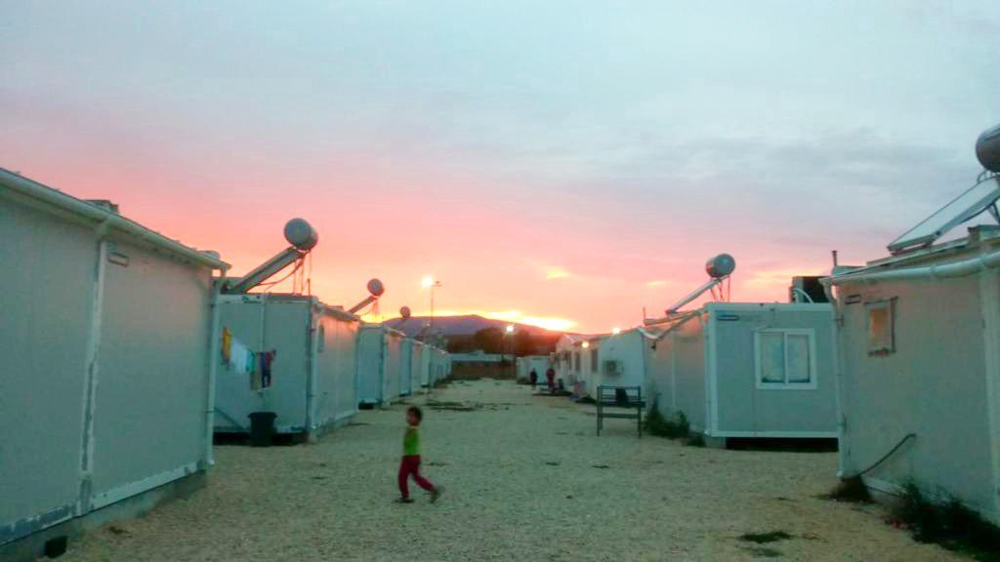

### AYS Daily Digest 06/10/20: Katsikas under lockdown
### Unprecedent measure as covid infections rise // NGOs demand investigations on pushbacks and unlawful border violence // Italy modifies asylum decree // EU spends 55 million in Libyan Coast Guard // 2500 pushbacks to Niger // Poor and migrant population in Paris exposed to Covid

[Are You Syrious?](@AreYouSyrious?source=post_page-----24e33f6c356f--------------------------------)

[Oct 7](ays-daily-digest-06-10-20-katsikas-under-lockdown-24e33f6c356f?source=post_page-----24e33f6c356f--------------------------------) · 6 min read

### Greece

The Katsikas camp in Ionina has been placed under complete lockdown unprecedently, Soup and Socks [writes](https://soupandsocks.eu/2020/10/06/the-lock-down-of-a-camp-without-a-single-case-what-is-going-on-in-katsikas/?fbclid=IwAR3eYphNAW0MnxiGgdqE_kkUrZIcOIZumRJKT517MVVjUvmCtvZeANx7oKw) \. According to the group, police arrived in the morning and blocked the entries and exits of the facility\. Apparently, this measure comes with a rising number of Covid cases in Ionnina\. Wearing masks in public is now mandatory and a midnight curfew is in place\. Soups and Socks adds:

> _However, not a single case of Covid\-19 has been detected within the camp of Katsikas\. Even at the height of the national confinements earlier this year, residents of the camp were treated no different from the other residents of the region and were allowed to leave the camp, provided they could give a valid reason for doing so, selected from a list of 5 options\._ 

Additionally, the group criticizes that no improvements have been made in the structures of Katsikas\. The restrictions put in place are also questionable, when free movement is still allowed for local residents\. Apparently, these measures should only be valid for six days, but there is no guarantee that the period will not be extended\.

Journalist Franziska Grillmeier [reports](https://twitter.com/f_grillmeier/status/1313409797748854789?fbclid=IwAR2k3YYLiEknxV8YTrZa3sKgFnu-J3cQ0dLSBA0iInQtR-i-WrJMDM9rMYU) that the last 60 people from the quarantine facility Megala Therma in the North of Lesvos have been transferred to the new hotspot — some of them were held in the facility for months without adequate support\. Meanwhile, a group of 25 people who arrived on the island have today been taken to this site\. At least five people are still missing, writes [ABR](https://www.facebook.com/AegeanBoatReport/posts/938313790025059) \. Some 1800 people have been transferred from Lesvos to the mainland today, according to [IOM](https://twitter.com/IOMatEU/status/1313391201131859969?fbclid=IwAR2Ql-1gvMTGWgID8EluSosoR_yJM42lBEYo0BM4pw36fZD7XUBCzF95wA4) \.

Following pushbacks and border violence, several NGOs [urge](https://www.hrw.org/news/2020/10/06/open-letter-members-hellenic-parliament-calling-investigation-border-abuses) the Greek parliament to investigate the reports and examine if they are in fact part of a government policy — which would be against several laws\.

In the new Moria camp, [reportedly](https://twitter.com/AVeizis/status/1313518091968675846?s=20&fbclid=IwAR13vDV6dv4J-e-8OL8eQ0hvVFBCt5QnKJW64kkXuCMsCl21G8uhCK8suIk) eleven new Covid\-19 cases have been detected today\.

According to [Refugee Info](https://www.facebook.com/refugee.info/posts/3429212800472176) , the following Asylum Offices will be closed temporarily from 6th to 9th October:
- Attica Regional Office,
- Alimos Regional Office,
- Piraeus Regional Office,
- Asylum Unit for the International Protection applications of Pakistani Nationals;
- Asylum Unit of Fast Track international protection applications
- Asylum Unit for Beneficiaries of International Protection\.

### Italy

The Italian government [announced](https://www.tagesschau.de/ausland/italien-dekret-salvini-101.html?fbclid=IwAR0azAy8hEDqEitfk9ebWX5lZy0ipmipo9loRfQIF3U33-xB6bJnAQPKeL4) modifications on their asylum policy\. It includes, that people who fear torture or inhumane treatment in their country of origin should get humanitarian protection in the county\. Additionally, the right for integration was re\-implemented\. The new decree further states that there is a constitutional obligation for sea rescue and NGO rescue ships should not be seized anymore\. Additionally, the fine for NGOs bringing people to Italian shores without permission has been lowered to 50,000 Euro\. With this decree, the government basically turned back from the racist right\-wing politics of the former interior minister Salvini\. However, MSF [criticized](https://twitter.com/MSF_Sea/status/1313552628517867521?s=20&fbclid=IwAR1p7wvgazGiop7WS_3TH7-Ab2B0QMs63UcF7n8Osi78CBgy5Ri_U8CfydU) it as a “distraction”, as people are still drowning in the Mediterranean, and there remains no govermental sea rescue programme\. Pensare Migrante highlights that the decree has been modified but not abolished; he adds that too many structural interventions are still missing\.

The UNHCR in Italy [stated](https://www.infomigrants.net/en/post/27755/unhcr-italy-denounces-problems-in-north-east-for-migrants?fbclid=IwAR1zvgUu_Gjbb3pnQy20Q2jjL6VqzH4rdXdgvib0J42n97gII93tMImVeXY) that the situation for people on the move in Northern Italy is “under control” but “more should be done”\. Speaking to the ANSA, the UN agency’s representative Chiara Cardoletti said that the coronavirus makes the situation more complicated\. However, compared to Sicily, the system of arrivals is less structured: she said, “there is a lot of confusion regarding readmissions\.” Services and the response in general are not “the most adequate”, Cardoletti sated\. She also announced that the agency will boost its presence in Trieste\.
### Sea

The European Commission has stated that it is currently supporting the Lybian Coast Guard \(LCG\) with 57,2 million Euro\. Compared to this, the commission has only allocated 900,000 Euro for ‘safeguarding human rights’\.

In an [open letter](https://www.opendemocracy.net/en/can-europe-make-it/joint-statement-sea-rescue/?fbclid=IwAR1SneD5wQvceuIWd7R17Mkz4jM1elXFr5avR0gi0_clME2A6mSmNCynTlw) , several NGOs urge the European Union to address current and future migration challenges\. In the letter, they demand that 400 rescued people on board three boats are allowed to disembark at a safe harbor\. The UN’s Human Rights Office \(OHCHR\) has also [spoken about](https://www.infomigrants.net/en/post/27759/un-calls-for-urgent-action-to-stop-horrors-faced-by-migrants-in-mediterranean?fbclid=IwAR3KbC7fHF2v1bBTXMUvHPPiP6ufFb7XOJByOP__5-gD-KYekM5nHHmRF80) ‘’unimaginable horrors’’ people are facing in Libya and while trying to cross the Mediterranean\.

Meanwhile, Sea Watch has [documented](https://sea-watch.org/en/crimes-of-malta-05/?fbclid=IwAR3Nuilaqn9sMrwEbKaJpoleqde_qVug7l3zMLg6zfrqQUZZLNvUx_5LPCQ) another violation of international law, which occurred when an Maltese aircraft guided the so\-called Libyan Coast Guard to a boat in distress to pull it back illegally\. Sea\-Eye also [published](https://sea-eye.org/illegaler-push-back-durch-die-sogenannte-libysche-kustenwache/?fbclid=IwAR3Q7M81eTYMcJ8ZnNq2CRevedbiMw7IdetKzu1oCwjJFUVsid-Cx-VKFMw) an incident from September, when a pull\-back happened\.
### [Log into Facebook \| Facebook](https://www.facebook.com/IOMLibya/posts/1797755037052112)
### [Log into Facebook to start sharing and connecting with your friends, family, and people you know\.](https://www.facebook.com/IOMLibya/posts/1797755037052112)
#### [www\.facebook\.com](https://www.facebook.com/IOMLibya/posts/1797755037052112)

Salvamento Maritimo has rescued 67 people off the Canary islands\. The people rescued were transferred to Los Cristianos where they received health support\. According to [ABC Spain](https://www.abc.es/espana/abci-rescatan-patera-67-migrantes-56-millas-canarias-202010061033_noticia.html?ref=https://l.facebook.com/) all were in good condition\.
### Sahara

Alarmphone Sahara [highlights](https://alarmephonesahara.info/fr/reports/nouvelle-vague-d-expulsions-plus-que-2500-citoyen-ne-s-de-pays-subsahariens-expulse-e-s-de-l-algerie-et-du-maroc-en-grande-echelle?fbclid=IwAR12eeQtqZei88QUBVsREa9HdODgCtTl2ojb_8Vg5knD3V_yLgOl-yxOstw) that Algeria is still conducting unlawful pushbacks to Niger\. In just one week, more than 2400 people were expelled\.
### Serbia

Azil u Srbiji Asylum Protection in Serbia reports on a case of police violence at the Serbian\-Hungarian border\.
### Bosnia

No Name Kitchen estimates that an additional 400 people are left without basic assistance following the evictions of the camps Bira and Miral\. The overall number of people evicted is around 3000\. “The current situation will inevitably exacerbate an already difficult situation and could lead to further tension,” NNK warns\. Hence, they ask for donations — food, clothes and camping equipment\.
### [Log into Facebook \| Facebook](https://www.facebook.com/NoNameKitchenBelgrade/posts/1089667061431577)
### [Log into Facebook to start sharing and connecting with your friends, family, and people you know\.](https://www.facebook.com/NoNameKitchenBelgrade/posts/1089667061431577)
#### [www\.facebook\.com](https://www.facebook.com/NoNameKitchenBelgrade/posts/1089667061431577)
### Germany

The relocation of the people from Moria has been delayed\. DPA [reports](https://www.zeit.de/news/2020-10/06/aufnahme-von-fluechtlingen-aus-griechenland-zieht-sich-hin?fbclid=IwAR3eYphNAW0MnxiGgdqE_kkUrZIcOIZumRJKT517MVVjUvmCtvZeANx7oKw) that so far only 33 people from seven families have arrived in Rhineland Palatine, while 33 more are still expected\. It remains unclear when they will arrive\. Twelve are expected to come by plane on Wednesday\. The federal government is responsible for the relocations and decided to relocate 243 children in need of medical treatment together with their families\. While another 150 unaccompanied minors should be transferred, not even one of the six has arrived so far in the federal state\. Two of them are expected this Wednesday, however\. In another programme, the federal government agreed to take 1553 recognized refugees from Greece — the first flight is scheduled for Saturday\.
### Belgium

The new Secretary of State for Asylum and Migration, Sammy Mahdi, [said](https://www.rtbf.be/info/belgique/detail_pour-le-nouveau-secretaire-d-etat-a-l-asile-et-a-la-migration-sammy-mahdi-il-y-aura-des-centres-fermes-supplementaires?id=10600275&fbclid=IwAR2ZcMumZifEcCN9KJPbX_m6w9NyJicfEL4abrvXW17EC4ol_t8pLaT571M) Belgium will open additional detention centers for rejected asylum seekers\. At the same time, Brussels Court of First Instance has [condemned](https://www.brusselstimes.com/news/belgium-all-news/justice-belgium/134431/asylum-seekers-belgium-migration-maggie-de-block-theo-francken-fedasil-brussels/?fbclid=IwAR2IIG9dsz5heULS7_7hiG-vL18DQSNLJb_HAmaf5pvZ0hAUtnT4vDQoniQ) the Belgian state for not directly offering reception to asylum seekers who had electronically informed the Aliens Office \(AO\) that they were seeking international protection\.
### France

A study conducted by MSF has shown that poor people and migrants in Paris show higher infection rates than other groups\. “The rates ranged between 18–94% positive results, said the charity, depending on the center of testing”, writes [Infomigrants](https://www.infomigrants.net/en/post/27768/msf-study-migrants-and-the-poor-showing-higher-coronavirus-infection-rates-in-paris?fbclid=IwAR0TOqLRPxLkYWiss1Sg2iBLAPanM6n4_aubwYJ6-Gnpg4lGq91w70rX7t4) \. In emergency accommodation centers, the rate was between 23 and 62 percent\. At the food distribution 18–25 percent\. Shared accomodations and coming into contact with a lot of different people increases the risk of an infection, the study concluded\.
### Iceland

Minister of Justice, Áslaug Arna Sigurbjörnsdóttir, has been [criticized](https://grapevine.is/news/2020/10/06/minister-of-justice-under-fire-for-refugee-camp-proposal/?fbclid=IwAR0Glpc2judBquuTpU9iLEVd2EVa3uuam79lrWQHEQ_EgSPIQtYygaWl7kk) after suggesting demarcation areas for refugees who are about to be deported\.

**Find daily updates and special reports on our [Medium page](https://medium.com/are-you-syrious) \.**

**If you wish to contribute, either by writing a report or a story, or by joining the info gathering team, please let us know\.**

**We strive to echo correct news from the ground through collaboration and fairness\. Every effort has been made to credit organisations and individuals with regard to the supply of information, video, and photo material \(in cases where the source wanted to be accredited\) \. Please notify us regarding corrections\.**

**If there’s anything you want to share or comment, contact us through Facebook, Twitter or write to: areyousyrious@gmail\.com**

Following

_Converted [Medium Post](https://medium.com/are-you-syrious/ays-daily-digest-06-10-20-katsikas-under-lockdown-b8a18eb4785c) by [ZMediumToMarkdown](https://github.com/ZhgChgLi/ZMediumToMarkdown)._
